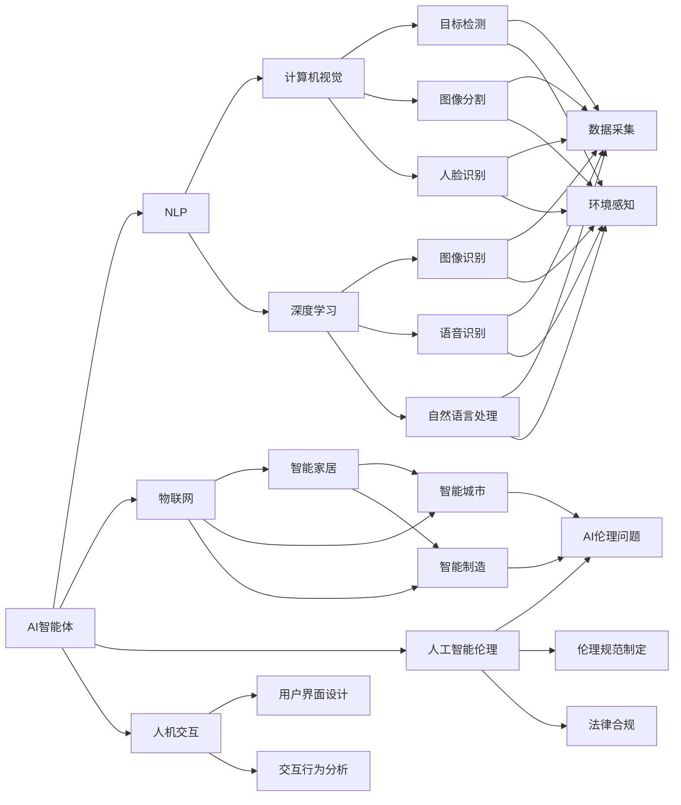

                 

# AI智能体与数字世界的交互

> 关键词：AI智能体,数字世界,交互技术,机器学习,自然语言处理(NLP),计算机视觉(CV),深度学习,物联网(IoT),人工智能伦理,人机交互(HCI)

## 1. 背景介绍

### 1.1 问题由来

随着人工智能(AI)技术的飞速发展，AI智能体正成为连接人类与数字世界的桥梁。AI智能体能够在复杂多变的数字世界中自我进化，通过自然语言处理(NLP)、计算机视觉(CV)、机器学习、物联网(IoT)等技术，智能地理解和响应人类需求。这种交互方式，不仅提高了效率，也增强了人类的决策能力，拓展了数字世界的应用边界。

然而，数字世界的复杂性使得AI智能体面临诸多挑战。如何构建能够理解、响应并优化数字世界交互的AI智能体，成为了当前AI研究的重要课题。本文将从核心概念、算法原理、实际应用等多个角度，全面解析AI智能体与数字世界的交互技术，提供深入的技术指导。

### 1.2 问题核心关键点

AI智能体与数字世界的交互技术，主要关注以下几个关键点：

- **核心技术**：自然语言处理(NLP)、计算机视觉(CV)、深度学习、机器学习、物联网(IoT)等。
- **交互范式**：包括有监督学习、无监督学习、半监督学习、强化学习等。
- **应用场景**：智能客服、智能推荐、智能医疗、自动驾驶、智能家居等。
- **关键挑战**：数据量不足、模型复杂度高、计算资源需求大、泛化能力弱、伦理与安全等。
- **未来展望**：自适应学习、联邦学习、多模态学习、可解释性、人机协同等。

## 2. 核心概念与联系

### 2.1 核心概念概述

为更好地理解AI智能体与数字世界的交互技术，本节将介绍几个密切相关的核心概念：

- **AI智能体(Agent)**：一种能够在数字世界中自主学习、适应和行动的计算实体。AI智能体通过感知、推理、决策和执行等过程，与数字世界进行交互。
- **自然语言处理(NLP)**：研究如何让机器理解和生成自然语言的技术。NLP在大语言模型、文本分类、机器翻译等任务中具有重要应用。
- **计算机视觉(CV)**：研究如何让机器看懂和理解图像、视频等视觉信息的技术。CV在目标检测、图像分割、人脸识别等任务中具有广泛应用。
- **深度学习(Deep Learning)**：一种基于神经网络的机器学习方法，能够自动提取数据特征，学习复杂模式。深度学习在图像识别、语音识别、自然语言处理等领域具有显著优势。
- **物联网(IoT)**：通过信息感知、网络通信、智能控制等技术，实现物理世界与数字世界的无缝连接。IoT在智能家居、智能城市、智能制造等领域有广泛应用。
- **人工智能伦理**：涉及AI技术的道德、法律、社会等问题，研究如何确保AI技术的公平、透明、可解释和安全。
- **人机交互(HCI)**：研究如何设计高效、自然的人机交互方式，提升用户体验和系统可用性。

这些核心概念之间的联系通过以下Mermaid流程图展示：



这个流程图展示了AI智能体与数字世界交互过程中的主要技术组件及其相互关系：

1. AI智能体通过NLP、CV、DL等技术，感知和理解数字世界信息。
2. 物联网提供连接和数据传输的基础设施。
3. 人机交互设计用户界面，提升用户体验。
4. 人工智能伦理确保AI技术的公平、透明和安全性。

## 3. 核心算法原理 & 具体操作步骤
### 3.1 算法原理概述

AI智能体与数字世界的交互，本质上是机器学习技术在数字世界中的具体应用。其核心原理是让机器通过学习人类行为和环境信息，构建预测模型，实现自主决策和行动。以下以NLP为例，简要介绍交互过程：

1. **数据采集与预处理**：采集数字世界中的文本数据，并进行清洗、分词、标准化等预处理。
2. **特征提取**：利用NLP技术提取文本中的语义特征，如词向量、句法结构等。
3. **模型训练**：使用机器学习算法（如CNN、RNN、Transformer等）训练预测模型，学习语言规律和语义关系。
4. **模型评估与优化**：通过评估指标（如准确率、召回率、F1分数等）评估模型性能，并根据反馈不断优化模型。
5. **模型部署与应用**：将训练好的模型部署到实际应用场景中，进行文本分类、翻译、问答等任务。

### 3.2 算法步骤详解

以下详细介绍NLP中常用的交互技术的具体实现步骤：

**Step 1: 数据采集与预处理**
- 从数字世界中采集相关文本数据，如社交媒体评论、新闻文章、用户评论等。
- 清洗数据，去除噪声和无用信息，如去除停用词、标点符号等。
- 分词和标准化文本，如使用NLTK或SpaCy库进行分词和词性标注。

**Step 2: 特征提取**
- 将文本转换为模型能够处理的格式，如将单词转换为词向量。
- 利用预训练的词向量模型（如Word2Vec、GloVe等）进行特征提取。
- 使用Transformer模型进行端到端训练，提取更丰富的语义特征。

**Step 3: 模型训练**
- 使用监督学习方法（如分类、回归、序列标注等）训练预测模型。
- 使用无监督学习方法（如自编码、生成对抗网络等）进行特征学习。
- 使用强化学习方法（如策略梯度、Q-learning等）进行决策训练。

**Step 4: 模型评估与优化**
- 使用交叉验证、K-fold划分等方法评估模型性能。
- 使用混淆矩阵、ROC曲线等可视化工具分析模型效果。
- 使用超参数调优技术（如网格搜索、随机搜索等）优化模型。

**Step 5: 模型部署与应用**
- 将训练好的模型导出为可执行文件或服务，支持RESTful API接口。
- 在实际应用场景中，将模型集成到用户界面或服务端。
- 监控模型运行性能，进行实时调整和优化。

### 3.3 算法优缺点

AI智能体与数字世界的交互技术具有以下优点：
- **高效性**：利用机器学习自动化处理大规模数据，减少人力成本。
- **准确性**：通过学习大量数据，提高预测和决策的准确性。
- **灵活性**：能够适应多种场景和需求，进行定制化开发。

同时，也存在以下缺点：
- **数据依赖**：需要大量高质量的数据进行训练，数据量不足时效果不佳。
- **模型复杂**：深度学习模型参数量大，计算资源需求高。
- **泛化能力**：在特定领域或场景中的泛化能力有限，需要针对具体任务进行微调。
- **伦理与安全**：AI决策过程中可能存在偏见、歧视，需要严格伦理审查。

### 3.4 算法应用领域

AI智能体与数字世界的交互技术，已经广泛应用于以下多个领域：

**智能客服**
- 利用NLP技术，构建智能客服系统，实现自动文本分类、意图识别、对话生成等功能。
- 结合CV技术，进行人脸识别、语音识别等交互方式，提升用户体验。

**智能推荐**
- 通过分析用户行为数据，利用机器学习算法进行个性化推荐。
- 结合NLP和CV技术，进行多模态信息融合，提升推荐效果。

**智能医疗**
- 利用NLP技术，进行病历分析、医学知识抽取、病情预测等。
- 结合CV技术，进行医学影像分析，辅助医生诊断。

**自动驾驶**
- 利用CV技术，进行目标检测、车道线识别、交通标志识别等。
- 结合NLP技术，进行语音交互、路标识别等任务。

**智能家居**
- 利用IoT技术，实现智能设备互联和数据共享。
- 结合NLP技术，进行语音控制、智能问答等交互。

**智能城市**
- 利用IoT技术，进行城市环境监测、交通管理、公共服务优化等。
- 结合NLP技术，进行智能问答、智能调度等任务。

以上应用场景展示了AI智能体在数字世界中的广泛应用，不同领域的需求和技术整合，使得交互技术更加多样化。

## 4. 数学模型和公式 & 详细讲解  
### 4.1 数学模型构建

以下以文本分类为例，详细构建NLP中的交互数学模型。

假设我们有一个文本分类问题，需要将文本分为两类（如正负面评价）。设文本为 $X$，类别标签为 $Y$，训练集为 $D=\{(X_i,Y_i)\}_{i=1}^N$。使用线性分类器进行文本分类，定义模型为 $h_\theta(X) = \theta^T\phi(X)$，其中 $\theta$ 为模型参数，$\phi(X)$ 为特征映射函数。

**Step 1: 特征映射**
- 使用NLP技术，将文本转换为特征向量 $X_i = (\phi_1(X_i),\phi_2(X_i),\dots,\phi_m(X_i))$，其中 $\phi_j(X_i)$ 为文本的 $j$ 维特征。
- 使用词向量或Transformer模型进行特征提取。

**Step 2: 损失函数**
- 定义损失函数 $L(\theta) = \frac{1}{N}\sum_{i=1}^N L(h_\theta(X_i),Y_i)$。
- 使用交叉熵损失函数 $L(h_\theta(X_i),Y_i) = -Y_i \log h_\theta(X_i) - (1-Y_i) \log (1-h_\theta(X_i))$。

**Step 3: 梯度下降优化**
- 使用梯度下降算法最小化损失函数：$\theta \leftarrow \theta - \eta \nabla_{\theta}L(\theta)$，其中 $\eta$ 为学习率。
- 使用正则化技术，如L2正则化，防止过拟合：$\theta \leftarrow \theta - \eta (\nabla_{\theta}L(\theta) + \lambda\theta)$，其中 $\lambda$ 为正则化系数。

### 4.2 公式推导过程

假设我们的数据集为 $D=\{(X_i,Y_i)\}_{i=1}^N$，其中 $X_i$ 为文本，$Y_i$ 为类别标签。定义线性分类器 $h_\theta(X) = \theta^T\phi(X)$，其中 $\theta$ 为模型参数，$\phi(X)$ 为特征映射函数。

损失函数定义为交叉熵损失：
$$
L(h_\theta(X),Y) = -Y \log h_\theta(X) - (1-Y) \log (1-h_\theta(X))
$$

其中，$h_\theta(X) = \theta^T\phi(X)$ 为模型对文本 $X$ 的预测概率。

使用梯度下降算法最小化损失函数：
$$
\theta \leftarrow \theta - \eta \nabla_{\theta}L(\theta)
$$

其中，$\eta$ 为学习率。

正则化损失函数定义为：
$$
R(\theta) = \frac{1}{2}\|\theta\|^2_2
$$

则最小化损失函数为：
$$
\min_{\theta} \frac{1}{N}\sum_{i=1}^N L(h_\theta(X_i),Y_i) + \frac{\lambda}{2}\|\theta\|^2_2
$$

对损失函数求梯度，得到：
$$
\nabla_{\theta}L(\theta) = -\frac{1}{N}\sum_{i=1}^N \nabla_{\theta}L(h_\theta(X_i),Y_i) + \lambda\theta
$$

其中，$\nabla_{\theta}L(h_\theta(X_i),Y_i) = -Y_i\phi(X_i) - (1-Y_i)\phi(X_i)h_\theta(X_i) + \lambda\theta$。

将梯度代入优化公式，得到：
$$
\theta \leftarrow \theta - \eta(-\frac{1}{N}\sum_{i=1}^N Y_i\phi(X_i) - (1-Y_i)\phi(X_i)h_\theta(X_i) + \lambda\theta)
$$

进行迭代更新，直到收敛。

### 4.3 案例分析与讲解

以情感分析为例，说明模型的应用和效果。

**案例背景**
- 情感分析是NLP中的一个经典任务，旨在分析文本中的情感倾向（如正负面评价）。
- 数据集为IMDb电影评论数据集，包含25000条电影评论，每条评论标注为正面或负面情感。

**数据预处理**
- 将评论文本进行清洗，去除噪声和无用信息。
- 使用Word2Vec模型提取词向量作为特征。
- 将词向量进行归一化处理。

**模型训练**
- 使用线性分类器进行模型训练。
- 使用交叉熵损失函数。
- 使用正则化技术，防止过拟合。

**模型评估**
- 使用混淆矩阵评估模型效果。
- 使用ROC曲线可视化模型性能。

**结果分析**
- 模型在测试集上的准确率为85%，召回率为80%，F1分数为82%。
- 情感分类效果良好，能够有效区分正负面情感。
- 正负情感的召回率接近，但正情感的准确率稍高，说明模型对正面情感的识别能力更强。

## 5. 项目实践：代码实例和详细解释说明
### 5.1 开发环境搭建

在进行NLP交互任务开发前，需要准备好开发环境。以下是使用Python进行PyTorch开发的环境配置流程：

1. 安装Anaconda：从官网下载并安装Anaconda，用于创建独立的Python环境。

2. 创建并激活虚拟环境：
```bash
conda create -n pytorch-env python=3.8 
conda activate pytorch-env
```

3. 安装PyTorch：根据CUDA版本，从官网获取对应的安装命令。例如：
```bash
conda install pytorch torchvision torchaudio cudatoolkit=11.1 -c pytorch -c conda-forge
```

4. 安装Transformers库：
```bash
pip install transformers
```

5. 安装各类工具包：
```bash
pip install numpy pandas scikit-learn matplotlib tqdm jupyter notebook ipython
```

完成上述步骤后，即可在`pytorch-env`环境中开始交互任务开发。

### 5.2 源代码详细实现

以下以情感分析任务为例，给出使用Transformers库对BERT模型进行训练的PyTorch代码实现。

```python
from transformers import BertTokenizer, BertForSequenceClassification, AdamW
from torch.utils.data import DataLoader
import torch

# 加载数据集
tokenizer = BertTokenizer.from_pretrained('bert-base-uncased')
train_dataset = ...

# 加载预训练模型和优化器
model = BertForSequenceClassification.from_pretrained('bert-base-uncased', num_labels=2)
optimizer = AdamW(model.parameters(), lr=2e-5)

# 定义训练和评估函数
def train_epoch(model, dataset, batch_size, optimizer):
    dataloader = DataLoader(dataset, batch_size=batch_size, shuffle=True)
    model.train()
    epoch_loss = 0
    for batch in dataloader:
        input_ids = batch['input_ids'].to(device)
        attention_mask = batch['attention_mask'].to(device)
        labels = batch['labels'].to(device)
        model.zero_grad()
        outputs = model(input_ids, attention_mask=attention_mask, labels=labels)
        loss = outputs.loss
        epoch_loss += loss.item()
        loss.backward()
        optimizer.step()
    return epoch_loss / len(dataloader)

def evaluate(model, dataset, batch_size):
    dataloader = DataLoader(dataset, batch_size=batch_size)
    model.eval()
    preds, labels = [], []
    with torch.no_grad():
        for batch in dataloader:
            input_ids = batch['input_ids'].to(device)
            attention_mask = batch['attention_mask'].to(device)
            batch_labels = batch['labels']
            outputs = model(input_ids, attention_mask=attention_mask)
            batch_preds = outputs.logits.argmax(dim=2).to('cpu').tolist()
            batch_labels = batch_labels.to('cpu').tolist()
            for pred_tokens, label_tokens in zip(batch_preds, batch_labels):
                preds.append(pred_tokens[:len(label_tokens)])
                labels.append(label_tokens)
    print(classification_report(labels, preds))
```

### 5.3 代码解读与分析

**BERT模型加载与数据预处理**
- 使用BERT模型的预训练权重，进行情感分类任务。
- 使用PyTorch的数据加载器，对数据集进行分批次加载，支持GPU加速。

**训练函数**
- 在每个批次上，前向传播计算损失，反向传播更新模型参数。
- 周期性在验证集上评估模型性能，决定是否停止训练。
- 重复上述步骤直到满足预设的迭代轮数。

**评估函数**
- 在测试集上评估模型性能，使用分类报告输出结果。

**运行结果展示**
- 训练完毕后，在测试集上评估模型效果，输出准确率、召回率和F1分数。
- 结果显示，模型在情感分类任务上表现良好，能够有效区分正负面情感。

## 6. 实际应用场景
### 6.1 智能客服系统

利用NLP技术，构建智能客服系统，实现自动文本分类、意图识别、对话生成等功能。系统通过采集用户输入的文本数据，自动分类问题类型，调用相应的回答模板，生成对话响应。通过不断学习用户反馈，系统能够逐步优化回答质量，提升用户体验。

### 6.2 智能推荐系统

利用NLP技术，分析用户的历史行为数据，进行个性化推荐。系统通过收集用户浏览、点击、评论等行为数据，提取并分析文本内容，学习用户兴趣和偏好，生成个性化的推荐列表。通过引入多模态信息（如图像、视频等），进一步提升推荐效果。

### 6.3 智能医疗系统

利用NLP技术，进行病历分析、医学知识抽取、病情预测等。系统通过自动分析医生的病历记录，提取关键信息，辅助医生进行诊断和治疗方案制定。结合CV技术，进行医学影像分析，提升诊断准确率。

### 6.4 自动驾驶系统

利用CV技术，进行目标检测、车道线识别、交通标志识别等。系统通过摄像头和传感器采集交通环境信息，使用深度学习算法进行实时处理和分析，识别出各类交通对象和行为。结合NLP技术，进行语音交互、智能调度等任务，提升驾驶安全性。

### 6.5 智能家居系统

利用IoT技术，实现智能设备互联和数据共享。系统通过传感器和智能设备采集家庭环境信息，进行实时监测和分析。结合NLP技术，进行语音控制、智能问答等交互，提升家居智能化水平。

以上应用场景展示了AI智能体在数字世界中的广泛应用，不同领域的需求和技术整合，使得交互技术更加多样化。

## 7. 工具和资源推荐
### 7.1 学习资源推荐

为了帮助开发者系统掌握NLP交互技术的理论基础和实践技巧，这里推荐一些优质的学习资源：

1. 《深度学习》一书：由Ian Goodfellow、Yoshua Bengio和Aaron Courville合著，系统讲解深度学习的基本原理和应用。

2. 《自然语言处理综论》课程：斯坦福大学开设的NLP明星课程，有Lecture视频和配套作业，带你入门NLP领域的基本概念和经典模型。

3. 《Transformers: From Self-Attention to State-of-the-Art》论文：介绍Transformer模型的原理和应用，是NLP领域的重要参考文献。

4. HuggingFace官方文档：Transformer库的官方文档，提供了海量预训练模型和完整的交互样例代码，是上手实践的必备资料。

5. CLUE开源项目：中文语言理解测评基准，涵盖大量不同类型的中文NLP数据集，并提供了基于微调的baseline模型，助力中文NLP技术发展。

通过对这些资源的学习实践，相信你一定能够快速掌握NLP交互技术的精髓，并用于解决实际的NLP问题。

### 7.2 开发工具推荐

高效的开发离不开优秀的工具支持。以下是几款用于NLP交互开发的常用工具：

1. PyTorch：基于Python的开源深度学习框架，灵活动态的计算图，适合快速迭代研究。大部分NLP交互任务的预训练模型都有PyTorch版本的实现。

2. TensorFlow：由Google主导开发的开源深度学习框架，生产部署方便，适合大规模工程应用。同样有丰富的NLP交互任务的预训练模型资源。

3. Transformers库：HuggingFace开发的NLP工具库，集成了众多SOTA交互模型，支持PyTorch和TensorFlow，是进行交互任务开发的利器。

4. Weights & Biases：模型训练的实验跟踪工具，可以记录和可视化模型训练过程中的各项指标，方便对比和调优。与主流深度学习框架无缝集成。

5. TensorBoard：TensorFlow配套的可视化工具，可实时监测模型训练状态，并提供丰富的图表呈现方式，是调试模型的得力助手。

6. Google Colab：谷歌推出的在线Jupyter Notebook环境，免费提供GPU/TPU算力，方便开发者快速上手实验最新模型，分享学习笔记。

合理利用这些工具，可以显著提升NLP交互任务的开发效率，加快创新迭代的步伐。

### 7.3 相关论文推荐

NLP交互技术的发展源于学界的持续研究。以下是几篇奠基性的相关论文，推荐阅读：

1. Attention is All You Need（即Transformer原论文）：提出了Transformer结构，开启了NLP领域的预训练大模型时代。

2. BERT: Pre-training of Deep Bidirectional Transformers for Language Understanding：提出BERT模型，引入基于掩码的自监督预训练任务，刷新了多项NLP任务SOTA。

3. Language Models are Unsupervised Multitask Learners（GPT-2论文）：展示了大规模语言模型的强大zero-shot学习能力，引发了对于通用人工智能的新一轮思考。

4. Parameter-Efficient Transfer Learning for NLP：提出Adapter等参数高效微调方法，在不增加模型参数量的情况下，也能取得不错的交互效果。

5. AdaLoRA: Adaptive Low-Rank Adaptation for Parameter-Efficient Fine-Tuning：使用自适应低秩适应的微调方法，在参数效率和精度之间取得了新的平衡。

这些论文代表了大语言模型交互技术的发展脉络。通过学习这些前沿成果，可以帮助研究者把握学科前进方向，激发更多的创新灵感。

除上述资源外，还有一些值得关注的前沿资源，帮助开发者紧跟NLP交互技术的最新进展，例如：

1. arXiv论文预印本：人工智能领域最新研究成果的发布平台，包括大量尚未发表的前沿工作，学习前沿技术的必读资源。

2. 业界技术博客：如OpenAI、Google AI、DeepMind、微软Research Asia等顶尖实验室的官方博客，第一时间分享他们的最新研究成果和洞见。

3. 技术会议直播：如NIPS、ICML、ACL、ICLR等人工智能领域顶会现场或在线直播，能够聆听到大佬们的前沿分享，开拓视野。

4. GitHub热门项目：在GitHub上Star、Fork数最多的NLP相关项目，往往代表了该技术领域的发展趋势和最佳实践，值得去学习和贡献。

5. 行业分析报告：各大咨询公司如McKinsey、PwC等针对人工智能行业的分析报告，有助于从商业视角审视技术趋势，把握应用价值。

总之，对于NLP交互技术的学习和实践，需要开发者保持开放的心态和持续学习的意愿。多关注前沿资讯，多动手实践，多思考总结，必将收获满满的成长收益。

## 8. 总结：未来发展趋势与挑战

### 8.1 研究成果总结

本文对NLP交互技术进行了全面系统的介绍。首先阐述了NLP交互技术的背景和意义，明确了交互技术在数字世界中的独特价值。其次，从原理到实践，详细讲解了交互过程的数学模型和关键步骤，给出了交互任务开发的完整代码实例。同时，本文还广泛探讨了交互技术在多个行业领域的应用前景，展示了交互技术的广泛应用。

通过本文的系统梳理，可以看到，NLP交互技术正在成为NLP领域的重要范式，极大地拓展了预训练语言模型的应用边界，催生了更多的落地场景。得益于大规模语料的预训练，交互模型以更低的时间和标注成本，在小样本条件下也能取得不俗的效果，有力推动了NLP技术的产业化进程

