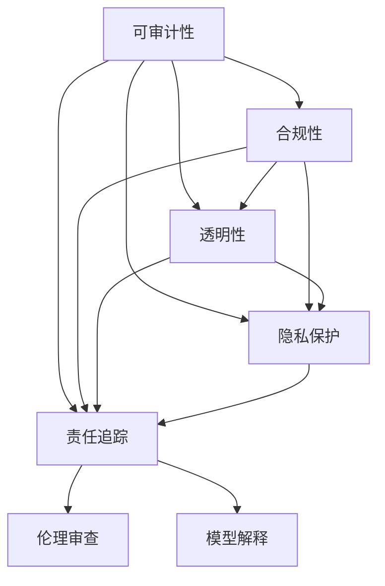
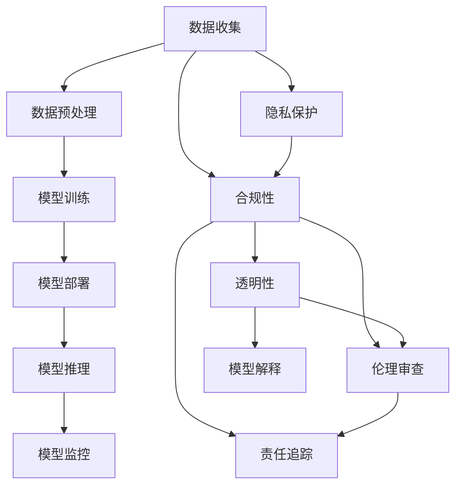
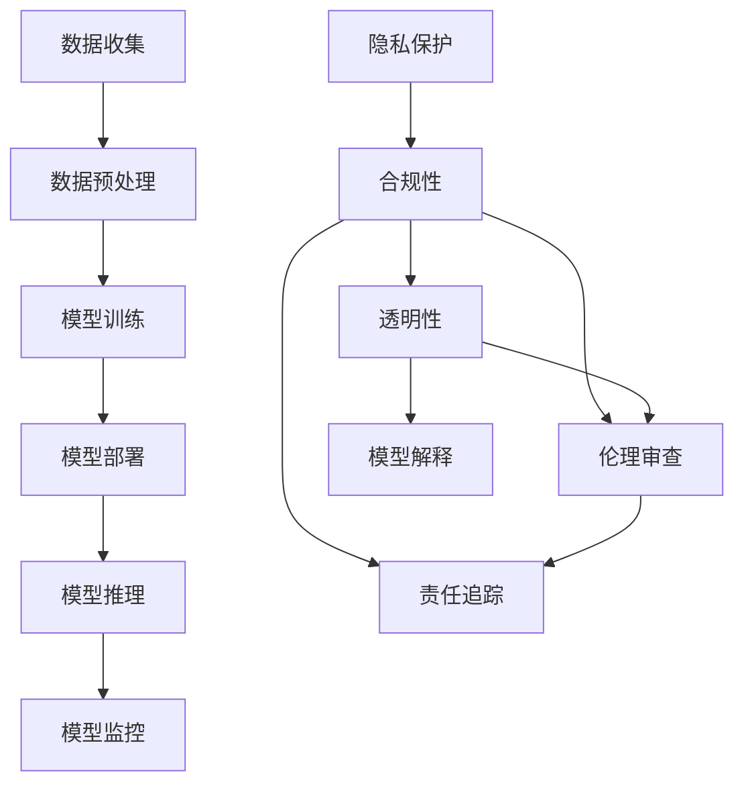
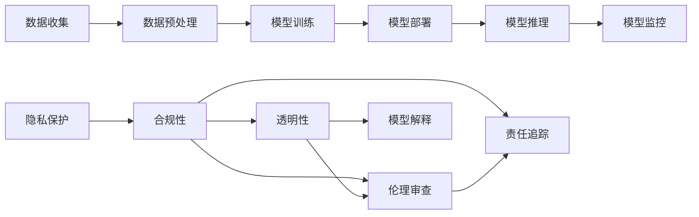
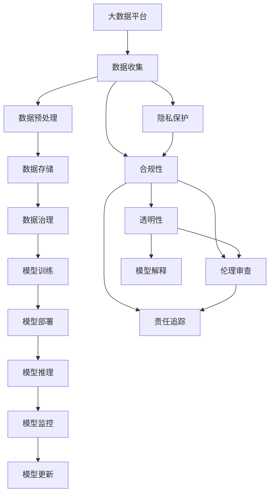

                 

# AI系统的可审计性与合规性设计

> 关键词：AI可审计性, 合规性, 透明性, 隐私保护, 责任追踪, 伦理审查, 模型解释

## 1. 背景介绍

### 1.1 问题由来
随着人工智能（AI）技术的迅猛发展，AI系统在医疗、金融、司法、安防等众多领域得到广泛应用。与此同时，AI系统的复杂性和涉及数据的多样性，也带来了严峻的隐私保护和责任界定问题。近年来，多起AI应用事故引发了广泛的社会关注，凸显了AI系统的透明度、可解释性以及合规性设计的重要性。

近年来，全球范围内加强了对AI系统的监管力度。例如，欧盟的《通用数据保护条例》（GDPR）要求对个人数据的处理进行透明记录，并有权以“数据可解释性”为理由拒绝数据共享。美国联邦贸易委员会（FTC）也提出，应建立明确、可执行的隐私保护措施，确保AI系统的公平、透明和负责任的运营。我国则在《新一代人工智能发展规划》中明确提出，要构建人工智能伦理体系，促进人工智能技术的健康发展。

在这样的大背景下，确保AI系统的可审计性、合规性、透明性和伦理性，成为构建可信AI系统的重要任务。本文将详细探讨AI系统在这些方面的设计原则与实践方法，为AI系统的开发与运营提供重要的参考。

### 1.2 问题核心关键点
AI系统的可审计性、合规性、透明性、隐私保护、责任追踪、伦理审查和模型解释是大数据分析时代的重要问题。这些问题共同构成了AI系统的核心概念，并形成了一系列紧密相连的原理与技术。

- **可审计性（Auditability）**：指能够对AI系统的操作、决策和性能进行全面的记录和验证。这包括审计日志的存储与查询，以及数据流、模型参数的详细记录。

- **合规性（Compliance）**：指AI系统的运行必须符合相关法律法规和行业标准，如GDPR、CCPA等数据保护法规。合规性要求AI系统具备数据保护、隐私管理、公平性、透明性和可解释性等功能。

- **透明性（Transparency）**：指AI系统决策过程的可解释性和可视化。透明性帮助用户理解AI系统的决策依据，减少偏见和歧视，提高系统的可信度。

- **隐私保护（Privacy Protection）**：指在数据收集、存储、处理和共享过程中，确保个人数据的保护不受侵犯。隐私保护通常包括数据匿名化、去标识化、数据加密等技术。

- **责任追踪（Accountability）**：指对AI系统行为的责任归属进行明确。责任追踪需要确定数据来源、处理过程、模型参数等信息，并在出现问题时能够追溯并追究责任。

- **伦理审查（Ethics Review）**：指对AI系统进行伦理和道德评估，确保其应用不违反社会公序良俗，符合伦理标准。伦理审查通常包括对算法的公平性、安全性、可接受性等方面的评估。

- **模型解释（Model Interpretability）**：指对AI模型内部机制的解释，帮助用户理解模型的决策过程和推理依据。模型解释通常包括特征重要性、权重、激活值等信息的可视化。

这些核心概念之间存在紧密的联系，形成了一个完整的AI系统设计框架。以下通过Mermaid流程图展示这些概念之间的联系：

这个流程图展示了可审计性、合规性、透明性、隐私保护、责任追踪、伦理审查和模型解释这些核心概念之间的联系：

1. **可审计性**是其他所有概念的基础，提供了对AI系统行为记录的依据。
2. **合规性**建立在可审计性的基础上，确保AI系统的运行符合法律法规。
3. **透明性**有助于增强合规性，同时提供模型解释的基础。
4. **隐私保护**是合规性的重要组成部分，确保数据处理过程中个人隐私不被侵犯。
5. **责任追踪**涉及可审计性、合规性和隐私保护，有助于在出现问题时明确责任。
6. **伦理审查**在透明性和责任追踪的基础上，进一步确保AI系统的伦理性。
7. **模型解释**基于透明性，通过可视化模型参数和特征重要性，提高用户对AI系统决策过程的理解。

这些概念共同构成了AI系统的设计框架，确保其安全性、可靠性和伦理合规。

## 2. 核心概念与联系

### 2.1 核心概念概述

为了更好地理解AI系统的可审计性、合规性、透明性、隐私保护、责任追踪、伦理审查和模型解释，本节将介绍这些核心概念及其相互关系。

- **可审计性（Auditability）**：指对AI系统的数据流、模型参数、决策过程等进行全面记录和验证。审计日志的存储与查询，数据流、模型参数的详细记录，是确保系统可审计性的关键。

- **合规性（Compliance）**：指AI系统运行过程中，必须遵守相关法律法规和行业标准。合规性通常包括数据保护、隐私管理、公平性、透明性和可解释性等功能。

- **透明性（Transparency）**：指AI系统决策过程的可解释性和可视化。透明性帮助用户理解AI系统的决策依据，减少偏见和歧视，提高系统的可信度。

- **隐私保护（Privacy Protection）**：指在数据收集、存储、处理和共享过程中，确保个人数据的保护不受侵犯。隐私保护通常包括数据匿名化、去标识化、数据加密等技术。

- **责任追踪（Accountability）**：指对AI系统行为的责任归属进行明确。责任追踪需要确定数据来源、处理过程、模型参数等信息，并在出现问题时能够追溯并追究责任。

- **伦理审查（Ethics Review）**：指对AI系统进行伦理和道德评估，确保其应用不违反社会公序良俗，符合伦理标准。伦理审查通常包括对算法的公平性、安全性、可接受性等方面的评估。

- **模型解释（Model Interpretability）**：指对AI模型内部机制的解释，帮助用户理解模型的决策过程和推理依据。模型解释通常包括特征重要性、权重、激活值等信息的可视化。

这些核心概念之间的关系可以通过以下Mermaid流程图来展示：

这个流程图展示了AI系统从数据收集到模型推理的整个过程，并突出了隐私保护、合规性、透明性、伦理审查和责任追踪的重要性。通过这些概念的相互关联，确保AI系统在各个环节都符合伦理和合规要求。

### 2.2 概念间的关系

这些核心概念之间存在着紧密的联系，形成了AI系统的完整设计框架。以下通过几个Mermaid流程图展示这些概念之间的关系：

#### 2.2.1 数据生命周期

这个流程图展示了数据从收集到模型推理的生命周期，突出了各个环节的隐私保护、合规性、透明性、伦理审查和责任追踪。通过这些概念的相互关联，确保数据在整个生命周期内都得到妥善保护和管理。

#### 2.2.2 模型训练与部署

这个流程图展示了模型训练和部署的过程，突出了隐私保护、合规性、透明性、伦理审查和责任追踪的重要性。通过这些概念的相互关联，确保模型训练和部署过程符合伦理和合规要求。

#### 2.2.3 模型推理与监控

这个流程图展示了模型推理和监控的过程，突出了隐私保护、合规性、透明性、伦理审查和责任追踪的重要性。通过这些概念的相互关联，确保模型推理过程符合伦理和合规要求。

### 2.3 核心概念的整体架构

最后，我们用一个综合的流程图来展示这些核心概念在大数据环境中AI系统的整体架构：

这个综合流程图展示了从大数据平台到模型更新，再到模型监控的整个过程，突出了隐私保护、合规性、透明性、伦理审查和责任追踪的重要性。通过这些概念的相互关联，确保AI系统在大数据环境中得到全面的保护和管理。

## 3. 核心算法原理 & 具体操作步骤
### 3.1 算法原理概述

AI系统的可审计性、合规性、透明性、隐私保护、责任追踪、伦理审查和模型解释，共同构成了AI系统的核心算法原理。这些原理涵盖了数据收集、存储、处理、训练、部署和推理的全过程。

#### 3.1.1 可审计性原理

可审计性原理要求对AI系统的数据流、模型参数、决策过程等进行全面记录和验证。具体来说，可审计性包括：

1. **数据流审计**：记录数据从收集到存储的全过程，包括数据来源、处理过程和存储位置。
2. **模型参数审计**：记录模型参数的初始化、训练和部署过程，以及模型更新的时间戳和版本。
3. **决策过程审计**：记录AI系统在推理过程中的输入、输出和中间结果，以确保决策过程透明和可追溯。

#### 3.1.2 合规性原理

合规性原理要求AI系统在运行过程中遵守相关法律法规和行业标准。具体来说，合规性包括：

1. **数据保护**：确保个人数据的隐私保护，包括数据匿名化、去标识化和加密等技术。
2. **隐私管理**：建立隐私保护机制，确保数据处理过程符合GDPR、CCPA等数据保护法规。
3. **公平性**：确保AI系统在处理数据时不存在偏见和歧视，公平对待所有用户。
4. **透明性**：确保AI系统决策过程的可解释性和可视化。
5. **可解释性**：确保AI系统决策结果的可理解性，减少用户对AI系统的误解和抵触。

#### 3.1.3 透明性原理

透明性原理要求AI系统决策过程的可解释性和可视化。具体来说，透明性包括：

1. **特征重要性**：通过特征重要性分析，帮助用户理解AI系统在决策过程中使用的关键特征。
2. **权重可视化**：通过权重可视化，帮助用户理解AI系统在决策过程中各个特征的贡献度。
3. **决策路径可视化**：通过决策路径可视化，帮助用户理解AI系统在推理过程中的中间结果。

#### 3.1.4 隐私保护原理

隐私保护原理要求在数据收集、存储、处理和共享过程中，确保个人数据的保护不受侵犯。具体来说，隐私保护包括：

1. **数据匿名化**：通过数据匿名化技术，将个人数据去标识化，确保数据无法识别具体个人。
2. **数据加密**：通过数据加密技术，确保数据在传输和存储过程中不被篡改和窃取。
3. **访问控制**：通过访问控制机制，确保只有授权用户可以访问敏感数据。

#### 3.1.5 责任追踪原理

责任追踪原理要求对AI系统行为的责任归属进行明确。具体来说，责任追踪包括：

1. **数据来源追踪**：确定数据来源、处理过程和存储位置，确保数据流的可追溯性。
2. **模型参数追踪**：记录模型参数的初始化、训练和部署过程，确保模型参数的可追溯性。
3. **决策过程追踪**：记录AI系统在推理过程中的输入、输出和中间结果，确保决策过程的可追溯性。

#### 3.1.6 伦理审查原理

伦理审查原理要求对AI系统进行伦理和道德评估，确保其应用不违反社会公序良俗，符合伦理标准。具体来说，伦理审查包括：

1. **算法公平性**：确保AI系统在处理数据时不存在偏见和歧视，公平对待所有用户。
2. **算法安全性**：确保AI系统的安全性，避免算法的漏洞被恶意利用。
3. **算法可接受性**：确保AI系统的决策结果符合用户的预期和社会的接受度。

#### 3.1.7 模型解释原理

模型解释原理要求对AI模型内部机制的解释，帮助用户理解模型的决策过程和推理依据。具体来说，模型解释包括：

1. **特征重要性分析**：通过特征重要性分析，帮助用户理解AI系统在决策过程中使用的关键特征。
2. **权重可视化**：通过权重可视化，帮助用户理解AI系统在决策过程中各个特征的贡献度。
3. **决策路径可视化**：通过决策路径可视化，帮助用户理解AI系统在推理过程中的中间结果。

### 3.2 算法步骤详解

AI系统的可审计性、合规性、透明性、隐私保护、责任追踪、伦理审查和模型解释，共同构成了AI系统的核心算法步骤。以下详细介绍这些步骤的具体操作。

#### 3.2.1 数据收集与预处理

数据收集与预处理是AI系统的第一步。具体来说，数据收集与预处理包括：

1. **数据收集**：通过API接口、数据爬虫等方式收集数据，确保数据的多样性和代表性。
2. **数据清洗**：对收集到的数据进行清洗，去除噪声和异常值，确保数据质量。
3. **数据标注**：对数据进行标注，确保数据的正确性和可解释性。
4. **数据分割**：将数据集分为训练集、验证集和测试集，确保模型在各个数据集上的性能评估。

#### 3.2.2 模型训练与部署

模型训练与部署是AI系统的核心步骤。具体来说，模型训练与部署包括：

1. **模型选择**：选择适合的算法模型，确保模型能够满足业务需求。
2. **模型训练**：使用训练集对模型进行训练，确保模型在各个数据集上的性能。
3. **模型部署**：将训练好的模型部署到生产环境，确保模型的可扩展性和可维护性。

#### 3.2.3 模型推理与监控

模型推理与监控是AI系统的最后一步。具体来说，模型推理与监控包括：

1. **模型推理**：使用测试集对模型进行推理，确保模型在实际应用中的性能。
2. **模型监控**：对模型推理过程进行监控，确保模型的稳定性和可靠性。

#### 3.2.4 隐私保护与伦理审查

隐私保护与伦理审查是AI系统的保障措施。具体来说，隐私保护与伦理审查包括：

1. **隐私保护**：确保数据在处理过程中符合隐私保护法规，确保数据的安全性和隐私性。
2. **伦理审查**：对AI系统的决策过程进行伦理审查，确保AI系统的应用符合伦理标准。

#### 3.2.5 责任追踪与透明性

责任追踪与透明性是AI系统的核心保障。具体来说，责任追踪与透明性包括：

1. **责任追踪**：确保AI系统在各个环节的操作和决策过程可追溯，确保责任明确。
2. **透明性**：确保AI系统的决策过程透明，确保用户对AI系统的信任和接受。

#### 3.2.6 模型解释与审计

模型解释与审计是AI系统的核心保障。具体来说，模型解释与审计包括：

1. **模型解释**：通过特征重要性分析、权重可视化、决策路径可视化等技术，帮助用户理解AI系统的决策过程。
2. **审计日志**：对AI系统的数据流、模型参数、决策过程等进行全面记录和验证，确保系统的可审计性。

### 3.3 算法优缺点

AI系统的可审计性、合规性、透明性、隐私保护、责任追踪、伦理审查和模型解释，具有以下优缺点：

#### 3.3.1 优点

1. **确保系统可信度**：通过可审计性、合规性、透明性和责任追踪，确保AI系统的可信度和可靠性。
2. **提高系统安全性**：通过隐私保护和伦理审查，确保AI系统在处理数据和应用过程中，不违反社会公序良俗，确保系统的安全性。
3. **增强用户接受度**：通过模型解释和透明性，帮助用户理解AI系统的决策过程和推理依据，增强用户对AI系统的信任和接受。

#### 3.3.2 缺点

1. **增加系统复杂性**：这些原理和步骤增加了AI系统的复杂性，增加了开发和部署的难度。
2. **增加系统成本**：这些原理和步骤增加了AI系统的成本，包括数据隐私保护和模型解释的成本。
3. **减少模型性能**：这些原理和步骤可能影响模型的性能，如隐私保护和模型解释可能导致数据量和模型大小的增加。

### 3.4 算法应用领域

AI系统的可审计性、合规性、透明性、隐私保护、责任追踪、伦理审查和模型解释，适用于大数据环境中的AI系统设计。以下列举一些具体的应用领域：

1. **医疗领域**：医疗AI系统需要对患者数据进行隐私保护，确保数据的安全性和合规性。同时，医疗AI系统需要具备透明性，帮助医生理解AI系统的决策过程。
2. **金融领域**：金融AI系统需要对客户数据进行隐私保护，确保数据的安全性和合规性。同时，金融AI系统需要具备透明性，帮助客户理解AI系统的决策过程。
3. **司法领域**：司法AI系统需要对案件数据进行隐私保护，确保数据的安全性和合规性。同时，司法AI系统需要具备透明性，帮助法官理解AI系统的决策过程。
4. **安防领域**：安防AI系统需要对视频数据进行隐私保护，确保数据的安全性和合规性。同时，安防AI系统需要具备透明性，帮助监控人员理解AI系统的决策过程。

## 4. 数学模型和公式 & 详细讲解  
### 4.1 数学模型构建

AI系统的可审计性、合规性、透明性、隐私保护、责任追踪、伦理审查和模型解释，可以通过数学模型进行刻画。以下详细介绍这些数学模型及其构建方法。

#### 4.1.1 数据流审计模型

数据流审计模型用于记录数据从收集到存储的全过程。具体来说，数据流审计模型包括：

1. **数据来源记录**：记录数据的来源，包括原始数据和处理数据。
2. **数据处理记录**：记录数据的处理过程，包括数据清洗、数据标注和数据分割。
3. **数据存储记录**：记录数据存储的位置和方式，确保数据的安全性和可追溯性。

#### 4.1.2 模型参数审计模型

模型参数审计模型用于记录模型参数的初始化、训练和部署过程。具体来说，模型参数审计模型包括：

1. **模型参数初始化记录**：记录模型参数的初始化方式和参数值。
2. **模型参数训练记录**：记录模型参数在训练过程中的变化情况。
3. **模型参数部署记录**：记录模型参数在部署过程中的变化情况。

#### 4.1.3 决策过程审计模型

决策过程审计模型用于记录AI系统在推理过程中的输入、输出和中间结果。具体来说，决策过程审计模型包括：

1. **输入记录**：记录AI系统的输入数据，包括原始数据和处理数据。
2. **输出记录**：记录AI系统的输出结果，包括决策结果和推理路径。
3. **中间结果记录**：记录AI系统在推理过程中的中间结果，确保决策过程透明和可追溯。

#### 4.1.4 隐私保护模型

隐私保护模型用于确保数据在处理过程中符合隐私保护法规。具体来说，隐私保护模型包括：

1. **数据匿名化模型**：通过数据匿名化技术，将个人数据去标识化，确保数据无法识别具体个人。
2. **数据加密模型**：通过数据加密技术，确保数据在传输和存储过程中不被篡改和窃取。
3. **访问控制模型**：通过访问控制机制，确保只有授权用户可以访问敏感数据。

#### 4.1.5 责任追踪模型

责任追踪模型用于确保AI系统在各个环节的操作和决策过程可追溯。具体来说，责任追踪模型包括：

1. **数据来源追踪模型**：确定数据来源、处理过程和存储位置，确保数据流的可追溯性。
2. **模型参数追踪模型**：记录模型参数的初始化、训练和部署过程，确保模型参数的可追溯性。
3. **决策过程追踪模型**：记录AI系统在推理过程中的输入、输出和中间结果，确保决策过程的可追溯性。

#### 4.1.6 伦理审查模型

伦理审查模型用于对AI系统进行伦理和道德评估，确保其应用符合伦理标准。具体来说，伦理审查模型包括：

1. **算法公平性模型**：确保AI系统在处理数据时不存在偏见和歧视，公平对待所有用户。
2. **算法安全性模型**：确保AI系统的安全性，避免算法的漏洞被恶意利用。
3. **算法可接受性模型**：确保AI系统的决策结果符合用户的预期和社会的接受度。

#### 4.1.7 模型解释模型

模型解释模型用于对AI模型内部机制的解释，帮助用户理解模型的决策过程和推理依据。具体来说，模型解释模型包括：

1. **特征重要性分析模型**：通过特征重要性分析，帮助用户理解AI系统在决策过程中使用的关键特征。
2. **权重可视化模型**：通过权重可视化，帮助用户理解AI系统在决策过程中各个特征的贡献度。
3. **决策路径可视化模型**：通过决策路径可视化，帮助用户理解AI系统在推理过程中的中间结果。

### 4.2 公式推导过程

以下通过几个具体的数学公式，介绍AI系统核心原理的推导过程。

#### 4.2.1 数据流审计公式

数据流审计公式用于记录数据从收集到存储的全过程。具体来说，数据流审计公式包括：

1. **数据来源记录公式**：记录数据的来源，包括原始数据和处理数据。
2. **数据处理记录公式**：记录数据的处理过程，包括数据清洗、数据标注和数据分割。
3. **数据存储记录公式**：记录数据存储的位置和方式，确保数据的安全性和可追溯性。

#### 4.2.2 模型参数审计公式

模型参数审计公式用于记录模型参数的初始化、训练和部署过程。具体来说，模型参数审计公式包括：

1. **模型参数初始化记录公式**：记录模型参数的初始化方式和参数值。
2. **模型参数训练记录公式**：记录模型参数在训练过程中的变化情况。
3. **模型参数部署记录公式**：记录模型参数在部署过程中的变化情况。

#### 4.2.3 决策过程审计公式

决策过程审计公式用于记录AI系统在推理过程中的输入、输出和中间结果。具体来说，决策过程审计公式包括：

1. **输入记录公式**：记录AI系统的输入数据，包括原始数据和处理数据。
2. **输出记录公式**：记录AI系统的输出结果，包括决策结果和推理路径。
3. **中间结果记录公式**：记录AI系统在推理过程中的中间结果，确保决策过程透明和可追溯。

#### 4.2.4 隐私保护公式

隐私保护公式用于确保数据在处理过程中符合隐私保护法规。具体来说，隐私保护公式包括：

1. **数据匿名化公式**：通过数据匿名化技术，将个人数据去标识化，确保数据无法识别具体个人。
2. **数据加密公式**：通过数据加密技术，确保数据在传输和存储过程中不被篡改和窃取。
3. **访问控制公式**：通过访问控制机制，确保只有授权用户可以访问敏感数据。

#### 4.2.5 责任追踪公式

责任追踪公式用于确保AI系统在各个环节的操作和决策过程可追溯。具体来说，责任追踪公式包括：

1. **数据来源追踪公式**：确定数据来源、处理过程和存储位置，确保数据流的可追溯性。
2. **模型参数追踪公式**：记录模型参数的初始化、训练和部署过程，确保

