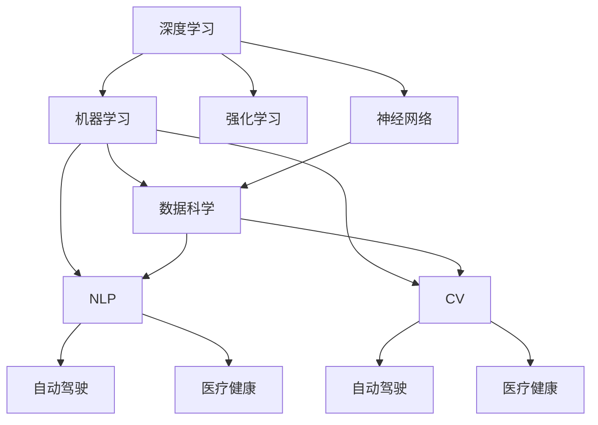

                 

# AI领域的前沿技术与发展

> 关键词：深度学习,机器学习,人工智能,强化学习,神经网络,数据科学,自然语言处理(NLP),计算机视觉(CV),自动驾驶,医疗健康

## 1. 背景介绍

### 1.1 问题由来
人工智能（AI）作为21世纪最具颠覆性的技术之一，已经在诸多领域实现了广泛应用。从语音识别到图像处理，从推荐系统到自动驾驶，AI技术的突破不断刷新着人们对于智能系统的认知。然而，尽管AI技术取得了诸多成功，但如何让AI更加智能、普适、可信，仍是学界和产业界共同面临的重大挑战。本文将从深度学习、机器学习、强化学习、神经网络、数据科学、自然语言处理（NLP）、计算机视觉（CV）、自动驾驶、医疗健康等前沿领域，全面梳理当前AI技术的发展现状和未来趋势，力求为广大读者提供更为深入、全面的技术洞见。

### 1.2 问题核心关键点
当前AI技术发展的主要驱动力在于数据的增长和计算能力的提升。大数据、深度学习、强化学习、神经网络、数据科学等技术，共同构成了现代AI技术的核心基石。然而，这些技术的发展并非孤立的，它们之间存在复杂的联系和互动，共同推动着AI技术的不断演进。深度学习作为其中的关键技术，通过不断探索和创新，为AI技术的诸多应用领域提供了强有力的支持。

深度学习、机器学习、强化学习、神经网络、数据科学、自然语言处理（NLP）、计算机视觉（CV）、自动驾驶、医疗健康等前沿领域，构成了AI技术的核心应用范畴。这些技术的不断进步和结合，使得AI技术在实际应用中展现出更加广泛的潜力和巨大的应用价值。然而，当前AI技术的发展仍面临诸多挑战，如数据质量、算法复杂性、系统鲁棒性、人机交互、伦理道德等，这些问题的解决需要学界和产业界共同努力。

### 1.3 问题研究意义
研究AI技术的前沿发展，对于拓展AI技术的应用边界，提升AI系统的智能水平，加速AI技术的产业化进程，具有重要意义：

1. 降低技术开发成本。利用已有的成熟AI技术，可以显著减少从头开发所需的时间、人力和成本投入。
2. 提升系统性能。通过优化AI算法和模型，可以在特定应用场景中取得更优的表现，提高系统的准确性和鲁棒性。
3. 加速技术部署。“站在巨人的肩膀上”，AI技术的不断演进使得技术的落地应用变得更加快捷，缩短了研发周期。
4. 促进技术创新。深度学习、机器学习、强化学习、神经网络等技术的持续探索，催生了诸多新的研究方向，推动了AI技术的不断突破。
5. 助力产业升级。AI技术的广泛应用，为各行各业数字化转型提供了新的技术路径，推动了产业的智能化升级。

## 2. 核心概念与联系

### 2.1 核心概念概述

为更好地理解AI技术的前沿发展，本节将介绍几个关键的核心概念：

- **深度学习(Deep Learning)**：基于神经网络，通过多层次的特征提取和表示学习，实现对复杂非线性数据的高效建模和处理。深度学习在图像、语音、自然语言处理等领域展现了强大的应用潜力。

- **机器学习(Machine Learning)**：通过数据驱动的方法，让机器能够从数据中学习规律，进行预测和决策。机器学习包括监督学习、无监督学习和强化学习等多种形式。

- **强化学习(Reinforcement Learning)**：通过智能体与环境的交互，让机器在试错中学习最优策略。强化学习在游戏、机器人控制、自动驾驶等领域有着广泛应用。

- **神经网络(Neural Networks)**：基于生物神经元的计算模型，通过多层次的节点连接实现对数据的高维表示学习。神经网络是深度学习和强化学习的基础模型。

- **数据科学(Data Science)**：涉及数据采集、处理、分析和应用的全过程，旨在从数据中提取有价值的信息，驱动业务决策和创新。数据科学涵盖了机器学习、深度学习、大数据处理等多个技术领域。

- **自然语言处理(Natural Language Processing, NLP)**：使计算机能够理解、处理和生成自然语言，实现语言与机器之间的交互。NLP技术包括文本分类、命名实体识别、机器翻译、对话系统等多个方向。

- **计算机视觉(Computer Vision, CV)**：使计算机能够“看”懂图像和视频，实现图像分类、物体检测、图像分割、视频分析等任务。CV技术基于深度学习，近年来取得了飞速进展。

- **自动驾驶(Autonomous Driving)**：使车辆能够自主导航、感知环境和进行决策，实现无人驾驶。自动驾驶结合了计算机视觉、深度学习、强化学习等多项AI技术，是AI技术的重要应用之一。

- **医疗健康(Healthcare)**：通过AI技术实现疾病的早期诊断、精准治疗、药物研发和健康管理。AI在医疗健康领域的应用潜力巨大，正推动医疗行业的数字化转型。

这些核心概念之间存在紧密的联系，通过不断融合与创新，推动了AI技术在各个领域的广泛应用。深度学习、机器学习、强化学习等技术的发展，为计算机视觉、自动驾驶、自然语言处理等领域的突破提供了重要基础。同时，这些技术的结合，也在加速AI技术的产业化进程，推动了AI技术在各行各业的广泛应用。

### 2.2 概念间的关系

这些核心概念之间存在着紧密的联系，形成了AI技术的整体架构。以下用几个Mermaid流程图来展示这些概念之间的关系：

#### 2.2.1 AI技术的整体架构

这个流程图展示了AI技术的核心概念及其之间的关系：

1. 深度学习、机器学习和强化学习是AI技术的核心算法基础。
2. 神经网络是深度学习和强化学习的基础模型。
3. 数据科学涵盖机器学习、深度学习和大数据处理，为AI技术提供数据支持。
4. NLP、CV、自动驾驶和医疗健康等应用领域，依托深度学习、机器学习等技术，实现具体应用。

这些概念共同构成了AI技术的生态系统，推动了AI技术的不断发展和应用。通过理解这些核心概念及其之间的关系，我们可以更好地把握AI技术的前沿发展方向。

## 3. 核心算法原理 & 具体操作步骤

### 3.1 算法原理概述

AI技术的发展主要基于深度学习、机器学习、强化学习等算法原理。这些算法的核心思想是通过数据驱动的方式，使机器能够学习数据的规律，并进行预测和决策。以下将详细介绍这些核心算法的原理和操作步骤。

#### 3.1.1 深度学习

深度学习通过多层神经网络实现对数据的特征提取和表示学习。其核心思想是通过反向传播算法，不断调整网络参数，使得模型能够对输入数据进行有效的预测。

具体来说，深度学习的训练过程包括以下几个步骤：

1. **数据预处理**：将原始数据转换为模型可以处理的格式，如将图像数据转化为向量形式。
2. **模型初始化**：对模型参数进行随机初始化。
3. **前向传播**：将输入数据送入模型，计算输出。
4. **损失计算**：计算模型输出与真实标签之间的差异，得到损失函数。
5. **反向传播**：通过链式法则，计算损失函数对模型参数的梯度。
6. **参数更新**：使用优化算法（如梯度下降）更新模型参数。
7. **迭代训练**：重复以上步骤，直到模型收敛。

#### 3.1.2 机器学习

机器学习通过数据驱动的方式，让机器能够从数据中学习规律，进行预测和决策。其核心思想是通过监督学习、无监督学习和强化学习等方法，使机器能够对数据进行分类、聚类和优化。

具体来说，机器学习的训练过程包括以下几个步骤：

1. **数据准备**：准备标注好的训练数据。
2. **模型初始化**：选择适当的模型，对模型参数进行随机初始化。
3. **特征提取**：从原始数据中提取特征。
4. **模型训练**：使用训练数据对模型进行训练，最小化损失函数。
5. **模型评估**：在测试数据上评估模型性能。
6. **模型调优**：根据评估结果调整模型参数。
7. **模型应用**：使用训练好的模型进行预测和决策。

#### 3.1.3 强化学习

强化学习通过智能体与环境的交互，让机器在试错中学习最优策略。其核心思想是通过奖励机制和惩罚机制，引导智能体在环境中进行探索和决策。

具体来说，强化学习的训练过程包括以下几个步骤：

1. **环境设计**：定义智能体和环境，设计奖励函数。
2. **策略初始化**：选择适当的策略，对策略参数进行随机初始化。
3. **智能体探索**：智能体在环境中进行探索，获得环境反馈。
4. **策略评估**：根据环境反馈评估策略效果。
5. **策略优化**：使用优化算法（如梯度下降）更新策略参数。
6. **迭代训练**：重复以上步骤，直到策略收敛。
7. **策略应用**：使用训练好的策略进行决策和控制。

### 3.2 算法步骤详解

以下将详细介绍深度学习、机器学习和强化学习的具体操作步骤和关键算法。

#### 3.2.1 深度学习

深度学习的核心算法包括前向传播、反向传播、梯度下降等。以下将详细介绍这些算法。

**前向传播**：将输入数据通过网络层，逐层计算输出。公式如下：

$$
h_i = f(\sum_{j=1}^{n} W_{ij} x_j + b_i)
$$

其中 $h_i$ 为第 $i$ 层的输出，$f$ 为激活函数，$W_{ij}$ 为第 $i$ 层的权重，$x_j$ 为第 $j$ 层的输入，$b_i$ 为第 $i$ 层的偏置。

**反向传播**：计算损失函数对每个参数的梯度。公式如下：

$$
\frac{\partial L}{\partial W_{ij}} = \frac{\partial L}{\partial h_i} \frac{\partial h_i}{\partial x_j} = \delta_i W_{ij}
$$

其中 $L$ 为损失函数，$\delta_i$ 为第 $i$ 层的误差，$\frac{\partial h_i}{\partial x_j}$ 为链式法则计算的误差传播公式。

**梯度下降**：根据梯度下降算法更新模型参数。公式如下：

$$
W_{ij} = W_{ij} - \eta \frac{\partial L}{\partial W_{ij}}
$$

其中 $\eta$ 为学习率，$\frac{\partial L}{\partial W_{ij}}$ 为第 $i$ 层的权重梯度。

#### 3.2.2 机器学习

机器学习的核心算法包括监督学习、无监督学习、强化学习等。以下将详细介绍这些算法。

**监督学习**：通过标注数据训练模型，最小化损失函数。公式如下：

$$
\hat{y} = f(W \cdot x + b)
$$

其中 $\hat{y}$ 为模型输出，$W$ 为权重矩阵，$x$ 为输入特征，$b$ 为偏置向量。

**无监督学习**：通过未标注数据训练模型，学习数据的潜在规律。例如K-means算法，公式如下：

$$
K-means: \min_{z} \sum_{i=1}^{n} ||x_i - \mu_k||^2
$$

其中 $x_i$ 为输入数据，$\mu_k$ 为聚类中心。

**强化学习**：通过智能体与环境的交互，优化策略函数。例如Q-learning算法，公式如下：

$$
Q(s,a) = r + \gamma \max_a Q(s',a')
$$

其中 $Q(s,a)$ 为策略函数，$r$ 为即时奖励，$s$ 为状态，$a$ 为动作，$s'$ 为下一状态，$a'$ 为下一动作，$\gamma$ 为折扣因子。

#### 3.2.3 强化学习

强化学习的核心算法包括Q-learning、策略梯度等。以下将详细介绍这些算法。

**Q-learning**：通过奖励机制和惩罚机制，学习最优策略。公式如下：

$$
Q(s,a) = Q(s,a) + \alpha (r + \gamma \max_a Q(s',a') - Q(s,a))
$$

其中 $\alpha$ 为学习率，$r$ 为即时奖励，$s$ 为状态，$a$ 为动作，$s'$ 为下一状态，$a'$ 为下一动作，$\gamma$ 为折扣因子。

**策略梯度**：通过优化策略函数，实现最优决策。公式如下：

$$
\frac{\partial J}{\partial \theta} = \frac{\partial \log \pi(a|s)}{\partial \theta} \frac{\partial \log \pi(a|s)}{\partial \theta}
$$

其中 $\frac{\partial \log \pi(a|s)}{\partial \theta}$ 为策略函数对参数的梯度，$\pi(a|s)$ 为策略函数，$\theta$ 为策略函数的参数。

### 3.3 算法优缺点

#### 3.3.1 深度学习

**优点**：

1. 强大的特征提取能力：多层神经网络可以自动学习输入数据的复杂特征，提取高维表示。
2. 高精度预测：通过反向传播算法不断优化模型参数，能够实现高精度的预测和分类。
3. 可扩展性强：深度学习模型可以通过增加网络层数和节点数，适应更复杂的任务。

**缺点**：

1. 计算复杂度高：深度学习模型的训练和推理需要大量的计算资源。
2. 过拟合风险高：多层网络容易出现过拟合现象，需要正则化等方法进行缓解。
3. 参数数量庞大：深度学习模型参数量较大，需要更多的存储空间和计算资源。

#### 3.3.2 机器学习

**优点**：

1. 数据驱动：通过数据驱动的方式，机器能够自动学习规律，进行预测和决策。
2. 适用性广：机器学习算法可以应用于多种任务，如分类、聚类、回归等。
3. 可解释性强：机器学习算法的输出结果往往具有较好的可解释性，便于理解和调试。

**缺点**：

1. 数据质量要求高：机器学习算法的性能依赖于数据的质量，数据噪声和异常值可能影响模型效果。
2. 模型选择复杂：不同任务的机器学习算法选择较为复杂，需要经验和实验进行调试。
3. 处理非线性关系能力有限：机器学习算法在处理非线性关系时，往往需要引入复杂的模型结构。

#### 3.3.3 强化学习

**优点**：

1. 自适应性强：强化学习算法能够通过试错机制，适应不断变化的环境。
2. 自主决策能力：强化学习算法能够自主进行决策和控制，无需人工干预。
3. 多任务处理能力强：强化学习算法可以同时处理多个任务，实现任务间的协同。

**缺点**：

1. 策略更新困难：强化学习算法需要不断更新策略函数，可能陷入局部最优。
2. 奖励设计复杂：强化学习算法需要设计合理的奖励函数，否则可能导致策略失效。
3. 计算复杂度高：强化学习算法需要大量的计算资源，尤其在大规模环境中。

### 3.4 算法应用领域

深度学习、机器学习、强化学习等算法已经在众多领域实现了广泛应用，以下是几个典型的应用领域：

- **计算机视觉**：通过深度学习算法，实现图像分类、物体检测、图像分割、人脸识别等任务。
- **自然语言处理**：通过深度学习算法，实现文本分类、命名实体识别、机器翻译、对话系统等任务。
- **自动驾驶**：通过强化学习算法，实现智能体的自主导航、环境感知和决策控制。
- **医疗健康**：通过深度学习算法，实现疾病的早期诊断、精准治疗、药物研发和健康管理。
- **金融交易**：通过机器学习算法，实现风险评估、市场预测、量化交易等任务。
- **智能推荐**：通过机器学习算法，实现商品推荐、新闻推荐、内容推荐等任务。
- **机器人控制**：通过强化学习算法，实现机器人的自主移动、物品抓取、环境感知等任务。
- **智慧城市**：通过机器学习和深度学习算法，实现交通管理、智能监控、垃圾分类等任务。

这些应用领域展示了AI技术的广泛应用前景，未来随着AI技术的不断演进，AI技术将在更多领域发挥更大的作用。

## 4. 数学模型和公式 & 详细讲解 & 举例说明

### 4.1 数学模型构建

AI技术的发展离不开数学模型的支持。以下将详细介绍深度学习、机器学习、强化学习等核心算法中的数学模型构建。

#### 4.1.1 深度学习

深度学习的数学模型主要涉及多层神经网络的构建。以下将详细介绍多层神经网络的数学模型。

**多层神经网络**：由多个层次的神经元组成，每个层次都有多个神经元。公式如下：

$$
h_i = f(\sum_{j=1}^{n} W_{ij} x_j + b_i)
$$

其中 $h_i$ 为第 $i$ 层的输出，$f$ 为激活函数，$W_{ij}$ 为第 $i$ 层的权重，$x_j$ 为第 $j$ 层的输入，$b_i$ 为第 $i$ 层的偏置。

**反向传播算法**：通过链式法则计算损失函数对每个参数的梯度。公式如下：

$$
\frac{\partial L}{\partial W_{ij}} = \frac{\partial L}{\partial h_i} \frac{\partial h_i}{\partial x_j} = \delta_i W_{ij}
$$

其中 $L$ 为损失函数，$\delta_i$ 为第 $i$ 层的误差，$\frac{\partial h_i}{\partial x_j}$ 为链式法则计算的误差传播公式。

**梯度下降算法**：根据梯度下降算法更新模型参数。公式如下：

$$
W_{ij} = W_{ij} - \eta \frac{\partial L}{\partial W_{ij}}
$$

其中 $\eta$ 为学习率，$\frac{\partial L}{\partial W_{ij}}$ 为第 $i$ 层的权重梯度。

#### 4.1.2 机器学习

机器学习的数学模型主要涉及监督学习、无监督学习和强化学习等算法。以下将详细介绍这些算法的数学模型。

**监督学习**：通过标注数据训练模型，最小化损失函数。公式如下：

$$
\hat{y} = f(W \cdot x + b)
$$

其中 $\hat{y}$ 为模型输出，$W$ 为权重矩阵，$x$ 为输入特征，$b$ 为偏置向量。

**无监督学习**：通过未标注数据训练模型，学习数据的潜在规律。例如K-means算法，公式如下：

$$
K-means: \min_{z} \sum_{i=1}^{n} ||x_i - \mu_k||^2
$$

其中 $x_i$ 为输入数据，$\mu_k$ 为聚类中心。

**强化学习**：通过智能体与环境的交互，优化策略函数。例如Q-learning算法，公式如下：

$$
Q(s,a) = r + \gamma \max_a Q(s',a')
$$

其中 $Q(s,a)$ 为策略函数，$r$ 为即时奖励，$s$ 为状态，$a$ 为动作，$s'$ 为下一状态，$a'$ 为下一动作，$\gamma$ 为折扣因子。

#### 4.1.3 强化学习

强化学习的数学模型主要涉及策略函数和奖励函数。以下将详细介绍这些函数的数学模型。

**策略函数**：通过优化策略函数，实现最优决策。公式如下：

$$
\frac{\partial J}{\partial \theta} = \frac{\partial \log \pi(a|s)}{\partial \theta} \frac{\partial \log \pi(a|s)}{\partial \theta}
$$

其中 $\frac{\partial \log \pi(a|s)}{\partial \theta}$ 为策略函数对参数的梯度，$\pi(a|s)$ 为策略函数，$\theta$ 为策略函数的参数。

**奖励函数**：通过奖励机制和惩罚机制，引导智能体在环境中进行探索和决策。公式如下：

$$
Q(s,a) = r + \gamma \max_a Q(s',a')
$$

其中 $Q(s,a)$ 为策略函数，$r$ 为即时奖励，$s$ 为状态，$a$ 为动作，$s'$ 为下一状态，$a'$ 为下一动作，$\gamma$ 为折扣因子。

### 4.2 公式推导过程

以下将详细介绍深度学习、机器学习、强化学习等核心算法中的数学公式推导过程。

#### 4.2.1 深度学习

**前向传播算法**：将输入数据通过网络层，逐层计算输出。公式如下：

$$
h_i = f(\sum_{j=1}^{n} W_{ij} x_j + b_i)
$$

其中 $h_i$ 为第 $i$ 层的输出，$f$ 为激活函数，$W_{ij}$ 为第 $i$ 层的权重，$x_j$ 为第 $j$ 层的输入，$b_i$ 为第 $i$ 层的偏置。

**反向传播算法**：计算损失函数对每个参数的梯度。公式如下：

$$
\frac{\partial L}{\partial W_{ij}} = \frac{\partial L}{\partial h_i} \frac{\partial h_i}{\partial x_j} = \delta_i W_{ij}
$$

其中 $L$ 为损失函数，$\delta_i$ 为第 $i$ 层的误差，$\frac{\partial h_i}{\partial x_j}$ 为链式法则计算的误差传播公式。

**梯度下降算法**：根据梯度下降算法更新模型参数。公式如下：

$$
W_{ij} = W_{ij} - \eta \frac{\partial L}{\partial W_{ij}}
$$

其中 $\eta$ 为学习率，$\frac{\partial L}{\partial W_{ij}}$ 为第 $i$ 层的权重梯度。

#### 4.2.2 机器学习

**监督学习算法**：通过标注数据训练模型，最小化损失函数。公式如下：

$$
\hat{y} = f(W \cdot x + b)
$$

其中 $\hat{y}$ 为模型输出，$W$ 为权重矩阵，$x$ 为输入特征，$b$ 为偏置向量。

**无监督学习算法**：通过未标注数据训练模型，学习数据的潜在规律。例如K-means算法，公式如下：

$$
K-means: \min_{z} \sum_{i=1}^{n} ||x_i - \mu_k||^2
$$

其中 $x_i$ 为输入数据，$\mu_k$ 为聚类中心。

**强化学习算法**：通过智能体与环境的交互，优化策略函数。例如Q-learning算法，公式如下：

$$
Q(s,a) = r + \gamma \max_a Q(s',a')
$$

其中 $Q(s,a)$ 为策略函数，$r$ 为即时奖励，$s$ 为状态，$a$ 为动作，$s'$ 为下一状态，$a'$ 为下一动作，$\gamma$ 为折扣因子。

#### 4.2.3 强化学习

**策略函数算法**：通过优化策略函数，实现最优决策。公式如下：

$$
\frac{\partial J}{\partial \theta} = \frac{\partial \log \pi(a|s)}{\partial \theta} \frac{\partial \log \pi(a|s)}{\partial \theta}
$$

其中 $\frac{\partial \log \pi(a|s)}{\partial \theta}$ 为策略函数对参数的梯度，$\pi(a|s)$ 为策略函数，$\theta$ 为策略函数的参数。

**奖励函数算法**：通过奖励机制和惩罚机制，引导智能体在环境中进行探索和决策。公式如下：

$$
Q(s,a) = r + \gamma \max_a Q(s',a')
$$

其中 $Q(s,a)$ 为策略函数，$r$ 为即时奖励，$s$ 为状态，$a$ 为动作，$s'$ 为下一状态，$a'$ 为下一动作，$\gamma$ 为折扣因子。

### 4.3 案例分析与讲解

以下将详细介绍深度学习、机器学习、强化学习等核心算法在实际应用中的案例分析。

#### 4.3.1 深度学习

**图像分类**：通过深度学习算法，实现图像分类任务。公式如下：

$$
\hat{y} = f(W \cdot x + b)
$$

其中 $\hat{y}$ 为模型输出，$W$ 为权重矩阵，$x$ 为输入特征，$b$ 为偏置向量。

**物体检测**：通过深度学习算法，实现物体检测任务。公式如下：

$$
\hat{y} = f(W \cdot x + b)
$$

其中 $\hat{y}$ 为模型输出，$W$ 为权重矩阵，$x$ 为输入特征，$b$ 为偏置向量。

#### 4.3.2 机器学习

**文本分类**：通过机器学习算法，实现文本分类任务。公式如下：

$$
\hat{y} = f(W \cdot x + b)
$$

其中 $\hat{

