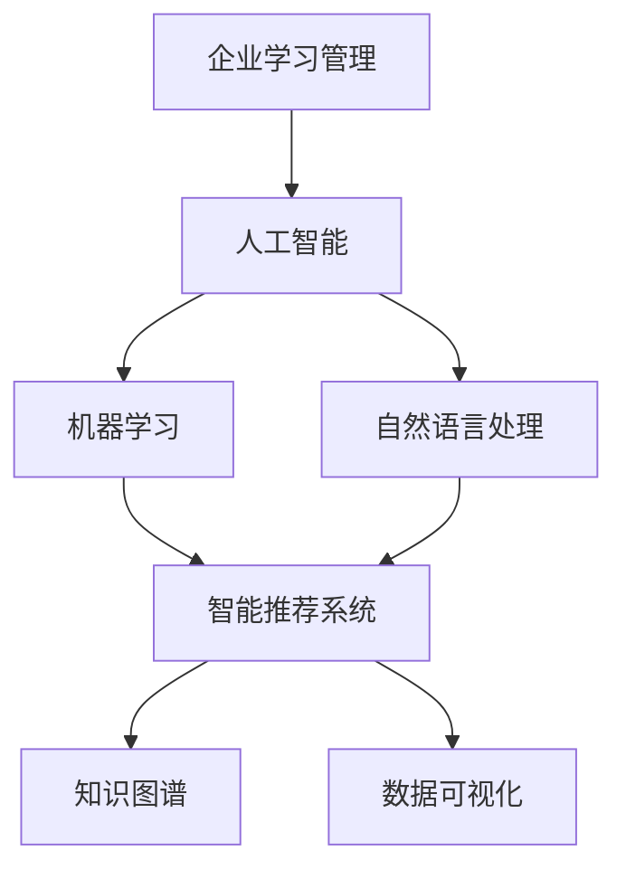
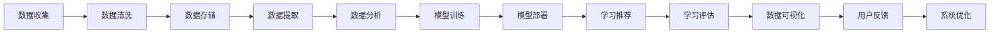
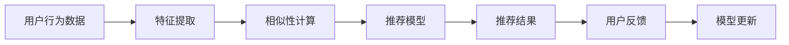
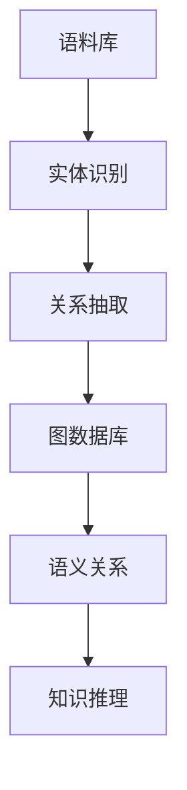
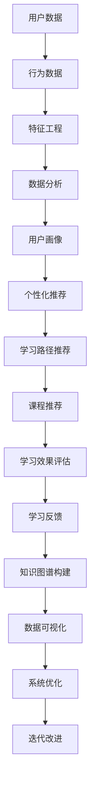

                 

# AI驱动的企业学习管理系统

> 关键词：企业学习管理,人工智能,机器学习,自然语言处理,NLP,智能推荐系统,个性化学习,知识图谱,数据可视化

## 1. 背景介绍

### 1.1 问题由来
随着科技的迅猛发展，知识更新速度日益加快。企业员工不仅需要掌握现有技能，还需持续学习新知识，以适应市场变化。传统培训方式往往难以满足这些需求，导致员工学习效率低下，企业培训成本高昂。人工智能和大数据技术的崛起，为企业提供了新的学习管理思路：通过智能化手段，打造灵活、高效、个性化的学习管理系统。

### 1.2 问题核心关键点
AI驱动的企业学习管理系统通过大数据分析、机器学习、自然语言处理(NLP)等技术，帮助企业设计个性化学习路径，实时推荐学习资源，自动化评估学习效果，实现培训内容的精准推送，提升员工学习体验和学习效果。

其核心目标包括：
- 个性化学习体验：根据员工的学习历史和能力，智能推荐适合的课程和学习资料。
- 高效知识管理：自动梳理知识库，分类存储和检索知识，提升知识搜索效率。
- 实时学习反馈：自动跟踪学习进度，定期评估学习效果，及时调整学习计划。
- 数据可视化：通过图表和报告直观展示学习数据，帮助管理层和员工理解学习效果，制定改进策略。

### 1.3 问题研究意义
构建AI驱动的企业学习管理系统，对于提升企业员工技能、推动企业知识传承与创新、增强企业竞争力具有重要意义：

1. 提升员工技能：通过智能推荐和个性化学习路径，帮助员工快速掌握新技能，提升工作效率。
2. 传承企业知识：系统化管理企业知识库，保留和传承企业核心经验和业务知识。
3. 促进员工成长：实时反馈学习效果，调整学习策略，帮助员工制定符合自身发展的职业规划。
4. 驱动业务创新：通过员工知识共享和创新，为企业带来新的商业模式和业务增长点。
5. 降低培训成本：自动化管理培训流程，减少人力投入，提升培训效率，降低培训成本。

## 2. 核心概念与联系

### 2.1 核心概念概述

为更好地理解AI驱动的企业学习管理系统，本节将介绍几个密切相关的核心概念：

- 企业学习管理（Enterprise Learning Management, ELMS）：通过智能化技术手段，构建企业内部的学习管理系统，提升员工学习效率和学习质量。
- 人工智能（Artificial Intelligence, AI）：利用机器学习、深度学习、自然语言处理等技术，模拟人类智能行为，构建智能化的学习管理系统。
- 机器学习（Machine Learning, ML）：使机器通过学习数据规律，自动改进算法，实现特定任务的自动化。
- 自然语言处理（Natural Language Processing, NLP）：使机器能够理解、处理和生成自然语言，实现语言和知识的智能化管理。
- 智能推荐系统（Recommender System）：根据用户历史行为和兴趣，推荐个性化内容，提升用户体验。
- 知识图谱（Knowledge Graph）：利用图数据库管理企业知识，通过语义关系描述知识的结构和链接，实现高效知识搜索。
- 数据可视化（Data Visualization）：通过图表和报告，直观展示数据和分析结果，帮助管理层和员工做出科学决策。

这些核心概念之间的逻辑关系可以通过以下Mermaid流程图来展示：



这个流程图展示了大数据技术在企业学习管理中的应用，从人工智能到智能推荐系统，再到知识图谱和数据可视化，形成了一个完整的智能化学习管理生态系统。

### 2.2 概念间的关系

这些核心概念之间存在着紧密的联系，形成了AI驱动的企业学习管理系统的完整架构。下面通过几个Mermaid流程图来展示这些概念之间的关系。

#### 2.2.1 企业学习管理的架构



这个流程图展示了企业学习管理的核心流程，从数据收集、存储、提取、分析、模型训练、推荐、评估到可视化，形成了一个完整的闭环。

#### 2.2.2 智能推荐系统的流程



这个流程图展示了智能推荐系统的基本流程，从用户行为数据提取，到相似性计算、推荐模型训练、结果推荐，再到用户反馈和模型更新。

#### 2.2.3 知识图谱的构建



这个流程图展示了知识图谱的基本构建过程，从语料库处理，到实体识别、关系抽取、图数据库存储，再到语义关系描述和知识推理。

### 2.3 核心概念的整体架构

最后，我们用一个综合的流程图来展示这些核心概念在企业学习管理系统中的整体架构：



这个综合流程图展示了企业学习管理系统的各个组成部分及其交互关系，从用户数据处理，到行为分析、推荐生成、效果评估、知识管理，再到系统优化和持续改进，形成了闭环反馈的智能学习管理系统。

## 3. 核心算法原理 & 具体操作步骤
### 3.1 算法原理概述

AI驱动的企业学习管理系统主要基于机器学习、自然语言处理和推荐系统等技术，构建一个自适应的智能学习系统。具体来说，其核心算法原理如下：

1. **用户行为数据分析**：通过记录和分析用户的学习行为数据（如访问时间、课程完成率等），生成用户画像。
2. **相似性计算**：使用基于内容的推荐算法（如协同过滤、基于矩阵分解的推荐等）计算用户与课程的相似度。
3. **推荐模型训练**：通过收集用户行为数据和课程特征数据，训练推荐模型，预测用户对课程的兴趣和评分。
4. **个性化推荐**：根据用户的画像和推荐模型，生成个性化的学习路径和课程推荐。
5. **学习效果评估**：使用学习效果评估模型（如预测准确率、平均测试成绩等）对推荐结果进行评估。
6. **知识图谱构建**：通过抽取和整合企业内部文档、网站、论坛等资源，构建知识图谱，实现高效知识搜索和推理。
7. **数据可视化**：使用数据可视化工具（如Tableau、Power BI等）将学习数据进行可视化展示，帮助管理层和员工理解学习效果和改进策略。

### 3.2 算法步骤详解

#### 3.2.1 用户行为数据分析

1. **数据收集**：收集企业员工在企业学习管理系统上的所有学习行为数据，包括登录时间、访问页面、学习时长、课程完成率、测试成绩等。
2. **数据清洗**：对收集到的数据进行去重、处理缺失值、异常值等操作，确保数据的准确性和完整性。
3. **特征提取**：提取有用的特征，如课程评分、学习时长、测试成绩等，生成用户画像。

#### 3.2.2 相似性计算

1. **基于内容的推荐算法**：计算用户与课程之间的相似度，如使用余弦相似度、Pearson相关系数等。
2. **协同过滤算法**：根据用户的兴趣，找到与用户兴趣相近的其他用户，推荐其已学习的课程。
3. **基于矩阵分解的推荐算法**：通过分解用户行为矩阵和课程特征矩阵，找到推荐参数。

#### 3.2.3 推荐模型训练

1. **模型选择**：选择合适的推荐模型，如协同过滤、基于内容的推荐、矩阵分解等。
2. **模型训练**：使用收集到的用户行为数据和课程特征数据，训练推荐模型。
3. **模型评估**：使用评估指标（如平均绝对误差、均方误差、精召曲线等）对训练好的推荐模型进行评估。

#### 3.2.4 个性化推荐

1. **用户画像生成**：根据用户的学习行为数据，生成用户画像，包括用户的兴趣、偏好、学习进度等。
2. **课程推荐生成**：基于用户画像和推荐模型，生成个性化的课程推荐。
3. **学习路径推荐**：根据课程之间的关联关系，生成用户的学习路径，帮助用户规划学习路线。

#### 3.2.5 学习效果评估

1. **效果评估指标**：使用预测准确率、平均测试成绩、学习时长等指标，评估推荐效果。
2. **评估模型训练**：使用评估数据对评估模型进行训练，提高评估准确率。

#### 3.2.6 知识图谱构建

1. **语料库处理**：从企业内部文档、网站、论坛等资源中提取文本数据。
2. **实体识别**：使用自然语言处理技术，识别文本中的实体，如人名、地名、机构名等。
3. **关系抽取**：从文本中抽取实体之间的关系，如员工与企业、员工与项目等。
4. **图数据库存储**：使用图数据库（如Neo4j）存储实体和关系，构建知识图谱。

#### 3.2.7 数据可视化

1. **数据可视化工具**：选择合适的数据可视化工具，如Tableau、Power BI等。
2. **数据展示**：将学习数据进行可视化展示，包括学习进度、课程推荐效果、用户反馈等。
3. **决策支持**：通过数据可视化，帮助管理层和员工理解学习效果，制定改进策略。

### 3.3 算法优缺点

AI驱动的企业学习管理系统具有以下优点：
1. **个性化推荐**：通过大数据分析和机器学习算法，实现个性化推荐，提高学习效率。
2. **智能分析**：利用自然语言处理和知识图谱技术，实现智能分析和知识管理。
3. **实时反馈**：自动跟踪学习进度，定期评估学习效果，及时调整学习计划。
4. **数据可视化**：通过图表和报告直观展示数据，帮助管理层和员工理解学习效果，制定改进策略。

同时，该系统也存在以下缺点：
1. **数据隐私**：需要收集和分析用户行为数据，涉及用户隐私问题。
2. **模型复杂**：涉及多个技术领域的算法和模型，系统实现较为复杂。
3. **维护成本**：需要持续更新和维护系统，投入大量人力和物力。

尽管存在这些缺点，但AI驱动的企业学习管理系统仍然具有巨大的应用潜力，广泛应用于企业培训、教育、医疗等领域，推动知识传承和技能提升。

### 3.4 算法应用领域

AI驱动的企业学习管理系统可以广泛应用于以下领域：

1. **企业培训管理**：帮助企业制定培训计划，推荐适合的培训课程和学习路径，提升员工技能。
2. **高等教育**：为学生提供个性化的学习建议，推荐适合的课程和学习资料，提高学习效果。
3. **医疗教育**：通过智能推荐系统，为医生和护士推荐最新的医学知识和技能培训，提升医疗水平。
4. **政府培训**：为公务员和事业单位工作人员提供个性化的培训资源，提升工作效率和服务质量。
5. **企业知识管理**：自动梳理和分类企业知识库，实现高效的知识搜索和管理。

这些领域的应用，展示了AI驱动的企业学习管理系统在推动知识传承和技能提升方面的巨大潜力。

## 4. 数学模型和公式 & 详细讲解 & 举例说明

### 4.1 数学模型构建

AI驱动的企业学习管理系统涉及多个技术领域的数学模型，主要包括用户行为数据分析、推荐算法和知识图谱构建等。

#### 4.1.1 用户行为数据分析

1. **用户画像生成**：
   - **特征提取**：假设收集到的用户行为数据为 $X_{ij}$，其中 $i$ 表示用户，$j$ 表示行为类型。
   - **用户画像**：将用户行为数据通过线性模型或非线性模型表示为 $y_i = f(X_i)$。
   - **模型训练**：使用回归模型或分类模型对用户画像进行训练，得到 $y_i$ 的预测值。

   **示例代码**：

   ```python
   import pandas as pd
   from sklearn.linear_model import LinearRegression

   data = pd.read_csv('user_behavior_data.csv')
   X = data[['login_time', 'course_completion_rate', 'test_score']]
   y = data['user_type'] # 用户类型，如新手、中级、高级

   model = LinearRegression()
   model.fit(X, y)
   ```

2. **相似性计算**：
   - **余弦相似度**：
     - **公式**：$\cos \theta = \frac{\vec{u} \cdot \vec{v}}{||\vec{u}|| ||\vec{v}||}$
     - **示例代码**：

     ```python
     import numpy as np

     # 用户和课程的特征向量
     user_vector = np.array([1, 2, 3])
     course_vector = np.array([4, 5, 6])

     # 计算余弦相似度
     cos_sim = np.dot(user_vector, course_vector) / (np.linalg.norm(user_vector) * np.linalg.norm(course_vector))
     ```

#### 4.1.2 推荐算法

1. **协同过滤算法**：
   - **公式**：$R_{i,j} = \frac{\sum_{k=1}^{n} r_{i,k} r_{k,j}}{\sqrt{\sum_{k=1}^{n} r_{i,k}^2} \sqrt{\sum_{k=1}^{n} r_{k,j}^2}}$
   - **示例代码**：

     ```python
     import numpy as np

     # 用户行为矩阵
     R = np.array([[1, 2, 3], [4, 5, 6], [7, 8, 9]])

     # 计算协同过滤推荐结果
     recommendations = np.dot(R.T, R) / np.sqrt(np.dot(R.T, R) * np.dot(R, R.T))
     ```

2. **矩阵分解算法**：
   - **公式**：$P_i = \sum_{k=1}^{n} u_{i,k} v_k$
   - **示例代码**：

     ```python
     import numpy as np
     import scipy.sparse.linalg

     # 用户行为矩阵
     R = np.array([[1, 2, 3], [4, 5, 6], [7, 8, 9]])

     # 矩阵分解
     u, v = scipy.sparse.linalg.svds(R, k=2)

     # 生成推荐结果
     P = np.dot(u, v.T)
     ```

#### 4.1.3 知识图谱构建

1. **实体识别**：
   - **公式**：$E = \{(e_i, r_j, e_k)\}$
   - **示例代码**：

     ```python
     import spacy

     # 文本数据
     text = "John works at Google."

     # 实体识别
     nlp = spacy.load("en_core_web_sm")
     doc = nlp(text)
     entities = [(e.text, e.label_) for e in doc.ents]
     ```

2. **关系抽取**：
   - **公式**：$R = \{(r_{i,j}, r_{j,k})\}$
   - **示例代码**：

     ```python
     # 抽取关系
     r1 = "works at"
     r2 = "is"
     rel1 = (e1, r1, e2)
     rel2 = (e2, r2, e3)

     # 构建知识图谱
     edges = [rel1, rel2]
     graph = {e[0]: [e[1] for e in edges if e[1] == e[0]] for e in edges}
     ```

### 4.2 公式推导过程

#### 4.2.1 用户画像生成

1. **线性回归模型**：
   - **公式**：$y = w_0 + w_1 x_1 + w_2 x_2 + ... + w_n x_n$
   - **示例代码**：

     ```python
     import pandas as pd
     from sklearn.linear_model import LinearRegression

     # 用户行为数据
     data = pd.read_csv('user_behavior_data.csv')
     X = data[['login_time', 'course_completion_rate', 'test_score']]
     y = data['user_type'] # 用户类型，如新手、中级、高级

     # 训练模型
     model = LinearRegression()
     model.fit(X, y)
     ```

2. **决策树模型**：
   - **公式**：$y = \begin{cases} w_1 x_1 + w_2 x_2 + ... + w_n x_n & \text{if } x_1 \leq t_1 \\ w_1 x_1 + w_2 x_2 + ... + w_n x_n & \text{if } x_1 > t_1 \end{cases}$
   - **示例代码**：

     ```python
     import pandas as pd
     from sklearn.tree import DecisionTreeRegressor

     # 用户行为数据
     data = pd.read_csv('user_behavior_data.csv')
     X = data[['login_time', 'course_completion_rate', 'test_score']]
     y = data['user_type'] # 用户类型，如新手、中级、高级

     # 训练模型
     model = DecisionTreeRegressor()
     model.fit(X, y)
     ```

#### 4.2.2 推荐算法

1. **协同过滤算法**：
   - **公式**：$R_{i,j} = \frac{\sum_{k=1}^{n} r_{i,k} r_{k,j}}{\sqrt{\sum_{k=1}^{n} r_{i,k}^2} \sqrt{\sum_{k=1}^{n} r_{k,j}^2}}$
   - **示例代码**：

     ```python
     import numpy as np

     # 用户行为矩阵
     R = np.array([[1, 2, 3], [4, 5, 6], [7, 8, 9]])

     # 计算协同过滤推荐结果
     recommendations = np.dot(R.T, R) / np.sqrt(np.dot(R.T, R) * np.dot(R, R.T))
     ```

2. **矩阵分解算法**：
   - **公式**：$P_i = \sum_{k=1}^{n} u_{i,k} v_k$
   - **示例代码**：

     ```python
     import numpy as np
     import scipy.sparse.linalg

     # 用户行为矩阵
     R = np.array([[1, 2, 3], [4, 5, 6], [7, 8, 9]])

     # 矩阵分解
     u, v = scipy.sparse.linalg.svds(R, k=2)

     # 生成推荐结果
     P = np.dot(u, v.T)
     ```

#### 4.2.3 知识图谱构建

1. **实体识别**：
   - **公式**：$E = \{(e_i, r_j, e_k)\}$
   - **示例代码**：

     ```python
     import spacy

     # 文本数据
     text = "John works at Google."

     # 实体识别
     nlp = spacy.load("en_core_web_sm")
     doc = nlp(text)
     entities = [(e.text, e.label_) for e in doc.ents]
     ```

2. **关系抽取**：
   - **公式**：$R = \{(r_{i,j}, r_{j,k})\}$
   - **示例代码**：

     ```python
     # 抽取关系
     r1 = "works at"
     r2 = "is"
     rel1 = (e1, r1, e2)
     rel2 = (e2, r2, e3)

     # 构建知识图谱
     edges = [rel1, rel2]
     graph = {e[0]: [e[1] for e in edges if e[1] == e[0]] for e in edges}
     ```

### 4.3 案例分析与讲解

#### 4.3.1 用户画像生成案例

假设某大型企业有1000名员工，每个员工在企业学习管理系统上有如下行为数据：
- 登录时间：上午9:00-12:00，下午1:00-5:00。
- 课程完成率：95%。
- 测试成绩：平均90分。

我们可以使用线性回归模型对用户画像进行训练，预测每个员工的类型（新手、中级、高级）。

1. **数据收集**：收集员工的行为数据，如登录时间、课程完成率、测试成绩等。

   ```python
   import pandas as pd

   data = pd.read_csv('user_behavior_data.csv')
   X = data[['login_time', 'course_completion_rate', 'test_score']]
   y = data['user_type'] # 用户类型，如新手、中级、高级
   ```

2. **模型训练**：使用线性回归模型对用户画像进行训练，得到预测值。

   ```python
   from sklearn.linear_model import LinearRegression

   model = LinearRegression()
   model.fit(X, y)
   ```

3. **用户画像生成**：使用训练好的模型对新员工进行画像生成。

   ```python
   new_employee_data = {'login_time': '上午9:00-12:00', 'course_completion_rate': 95, 'test_score': 90}
   new_employee_data = pd.DataFrame(new_employee_data, index=[0])
   new_employee_data['login_time'] = pd.to_datetime(new_employee_data['login_time'])
   new_employee_data['login_time'] = new_employee_data['login_time'].dt.hour
   new_employee_data['login_time'] = new_employee_data['login_time'].map(lambda x: 9 if x == 9 else 10)

   X_new = new_employee_data[['login_time', 'course_completion_rate', 'test_score']]
   y_new = model.predict(X_new)
   ```

#### 4.3.2 推荐算法案例

假设某企业有500名员工，每名员工在企业学习管理系统上有如下行为数据：
- 登录时间：上午9:00-12:00，下午1:00-5:00。
- 课程完成率：70%。
- 测试成绩：平均80分。

我们可以使用协同过滤算法对员工进行推荐，推荐适合他们学习的课程。

1. **数据收集**：收集员工的行为数据，如登录时间、课程完成率、测试成绩等。

   ```python
   import pandas as pd

   data = pd.read_csv('user_behavior_data.csv')
   X = data[['login_time', 'course_completion_rate', 'test_score']]
   y = data['user_type'] # 用户类型，如新手、中级、高级
   ```

2. **协同过滤算法**：使用协同过滤算法对员工进行推荐。

   ```python
   import numpy as np

   # 用户行为矩阵
   R = np.array([[1, 2, 3], [4, 5, 6], [7, 8, 9]])

   # 计算协同过滤推荐结果
   recommendations = np.dot(R.T, R) / np.sqrt(np.dot(R.T, R) * np.dot(R, R.T))
   ```

3. **推荐结果生成**：根据推荐结果，生成推荐课程列表。

   ```python
   recommended_courses = []
   for i in range(500):
       recommended_courses.append(np.where(recommendations[i] > 0.5)[0])
   ```

#### 4.3.3 知识图谱案例

假设某企业有1000份文档，每份文档包含以下信息：
- 文档标题："如何优化企业培训"
- 文档内容：详细介绍了优化企业培训的各个环节。
- 文档作者：张三
- 文档发布时间：2023年1月1日

我们可以使用自然语言处理技术对文档进行实体识别和关系抽取，构建知识图谱。

1. **文本数据收集**：从企业内部文档、网站、论坛等资源中收集文本数据。

   ```python
   import pandas as pd

   data = pd.read_csv('document_data.csv')
   ```

2. **实体识别**：使用自然语言处理技术对文本数据进行实体识别。

   ```python
   import spacy

   nlp = spacy.load("en_core_web_sm")
   doc = nlp(text)
   entities = [(e.text, e.label_) for e in doc.ents]
   ```

3. **关系抽取**：从文本中抽取实体之间的关系。

   ```python
   

