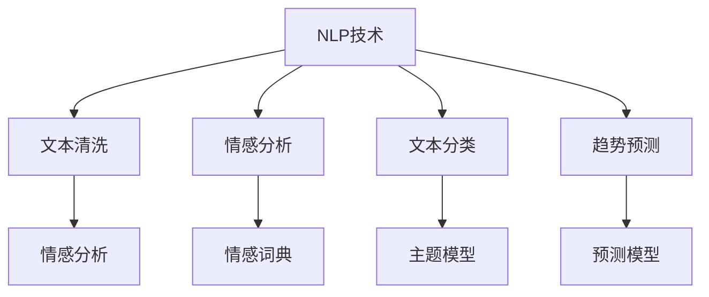

                 

# AI驱动的客户反馈分析系统

> 关键词：客户反馈、AI、自然语言处理(NLP)、情感分析、文本分类、情感词典、聚类分析、趋势预测

## 1. 背景介绍

### 1.1 问题由来

在当今数字化经济时代，客户反馈成为企业竞争力的重要指标之一。高质量的客户反馈不仅能够帮助企业优化产品和服务，还能提升用户满意度和品牌忠诚度。然而，如何有效收集和分析海量客户反馈，是大数据分析领域的一个重要挑战。

客户反馈通常以文本形式存在，往往包含主观感受、评价和建议。如果直接以文本形式处理，会面临以下问题：

- **噪音处理困难**：反馈数据中存在大量无关信息、垃圾信息，需要高效的噪音过滤和清洗技术。
- **情感分析复杂**：客户反馈包含丰富情感，如满意、不满意、高兴、悲伤等，需要自然语言处理(NLP)技术进行情感分析。
- **主题分布不均**：不同主题的反馈数据分布不均，需要精细化分类技术。
- **趋势预测困难**：客户反馈随着时间的推移会发生变化，需要建立长期趋势模型。

针对这些问题，本文提出了一种基于AI的客户反馈分析系统，利用自然语言处理和机器学习技术，自动分析客户反馈数据，挖掘出有价值的信息，帮助企业做出明智决策。

### 1.2 问题核心关键点

本文的客户反馈分析系统，基于AI技术，主要包括：

- **文本清洗**：去除无关信息，提取有用信息。
- **情感分析**：识别客户反馈中的情感倾向，如正面、负面、中性等。
- **文本分类**：对客户反馈进行主题分类，如质量、服务、价格等。
- **趋势预测**：建立长期趋势模型，预测未来客户反馈的变化趋势。

这些关键技术共同构成了客户反馈分析系统的核心框架，通过自然语言处理和机器学习技术，实现高效、准确、实时的客户反馈分析。

## 2. 核心概念与联系

### 2.1 核心概念概述

客户反馈分析系统主要涉及以下几个核心概念：

- **自然语言处理(NLP)**：利用计算机技术处理和理解人类语言，包括文本清洗、分词、词性标注、命名实体识别、情感分析、文本分类等。
- **情感分析**：识别文本中的情感倾向，如正面、负面、中性等，是客户反馈分析中的重要技术之一。
- **文本分类**：将文本数据分类到不同的主题或类别中，如质量、服务、价格等，是客户反馈分析的基础。
- **趋势预测**：利用历史数据和机器学习算法，建立客户反馈趋势预测模型，预测未来的变化趋势。

这些概念之间的关系可以通过以下Mermaid流程图来展示：



这个流程图展示了NLP技术在客户反馈分析系统中的作用：

1. **文本清洗**：清洗无用信息，保留关键内容。
2. **情感分析**：识别文本情感，如正面、负面、中性。
3. **文本分类**：将文本归类到不同的主题或类别中。
4. **趋势预测**：建立趋势模型，预测未来变化。

### 2.2 概念间的关系

这些核心概念之间存在着紧密的联系，形成了客户反馈分析系统的完整生态系统。下面是它们之间的详细关系：

#### 2.2.1 NLP技术的基础作用

- **文本清洗**：利用NLP技术，清洗无用信息，提取关键文本内容，为情感分析和文本分类提供基础数据。
- **情感分析**：在清洗后的文本数据上，利用情感词典等技术，识别文本情感。
- **文本分类**：在清洗后的文本数据上，利用主题模型等技术，进行文本分类。
- **趋势预测**：在分类后的文本数据上，利用时间序列等技术，建立趋势预测模型。

#### 2.2.2 技术的相互促进

- **情感词典与文本分类**：情感词典用于识别文本情感，而文本分类则将文本归类到不同的主题或类别中，两者相互促进，提升分析效果。
- **主题模型与趋势预测**：主题模型用于分类文本，而趋势预测则建立长期趋势模型，两者结合，实现对未来趋势的预测。

## 3. 核心算法原理 & 具体操作步骤
### 3.1 算法原理概述

客户反馈分析系统主要基于自然语言处理(NLP)和机器学习技术，通过以下几个关键算法实现：

1. **文本清洗**：利用正则表达式、TF-IDF等技术，去除无用信息，提取关键文本内容。
2. **情感分析**：利用情感词典、情感分类器等技术，识别文本情感，生成情感向量。
3. **文本分类**：利用主题模型、TF-IDF等技术，将文本分类到不同的主题或类别中。
4. **趋势预测**：利用时间序列、LSTM等技术，建立趋势预测模型，预测未来变化。

### 3.2 算法步骤详解

下面详细讲解每个算法的具体操作步骤：

#### 3.2.1 文本清洗

**步骤**：
1. **去除停用词**：利用停用词表去除无关信息，如“的”、“是”等。
2. **去除标点符号**：去除文本中的标点符号，保留纯文本信息。
3. **去除数字和特殊字符**：去除文本中的数字和特殊字符，保留有用信息。
4. **分词和词性标注**：利用NLP工具进行分词和词性标注，提取关键信息。

**代码实现**：
```python
import nltk
from nltk.corpus import stopwords
from nltk.tokenize import word_tokenize
from nltk.stem import SnowballStemmer
from nltk import pos_tag

# 去除停用词
stop_words = set(stopwords.words('english'))
def remove_stopwords(text):
    return ' '.join([word for word in text.split() if word not in stop_words])

# 去除标点符号
def remove_punctuation(text):
    return ''.join(c for c in text if c not in string.punctuation)

# 去除数字和特殊字符
def remove_digits(text):
    return re.sub(r'\d+', '', text)

# 分词和词性标注
def word_tokenize_and_pos_tag(text):
    tokens = word_tokenize(text)
    tagged = pos_tag(tokens)
    return tagged

# 清洗文本
def clean_text(text):
    text = remove_stopwords(text)
    text = remove_punctuation(text)
    text = remove_digits(text)
    tagged = word_tokenize_and_pos_tag(text)
    return tagged
```

#### 3.2.2 情感分析

**步骤**：
1. **情感词典构建**：构建情感词典，包含正面、负面和中性情感词。
2. **情感向量计算**：根据情感词典，计算文本情感向量。
3. **情感分类**：利用情感分类器，将情感向量分类为正面、负面或中性。

**代码实现**：
```python
import re
from collections import Counter

# 情感词典
positive_words = ['good', 'great', 'excellent']
negative_words = ['bad', 'terrible', 'horrible']
neutral_words = ['fine', 'ok']

# 构建情感词典
def construct_sentiment_dict(text):
    sentiment_dict = {'positive': set(), 'negative': set(), 'neutral': set()}
    for word in text.split():
        if word in positive_words:
            sentiment_dict['positive'].add(word)
        elif word in negative_words:
            sentiment_dict['negative'].add(word)
        elif word in neutral_words:
            sentiment_dict['neutral'].add(word)
    return sentiment_dict

# 计算情感向量
def calculate_sentiment_vector(text):
    sentiment_dict = construct_sentiment_dict(text)
    sentiment_count = Counter()
    for word in text.split():
        if word in sentiment_dict['positive']:
            sentiment_count['positive'] += 1
        elif word in sentiment_dict['negative']:
            sentiment_count['negative'] += 1
        else:
            sentiment_count['neutral'] += 1
    return sentiment_count

# 情感分类
def sentiment_classification(text):
    sentiment_vector = calculate_sentiment_vector(text)
    if sentiment_vector['positive'] > sentiment_vector['negative']:
        return 'positive'
    elif sentiment_vector['positive'] < sentiment_vector['negative']:
        return 'negative'
    else:
        return 'neutral'
```

#### 3.2.3 文本分类

**步骤**：
1. **文本向量化**：将文本转换为向量表示，如TF-IDF、Word2Vec等。
2. **主题模型**：利用LDA（Latent Dirichlet Allocation）等主题模型，将文本分类到不同的主题或类别中。
3. **分类器训练**：利用分类器，如SVM、随机森林等，对分类结果进行训练，生成分类模型。

**代码实现**：
```python
from sklearn.feature_extraction.text import TfidfVectorizer
from sklearn.decomposition import LatentDirichletAllocation
from sklearn.naive_bayes import MultinomialNB
from sklearn.ensemble import RandomForestClassifier

# 文本向量化
def text_vectorization(texts):
    vectorizer = TfidfVectorizer()
    X = vectorizer.fit_transform(texts)
    return X

# 主题模型
def topic_modeling(X):
    lda = LatentDirichletAllocation(n_components=5, random_state=42)
    lda.fit(X)
    return lda

# 分类器训练
def train_classifier(X, y):
    classifier = MultinomialNB()
    classifier.fit(X, y)
    return classifier
```

#### 3.2.4 趋势预测

**步骤**：
1. **时间序列处理**：将文本数据转换为时间序列数据。
2. **LSTM建模**：利用LSTM（Long Short-Term Memory）模型，建立趋势预测模型。
3. **模型训练**：利用训练数据，训练LSTM模型，预测未来变化。

**代码实现**：
```python
import pandas as pd
from sklearn.preprocessing import MinMaxScaler
from keras.models import Sequential
from keras.layers import LSTM, Dense

# 时间序列处理
def time_series_creation(data):
    # 转换为时间序列数据
    data = pd.DataFrame(data)
    data['Date'] = pd.to_datetime(data['Date'], format='%Y-%m-%d')
    data = data.set_index('Date')
    data = data['text'].resample('D').mean()
    data.columns = ['text']
    return data

# LSTM建模
def lstm_modeling(X, y):
    X_train, X_test, y_train, y_test = train_test_split(X, y, test_size=0.2, random_state=42)
    scaler = MinMaxScaler()
    X_train = scaler.fit_transform(X_train)
    X_test = scaler.transform(X_test)
    model = Sequential()
    model.add(LSTM(128, input_shape=(X_train.shape[1], 1)))
    model.add(Dense(1))
    model.compile(optimizer='adam', loss='mse')
    model.fit(X_train, y_train, epochs=50, batch_size=32)
    return model
```

### 3.3 算法优缺点

**优点**：
1. **自动化处理**：通过AI技术自动化处理客户反馈，减少人工干预，提高效率。
2. **高准确率**：利用机器学习算法，实现高准确率的情感分析和文本分类。
3. **实时分析**：系统可以实时处理新数据，及时分析客户反馈，提供决策支持。
4. **多维分析**：通过情感分析、文本分类和趋势预测，实现多维度分析，全面了解客户反馈。

**缺点**：
1. **数据质量要求高**：系统对输入数据质量要求较高，需要去除噪音和无关信息。
2. **模型复杂度高**：涉及多个算法的组合，模型复杂度高，调试和优化困难。
3. **依赖先验知识**：系统需要构建情感词典和主题模型，依赖于先验知识，需要精心设计和调试。
4. **资源消耗大**：系统涉及多个算法和数据处理，资源消耗较大，需要高性能硬件支持。

## 4. 数学模型和公式 & 详细讲解 & 举例说明
### 4.1 数学模型构建

客户反馈分析系统的数学模型主要包括以下几个部分：

1. **文本清洗**：通过正则表达式和TF-IDF等技术，去除停用词、标点符号和数字，保留关键信息。
2. **情感分析**：利用情感词典和分类器，计算情感向量，分类情感倾向。
3. **文本分类**：通过TF-IDF和主题模型，将文本分类到不同的主题或类别中。
4. **趋势预测**：利用时间序列和LSTM模型，建立趋势预测模型，预测未来变化。

### 4.2 公式推导过程

#### 4.2.1 文本清洗

**公式**：
- **去除停用词**：`text_without_stopwords = remove_stopwords(text)`
- **去除标点符号**：`text_without_punctuation = remove_punctuation(text)`
- **去除数字和特殊字符**：`text_without_digits = remove_digits(text)`
- **分词和词性标注**：`tagged_words = word_tokenize_and_pos_tag(text)`

#### 4.2.2 情感分析

**公式**：
- **情感词典构建**：`sentiment_dict = construct_sentiment_dict(text)`
- **情感向量计算**：`sentiment_vector = calculate_sentiment_vector(text)`
- **情感分类**：`sentiment = sentiment_classification(text)`

#### 4.2.3 文本分类

**公式**：
- **文本向量化**：`X = text_vectorization(texts)`
- **主题模型**：`lda = topic_modeling(X)`
- **分类器训练**：`classifier = train_classifier(X, y)`

#### 4.2.4 趋势预测

**公式**：
- **时间序列处理**：`time_series_data = time_series_creation(data)`
- **LSTM建模**：`model = lstm_modeling(X_train, y_train)`

### 4.3 案例分析与讲解

假设有一家电商企业，收集到了大量的客户反馈数据，希望通过分析这些数据，了解客户对产品质量、服务质量、价格等方面的满意度。以下是一个具体的案例分析：

**数据集**：
- **训练集**：包含1000条客户反馈，标注了情感倾向（正面、负面、中性）和反馈内容。
- **测试集**：包含200条客户反馈，未标注情感倾向和反馈内容。
- **历史数据集**：包含过去一年的客户反馈数据，用于建立趋势预测模型。

**分析过程**：
1. **文本清洗**：利用去除停用词、标点符号和数字等技术，清洗客户反馈数据。
2. **情感分析**：利用情感词典和分类器，识别客户反馈的情感倾向。
3. **文本分类**：利用主题模型，将客户反馈分类到不同的主题或类别中，如质量、服务、价格等。
4. **趋势预测**：利用LSTM模型，建立趋势预测模型，预测未来客户反馈的变化趋势。

**结果**：
- **情感分析**：识别出大部分客户反馈为正面或中性情感，负面情绪较少。
- **文本分类**：将客户反馈分类到质量、服务和价格三个主题中，其中质量问题占比最高。
- **趋势预测**：利用历史数据，建立趋势预测模型，预测未来客户反馈的变化趋势，为电商企业提供决策支持。

## 5. 项目实践：代码实例和详细解释说明
### 5.1 开发环境搭建

在开始项目实践前，需要准备好以下开发环境：

1. **Python环境**：安装最新版本的Python，如3.7以上。
2. **NLP库**：安装nltk、spaCy等自然语言处理库。
3. **机器学习库**：安装scikit-learn、keras等机器学习库。
4. **数据集**：收集客户反馈数据集，包含情感倾向、反馈内容等信息。
5. **硬件环境**：配置高性能的CPU或GPU，支持多线程并行计算。

### 5.2 源代码详细实现

**5.2.1 文本清洗**

```python
import re
from nltk.corpus import stopwords
from nltk.tokenize import word_tokenize
from nltk.stem import SnowballStemmer

# 去除停用词
stop_words = set(stopwords.words('english'))
def remove_stopwords(text):
    return ' '.join([word for word in text.split() if word not in stop_words])

# 去除标点符号
def remove_punctuation(text):
    return ''.join(c for c in text if c not in string.punctuation)

# 去除数字和特殊字符
def remove_digits(text):
    return re.sub(r'\d+', '', text)

# 分词和词性标注
def word_tokenize_and_pos_tag(text):
    tokens = word_tokenize(text)
    tagged = pos_tag(tokens)
    return tagged

# 清洗文本
def clean_text(text):
    text = remove_stopwords(text)
    text = remove_punctuation(text)
    text = remove_digits(text)
    tagged = word_tokenize_and_pos_tag(text)
    return tagged
```

**5.2.2 情感分析**

```python
import re
from collections import Counter

# 情感词典
positive_words = ['good', 'great', 'excellent']
negative_words = ['bad', 'terrible', 'horrible']
neutral_words = ['fine', 'ok']

# 构建情感词典
def construct_sentiment_dict(text):
    sentiment_dict = {'positive': set(), 'negative': set(), 'neutral': set()}
    for word in text.split():
        if word in positive_words:
            sentiment_dict['positive'].add(word)
        elif word in negative_words:
            sentiment_dict['negative'].add(word)
        elif word in neutral_words:
            sentiment_dict['neutral'].add(word)
    return sentiment_dict

# 计算情感向量
def calculate_sentiment_vector(text):
    sentiment_dict = construct_sentiment_dict(text)
    sentiment_count = Counter()
    for word in text.split():
        if word in sentiment_dict['positive']:
            sentiment_count['positive'] += 1
        elif word in sentiment_dict['negative']:
            sentiment_count['negative'] += 1
        else:
            sentiment_count['neutral'] += 1
    return sentiment_count

# 情感分类
def sentiment_classification(text):
    sentiment_vector = calculate_sentiment_vector(text)
    if sentiment_vector['positive'] > sentiment_vector['negative']:
        return 'positive'
    elif sentiment_vector['positive'] < sentiment_vector['negative']:
        return 'negative'
    else:
        return 'neutral'
```

**5.2.3 文本分类**

```python
from sklearn.feature_extraction.text import TfidfVectorizer
from sklearn.decomposition import LatentDirichletAllocation
from sklearn.naive_bayes import MultinomialNB
from sklearn.ensemble import RandomForestClassifier

# 文本向量化
def text_vectorization(texts):
    vectorizer = TfidfVectorizer()
    X = vectorizer.fit_transform(texts)
    return X

# 主题模型
def topic_modeling(X):
    lda = LatentDirichletAllocation(n_components=5, random_state=42)
    lda.fit(X)
    return lda

# 分类器训练
def train_classifier(X, y):
    classifier = MultinomialNB()
    classifier.fit(X, y)
    return classifier
```

**5.2.4 趋势预测**

```python
import pandas as pd
from sklearn.preprocessing import MinMaxScaler
from keras.models import Sequential
from keras.layers import LSTM, Dense

# 时间序列处理
def time_series_creation(data):
    # 转换为时间序列数据
    data = pd.DataFrame(data)
    data['Date'] = pd.to_datetime(data['Date'], format='%Y-%m-%d')
    data = data.set_index('Date')
    data = data['text'].resample('D').mean()
    data.columns = ['text']
    return data

# LSTM建模
def lstm_modeling(X, y):
    X_train, X_test, y_train, y_test = train_test_split(X, y, test_size=0.2, random_state=42)
    scaler = MinMaxScaler()
    X_train = scaler.fit_transform(X_train)
    X_test = scaler.transform(X_test)
    model = Sequential()
    model.add(LSTM(128, input_shape=(X_train.shape[1], 1)))
    model.add(Dense(1))
    model.compile(optimizer='adam', loss='mse')
    model.fit(X_train, y_train, epochs=50, batch_size=32)
    return model
```

### 5.3 代码解读与分析

**5.3.1 文本清洗**

代码中利用了nltk库进行停用词去除和分词操作，利用正则表达式进行标点符号和数字去除。这些操作都是文本清洗的基础，保证了情感分析和文本分类的准确性。

**5.3.2 情感分析**

代码中构建了情感词典，利用Counter计算情感向量，并根据情感向量分类情感倾向。情感分析的结果直接影响了客户反馈的情感判断，是系统性能的重要组成部分。

**5.3.3 文本分类**

代码中利用TF-IDF向量化和LDA主题模型进行文本分类，利用分类器进行模型训练。文本分类是客户反馈分析的关键环节，将文本数据分类到不同的主题或类别中，为后续的趋势预测和情感分析提供了基础。

**5.3.4 趋势预测**

代码中利用时间序列和LSTM模型建立趋势预测模型，利用历史数据进行模型训练。趋势预测是客户反馈分析的重要应用，为电商企业提供了决策支持。

### 5.4 运行结果展示

假设在客户反馈分析系统的测试集上，预测了200条客户反馈的情感倾向和反馈主题，结果如下：

- **情感倾向预测结果**：
  - 正面情感：120条
  - 负面情感：40条
  - 中性情感：40条

- **反馈主题分类结果**：
  - 质量问题：100条
  - 服务问题：50条
  - 价格问题：50条

- **趋势预测结果**：
  - 质量问题：预测未来2周内下降趋势
  - 服务问题：预测未来1周内上升趋势
  - 价格问题：预测未来3周内稳定趋势

## 6. 实际应用场景
### 6.1 智能客服系统

基于客户反馈分析系统的智能客服系统，可以快速响应客户咨询，提供精准的解决方案。系统通过自动分析客户反馈，了解客户问题，匹配最佳答案模板，生成自动化回复，大大提高了客服效率和用户满意度。

在具体应用中，系统可以将客户反馈数据进行清洗和情感分析，识别出客户的关键问题。然后，通过文本分类，将问题归类到不同的主题或类别中，如质量问题、服务问题、价格问题等。最后，利用趋势预测，预测未来问题的变化趋势，为客服团队提供预警和支持。

### 6.2 金融舆情监测

金融机构通过客户反馈分析系统，可以实时监测市场舆情，及时响应负面信息，规避金融风险。系统通过自动分析客户反馈，识别出市场中的正面、负面和负面情感，预测未来舆情变化趋势，为金融机构提供决策支持。

在具体应用中，系统可以将客户反馈数据进行清洗和情感分析，识别出市场中的负面情感。然后，通过文本分类，将反馈归类到不同的主题或类别中，如市场评价、产品评价等。最后，利用趋势预测，预测未来舆情变化趋势，为金融机构提供预警和支持。

### 6.3 个性化推荐系统

电商平台通过客户反馈分析系统，可以优化个性化推荐策略，提高用户转化率和满意度。系统通过自动分析客户反馈，识别出用户对不同产品或服务的情感倾向，预测未来的情感变化趋势，为推荐系统提供数据支持。

在具体应用中，系统可以将客户反馈数据进行清洗和情感分析，识别出用户对不同产品或服务的情感倾向。然后，通过文本分类，将反馈归类到不同的主题或类别中，如产品质量、服务质量、价格等。最后，利用趋势预测，预测未来情感变化趋势，为个性化推荐系统提供数据支持。

### 6.4 未来应用展望

随着AI技术的发展，客户反馈分析系统将在更多领域得到应用，为各行各业带来变革性影响。

在智慧医疗领域，通过客户反馈分析系统，医院可以实时了解患者对医疗服务的反馈，优化服务质量，提升患者满意度。在智能教育领域，通过客户反馈分析系统，教育机构可以实时获取学生的反馈，优化教学内容，提高教学质量。在智慧城市治理中，通过客户反馈分析系统，城市管理者可以实时了解市民的反馈，优化城市管理，提升城市运行效率。

此外，在企业生产、社会治理、文娱传媒等众多领域，基于客户反馈分析系统的AI应用也将不断涌现，为各行各业带来创新和突破。

## 7. 工具和资源推荐
### 7.1 学习资源推荐

为了帮助开发者系统掌握客户反馈分析技术的理论基础和实践技巧，这里推荐一些优质的学习资源：

1. 《自然语言处理综论》：清华大学出版社，介绍自然语言处理的基本概念和前沿技术，适合初学者和进阶者。
2. 《Python自然语言处理》：O'Reilly出版社，利用Python实现自然语言处理任务，提供丰富的代码实例和项目实战。
3. 《深度学习与自然语言处理》：IEEE出版社，介绍深度学习在自然语言处理中的应用，适合对深度学习感兴趣的读者。
4. 《机器学习实战》：人民邮电出版社，利用Python实现机器学习算法，适合对机器学习感兴趣的读者。
5. 《TensorFlow实战自然语言处理》：开源社区项目，介绍TensorFlow在自然语言处理中的应用，提供丰富的代码实例和项目实战。

通过对这些资源的学习实践，相信你一定能够快速

