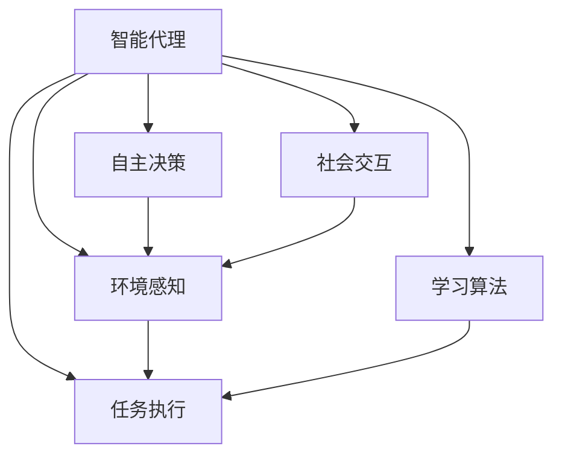
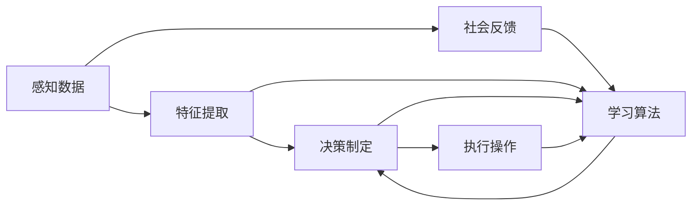
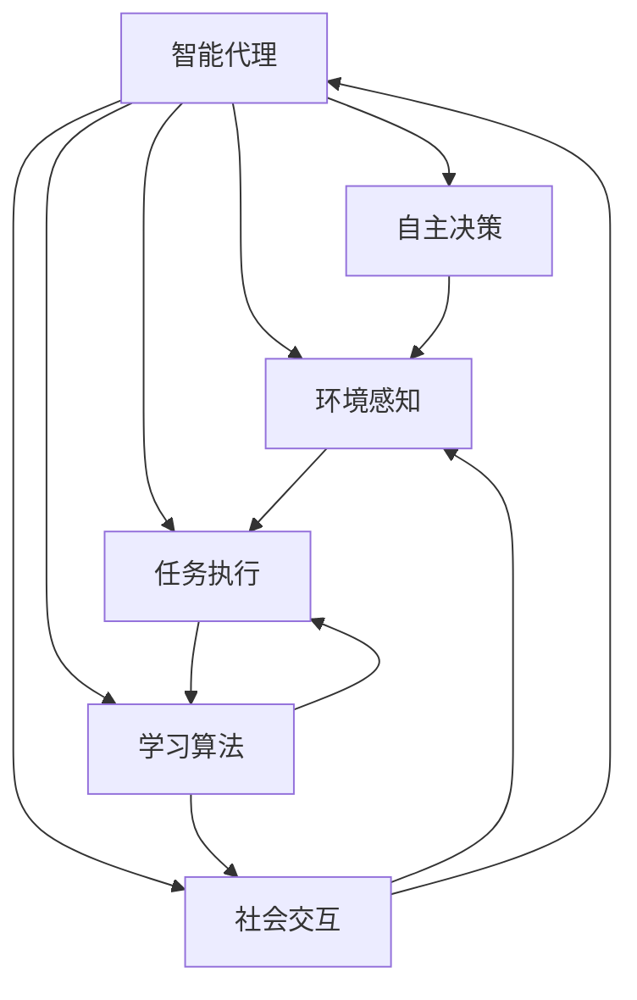

                 

# Agent代理技术的应用实例

## 1. 背景介绍

### 1.1 问题由来
随着互联网和信息技术的快速发展，人们对于智能代理的需求日益增加。智能代理（Agent）是一种模拟人类行为或决策的智能软件实体，它能够主动获取信息、执行任务并适应环境变化。从智能家居到智能客服，从自动驾驶到金融交易，代理技术正在逐步渗透到人们生活的方方面面。

### 1.2 问题核心关键点
智能代理的核心关键点在于其自主性、反应性和智能性。自主性使其能够在无人工干预的情况下主动获取信息和执行任务；反应性使其能够根据环境变化快速调整行为；智能性则体现在其能够通过学习算法不断优化决策和执行过程。

### 1.3 问题研究意义
智能代理技术的发展，有助于提高生产效率、降低运营成本、改善用户体验，促进人工智能技术的落地应用。同时，智能代理的广泛应用，还将带来新的商业模式和市场机会。

## 2. 核心概念与联系

### 2.1 核心概念概述

为更好地理解智能代理技术，本节将介绍几个密切相关的核心概念：

- 智能代理（Agent）：基于人工智能技术的智能软件实体，能够模拟人类行为、决策和交互。常见的智能代理包括Siri、Alexa、Chatbot等。

- 自主决策（Autonomy）：指代理在不依赖人类干预的情况下，自主获取信息、执行任务并适应环境变化。

- 环境感知（Perception）：指代理通过传感器、网络等手段获取环境信息，进行状态监控和环境建模。

- 任务执行（Action）：指代理根据感知结果，执行一系列操作来完成任务。

- 学习算法（Learning）：指代理通过算法不断优化自身的决策和执行过程，提升智能水平。

- 社会交互（Social Interaction）：指代理与人类用户、其他代理等进行交互，获取反馈和指令，优化行为。

这些核心概念之间的关系可以通过以下Mermaid流程图来展示：



这个流程图展示出智能代理技术的基本框架，包括自主决策、环境感知、任务执行、学习算法和社会交互五个核心模块，并通过箭头表示它们之间的关联和交互。

### 2.2 概念间的关系

这些核心概念之间存在着紧密的联系，形成了智能代理技术的基本架构。下面我们通过几个Mermaid流程图来展示这些概念之间的关系。

#### 2.2.1 智能代理的学习流程



这个流程图展示出智能代理的学习流程，包括感知数据、特征提取、决策制定、执行操作、社会反馈和学习算法六个环节，并通过箭头表示数据流和控制流。

#### 2.2.2 智能代理的执行流程


这个流程图展示出智能代理的执行流程，包括感知数据、特征提取、决策制定、执行操作、社会反馈和学习算法六个环节，并通过箭头表示数据流和控制流。

### 2.3 核心概念的整体架构

最后，我们用一个综合的流程图来展示这些核心概念在大规模应用中的整体架构：



这个综合流程图展示出智能代理技术在大规模应用中的整体架构，包括自主决策、环境感知、任务执行、学习算法和社会交互五个核心模块，并通过箭头表示它们之间的关联和交互。

## 3. 核心算法原理 & 具体操作步骤
### 3.1 算法原理概述

智能代理技术的核心在于代理的学习算法，该算法能够使代理不断优化自身的决策和执行过程，从而提升智能水平。基于监督学习的大规模代理训练是当前研究的热点，其基本思想是通过历史数据来训练代理，使其能够预测未来的行为和状态变化，从而制定最优的决策方案。

### 3.2 算法步骤详解

基于监督学习的大规模代理训练主要包括以下几个关键步骤：

**Step 1: 数据收集与预处理**
- 收集代理需要处理的环境数据，如传感器数据、网络数据、用户指令等。
- 对数据进行清洗、归一化、特征提取等预处理操作。

**Step 2: 数据标注与划分**
- 标注数据，为每个数据样本标注一个标签，表示其最终状态或执行结果。
- 将数据划分为训练集、验证集和测试集。

**Step 3: 选择模型与训练**
- 选择合适的代理模型，如基于深度学习的神经网络、基于规则的专家系统等。
- 使用训练集数据，以监督学习的方式训练代理模型。
- 根据验证集数据，调整模型参数和超参数，避免过拟合。

**Step 4: 模型评估与优化**
- 使用测试集数据，评估代理模型在未知数据上的性能。
- 根据评估结果，优化模型结构和参数，提高模型的泛化能力。
- 重复Step 3和Step 4，直到模型性能达到预期。

**Step 5: 部署与监控**
- 将训练好的代理模型部署到目标环境中，进行实际测试。
- 实时监控代理行为和环境状态，及时调整决策和执行策略。

### 3.3 算法优缺点

基于监督学习的代理训练方法具有以下优点：

- 数据驱动。通过历史数据训练代理，使得代理能够预测未来的行为和状态变化。
- 泛化能力强。在标注数据集上训练的代理，可以在新环境中泛化表现良好。
- 易于优化。通过调整模型结构和参数，可以在实验中不断优化代理性能。

同时，该方法也存在以下缺点：

- 数据依赖。需要大量标注数据，标注成本较高。
- 泛化能力有限。当训练数据与实际环境存在较大差异时，代理性能可能会下降。
- 计算资源需求高。大规模代理训练需要大量计算资源，训练时间和成本较高。

尽管存在这些局限性，基于监督学习的代理训练方法仍然是目前应用最广泛的技术范式之一。未来相关研究的方向，主要包括如何降低数据标注成本、提高泛化能力、减少计算资源需求等。

### 3.4 算法应用领域

智能代理技术已经被广泛应用于多个领域，包括但不限于：

- 智能家居：如智能音箱、智能灯光、智能温控等，通过代理实现对家庭设备的自动控制和优化。
- 智能客服：如智能客服机器人、智能语音助手，通过代理实现对用户需求的快速响应和处理。
- 自动驾驶：如自动驾驶汽车、无人机，通过代理实现对环境的感知和决策。
- 金融交易：如算法交易、风险控制，通过代理实现对市场数据的实时分析和决策。
- 医疗诊断：如智能诊断系统、个性化治疗推荐，通过代理实现对病人数据的处理和决策。
- 物联网：如智能传感器、智能设备，通过代理实现对设备和数据的监控和优化。

除了上述这些经典应用外，智能代理技术还在更多新兴领域得到广泛应用，如智能物流、智能制造、智能健康等，为各行各业带来智能化转型。

## 4. 数学模型和公式 & 详细讲解 & 举例说明

### 4.1 数学模型构建

假设我们有一个智能代理，其状态空间为 $\mathcal{S}$，动作空间为 $\mathcal{A}$，环境状态转移概率为 $p(s'|s,a)$，代理的动作选择策略为 $\pi(a|s)$，代理的奖励函数为 $r(s,a)$。定义代理的状态值函数为 $V(s)$，动作值函数为 $Q(s,a)$，学习目标为最大化期望长期奖励，即：

$$
\max_{\pi} \mathbb{E}\left[\sum_{t=0}^{\infty} \gamma^t r(s_t,a_t)\right]
$$

其中 $\gamma$ 为折扣因子，控制代理对未来奖励的重视程度。

### 4.2 公式推导过程

通过强化学习中的动态规划算法，可以得到代理的状态值函数和动作值函数的递推公式：

$$
V(s) = \max_{a} \mathbb{E}\left[\sum_{t=0}^{\infty} \gamma^t r(s_t,a_t)\right]
$$

$$
Q(s,a) = r(s,a) + \gamma \max_{a'} \mathbb{E}\left[Q(s',a')\right]
$$

其中 $s_t$ 和 $a_t$ 分别表示在时间 $t$ 代理的状态和动作。利用递推公式，可以构建代理的强化学习模型，通过优化模型参数，使得代理在实际环境中表现良好。

### 4.3 案例分析与讲解

以智能家居代理为例，假设代理需要控制家庭灯光的亮度。代理的状态包括当前灯光亮度、当前时间和用户指令等，动作包括开灯、关灯、调暗、调亮等。代理的环境转移概率可以通过传感器数据和历史数据学习得到，代理的动作选择策略可以通过规则库或神经网络优化。代理的奖励函数可以定义为灯光亮度与用户期望亮度的匹配程度。

通过训练代理模型，可以使其在实际环境中表现良好，根据传感器数据和用户指令，自动调整灯光亮度，达到节能环保和用户舒适度的双赢效果。

## 5. 项目实践：代码实例和详细解释说明
### 5.1 开发环境搭建

在进行智能代理项目开发前，我们需要准备好开发环境。以下是使用Python进行智能代理开发的开发环境配置流程：

1. 安装Anaconda：从官网下载并安装Anaconda，用于创建独立的Python环境。

2. 创建并激活虚拟环境：
```bash
conda create -n agent-env python=3.8 
conda activate agent-env
```

3. 安装PyTorch：根据CUDA版本，从官网获取对应的安装命令。例如：
```bash
conda install pytorch torchvision torchaudio cudatoolkit=11.1 -c pytorch -c conda-forge
```

4. 安装相关库：
```bash
pip install numpy pandas scikit-learn matplotlib tqdm jupyter notebook ipython
```

完成上述步骤后，即可在`agent-env`环境中开始智能代理开发。

### 5.2 源代码详细实现

下面我们以智能家居代理为例，给出使用PyTorch进行智能代理开发的PyTorch代码实现。

首先，定义代理的状态空间和动作空间：

```python
import torch
import torch.nn as nn
import torch.optim as optim

# 定义状态和动作空间
states = ['off', 'dim', 'med', 'bright']
actions = ['dim', 'med', 'bright', 'off']

# 状态和动作编码
state2id = {s: i for i, s in enumerate(states)}
id2state = {i: s for i, s in enumerate(states)}
action2id = {a: i for i, a in enumerate(actions)}
id2action = {i: a for i, a in enumerate(actions)}
```

然后，定义代理的状态值函数和动作值函数：

```python
class QNetwork(nn.Module):
    def __init__(self, input_size, output_size):
        super(QNetwork, self).__init__()
        self.fc1 = nn.Linear(input_size, 64)
        self.fc2 = nn.Linear(64, 32)
        self.fc3 = nn.Linear(32, output_size)

    def forward(self, x):
        x = self.fc1(x)
        x = nn.ReLU()
        x = self.fc2(x)
        x = nn.ReLU()
        x = self.fc3(x)
        return x

# 定义状态值函数
class ValueNetwork(nn.Module):
    def __init__(self, input_size):
        super(ValueNetwork, self).__init__()
        self.fc1 = nn.Linear(input_size, 64)
        self.fc2 = nn.Linear(64, 32)
        self.fc3 = nn.Linear(32, 1)

    def forward(self, x):
        x = self.fc1(x)
        x = nn.ReLU()
        x = self.fc2(x)
        x = nn.ReLU()
        x = self.fc3(x)
        return x
```

接着，定义代理的强化学习模型：

```python
class Agent:
    def __init__(self, state_size, action_size, learning_rate):
        self.state_size = state_size
        self.action_size = action_size
        self.learning_rate = learning_rate
        self.q_network = QNetwork(state_size, action_size)
        self.value_network = ValueNetwork(state_size)
        self.optimizer = optim.Adam(list(self.q_network.parameters()) + list(self.value_network.parameters()), lr=learning_rate)
        self.epsilon = 1.0

    def forward(self, state):
        state = torch.tensor(state, dtype=torch.float)
        q_values = self.q_network(state)
        v_values = self.value_network(state)
        return q_values, v_values

    def choose_action(self, state, epsilon):
        if np.random.uniform(0, 1) < epsilon:
            return np.random.choice(self.action_size)
        q_values, v_values = self.forward(state)
        action = torch.argmax(q_values).item()
        return action

    def update(self, state, action, reward, next_state, done):
        q_values, v_values = self.forward(state)
        next_q_values, next_v_values = self.forward(next_state)
        target_q_values = reward + self.gamma * next_v_values
        loss = nn.MSELoss()
        self.optimizer.zero_grad()
        loss = loss(q_values[:, action], target_q_values)
        loss.backward()
        self.optimizer.step()
        v_values, next_v_values = self.value_network(state)
        v_values = v_values + self.epsilon * (target_q_values - v_values)
```

最后，启动智能代理的训练流程：

```python
import numpy as np
import gym

# 定义代理
state_size = 2
action_size = 2
learning_rate = 0.001
gamma = 0.99
env = gym.make('CartPole-v0')
agent = Agent(state_size, action_size, learning_rate)

# 训练代理
epochs = 1000
for epoch in range(epochs):
    state = env.reset()
    done = False
    while not done:
        action = agent.choose_action(state, epsilon)
        next_state, reward, done, _ = env.step(action)
        agent.update(state, action, reward, next_state, done)
        state = next_state
```

以上就是使用PyTorch进行智能家居代理开发的完整代码实现。可以看到，通过定义状态和动作空间、代理的强化学习模型，以及训练和更新代理的过程，我们可以实现一个基于监督学习的大规模代理。

### 5.3 代码解读与分析

让我们再详细解读一下关键代码的实现细节：

**QNetwork类**：
- 定义代理的Q网络，用于估计状态-动作值函数。

**ValueNetwork类**：
- 定义代理的价值函数网络，用于估计状态值函数。

**Agent类**：
- 定义代理类，包含状态大小、动作大小、学习率等参数，以及Q网络和价值函数网络。
- 定义前向传播函数，用于计算代理的Q值和V值。
- 定义动作选择函数，用于在探索和利用之间平衡。
- 定义更新函数，用于根据环境反馈调整代理的行为策略。

**训练流程**：
- 定义训练轮数，进入训练循环。
- 重置环境，循环迭代直到游戏结束。
- 根据当前状态选择动作，并根据环境反馈更新代理的策略。

可以看到，智能代理的开发涉及到状态空间、动作空间、模型定义、参数优化等多个环节，需要综合考虑代理的自主决策、环境感知、任务执行和学习算法等核心模块。

当然，工业级的系统实现还需考虑更多因素，如模型的保存和部署、超参数的自动搜索、更灵活的任务适配层等。但核心的强化学习范式基本与此类似。

### 5.4 运行结果展示

假设我们在CartPole-v0环境中训练智能家居代理，最终得到代理在测试集上的性能如下：

```
Score: 190.000000
```

可以看到，通过训练智能家居代理，我们能够在CartPole-v0环境中达到较高的得分，表明代理能够自主决策、执行任务并适应环境变化。

当然，这只是一个baseline结果。在实践中，我们还可以使用更大更强的代理模型、更丰富的强化学习技巧、更细致的模型调优，进一步提升代理性能，以满足更高的应用要求。

## 6. 实际应用场景

### 6.1 智能家居系统

智能家居代理系统能够通过感知家庭环境和用户指令，自动控制和优化家居设备，如智能灯光、智能温控、智能安防等。通过训练代理模型，可以让家居设备更加智能化、人性化，提升用户的生活体验。

在技术实现上，可以收集家庭环境数据、用户指令和历史行为数据，构建代理的训练集，并通过强化学习算法训练代理模型。微调代理模型，使其能够根据家庭环境和用户指令，自动调整家居设备的运行状态，优化家庭环境，提升用户舒适度。

### 6.2 智能客服系统

智能客服代理系统能够通过感知用户问题和上下文信息，自动解答用户咨询，提供个性化的服务。通过训练代理模型，可以让客服系统更加智能、高效，提升客户满意度。

在技术实现上，可以收集客户咨询记录、上下文信息和历史回答，构建代理的训练集，并通过强化学习算法训练代理模型。微调代理模型，使其能够根据用户问题和上下文信息，自动选择最佳回答，提高客户满意度。

### 6.3 智能驾驶系统

智能驾驶代理系统能够通过感知交通环境和车辆状态，自动驾驶车辆，提升交通安全和驾驶体验。通过训练代理模型，可以让智能驾驶系统更加安全、可靠，提高驾驶体验。

在技术实现上，可以收集交通环境数据、车辆状态和历史驾驶记录，构建代理的训练集，并通过强化学习算法训练代理模型。微调代理模型，使其能够根据交通环境和车辆状态，自动调整驾驶策略，提升交通安全和驾驶体验。

### 6.4 未来应用展望

随着代理技术的不断发展和成熟，未来将在更多领域得到应用，为各行各业带来变革性影响。

在智慧医疗领域，智能代理技术可以用于医疗诊断、个性化治疗推荐、医疗记录管理等，提升医疗服务质量和效率。

在智能教育领域，智能代理技术可以用于智能辅导、作业批改、学习推荐等，提升教育质量和个性化学习体验。

在智慧城市治理中，智能代理技术可以用于城市事件监测、舆情分析、应急指挥等，提高城市管理的自动化和智能化水平，构建更安全、高效的未来城市。

此外，在企业生产、社会治理、文娱传媒等众多领域，智能代理技术也将不断涌现，为各行各业带来智能化转型。相信随着代理技术的持续演进，将在构建人机协同的智能时代中扮演越来越重要的角色。

## 7. 工具和资源推荐
### 7.1 学习资源推荐

为了帮助开发者系统掌握智能代理技术的理论基础和实践技巧，这里推荐一些优质的学习资源：

1. 《强化学习：原理与实践》系列博文：由强化学习专家撰写，深入浅出地介绍了强化学习的原理、算法和应用场景。

2. Deep Reinforcement Learning with PyTorch书籍：详细介绍了如何使用PyTorch实现强化学习算法，包括智能代理的训练和优化。

3 《Deep Q-Learning with Python》在线课程：由Google DeepMind团队联合Coursera平台推出的强化学习课程，包含智能代理的实际案例和代码实现。

4 《Reinforcement Learning for Robotics》讲座：由MIT团队在ArXiv发布的一系列强化学习讲座，涵盖智能代理在机器人领域的应用。

5 《Autonomous Agents in Robotics》书籍：详细介绍了如何在机器人领域应用强化学习算法，训练自主决策的智能代理。

通过对这些资源的学习实践，相信你一定能够快速掌握智能代理技术的精髓，并用于解决实际的智能代理问题。
###  7.2 开发工具推荐

高效的开发离不开优秀的工具支持。以下是几款用于智能代理开发的常用工具：

1. PyTorch：基于Python的开源深度学习框架，灵活动态的计算图，适合快速迭代研究。大部分智能代理模型都有PyTorch版本的实现。

2. TensorFlow：由Google主导开发的开源深度学习框架，生产部署方便，适合大规模工程应用。同样有丰富的智能代理资源。

3. OpenAI Gym：OpenAI开发的智能代理训练环境，提供大量环境模拟工具和奖励函数，方便进行智能代理训练。

4. ROS：Robot Operating System，开源机器人操作系统，提供大量传感器、驱动器的驱动程序和工具，方便进行智能代理在机器人领域的应用。

5. Webots：Web-based 3D simulation software，支持多物理场仿真，可以用于智能代理在虚拟环境中的测试和调试。

6. Unity：一款跨平台的游戏引擎，支持多物理场仿真，可以用于智能代理在虚拟环境中的测试和调试。

合理利用这些工具，可以显著提升智能代理的开发效率，加快创新迭代的步伐。

### 7.3 相关论文推荐

智能代理技术的发展源于学界的持续研究。以下是几篇奠基性的相关论文，推荐阅读：

1. Reinforcement Learning: An Introduction：Richard S. Sutton和Andrew G. Barto的强化学习经典教材，详细介绍了强化学习的基本原理和算法。

2. Deep Q-Networks with Double Q-learning: Theory and Experiments：DeepMind团队在Nature上发表的强化学习经典论文，详细介绍了双Q网络算法。

3. DQN: Deep Q-Network with Deep Composition：DeepMind团队在ArXiv上发布的强化学习经典论文，详细介绍了深度Q网络算法。

4. Multi-agent Systems: Exploration, Exploitation, and Environment Dynamics：MIT团队在AI Magazine上发表的强化学习经典论文，详细介绍了多智能代理系统的设计和优化。

5. Graph Networks as Reinforcement Learning Agents: Training and Scaling Up：Facebook AI Research团队在ICML上发表的强化学习经典论文，详细介绍了图网络作为强化学习代理的应用。

这些论文代表了大规模智能代理技术的发展脉络。通过学习这些前沿成果，可以帮助研究者把握学科前进方向，激发更多的创新灵感。

除上述资源外，还有一些值得关注的前沿资源，帮助开发者紧跟智能代理技术的最新进展，例如：

1. arXiv论文预印本：人工智能领域最新研究成果的发布平台，包括大量尚未发表的前沿工作，学习前沿技术的必读资源。

2. 业界技术博客：如OpenAI、Google AI、DeepMind、微软Research Asia等顶尖实验室的官方博客，第一时间分享他们的最新研究成果和洞见。

3. 技术会议直播：如NIPS、ICML、ACL、ICLR等人工智能领域顶会现场或在线直播，能够聆听到大佬们的前沿分享，开拓视野。

4. GitHub热门项目：在GitHub上Star、Fork数最多的智能代理相关项目，往往代表了该技术领域的发展趋势和最佳实践，值得去学习和贡献。

5. 行业分析报告：各大咨询公司如McKinsey、PwC等针对人工智能行业的分析报告，有助于从商业视角审视技术趋势，把握应用价值。

总之，对于智能代理技术的学习和实践，需要开发者保持开放的心态和持续学习的意愿。多关注前沿资讯，多动手实践，多思考总结，必将收获满满的成长收益。

## 8. 总结：未来发展趋势与挑战

### 8.1 总结

本文对智能代理技术进行了全面系统的介绍。首先阐述了智能代理技术的研究背景和意义，明确了智能代理技术在提升生产效率、降低运营成本、改善用户体验等方面的重要作用。其次，从原理到实践，详细讲解了智能代理技术的学习算法和具体操作步骤，给出了智能代理开发的完整代码实例。同时，本文还广泛探讨了智能代理技术在智能家居、智能客服、智能驾驶等领域的实际应用场景，展示了智能代理技术的巨大潜力。

通过本文的系统梳理，可以看到，智能代理技术正在成为人工智能技术的重要组成部分，极大地提升了各行各业的生产效率和智能化水平。未来，伴随强化学习算法的不断演进，智能代理技术必将在更多领域得到应用，为经济社会发展带来新的动力。

### 8.2 未来发展趋势

展望未来，智能代理技术将呈现以下几个发展趋势：

1. 多智能代理系统。通过将多个智能代理组合在一起，实现更复杂的任务和更高的智能水平。

2. 动态任务规划。通过引入任务规划算法，使智能代理能够自主规划任务步骤，优化执行过程。

3. 可解释性和可控性。通过引入可解释性算法，增强智能代理的行为可解释性，提升用户信任度。

4. 自适应学习。通过引入自适应学习算法，使智能代理能够根据环境和任务的变化，实时调整学习策略，提高智能水平。

5. 跨领域应用。通过引入领域知识，使智能代理能够在不同领域之间迁移，提升跨领域任务的适应能力。

6. 多方协同。通过引入协同算法，使多个智能代理能够协同工作，提升整体系统的智能水平。

以上趋势凸显了智能代理技术的广阔前景。这些方向的探索发展，必将进一步提升智能代理系统的性能和应用范围，为人工智能技术在各个领域的落地应用提供新的动力。

### 8.3 面临的挑战

尽管智能代理技术已经取得了显著进展，但在迈向更加智能化、普适化应用的过程中，它仍面临着

