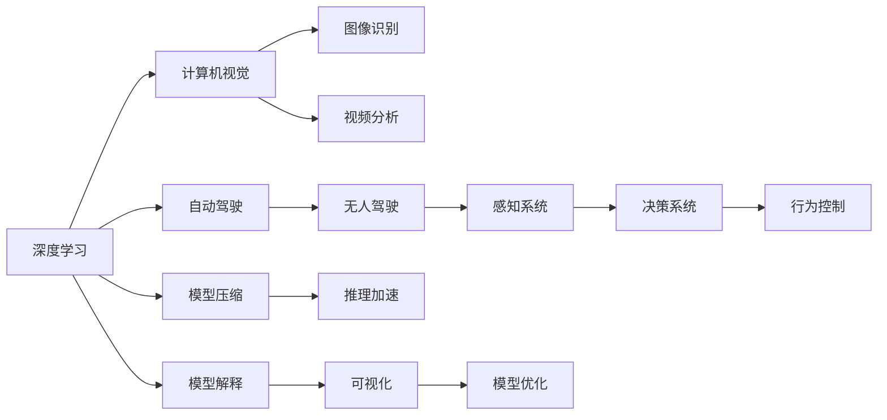

                 

# Andrej Karpathy的AI观点与分享

## 1. 背景介绍

Andrej Karpathy，一位在人工智能领域享有盛誉的专家，不仅在学术界有着卓越的成就，在工业界的贡献也广受赞誉。作为一名世界顶级的计算机视觉和深度学习专家，他在图像识别、自动驾驶、计算机视觉等方面的研究一直处于前沿，对AI社区的发展有着深远影响。

### 1.1 问题由来

随着深度学习技术的迅猛发展，AI界进入了一个新的阶段，AI技术从实验室走向实用，应用领域日益广泛，涉及自动驾驶、智能安防、智能医疗等众多领域。然而，AI技术的普及和落地也面临诸多挑战。如何更高效地开发和部署AI模型，如何保证AI模型的可靠性和安全性，如何应对AI技术带来的伦理问题等，都是AI界需要深入探讨的问题。

### 1.2 问题核心关键点

Andrej Karpathy在多个公开演讲和博客文章中，分享了自己对于AI技术发展现状、挑战以及未来方向的观点。他强调，AI技术的可持续发展需要跨学科的合作，既需要计算机科学家在算法和模型上的创新，也需要伦理学家、社会学家、政策制定者等多方的参与和指导。

## 2. 核心概念与联系

### 2.1 核心概念概述

Andrej Karpathy在分享中多次提到以下概念：

- **深度学习**：通过构建深层神经网络，从大量数据中学习复杂映射关系，实现高效的特征提取和模式识别。
- **计算机视觉**：通过深度学习技术，实现对图像、视频等视觉数据的理解和处理。
- **自动驾驶**：利用AI技术，实现无人驾驶车辆的安全行驶。
- **模型压缩和加速**：通过剪枝、量化等技术，减小模型尺寸，提升推理速度。
- **模型解释和可视化**：通过可视化技术，理解模型内部机制，辅助模型优化和调试。

### 2.2 概念间的关系

这些核心概念之间的联系可以用以下Mermaid流程图来展示：

通过这个图表，我们可以看到，深度学习不仅是计算机视觉和自动驾驶的基础，同时也推动了模型压缩和加速、模型解释和可视化的发展。这些技术相互促进，共同推动了AI技术的进步。

## 3. 核心算法原理 & 具体操作步骤

### 3.1 算法原理概述

Andrej Karpathy在多个场合强调了深度学习算法的原理和核心思想。深度学习通过构建深层神经网络，通过前向传播和反向传播算法，不断优化模型参数，实现对数据的复杂映射。其核心在于通过大量数据训练，学习数据的隐含特征，并利用这些特征进行分类、识别等任务。

### 3.2 算法步骤详解

深度学习算法的具体操作步骤主要包括以下几个步骤：

1. **数据准备**：收集和处理数据，确保数据集的多样性和代表性。
2. **模型构建**：选择合适的深度学习模型架构，如卷积神经网络(CNN)、循环神经网络(RNN)、变分自编码器(VAE)等。
3. **模型训练**：使用训练数据集对模型进行前向传播和反向传播，不断调整模型参数，最小化损失函数。
4. **模型验证**：在验证数据集上评估模型性能，选择最优模型。
5. **模型部署**：将训练好的模型部署到实际应用中，进行推理和预测。

### 3.3 算法优缺点

深度学习的优点包括：

- **高效特征提取**：通过深层网络，可以自动学习到数据的隐含特征，提升模型性能。
- **应用广泛**：深度学习技术已经应用于图像识别、语音识别、自然语言处理等诸多领域。
- **可扩展性**：深度学习模型可以通过增加层数、节点数等手段，提升模型复杂度和性能。

深度学习的缺点包括：

- **资源需求高**：深度学习模型需要大量的计算资源和存储空间。
- **过拟合风险**：深度学习模型容易在训练数据上过拟合，导致模型泛化能力差。
- **可解释性差**：深度学习模型的内部机制难以理解，难以进行模型解释和调试。

### 3.4 算法应用领域

深度学习技术已经在多个领域得到了广泛应用，如计算机视觉、自然语言处理、自动驾驶等。以下是几个典型应用：

- **图像识别**：通过训练深度学习模型，可以实现对图像中的物体、场景、人脸等的识别。
- **语音识别**：利用深度学习技术，可以将语音信号转化为文本，实现语音转写。
- **自然语言处理**：通过训练深度学习模型，可以实现机器翻译、文本生成、情感分析等任务。
- **自动驾驶**：利用深度学习技术，可以实现对环境感知、行为决策等功能的自动化。

## 4. 数学模型和公式 & 详细讲解 & 举例说明

### 4.1 数学模型构建

深度学习的数学模型可以概括为以下形式：

$$
\min_{\theta} \mathcal{L}(\theta) = \frac{1}{N} \sum_{i=1}^N \ell(y_i, \hat{y}_i)
$$

其中，$\theta$ 为模型参数，$y_i$ 为真实标签，$\hat{y}_i$ 为模型预测结果，$\ell$ 为损失函数，$\mathcal{L}$ 为经验风险。常用的损失函数包括交叉熵损失、均方误差损失等。

### 4.2 公式推导过程

以交叉熵损失为例，其推导过程如下：

$$
\ell(y_i, \hat{y}_i) = -\frac{1}{N} \sum_{i=1}^N [y_i \log \hat{y}_i + (1-y_i) \log (1-\hat{y}_i)]
$$

其中，$y_i$ 为真实标签，$\hat{y}_i$ 为模型预测结果，$N$ 为样本数量。

### 4.3 案例分析与讲解

以下以图像分类任务为例，讲解深度学习模型的构建和训练过程：

1. **数据准备**：收集和处理图像数据，确保数据集的多样性和代表性。
2. **模型构建**：选择合适的卷积神经网络架构，如ResNet、VGG等。
3. **模型训练**：使用训练数据集对模型进行前向传播和反向传播，不断调整模型参数，最小化交叉熵损失。
4. **模型验证**：在验证数据集上评估模型性能，选择最优模型。
5. **模型部署**：将训练好的模型部署到实际应用中，进行图像分类任务。

## 5. Andrej Karpathy的AI观点与分享

### 5.1 深度学习技术的可持续发展

Andrej Karpathy强调，深度学习技术的可持续发展需要跨学科的合作，既需要计算机科学家在算法和模型上的创新，也需要伦理学家、社会学家、政策制定者等多方的参与和指导。只有多方面的共同努力，才能确保AI技术的健康发展。

### 5.2 深度学习模型的可靠性和安全性

Andrej Karpathy指出，深度学习模型的不透明性和黑盒特性，带来了模型解释和调试的困难。为了确保模型的可靠性和安全性，需要在模型训练过程中引入可解释性和可解释性技术，建立透明、可解释的模型，并加强对模型输出的监控和审查。

### 5.3 AI技术的伦理问题

Andrej Karpathy认为，AI技术的广泛应用，带来了诸多伦理问题。如何平衡技术进步和伦理道德，确保AI技术的公平、公正、透明，是AI社区必须面对的重要课题。他建议，AI技术的开发者和使用者需要具备伦理意识和责任感，在技术开发和应用过程中，始终将伦理道德放在首位。

### 5.4 未来AI技术的发展趋势

Andrej Karpathy认为，未来AI技术的发展将呈现以下趋势：

- **跨学科融合**：AI技术的发展将越来越多地与其他学科进行融合，如心理学、社会学、经济学等。
- **自监督学习**：未来将更多地使用自监督学习技术，减少对标注数据的需求，提升模型的泛化能力和鲁棒性。
- **模型压缩和加速**：随着计算资源的丰富和计算硬件的升级，AI模型将向更大、更复杂的方向发展，但同时也需要更高效的模型压缩和加速技术，确保模型的推理速度和计算效率。
- **模型解释和可视化**：未来将更多地使用可视化技术，帮助用户理解模型的内部机制，辅助模型优化和调试。
- **伦理和社会责任**：AI技术的开发者和使用者需要具备伦理意识和责任感，确保AI技术的公平、公正、透明，避免潜在的伦理风险。

## 6. 工具和资源推荐

### 6.1 学习资源推荐

为了帮助开发者系统掌握深度学习技术的理论基础和实践技巧，这里推荐一些优质的学习资源：

1. **Deep Learning Specialization（斯坦福大学）**：斯坦福大学开设的深度学习课程，由Andrew Ng主讲，系统介绍了深度学习的基本概念、原理和算法。
2. **《Deep Learning》（Ian Goodfellow）**：Ian Goodfellow等编著的深度学习经典教材，系统介绍了深度学习的理论基础和实践技术。
3. **《Deep Learning with PyTorch》（Eli Stevens）**：Eli Stevens等编著的PyTorch深度学习教程，通过实际案例讲解深度学习模型的构建和训练过程。
4. **Kaggle**：Kaggle是一个数据科学竞赛平台，提供丰富的数据集和竞赛项目，帮助开发者提升实战能力。
5. **Google Deep Learning Papers**：Google深度学习团队发布的深度学习论文合集，涵盖深度学习领域的前沿研究成果。

通过对这些资源的学习实践，相信你一定能够快速掌握深度学习技术的精髓，并用于解决实际的AI问题。

### 6.2 开发工具推荐

在深度学习开发过程中，选择合适的工具和框架是至关重要的。以下是几款常用的深度学习开发工具：

1. **TensorFlow**：由Google开发的深度学习框架，支持大规模分布式训练和部署。
2. **PyTorch**：由Facebook开发的深度学习框架，以其灵活性和易用性著称。
3. **Keras**：Keras是一个高层API，支持多种深度学习框架，可以快速搭建深度学习模型。
4. **JAX**：Google开发的自动微分库，支持JIT编译和分布式训练。
5. **MXNet**：Apache MXNet是一个高效的深度学习框架，支持多种编程语言和硬件平台。

这些工具和框架提供了强大的计算能力和灵活的开发环境，可以帮助开发者高效地进行深度学习模型的构建和训练。

### 6.3 相关论文推荐

深度学习技术的快速发展离不开学界的持续研究。以下是几篇奠基性的相关论文，推荐阅读：

1. **ImageNet Classification with Deep Convolutional Neural Networks**：Alex Krizhevsky等提出的卷积神经网络，在ImageNet数据集上取得了当时的SOTA表现。
2. **A Guide to Convolution Arithmetic for Deep Learning**：Kaiming He等介绍卷积神经网络中的卷积运算，讲解了卷积神经网络的基本原理和应用。
3. **Attention is All You Need**：Google AI团队提出的Transformer模型，开创了自注意力机制在深度学习中的应用，开启了NLP领域的新纪元。
4. **Playing Atari with Deep Reinforcement Learning**：DeepMind团队提出使用深度强化学习技术，成功训练出能够在Atari游戏中进行智能决策的AI模型。
5. **Denoising Autoencoders for Learning Representations**：Vincent Vanhoucke等提出自编码器技术，用于学习数据的隐含特征，并应用于图像识别和声音识别任务。

这些论文代表了大深度学习技术的发展脉络。通过学习这些前沿成果，可以帮助研究者把握学科前进方向，激发更多的创新灵感。

## 7. 总结：未来发展趋势与挑战

### 7.1 研究成果总结

Andrej Karpathy在深度学习领域的贡献得到了广泛认可。他的研究工作不仅推动了深度学习技术的进步，也为AI技术的实际应用提供了重要的理论和实践基础。

### 7.2 未来发展趋势

Andrej Karpathy认为，未来深度学习技术的发展将呈现以下几个趋势：

1. **跨学科融合**：深度学习技术将与其他学科进行更深入的融合，推动AI技术在更广泛的领域应用。
2. **自监督学习**：未来将更多地使用自监督学习技术，减少对标注数据的需求，提升模型的泛化能力和鲁棒性。
3. **模型压缩和加速**：未来将需要更高效的模型压缩和加速技术，确保模型的高效性和计算效率。
4. **模型解释和可视化**：未来将更多地使用可视化技术，帮助用户理解模型的内部机制，辅助模型优化和调试。
5. **伦理和社会责任**：AI技术的开发者和使用者需要具备伦理意识和责任感，确保AI技术的公平、公正、透明，避免潜在的伦理风险。

### 7.3 面临的挑战

尽管深度学习技术取得了显著进展，但在迈向更加智能化、普适化应用的过程中，仍面临诸多挑战：

1. **计算资源瓶颈**：深度学习模型需要大量的计算资源和存储空间，如何降低计算成本，提升模型训练和推理效率，是未来需要解决的重要问题。
2. **模型解释和透明性**：深度学习模型的黑盒特性带来了模型解释和调试的困难，如何提高模型的透明性和可解释性，是未来需要重点关注的方向。
3. **模型鲁棒性和泛化能力**：深度学习模型在面对不同分布的数据时，泛化能力往往不足，如何提高模型的鲁棒性和泛化能力，是未来需要攻克的难题。
4. **伦理和社会责任**：AI技术的广泛应用带来了诸多伦理问题，如何在技术开发和应用过程中，始终将伦理道德放在首位，是未来需要解决的重要问题。

### 7.4 研究展望

未来深度学习技术的研究方向可以集中在以下几个方面：

1. **跨学科融合**：将深度学习与其他学科进行更深入的融合，推动AI技术在更广泛的领域应用。
2. **自监督学习**：利用自监督学习技术，减少对标注数据的需求，提升模型的泛化能力和鲁棒性。
3. **模型压缩和加速**：开发更高效的模型压缩和加速技术，确保模型的推理速度和计算效率。
4. **模型解释和可视化**：利用可视化技术，帮助用户理解模型的内部机制，辅助模型优化和调试。
5. **伦理和社会责任**：在技术开发和应用过程中，始终将伦理道德放在首位，确保AI技术的公平、公正、透明，避免潜在的伦理风险。

这些研究方向将推动深度学习技术向更加智能化、普适化、安全化的方向发展，为人类社会带来更多的福祉。

## 8. 附录：常见问题与解答

**Q1：如何理解深度学习模型的黑盒特性？**

A: 深度学习模型通常被称为黑盒，是因为其内部机制难以理解，模型的决策过程难以解释。这种特性导致模型难以调试和优化，同时也带来了模型透明度不足的问题。

**Q2：深度学习模型的泛化能力和鲁棒性不足如何解决？**

A: 提高深度学习模型的泛化能力和鲁棒性，可以从以下几方面入手：

1. **数据增强**：通过数据增强技术，扩充训练数据集，增加数据的多样性，提升模型的泛化能力。
2. **正则化**：使用L2正则、Dropout等正则化技术，避免过拟合，提升模型的鲁棒性。
3. **自监督学习**：利用自监督学习技术，从数据中学习更多的隐含特征，提升模型的泛化能力。
4. **对抗训练**：引入对抗样本，提高模型对噪声和扰动的鲁棒性。

**Q3：如何在深度学习模型中引入伦理和社会责任？**

A: 在深度学习模型中引入伦理和社会责任，可以从以下几个方面入手：

1. **公平性评估**：在模型训练和评估过程中，引入公平性评估指标，确保模型在各个群体上的表现一致。
2. **透明度和可解释性**：通过可视化技术，帮助用户理解模型的内部机制，提升模型的透明度和可解释性。
3. **用户参与和监督**：在模型开发和应用过程中，引入用户参与和监督机制，确保模型的公平、公正、透明。

**Q4：如何应对深度学习模型训练和推理中的计算资源瓶颈？**

A: 应对深度学习模型训练和推理中的计算资源瓶颈，可以从以下几个方面入手：

1. **模型压缩和加速**：通过剪枝、量化等技术，减小模型尺寸，提升推理速度。
2. **分布式训练**：利用分布式训练技术，加快模型训练速度。
3. **硬件优化**：采用更高效的硬件设备，提升计算效率。

通过这些方法，可以有效降低深度学习模型对计算资源的需求，提升模型训练和推理的效率。

**Q5：深度学习技术在实际应用中需要注意哪些问题？**

A: 在实际应用深度学习技术时，需要注意以下几个问题：

1. **数据质量**：确保数据的多样性和代表性，避免数据偏见和偏差。
2. **模型公平性**：在模型训练和应用过程中，确保模型的公平性和公正性，避免歧视性输出。
3. **模型透明性**：提高模型的透明性和可解释性，确保模型输出符合人类价值观和伦理道德。
4. **计算资源管理**：合理分配和管理计算资源，避免资源浪费和计算成本过高。

这些问题的有效应对，可以确保深度学习技术在实际应用中的可靠性和安全性。

---

作者：禅与计算机程序设计艺术 / Zen and the Art of Computer Programming

