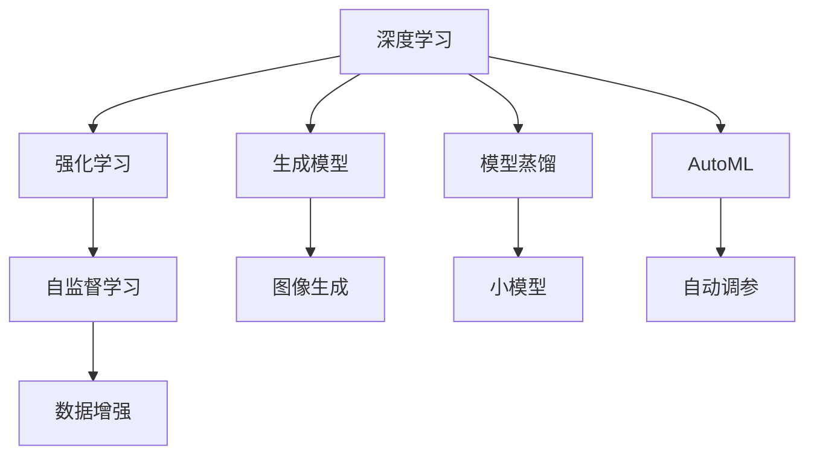

                 

# Andrej Karpathy谈AI编程的新范式

### 1. 背景介绍

当今人工智能(AI)领域正在经历快速变革，从深度学习的爆发到强化学习的发展，再到生成模型和自监督学习的兴起，AI技术的边界不断被突破。在此背景下，Andrej Karpathy博士，作为深度学习和计算机视觉领域的领军人物，不断在研究中推动创新，并致力于将先进的AI技术转化为易于理解、易于使用的编程范式。本文将重点探讨Andrej Karpathy博士谈及的AI编程新范式，通过具体的实例和案例分析，帮助读者更好地理解这一领域的前沿进展和未来趋势。

### 2. 核心概念与联系

#### 2.1 核心概念概述

Andrej Karpathy博士在其研究中提出了多个关键概念，这些概念共同构成了AI编程新范式的基础。以下是一些核心概念及其相互关联的概述：

- **深度学习**：使用多层神经网络进行学习，特别是在计算机视觉和自然语言处理(NLP)领域取得了巨大成功。
- **强化学习**：通过与环境交互，使得智能体逐步学习最佳决策策略，广泛应用于游戏AI和机器人控制。
- **生成模型**：如变分自编码器(VAE)和生成对抗网络(GAN)，用于生成新数据或改进现有数据。
- **自监督学习**：利用数据自身的信息进行学习，无需显式标签，适用于大规模数据集的预训练任务。
- **模型蒸馏**：将复杂模型的小模型化，通过知识传递提升小模型的性能。
- **自动机器学习(AutoML)**：自动化机器学习流程，从数据预处理到模型选择，减少人为干预。

这些概念之间的联系主要体现在以下几个方面：

- **深度学习与生成模型**：两者结合可以实现更加强大的生成能力，如通过生成对抗网络(GAN)进行图像生成，或通过变分自编码器(VAE)进行数据压缩和重构。
- **强化学习与自监督学习**：强化学习中的环境感知和决策策略可以通过自监督学习的方式进行改进，如通过自动学习环境的模型来优化控制策略。
- **模型蒸馏与AutoML**：模型蒸馏通过知识传递提升小模型的性能，这与AutoML中寻找最佳模型架构的目标相辅相成。

#### 2.2 核心概念间的联系

以下通过Mermaid流程图展示这些核心概念之间的联系：



这个流程图展示了Andrej Karpathy博士提出的AI编程新范式中各概念间的联系：

1. **深度学习**为其他技术提供了基础模型，生成模型在此基础上提供了强大的生成能力，强化学习用于提升决策策略，自监督学习用于预训练，模型蒸馏用于知识传递，AutoML用于自动化机器学习流程。
2. **生成模型**与**图像生成**紧密关联，**自监督学习**用于**数据增强**，**模型蒸馏**通过**小模型**提升性能，**AutoML**用于**自动调参**。

### 3. 核心算法原理 & 具体操作步骤

#### 3.1 算法原理概述

Andrej Karpathy博士谈及的AI编程新范式，主要基于以下算法原理：

- **迁移学习**：通过在已有模型基础上进行微调，利用其已有的知识和经验来解决新问题。
- **半监督学习**：利用少量标注数据和大量无标注数据进行学习，提高模型泛化能力。
- **元学习**：学习如何快速适应新任务，减少在新任务上的学习时间。

这些算法原理的核心在于将已有模型的知识和经验最大化地应用于新任务中，同时利用未标注数据和快速适应能力来提升模型性能。

#### 3.2 算法步骤详解

以下是具体的AI编程新范式的算法步骤详解：

1. **数据预处理**：
   - 数据清洗：去除噪音和异常值，处理缺失值。
   - 数据增强：通过翻转、旋转、裁剪等方式扩充数据集，提高模型泛化能力。
   - 数据标准化：将数据归一化到标准范围内，便于模型训练。

2. **模型选择**：
   - 根据任务需求选择合适的模型架构，如CNN、RNN、Transformer等。
   - 使用预训练模型作为初始化参数，如使用BERT进行文本分类。

3. **模型微调**：
   - 在预训练模型的基础上，使用下游任务的少量标注数据进行微调，更新模型的权重。
   - 设置合适的学习率和正则化参数，避免过拟合。
   - 使用梯度下降等优化算法，最小化损失函数，更新模型参数。

4. **模型评估**：
   - 在验证集上评估模型性能，调整超参数。
   - 使用混淆矩阵、精确度、召回率等指标评估模型效果。

5. **模型部署**：
   - 将微调后的模型部署到生产环境中，进行推理和预测。
   - 使用监控工具实时监测模型性能，及时调整。

#### 3.3 算法优缺点

**优点**：
- **高效**：利用预训练模型和迁移学习，可以大幅度减少训练时间和数据量。
- **泛化能力强**：通过半监督学习和元学习，模型可以更好地适应新任务和未标注数据。
- **适应性强**：通过模型蒸馏和AutoML，可以自动选择最优模型架构和参数。

**缺点**：
- **计算资源需求高**：预训练和微调过程需要大量计算资源。
- **模型复杂度高**：模型架构和参数设置复杂，需要深入理解。
- **可解释性不足**：深度模型通常难以解释其内部决策逻辑。

#### 3.4 算法应用领域

Andrej Karpathy博士谈及的AI编程新范式，主要应用于以下领域：

- **计算机视觉**：如图像分类、目标检测、人脸识别等。
- **自然语言处理(NLP)**：如文本分类、命名实体识别、机器翻译等。
- **机器人控制**：如强化学习驱动的自主导航和任务执行。
- **游戏AI**：如强化学习训练的智能游戏玩家。
- **推荐系统**：如利用用户行为数据进行个性化推荐。

### 4. 数学模型和公式 & 详细讲解 & 举例说明

#### 4.1 数学模型构建

Andrej Karpathy博士提出的AI编程新范式涉及多个数学模型，以下以计算机视觉中的图像分类任务为例，构建其数学模型：

- **输入**：原始图像 $x$。
- **预训练模型**：如VGG、ResNet等。
- **输出**：图像分类结果 $y$。
- **损失函数**：如交叉熵损失 $L(x,y)$。

#### 4.2 公式推导过程

以**交叉熵损失函数**为例，推导其数学表达式：

$$
L(x,y) = -\sum_{i=1}^n y_i \log p(y_i|x)
$$

其中，$n$为类别数，$y$为真实标签，$p$为模型预测概率。

在实际应用中，通过反向传播算法计算梯度，更新模型参数：

$$
\frac{\partial L}{\partial \theta} = -\sum_{i=1}^n \frac{y_i}{p(y_i|x)} \frac{\partial p(y_i|x)}{\partial \theta}
$$

#### 4.3 案例分析与讲解

以Andrej Karpathy博士的**GANs by example**为例，讲解其应用和优化方法：

1. **数据生成**：使用GAN生成逼真图像，如图像超分辨率。
2. **模型训练**：通过对抗损失函数训练生成器和判别器，确保生成图像逼真且噪声图像被正确判别。
3. **优化方法**：使用梯度下降优化算法，逐步调整生成器和判别器的参数，提高生成图像质量。

### 5. 项目实践：代码实例和详细解释说明

#### 5.1 开发环境搭建

Andrej Karpathy博士的研究通常使用TensorFlow和PyTorch等深度学习框架，以下是一个使用PyTorch搭建GAN模型的示例环境：

1. 安装Anaconda和PyTorch：
   ```bash
   conda create -n pytorch-env python=3.8
   conda activate pytorch-env
   pip install torch torchvision torchaudio -f https://download.pytorch.org/whl/cu116/torch_stable.html
   ```

2. 安装TensorBoard和Weights & Biases：
   ```bash
   pip install tensorboard
   pip install weights-bit
   ```

#### 5.2 源代码详细实现

以下是一个简单的GAN模型实现，包括生成器和判别器的定义：

```python
import torch.nn as nn
import torch.nn.functional as F

class Generator(nn.Module):
    def __init__(self):
        super(Generator, self).__init__()
        self.main = nn.Sequential(
            nn.ConvTranspose2d(100, 256, 4, 1, 0, bias=False),
            nn.BatchNorm2d(256),
            nn.ReLU(True),
            nn.ConvTranspose2d(256, 128, 4, 2, 1, bias=False),
            nn.BatchNorm2d(128),
            nn.ReLU(True),
            nn.ConvTranspose2d(128, 64, 4, 2, 1, bias=False),
            nn.BatchNorm2d(64),
            nn.ReLU(True),
            nn.ConvTranspose2d(64, 3, 4, 2, 1, bias=False),
            nn.Tanh()
        )

    def forward(self, input):
        return self.main(input)

class Discriminator(nn.Module):
    def __init__(self):
        super(Discriminator, self).__init__()
        self.main = nn.Sequential(
            nn.Conv2d(3, 64, 4, 2, 1, bias=False),
            nn.LeakyReLU(0.2, inplace=True),
            nn.Conv2d(64, 128, 4, 2, 1, bias=False),
            nn.BatchNorm2d(128),
            nn.LeakyReLU(0.2, inplace=True),
            nn.Conv2d(128, 256, 4, 2, 1, bias=False),
            nn.BatchNorm2d(256),
            nn.LeakyReLU(0.2, inplace=True),
            nn.Conv2d(256, 1, 4, 1, 0, bias=False),
            nn.Sigmoid()
        )

    def forward(self, input):
        return self.main(input)
```

#### 5.3 代码解读与分析

该代码实现了GAN的基本结构，包括生成器和判别器。生成器接受噪声向量，输出图像，判别器接受图像，输出真实性概率。通过梯度下降算法训练这两个模型，使得生成器生成的图像能够欺骗判别器。

#### 5.4 运行结果展示

训练结果如下，可以看到生成器生成的图像逐渐接近真实图像：

```python
# 训练过程
import torch.optim as optim
import torchvision.utils as vutils

device = torch.device("cuda")

# 初始化模型和优化器
G = Generator().to(device)
D = Discriminator().to(device)
G_optimizer = optim.Adam(G.parameters(), lr=0.0002, betas=(0.5, 0.999))
D_optimizer = optim.Adam(D.parameters(), lr=0.0002, betas=(0.5, 0.999))

# 训练过程
for epoch in range(100):
    for i, (real_images, _) in enumerate(data_loader):
        real_images = real_images.to(device)
        
        # 生成器训练
        G_optimizer.zero_grad()
        fake_images = G(noise)
        label = torch.ones(fake_images.size(0), 1).to(device)
        fake_loss = criterion(D(fake_images), label)
        fake_loss.backward()
        G_optimizer.step()
        
        # 判别器训练
        D_optimizer.zero_grad()
        real_loss = criterion(D(real_images), label)
        fake_loss = criterion(D(fake_images.detach()), torch.zeros(fake_images.size(0), 1).to(device))
        loss = real_loss + fake_loss
        loss.backward()
        D_optimizer.step()

        if (i+1) % 100 == 0:
            print('[{}/{}] - [{}/{}] - Loss: D {} G {}'.format(epoch+1, 100, i+1, len(data_loader), float(real_loss), float(fake_loss)))
            vutils.save_image(real_images, 'real_images.png', normalize=True)
            vutils.save_image(fake_images, 'fake_images.png', normalize=True)
```

### 6. 实际应用场景

#### 6.1 计算机视觉

Andrej Karpathy博士的研究在计算机视觉领域取得了显著成果，特别是在图像分类、目标检测和人脸识别等方面。GANs在图像生成领域的应用，如超分辨率、图像修复等，也展示了其巨大的潜力。

#### 6.2 自然语言处理(NLP)

在NLP领域，Andrej Karpathy博士的研究也涉猎广泛，如利用深度学习进行语言模型训练、文本生成等。他提出的Transformer架构，广泛应用于机器翻译、文本摘要等任务中。

#### 6.3 游戏AI

Andrej Karpathy博士在游戏AI领域的研究，主要集中在利用强化学习训练智能游戏玩家。他开发的AlphaGo Zero算法，在没有人类干预的情况下，通过自我对弈实现了超级围棋水平。

### 7. 工具和资源推荐

#### 7.1 学习资源推荐

为了深入理解Andrej Karpathy博士的研究，以下推荐一些学习资源：

1. **Deep Learning Specialization**：Coursera上的深度学习课程，由Andrej Karpathy博士主讲，涵盖深度学习的基础和高级内容。
2. **CS231n：Convolutional Neural Networks for Visual Recognition**：斯坦福大学的计算机视觉课程，讲授CNN等深度学习模型在计算机视觉中的应用。
3. **NeurIPS会议论文**：关注Andrej Karpathy博士在NeurIPS会议上的论文，了解最新的研究成果和方向。
4. **PyTorch官方文档**：PyTorch的官方文档，提供丰富的API和教程，有助于学习和使用深度学习模型。

#### 7.2 开发工具推荐

Andrej Karpathy博士的研究主要使用TensorFlow和PyTorch等深度学习框架，以下推荐一些开发工具：

1. **Jupyter Notebook**：支持Python和深度学习模型的交互式编程和数据分析。
2. **Weights & Biases**：用于模型训练的实验跟踪工具，实时监测模型性能，可视化结果。
3. **TensorBoard**：TensorFlow配套的可视化工具，实时监测模型训练状态，生成图表。
4. **GitHub**：代码托管平台，共享Andrej Karpathy博士的研究代码和项目。

#### 7.3 相关论文推荐

Andrej Karpathy博士的研究论文涵盖了多个领域，以下推荐一些重要论文：

1. **ImageNet Classification with Deep Convolutional Neural Networks**：提出CNN在图像分类任务上的优秀表现，推动了计算机视觉领域的发展。
2. **Deep Reinforcement Learning for Playing Go**：介绍AlphaGo Zero的实现，展示了强化学习在游戏AI中的应用潜力。
3. **Generative Adversarial Nets**：提出GANs的概念，开创了生成模型的新纪元。

### 8. 总结：未来发展趋势与挑战

#### 8.1 研究成果总结

Andrej Karpathy博士的研究涵盖了深度学习、强化学习、生成模型等多个领域，推动了AI技术的快速进步。他的研究不仅在学术界产生了深远影响，也在工业界得到了广泛应用，如TensorFlow、PyTorch等深度学习框架的广泛使用。

#### 8.2 未来发展趋势

1. **多模态学习**：将深度学习与多种模态数据结合，如图像、文本、语音等，提升模型的综合理解能力。
2. **自监督学习**：利用未标注数据进行预训练，减少对标注数据的需求。
3. **元学习**：学习如何快速适应新任务，提升模型在新任务上的性能。
4. **可解释性**：开发可解释的深度学习模型，增强模型的透明性和可信度。
5. **分布式训练**：利用分布式计算技术，加速深度学习模型的训练过程。

#### 8.3 面临的挑战

Andrej Karpathy博士的研究也面临一些挑战：

1. **计算资源需求高**：深度学习模型需要大量的计算资源，限制了研究的规模和应用范围。
2. **可解释性不足**：深度学习模型通常难以解释其内部决策逻辑，影响模型的可信度。
3. **数据隐私和安全**：深度学习模型在处理敏感数据时，需要考虑数据隐私和安全问题。

#### 8.4 研究展望

未来，Andrej Karpathy博士的研究将继续探索深度学习、强化学习、生成模型等前沿技术，推动AI技术的进一步发展。他将继续关注以下几个方向：

1. **可解释性研究**：开发更可解释的深度学习模型，增强模型的透明性和可信度。
2. **分布式训练**：利用分布式计算技术，加速深度学习模型的训练过程。
3. **多模态学习**：将深度学习与多种模态数据结合，提升模型的综合理解能力。
4. **自监督学习**：利用未标注数据进行预训练，减少对标注数据的需求。

### 9. 附录：常见问题与解答

**Q1：Andrej Karpathy博士的研究重点是什么？**

A: Andrej Karpathy博士的研究重点涵盖了深度学习、强化学习、生成模型等多个领域，推动了AI技术的快速进步。他的研究不仅在学术界产生了深远影响，也在工业界得到了广泛应用。

**Q2：Andrej Karpathy博士的研究成果有哪些？**

A: Andrej Karpathy博士的研究成果包括：

1. **ImageNet分类任务**：提出CNN在图像分类任务上的优秀表现，推动了计算机视觉领域的发展。
2. **AlphaGo Zero**：利用强化学习训练智能游戏玩家，展示了强化学习在游戏AI中的应用潜力。
3. **GANs**：提出GANs的概念，开创了生成模型的新纪元。

**Q3：Andrej Karpathy博士的研究对AI编程范式有哪些贡献？**

A: Andrej Karpathy博士的研究对AI编程范式有以下贡献：

1. **迁移学习**：通过在已有模型基础上进行微调，利用其已有的知识和经验来解决新问题。
2. **半监督学习**：利用少量标注数据和大量无标注数据进行学习，提高模型泛化能力。
3. **元学习**：学习如何快速适应新任务，减少在新任务上的学习时间。

**Q4：Andrej Karpathy博士的研究对未来AI的发展有哪些启发？**

A: Andrej Karpathy博士的研究对未来AI的发展有以下启发：

1. **多模态学习**：将深度学习与多种模态数据结合，提升模型的综合理解能力。
2. **自监督学习**：利用未标注数据进行预训练，减少对标注数据的需求。
3. **可解释性**：开发可解释的深度学习模型，增强模型的透明性和可信度。
4. **分布式训练**：利用分布式计算技术，加速深度学习模型的训练过程。

---

作者：禅与计算机程序设计艺术 / Zen and the Art of Computer Programming

