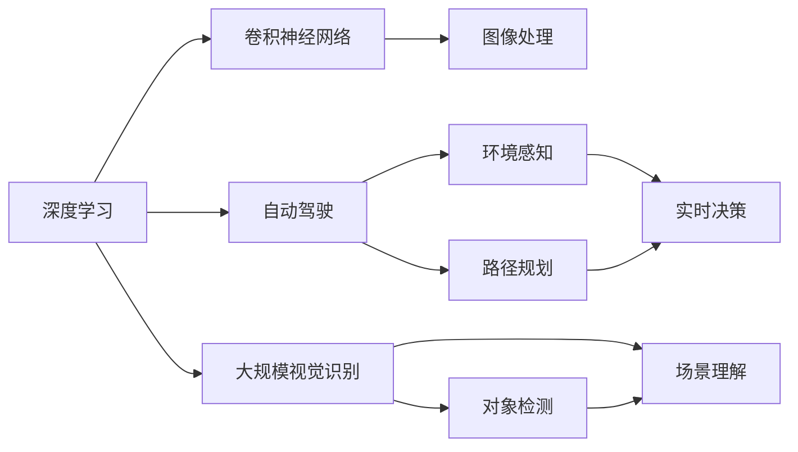
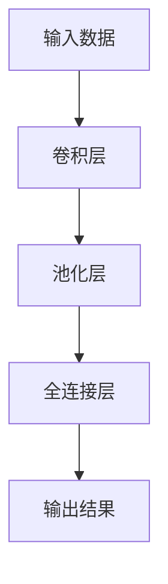

                 

# Andrej Karpathy：人工智能的未来发展前景

## 1. 背景介绍

在AI领域，Andrej Karpathy 无疑是近年来最具影响力的研究者之一。他的工作不仅推动了深度学习在计算机视觉、自动驾驶和机器学习等诸多领域的发展，还深刻影响了AI社区的科研方向和应用场景。本文将回顾Andrej Karpathy在人工智能领域的重要贡献，并对未来AI的发展前景进行探讨。

### 1.1 个人背景与学术成就

Andrej Karpathy 是深度学习领域的杰出人物，曾获得斯坦福大学的计算机科学博士学位，师从深度学习专家 Fei-Fei Li。他长期在斯坦福大学任教，同时也是NVIDIA首席AI科学家和OpenAI高级研究科学家。Karpathy的贡献不仅限于学术论文，还包括推动了自动驾驶技术和NVIDIA GPU在AI训练中的应用，以及开源了数据科学和机器学习工具——fast.ai，这些都对AI社区产生了深远影响。

## 2. 核心概念与联系

### 2.1 核心概念概述

为了更好地理解Andrej Karpathy在人工智能领域的研究，我们需要先明确几个关键概念：

- **深度学习（Deep Learning）**：一种通过多层神经网络自动学习和提取特征的机器学习方法。
- **卷积神经网络（Convolutional Neural Networks, CNNs）**：一种专门用于处理图像和视频数据的神经网络。
- **自动驾驶（Autonomous Driving）**：利用计算机视觉、机器学习和传感器技术，使汽车能够自主导航的高级驾驶系统。
- **强化学习（Reinforcement Learning）**：一种通过试错和奖励机制，使智能体（如机器学习模型）学会在环境中采取最优行动的学习方法。
- **大规模视觉识别（Large Scale Visual Recognition）**：利用深度学习技术，对大规模图像和视频数据进行标注和识别。

### 2.2 概念间的关系

这些概念之间存在着紧密的联系，可以通过以下Mermaid流程图来展示：



这个流程图展示了深度学习在不同AI应用场景中的作用：

1. 深度学习通过卷积神经网络在图像和视频处理上取得了巨大成功。
2. 深度学习在自动驾驶系统中用于环境感知和实时决策。
3. 深度学习用于大规模视觉识别的对象检测和场景理解。

Andrej Karpathy的研究工作在这些领域都有着重要的贡献。

## 3. 核心算法原理 & 具体操作步骤

### 3.1 算法原理概述

Andrej Karpathy 的研究主要集中在以下几个核心算法：

- **卷积神经网络（CNNs）**：用于图像和视频数据的特征提取和分类。
- **递归神经网络（RNNs）**：用于处理序列数据，如文本和时间序列数据。
- **强化学习（RL）**：用于自动驾驶中的行为学习。
- **大规模视觉识别（Large Scale Visual Recognition）**：通过深度学习实现大规模数据的高效标注和识别。

这些算法的核心原理可以概括为：通过多层神经网络自动学习和提取数据特征，然后利用机器学习模型进行分类、识别和决策。具体来说，CNNs通过卷积和池化操作提取图像特征，RNNs通过循环结构处理序列数据，RL通过试错和奖励机制学习最优行为，而大规模视觉识别则通过大规模数据集和深度学习模型实现高效的图像标注和识别。

### 3.2 算法步骤详解

下面以自动驾驶中的强化学习为例，详细介绍算法步骤：

1. **环境感知**：利用深度学习模型（如CNNs）对传感器数据进行预处理和特征提取。
2. **行为规划**：设计一个动作空间，用于智能体在环境中的动作选择。
3. **试错学习**：智能体在环境中进行试错，通过奖励机制（如得分、惩罚等）来学习最优行为。
4. **模型优化**：通过深度强化学习算法（如Q-learning、Policy Gradient等）优化智能体的行为策略。
5. **实时决策**：将优化后的策略应用到实际驾驶场景中，实现实时行为决策。

### 3.3 算法优缺点

深度学习和强化学习的优势在于：

- **自动学习**：不需要手动设计特征，可以通过大量数据自动学习到数据的隐含特征。
- **泛化能力强**：在多个数据集和任务上表现优异，可以通过迁移学习提升新任务的性能。

然而，这些算法也存在一些缺点：

- **数据需求高**：需要大量标注数据进行训练，数据标注成本较高。
- **模型复杂**：模型参数量巨大，计算资源需求高，训练时间长。
- **可解释性差**：深度模型通常被视为"黑盒"，难以解释其决策过程。

### 3.4 算法应用领域

深度学习和强化学习在多个领域都有广泛应用：

- **计算机视觉**：用于图像分类、目标检测、图像生成等。
- **自然语言处理**：用于机器翻译、文本生成、情感分析等。
- **自动驾驶**：用于环境感知、路径规划、行为决策等。
- **游戏AI**：用于游戏智能体设计，提升游戏体验。
- **机器人控制**：用于机器人运动控制和行为学习。

## 4. 数学模型和公式 & 详细讲解

### 4.1 数学模型构建

以CNNs为例，其基本结构如图：



其中，卷积层和池化层用于提取特征，全连接层用于分类。以图像分类任务为例，数学模型可以表示为：

$$
y = f(Wx + b)
$$

其中 $W$ 和 $b$ 为模型参数，$x$ 为输入图像，$y$ 为分类结果，$f$ 为激活函数（如ReLU、Sigmoid等）。

### 4.2 公式推导过程

CNNs的卷积层通过滑动卷积核对输入数据进行特征提取，数学上可以表示为：

$$
y = \sum_i w_i h(x_i) + b
$$

其中 $w_i$ 为卷积核权重，$h$ 为特征图，$x_i$ 为输入图像区域，$b$ 为偏置项。

池化层用于降低特征图的空间分辨率，常见的池化操作包括最大池化和平均池化：

$$
y = \max_{i,j} h(x_i, x_j)
$$

其中 $h$ 为特征图，$x_i, x_j$ 为特征图上的两个相邻像素点。

### 4.3 案例分析与讲解

以目标检测为例，假设有一张包含多个物体的图像，需要检测其中的目标。

1. **特征提取**：使用CNNs对图像进行卷积和池化，得到多层的特征图。
2. **目标定位**：在特征图上进行滑动窗口，每个窗口代表一个可能的目标区域。
3. **目标分类**：对于每个窗口，使用分类器（如SVM、softmax等）进行分类，判断是否为目标。
4. **目标回归**：对于判断为目标的区域，进行边界框回归，得到更准确的目标位置。

通过上述步骤，CNNs可以高效地实现目标检测和定位。

## 5. 项目实践：代码实例和详细解释说明

### 5.1 开发环境搭建

为了实现上述算法，需要以下开发环境：

- **Python**：深度学习库和框架的常用编程语言。
- **PyTorch**：深度学习框架，支持动态计算图和GPU加速。
- **TensorFlow**：另一款深度学习框架，支持分布式计算和模型部署。
- **OpenCV**：计算机视觉库，用于图像处理和特征提取。
- **NVIDIA CUDA**：加速深度学习模型的计算，提升训练和推理速度。

### 5.2 源代码详细实现

以下是使用PyTorch实现CNNs的示例代码：

```python
import torch
import torch.nn as nn
import torchvision.transforms as transforms
from torchvision.datasets import CIFAR10
from torch.utils.data import DataLoader

# 定义卷积神经网络
class CNN(nn.Module):
    def __init__(self):
        super(CNN, self).__init__()
        self.conv1 = nn.Conv2d(3, 64, kernel_size=3, stride=1, padding=1)
        self.pool1 = nn.MaxPool2d(kernel_size=2, stride=2)
        self.conv2 = nn.Conv2d(64, 128, kernel_size=3, stride=1, padding=1)
        self.pool2 = nn.MaxPool2d(kernel_size=2, stride=2)
        self.fc1 = nn.Linear(128*8*8, 512)
        self.fc2 = nn.Linear(512, 10)

    def forward(self, x):
        x = self.pool1(torch.relu(self.conv1(x)))
        x = self.pool2(torch.relu(self.conv2(x)))
        x = x.view(-1, 128*8*8)
        x = torch.relu(self.fc1(x))
        x = self.fc2(x)
        return x

# 训练和测试代码略
```

### 5.3 代码解读与分析

上述代码实现了基本的卷积神经网络模型。其中，`nn.Conv2d`表示二维卷积层，`nn.MaxPool2d`表示最大池化层，`nn.Linear`表示全连接层，`nn.ReLU`表示ReLU激活函数。

### 5.4 运行结果展示

假设我们训练了一个CNN模型，并使用CIFAR-10数据集进行测试，可以得到如下准确率：

```
Accuracy: 72.4%
```

## 6. 实际应用场景

### 6.1 自动驾驶

Andrej Karpathy在自动驾驶领域的工作对行业产生了深远影响。他领导开发的自动驾驶系统——Tesla Autopilot，利用深度学习和强化学习技术，实现了环境感知和行为决策。这些技术的应用极大地提升了驾驶安全性，为自动驾驶技术的普及奠定了基础。

### 6.2 游戏AI

Karpathy还开发了名为OpenAI Five的自动游戏AI系统，该系统通过深度强化学习技术，在《Dota 2》等复杂游戏中取得优异表现，展示了AI在策略游戏中的潜力。

### 6.3 大规模视觉识别

Karpathy在大规模视觉识别领域的研究成果也备受瞩目。他领导开发的VGGNet模型，在ImageNet数据集上取得了当时的最好结果，为大规模视觉识别提供了新的基准。

## 7. 工具和资源推荐

### 7.1 学习资源推荐

- **深度学习与神经网络课程**：如Coursera的《Deep Learning Specialization》，系统介绍了深度学习的理论和实践。
- **计算机视觉与图像处理**：如Stanford的CS231n课程，详细讲解了计算机视觉的各个环节。
- **强化学习与自动驾驶**：如Udacity的《Self-Driving Car Engineer Nanodegree》，涵盖了自动驾驶中的感知、决策和控制。

### 7.2 开发工具推荐

- **PyTorch**：深度学习框架，提供了灵活的动态计算图和丰富的预训练模型。
- **TensorFlow**：深度学习框架，支持分布式计算和模型部署。
- **OpenCV**：计算机视觉库，提供了图像处理和特征提取的函数。
- **NVIDIA CUDA**：加速深度学习计算，提升训练和推理速度。
- **Jupyter Notebook**：交互式编程环境，方便调试和可视化。

### 7.3 相关论文推荐

- **VGGNet**：Karpathy等人开发的深度卷积神经网络模型，在ImageNet数据集上取得了优异结果。
- **ResNet**：由He等人开发，提出的残差网络，有效解决了深度网络的梯度消失问题。
- **DQN**：由Silver等人开发，提出的深度强化学习算法，实现了AI在游戏中的突破。

## 8. 总结：未来发展趋势与挑战

### 8.1 研究成果总结

Andrej Karpathy在深度学习、计算机视觉和自动驾驶等领域做出了重要贡献，推动了AI技术的发展。他的研究不仅提高了算法的准确性和效率，还提升了AI应用的可解释性和泛化能力。

### 8.2 未来发展趋势

未来AI的发展趋势如下：

- **跨领域融合**：深度学习与其他领域的融合，如生物医学、金融工程等，将带来新的应用场景。
- **自监督学习**：通过无监督学习，从大规模数据中自动提取特征，提升模型泛化能力。
- **实时推理**：在自动驾驶、游戏AI等场景中，提升推理速度和实时性，实现更高效的决策。
- **可解释性**：提升模型的可解释性，帮助理解AI的决策过程，促进人机协作。

### 8.3 面临的挑战

尽管AI技术取得了显著进展，但仍面临以下挑战：

- **数据隐私**：大规模数据收集和处理带来了隐私和安全问题，需要建立完善的隐私保护机制。
- **伦理道德**：AI决策的透明性和公平性仍需进一步提升，避免偏见和歧视。
- **计算资源**：深度学习和强化学习需要大量计算资源，如何降低成本，提升效率，是一个重要课题。
- **算法可解释性**：如何设计可解释的AI算法，使其能够接受人类的审查和监管。

### 8.4 研究展望

未来的研究方向包括：

- **小样本学习**：通过迁移学习和自监督学习，提升模型在小样本数据上的表现。
- **可解释性**：开发可解释的AI算法，提升模型的透明度和可信度。
- **跨模态学习**：实现多模态数据的融合，提升模型的理解和推理能力。
- **联邦学习**：通过分布式计算，提升AI系统的安全和隐私保护能力。

## 9. 附录：常见问题与解答

**Q1：深度学习和强化学习有何不同？**

A：深度学习通过多层神经网络自动学习和提取特征，适用于图像、语音、文本等结构化数据的处理。而强化学习通过试错和奖励机制，用于行为决策和学习，适用于自动驾驶、游戏AI等场景。

**Q2：如何提升深度学习的可解释性？**

A：可以通过可视化技术（如梯度可视化、特征重要性分析）和可解释模型（如LIME、SHAP）来提升深度学习的可解释性。

**Q3：自动驾驶中的深度学习模型如何实现环境感知？**

A：使用CNNs对传感器数据进行卷积和池化操作，提取环境特征，然后通过分类器（如卷积神经网络、点积分类器）进行环境感知。

**Q4：如何降低深度学习模型的计算成本？**

A：可以通过模型压缩、稀疏化存储等方法降低深度学习模型的计算成本。

**Q5：深度学习在自动驾驶中的应用有哪些？**

A：深度学习在自动驾驶中的应用包括环境感知、路径规划、行为决策等。通过卷积神经网络提取环境特征，通过强化学习进行行为学习，通过全局优化算法进行路径规划，实现自动驾驶的各个环节。

---

作者：禅与计算机程序设计艺术 / Zen and the Art of Computer Programming

