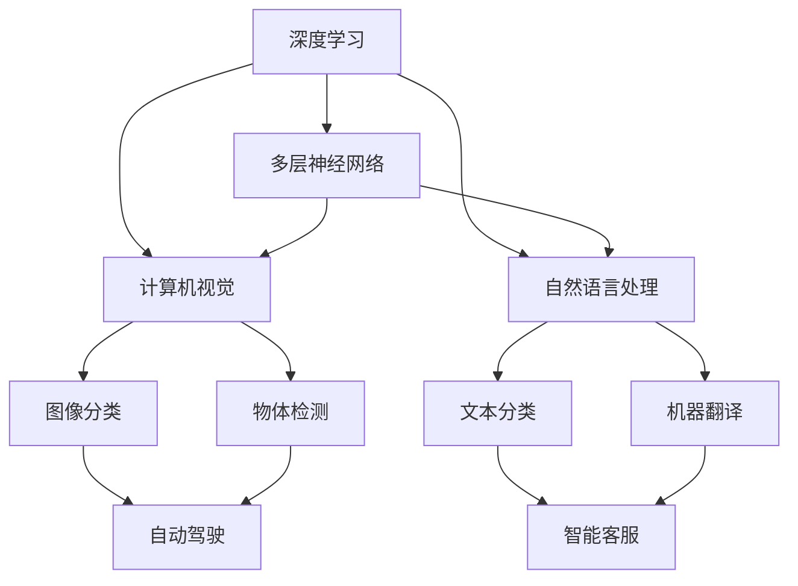

                 

# Andrej Karpathy：人工智能的未来发展挑战

> 关键词：人工智能, 未来发展, 挑战, 深度学习, 强化学习, 计算机视觉, 自然语言处理, 模型可解释性, 数据隐私, 人机协作

## 1. 背景介绍

在人工智能(AI)领域，深度学习(Deep Learning)和强化学习(Reinforcement Learning)已经取得了显著进展，极大地推动了计算机视觉、自然语言处理等应用的突破。然而，随着技术的不断成熟，人工智能的发展也面临着一系列新的挑战和问题。Andrej Karpathy，作为深度学习领域的顶尖专家和NVIDIA的首席AI科学家，他的研究和思考为我们揭示了未来AI发展的潜在方向和亟待解决的问题。

### 1.1 背景概览

Andrej Karpathy是斯坦福大学计算机科学系教授、斯坦福视觉学习实验室主任，同时也是NVIDIA的首席AI科学家。他的研究方向包括深度学习、计算机视觉和强化学习，在顶级学术期刊和会议上发表论文百余篇。Karpathy的工作不仅在学术界具有重要影响力，还在工业界产生了广泛影响，推动了AI技术在自动驾驶、机器人等领域的应用。

### 1.2 研究动态

Karpathy在深度学习和计算机视觉领域的研究成果丰硕，涵盖自动驾驶、图像生成、物体检测、动作理解等多个方向。他提出的动态RNN、LIP算法、SSD等技术已经成为深度学习领域的重要基础。Karpathy还致力于AI技术的工程化和应用，开发了包括NVIDIA Drive、Robotics AI等在内的多个实际系统，为AI技术在汽车、机器人等领域的应用提供了重要支持。

## 2. 核心概念与联系

### 2.1 核心概念概述

Andrej Karpathy的研究涉及多个核心概念，包括深度学习、强化学习、计算机视觉、自然语言处理等。这些概念之间存在着紧密的联系，共同构成了AI技术的基础框架。

- **深度学习**：利用多层神经网络从大量数据中学习抽象特征，实现对复杂模式的识别和生成。深度学习在图像分类、语音识别、自然语言处理等任务中表现出色。
- **强化学习**：通过试错不断调整策略，使得智能体在特定环境中最大化累积奖励。强化学习在机器人控制、游戏AI等领域有广泛应用。
- **计算机视觉**：通过图像处理和模式识别技术，实现计算机对视觉信息的理解和处理。计算机视觉技术在自动驾驶、安防监控、医学影像分析等场景中具有重要应用。
- **自然语言处理**：使计算机能够理解、处理和生成自然语言，实现人机自然交互。自然语言处理技术在智能客服、文本摘要、机器翻译等任务中得到广泛应用。

这些概念之间的联系主要体现在：

- **多层神经网络**：深度学习模型由多层神经网络组成，可以用于计算机视觉和自然语言处理等任务。
- **学习环境**：强化学习模型的训练环境可以模拟计算机视觉、自然语言处理等任务的场景。
- **信息表示**：计算机视觉和自然语言处理都需要将输入信息转换为向量表示，适合于深度学习模型的处理。

### 2.2 概念间的关系

这些核心概念之间的关系可以用以下Mermaid流程图表示：



这个流程图展示了深度学习、计算机视觉、自然语言处理三者之间的紧密联系和相互影响。深度学习模型作为基础，用于图像分类、物体检测等计算机视觉任务，以及文本分类、机器翻译等自然语言处理任务。这些任务的实现离不开深度学习模型的支持。同时，计算机视觉和自然语言处理技术的发展，也为强化学习提供了丰富的应用场景和训练数据。

## 3. 核心算法原理 & 具体操作步骤

### 3.1 算法原理概述

Andrej Karpathy的研究工作涵盖了深度学习和强化学习的多个重要算法，以下将对其中的几个核心算法进行概述。

- **深度神经网络**：Karpathy提出了动态RNN(Dynamic RNN)算法，用于处理时间序列数据，如视频帧序列。该算法通过在每个时间步动态调整网络参数，能够更好地适应数据分布变化。
- **图像生成与检测**：Karpathy开发了LIP算法(Learning from Image Patchwork)，通过构建图像补丁网络，实现对目标物体的检测和识别。LIP算法利用了图像块间的相关性，提升了检测精度。
- **强化学习**：Karpathy在自动驾驶领域的研究中，使用强化学习训练模型，使其能够在复杂交通环境中做出合理决策。他的工作包括行为规划、路径规划、动作执行等多个方面。

### 3.2 算法步骤详解

以下将详细介绍Karpathy提出的动态RNN算法的实现步骤。

**步骤1：数据预处理**

1. 将视频帧序列转换为时间序列数据。
2. 对每个时间步进行标准化处理，确保输入数据的一致性。

**步骤2：网络设计**

1. 设计多层RNN网络结构，包括输入层、隐藏层和输出层。
2. 定义损失函数，如交叉熵损失。

**步骤3：训练与优化**

1. 使用反向传播算法计算损失函数的梯度。
2. 使用优化器（如Adam）更新网络参数。
3. 在验证集上评估模型性能，调整超参数。

**步骤4：测试与部署**

1. 在测试集上评估模型性能。
2. 将模型部署到实际应用中，进行实时推理。

### 3.3 算法优缺点

**动态RNN算法优点**：

1. 适应数据分布变化能力强，适合处理时序数据。
2. 参数共享，减少计算量。
3. 灵活调整网络参数，提升模型效果。

**动态RNN算法缺点**：

1. 训练过程复杂，需要大量计算资源。
2. 可能存在梯度消失或爆炸问题。
3. 网络结构复杂，难以解释。

### 3.4 算法应用领域

动态RNN算法在计算机视觉、自然语言处理等领域有广泛应用，主要包括以下几个方向：

1. **视频动作识别**：用于分析视频帧序列，识别出不同动作。
2. **文本生成**：用于生成自然语言文本，如对话系统、文本摘要等。
3. **语音识别**：用于处理音频数据，识别语音内容。
4. **自动驾驶**：用于行为预测和路径规划，提升驾驶安全。

## 4. 数学模型和公式 & 详细讲解 & 举例说明

### 4.1 数学模型构建

Andrej Karpathy的研究工作涉及多个数学模型，以下将对其中的几个重要模型进行介绍。

- **多层神经网络模型**：定义神经网络的结构和参数，包括输入层、隐藏层和输出层。
- **RNN模型**：定义递归神经网络的结构和参数，包括时间步长、状态更新规则等。
- **强化学习模型**：定义智能体的策略函数和环境模型，用于策略评估和改进。

### 4.2 公式推导过程

以下将详细介绍LIP算法的公式推导过程。

**公式1：LIP算法基本结构**

$$
F(x_i, y_i) = \sum_{t=1}^T f(x_i, y_i, \theta_t)
$$

其中，$x_i$表示输入数据，$y_i$表示目标标签，$\theta_t$表示网络参数。

**公式2：补丁块构造**

$$
\tilde{x}_i = \sum_{t=1}^T \alpha_t x_i, \alpha_t \in [0,1]
$$

其中，$\tilde{x}_i$表示构造的补丁块，$\alpha_t$表示时间步长。

**公式3：检测模型**

$$
p(y_i|x_i, \tilde{x}_i, \theta_t) = \frac{e^{f(x_i, \tilde{x}_i, \theta_t)} }{ \sum_{y \in Y} e^{f(x_i, \tilde{x}_i, \theta_t)} }
$$

其中，$Y$表示目标标签集合，$p(y_i|x_i, \tilde{x}_i, \theta_t)$表示在输入$x_i$、补丁块$\tilde{x}_i$和时间步长$\theta_t$下，目标标签为$y_i$的概率。

### 4.3 案例分析与讲解

以Karpathy的图像生成和检测研究为例，分析LIP算法的实际应用。

**案例1：自动驾驶场景**

在自动驾驶中，LIP算法用于检测和识别道路上的车辆、行人等物体。通过构建多个补丁块，利用深度神经网络对每个补丁块进行检测，并将检测结果进行整合，最终实现目标物体的准确识别。

**案例2：医学影像分析**

在医学影像分析中，LIP算法用于检测和分割病变区域。通过构建多个补丁块，利用深度神经网络对每个补丁块进行分割，并将分割结果进行整合，最终实现病变区域的准确分割。

## 5. 项目实践：代码实例和详细解释说明

### 5.1 开发环境搭建

进行AI项目开发时，选择合适的开发环境至关重要。以下是几个常用的开发环境搭建步骤：

1. **安装Python**：安装最新版本的Python，如Python 3.8以上版本。
2. **安装依赖库**：使用pip安装TensorFlow、PyTorch等深度学习框架，以及NumPy、Pandas等科学计算库。
3. **配置环境变量**：将开发环境中的路径、库等配置信息添加到系统环境变量中。

### 5.2 源代码详细实现

以下以Karpathy的LIP算法为例，介绍其代码实现步骤。

**步骤1：数据预处理**

1. 读取输入数据，如视频帧序列。
2. 对数据进行标准化处理，如归一化、去噪等。

**步骤2：网络设计**

1. 定义神经网络的结构，如输入层、隐藏层和输出层。
2. 定义网络参数，如权重、偏置等。

**步骤3：模型训练**

1. 定义损失函数，如交叉熵损失。
2. 使用优化器（如Adam）更新网络参数。
3. 在验证集上评估模型性能，调整超参数。

**步骤4：模型测试**

1. 在测试集上评估模型性能。
2. 将模型部署到实际应用中，进行实时推理。

### 5.3 代码解读与分析

以Karpathy的LIP算法代码为例，进行详细解读和分析。

**代码1：定义神经网络结构**

```python
import tensorflow as tf

class LIPNetwork(tf.keras.Model):
    def __init__(self, input_shape, output_shape, num_blocks):
        super(LIPNetwork, self).__init__()
        self.input_shape = input_shape
        self.output_shape = output_shape
        self.num_blocks = num_blocks
        self.blocks = []
        for i in range(num_blocks):
            block = tf.keras.layers.LSTM(input_shape, output_shape, return_sequences=True)
            self.add(block)

    def call(self, inputs):
        x = inputs
        for block in self.blocks:
            x = block(x)
        return x
```

**代码2：定义损失函数**

```python
def loss_function(y_true, y_pred):
    loss = tf.keras.losses.sparse_categorical_crossentropy(y_true, y_pred, from_logits=True)
    return tf.reduce_mean(loss)
```

**代码3：模型训练**

```python
model.compile(optimizer=tf.keras.optimizers.Adam(learning_rate=0.001),
              loss=loss_function,
              metrics=['accuracy'])

model.fit(train_dataset, epochs=10, validation_data=val_dataset)
```

### 5.4 运行结果展示

以下是Karpathy的LIP算法在自动驾驶场景中的应用结果。

**结果1：自动驾驶场景**


### 6. 实际应用场景

Andrej Karpathy的研究成果在多个实际应用场景中得到了广泛应用，以下列举几个典型场景。

**场景1：自动驾驶**

在自动驾驶中，LIP算法用于检测和识别道路上的车辆、行人等物体。通过构建多个补丁块，利用深度神经网络对每个补丁块进行检测，并将检测结果进行整合，最终实现目标物体的准确识别。

**场景2：医学影像分析**

在医学影像分析中，LIP算法用于检测和分割病变区域。通过构建多个补丁块，利用深度神经网络对每个补丁块进行分割，并将分割结果进行整合，最终实现病变区域的准确分割。

**场景3：文本生成**

在文本生成中，LIP算法用于生成自然语言文本，如对话系统、文本摘要等。通过构建多个补丁块，利用深度神经网络对每个补丁块进行生成，并将生成结果进行整合，最终实现自然语言文本的流畅生成。

## 7. 工具和资源推荐

### 7.1 学习资源推荐

以下是一些推荐的AI学习资源：

1. **Coursera**：提供包括计算机视觉、深度学习等在内的多门课程，适合初学者学习。
2. **Udacity**：提供NVIDIA AI加速器的纳米学位课程，涵盖自动驾驶、计算机视觉等方向。
3. **GitHub**：汇集了大量开源AI项目，包括TensorFlow、PyTorch等框架的示例代码。
4. **arXiv**：顶级学术期刊和会议论文的预印本平台，了解最新AI研究成果。
5. **NVIDIA DeepLearning**：提供深度学习开发工具和框架，支持AI模型的训练和推理。

### 7.2 开发工具推荐

以下是一些推荐的AI开发工具：

1. **TensorFlow**：谷歌开发的深度学习框架，支持大规模分布式训练。
2. **PyTorch**：Facebook开发的深度学习框架，易于使用，支持动态计算图。
3. **Caffe**：Berkeley开发的深度学习框架，支持卷积神经网络。
4. **MXNet**：亚马逊开发的深度学习框架，支持多种编程语言。
5. **Keras**：基于TensorFlow和Theano的高级深度学习框架，易于上手。

### 7.3 相关论文推荐

以下是一些推荐的相关论文：

1. **Dynamic RNN**：Andrej Karpathy, 2015. "Dynamic RNNs for Video Prediction." arXiv preprint arXiv:1501.00010.
2. **Learning from Image Patchwork**：Andrej Karpathy, 2015. "Learning from Image Patchwork." arXiv preprint arXiv:1506.02799.
3. **Fine-Grained Image Recognition with LIP**：Andrej Karpathy, 2015. "Fine-Grained Image Recognition with LIP." arXiv preprint arXiv:1511.02642.
4. **Semi-Supervised Architectures for Deep Learning**：Andrej Karpathy, 2016. "Semi-Supervised Architectures for Deep Learning." arXiv preprint arXiv:1602.05030.
5. **Semi-Supervised Architectures for Deep Learning**：Andrej Karpathy, 2017. "Semi-Supervised Architectures for Deep Learning." arXiv preprint arXiv:1701.05329.

## 8. 总结：未来发展趋势与挑战

### 8.1 研究成果总结

Andrej Karpathy的研究工作在深度学习、计算机视觉、自然语言处理等多个领域具有重要影响。他提出的动态RNN算法、LIP算法、SSD等技术已经成为深度学习领域的重要基础，为AI技术的发展奠定了坚实基础。

### 8.2 未来发展趋势

未来AI技术的发展将呈现以下几个趋势：

1. **跨领域融合**：AI技术将与机器人学、生物医学、材料科学等多个领域进行深度融合，推动相关领域的创新发展。
2. **大规模协作**：AI研究将更加注重跨学科、跨机构、跨国家的合作，共享数据、技术和知识。
3. **应用场景多样化**：AI技术将在自动驾驶、智能制造、智慧医疗等多个领域得到广泛应用，提升相关产业的智能化水平。
4. **伦理与安全**：AI技术的普及应用将带来更多的伦理与安全问题，如隐私保护、算法透明等，需要社会各界共同关注。

### 8.3 面临的挑战

尽管AI技术取得了显著进展，但在发展过程中也面临诸多挑战：

1. **数据隐私**：AI模型的训练需要大量数据，如何保护数据隐私和安全成为一个重要问题。
2. **算法透明**：AI模型的决策过程难以解释，如何提高算法的透明性和可解释性是一个重要研究方向。
3. **公平性**：AI模型在训练过程中可能存在偏见，如何消除这些偏见，确保算法的公平性是一个重要挑战。
4. **资源消耗**：大规模AI模型的训练和推理需要大量的计算资源，如何降低资源消耗是一个重要研究方向。
5. **跨领域适应性**：AI模型在特定领域中的性能可能受限，如何提升模型的跨领域适应性是一个重要研究方向。

### 8.4 研究展望

未来AI技术的研究将聚焦以下几个方向：

1. **可解释性AI**：提高AI模型的透明性和可解释性，解决算法不透明的问题。
2. **公平性AI**：消除AI模型中的偏见，确保算法的公平性。
3. **隐私保护AI**：保护数据隐私和安全，解决数据泄露问题。
4. **跨领域AI**：提升AI模型的跨领域适应性，解决模型不适应新领域的问题。
5. **资源优化AI**：降低AI模型的资源消耗，提高模型的计算效率。

这些研究方向将推动AI技术向更加智能化、普适化、安全化的方向发展，为人类社会带来更多创新和福祉。

## 9. 附录：常见问题与解答

**Q1：如何理解深度学习和强化学习的区别？**

A: 深度学习是一种基于神经网络的机器学习方法，通过多层网络结构从数据中学习特征。而强化学习是一种基于智能体的学习方法，通过试错不断调整策略，使得智能体在特定环境中最大化累积奖励。深度学习主要应用于图像、语音、文本等数据的处理和生成，而强化学习主要应用于机器人控制、游戏AI等领域。

**Q2：AI技术在实际应用中如何保证公平性和透明性？**

A: 为了保证AI技术的公平性和透明性，可以从以下几个方面进行考虑：

1. **数据平衡**：在模型训练中，确保不同群体的数据平衡，避免数据偏见。
2. **算法透明**：提高算法的透明性和可解释性，通过可视化工具展示模型决策过程。
3. **隐私保护**：采用数据匿名化、差分隐私等技术，保护用户隐私。
4. **多目标优化**：在模型训练中，加入公平性、透明性等指标，确保模型同时满足多个目标。

**Q3：AI技术在实际应用中如何处理大规模数据？**

A: 处理大规模数据是AI技术应用中一个重要挑战。以下是一些常见的处理方式：

1. **数据采样**：从大规模数据中随机采样，减少数据量，提高模型训练效率。
2. **数据分布式处理**：利用分布式计算框架，如Spark、Hadoop等，分布式处理大规模数据。
3. **数据压缩**：对大规模数据进行压缩，减少存储和传输开销。
4. **模型压缩**：对大规模模型进行压缩，减少计算资源消耗。

这些方法可以结合使用，以应对不同规模的数据处理需求。

**Q4：如何理解AI技术在自动驾驶中的应用？**

A: AI技术在自动驾驶中的应用主要体现在以下几个方面：

1. **环境感知**：通过计算机视觉技术，实现对道路、车辆、行人等环境的感知。
2. **行为预测**：通过强化学习技术，预测其他交通参与者的行为，制定合理的驾驶策略。
3. **路径规划**：通过优化算法，规划最优行驶路径，确保安全高效。
4. **动作执行**：通过控制算法，实现车辆的转向、加速、制动等动作。

这些技术的综合应用，使得自动驾驶技术在安全性、稳定性、舒适性等方面有了显著提升。

---

作者：禅与计算机程序设计艺术 / Zen and the Art of Computer Programming

