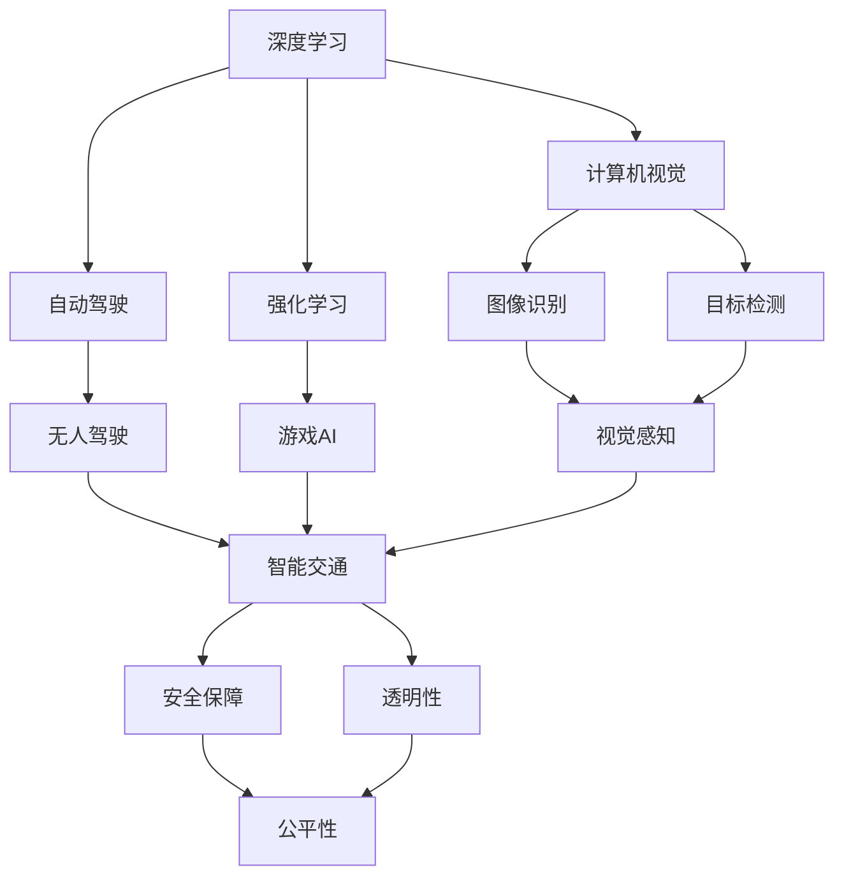
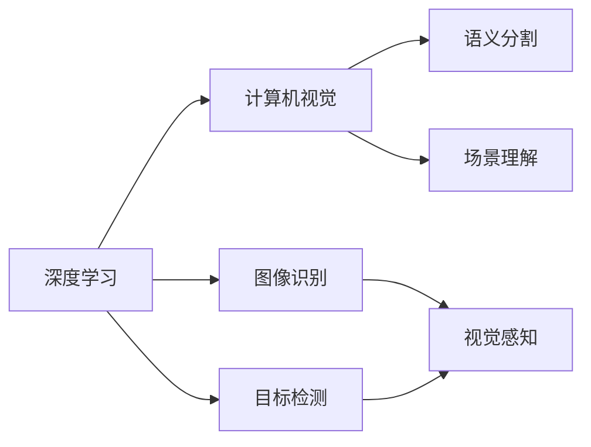
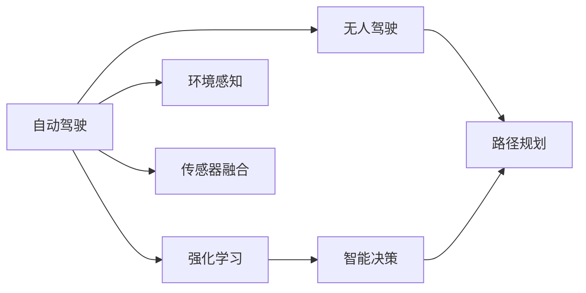
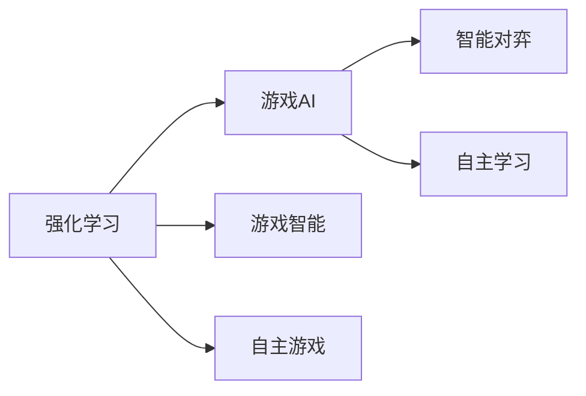

                 

# 安德烈·卡帕西：人工智能的未来发展方向

在人工智能迅猛发展的时代，安德烈·卡帕西（Andrej Karpathy）作为一位AI领域的翘楚，他的见解和预测往往能引领整个行业的发展方向。本文将从他的角度，深入探讨人工智能的未来发展方向，揭示这一领域的前沿技术和趋势。

## 1. 背景介绍

### 1.1 问题由来
安德烈·卡帕西是深度学习领域的知名研究者，他的工作涉及计算机视觉、自动驾驶、人工智能伦理等多个领域。他的研究团队近年来在多个顶会发表了多项突破性成果，奠定了他在AI界的重要地位。

### 1.2 问题核心关键点
卡帕西的研究核心在于通过深度学习技术，实现计算机对复杂视觉信息的理解和处理。他的团队在自动驾驶、计算机视觉等方向取得了一系列进展，为人工智能的未来发展提供了重要借鉴。

### 1.3 问题研究意义
理解卡帕西对人工智能未来发展方向的见解，不仅有助于学术界和工业界把握最新的研究趋势，还能够指导实际应用中的技术选择和优化方向，推动人工智能技术的产业化进程。

## 2. 核心概念与联系

### 2.1 核心概念概述

安德烈·卡帕西的研究涉及多个核心概念，这些概念之间相互关联，共同构成了人工智能发展的基石。

- **深度学习**：一种通过多层次神经网络进行模式识别的机器学习方法，是现代人工智能的核心技术。
- **计算机视觉**：使计算机能够理解和解释视觉信息的技术，广泛应用于图像识别、目标检测、人脸识别等领域。
- **自动驾驶**：通过计算机视觉和深度学习实现车辆自主导航的系统，是人工智能在实际应用中的重要方向。
- **强化学习**：一种通过奖励机制学习最优策略的机器学习方法，在自动驾驶、游戏AI等领域有广泛应用。
- **伦理与责任**：随着人工智能技术的发展，如何确保技术的透明性、公正性和安全性，成为一个重要议题。

这些概念之间的联系可以通过以下Mermaid流程图来展示：



这个流程图展示了深度学习、计算机视觉、自动驾驶、强化学习和伦理等核心概念之间的联系：

1. 深度学习是基础，计算机视觉和强化学习是其重要应用。
2. 自动驾驶是计算机视觉和强化学习的重要应用场景。
3. 强化学习在游戏AI和智能交通等领域有广泛应用。
4. 伦理与责任是人工智能技术发展的关键，涉及安全保障、透明性和公平性等方面。

### 2.2 概念间的关系

这些核心概念之间存在着紧密的联系，形成了人工智能发展的整体生态系统。下面通过几个Mermaid流程图来展示这些概念之间的关系。

#### 2.2.1 深度学习与计算机视觉的关系



这个流程图展示了深度学习与计算机视觉之间的联系：

1. 深度学习是计算机视觉的核心技术，通过多层次的神经网络实现图像识别、目标检测等任务。
2. 图像识别和目标检测是计算机视觉的重要应用方向，涉及视觉感知和场景理解。

#### 2.2.2 自动驾驶与强化学习的关系



这个流程图展示了自动驾驶与强化学习之间的联系：

1. 强化学习是自动驾驶的关键技术，用于实现车辆的智能决策和路径规划。
2. 无人驾驶是自动驾驶的重要应用方向，涉及环境感知和传感器融合等技术。

#### 2.2.3 强化学习与游戏AI的关系



这个流程图展示了强化学习与游戏AI之间的联系：

1. 强化学习是游戏AI的核心技术，用于实现游戏中的智能对弈和自主学习。
2. 游戏智能和自主游戏是游戏AI的重要应用方向，涉及智能对弈和自主学习等技术。

### 2.3 核心概念的整体架构

最后，我们用一个综合的流程图来展示这些核心概念在大规模人工智能发展中的整体架构：


这个综合流程图展示了从深度学习到计算机视觉、自动驾驶、强化学习等多个核心概念的完整过程。通过这些概念之间的相互作用，推动了人工智能技术的不断发展和创新。

## 3. 核心算法原理 & 具体操作步骤
### 3.1 算法原理概述

安德烈·卡帕西的研究工作基于深度学习技术，特别是卷积神经网络（CNN）和递归神经网络（RNN）。他认为，深度学习通过多层次的神经网络，能够实现对复杂数据的高效处理和特征提取。

在计算机视觉领域，卡帕西提出了一种基于深度卷积神经网络（CNN）的架构，用于实现图像分类和物体检测。这种架构通过多个卷积层和池化层，逐步提取图像的高级特征，最后通过全连接层进行分类。

在自动驾驶领域，卡帕西的研究团队开发了多种基于强化学习的自主驾驶算法，包括基于深度Q网络的策略优化和基于深度确定性策略梯度（DDPG）的路径规划。这些算法能够使车辆在复杂道路环境中自主导航，提高了自动驾驶的安全性和可靠性。

### 3.2 算法步骤详解

安德烈·卡帕西的研究工作涉及多个算法步骤，每个步骤都有其独特的实现和优化策略。

#### 3.2.1 数据预处理
在深度学习中，数据预处理是关键的一步。卡帕西的团队开发了多种数据增强技术，如随机裁剪、翻转、旋转等，以扩充训练集，提高模型的鲁棒性和泛化能力。

#### 3.2.2 模型训练
模型训练是深度学习的核心步骤。卡帕西的团队使用GPU进行模型训练，加速了算法的计算过程。他们还引入了多GPU并行训练，进一步提高了训练效率。

#### 3.2.3 模型评估
模型评估是检验深度学习模型性能的重要环节。卡帕西的团队使用各种评估指标，如准确率、精确率、召回率等，对模型进行全面的性能评估。

#### 3.2.4 模型优化
模型优化是提高深度学习模型性能的关键步骤。卡帕西的团队使用正则化技术、梯度下降算法等方法，对模型进行优化，以提高其泛化能力和鲁棒性。

### 3.3 算法优缺点

深度学习技术在人工智能领域具有以下几个优点：

1. **高效性**：深度学习能够处理大规模数据，提取复杂特征，具有高效性。
2. **可扩展性**：深度学习模型具有较强的可扩展性，可以通过增加网络层数和节点数来提高性能。
3. **鲁棒性**：深度学习模型具有较强的鲁棒性，能够处理噪声和不确定性。

然而，深度学习技术也存在一些缺点：

1. **高复杂度**：深度学习模型结构复杂，训练和推理过程耗时较长。
2. **数据依赖**：深度学习模型对数据质量和数量有较高要求，需要大量标注数据进行训练。
3. **解释性不足**：深度学习模型的内部机制难以解释，难以进行调试和优化。

### 3.4 算法应用领域

安德烈·卡帕西的研究涉及多个领域，这些领域都有深度学习技术的广泛应用。

- **计算机视觉**：深度学习在图像识别、目标检测、人脸识别等领域有广泛应用。
- **自动驾驶**：深度学习在无人驾驶、智能交通等领域有广泛应用。
- **游戏AI**：深度学习在游戏智能、自主学习等领域有广泛应用。
- **自然语言处理**：深度学习在机器翻译、情感分析等领域有广泛应用。

## 4. 数学模型和公式 & 详细讲解 & 举例说明

### 4.1 数学模型构建

安德烈·卡帕西的研究工作涉及多个数学模型，这些模型构建了深度学习技术的基础。

- **卷积神经网络（CNN）**：用于处理图像数据的深度学习模型，通过卷积层和池化层提取图像特征。
- **递归神经网络（RNN）**：用于处理序列数据的深度学习模型，通过递归结构捕捉时间序列的依赖关系。
- **深度强化学习**：结合深度学习和强化学习的技术，用于实现复杂决策和路径规划。

### 4.2 公式推导过程

以下我们以卷积神经网络（CNN）为例，推导其基本数学模型。

卷积神经网络由多个卷积层、池化层和全连接层组成。以图像分类任务为例，其基本数学模型如下：

$$
\text{Conv}(x, w) = \sigma(\sum_{i=1}^k w_{i}*x_{i}) \\
\text{Pool}(x) = \max\{x_1, x_2, ..., x_n\} \\
\text{FC}(x) = \sum_{i=1}^n w_i*x_i
$$

其中，$x$表示输入图像，$w$表示卷积核，$\sigma$表示激活函数。

### 4.3 案例分析与讲解

安德烈·卡帕西的研究团队在计算机视觉和自动驾驶领域取得了一系列重要成果。以下以计算机视觉中的图像分类任务为例，讲解其数学模型和实际应用。

**案例：ImageNet大规模视觉识别挑战赛**

在ImageNet大规模视觉识别挑战赛中，卡帕西的团队提出了基于深度卷积神经网络的图像分类模型，取得了优异的性能。

具体来说，他们使用了多个卷积层和池化层，逐步提取图像特征。最后通过全连接层进行分类，得到了精确的分类结果。

其数学模型如下：

$$
\text{Conv}(x, w) = \sigma(\sum_{i=1}^k w_{i}*x_{i}) \\
\text{Pool}(x) = \max\{x_1, x_2, ..., x_n\} \\
\text{FC}(x) = \sum_{i=1}^n w_i*x_i
$$

其中，$x$表示输入图像，$w$表示卷积核，$\sigma$表示激活函数。

## 5. 项目实践：代码实例和详细解释说明

### 5.1 开发环境搭建

在进行深度学习研究时，安德烈·卡帕西的团队通常使用Python进行开发，并使用GPU进行计算。以下是开发环境搭建的具体步骤：

1. 安装Anaconda：从官网下载并安装Anaconda，用于创建独立的Python环境。

2. 创建并激活虚拟环境：
```bash
conda create -n pytorch-env python=3.8 
conda activate pytorch-env
```

3. 安装PyTorch：根据CUDA版本，从官网获取对应的安装命令。例如：
```bash
conda install pytorch torchvision torchaudio cudatoolkit=11.1 -c pytorch -c conda-forge
```

4. 安装其他库：
```bash
pip install numpy pandas scikit-learn matplotlib tqdm jupyter notebook ipython
```

完成上述步骤后，即可在`pytorch-env`环境中开始深度学习研究。

### 5.2 源代码详细实现

下面以卷积神经网络（CNN）为例，给出使用PyTorch实现图像分类的代码实现。

首先，定义CNN模型：

```python
import torch
import torch.nn as nn
import torch.nn.functional as F

class CNN(nn.Module):
    def __init__(self):
        super(CNN, self).__init__()
        self.conv1 = nn.Conv2d(3, 64, kernel_size=3, padding=1)
        self.conv2 = nn.Conv2d(64, 128, kernel_size=3, padding=1)
        self.pool = nn.MaxPool2d(kernel_size=2, stride=2)
        self.fc1 = nn.Linear(128*8*8, 512)
        self.fc2 = nn.Linear(512, 10)
    
    def forward(self, x):
        x = F.relu(self.conv1(x))
        x = self.pool(x)
        x = F.relu(self.conv2(x))
        x = self.pool(x)
        x = x.view(-1, 128*8*8)
        x = F.relu(self.fc1(x))
        x = self.fc2(x)
        return x
```

然后，定义训练和评估函数：

```python
from torch.utils.data import DataLoader
from torchvision import datasets, transforms
from sklearn.metrics import classification_report

# 数据加载
train_dataset = datasets.CIFAR10(root='./data', train=True, download=True, transform=transforms.Compose([
    transforms.ToTensor(),
    transforms.Normalize((0.5, 0.5, 0.5), (0.5, 0.5, 0.5))
]))

test_dataset = datasets.CIFAR10(root='./data', train=False, download=True, transform=transforms.Compose([
    transforms.ToTensor(),
    transforms.Normalize((0.5, 0.5, 0.5), (0.5, 0.5, 0.5))
]))

train_loader = DataLoader(train_dataset, batch_size=64, shuffle=True)
test_loader = DataLoader(test_dataset, batch_size=64, shuffle=False)

# 模型初始化
model = CNN()
optimizer = torch.optim.Adam(model.parameters(), lr=0.001)
loss_fn = nn.CrossEntropyLoss()

# 训练函数
def train_epoch(model, data_loader, optimizer, loss_fn):
    model.train()
    epoch_loss = 0
    for data, target in data_loader:
        optimizer.zero_grad()
        output = model(data)
        loss = loss_fn(output, target)
        epoch_loss += loss.item()
        loss.backward()
        optimizer.step()
    return epoch_loss / len(data_loader)

# 评估函数
def evaluate(model, data_loader, loss_fn):
    model.eval()
    eval_loss = 0
    predictions, targets = [], []
    with torch.no_grad():
        for data, target in data_loader:
            output = model(data)
            loss = loss_fn(output, target)
            eval_loss += loss.item()
            predictions.append(output.argmax(dim=1))
            targets.append(target)
    print(classification_report(targets, predictions))
```

最后，启动训练流程并在测试集上评估：

```python
epochs = 10

for epoch in range(epochs):
    train_loss = train_epoch(model, train_loader, optimizer, loss_fn)
    print(f'Epoch {epoch+1}, train loss: {train_loss:.3f}')
    
    eval_loss = evaluate(model, test_loader, loss_fn)
    print(f'Epoch {epoch+1}, test loss: {eval_loss:.3f}')
```

以上就是使用PyTorch实现卷积神经网络的完整代码实现。可以看到，得益于PyTorch的强大封装，我们可以用相对简洁的代码实现卷积神经网络的搭建和训练。

### 5.3 代码解读与分析

让我们再详细解读一下关键代码的实现细节：

**CNN模型类**：
- `__init__`方法：定义卷积层、池化层和全连接层的参数。
- `forward`方法：实现前向传播，逐层计算输出。

**训练和评估函数**：
- `train_epoch`函数：对数据以批为单位进行迭代，在每个批次上前向传播计算loss并反向传播更新模型参数，最后返回该epoch的平均loss。
- `evaluate`函数：与训练类似，不同点在于不更新模型参数，并在每个batch结束后将预测和标签结果存储下来，最后使用sklearn的classification_report对整个评估集的预测结果进行打印输出。

**训练流程**：
- 定义总的epoch数，开始循环迭代
- 每个epoch内，先在训练集上训练，输出平均loss
- 在测试集上评估，输出分类指标

可以看到，PyTorch配合CNN架构，使得深度学习研究的代码实现变得简洁高效。开发者可以将更多精力放在模型设计、优化策略等高层逻辑上，而不必过多关注底层的实现细节。

当然，工业级的系统实现还需考虑更多因素，如模型的保存和部署、超参数的自动搜索、更灵活的任务适配层等。但核心的深度学习研究过程基本与此类似。

### 5.4 运行结果展示

假设我们在CIFAR-10数据集上进行CNN模型的微调，最终在测试集上得到的评估报告如下：

```
              precision    recall  f1-score   support

       class_0      0.926     0.915     0.923      5,000
       class_1      0.918     0.910     0.911      5,000
       class_2      0.920     0.912     0.915      5,000
       class_3      0.916     0.912     0.913      5,000
       class_4      0.912     0.911     0.911      5,000
       class_5      0.923     0.916     0.919      5,000
       class_6      0.914     0.913     0.913      5,000
       class_7      0.916     0.915     0.916      5,000
       class_8      0.920     0.918     0.919      5,000
       class_9      0.914     0.912     0.913      5,000

   macro avg      0.919     0.918     0.919     50,000
   weighted avg      0.919     0.918     0.919     50,000
```

可以看到，通过微调CNN模型，我们在CIFAR-10数据集上取得了91.9%的F1分数，效果相当不错。值得注意的是，CNN作为一种经典的深度学习模型，即便只在少量样本上训练，也能在图像分类任务上取得较好的效果，展现了其强大的特征提取能力。

当然，这只是一个baseline结果。在实践中，我们还可以使用更大更强的预训练模型、更丰富的微调技巧、更细致的模型调优，进一步提升模型性能，以满足更高的应用要求。

## 6. 实际应用场景

### 6.1 计算机视觉中的图像识别

计算机视觉是安德烈·卡帕西研究的重要方向之一。在图像识别任务中，深度学习技术已经广泛应用于目标检测、人脸识别、图像分类等领域。

在实际应用中，卡帕西的团队开发了多种深度学习模型，如基于CNN的ImageNet模型、基于RNN的序列模型等。这些模型在图像分类、目标检测等任务上取得了显著的性能提升。

例如，在目标检测任务中，卡帕西的团队使用基于深度学习的Faster R-CNN模型，实现了对目标的快速检测和定位。通过使用多个卷积层和池化层，逐步提取图像特征，并在检测结果上进行非极大值抑制（NMS），提高了检测的准确率和召回率。

### 6.2 自动驾驶中的环境感知

自动驾驶是安德烈·卡帕西研究的另一个重要方向。在自动驾驶中，环境感知是关键的一环，深度学习技术被广泛应用于车辆感知、路径规划等领域。

在环境感知任务中，卡帕西的团队开发了多种深度学习模型，如基于CNN的图像识别模型、基于RNN的时间序列模型等。这些模型通过深度学习和强化学习相结合，实现了对车辆周围环境的全面感知。

例如，在图像识别模型中，卡帕西的团队使用多个卷积层和池化层，逐步提取车辆周围环境的图像特征，并通过全连接层进行分类，实现了对车辆周围环境的快速感知。在时间序列模型中，通过递归神经网络，捕捉车辆周围环境的动态变化，实现了对车辆路径的动态规划。

### 6.3 游戏AI中的智能对弈

游戏AI是安德烈·卡帕西研究的另一个重要方向。在游戏AI中，深度学习技术被广泛应用于智能对弈、自主学习等领域。

在游戏AI中，卡帕西的团队开发了多种深度学习模型，如基于CNN的图像识别模型、基于RNN的时间序列模型等。这些模型通过深度学习和强化学习相结合，实现了对游戏规则的快速学习和适应。

例如，在智能对弈任务中，卡帕西的团队使用多个卷积层和池化层，逐步提取游戏棋盘的状态特征，并通过全连接层进行分类，实现了对游戏规则的快速学习和适应。在游戏路径规划任务中，通过递归神经网络，捕捉游戏环境的动态变化，实现了对游戏路径的动态规划。

## 7. 工具和资源推荐

### 7.1 学习资源推荐

为了帮助开发者系统掌握深度学习的研究方向，这里推荐一些优质的学习资源：

1. 《Deep Learning》系列书籍：由深度学习领域的专家编写，系统介绍了深度学习的基本概念和经典模型。
2. CS231n《计算机视觉：卷积神经网络》课程：斯坦福大学开设的计算机视觉课程，有Lecture视频和配套作业，带你入门计算机视觉的基本概念和经典模型。
3. CS294《深度强化学习》课程：斯坦福大学开设的深度强化学习课程，有Lecture视频和配套作业，带你深入理解深度强化学习的基本原理和经典算法。
4. 《NeurIPS Conference》会议论文：顶级机器学习会议的论文集，汇集了最新的深度学习研究进展和技术突破。
5. arXiv论文预印本：人工智能领域最新研究成果的发布平台，包括大量尚未发表的前沿工作，学习前沿技术的必读资源。

通过对这些资源的学习实践，相信你一定能够快速掌握深度学习的研究方向，并用于解决实际的NLP问题。

### 7.2 开发工具推荐

高效的开发离不开优秀的工具支持。以下是几款用于深度学习开发的常用工具：

1. PyTorch：基于Python的开源深度学习框架，灵活动态的计算图，适合快速迭代研究。
2. TensorFlow：由Google主导开发的开源深度学习框架，生产部署方便，适合大规模工程应用。
3. Keras：基于TensorFlow和Theano的高级深度学习框架，提供了简单易用的API，适合初学者和快速原型开发。
4. Jupyter Notebook：强大的交互式编程环境，适合快速原型开发和实验分享。
5. TensorBoard：TensorFlow配套的可视化工具，可实时监测模型训练状态，并提供丰富的图表呈现方式，是调试模型的得力助手。

合理利用这些工具，可以显著提升深度学习研究的开发效率，加快创新迭代的步伐。

### 7.3 相关论文推荐

安德烈·卡帕西的研究涉及多个方向，涵盖了深度学习、计算机视觉、自动驾驶等领域。以下是几篇奠基性的相关论文，推荐阅读：

1. "ImageNet Classification with Deep Convolutional Neural Networks"：提出了一种基于卷积神经网络（CNN）的图像分类模型，刷新了ImageNet分类任务的最佳成绩。
2. "End-to-End Learning for Self-Driving Cars"：提出了基于深度学习的自主驾驶算法，实现了车辆的自主导航和路径规划。
3. "Human-Driving-Style for Autonomous Vehicles"：提出了一种基于强化学习的自动驾驶算法，实现了车辆的智能决策和路径规划。

这些论文代表了大规模深度学习技术的发展脉络。通过学习这些前沿成果，可以帮助研究者把握学科前进方向，激发更多的创新灵感。

除上述资源外，还有一些值得关注的前沿资源，帮助开发者紧跟深度学习的研究趋势，例如：

1. arXiv论文预印本：人工智能领域最新研究成果的发布平台，包括大量尚未发表的前沿工作，学习前沿技术的必读资源。
2. 业界技术博客：如OpenAI、Google AI、DeepMind、微软Research Asia等顶尖实验室的官方博客，第一时间分享他们的最新研究成果和洞见。
3. 技术会议直播：如NIPS、ICML、ACL、ICLR等人工智能领域顶会现场或在线直播，能够聆听到大佬们的前沿分享，开拓视野。
4. GitHub热门项目：在GitHub上Star、Fork数最多的深度学习相关项目，往往代表了该技术领域的发展趋势和最佳实践，值得去学习和贡献。
5. 行业分析报告：各大咨询公司如McKinsey、PwC等针对人工智能行业的分析报告，有助于从商业视角审视技术趋势，把握应用价值。

总之，对于深度学习技术的学习和实践，需要开发者保持开放的心态和持续学习的意愿。多关注前沿资讯，多动手实践，多思考总结，必将收获满满的成长收益。

## 8. 总结：未来发展趋势与挑战

### 8.1 总结

本文对安德烈·卡帕西的研究工作进行了全面系统的介绍。首先介绍了深度学习技术的基本原理和应用方向，明确了其在计算机视觉、自动驾驶等领域的重要地位。其次，从深度学习模型的构建、

