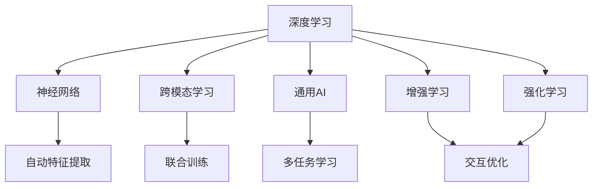
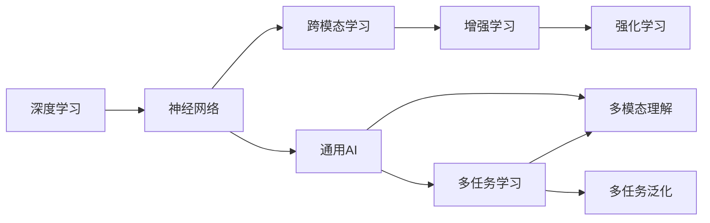
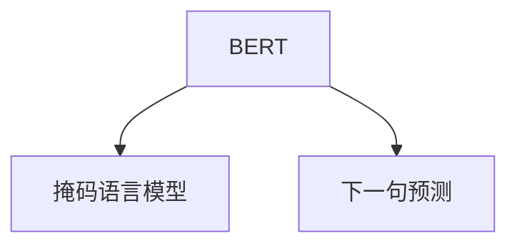

                 

## 1. 背景介绍

### 1.1 问题由来

人工智能（AI），特别是深度学习（Deep Learning）技术的快速发展，正在深刻改变各行各业的面貌。在AI研究领域中，Andrej Karpathy 是一位备受尊敬的深度学习专家，他不仅在研究领域取得了显著的成就，还在工业界推动了多项重要技术的落地应用。在当前AI技术持续演进的背景下，Andrej Karpathy 对于人工智能的未来发展方向提出了许多前瞻性的见解。

Karpathy 的兴趣广泛，涉及计算机视觉、自然语言处理、机器人学等多个领域。他坚信，未来AI的发展将更加强调通用性、跨模态理解以及与人类智能的协同共生。本文将深入探讨Karpathy 在AI未来发展方向上的见解，并结合当前研究进展进行讨论。

### 1.2 问题核心关键点

在Karpathy 的研究和实践中，他强调了以下几个核心关键点：
- **通用性与跨模态理解**：未来的AI模型应具备更强的通用性和跨模态理解能力，能够在不同领域和数据类型间进行无缝迁移。
- **人机协同**：AI技术的发展应注重与人类智能的协同，增强AI系统的可解释性、透明性和伦理责任。
- **数据与算力**：AI模型的性能提升依赖于更大规模、更高质量的训练数据和更高效的计算资源。
- **跨学科融合**：AI的发展应鼓励跨学科融合，借鉴心理学、神经科学等领域的研究成果，推动AI技术的全面进步。

### 1.3 问题研究意义

Karpathy 对于AI未来发展方向的见解，对于研究者和开发者来说具有重要的指导意义：
- **提升AI性能**：通过理解未来AI的发展方向，可以帮助研究者和开发者更好地设计和优化AI模型，提升其在各领域的性能。
- **推动技术落地**：明确AI未来的发展趋势，有助于企业和开发者在实际应用中更好地选择和部署AI技术，加速技术转化。
- **应对挑战**：了解AI发展中的潜在挑战，有助于提前制定应对策略，避免技术路径上的陷阱和风险。
- **促进跨学科合作**：跨学科融合是AI技术进步的重要驱动力，通过Karpathy 的见解，可以激发更多跨学科合作，促进AI技术的全面突破。

## 2. 核心概念与联系

### 2.1 核心概念概述

在探讨AI未来发展方向之前，首先需要明确几个核心概念及其之间的联系：

- **深度学习（Deep Learning）**：一种基于神经网络的机器学习技术，通过多层次的非线性变换，可以从大量数据中学习复杂的模式和结构。
- **神经网络（Neural Network）**：由大量神经元节点组成的网络结构，用于模拟人脑的神经元连接方式，实现数据的自动特征提取和分类。
- **跨模态学习（Cross-modal Learning）**：不同模态（如文本、图像、语音）的数据进行联合训练，提升模型在不同模态数据间进行信息传递和融合的能力。
- **通用AI（General AI）**：具有广泛知识、技能和理解能力的AI系统，能够在多种情境下执行复杂任务。
- **增强学习（Reinforcement Learning）**：通过与环境交互，智能体在每次行动后接收奖励或惩罚信号，逐步学习最优策略。
- **强化学习（Reinforcement Learning）**：一种机器学习技术，通过与环境交互，智能体在每次行动后接收奖励或惩罚信号，逐步学习最优策略。

### 2.2 概念间的关系

这些核心概念之间存在着紧密的联系，共同构成了AI技术的生态系统。以下Mermaid流程图展示了这些概念之间的联系和相互作用：



这个流程图展示了深度学习、神经网络、跨模态学习、通用AI、增强学习、强化学习等概念之间的关系：
- 深度学习通过神经网络实现自动特征提取。
- 跨模态学习通过联合训练实现不同模态数据的融合。
- 通用AI基于深度学习和跨模态学习的成果，提升AI系统的能力。
- 增强学习和强化学习通过与环境的交互优化智能体的行为。

### 2.3 核心概念的整体架构

最终，我们将这些核心概念整合为一个整体架构，如下所示：



这个综合架构展示了深度学习、神经网络、跨模态学习、通用AI、增强学习、强化学习、多任务学习和多模态理解之间的关系。

## 3. 核心算法原理 & 具体操作步骤
### 3.1 算法原理概述

Karpathy 强调，未来的AI模型应具备更强的通用性和跨模态理解能力。为此，他提出了几种关键算法原理：

- **自监督学习（Self-Supervised Learning）**：通过无标签数据进行预训练，学习通用的数据特征和结构。自监督学习可以提升模型在不同任务间的泛化能力。
- **多任务学习（Multi-task Learning）**：通过联合训练多个相关任务，共享模型参数，提高模型的任务适应性。
- **跨模态学习（Cross-modal Learning）**：在不同模态数据间进行联合训练，提升模型在不同模态数据间进行信息传递和融合的能力。
- **神经架构搜索（Neural Architecture Search）**：通过搜索算法自动设计神经网络架构，提升模型的结构和效率。

### 3.2 算法步骤详解

以下是基于自监督学习、多任务学习、跨模态学习和神经架构搜索的AI模型构建步骤：

#### 3.2.1 自监督学习

1. **数据准备**：收集大规模无标签数据。
2. **预训练**：在无标签数据上训练模型，学习数据特征。
3. **微调**：在有标签数据上微调预训练模型，提升模型在特定任务上的性能。

#### 3.2.2 多任务学习

1. **任务设计**：选择多个相关任务，设计联合训练的目标函数。
2. **模型初始化**：初始化模型参数，使用预训练模型作为初始化权重。
3. **联合训练**：在多个任务上联合训练模型，共享参数。
4. **任务评估**：在每个任务上独立评估模型性能，进行反馈调节。

#### 3.2.3 跨模态学习

1. **数据收集**：收集不同模态的数据，如文本、图像、语音等。
2. **数据对齐**：将不同模态的数据进行对齐，确保数据格式一致。
3. **联合训练**：在不同模态数据上联合训练模型，提升跨模态理解能力。
4. **模型融合**：在多模态数据上融合模型的输出，得到更全面的理解。

#### 3.2.4 神经架构搜索

1. **定义搜索空间**：定义神经网络架构的搜索空间，包括层数、节点数、连接方式等。
2. **设计评估指标**：设计评估指标，如模型精度、计算效率等。
3. **搜索算法**：使用搜索算法（如遗传算法、贝叶斯优化等）进行架构搜索。
4. **模型训练**：在搜索出的架构上进行模型训练，评估模型性能。
5. **选择最优架构**：选择性能最优的架构，进行进一步训练和优化。

### 3.3 算法优缺点

这些算法的优点和缺点如下：
- **自监督学习**：
  - **优点**：减少对标注数据的依赖，提升模型的泛化能力。
  - **缺点**：需要大量无标签数据，训练过程复杂。
- **多任务学习**：
  - **优点**：提升模型的任务适应性，降低标注成本。
  - **缺点**：模型复杂度高，训练时间长。
- **跨模态学习**：
  - **优点**：提升模型在不同模态数据间的信息传递能力，拓展模型应用范围。
  - **缺点**：数据对齐和联合训练复杂，模型规模较大。
- **神经架构搜索**：
  - **优点**：自动设计高效、精简的神经网络架构。
  - **缺点**：搜索过程耗时，对计算资源要求高。

### 3.4 算法应用领域

这些算法已经在多个领域得到了广泛应用：

- **计算机视觉**：使用自监督学习、多任务学习和跨模态学习进行图像分类、目标检测、图像生成等任务。
- **自然语言处理**：使用自监督学习、多任务学习和跨模态学习进行语言模型训练、文本分类、机器翻译等任务。
- **机器人学**：使用增强学习、强化学习和跨模态学习进行机器人导航、物体抓取等任务。
- **医疗健康**：使用自监督学习、多任务学习和神经架构搜索进行疾病诊断、医疗图像分析等任务。
- **自动驾驶**：使用强化学习和跨模态学习进行环境感知、路径规划等任务。

## 4. 数学模型和公式 & 详细讲解 & 举例说明

### 4.1 数学模型构建

为了更好地理解AI模型的构建过程，我们以一个简单的图像分类任务为例，展示自监督学习的数学模型：

设输入图像为 $x$，输出标签为 $y$，模型参数为 $\theta$。假设模型是一个深度神经网络，输入 $x$ 通过网络映射到输出 $y$，中间过程通过一系列线性变换和非线性激活函数实现。模型损失函数定义为：

$$
\mathcal{L}(\theta) = \frac{1}{N} \sum_{i=1}^N \ell(y_i, \hat{y}_i)
$$

其中，$\ell$ 为损失函数，通常使用交叉熵损失函数。$\hat{y}_i$ 为模型对输入 $x_i$ 的预测输出。

### 4.2 公式推导过程

接下来，我们推导自监督学习的梯度更新公式。假设自监督任务为掩码语言模型（Masked Language Model），其中输入 $x$ 包含部分单词被掩码，模型需预测被掩码的单词。假设掩码概率为 $p$，则模型预测输出的对数似然损失为：

$$
\ell(x, \hat{y}) = -\sum_{i=1}^N \log \hat{y}_i(x_i)
$$

其中，$\hat{y}_i$ 为模型对 $x_i$ 中掩码单词的预测。

根据链式法则，模型参数 $\theta$ 的梯度更新公式为：

$$
\frac{\partial \mathcal{L}}{\partial \theta} = -\frac{1}{N} \sum_{i=1}^N \frac{\partial \ell}{\partial \theta}
$$

其中，$\frac{\partial \ell}{\partial \theta}$ 为预测输出的梯度，通过反向传播算法计算得到。

### 4.3 案例分析与讲解

以谷歌的BERT模型为例，分析其自监督学习的数学模型和梯度更新公式。

BERT模型通过两个预训练任务进行训练：掩码语言模型和下一句预测（Next Sentence Prediction）。模型结构如图1所示：



掩码语言模型的损失函数为：

$$
\mathcal{L}_B = \frac{1}{N} \sum_{i=1}^N \sum_{j=1}^{n_b} -y_j \log \hat{y}_j
$$

其中，$n_b$ 为掩码单词数量。

下一句预测的损失函数为：

$$
\mathcal{L}_N = \frac{1}{N} \sum_{i=1}^N -y_i \log \hat{y}_i
$$

其中，$y_i$ 为下一句预测标签。

总损失函数为：

$$
\mathcal{L} = \mathcal{L}_B + \mathcal{L}_N
$$

在梯度更新过程中，模型使用AdamW优化器进行参数更新，学习率为 $1e-4$。通过这种方式，BERT模型在自监督学习的基础上，能够在各种下游任务上取得优异性能。

## 5. 项目实践：代码实例和详细解释说明

### 5.1 开发环境搭建

在进行AI项目实践前，需要准备开发环境。以下是使用Python和PyTorch进行AI开发的常见环境配置步骤：

1. **安装Python**：从官网下载并安装Python 3.7或以上版本，用于编写AI代码。
2. **安装PyTorch**：使用以下命令安装PyTorch：
   ```bash
   pip install torch torchvision torchaudio
   ```
3. **安装TensorFlow**：如果需要使用TensorFlow进行AI开发，可以使用以下命令：
   ```bash
   pip install tensorflow
   ```
4. **安装其他库**：安装其他常用的AI库，如NumPy、Pandas、Matplotlib、Jupyter Notebook等。

完成上述步骤后，即可在本地搭建AI开发环境，进行模型训练和推理。

### 5.2 源代码详细实现

以一个简单的图像分类任务为例，展示如何使用PyTorch和TensorFlow进行模型训练和微调：

#### 5.2.1 PyTorch实现

```python
import torch
import torch.nn as nn
import torchvision.transforms as transforms
from torch.utils.data import DataLoader, Dataset

# 定义数据集
class MyDataset(Dataset):
    def __init__(self, data_dir, transform=None):
        self.data_dir = data_dir
        self.transform = transform
        
    def __len__(self):
        return len(os.listdir(self.data_dir))
    
    def __getitem__(self, index):
        img_path = os.path.join(self.data_dir, f"{index}.jpg")
        img = Image.open(img_path)
        if self.transform:
            img = self.transform(img)
        label = index // 2  # 假设数据集由100张图片组成，每张图片对应2个类别
        return img, label

# 定义模型
class MyModel(nn.Module):
    def __init__(self):
        super(MyModel, self).__init__()
        self.conv1 = nn.Conv2d(3, 32, kernel_size=3, stride=1, padding=1)
        self.conv2 = nn.Conv2d(32, 64, kernel_size=3, stride=1, padding=1)
        self.pool = nn.MaxPool2d(kernel_size=2, stride=2)
        self.fc1 = nn.Linear(64 * 8 * 8, 256)
        self.fc2 = nn.Linear(256, 2)  # 输出2个类别
        
    def forward(self, x):
        x = self.conv1(x)
        x = nn.ReLU()(x)
        x = self.conv2(x)
        x = nn.ReLU()(x)
        x = self.pool(x)
        x = x.view(-1, 64 * 8 * 8)
        x = self.fc1(x)
        x = nn.ReLU()(x)
        x = self.fc2(x)
        return x

# 定义数据集和数据加载器
train_dataset = MyDataset("train_data_dir", transform=transforms.ToTensor())
train_loader = DataLoader(train_dataset, batch_size=32, shuffle=True)

# 定义模型和优化器
model = MyModel()
optimizer = torch.optim.Adam(model.parameters(), lr=0.001)

# 定义损失函数
criterion = nn.CrossEntropyLoss()

# 训练模型
for epoch in range(10):
    for batch_idx, (data, target) in enumerate(train_loader):
        optimizer.zero_grad()
        output = model(data)
        loss = criterion(output, target)
        loss.backward()
        optimizer.step()
```

#### 5.2.2 TensorFlow实现

```python
import tensorflow as tf
from tensorflow.keras import layers

# 定义模型
model = tf.keras.Sequential([
    layers.Conv2D(32, (3, 3), activation='relu', input_shape=(32, 32, 3)),
    layers.MaxPooling2D((2, 2)),
    layers.Conv2D(64, (3, 3), activation='relu'),
    layers.MaxPooling2D((2, 2)),
    layers.Flatten(),
    layers.Dense(64, activation='relu'),
    layers.Dense(10, activation='softmax')
])

# 编译模型
model.compile(optimizer='adam', loss='categorical_crossentropy', metrics=['accuracy'])

# 训练模型
model.fit(train_images, train_labels, epochs=10, batch_size=32)
```

### 5.3 代码解读与分析

让我们来详细解读一下关键代码的实现细节：

#### 5.3.1 PyTorch实现

**MyDataset类**：
- `__init__`方法：初始化数据集和数据转换方法。
- `__len__`方法：返回数据集大小。
- `__getitem__`方法：返回单个样本的图像和标签。

**MyModel类**：
- `__init__`方法：定义模型的结构。
- `forward`方法：定义前向传播过程。

**训练过程**：
- 定义数据集和数据加载器。
- 定义模型和优化器。
- 定义损失函数。
- 在训练集上循环迭代，进行模型训练。

#### 5.3.2 TensorFlow实现

**Sequential模型**：
- `Sequential`：用于构建线性堆叠的模型层。

**compile模型**：
- `compile`：用于编译模型，指定优化器、损失函数和评估指标。

**fit模型**：
- `fit`：用于训练模型，指定训练集、批次大小、训练轮数等参数。

### 5.4 运行结果展示

在完成模型训练后，可以使用测试集对模型进行评估，得到模型的精度和损失：

```python
# 加载测试集数据
test_dataset = MyDataset("test_data_dir", transform=transforms.ToTensor())
test_loader = DataLoader(test_dataset, batch_size=32, shuffle=False)

# 评估模型
with torch.no_grad():
    correct = 0
    total = 0
    for batch_idx, (data, target) in enumerate(test_loader):
        output = model(data)
        _, predicted = torch.max(output.data, 1)
        total += target.size(0)
        correct += (predicted == target).sum().item()

    print(f'Test Accuracy of the model on the 10000 test images: {100 * correct / total}%')
```

## 6. 实际应用场景

### 6.1 智能客服系统

智能客服系统是AI技术在实际应用中的一个典型场景。通过使用自监督学习和多任务学习技术，智能客服系统可以自动理解用户意图，快速响应客户咨询，提升客户体验。

具体而言，可以通过收集企业内部的客服对话记录，使用自监督学习任务训练通用客服模型，然后通过多任务学习对模型进行微调，使其能够适应不同客户场景和需求。最终，系统可以根据用户问题自动匹配最佳答复，提供智能客服服务。

### 6.2 金融舆情监测

金融舆情监测是AI在金融领域的重要应用之一。通过使用跨模态学习和自监督学习技术，系统可以实时监测市场舆论动向，及时发现负面信息传播，规避金融风险。

具体而言，可以收集金融领域相关的新闻、报道、评论等文本数据，并对其进行情感分析、主题分类等任务。通过联合训练不同模态数据，系统可以学习到更全面的市场信息，实现自动舆情监测，帮助金融机构快速应对潜在风险。

### 6.3 个性化推荐系统

个性化推荐系统是AI技术在电商、视频等领域的常见应用。通过使用自监督学习和多任务学习技术，系统可以根据用户行为数据和历史评分数据，推荐个性化的商品或内容。

具体而言，可以收集用户浏览、点击、评分等行为数据，提取和用户交互的商品或内容描述。通过联合训练不同模态数据，系统可以学习到用户的兴趣点和行为模式，提供更精准的推荐结果，提升用户体验。

### 6.4 未来应用展望

随着AI技术的不断发展，未来的AI系统将更加智能、通用、安全。以下是未来AI发展的几个方向：

1. **通用AI**：未来的AI系统将具备更强的通用性和跨模态理解能力，能够在多种情境下执行复杂任务。
2. **人机协同**：未来的AI系统将注重与人类智能的协同，增强系统的可解释性和透明性，避免不良影响。
3. **数据与算力**：未来的AI系统将依赖更大规模、更高质量的训练数据和更高效的计算资源，提升系统性能。
4. **跨学科融合**：未来的AI系统将鼓励跨学科融合，借鉴心理学、神经科学等领域的研究成果，推动AI技术的全面进步。

## 7. 工具和资源推荐

### 7.1 学习资源推荐

为了帮助开发者系统掌握AI技术，这里推荐一些优质的学习资源：

1. **《深度学习》（Ian Goodfellow等著）**：深度学习领域的经典教材，全面介绍深度学习的基本概念和应用。
2. **Coursera深度学习课程**：由深度学习专家Andrew Ng主讲，涵盖深度学习的基本概念和实践技巧。
3. **arXiv论文预印本**：人工智能领域最新研究成果的发布平台，涵盖大量尚未发表的前沿工作，学习前沿技术的必读资源。
4. **Google AI博客**：谷歌AI团队分享最新研究成果和洞见，提供AI技术的最新进展。
5. **GitHub开源项目**：在GitHub上Star、Fork数最多的AI相关项目，提供代码示例和最佳实践。

### 7.2 开发工具推荐

为了提高AI开发效率，这里推荐一些常用的开发工具：

1. **PyTorch**：基于Python的开源深度学习框架，灵活动态的计算图，适合快速迭代研究。
2. **TensorFlow**：由Google主导开发的开源深度学习框架，生产部署方便，适合大规模工程应用。
3. **Jupyter Notebook**：用于编写、执行和分享Python代码的交互式平台，适合进行数据探索和模型训练。
4. **TensorBoard**：TensorFlow配套的可视化工具，可实时监测模型训练状态，提供丰富的图表呈现方式。
5. **Weights & Biases**：模型训练的实验跟踪工具，记录和可视化模型训练过程中的各项指标。

### 7.3 相关论文推荐

以下是几篇重要的AI研究论文，值得关注：

1. **Attention is All You Need**（NeurIPS 2017）：提出Transformer结构，开启深度学习的新时代。
2. **BERT: Pre-training of Deep Bidirectional Transformers for Language Understanding**（NIPS 2018）：提出BERT模型，引入基于掩码的自监督预训练任务。
3. **GPT-2**（AAAI 2019）：展示大模型在自然语言处理任务中的强大零样本学习能力。
4. **Language Models are Unsupervised Multitask Learners**：提出基于自监督学习的多任务学习框架。
5. **AlphaGo Zero**（Nature 2017）：使用强化学习技术，开发出世界领先的围棋AI系统。

这些论文代表了AI技术的发展脉络，帮助研究者把握学科前进方向，激发更多的创新灵感。

## 8. 总结：未来发展趋势与挑战

### 8.1 研究成果总结

通过本文的讨论，可以看到AI技术正在快速发展，涵盖深度学习、神经网络、自监督学习、多任务学习、跨模态学习等多个方面。这些技术在图像分类、自然语言处理、机器人学、金融舆情监测、个性化推荐系统等领域得到了广泛应用，展示了AI技术的强大潜力。

### 8.2 未来发展趋势

未来AI技术的发展趋势如下：
1. **通用性与跨模态理解**：未来的AI系统将具备更强的通用性和跨模态理解能力，能够在多种情境下执行复杂任务。
2. **人机协同**：未来的AI系统将注重与人类智能的协同，增强系统的可解释性和透明性，避免不良影响。
3. **数据与算力**：未来的AI系统将依赖更大规模、更高质量的训练数据和更高效的计算资源，提升系统性能。
4. **跨学科融合**：未来的AI系统将鼓励跨学科融合，借鉴心理学、神经科学等领域的研究成果，推动AI技术的全面进步。

### 8.3 面临的挑战

尽管AI技术取得了很多进展，但在发展过程中也面临以下挑战：
1. **数据隐私与安全**：AI系统需要大量的数据进行训练，如何保护用户隐私，确保数据安全是一个重要问题。
2. **模型鲁棒性与公平性**：AI模型面临数据偏见和鲁棒性问题，如何提升模型的公平性和鲁棒性，避免不良影响是一个重要挑战。
3. **模型可解释性**：AI模型通常被视为“黑盒”系统，难以解释其内部工作机制和决策逻辑，如何增强模型的可解释性，提升用户信任度是一个重要问题。
4. **跨领域泛化能力**：AI模型在不同领域和数据类型间进行迁移时，往往面临泛化能力不足的问题，如何提升模型的泛化能力，是一个重要挑战。
5. **资源与成本**：AI模型的训练和推理需要大量计算资源，如何降低成本，提升效率是一个重要问题。

### 8.4 研究展望

未来AI研究的方向包括：
1. **跨学科融合**：借鉴心理学、神经科学等领域的研究成果，推动AI技术的全面进步。
2. **数据与算

