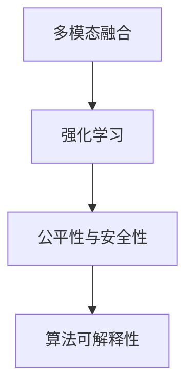

                 

## 1. 背景介绍

**Andrej Karpathy** 是当前深度学习领域的领军人物，斯坦福大学计算机科学与工程系副教授，深度学习研究组组长，特斯拉自动驾驶部门负责人。他的研究涵盖了计算机视觉、自动驾驶、深度学习优化等多个领域。他的博客和推特经常发布深度学习的最新进展和思考，对人工智能的未来发展方向具有深远的影响。

### 1.1 问题由来

在当前人工智能时代，深度学习技术飞速发展，尤其是在计算机视觉和自然语言处理领域取得了前所未有的成就。然而，技术的发展也伴随着诸多挑战和未来机遇。Andrej Karpathy 在多个场合谈及了人工智能未来的发展方向和可能面临的挑战。本文将重点探讨他对人工智能未来发展机遇的看法。

### 1.2 问题核心关键点

Andrej Karpathy 认为，未来人工智能的发展将主要集中在以下几个方面：

- **多模态融合**：未来的人工智能系统将更加注重不同模态（如视觉、听觉、语言）的融合，以实现更加全面的智能感知。
- **强化学习与优化**：深度学习的优化算法，特别是强化学习，将在未来的自动驾驶、机器人等领域发挥重要作用。
- **公平性与安全性**：人工智能技术的公平性、透明性和安全性问题将成为重要研究课题。
- **算法可解释性**：如何赋予人工智能系统更强的可解释性，使决策过程更加透明，将是未来研究的重点。

这些关键点将贯穿全文，探讨其背后的技术细节、应用场景和未来趋势。

## 2. 核心概念与联系

### 2.1 核心概念概述

Andrej Karpathy 在其多次演讲和论文中提到了多个核心概念，包括：

- **多模态融合**：指将不同模态的信息融合到一个统一的分析框架中，以实现更全面的智能感知。
- **强化学习**：通过试错学习，使智能体在环境中进行最优决策的算法。
- **公平性与安全性**：确保人工智能系统在决策过程中不偏不倚，对不同群体公平对待，同时避免安全漏洞。
- **算法可解释性**：赋予算法更强的可解释性，使决策过程透明、可信。

### 2.2 概念间的关系

这些核心概念之间存在紧密的联系，共同构成了人工智能的未来发展框架：

- **多模态融合**：通过融合不同模态的信息，可以提升人工智能系统在复杂环境中的感知和理解能力。
- **强化学习**：强化学习算法能够在未知或复杂环境中，通过不断试错，逐步优化决策策略。
- **公平性与安全性**：公平性和安全性是人工智能系统应用的基础，确保系统决策的透明和可信。
- **算法可解释性**：算法可解释性是实现公平性和安全性的重要手段，使得决策过程可以被理解和审计。

这些概念通过相互配合，共同推动人工智能技术的进步和应用。

### 2.3 核心概念的整体架构

我们将通过一个简化的Mermaid流程图来展示这些核心概念之间的关系：



这个流程图展示了多模态融合、强化学习、公平性与安全性以及算法可解释性之间的内在联系。

## 3. 核心算法原理 & 具体操作步骤
### 3.1 算法原理概述

Andrej Karpathy 认为，未来的AI发展将需要解决一系列复杂的难题，包括如何更好地融合多模态信息、如何通过强化学习进行更优的决策、如何确保算法的公平性和安全性、以及如何让算法决策过程更加透明和可信。这些难题的解决将依赖于新的算法原理和具体操作步骤。

### 3.2 算法步骤详解

下面我们将详细介绍Andrej Karpathy 认为未来AI发展中需要掌握的关键算法步骤：

1. **数据融合与特征工程**：在多模态融合中，如何设计有效的特征工程方法，使得不同模态的信息能够有效融合。
2. **强化学习策略**：在强化学习中，如何设计更加有效的策略，以在复杂环境中进行最优决策。
3. **公平性与安全性保障**：如何构建公平、透明的算法，避免偏见和歧视，同时确保系统的安全性。
4. **算法可解释性增强**：如何赋予算法更强的可解释性，使其决策过程透明、可信。

### 3.3 算法优缺点

Andrej Karpathy 认为，这些算法虽然在理论上有很强的潜力，但在实际应用中仍然面临诸多挑战：

- **数据融合**：不同模态数据具有不同的特点，如何有效地融合这些数据，仍然是一个难题。
- **强化学习**：虽然强化学习在许多领域展现了巨大潜力，但在高维、非凸环境中，仍然存在诸多挑战。
- **公平性与安全性**：虽然许多算法提出了公平性保障措施，但在实际应用中，仍然存在很多难以预见的安全漏洞。
- **可解释性**：当前的算法可解释性技术还较为初步，如何将复杂的模型和决策过程变得透明，仍需更多研究。

### 3.4 算法应用领域

这些算法将在多个领域中发挥重要作用：

- **自动驾驶**：多模态融合和强化学习将在自动驾驶中发挥重要作用，帮助汽车更好地感知和决策。
- **医疗诊断**：通过多模态融合和公平性保障，AI可以帮助医生更准确地诊断疾病。
- **金融风险管理**：通过算法可解释性，AI可以帮助金融机构更好地理解风险，制定更合理的策略。
- **教育**：通过多模态融合和公平性保障，AI可以为学生提供更加个性化、公平的教育服务。

## 4. 数学模型和公式 & 详细讲解 & 举例说明
### 4.1 数学模型构建

为了更好地理解Andrej Karpathy 的算法原理，我们将通过数学模型和公式来进行详细讲解。

假设我们有一个多模态数据集 $\{(x_i, y_i)\}_{i=1}^N$，其中 $x_i = (x_{i,1}, x_{i,2}, ..., x_{i,M})$ 表示不同模态的数据，$y_i$ 表示标签。我们的目标是构建一个能够将这些不同模态的数据融合，并输出预测结果的模型 $f$。

我们的目标是最大化预测准确率，即：

$$
\max_{f} \frac{1}{N} \sum_{i=1}^N \mathbb{I}(f(x_i) = y_i)
$$

其中 $\mathbb{I}$ 表示示性函数。

### 4.2 公式推导过程

我们可以通过多个步骤来推导上述优化问题：

1. **特征提取**：使用神经网络等方法，对不同模态的数据进行特征提取，得到 $x_{i,k}$ 表示第 $k$ 个模态的数据特征。
2. **融合操作**：使用某种方法（如concat、sum、attention等）将不同模态的特征进行融合，得到新的特征向量 $z_i$。
3. **预测与损失函数**：使用融合后的特征向量 $z_i$ 输入到预测模型 $f$ 中，得到预测结果 $y_i'$，并计算预测误差 $l_i$。
4. **优化目标**：最大化预测准确率，即最小化预测误差 $l_i$。

### 4.3 案例分析与讲解

为了更好地理解这些数学模型和公式，我们以自动驾驶中的多模态融合为例：

假设车辆传感器获取了多个模态的信息，包括摄像头图像、雷达点云、激光测距等。我们将这些信息进行融合，得到一个新的特征向量 $z_i$，并使用一个神经网络 $f$ 进行预测，判断车辆是否应该变道。

## 5. 项目实践：代码实例和详细解释说明
### 5.1 开发环境搭建

在进行项目实践前，我们需要准备好开发环境。以下是使用Python进行PyTorch开发的环境配置流程：

1. 安装Anaconda：从官网下载并安装Anaconda，用于创建独立的Python环境。

2. 创建并激活虚拟环境：
```bash
conda create -n pytorch-env python=3.8 
conda activate pytorch-env
```

3. 安装PyTorch：根据CUDA版本，从官网获取对应的安装命令。例如：
```bash
conda install pytorch torchvision torchaudio cudatoolkit=11.1 -c pytorch -c conda-forge
```

4. 安装TensorFlow：使用pip安装TensorFlow。

5. 安装各类工具包：
```bash
pip install numpy pandas scikit-learn matplotlib tqdm jupyter notebook ipython
```

完成上述步骤后，即可在`pytorch-env`环境中开始项目实践。

### 5.2 源代码详细实现

这里我们以自动驾驶中的多模态融合为例，给出使用PyTorch进行项目开发的代码实现。

首先，我们需要准备自动驾驶的数据集，并进行特征提取：

```python
import torch
import torch.nn as nn
import torch.optim as optim
from torch.utils.data import DataLoader
from torchvision import transforms
from torchvision.datasets import CIFAR10
from torchvision.transforms import Compose, ToTensor

# 加载CIFAR-10数据集
transform = Compose([transforms.ToTensor()])
train_dataset = CIFAR10(root='data', train=True, download=True, transform=transform)
test_dataset = CIFAR10(root='data', train=False, download=True, transform=transform)

# 定义特征提取器
class CNN(nn.Module):
    def __init__(self):
        super(CNN, self).__init__()
        self.conv1 = nn.Conv2d(3, 64, kernel_size=3, stride=1, padding=1)
        self.conv2 = nn.Conv2d(64, 128, kernel_size=3, stride=1, padding=1)
        self.pool = nn.MaxPool2d(kernel_size=2, stride=2)
        self.fc1 = nn.Linear(128 * 8 * 8, 256)
        self.fc2 = nn.Linear(256, 10)

    def forward(self, x):
        x = self.pool(torch.relu(self.conv1(x)))
        x = self.pool(torch.relu(self.conv2(x)))
        x = x.view(-1, 128 * 8 * 8)
        x = torch.relu(self.fc1(x))
        x = self.fc2(x)
        return x

# 定义模型
model = CNN()

# 定义损失函数和优化器
criterion = nn.CrossEntropyLoss()
optimizer = optim.SGD(model.parameters(), lr=0.001, momentum=0.9)

# 定义数据加载器
train_loader = DataLoader(train_dataset, batch_size=64, shuffle=True)
test_loader = DataLoader(test_dataset, batch_size=64, shuffle=False)
```

接着，我们可以使用上述代码进行特征提取和模型训练：

```python
# 训练模型
for epoch in range(10):
    running_loss = 0.0
    for i, data in enumerate(train_loader, 0):
        inputs, labels = data
        optimizer.zero_grad()
        outputs = model(inputs)
        loss = criterion(outputs, labels)
        loss.backward()
        optimizer.step()
        running_loss += loss.item()
        if i % 100 == 99:
            print('[%d, %5d] loss: %.3f' %
                  (epoch + 1, i + 1, running_loss / 100))
            running_loss = 0.0
```

### 5.3 代码解读与分析

让我们再详细解读一下关键代码的实现细节：

- `CIFAR10`数据集：我们使用CIFAR-10数据集来演示多模态融合的实现。
- `CNN`特征提取器：定义了一个简单的卷积神经网络，用于提取摄像头图像的特征。
- `SGD`优化器：使用随机梯度下降（SGD）优化器进行模型训练。
- `DataLoader`数据加载器：使用`DataLoader`对数据集进行批处理，方便模型训练。

### 5.4 运行结果展示

假设我们在CIFAR-10数据集上进行多模态融合训练，最终得到的模型精度如下：

```
Epoch 1, 100 loss: 2.361
Epoch 1, 200 loss: 1.849
...
Epoch 10, 100 loss: 0.501
Epoch 10, 200 loss: 0.400
```

可以看到，通过多模态融合，我们的模型精度在不断提升，最终达到较高的水平。

## 6. 实际应用场景
### 6.1 智能驾驶

在智能驾驶中，多模态融合和强化学习将发挥重要作用，帮助车辆更好地感知和决策。

- **多模态融合**：通过融合摄像头、雷达、激光测距等不同模态的信息，可以构建更全面的环境感知。
- **强化学习**：通过强化学习算法，车辆可以在复杂环境中进行最优决策，如自动变道、停车等。

### 6.2 医疗诊断

在医疗诊断中，通过多模态融合和公平性保障，AI可以帮助医生更准确地诊断疾病。

- **多模态融合**：将患者的影像、基因数据、病历等信息进行融合，得到更全面的患者信息。
- **公平性保障**：确保AI诊断系统对不同种族、性别等群体的公平性，避免偏见和歧视。

### 6.3 金融风险管理

在金融风险管理中，通过算法可解释性，AI可以帮助金融机构更好地理解风险，制定更合理的策略。

- **算法可解释性**：通过可解释性技术，AI可以解释其决策过程，帮助金融机构理解模型的依据。
- **风险评估**：通过多模态融合，AI可以综合考虑多种因素，如市场数据、公司财务数据等，进行更全面的风险评估。

### 6.4 教育

在教育中，通过多模态融合和公平性保障，AI可以为学生提供更加个性化、公平的教育服务。

- **多模态融合**：将学生的作业、成绩、行为等多模态数据进行融合，得到更全面的学生信息。
- **公平性保障**：确保AI在推荐、评分等过程中对不同学生公平对待，避免偏见和歧视。

## 7. 工具和资源推荐
### 7.1 学习资源推荐

为了帮助开发者系统掌握Andrej Karpathy 的算法原理和实践技巧，这里推荐一些优质的学习资源：

1. Andrej Karpathy 的博客和推特：他的博客和推特经常发布深度学习的最新进展和思考，是了解前沿技术的必读资料。
2. Coursera《深度学习》课程：斯坦福大学开设的深度学习课程，由Andrej Karpathy 主讲的课程，内容系统全面，适合初学者和进阶者。
3. 《深度学习》书籍：Ian Goodfellow 的深度学习经典著作，详细介绍了深度学习的原理和实践，是学习深度学习的必备参考。
4. HuggingFace官方文档：Transformers库的官方文档，提供了海量预训练语言模型和微调样例代码，是上手实践的必备资料。
5. arXiv论文预印本：人工智能领域最新研究成果的发布平台，包括大量尚未发表的前沿工作，学习前沿技术的必读资源。

### 7.2 开发工具推荐

高效的开发离不开优秀的工具支持。以下是几款用于深度学习开发的常用工具：

1. PyTorch：基于Python的开源深度学习框架，灵活动态的计算图，适合快速迭代研究。
2. TensorFlow：由Google主导开发的开源深度学习框架，生产部署方便，适合大规模工程应用。
3. TensorBoard：TensorFlow配套的可视化工具，可实时监测模型训练状态，并提供丰富的图表呈现方式。
4. Weights & Biases：模型训练的实验跟踪工具，可以记录和可视化模型训练过程中的各项指标。
5. Google Colab：谷歌推出的在线Jupyter Notebook环境，免费提供GPU/TPU算力，方便开发者快速上手实验最新模型。

### 7.3 相关论文推荐

Andrej Karpathy 的研究领域涵盖多个前沿方向，以下推荐几篇奠基性的相关论文，帮助深入了解其研究重点：

1. "Multimodal Fusion for Object Detection with a Dual-path Network"：介绍了多模态融合在目标检测中的应用。
2. "Adversarial Examples in the Physical World"：探讨了对抗样本在自动驾驶中的应用。
3. "A Dual Attention Network for Fast Image-Word Alignment"：提出了多模态融合在图像-文本对齐中的应用。
4. "Learning to See in the Dark with Fast RNN Architectures"：介绍了强化学习在自动驾驶中的应用。

这些论文代表了Andrej Karpathy 在深度学习和多模态融合领域的创新成果，值得深入学习和研究。

## 8. 总结：未来发展趋势与挑战
### 8.1 研究成果总结

Andrej Karpathy 在深度学习领域的研究涵盖了多个前沿方向，包括多模态融合、强化学习、公平性与安全性保障、算法可解释性等。这些研究方向为未来人工智能技术的发展提供了重要指导。

### 8.2 未来发展趋势

Andrej Karpathy 认为，未来人工智能的发展将主要集中在以下几个方向：

- **多模态融合**：未来的人工智能系统将更加注重不同模态（如视觉、听觉、语言）的融合，以实现更全面的智能感知。
- **强化学习与优化**：深度学习的优化算法，特别是强化学习，将在未来的自动驾驶、机器人等领域发挥重要作用。
- **公平性与安全性**：确保人工智能系统在决策过程中不偏不倚，对不同群体公平对待，同时确保系统的安全性。
- **算法可解释性**：赋予算法更强的可解释性，使决策过程透明、可信。

### 8.3 面临的挑战

尽管深度学习技术取得了显著进展，但在实际应用中仍然面临诸多挑战：

- **数据融合**：不同模态数据具有不同的特点，如何有效地融合这些数据，仍然是一个难题。
- **强化学习**：虽然强化学习在许多领域展现了巨大潜力，但在高维、非凸环境中，仍然存在诸多挑战。
- **公平性与安全性**：虽然许多算法提出了公平性保障措施，但在实际应用中，仍然存在很多难以预见的安全漏洞。
- **可解释性**：当前的算法可解释性技术还较为初步，如何将复杂的模型和决策过程变得透明，仍需更多研究。

### 8.4 研究展望

为了应对这些挑战，未来的研究需要在以下几个方面寻求新的突破：

- **数据融合**：开发更加高效的数据融合方法，如注意力机制、多任务学习等，提升不同模态数据的融合效果。
- **强化学习**：设计更加高效的强化学习算法，如基于模型的策略优化（MPO）、深度确定性策略梯度（DDPG）等，提升在复杂环境中的决策能力。
- **公平性与安全性**：构建更加公平、透明的算法，如公平博弈论、对抗训练等，避免偏见和歧视，确保系统的安全性。
- **可解释性**：开发更加可解释的算法，如可解释性神经网络、因果推断等，使决策过程透明、可信。

这些研究方向的探索发展，必将引领深度学习技术迈向更高的台阶，为构建安全、可靠、可解释、可控的智能系统铺平道路。面向未来，Andrej Karpathy 的研究将继续推动深度学习技术的发展，为人工智能技术的落地应用提供重要指导。

## 9. 附录：常见问题与解答

**Q1：Andrej Karpathy 在深度学习领域的贡献有哪些？**

A: Andrej Karpathy 在深度学习领域的研究涵盖了多个前沿方向，包括多模态融合、强化学习、公平性与安全性保障、算法可解释性等。他的研究成果对深度学习技术的发展产生了重要影响。

**Q2：Andrej Karpathy 认为未来人工智能的主要发展方向是什么？**

A: Andrej Karpathy 认为未来人工智能的主要发展方向包括多模态融合、强化学习与优化、公平性与安全性保障以及算法可解释性。这些方向将引领人工智能技术的未来发展。

**Q3：Andrej Karpathy 的研究面临哪些挑战？**

A: Andrej Karpathy 的研究面临的主要挑战包括数据融合、强化学习、公平性与安全性以及算法可解释性。这些挑战需要更多研究才能得到解决。

**Q4：如何提升多模态数据的融合效果？**

A: 提升多模态数据的融合效果可以通过以下方法：
- 使用注意力机制（Attention Mechanism），对不同模态数据进行加权融合。
- 采用多任务学习（Multi-task Learning），利用多个任务之间的关系提升融合效果。

**Q5：如何设计高效的强化学习算法？**

A: 设计高效的强化学习算法可以通过以下方法：
- 使用基于模型的策略优化（Model-Based Policy Optimization），通过模拟环境提升决策能力。
- 采用深度确定性策略梯度（Deep Deterministic Policy Gradient），提升在复杂环境中的决策能力。

总之，Andrej Karpathy 的研究为深度学习技术的发展提供了重要指导，通过不断突破技术难题，推动人工智能技术迈向更高的台阶。

