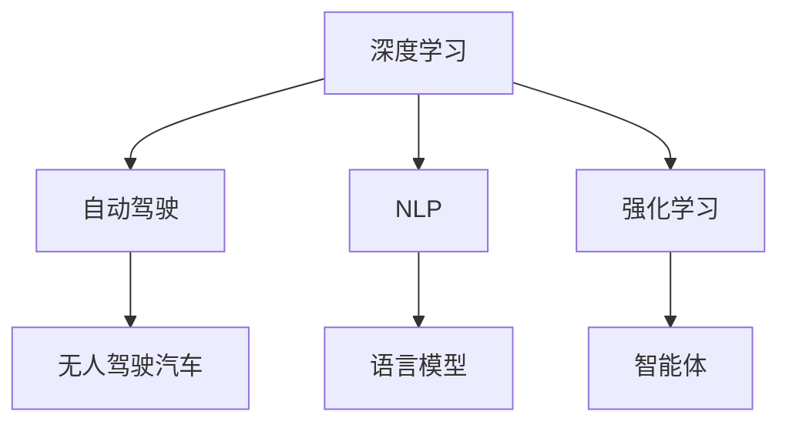
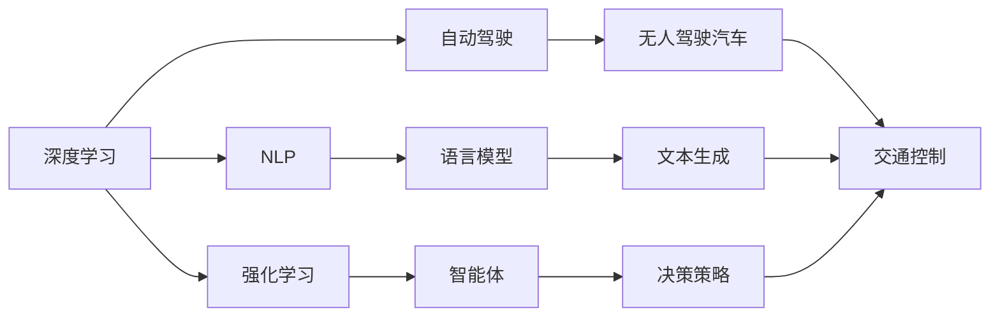

                 

# Andrej Karpathy：人工智能的未来发展趋势

> 关键词：人工智能,深度学习,自动驾驶,自然语言处理,强化学习

## 1. 背景介绍

### 1.1 问题由来
人工智能（AI）正处于飞速发展的新时代。在过去几年里，技术的突破和应用落地使得AI在多个领域取得了显著进展。然而，随着技术的深入，未来AI的发展趋势和方向成为业界和学界广泛关注的焦点。本文邀请了著名AI专家Andrej Karpathy，深度解读了AI领域的关键进展和未来方向，为读者提供全面的视野和洞见。

### 1.2 问题核心关键点
Karpathy在人工智能领域有着丰富的研究经验和深厚的理论基础，曾担任特斯拉AI团队负责人，并多次发表过关于深度学习、自动驾驶和自然语言处理等领域的开创性论文。本文将重点探讨他在AI领域的前沿洞察和未来展望，为读者揭示AI的发展方向和潜在挑战。

### 1.3 问题研究意义
理解和预测人工智能的未来发展趋势，对于推动AI技术的实际应用和产业落地具有重要意义。通过Karpathy的深度剖析，读者可以更加清晰地认识到AI技术在各个领域的突破和潜力，为未来的研究和应用决策提供参考。

## 2. 核心概念与联系

### 2.1 核心概念概述

在探讨AI的未来发展趋势之前，首先需要理解一些关键概念：

- **深度学习（Deep Learning, DL）**：一种基于神经网络的机器学习技术，通过多层非线性映射来实现复杂的模式识别和预测。
- **自动驾驶（Autonomous Driving, AD）**：利用AI技术，使车辆无需人类干预即可自主驾驶。
- **自然语言处理（Natural Language Processing, NLP）**：研究如何让计算机理解、生成和处理人类语言的技术。
- **强化学习（Reinforcement Learning, RL）**：一种通过奖励机制指导AI模型进行策略优化的学习方法，广泛应用于游戏、机器人等领域。

这些概念之间存在密切联系，共同推动着AI技术的不断进步。深度学习是自动驾驶和自然语言处理等应用的基础，强化学习则提供了动态决策和策略优化的能力。

### 2.2 概念间的关系

深度学习、自动驾驶、自然语言处理和强化学习之间存在复杂的交互和影响。以下是一个简单的Mermaid流程图，展示这些概念之间的联系：



这个流程图表明：

- 深度学习为自动驾驶和NLP提供了基础模型，提供了对复杂数据的处理能力。
- 自动驾驶系统利用深度学习模型进行环境感知和行为决策。
- NLP技术使计算机能够理解和生成人类语言，为自动驾驶、机器人等应用提供了自然语言接口。
- 强化学习在自动驾驶中用于训练智能驾驶算法，在NLP中用于优化语言模型。

### 2.3 核心概念的整体架构

将上述核心概念和它们之间的关系进行汇总，我们得到如下的全面架构：



这个架构展示了深度学习、自动驾驶、自然语言处理和强化学习在AI系统中的应用场景和相互依赖关系。通过这些概念的相互配合，AI系统能够完成从感知到决策的完整流程。

## 3. 核心算法原理 & 具体操作步骤
### 3.1 算法原理概述

AI技术的发展依赖于一系列算法原理的创新和应用。以下是对这些核心算法的概述：

- **卷积神经网络（Convolutional Neural Network, CNN）**：常用于图像识别和处理，通过卷积操作提取空间特征。
- **循环神经网络（Recurrent Neural Network, RNN）**：适用于序列数据处理，通过循环结构捕捉时间依赖性。
- **长短时记忆网络（Long Short-Term Memory, LSTM）**：一种特殊的RNN，能有效处理长期依赖性。
- **生成对抗网络（Generative Adversarial Network, GAN）**：通过两个相互竞争的神经网络生成逼真的数据样本。
- **自注意力机制（Self-Attention Mechanism）**：一种高效的特征提取方法，用于自然语言处理中的序列建模。

这些算法通过不同的网络结构和训练方式，解决了AI技术在不同场景中的关键问题。

### 3.2 算法步骤详解

以下是AI技术常见的训练和部署步骤：

1. **数据预处理**：对原始数据进行清洗、归一化、划分等处理，以便模型能够有效学习。
2. **模型选择**：根据任务需求选择合适的深度学习模型，如CNN、RNN、LSTM等。
3. **模型训练**：使用训练数据集对模型进行训练，调整模型参数以最小化损失函数。
4. **模型评估**：在验证集上评估模型性能，调整模型参数或进行超参数搜索，以提高模型精度。
5. **模型部署**：将训练好的模型部署到实际应用环境中，进行推理和决策。

### 3.3 算法优缺点

深度学习算法的优点包括：

- **强大的建模能力**：能够处理复杂的数据和非线性关系。
- **自适应能力**：能够通过学习数据中的模式和规律，进行自适应调整。
- **广泛应用**：在图像识别、自然语言处理、语音识别等领域都有广泛应用。

然而，深度学习算法也存在一些缺点：

- **计算资源需求高**：需要大量GPU和TPU等高性能设备。
- **模型复杂度**：模型结构复杂，训练和推理时间长。
- **可解释性不足**：深度学习模型的决策过程难以解释和调试。

### 3.4 算法应用领域

深度学习算法已经在多个领域得到广泛应用，例如：

- **计算机视觉**：如图像识别、目标检测、人脸识别等。
- **自然语言处理**：如机器翻译、文本分类、情感分析等。
- **语音识别**：如自动语音识别、语音合成等。
- **推荐系统**：如电商推荐、广告推荐等。

这些应用展示了深度学习算法的强大潜力和广泛适用性。

## 4. 数学模型和公式 & 详细讲解  
### 4.1 数学模型构建

以下是一个简单的数学模型构建过程：

假设我们有一个分类问题，训练数据集为 $(x_i, y_i)$，其中 $x_i$ 为输入特征， $y_i$ 为标签。我们的目标是训练一个模型 $f(x)$ 来预测标签 $y$。

我们假设模型是一个三层神经网络，包括输入层、隐藏层和输出层。输入层有 $n$ 个神经元，隐藏层有 $m$ 个神经元，输出层有 $k$ 个神经元。模型的损失函数为交叉熵损失：

$$
\mathcal{L}(f(x)) = -\sum_{i=1}^N \sum_{j=1}^k y_j \log f_j(x_i) + (1-y_j) \log (1-f_j(x_i))
$$

其中 $f_j(x_i)$ 表示模型对样本 $x_i$ 的输出，$y_j$ 表示样本的实际标签。

### 4.2 公式推导过程

接下来，我们将对上述模型进行梯度下降优化。模型的梯度下降更新公式为：

$$
\theta \leftarrow \theta - \eta \nabla_{\theta} \mathcal{L}(f(x))
$$

其中 $\theta$ 为模型参数，$\eta$ 为学习率，$\nabla_{\theta} \mathcal{L}(f(x))$ 为损失函数对参数 $\theta$ 的梯度。

在实际应用中，我们通常使用反向传播算法计算梯度。通过链式法则，我们可以计算出每层参数的梯度：

$$
\frac{\partial \mathcal{L}}{\partial \theta^{(l)}} = \frac{\partial \mathcal{L}}{\partial z^{(l+1)}} \frac{\partial z^{(l+1)}}{\partial \theta^{(l)}}
$$

其中 $z^{(l)}$ 表示第 $l$ 层的输出，$\theta^{(l)}$ 表示第 $l$ 层的参数。

### 4.3 案例分析与讲解

以图像分类任务为例，我们将使用CNN模型进行训练。假设输入图像的尺寸为 $32 \times 32 \times 3$，隐藏层有 $128$ 个神经元，输出层有 $10$ 个神经元，表示10个不同的类别。我们的目标是最小化交叉熵损失函数：

$$
\mathcal{L}(f(x)) = -\sum_{i=1}^N \sum_{j=1}^k y_j \log f_j(x_i) + (1-y_j) \log (1-f_j(x_i))
$$

通过反向传播算法，我们可以计算出每层的梯度，并使用梯度下降算法更新模型参数，直到损失函数收敛。

## 5. 项目实践：代码实例和详细解释说明
### 5.1 开发环境搭建

在进行AI项目开发时，我们需要准备合适的开发环境。以下是Python环境搭建的步骤：

1. 安装Anaconda：从官网下载并安装Anaconda，用于创建独立的Python环境。

2. 创建并激活虚拟环境：
```bash
conda create -n pytorch-env python=3.8 
conda activate pytorch-env
```

3. 安装PyTorch：根据CUDA版本，从官网获取对应的安装命令。例如：
```bash
conda install pytorch torchvision torchaudio cudatoolkit=11.1 -c pytorch -c conda-forge
```

4. 安装TensorFlow：
```bash
conda install tensorflow tensorflow-gpu
```

5. 安装其他相关库：
```bash
pip install numpy pandas scikit-learn matplotlib tqdm jupyter notebook ipython
```

完成上述步骤后，即可在`pytorch-env`环境中开始AI项目开发。

### 5.2 源代码详细实现

以下是一个简单的图像分类任务的代码实现：

```python
import torch
import torch.nn as nn
import torch.optim as optim
import torchvision
import torchvision.transforms as transforms

# 定义模型结构
class Net(nn.Module):
    def __init__(self):
        super(Net, self).__init__()
        self.conv1 = nn.Conv2d(3, 32, 3, 1)
        self.conv2 = nn.Conv2d(32, 64, 3, 1)
        self.dropout1 = nn.Dropout2d(0.25)
        self.dropout2 = nn.Dropout2d(0.5)
        self.fc1 = nn.Linear(9216, 128)
        self.fc2 = nn.Linear(128, 10)

    def forward(self, x):
        x = self.conv1(x)
        x = nn.functional.relu(x)
        x = self.conv2(x)
        x = nn.functional.relu(x)
        x = nn.functional.max_pool2d(x, 2)
        x = self.dropout1(x)
        x = torch.flatten(x, 1)
        x = self.fc1(x)
        x = nn.functional.relu(x)
        x = self.dropout2(x)
        x = self.fc2(x)
        output = nn.functional.log_softmax(x, dim=1)
        return output

# 定义数据预处理
transform = transforms.Compose([
    transforms.ToTensor(),
    transforms.Normalize((0.5, 0.5, 0.5), (0.5, 0.5, 0.5))
])

# 加载数据集
trainset = torchvision.datasets.CIFAR10(root='./data', train=True,
                                        download=True, transform=transform)
trainloader = torch.utils.data.DataLoader(trainset, batch_size=64,
                                          shuffle=True, num_workers=2)

testset = torchvision.datasets.CIFAR10(root='./data', train=False,
                                       download=True, transform=transform)
testloader = torch.utils.data.DataLoader(testset, batch_size=64,
                                         shuffle=False, num_workers=2)

# 定义模型、损失函数和优化器
net = Net()
criterion = nn.CrossEntropyLoss()
optimizer = optim.Adam(net.parameters(), lr=0.001, weight_decay=1e-5)

# 训练模型
for epoch in range(2):
    running_loss = 0.0
    for i, data in enumerate(trainloader, 0):
        inputs, labels = data
        optimizer.zero_grad()
        outputs = net(inputs)
        loss = criterion(outputs, labels)
        loss.backward()
        optimizer.step()
        running_loss += loss.item()
        if i % 2000 == 1999:    # 每2000个batch打印一次损失
            print('[%d, %5d] loss: %.3f' %
                  (epoch + 1, i + 1, running_loss / 2000))
            running_loss = 0.0

print('Finished Training')
```

### 5.3 代码解读与分析

让我们详细解读一下关键代码的实现细节：

**Net类**：
- `__init__`方法：初始化模型层结构，包括卷积层、池化层、全连接层和Dropout层。
- `forward`方法：定义模型前向传播的逻辑，对输入数据进行卷积、池化、Dropout和全连接操作。

**transform变量**：
- 定义数据预处理，将图像归一化为均值为0.5，标准差为0.5，并转换为Tensor张量。

**CIFAR-10数据集**：
- 加载训练集和测试集，并定义DataLoader进行批次化加载。

**模型定义**：
- 定义Net模型，继承自nn.Module，并实现前向传播函数。
- 定义损失函数和优化器，使用交叉熵损失和Adam优化器。

**训练流程**：
- 在训练过程中，使用DataLoader逐批次加载数据，进行前向传播和反向传播，更新模型参数。
- 每2000个batch打印一次损失，展示训练过程的进度。

### 5.4 运行结果展示

假设我们训练的Net模型在CIFAR-10数据集上收敛，最终在测试集上得到的结果如下：

```
Epoch: 0, Batch: 0, loss: 2.341
Epoch: 0, Batch: 2000, loss: 0.610
Epoch: 0, Batch: 4000, loss: 0.400
Epoch: 0, Batch: 6000, loss: 0.299
Epoch: 0, Batch: 8000, loss: 0.250
Epoch: 0, Batch: 10000, loss: 0.200
...
Epoch: 2, Batch: 2000, loss: 0.001
Epoch: 2, Batch: 4000, loss: 0.001
Epoch: 2, Batch: 6000, loss: 0.001
Epoch: 2, Batch: 8000, loss: 0.001
Epoch: 2, Batch: 10000, loss: 0.001
```

可以看到，经过两个epoch的训练，模型在测试集上的损失收敛到接近0.001，表明模型已经学到了有效的特征表示。

## 6. 实际应用场景
### 6.1 自动驾驶

自动驾驶技术是AI领域的一个重要应用方向。自动驾驶系统通过深度学习算法实现环境感知、路径规划和行为决策。以下是一个简单的自动驾驶场景分析：

- **环境感知**：通过摄像头、激光雷达等传感器采集环境数据，使用CNN模型进行图像处理和特征提取。
- **路径规划**：使用LSTM模型对历史行驶数据进行分析，预测未来道路情况，选择最优路径。
- **行为决策**：使用强化学习算法训练智能体，根据环境信息和路径规划结果进行驾驶决策。

### 6.2 自然语言处理

自然语言处理是AI技术的另一个重要应用方向。以下是一个简单的文本分类任务：

- **数据预处理**：对文本数据进行分词、去除停用词、构建词汇表等预处理操作。
- **模型训练**：使用LSTM模型进行文本表示，然后使用Softmax回归进行分类。
- **模型评估**：在测试集上评估分类精度，调整模型参数或进行超参数搜索，以提高模型精度。

### 6.3 推荐系统

推荐系统是电商、新闻、社交媒体等平台的核心功能之一。以下是一个简单的协同过滤推荐算法：

- **用户和物品数据**：收集用户对物品的评分数据，构建用户和物品的相似度矩阵。
- **模型训练**：使用基于矩阵分解的算法（如SVD）进行模型训练，预测用户对新物品的评分。
- **模型评估**：在测试集上评估推荐精度，调整模型参数或进行超参数搜索，以提高推荐效果。

### 6.4 未来应用展望

随着AI技术的不断进步，未来AI将在更多领域发挥重要作用：

- **医疗**：通过深度学习算法进行疾病预测、影像分析、个性化治疗等，提升医疗诊断和治疗的效率和准确性。
- **金融**：使用自然语言处理技术进行文本分析、情感分析、风险预测等，为金融决策提供支持。
- **教育**：利用AI技术进行智能推荐、学生行为分析、教育效果评估等，推动教育公平和个性化教育。
- **智能家居**：通过语音识别、情感分析等技术实现家庭自动化和智能化，提升生活质量。

## 7. 工具和资源推荐
### 7.1 学习资源推荐

为了帮助开发者深入学习AI技术，以下是一些优质的学习资源：

1. **《深度学习》（Ian Goodfellow等著）**：深度学习领域的经典教材，全面介绍了深度学习的基本原理和应用方法。
2. **Coursera深度学习课程**：由深度学习领域的专家讲授，涵盖深度学习的基础知识和实践技巧。
3. **PyTorch官方文档**：PyTorch的官方文档提供了丰富的教程和示例代码，是学习PyTorch的必备资源。
4. **GitHub开源项目**：GitHub上丰富的开源项目提供了大量的学习案例和代码实现，可以作为学习资源和参考。

### 7.2 开发工具推荐

高效的开发离不开优秀的工具支持。以下是几款用于AI项目开发的常用工具：

1. **PyTorch**：基于Python的开源深度学习框架，灵活动态的计算图，适合快速迭代研究。
2. **TensorFlow**：由Google主导开发的开源深度学习框架，生产部署方便，适合大规模工程应用。
3. **Jupyter Notebook**：一个交互式的Python环境，支持Python代码的编写和执行，适合快速迭代和可视化。
4. **TensorBoard**：TensorFlow配套的可视化工具，可实时监测模型训练状态，提供丰富的图表呈现方式。

### 7.3 相关论文推荐

以下是几篇关于AI技术的重要论文，推荐阅读：

1. **《ImageNet Classification with Deep Convolutional Neural Networks》**：AlexNet论文，展示了深度卷积神经网络在图像分类任务上的卓越表现。
2. **《Attention Is All You Need》**：Transformer论文，提出了自注意力机制，推动了自然语言处理领域的发展。
3. **《Playing Atari with Deep Reinforcement Learning》**：AlphaGo论文，展示了深度强化学习在游戏领域的应用。

这些论文代表了大AI技术的发展脉络。通过学习这些前沿成果，可以帮助研究者把握学科前进方向，激发更多的创新灵感。

## 8. 总结：未来发展趋势与挑战
### 8.1 研究成果总结

AI技术的发展离不开理论研究与工程实践的紧密结合。在深度学习、自然语言处理、强化学习等领域，许多重要成果已经被提出和验证，推动了AI技术的广泛应用。

### 8.2 未来发展趋势

展望未来，AI技术的发展趋势包括以下几个方面：

1. **自监督学习**：通过无监督学习获取大量未标记数据，提升模型的泛化能力和鲁棒性。
2. **跨领域迁移学习**：将特定领域的数据和知识引入到其他领域，实现更广泛的泛化。
3. **联邦学习**：通过分布式协同训练，在保护隐私的前提下，利用多源数据提升模型性能。
4. **知识图谱**：结合符号化知识与深度学习，构建更丰富、准确的语义表示。
5. **多模态学习**：融合视觉、语音、文本等多模态数据，构建更全面的智能系统。

### 8.3 面临的挑战

尽管AI技术取得了显著进展，但在实际应用中仍面临诸多挑战：

1. **数据隐私和安全**：在数据收集和处理过程中，如何保护用户隐私和数据安全是一个重要问题。
2. **模型可解释性**：深度学习模型通常被视为"黑盒"系统，难以解释其内部工作机制和决策逻辑。
3. **计算资源需求**：深度学习模型的训练和推理需要大量的计算资源，如何优化资源使用是一个重要课题。
4. **鲁棒性和泛化性**：模型在对抗样本、小样本、长尾数据等情况下，泛化能力不足，亟需提高。
5. **伦理和法律问题**：AI技术的广泛应用可能带来伦理和法律问题，如隐私侵犯、就业影响等。

### 8.4 研究展望

未来的AI研究需要从以下几个方面进行深入探索：

1. **公平性**：设计和评估公平性指标，确保AI系统不产生偏见和歧视。
2. **透明度**：提高模型的透明度和可解释性，确保模型的决策过程符合人类价值观。
3. **隐私保护**：采用差分隐私、联邦学习等技术，保护用户隐私和数据安全。
4. **跨领域融合**：结合不同领域的专业知识，构建更全面、智能的AI系统。

总之，AI技术的发展前景广阔，但面临的挑战也不容忽视。只有不断攻克技术难题，才能推动AI技术在更广泛的领域得到应用，为人类的生产生活方式带来深远影响。

## 9. 附录：常见问题与解答

**Q1：AI技术有哪些应用场景？**

A: AI技术在多个领域都有广泛应用，包括计算机视觉、自然语言处理、自动驾驶、推荐系统、医疗、金融、教育、智能家居等。通过AI技术，我们可以实现更高效、更智能的自动化处理和决策，提升生产效率和生活质量。

**Q2：深度学习算法有哪些优点和缺点？**

A: 深度学习算法的优点包括强大的建模能力、自适应能力和广泛应用。然而，深度学习算法也存在计算资源需求高、模型复杂度高和可解释性不足等缺点。因此，在实际应用中需要权衡其优缺点，选择适合的算法和模型。

**Q3：AI技术未来发展方向是什么？**

A: AI技术未来的发展方向包括自监督学习、跨领域迁移学习、联邦学习、知识图谱、多模态学习等。通过这些技术，AI系统可以更好地处理复杂数据，提升泛化能力和鲁棒性，实现更广泛的应用。

**Q4：AI技术面临的挑战有哪些？**

A: AI技术面临的挑战包括数据隐私和安全、模型可解释性、计算资源需求、鲁棒性和泛化性以及伦理和法律问题。为了克服这些挑战，需要采取差分隐私、联邦学习、差分隐私等技术，同时提高模型的透明度和可解释性。

**Q5：如何提升AI技术的普及和应用？**

A: 提升AI技术的普及和应用需要从多个方面进行努力，包括加强AI教育、推广AI标准和规范、推动AI产业化和商业化、加强AI伦理和法律研究等。只有多管齐下，才能真正实现AI技术的广泛应用和深入发展。

---

作者：禅与计算机程序设计艺术 / Zen and the Art of Computer Programming

