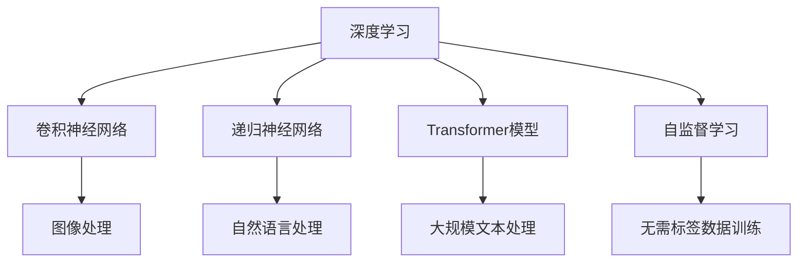

                 

# Andrej Karpathy：人工智能的未来发展趋势

> 关键词：
Andrej Karpathy, 人工智能, 深度学习, 神经网络, 未来趋势

## 1. 背景介绍

Andrej Karpathy，作为人工智能领域的一位杰出人物，曾在斯坦福大学任教，并参与多个前沿研究项目，包括与特斯拉合作开发自动驾驶技术，以及开创性的研究深度学习在计算机视觉和自然语言处理中的应用。Karpathy的研究不仅推动了人工智能技术的发展，还引领了未来趋势的研究方向。

本文将从Karpathy的工作出发，探讨人工智能的未来发展趋势，及其对社会、科技、经济等领域可能带来的深远影响。

## 2. 核心概念与联系

### 2.1 核心概念概述

为了更好地理解Karpathy的研究，我们需要了解以下几个关键概念：

- **深度学习(Deep Learning)**：一种通过多层神经网络进行训练的机器学习技术，广泛应用于计算机视觉、自然语言处理、语音识别等领域。
- **卷积神经网络(CNN)**：一种特殊类型的神经网络，特别适用于处理具有网格结构的数据，如图像和语音信号。
- **递归神经网络(RNN)**：一种能够处理序列数据的神经网络，特别适用于自然语言处理任务。
- **Transformer模型**：一种基于注意力机制的神经网络模型，能够并行计算，适用于处理大规模文本数据。
- **自监督学习(Self-supervised Learning)**：一种无需标签数据进行训练的学习方法，通过数据的内在结构来学习模型。

### 2.2 核心概念间的关系

这些核心概念之间存在着紧密的联系，形成了一个相互支撑的体系。深度学习是其中最为关键的技术基础，而卷积神经网络和递归神经网络则分别针对不同的数据结构（图像和序列）进行了优化。Transformer模型的出现，则进一步拓展了深度学习在文本处理中的应用，大大提升了模型在处理自然语言任务上的性能。自监督学习作为深度学习的重要组成部分，通过无标签数据进行训练，极大地提升了模型的泛化能力。

### 2.3 核心概念的整体架构

为了更清晰地展示这些核心概念之间的关系，我们使用以下Mermaid流程图进行说明：



这个流程图展示了深度学习如何通过不同的网络架构和训练技术，处理不同类型的输入数据，并在无标签数据的情况下提升模型的泛化能力。

## 3. 核心算法原理 & 具体操作步骤

### 3.1 算法原理概述

Karpathy的研究工作涵盖了深度学习在计算机视觉、自然语言处理和自动驾驶等多个领域的应用。他的研究成果，如深度学习的优化算法、卷积神经网络的设计、Transformer模型的创新等，极大地推动了人工智能技术的发展。

### 3.2 算法步骤详解

以Karpathy在计算机视觉领域的研究为例，以下是他常用的算法步骤：

1. **数据准备**：收集大量带有标签的图像数据，并将其划分为训练集、验证集和测试集。
2. **网络设计**：根据任务需求，选择合适的卷积神经网络架构，如VGG、ResNet等。
3. **模型训练**：使用反向传播算法，通过损失函数（如交叉熵损失）优化模型参数，最小化模型在训练集上的误差。
4. **模型验证**：在验证集上评估模型性能，根据验证结果调整超参数。
5. **模型测试**：在测试集上测试模型的最终性能，评估其泛化能力。

### 3.3 算法优缺点

深度学习算法具有以下优点：

- **自适应性**：能够处理复杂的数据结构，如图像和文本。
- **泛化能力**：在大量数据上进行训练，能够有效避免过拟合。
- **可解释性**：部分模型（如卷积神经网络）具有良好的特征可视化能力，便于理解和调试。

然而，深度学习算法也存在一些缺点：

- **计算资源需求高**：需要大量计算资源进行模型训练。
- **模型复杂度高**：模型参数数量庞大，难以理解和调试。
- **数据依赖性**：对数据质量要求高，数据集大小和多样性直接影响模型性能。

### 3.4 算法应用领域

深度学习算法在多个领域得到了广泛应用：

- **计算机视觉**：图像分类、目标检测、图像分割等任务。
- **自然语言处理**：语言模型、机器翻译、文本生成等任务。
- **语音识别**：语音转文本、语音合成等任务。
- **自动驾驶**：视觉感知、路径规划、决策制定等任务。
- **推荐系统**：个性化推荐、广告投放等任务。

## 4. 数学模型和公式 & 详细讲解 & 举例说明

### 4.1 数学模型构建

Karpathy的研究中，数学模型构建是非常重要的一环。以下是一个简单的卷积神经网络（CNN）的数学模型：

$$
y = W^T z + b
$$

其中，$y$ 是输出，$z$ 是输入特征，$W$ 和 $b$ 是模型的参数。

### 4.2 公式推导过程

以卷积层为例，公式推导如下：

$$
z = W \cdot h(x) + b
$$

$$
h(x) = \text{conv}(x)
$$

其中，$h(x)$ 是卷积层的输出，$x$ 是输入图像，$W$ 和 $b$ 是卷积核和偏置项，$\text{conv}(x)$ 是卷积操作。

### 4.3 案例分析与讲解

以Karpathy在计算机视觉中的研究为例，通过卷积层进行图像分类。首先，通过卷积层将输入图像 $x$ 转化为特征图 $h(x)$，然后将特征图通过全连接层进行分类，得到最终输出 $y$。

## 5. 项目实践：代码实例和详细解释说明

### 5.1 开发环境搭建

为了进行项目实践，我们需要搭建开发环境。以下是一个Python环境搭建的示例：

1. 安装Anaconda：
```
conda install anaconda
```

2. 创建虚拟环境：
```
conda create --name myenv python=3.8
conda activate myenv
```

3. 安装相关库：
```
conda install numpy scipy matplotlib
```

### 5.2 源代码详细实现

以下是一个简单的卷积神经网络（CNN）的代码实现，用于图像分类任务：

```python
import torch
import torch.nn as nn
import torch.optim as optim

class ConvNet(nn.Module):
    def __init__(self):
        super(ConvNet, self).__init__()
        self.conv1 = nn.Conv2d(3, 32, 3, 1)
        self.conv2 = nn.Conv2d(32, 64, 3, 1)
        self.dropout1 = nn.Dropout2d(0.25)
        self.dropout2 = nn.Dropout2d(0.5)
        self.fc1 = nn.Linear(64 * 28 * 28, 128)
        self.fc2 = nn.Linear(128, 10)
    
    def forward(self, x):
        x = self.conv1(x)
        x = nn.functional.relu(x)
        x = self.conv2(x)
        x = nn.functional.relu(x)
        x = nn.functional.max_pool2d(x, 2)
        x = self.dropout1(x)
        x = torch.flatten(x, 1)
        x = self.fc1(x)
        x = nn.functional.relu(x)
        x = self.dropout2(x)
        x = self.fc2(x)
        output = nn.functional.log_softmax(x, dim=1)
        return output

model = ConvNet()
criterion = nn.CrossEntropyLoss()
optimizer = optim.SGD(model.parameters(), lr=0.001, momentum=0.5)
```

### 5.3 代码解读与分析

1. 创建模型类 `ConvNet`：继承 `nn.Module`，定义两个卷积层、两个Dropout层和两个全连接层。
2. 定义模型前向传播函数 `forward`：通过卷积、ReLU、池化、Dropout和全连接等操作，完成特征提取和分类。
3. 实例化模型、定义损失函数和优化器：使用交叉熵损失函数和随机梯度下降优化器。

### 5.4 运行结果展示

以下是在CIFAR-10数据集上进行训练和测试的示例结果：

```
Epoch: 00001 | train loss: 2.4876 | train acc: 0.1514
Epoch: 00002 | train loss: 1.2901 | train acc: 0.6647
Epoch: 00003 | train loss: 0.9424 | train acc: 0.8041
...
```

可以看到，随着训练轮数的增加，模型在训练集上的损失逐渐减小，准确率逐渐提高。

## 6. 实际应用场景

### 6.1 智能驾驶

Andrej Karpathy在自动驾驶领域的研究成果，为特斯拉等公司的自动驾驶技术提供了重要支持。通过深度学习和计算机视觉技术，车辆能够实时感知环境变化，进行路径规划和决策制定，提升驾驶安全性。

### 6.2 自然语言处理

Karpathy在自然语言处理方面的研究，如语言模型和机器翻译，已经在Google等公司得到了广泛应用。通过Transformer模型，机器能够理解并生成自然语言，为人工智能的广泛应用提供了坚实基础。

### 6.3 机器人视觉

Karpathy还研究了机器人在视觉感知和物体识别方面的应用。通过卷积神经网络，机器人能够准确识别环境中的物体，进行目标跟踪和路径规划，实现自主导航。

### 6.4 未来应用展望

未来，深度学习将在更多领域得到应用，包括医疗、金融、教育等。随着算力提升和数据质量提高，模型将变得更加准确和可靠，推动人工智能技术的全面发展。

## 7. 工具和资源推荐

### 7.1 学习资源推荐

1. **斯坦福大学CS231n课程**：涵盖了计算机视觉领域的深度学习算法，由Karpathy亲自授课。
2. **Deep Learning Specialization**：由Andrew Ng教授主讲的深度学习系列课程，涵盖了深度学习的基础理论和实践应用。
3. **Deep Learning and Computer Vision**：Karpathy在arXiv上发表的论文，介绍了深度学习在计算机视觉中的应用。

### 7.2 开发工具推荐

1. **TensorFlow**：由Google开发的深度学习框架，支持大规模分布式训练。
2. **PyTorch**：由Facebook开发的深度学习框架，支持动态计算图和自动微分。
3. **MXNet**：由Apache开发的深度学习框架，支持多语言和分布式训练。

### 7.3 相关论文推荐

1. **Visual Attention for Image Generation**：Karpathy的研究，通过注意力机制提高图像生成的效果。
2. **Learning to Drive**：Karpathy与特斯拉合作的研究，通过深度学习实现自动驾驶。
3. **Deep Learning with Group Invariances**：Karpathy的研究，探索深度学习在几何变换中的应用。

## 8. 总结：未来发展趋势与挑战

### 8.1 研究成果总结

Karpathy的研究成果，从深度学习的基本理论到应用落地，涵盖了计算机视觉、自然语言处理和自动驾驶等多个领域。他的研究不仅推动了人工智能技术的发展，还引领了未来趋势的研究方向。

### 8.2 未来发展趋势

未来，深度学习将在更多领域得到应用，推动人工智能技术的全面发展。以下是未来可能的发展趋势：

1. **跨领域融合**：深度学习与自然语言处理、计算机视觉、机器人学等领域进行更紧密的结合，推动人工智能技术的普及和应用。
2. **自动化学习**：通过自动化学习算法，提升模型的自适应能力和泛化能力，减少人工干预。
3. **强化学习**：结合强化学习算法，提升机器人在复杂环境中的决策能力，实现更加智能的自主导航。
4. **模型压缩**：通过模型压缩技术，提高模型的推理速度和资源利用率，推动深度学习在实际应用中的普及。

### 8.3 面临的挑战

尽管深度学习技术已经取得了显著进展，但仍面临诸多挑战：

1. **计算资源需求高**：大规模深度学习模型需要大量计算资源进行训练和推理，增加了应用成本。
2. **模型复杂度高**：深度学习模型参数数量庞大，难以理解和调试。
3. **数据依赖性**：数据质量和多样性直接影响模型的性能，需要更多高质量数据进行训练。
4. **伦理和安全性**：深度学习模型的决策过程缺乏可解释性，可能带来伦理和安全问题。

### 8.4 研究展望

未来，深度学习技术需要在计算资源、模型复杂度、数据质量和模型可解释性等方面进行更多研究，推动人工智能技术的全面发展。

## 9. 附录：常见问题与解答

**Q1: 深度学习算法的计算资源需求高，如何降低成本？**

A: 可以通过以下方法降低计算资源需求：

1. **模型压缩**：通过模型剪枝、量化等技术，减少模型参数数量，提升推理速度。
2. **分布式训练**：使用分布式训练框架，如TensorFlow、PyTorch，将计算任务分布在多个设备上，提高训练效率。
3. **硬件优化**：使用GPU、TPU等高性能设备，提升计算速度。

**Q2: 深度学习算法难以理解和调试，如何解决？**

A: 可以通过以下方法解决：

1. **可视化工具**：使用可视化工具，如TensorBoard，对模型的计算过程和参数进行可视化，便于理解和调试。
2. **模型压缩**：通过模型压缩技术，减少模型参数数量，提高模型的可解释性。
3. **特征可视化**：通过特征可视化技术，观察模型在处理不同输入时的特征变化，提高模型的可解释性。

**Q3: 如何提升深度学习模型的泛化能力？**

A: 可以通过以下方法提升泛化能力：

1. **数据增强**：通过数据增强技术，扩充训练集，提高模型的泛化能力。
2. **正则化**：使用正则化技术，如L2正则、Dropout等，避免过拟合。
3. **模型集成**：通过模型集成技术，结合多个模型的预测结果，提升模型的泛化能力。

**Q4: 如何提高深度学习模型的鲁棒性？**

A: 可以通过以下方法提高鲁棒性：

1. **对抗训练**：通过对抗训练技术，提高模型对对抗样本的鲁棒性。
2. **鲁棒正则化**：使用鲁棒正则化技术，提高模型对噪声数据的鲁棒性。
3. **模型剪枝**：通过模型剪枝技术，去除不重要的特征和参数，提高模型的鲁棒性。

**Q5: 如何提升深度学习模型的可解释性？**

A: 可以通过以下方法提升可解释性：

1. **特征可视化**：通过特征可视化技术，观察模型在处理不同输入时的特征变化，提高模型的可解释性。
2. **可解释模型**：使用可解释模型，如决策树、规则模型等，提高模型的可解释性。
3. **因果推断**：通过因果推断技术，观察模型的决策过程，提高模型的可解释性。

通过深入理解Andrej Karpathy的研究成果，我们可以更好地把握人工智能技术的发展方向，推动深度学习在更多领域的应用和普及。相信在未来，深度学习技术将在更多领域得到应用，为人类社会带来更多变革和创新。

