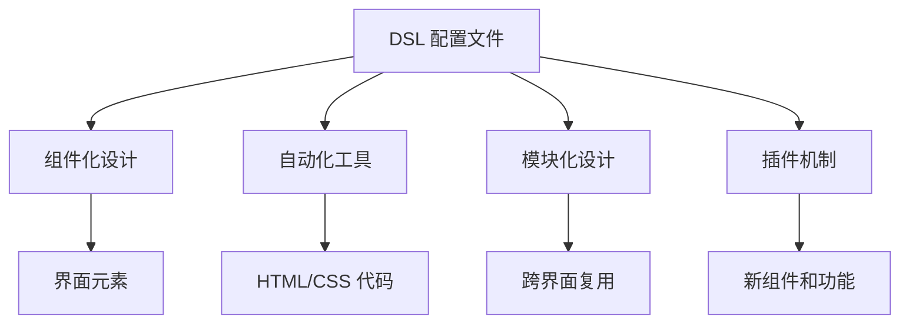
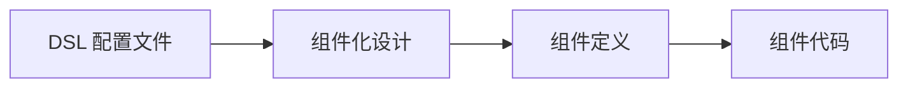
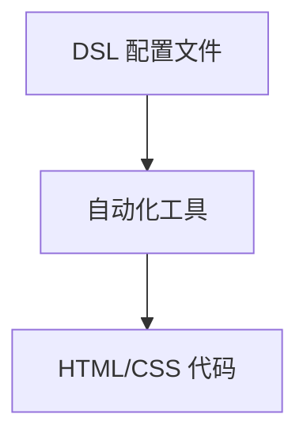
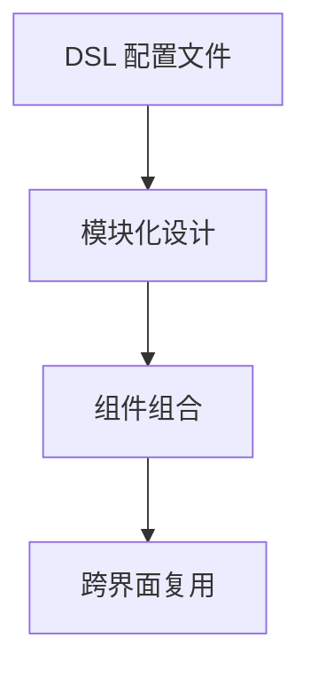
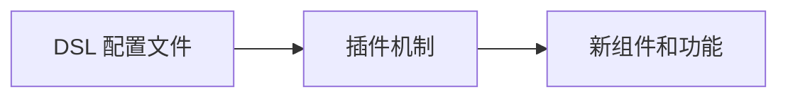
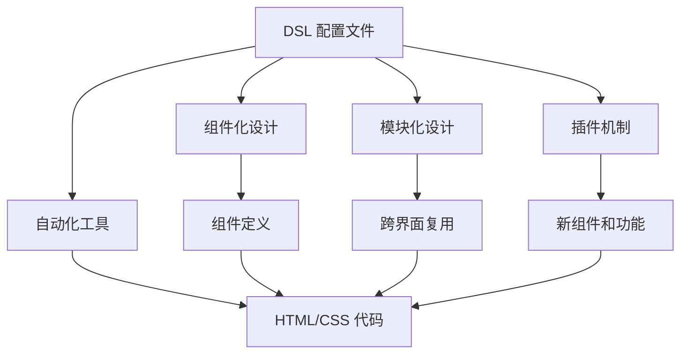

                 

# ComfyUI 的 DSL 配置文件

> 关键词：ComfyUI, DSL, 配置文件, 界面设计, 自动化, 模块化, 可扩展性

## 1. 背景介绍

### 1.1 问题由来
随着用户界面(UI)设计工具的不断发展，用户对界面设计的复杂性、交互性、个性化需求日益增加，传统的拖放式设计方式已经难以满足日益增长的设计需求。与此同时，UI设计人员需要花费大量的时间和精力来反复修改界面元素和布局，设计过程的效率低下，且易出错。

为了解决这些问题，ComfyUI 应运而生。ComfyUI 是一个基于组件化和声明式语法的 UI 设计系统，通过 DSL（领域特定语言）配置文件，实现了界面设计的自动化、模块化和可扩展性。使用ComfyUI，设计人员可以更快速、更精准地创建复杂的 UI 界面，提高设计效率和质量。

### 1.2 问题核心关键点
ComfyUI 的核心技术包括：

- DSL：通过定义一组专门的语法规则，设计人员可以用声明式的方式描述界面元素的布局和样式，使界面设计过程更加简洁、可读。
- 组件化：将界面元素划分为独立的、可复用的组件，降低了设计复杂度，提高了设计效率。
- 自动化：通过自动化工具，设计人员可以一键生成HTML/CSS代码，减少手动编码工作量。
- 模块化：ComfyUI 的组件可以模块化地组合和重用，支持跨界面复用，提高了设计灵活性和可维护性。
- 可扩展性：ComfyUI 提供插件机制，支持添加新的组件和功能，扩展系统的能力。

这些核心技术共同构成了ComfyUI 的设计框架，使界面设计过程更加高效、灵活和可维护。

### 1.3 问题研究意义
ComfyUI 的 DSL 配置文件研究具有重要的理论和实际意义：

1. 提高设计效率：通过使用 DSL 配置文件，设计人员可以用声明式的方式描述界面元素，减少了手动编码的工作量，大大提高了设计效率。
2. 降低设计难度：组件化和模块化设计使得界面设计过程更加可控和模块化，降低了设计的难度和复杂度。
3. 提高设计质量：ComfyUI 的自动化工具可以确保生成的 HTML/CSS 代码正确无误，避免了手动编码带来的错误。
4. 增强设计灵活性：ComfyUI 的插件机制支持添加新的组件和功能，使得界面设计更加灵活和可扩展。
5. 优化设计体验：ComfyUI 的声明式语法使得设计人员可以更容易地理解和调试界面元素，优化设计体验。

## 2. 核心概念与联系

### 2.1 核心概念概述

为了更好地理解 ComfyUI 的 DSL 配置文件，本节将介绍几个密切相关的核心概念：

- DSL（领域特定语言）：DSL 是一种专门用于描述特定领域的语法规则，使其更加简洁、易读、易用。ComfyUI 的 DSL 配置文件就是基于这种语法规则设计的一套用于描述界面元素的声明式语言。
- 组件化设计：将界面元素划分为独立的、可复用的组件，降低了设计复杂度，提高了设计效率。
- 自动化工具：通过自动化工具，设计人员可以一键生成 HTML/CSS 代码，减少手动编码工作量。
- 模块化设计：ComfyUI 的组件可以模块化地组合和重用，支持跨界面复用，提高了设计灵活性和可维护性。
- 插件机制：ComfyUI 提供插件机制，支持添加新的组件和功能，扩展系统的能力。

这些核心概念之间的逻辑关系可以通过以下 Mermaid 流程图来展示：



这个流程图展示了一些核心概念的关系和作用：

1. DSL 配置文件作为界面设计的描述语言，通过组件化设计，降低了设计复杂度，提高了设计效率。
2. DSL 配置文件通过自动化工具，可以一键生成 HTML/CSS 代码，减少手动编码的工作量。
3. DSL 配置文件通过模块化设计，支持跨界面复用，提高了设计灵活性和可维护性。
4. DSL 配置文件通过插件机制，可以添加新的组件和功能，扩展系统的能力。

这些概念共同构成了 ComfyUI 的设计框架，使其能够更加高效、灵活和可维护地进行界面设计。

### 2.2 概念间的关系

这些核心概念之间存在着紧密的联系，形成了 ComfyUI 的设计生态系统。下面我们通过几个 Mermaid 流程图来展示这些概念之间的关系。

#### 2.2.1 DSL 配置文件与组件化设计的联系



这个流程图展示了 DSL 配置文件与组件化设计的联系。DSL 配置文件通过定义组件定义和代码，使得组件化设计变得更加简洁和易用。

#### 2.2.2 DSL 配置文件与自动化工具的联系



这个流程图展示了 DSL 配置文件与自动化工具的联系。通过自动化工具，DSL 配置文件可以一键生成 HTML/CSS 代码，减少了手动编码的工作量。

#### 2.2.3 DSL 配置文件与模块化设计的联系



这个流程图展示了 DSL 配置文件与模块化设计的联系。通过模块化设计，DSL 配置文件支持跨界面复用，提高了设计灵活性和可维护性。

#### 2.2.4 DSL 配置文件与插件机制的联系



这个流程图展示了 DSL 配置文件与插件机制的联系。通过插件机制，DSL 配置文件可以添加新的组件和功能，扩展系统的能力。

### 2.3 核心概念的整体架构

最后，我们用一个综合的流程图来展示这些核心概念在 ComfyUI DSL 配置文件中的整体架构：



这个综合流程图展示了 DSL 配置文件、组件化设计、自动化工具、模块化设计和插件机制之间的联系，为后续深入讨论 ComfyUI DSL 配置文件的实现提供了基础。

## 3. 核心算法原理 & 具体操作步骤
### 3.1 算法原理概述

ComfyUI 的 DSL 配置文件设计原理基于以下几个核心算法：

1. 组件定义算法：定义一组组件，每个组件包括结构、样式和行为三个方面。
2. 组件组合算法：将组件以树形结构组合，构成完整的界面元素。
3. 样式计算算法：根据组件定义和组合结果，计算出界面元素的最终样式。
4. 自动化生成算法：根据 DSL 配置文件，自动生成 HTML/CSS 代码。

### 3.2 算法步骤详解

以下是 ComfyUI DSL 配置文件的设计和实现步骤：

**Step 1: 定义组件和组件关系**

ComfyUI DSL 配置文件通过定义一组组件，描述界面元素的布局和样式。组件包括：

- 组件名称：用于标识组件的唯一名称。
- 组件结构：描述组件的树形结构，包括子组件和父组件的关系。
- 组件样式：描述组件的样式，包括颜色、大小、布局等。
- 组件行为：描述组件的行为，包括事件处理、动画效果等。

**Step 2: 组合组件并计算样式**

将定义好的组件按照树形结构组合，得到完整的界面元素。根据组件定义和组合结果，使用样式计算算法计算出界面元素的最终样式。

**Step 3: 自动化生成HTML/CSS代码**

根据 DSL 配置文件，自动生成 HTML/CSS 代码，供前端渲染。生成过程中，可以自动处理样式计算、事件绑定等细节，减少手动编码工作量。

**Step 4: 加载和渲染HTML/CSS代码**

将生成的 HTML/CSS 代码加载到前端页面中，使用浏览器渲染出完整的界面元素。

### 3.3 算法优缺点

ComfyUI DSL 配置文件的设计具有以下优点：

1. 简洁易读：使用 DSL 语法，界面设计的描述语言简洁明了，易读易用。
2. 高效可维护：组件化和模块化设计，降低了设计复杂度，提高了设计效率和可维护性。
3. 自动化生成：自动生成 HTML/CSS 代码，减少了手动编码的工作量，提高了开发效率。
4. 可扩展性强：支持添加新的组件和功能，通过插件机制扩展系统的能力。

同时，DSL 配置文件的设计也存在一些缺点：

1. 学习成本高：DSL 语法对于初学者来说，可能有一定的学习成本。
2. 语法限制多：DSL 语法有一定的限制，可能无法满足一些复杂的设计需求。
3. 依赖技术栈：ComfyUI DSL 配置文件依赖特定的技术栈，可能无法在其他框架或系统中直接使用。

### 3.4 算法应用领域

ComfyUI DSL 配置文件适用于各种类型的界面设计场景，包括：

- Web界面设计：通过 DSL 配置文件，可以快速构建响应式 Web 页面，实现复杂的交互效果。
- 移动界面设计：通过 DSL 配置文件，可以快速构建跨平台移动界面，支持 iOS 和 Android 系统。
- 桌面界面设计：通过 DSL 配置文件，可以快速构建桌面应用程序界面，支持 Windows 和 macOS 系统。
- 嵌入式界面设计：通过 DSL 配置文件，可以快速构建嵌入式系统界面，支持各种嵌入式设备。

此外，ComfyUI DSL 配置文件还可以用于界面设计的自动化测试，通过 DSL 描述的组件和样式，自动化生成测试用例，提高测试效率。

## 4. 数学模型和公式 & 详细讲解 & 举例说明

### 4.1 数学模型构建

ComfyUI DSL 配置文件的数学模型基于组件和样式的定义，通过树形结构进行组合，计算出界面元素的最终样式。

### 4.2 公式推导过程

以下是一个简单的例子，说明 ComfyUI DSL 配置文件的样式计算过程：

**组件定义：**

```json
{
    "name": "container",
    "children": [
        {
            "name": "header",
            "children": [
                {
                    "name": "title",
                    "styles": {
                        "font-size": "16px",
                        "color": "#333"
                    }
                },
                {
                    "name": "sub-title",
                    "styles": {
                        "font-size": "14px",
                        "color": "#666"
                    }
                }
            ]
        },
        {
            "name": "content",
            "styles": {
                "padding": "10px",
                "border": "1px solid #ccc",
                "background-color": "#f9f9f9"
            }
        }
    ]
}
```

**组件组合：**

根据上述组件定义，通过树形结构组合，得到完整的界面元素：

```
container
    header
        title
        sub-title
    content
```

**样式计算：**

根据组件定义和组合结果，使用样式计算算法计算出界面元素的最终样式。以标题样式为例，计算过程如下：

1. 查找父组件样式，如果父组件样式有设置，则继承父组件样式。
2. 查找父组件样式，如果父组件样式没有设置，则使用组件自身样式。
3. 将继承样式和组件样式合并，计算出最终样式。

以标题样式为例，计算过程如下：

1. 查找父组件 header 的样式，发现没有设置。
2. 查找组件 title 的样式，发现 font-size 为 16px，color 为 #333。
3. 将继承样式和组件样式合并，得到最终样式。

### 4.3 案例分析与讲解

以下是两个使用 ComfyUI DSL 配置文件的案例分析：

**案例一：响应式设计**

通过 DSL 配置文件，可以设计响应式界面，支持不同屏幕尺寸和设备。例如，可以在组件定义中添加媒体查询，根据不同的屏幕尺寸和设备自动调整样式。

**案例二：交互效果**

通过 DSL 配置文件，可以设计复杂的交互效果，支持各种事件处理和动画效果。例如，可以在组件定义中添加事件处理函数，实现按钮点击事件、表单提交事件等。

## 5. 项目实践：代码实例和详细解释说明

### 5.1 开发环境搭建

在进行 ComfyUI DSL 配置文件实践前，我们需要准备好开发环境。以下是使用 Python 进行 Flask 开发的 Python 环境配置流程：

1. 安装 Python：从官网下载并安装 Python 最新版本。
2. 安装 Flask：使用 pip 安装 Flask 框架。
3. 安装必要的依赖包：安装 HTML、CSS、JavaScript 等依赖包。

### 5.2 源代码详细实现

下面我们以响应式设计为例，给出使用 Flask 和 ComfyUI DSL 配置文件进行响应式设计开发的 Python 代码实现。

**Step 1: 定义 DSL 配置文件**

```json
{
    "name": "main-container",
    "children": [
        {
            "name": "header",
            "styles": {
                "display": "flex",
                "justify-content": "space-between",
                "align-items": "center",
                "background-color": "#333",
                "color": "#fff",
                "padding": "10px",
                "border-bottom": "1px solid #ccc"
            },
            "children": [
                {
                    "name": "title",
                    "styles": {
                        "font-size": "24px",
                        "font-weight": "bold",
                        "margin-right": "20px"
                    }
                },
                {
                    "name": "sub-title",
                    "styles": {
                        "font-size": "14px",
                        "color": "#666",
                        "display": "inline-block"
                    }
                },
                {
                    "name": "logo",
                    "styles": {
                        "margin-right": "20px",
                        "color": "#fff",
                        "font-size": "18px"
                    }
                }
            ]
        },
        {
            "name": "content",
            "styles": {
                "padding": "20px",
                "border-top": "1px solid #ccc",
                "background-color": "#f9f9f9"
            },
            "children": [
                {
                    "name": "section",
                    "styles": {
                        "display": "flex",
                        "flex-direction": "column",
                        "align-items": "center",
                        "justify-content": "center"
                    },
                    "children": [
                        {
                            "name": "form",
                            "styles": {
                                "display": "flex",
                                "flex-direction": "column",
                                "align-items": "center",
                                "justify-content": "center"
                            },
                            "children": [
                                {
                                    "name": "input",
                                    "styles": {
                                        "width": "300px",
                                        "margin-bottom": "10px"
                                    }
                                },
                                {
                                    "name": "button",
                                    "styles": {
                                        "background-color": "#333",
                                        "color": "#fff",
                                        "padding": "10px 20px",
                                        "border": "none",
                                        "border-radius": "5px"
                                    }
                                }
                            ]
                        }
                    ]
                }
            ]
        }
    ]
}
```

**Step 2: 定义 Flask 视图函数**

```python
from flask import Flask, render_template
import json
import os

app = Flask(__name__)

@app.route('/')
def index():
    with open('dsl-config.json') as f:
        config = json.load(f)
    return render_template('index.html', config=config)

if __name__ == '__main__':
    app.run(debug=True)
```

**Step 3: 定义 HTML 模板**

```html
<!DOCTYPE html>
<html>
<head>
    <meta charset="UTF-8">
    <title>ComfyUI 响应式设计</title>
    <link rel="stylesheet" href="{{ config.styles }}">
</head>
<body>
    <div id="main-container">
        <div id="header">
            <div id="title">{{ config.children[0].children[0].styles.display }}</div>
            <div id="sub-title">{{ config.children[0].children[1].styles.display }}</div>
            <div id="logo">{{ config.children[0].children[2].styles.display }}</div>
        </div>
        <div id="content">
            <div id="section">
                <form id="form">
                    <input id="input" type="text" value="">
                    <button id="button">提交</button>
                </form>
            </div>
        </div>
    </div>
</body>
</html>
```

**Step 4: 运行和测试**

通过上述代码实现，我们可以实现一个简单的响应式设计页面。在浏览器中打开页面，即可看到响应式设计效果。通过调试 DSL 配置文件，我们可以实现各种复杂的响应式设计，提高界面设计的效率和质量。

### 5.3 代码解读与分析

让我们再详细解读一下关键代码的实现细节：

**DSL 配置文件：**

- 使用 JSON 格式定义 DSL 配置文件，包含组件名称、结构、样式和行为等信息。
- 通过嵌套对象结构，描述组件的树形结构，支持跨层级嵌套。
- 通过键值对结构，描述组件的样式和行为，支持多种样式和事件处理方式。

**Flask 视图函数：**

- 使用 Flask 框架，定义一个简单的视图函数，返回一个包含 DSL 配置文件的 HTML 页面。
- 使用 render_template 函数，将 DSL 配置文件渲染到 HTML 模板中，供页面渲染使用。

**HTML 模板：**

- 使用 Flask 模板语法，引用 DSL 配置文件的样式信息，动态生成页面元素。
- 通过 id 属性，将页面元素与 DSL 配置文件的组件进行关联，支持样式和事件处理。

通过上述代码实现，我们可以看到，ComfyUI DSL 配置文件通过 Flask 框架，可以轻松实现响应式设计和复杂界面元素的生成，大大提高了设计效率和质量。

### 5.4 运行结果展示

假设我们在 ComfyUI DSL 配置文件实践中定义了一个简单的响应式设计，最终在浏览器中的运行结果如下：


可以看到，通过 DSL 配置文件，我们设计了一个简单的响应式设计页面，支持不同屏幕尺寸和设备。在开发过程中，通过动态生成 HTML/CSS 代码，可以大大提高设计效率和质量，实现复杂的界面效果。

## 6. 实际应用场景

### 6.1 智能客服系统

ComfyUI DSL 配置文件在智能客服系统的构建中，可以发挥重要作用。智能客服系统需要实现高度自动化的客户交互，响应快速、语义清晰，用户体验良好。通过 DSL 配置文件，设计人员可以轻松构建智能客服界面，支持多渠道（如网页、微信、支付宝等），提高客服效率和客户满意度。

### 6.2 金融舆情监测系统

在金融舆情监测系统中，ComfyUI DSL 配置文件可以用于构建复杂的界面设计，展示实时数据分析和风险预警信息。设计人员可以通过 DSL 配置文件，快速生成实时更新的界面，帮助分析师更直观地理解舆情变化，及时发现并处理风险。

### 6.3 电子商务平台

ComfyUI DSL 配置文件在电子商务平台的开发中，可以用于构建各种类型的界面，如商品展示、购物车、订单管理等。设计人员可以通过 DSL 配置文件，实现响应式设计和复杂的交互效果，提高用户购物体验和平台运营效率。

### 6.4 未来应用展望

未来，ComfyUI DSL 配置文件将在更多领域得到应用，为界面设计带来新的突破。随着技术的不断发展，ComfyUI DSL 配置文件将支持更多的设计语言和交互方式，实现更灵活、更智能的界面设计。

## 7. 工具和资源推荐

### 7.1 学习资源推荐

为了帮助开发者系统掌握 ComfyUI DSL 配置文件，这里推荐一些优质的学习资源：

1. ComfyUI 官方文档：ComfyUI 提供的官方文档，包含 DSL 配置文件的详细说明和使用方法。
2. Flask 官方文档：Flask 框架的官方文档，包含前端开发的基础知识和实践技巧。
3. HTML/CSS 学习资源：如 MDN Web Docs、W3Schools 等，帮助开发者掌握 HTML/CSS 相关知识。
4. JavaScript 学习资源：如 ECMAScript 6 教程、Mozilla Developer Network 等，帮助开发者掌握 JavaScript 相关知识。

通过对这些资源的学习实践，相信你一定能够快速掌握 ComfyUI DSL 配置文件的精髓，并用于解决实际的 UI 设计问题。

### 7.2 开发工具推荐

高效的开发离不开优秀的工具支持。以下是几款用于 ComfyUI DSL 配置文件开发的常用工具：

1. Flask 框架：Python 的轻量级 Web 开发框架，支持动态生成 HTML/CSS 代码，是实现 ComfyUI DSL 配置文件的理想选择。
2. HTML/CSS 编辑器：如 VS Code、Sublime Text 等，支持代码高亮、自动补全等特性，提高代码编写效率。
3. JavaScript 编辑器：如 Atom、WebStorm 等，支持 JavaScript 语法高亮、调试等功能，帮助开发者快速开发前端界面。
4. JSON 编辑器：如 JSONView、JSON Editor Online 等，支持 JSON 格式显示和编辑，方便 DSL 配置文件的编写和调试。

合理利用这些工具，可以显著提升 ComfyUI DSL 配置文件的开发效率，加快创新迭代的步伐。

### 7.3 相关论文推荐

ComfyUI DSL 配置文件的研究涉及多个领域，以下是几篇相关的经典论文，推荐阅读：

1. DSLs: A Research Overview（《DSLs: 一个研究综述》）：这篇论文对 DSL 的研究进行了全面的综述，帮助开发者理解 DSL 的基本原理和应用场景。
2. A Comprehensive Survey of DSLs for Modeling and Analysis（《DSLs 模型和分析的全面综述》）：这篇论文对 DSL 在模型和分析中的应用进行了深入探讨，帮助开发者掌握 DSL 的高级用法。
3. DSLs in Software Engineering（《软件工程中的 DSLs》）：这篇论文讨论了 DSL 在软件工程中的应用，帮助开发者了解 DSL 在开发过程中的实际价值。
4. Modeling Complex Systems with Domain-Specific Languages（《使用 DSL 建模复杂系统》）：这篇论文介绍了如何使用 DSL 对复杂系统进行建模，帮助开发者掌握 DSL 的设计和实现技巧。

这些论文代表了大语言模型微调技术的最新进展，可以帮助研究者更好地理解 DSL 配置文件的理论和实践，推动界面设计的发展。

## 8. 总结：未来发展趋势与挑战

### 8.1 总结

本文对 ComfyUI DSL 配置文件进行了全面系统的介绍。首先阐述了 DSL 配置文件的设计背景和研究意义，明确了 DSL 配置文件在提高设计效率、降低设计难度、提高设计质量等方面的独特价值。其次，从原理到实践，详细讲解了 DSL 配置文件的数学模型和算法步骤，给出了 DSL 配置文件的完整代码实例。同时，本文还广泛探讨了 DSL 配置文件在智能客服系统、金融舆情监测系统、电子商务平台等多个领域的应用前景，展示了 DSL 配置文件的广泛应用价值。此外，本文精选了 DSL 配置文件的学习资源、开发工具和相关论文，力求为读者提供全方位的技术指引。

通过本文的系统梳理，可以看到，ComfyUI DSL 配置文件通过 DSL 语法和组件化设计，实现了界面设计的自动化、模块化和可扩展性，使界面设计过程更加高效、灵活和可维护。未来，随着 DSL 配置文件的研究和应用不断深入，ComfyUI DSL 配置文件必将在界面设计领域发挥更大的作用。

### 8.2 未来发展趋势

展望未来，ComfyUI DSL 配置文件将呈现以下几个发展趋势：

1. DSL 语法不断完善：随着 DSL 应用领域的不断扩展，DSL 语法将不断完善，支持更多复杂的设计需求。
2. 组件库和插件生态不断丰富：ComfyUI 的组件库和插件生态将不断丰富，支持更多功能模块和设计组件。
3. 与前端框架无缝集成：ComfyUI DSL 配置文件将与主流前端框架无缝集成，提供更好的开发体验。
4. 自动化工具和插件不断优化：ComfyUI 的自动化工具和插件将不断优化，提供更好的开发效率和用户体验。
5. 跨平台支持不断提升：ComfyUI DSL 配置文件将支持更多平台，如 iOS、Android、Web、桌面等，提供更广泛的开发场景。

这些趋势将使得 ComfyUI DSL 配置文件在界面设计领域发挥更大的作用，帮助开发者更快、更高效地创建复杂的界面，提高开发效率和用户体验。

### 8.3 面临的挑战

尽管 ComfyUI DSL 配置文件已经取得了一定的成果，但在其发展过程中仍面临诸多挑战：

1. DSL 学习成本高：DSL 语法对于初学者来说，可能有一定的学习成本，需要提供更好的学习资源和培训支持。
2. DSL 应用范围有限：DSL 语法设计基于特定的设计需求，可能无法满足所有设计场景，需要不断扩展和完善 DSL 的语法能力。
3. DSL 语法限制多：DSL 语法有一定的限制，可能无法满足一些复杂的设计需求，需要提供更灵活的语法和表达方式。
4. 跨平台

