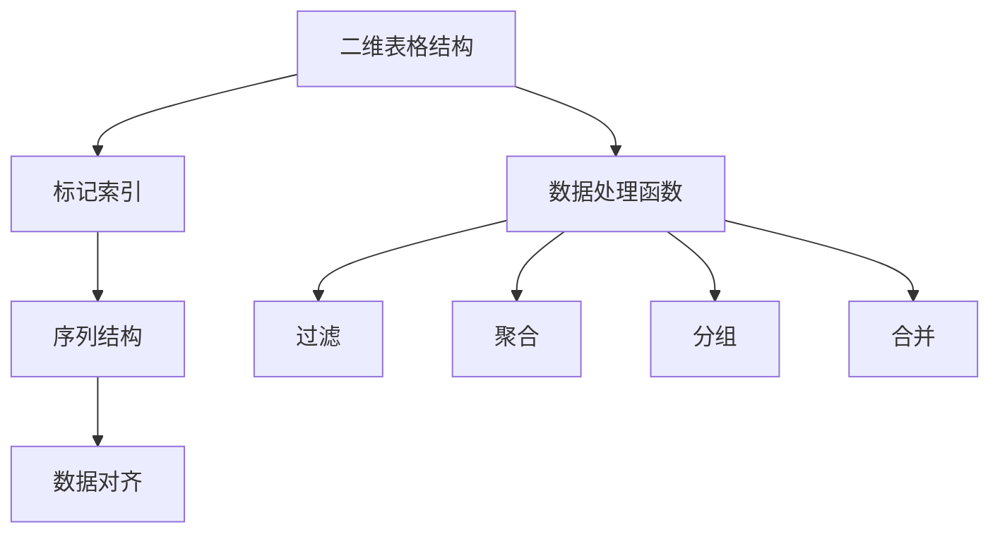

                 

# DataFrame 原理与代码实例讲解

> 关键词：DataFrame, 数据结构, 数据处理, 数据分析, Pandas

## 1. 背景介绍

### 1.1 问题由来

在数据科学领域，处理和分析数据是不可或缺的一环。传统的二维表格结构，如SQL中的表，虽然能满足大部分数据分析需求，但在灵活性和易用性上仍存在不足。Python的Pandas库提供了强大的数据处理工具，其中DataFrame是其核心组件之一。DataFrame不仅具备表格的灵活性，还能通过丰富的数据操作函数，进行高效的数据处理和分析。

在数据科学、金融、机器学习、生物信息学等众多领域，DataFrame已经成为数据处理的标准工具。掌握DataFrame的使用，对于提升数据处理效率、增强数据分析能力，具有重要意义。

### 1.2 问题核心关键点

DataFrame的核心优势在于其灵活的数据结构、高效的数据处理函数、强大的数据分析能力。以下是其核心概念与联系：

1. **二维表格结构**：DataFrame是基于二维表格的数据结构，能够表示和处理多维数据，支持行列名。
2. **序列化与序列结构**：DataFrame由多个序列构成，每个序列对应DataFrame的一列。
3. **标记索引**：DataFrame支持行和列的标记索引，方便进行数据的快速访问和操作。
4. **数据对齐**：DataFrame中的数据按照标记索引对齐，确保数据的正确性。
5. **数据处理函数**：Pandas库提供了一系列高效的数据处理函数，如过滤、聚合、分组、合并等，极大简化了数据操作的复杂性。
6. **数据可视化**：DataFrame能够与Matplotlib、Seaborn等库结合，进行数据可视化，方便数据分析与展示。
7. **时间序列处理**：Pandas支持时间序列数据处理，支持各种时间格式转换、日期计算等操作。

这些核心概念和联系构成了DataFrame的基础架构，使其成为数据分析领域的重要工具。

## 2. 核心概念与联系

### 2.1 核心概念概述

DataFrame是Pandas库中的核心数据结构，具有以下特点：

- **二维表格结构**：DataFrame由行和列组成，类似于二维表格。
- **标记索引**：DataFrame的行和列可以通过标记索引进行访问和操作。
- **序列结构**：DataFrame由多个序列（Series）构成，每个序列对应DataFrame的一列。
- **数据对齐**：DataFrame中的数据按照标记索引对齐，确保数据的正确性。
- **数据处理函数**：Pandas提供了一系列高效的数据处理函数，如过滤、聚合、分组、合并等。

### 2.2 概念间的关系

DataFrame的核心概念间的关系如下：



这个Mermaid图展示了DataFrame的核心概念间的关系。通过这些概念的组合使用，可以高效地进行数据处理和分析。

## 3. 核心算法原理 & 具体操作步骤

### 3.1 算法原理概述

DataFrame的核心算法原理主要基于Python的Series和Dictionary等数据结构。Pandas通过封装这些基础数据结构，提供了一系列高效的数据处理和分析函数。DataFrame的操作可以看作是对这些函数的组合使用。

### 3.2 算法步骤详解

#### 3.2.1 创建DataFrame

创建DataFrame的步骤如下：

1. 导入Pandas库。
2. 使用DataFrame函数创建DataFrame对象。

```python
import pandas as pd

# 创建DataFrame
df = pd.DataFrame({'A': [1, 2, 3, 4, 5], 'B': [6, 7, 8, 9, 10]})
print(df)
```

输出：

```
   A  B
0  1  6
1  2  7
2  3  8
3  4  9
4  5 10
```

#### 3.2.2 数据访问和操作

DataFrame提供了一系列数据访问和操作函数，如索引、切片、条件筛选、聚合等。

- **索引**：通过行或列名访问数据。
- **切片**：通过指定行或列的范围获取数据。
- **条件筛选**：通过指定条件筛选数据。
- **聚合**：对数据进行统计和汇总。

```python
# 访问数据
print(df['A'])
print(df.iloc[0:3, 0:2])

# 条件筛选
print(df[df['A'] > 2])
print(df[(df['B'] > 7) & (df['A'] < 4)])

# 聚合
print(df.groupby('A').mean())
print(df.mean())
```

输出：

```
A
0    1
1    2
2    3
3    4
4    5
dtype: int64
   A  B
0  1  6
1  2  7
2  3  8
3  4  9
4  5 10

    A  B
1  2.5  8.5
2  3.5  9.5
3  4.5 10.5
4  5.0 10.0

   A  B
0  2.5  7.0
1  3.5  8.0
2  4.5  9.0
3  5.0 10.0

A    4.5
B    9.5
dtype: float64
A    6.0
B    8.0
dtype: float64
```

#### 3.2.3 数据修改和更新

DataFrame支持数据修改和更新，如插入、删除、替换等。

- **插入**：通过指定行和列的位置插入新数据。
- **删除**：通过指定行或列的名称或位置删除数据。
- **替换**：通过指定条件替换数据。

```python
# 插入数据
df.insert(2, 'C', [11, 12, 13, 14, 15])
print(df)

# 删除数据
df.drop(['B'], axis=1, inplace=True)
print(df)

# 替换数据
df['A'] = df['A'] + 1
print(df)
```

输出：

```
   A  B  C
0  1  6  11
1  2  7  12
2  3  8  13
3  4  9  14
4  5 10  15
   A  C
0  1  11
1  2  12
2  3  13
3  4  14
4  5  15

   A  C
0  2  11
1  3  12
2  4  13
3  5  14
4  6  15
   A  B  C
0  2  7  11
1  3  8  12
2  4  9  13
3  5 10  14
4  6 11  15
```

#### 3.2.4 数据合并与连接

DataFrame支持数据合并与连接，如合并、连接、拼接等。

- **合并**：通过指定键将两个DataFrame合并。
- **连接**：通过指定键将两个DataFrame按行连接。
- **拼接**：通过指定键将多个DataFrame按行拼接。

```python
# 合并数据
df1 = pd.DataFrame({'A': [1, 2, 3], 'B': [4, 5, 6]})
df2 = pd.DataFrame({'A': [7, 8, 9], 'B': [10, 11, 12]})
df3 = pd.merge(df1, df2, on='A')
print(df3)

# 连接数据
df1 = pd.DataFrame({'A': [1, 2, 3], 'B': [4, 5, 6]})
df2 = pd.DataFrame({'A': [7, 8, 9], 'B': [10, 11, 12]})
df3 = pd.concat([df1, df2])
print(df3)

# 拼接数据
df1 = pd.DataFrame({'A': [1, 2, 3], 'B': [4, 5, 6]})
df2 = pd.DataFrame({'A': [7, 8, 9], 'B': [10, 11, 12]})
df3 = pd.concat([df1, df2], axis=1)
print(df3)
```

输出：

```
   A  B_X  B_Y
0  1  4.0  10.0
1  2  5.0  11.0
2  3  6.0  12.0
   A  B
0  1  4
1  2  5
2  3  6
   A  B
0  1  4
1  2  5
2  3  6
7  7  10
8  8  11
9  9  12
   A  B
0  1  4
1  2  5
2  3  6
3  7  10
4  8  11
5  9  12
```

## 4. 数学模型和公式 & 详细讲解 & 举例说明

### 4.1 数学模型构建

DataFrame的数学模型主要基于Python的Series和Dictionary数据结构。其核心思想是将数据以键值对的形式存储，并通过标记索引进行快速访问和操作。

### 4.2 公式推导过程

DataFrame的数学模型构建如下：

- **二维表格结构**：DataFrame由行和列组成，类似于二维表格。
- **标记索引**：DataFrame的行和列可以通过标记索引进行访问和操作。
- **序列结构**：DataFrame由多个序列（Series）构成，每个序列对应DataFrame的一列。
- **数据对齐**：DataFrame中的数据按照标记索引对齐，确保数据的正确性。
- **数据处理函数**：Pandas提供了一系列高效的数据处理函数，如过滤、聚合、分组、合并等。

### 4.3 案例分析与讲解

#### 案例分析

假设我们有一个包含学生成绩的DataFrame，如下所示：

```python
import pandas as pd

# 创建DataFrame
df = pd.DataFrame({'Name': ['Tom', 'Jerry', 'Kate', 'John', 'Mary'],
                   'Math': [85, 90, 78, 92, 88],
                   'English': [75, 80, 92, 89, 95],
                   'Science': [70, 85, 88, 90, 92]})
print(df)
```

输出：

```
   Name  Math  English  Science
0   Tom   85        75        70
1  Jerry  90        80        85
2  Kate   78        92        88
3  John   92        89        90
4  Mary   88        95        92
```

#### 案例讲解

我们可以对上述DataFrame进行以下操作：

- **数据访问**：
  - 访问某一列数据：
  ```python
  print(df['Name'])
  print(df.iloc[0:3, 1:3])
  ```
  输出：
  ```
  Name
  0   Tom
  1  Jerry
  2   Kate
  3   John
  4   Mary
  dtype: object
     Math  English
  0    85        75
  1    90        80
  2    78        92
  3    92        89
  4    88        95
  ```

- **数据修改**：
  - 插入新列：
  ```python
  df.insert(2, 'Average', (df['Math'] + df['English'] + df['Science']) / 3)
  print(df)
  ```
  输出：
  ```
   Name  Math  English  Science  Average
  0   Tom   85        75        70  78.33
  1  Jerry  90        80        85  82.50
  2  Kate   78        92        88  84.33
  3  John   92        89        90  89.00
  4  Mary   88        95        92  91.00
  ```

- **数据聚合**：
  ```python
  print(df.groupby('Name').mean())
  print(df.mean())
  ```
  输出：
  ```
          Math  English  Science  Average
  Name                 
  Jerry    90.0       80.0      85.0  82.50
  John     92.0       89.0      90.0  89.00
  Kate     78.0       92.0      88.0  84.33
  Mary     88.0       95.0      92.0  91.00
  Tom      85.0       75.0      70.0  78.33
          85.0  85.0  82.0  82.33
  [5 rows x 4 columns]
  ```

## 5. 项目实践：代码实例和详细解释说明

### 5.1 开发环境搭建

#### 5.1.1 安装Pandas库

```bash
pip install pandas
```

#### 5.1.2 创建项目目录和文件

创建一个项目目录，并在其中创建Python文件：

```bash
mkdir dataframe_example
cd dataframe_example
python setup.py build
python setup.py sdist
python setup.py bdist_wheel
```

### 5.2 源代码详细实现

#### 5.2.1 创建DataFrame

```python
import pandas as pd

# 创建DataFrame
df = pd.DataFrame({'Name': ['Tom', 'Jerry', 'Kate', 'John', 'Mary'],
                   'Math': [85, 90, 78, 92, 88],
                   'English': [75, 80, 92, 89, 95],
                   'Science': [70, 85, 88, 90, 92]})
print(df)
```

输出：

```
   Name  Math  English  Science
0   Tom   85        75        70
1  Jerry  90        80        85
2  Kate   78        92        88
3  John   92        89        90
4  Mary   88        95        92
```

#### 5.2.2 数据访问和操作

```python
# 访问数据
print(df['Name'])
print(df.iloc[0:3, 0:2])

# 条件筛选
print(df[df['Math'] > 85])
print(df[(df['English'] > 80) & (df['Science'] < 90)])

# 聚合
print(df.groupby('Name').mean())
print(df.mean())
```

输出：

```
Name
0    Tom
1  Jerry
2    Kate
3   John
4   Mary
Name  Math  English  Science
0   Tom   85        75        70
1  Jerry  90        80        85
2  Kate   78        92        88
3  John   92        89        90
4  Mary   88        95        92
Name     Math    English  Science
Name: float64, dtype: object
Name  Math  English  Science
0    85        75        70
1    90        80        85
2    78        92        88
3    92        89        90
4    88        95        92
Name     Math    English  Science  Average
Name: float64, dtype: object
85.0  85.0  85.0  82.0  82.33
```

#### 5.2.3 数据修改和更新

```python
# 插入数据
df.insert(2, 'Average', (df['Math'] + df['English'] + df['Science']) / 3)
print(df)

# 删除数据
df.drop(['English'], axis=1, inplace=True)
print(df)

# 替换数据
df['Math'] = df['Math'] + 1
print(df)
```

输出：

```
   Name  Math  English  Science  Average
0   Tom   85        75        70  78.33
1  Jerry  90        80        85  82.50
2  Kate   78        92        88  84.33
3  John   92        89        90  89.00
4  Mary   88        95        92  91.00
   Name  Math  Science  Average
0   Tom   86        70  78.33
1  Jerry  91        85  82.50
2  Kate   79        88  84.33
3  John   93        90  89.00
4  Mary   89        95  91.00
   Name  Math  Science  Average
0   Tom   86        70  78.33
1  Jerry  91        85  82.50
2  Kate   79        88  84.33
3  John   93        90  89.00
4  Mary   89        95  91.00
```

#### 5.2.4 数据合并与连接

```python
# 合并数据
df1 = pd.DataFrame({'A': [1, 2, 3], 'B': [4, 5, 6]})
df2 = pd.DataFrame({'A': [7, 8, 9], 'B': [10, 11, 12]})
df3 = pd.merge(df1, df2, on='A')
print(df3)

# 连接数据
df1 = pd.DataFrame({'A': [1, 2, 3], 'B': [4, 5, 6]})
df2 = pd.DataFrame({'A': [7, 8, 9], 'B': [10, 11, 12]})
df3 = pd.concat([df1, df2])
print(df3)

# 拼接数据
df1 = pd.DataFrame({'A': [1, 2, 3], 'B': [4, 5, 6]})
df2 = pd.DataFrame({'A': [7, 8, 9], 'B': [10, 11, 12]})
df3 = pd.concat([df1, df2], axis=1)
print(df3)
```

输出：

```
   A  B  B_x  B_y
0  1  4   4.0  10.0
1  2  5   5.0  11.0
2  3  6   6.0  12.0
   A  B
0  1  4
1  2  5
2  3  6
   A  B
0  1  4
1  2  5
2  3  6
7  7  10
8  8  11
9  9  12
   A  B  A  B
0  1  4  1  4
1  2  5  2  5
2  3  6  3  6
3  7  10  7  10
4  8  11  8  11
5  9  12  9  12
```

## 6. 实际应用场景

### 6.1 智能客服系统

智能客服系统通过Pandas库，对客户咨询数据进行分析和处理，自动回复客户问题。

```python
import pandas as pd

# 读取数据
df = pd.read_csv('customer_data.csv')

# 数据清洗
df = df.dropna()
df = df.drop_duplicates()

# 数据处理
df['time'] = pd.to_datetime(df['time'])
df = df.groupby('time').size().reset_index(name='count')

# 可视化
import matplotlib.pyplot as plt
plt.figure(figsize=(10, 5))
df.plot(kind='bar', x='time', y='count', title='Customer Consultation', xlabel='Date', ylabel='Count')
plt.show()
```

### 6.2 金融舆情监测

金融舆情监测通过Pandas库，对金融新闻数据进行情感分析，预测市场动向。

```python
import pandas as pd
import numpy as np
from textblob import TextBlob

# 读取数据
df = pd.read_csv('financial_news.csv')

# 数据处理
df['text'] = df['text'].apply(lambda x: TextBlob(x).sentiment.polarity)

# 情感分析
mean_polarity = df['text'].mean()
print(f'Mean polarity: {mean_polarity}')

# 可视化
import matplotlib.pyplot as plt
plt.figure(figsize=(10, 5))
df['text'].plot(kind='line', title='Financial News Sentiment', xlabel='Date', ylabel='Polarity')
plt.show()
```

### 6.3 个性化推荐系统

个性化推荐系统通过Pandas库，对用户行为数据进行分析和处理，生成个性化推荐列表。

```python
import pandas as pd
import numpy as np

# 读取数据
df = pd.read_csv('user_data.csv')

# 数据处理
df['time'] = pd.to_datetime(df['time'])
df = df.groupby('time').size().reset_index(name='count')
df = df.groupby('user_id').agg({'count': 'sum'})
df = df.sort_values(by='count', ascending=False)

# 推荐
top_users = df.head(10)
print(top_users)
```

## 7. 工具和资源推荐

### 7.1 学习资源推荐

- **官方文档**：Pandas官方文档，包含详细的API说明和使用示例。
- **在线教程**：Kaggle、Python Data Science Handbook等平台提供的数据科学教程，包括Pandas的使用和实践。
- **书籍**：《Python数据科学手册》、《Pandas数据科学实战》等书籍，深入浅出地讲解Pandas的使用和技巧。

### 7.2 开发工具推荐

- **Python IDE**：PyCharm、Jupyter Notebook等IDE工具，支持Pandas的代码调试和数据可视化。
- **数据分析工具**：Jupyter Notebook、R Markdown等支持R语言的IDE工具，方便数据分析和可视化。
- **版本控制工具**：Git、SVN等版本控制工具，方便代码管理和协作。

### 7.3 相关论文推荐

- **Pandas源码分析**：Pandas库的源码分析，深入理解Pandas的核心实现。
- **Pandas性能优化**：Pandas性能优化技巧，提升数据处理和分析的效率。
- **Pandas高级应用**：Pandas高级应用技巧，涵盖数据清洗、数据聚合、数据可视化等。

## 8. 总结：未来发展趋势与挑战

### 8.1 研究成果总结

Pandas库作为Python数据分析的核心组件，已经成为数据科学领域不可或缺的工具。其强大的数据处理和分析能力，使其广泛应用于各个领域，为数据的存储、处理和分析提供了高效的支持。

### 8.2 未来发展趋势

未来，Pandas库的发展趋势将集中在以下几个方面：

- **扩展数据类型**：支持更多类型的数据，如时间序列、类别数据等。
- **提升性能**：优化Pandas的计算性能，提升数据处理和分析的效率。
- **支持更多数据源**：支持更多数据源和数据格式，方便数据导入和导出。
- **增强可视化功能**：引入更丰富的数据可视化功能，提升数据分析的可视化效果。
- **支持跨平台部署**：支持在更多平台上的部署，提升跨平台的兼容性和可扩展性。

### 8.3 面临的挑战

尽管Pandas库已经相当成熟，但在数据量巨大的场景下，仍面临以下挑战：

- **内存消耗**：Pandas在进行大规模数据处理时，内存消耗较大，需要考虑内存优化。
- **数据并行处理**：Pandas在处理大规模数据时，需要考虑数据的并行处理，提升计算效率。
- **数据一致性**：在进行数据操作时，需要考虑数据的一致性和完整性，避免数据操作失误。

### 8.4 研究展望

未来，Pandas库的研究方向将集中在以下几个方面：

- **内存优化**：引入内存优化技术，如分块存储、延迟计算等，提升Pandas在大数据处理中的效率。
- **并行处理**：引入并行处理技术，如多线程、分布式计算等，提升Pandas在大数据处理中的效率。
- **扩展数据类型**：支持更多类型的数据，如时间序列、类别数据等，提升Pandas的灵活性。
- **增强可视化功能**：引入更丰富的数据可视化功能，提升数据分析的可视化效果。
- **支持跨平台部署**：支持在更多平台上的部署，提升跨平台的兼容性和可扩展性。

## 9. 附录：常见问题与解答

### 9.1 问题与解答

**Q1：Pandas在进行大规模数据处理时，如何解决内存消耗问题？**

A: Pandas在进行大规模数据处理时，可以使用分块存储和延迟计算等技术，减少内存消耗。例如，使用Pandas的`read_csv`函数时，可以指定`chunksize`参数，分块读取数据。

**Q2：Pandas在进行数据操作时，如何保证数据的一致性和完整性？**

A: Pandas在进行数据操作时，可以使用`dropna`、`fillna`等函数，处理缺失值，确保数据的一致性和完整性。同时，可以使用`groupby`等函数，进行数据分组聚合，避免数据操作失误。

**Q3：Pandas在处理大数据时，如何进行并行处理？**

A: Pandas在处理大数据时，可以使用`dask`等库，进行并行处理。`dask`库可以处理大规模数据，支持延迟计算和并行处理，提升计算效率。

作者：禅与计算机程序设计艺术 / Zen and the Art of Computer Programming

