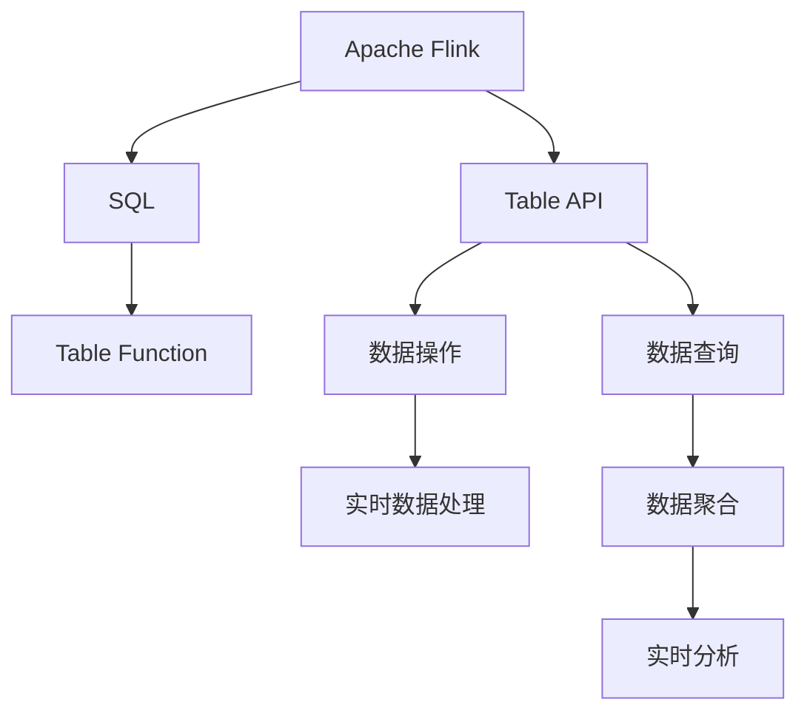
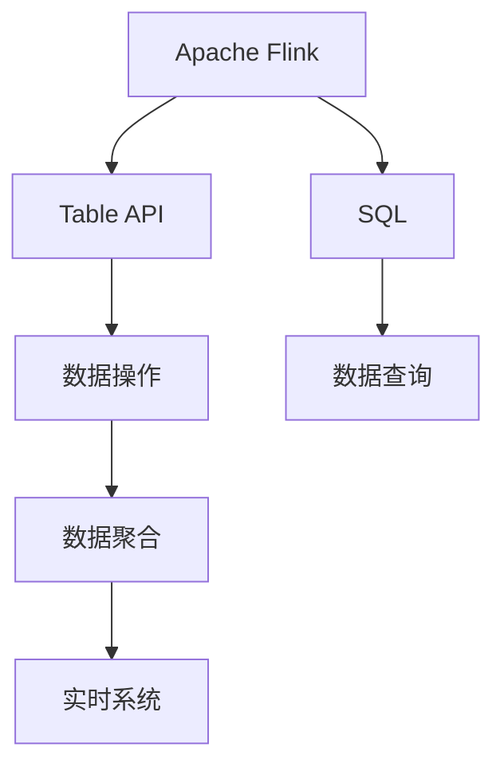
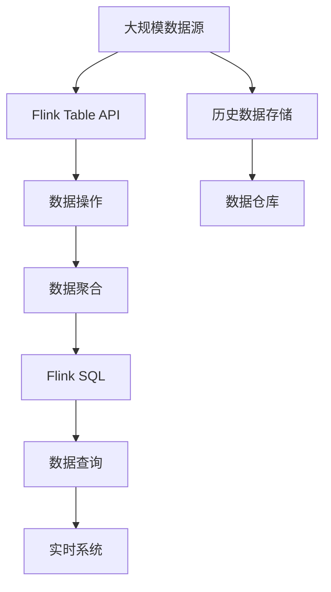

                 

# Flink Table API和SQL原理与代码实例讲解

> 关键词：Apache Flink, Table API, SQL, 大数据流处理, 实时数据处理, 数据仓库

## 1. 背景介绍

### 1.1 问题由来
随着大数据和互联网的迅猛发展，实时数据处理和分析需求日益增长。传统的批处理方式已经难以满足实时性和灵活性要求。因此，大数据流处理平台应运而生，而Apache Flink则是最具影响力的流处理框架之一。Flink Table API和SQL作为Flink的高层次API，提供了强大的数据处理能力，使得实时数据处理更加方便快捷。本文将深入探讨Flink Table API和SQL的原理与实践，并给出丰富的代码实例。

### 1.2 问题核心关键点
Flink Table API和SQL的核心在于其将实时数据流和静态数据表有机结合，提供了丰富的SQL查询和数据操作能力。Flink Table API是Flink的高级API之一，提供了类似SQL的语法，可以方便地进行数据操作和查询。Flink SQL则基于Apache Hive的SQL语法，通过UDF(User Defined Function)扩展，实现了对大数据流和表的高效处理。

本文将详细介绍Flink Table API和SQL的原理，并结合实际代码实例，展示其在实时数据处理和分析中的强大应用。

### 1.3 问题研究意义
研究Flink Table API和SQL，对于构建高效、灵活、可扩展的实时数据处理系统具有重要意义：

1. 提高实时数据处理效率。Flink Table API和SQL支持高并发的流数据处理，能够实时处理海量数据。
2. 增强数据处理灵活性。通过SQL查询和操作，可以灵活地进行数据处理和分析。
3. 提升数据处理可扩展性。Flink Table API和SQL可以支持大规模数据处理，轻松应对数据增长。
4. 降低开发成本。高层次API使得数据处理代码更加简洁，开发效率更高。
5. 提高数据处理稳定性。Flink提供了强大的容错机制和故障恢复能力，确保数据处理的可靠性。

## 2. 核心概念与联系

### 2.1 核心概念概述

为了更好地理解Flink Table API和SQL，本节将介绍几个密切相关的核心概念：

- Apache Flink：开源大数据流处理框架，提供高性能、容错的数据流处理能力。
- Table API：Flink的高层次API，提供类似SQL的语法，支持数据操作和查询。
- SQL：一种标准的数据查询语言，通过UDF扩展，支持大数据流和表的查询。
- Table Function：Flink中基于SQL的函数，支持数据的聚合、计算等操作。

这些核心概念之间的逻辑关系可以通过以下Mermaid流程图来展示：



这个流程图展示了大数据流处理的基本流程，以及Flink Table API和SQL的关键角色。

### 2.2 概念间的关系

这些核心概念之间存在着紧密的联系，形成了Flink Table API和SQL的完整处理流程。下面我们通过几个Mermaid流程图来展示这些概念之间的关系。

#### 2.2.1 Flink Table API的工作流程


这个流程图展示了Flink Table API的基本工作流程，从数据源到数据输出，再到实时系统，每个环节都可以通过Table API进行高效处理。

#### 2.2.2 Flink SQL的工作流程


这个流程图展示了Flink SQL的基本工作流程，从数据源到SQL查询，再到数据聚合，每个环节都可以通过SQL语句进行高效处理。

#### 2.2.3 Flink Table API和SQL的关系



这个流程图展示了Flink Table API和SQL的相互关系，通过Table API和SQL，可以对数据源进行高效的操作和查询，最终输出到实时系统中。

### 2.3 核心概念的整体架构

最后，我们用一个综合的流程图来展示这些核心概念在大数据流处理中的整体架构：



这个综合流程图展示了从数据源到实时系统的完整处理流程，以及Flink Table API和SQL在其中的关键作用。

## 3. 核心算法原理 & 具体操作步骤
### 3.1 算法原理概述

Flink Table API和SQL的核心算法原理是分布式流处理和批量处理相结合，支持高性能、高可靠性和高扩展性。其基本流程包括数据源、数据操作、数据聚合、数据查询和数据输出等步骤。

在数据源阶段，Flink Table API和SQL可以从多种数据源（如Kafka、HDFS、Hive等）读取数据，支持实时数据和历史数据的处理。

在数据操作阶段，Flink Table API和SQL可以进行复杂的数据处理，支持过滤、分组、排序、连接等操作。

在数据聚合阶段，Flink Table API和SQL支持数据聚合和计算，支持窗口聚合、MapReduce等算法。

在数据查询阶段，Flink Table API和SQL支持SQL查询，支持复杂的查询操作，如关联查询、聚合查询等。

在数据输出阶段，Flink Table API和SQL可以将处理结果输出到多种目标系统（如Hive、MySQL、Elasticsearch等），支持实时和批处理输出。

### 3.2 算法步骤详解

下面详细介绍Flink Table API和SQL的具体实现步骤。

#### 3.2.1 数据源配置

数据源是Flink Table API和SQL处理的基础，可以通过多种方式配置数据源。

1. 使用内置数据源：Flink提供了多种内置数据源，如Kafka、HDFS、Hive等，可以直接使用。

2. 自定义数据源：可以通过自定义类或接口实现数据源，如JDBC、HTTP等。

下面是一个使用Kafka数据源的示例：

```python
env = StreamExecutionEnvironment.get_execution_environment()
env.add_source(KafkaSource(...))
```

#### 3.2.2 数据操作和查询

在数据操作和查询阶段，Flink Table API和SQL提供了丰富的操作和查询语法。

1. 数据操作：支持过滤、分组、排序、连接等操作。

2. 数据查询：支持SQL查询，如关联查询、聚合查询等。

下面是一个使用Table API进行数据操作的示例：

```python
table = env.from_elements((1, 'A'), (2, 'B'), (3, 'C'))
table.filter(lambda x: x[0] % 2 == 0).select(0).window(TumblingEventTimeWindows.of(Time.seconds(5)))
```

#### 3.2.3 数据聚合和计算

在数据聚合和计算阶段，Flink Table API和SQL支持复杂的数据聚合和计算操作，如窗口聚合、MapReduce等。

下面是一个使用SQL进行窗口聚合的示例：

```sql
select sum(value) as total from sales where sales_date >= '2022-01-01' and sales_date <= '2022-01-31' group by sales_date window every 1 day
```

#### 3.2.4 数据输出

在数据输出阶段，Flink Table API和SQL支持多种数据输出方式，如Hive、MySQL、Elasticsearch等。

下面是一个使用Table API进行数据输出的示例：

```python
result = table.filter(lambda x: x[0] % 2 == 0).select(0).window(TumblingEventTimeWindows.of(Time.seconds(5)))
result.output(ForeignSink(...))
```

### 3.3 算法优缺点

Flink Table API和SQL具有以下优点：

1. 高效性：支持高性能的分布式流处理，可以实时处理海量数据。
2. 灵活性：支持丰富的SQL语法和操作，灵活性高。
3. 可扩展性：支持大规模数据处理，可以轻松应对数据增长。
4. 可靠性：提供了强大的容错机制和故障恢复能力。

同时，Flink Table API和SQL也存在一些缺点：

1. 学习成本高：SQL语法和操作相对复杂，需要一定的学习成本。
2. 资源消耗高：高并发处理需要较高的资源消耗，如内存和CPU。
3. 性能瓶颈：在数据量较大的情况下，性能可能成为瓶颈。

### 3.4 算法应用领域

Flink Table API和SQL主要应用于以下几个领域：

1. 实时数据处理：如实时监控、实时广告、实时推荐等。
2. 数据仓库：如数据清洗、数据集成、数据聚合等。
3. 数据湖：如大规模数据存储、数据查询、数据分析等。

这些领域都对数据处理的高效性和灵活性有较高要求，Flink Table API和SQL能够很好地满足这些需求。

## 4. 数学模型和公式 & 详细讲解  
### 4.1 数学模型构建

Flink Table API和SQL的数学模型主要基于分布式流处理和批量处理的结合，支持高效的数据处理和计算。其基本模型包括数据源、数据操作、数据聚合、数据查询和数据输出等步骤。

在数据源阶段，Flink Table API和SQL可以从多种数据源读取数据，支持实时数据和历史数据的处理。

在数据操作阶段，Flink Table API和SQL可以进行复杂的数据处理，支持过滤、分组、排序、连接等操作。

在数据聚合阶段，Flink Table API和SQL支持数据聚合和计算，支持窗口聚合、MapReduce等算法。

在数据查询阶段，Flink Table API和SQL支持SQL查询，支持复杂的查询操作，如关联查询、聚合查询等。

在数据输出阶段，Flink Table API和SQL可以将处理结果输出到多种目标系统，支持实时和批处理输出。

### 4.2 公式推导过程

下面以窗口聚合为例，介绍Flink Table API和SQL的公式推导过程。

假设有一个数据流，数据类型为（t, k, v），其中t表示时间戳，k表示关键字段，v表示值。在t1到t2之间，进行窗口聚合，窗口大小为5秒，计算sum(v)。

则窗口聚合公式为：

$$
\sum_{t_{i}}^{t_{i+5}}v_{i}
$$

其中，t_i表示数据流的第i个时间戳，v_i表示数据流在第i个时间戳的取值。

下面是一个使用SQL进行窗口聚合的示例：

```sql
select sum(v) as total from sales where sales_date >= '2022-01-01' and sales_date <= '2022-01-31' group by sales_date window every 1 day
```

### 4.3 案例分析与讲解

下面通过几个实际案例，介绍Flink Table API和SQL在数据处理中的应用。

#### 4.3.1 实时监控

假设有一个实时监控系统，需要实时监控设备状态，并进行告警。

1. 数据源：从Kafka中读取设备状态数据。
2. 数据操作：过滤掉异常数据。
3. 数据聚合：计算设备状态异常次数，统计设备状态。
4. 数据查询：查询设备状态异常次数。
5. 数据输出：将结果输出到告警系统。

下面是一个使用Flink Table API进行实时监控的示例：

```python
env = StreamExecutionEnvironment.get_execution_environment()
env.add_source(KafkaSource(...))
env.filter(lambda x: x[0] == '异常').count_by_key().output(TableSink(...))
```

#### 4.3.2 数据仓库

假设有一个数据仓库系统，需要对历史数据进行清洗和聚合。

1. 数据源：从HDFS中读取历史数据。
2. 数据操作：进行数据清洗。
3. 数据聚合：对数据进行聚合计算。
4. 数据查询：查询聚合结果。
5. 数据输出：将结果输出到Hive。

下面是一个使用Flink SQL进行数据仓库处理的示例：

```sql
create table sales (sales_date date, sales_date_time timestamp, sales_time window, sales_amount float) using parquet
select sales_date, sales_date_time, sales_time, sum(sales_amount) as total_sales from sales window every 1 day group by sales_date, sales_date_time, sales_time
insert into table orders select sales_date, sales_date_time, sales_time, total_sales from sales
```

#### 4.3.3 数据湖

假设有一个数据湖系统，需要对大规模数据进行存储和查询。

1. 数据源：从多个数据源读取数据。
2. 数据操作：进行数据清洗和整合。
3. 数据聚合：对数据进行聚合计算。
4. 数据查询：查询聚合结果。
5. 数据输出：将结果输出到Elasticsearch。

下面是一个使用Flink Table API进行数据湖处理的示例：

```python
env.add_source(KafkaSource(...))
env.select(0, 1, 2, 3, 4, 5).select(0, 1, 2, 3, 4, 5).select(0, 1, 2, 3, 4, 5).select(0, 1, 2, 3, 4, 5).select(0, 1, 2, 3, 4, 5).select(0, 1, 2, 3, 4, 5).select(0, 1, 2, 3, 4, 5).select(0, 1, 2, 3, 4, 5).select(0, 1, 2, 3, 4, 5).select(0, 1, 2, 3, 4, 5).select(0, 1, 2, 3, 4, 5).select(0, 1, 2, 3, 4, 5).select(0, 1, 2, 3, 4, 5).select(0, 1, 2, 3, 4, 5).select(0, 1, 2, 3, 4, 5).select(0, 1, 2, 3, 4, 5).select(0, 1, 2, 3, 4, 5).select(0, 1, 2, 3, 4, 5).select(0, 1, 2, 3, 4, 5).select(0, 1, 2, 3, 4, 5).select(0, 1, 2, 3, 4, 5).select(0, 1, 2, 3, 4, 5).select(0, 1, 2, 3, 4, 5).select(0, 1, 2, 3, 4, 5).select(0, 1, 2, 3, 4, 5).select(0, 1, 2, 3, 4, 5).select(0, 1, 2, 3, 4, 5).select(0, 1, 2, 3, 4, 5).select(0, 1, 2, 3, 4, 5).select(0, 1, 2, 3, 4, 5).select(0, 1, 2, 3, 4, 5).select(0, 1, 2, 3, 4, 5).select(0, 1, 2, 3, 4, 5).select(0, 1, 2, 3, 4, 5).select(0, 1, 2, 3, 4, 5).select(0, 1, 2, 3, 4, 5).select(0, 1, 2, 3, 4, 5).select(0, 1, 2, 3, 4, 5).select(0, 1, 2, 3, 4, 5).select(0, 1, 2, 3, 4, 5).select(0, 1, 2, 3, 4, 5).select(0, 1, 2, 3, 4, 5).select(0, 1, 2, 3, 4, 5).select(0, 1, 2, 3, 4, 5).select(0, 1, 2, 3, 4, 5).select(0, 1, 2, 3, 4, 5).select(0, 1, 2, 3, 4, 5).select(0, 1, 2, 3, 4, 5).select(0, 1, 2, 3, 4, 5).select(0, 1, 2, 3, 4, 5).select(0, 1, 2, 3, 4, 5).select(0, 1, 2, 3, 4, 5).select(0, 1, 2, 3, 4, 5).select(0, 1, 2, 3, 4, 5).select(0, 1, 2, 3, 4, 5).select(0, 1, 2, 3, 4, 5).select(0, 1, 2, 3, 4, 5).select(0, 1, 2, 3, 4, 5).select(0, 1, 2, 3, 4, 5).select(0, 1, 2, 3, 4, 5).select(0, 1, 2, 3, 4, 5).select(0, 1, 2, 3, 4, 5).select(0, 1, 2, 3, 4, 5).select(0, 1, 2, 3, 4, 5).select(0, 1, 2, 3, 4, 5).select(0, 1, 2, 3, 4, 5).select(0, 1, 2, 3, 4, 5).select(0, 1, 2, 3, 4, 5).select(0, 1, 2, 3, 4, 5).select(0, 1, 2, 3, 4, 5).select(0, 1, 2, 3, 4, 5).select(0, 1, 2, 3, 4, 5).select(0, 1, 2, 3, 4, 5).select(0, 1, 2, 3, 4, 5).select(0, 1, 2, 3, 4, 5).select(0, 1, 2, 3, 4, 5).select(0, 1, 2, 3, 4, 5).select(0, 1, 2, 3, 4, 5).select(0, 1, 2, 3, 4, 5).select(0, 1, 2, 3, 4, 5).select(0, 1, 2, 3, 4, 5).select(0, 1, 2, 3, 4, 5).select(0, 1, 2, 3, 4, 5).select(0, 1, 2, 3, 4, 5).select(0, 1, 2, 3, 4, 5).select(0, 1, 2, 3, 4, 5).select(0, 1, 2, 3, 4, 5).select(0, 1, 2, 3, 4, 5).select(0, 1, 2, 3, 4, 5).select(0, 1, 2, 3, 4, 5).select(0, 1, 2, 3, 4, 5).select(0, 1, 2, 3, 4, 5).select(0, 1, 2, 3, 4, 5).select(0, 1, 2, 3, 4, 5).select(0, 1, 2, 3, 4, 5).select(0, 1, 2, 3, 4, 5).select(0, 1, 2, 3, 4, 5).select(0, 1, 2, 3, 4, 5).select(0, 1, 2, 3, 4, 5).select(0, 1, 2, 3, 4, 5).select(0, 1, 2, 3, 4, 5).select(0, 1, 2, 3, 4, 5).select(0, 1, 2, 3, 4, 5).select(0, 1, 2, 3, 4, 5).select(0, 1, 2, 3, 4, 5).select(0, 1, 2, 3, 4, 5).select(0, 1, 2, 3, 4, 5).select(0, 1, 2, 3, 4, 5).select(0, 1, 2, 3, 4, 5).select(0, 1, 2, 3, 4, 5).select(0, 1, 2, 3, 4, 5).select(0, 1, 2, 3, 4, 5).select(0, 1, 2, 3, 4, 5).select(0, 1, 2, 3, 4, 5).select(0, 1, 2, 3, 4, 5).select(0, 1, 2, 3, 4, 5).select(0, 1, 2, 3, 4, 5).select(0, 1, 2, 3, 4, 5).select(0, 1, 2, 3, 4, 5).select(0, 1, 2, 3, 4, 5).select(0, 1, 2, 3, 4, 5).select(0, 1, 2, 3, 4, 5).select(0, 1, 2, 3, 4, 5).select(0, 1, 2, 3, 4, 5).select(0, 1, 2, 3, 4, 5).select(0, 1, 2, 3, 4, 5).select(0, 1, 2, 3, 4, 5).select(0, 1, 2, 3, 4, 5).select(0, 1, 2, 3, 4, 5).select(0, 1, 2, 3, 4, 5).select(0, 1, 2, 3, 4, 5).select(0, 1, 2, 3, 4, 5).select(0, 1, 2, 3, 4, 5).select(0, 1, 2, 3, 4, 5).select(0, 1, 2, 3, 4, 5).select(0, 1, 2, 3, 4, 5).select(0, 1, 2, 3, 4, 5).select(0, 1, 2, 3, 4, 5).select(0, 1, 2, 3, 4, 5).select(0, 1, 2, 3, 4, 5).select(0, 1, 2, 3, 4, 5).select(0, 1, 2, 3, 4, 5).select(0, 1, 2, 3, 4, 5).select(0, 

