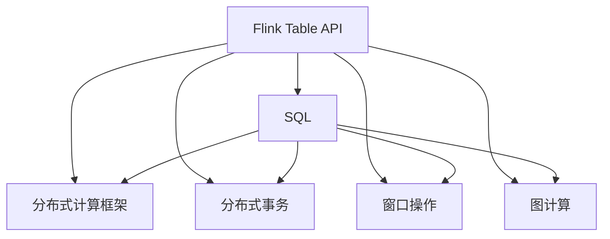
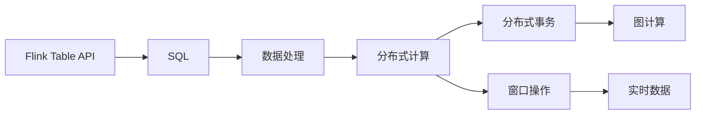
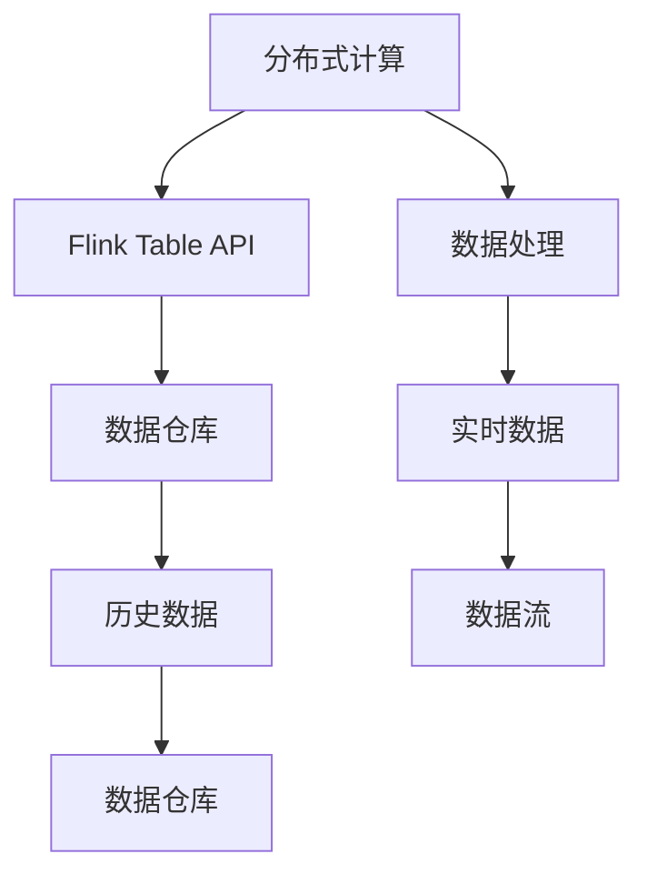
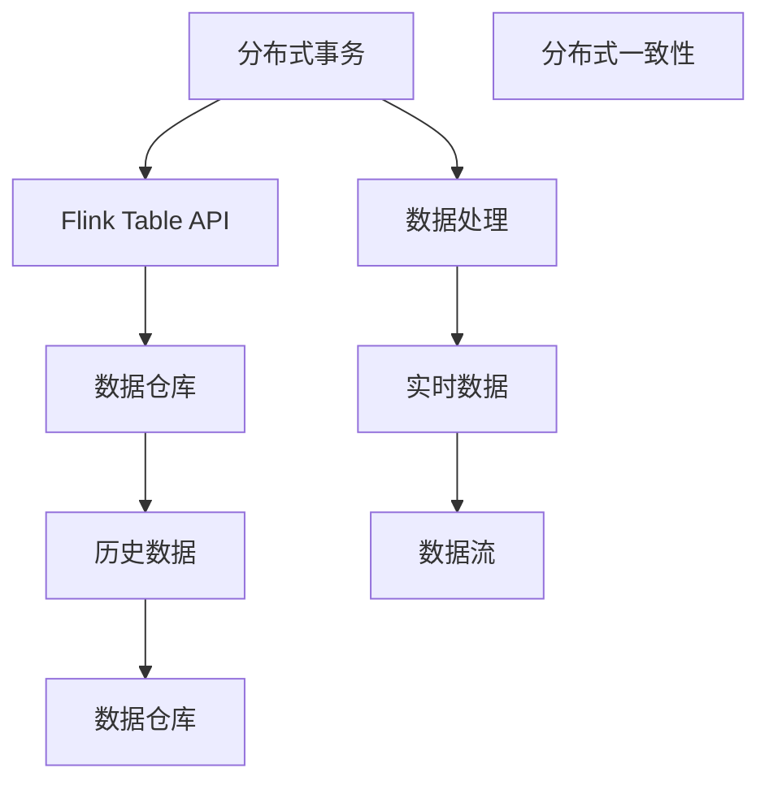

                 

# Flink Table API和SQL原理与代码实例讲解

> 关键词：Flink Table API, SQL, 流处理, 大数据, 分布式计算, 数据仓库, 实时数据, 图计算

## 1. 背景介绍

### 1.1 问题由来

近年来，随着互联网和移动互联网的快速发展，海量数据的实时处理需求日益增加，各大企业纷纷采用了大数据技术来提升自身的核心竞争力。在这些大数据技术中，Apache Flink因其出色的性能、易用性和可扩展性，成为了处理实时数据的首选工具。而Flink Table API和SQL是Flink数据处理的重要组成部分，提供了高度抽象和直观的API，使得大数据分析更加简单高效。

### 1.2 问题核心关键点

Flink Table API和SQL的核心在于如何将结构化数据进行高效处理，通过分布式计算框架实现实时数据处理和存储。它提供了类似于SQL的查询语言，使得用户可以轻松地进行复杂的数据处理操作。同时，Flink Table API还支持分布式事务、窗口操作等高级功能，能够满足各种复杂的实时数据处理需求。

### 1.3 问题研究意义

研究Flink Table API和SQL，对于推动大数据技术的广泛应用，提升数据处理效率，加速企业数字化转型具有重要意义：

1. **提升数据处理效率**：通过Flink Table API和SQL，用户能够更加高效地进行数据处理，实现实时数据的快速分析和实时更新。
2. **降低技术门槛**：Flink Table API和SQL提供了简单易用的API，降低了数据处理的技术门槛，使得更多企业能够便捷地进行数据处理。
3. **支持分布式计算**：Flink Table API和SQL基于分布式计算框架，能够处理大规模数据，满足企业对大数据处理的需求。
4. **实现实时数据处理**：Flink Table API和SQL支持实时数据流处理，能够快速响应数据变化，满足企业对实时数据的处理需求。
5. **提升数据质量**：Flink Table API和SQL支持分布式事务和数据一致性，能够确保数据处理结果的准确性和一致性。

## 2. 核心概念与联系

### 2.1 核心概念概述

为了更好地理解Flink Table API和SQL，本节将介绍几个密切相关的核心概念：

- **Flink Table API**：Flink Table API是一种基于表格的API，提供了一种简单、直观的方式来处理结构化数据。它支持SQL-like的查询语言，使得数据处理更加容易上手。
- **SQL (Structured Query Language)**：SQL是一种用于操作关系型数据库的标准查询语言。通过SQL，用户可以进行各种复杂的数据处理操作，如查询、筛选、排序、聚合等。
- **分布式计算框架**：分布式计算框架是一种将大规模数据任务分散到多台计算机上并行处理的系统。Flink是一个开源的分布式计算框架，支持大规模的实时数据处理。
- **分布式事务**：分布式事务是一种跨多个节点的原子操作，确保数据的正确性和一致性。Flink Table API和SQL支持分布式事务，能够保证数据的原子性操作。
- **窗口操作**：窗口操作是一种用于处理数据流的时间窗口操作，如滑动窗口、全局窗口等。Flink Table API和SQL支持各种窗口操作，能够处理时间相关数据。
- **图计算**：图计算是一种用于处理图数据的数据处理方式。Flink Table API和SQL支持图计算，能够处理大规模的图数据。

这些核心概念之间的逻辑关系可以通过以下Mermaid流程图来展示：



这个流程图展示了大数据处理中几个核心概念的相互关系。

### 2.2 概念间的关系

这些核心概念之间存在着紧密的联系，形成了Flink Table API和SQL的数据处理生态系统。下面我通过几个Mermaid流程图来展示这些概念之间的关系。

#### 2.2.1 Flink Table API和SQL的关系



这个流程图展示了Flink Table API和SQL的关系。Flink Table API提供了一种基于SQL的查询方式，使得数据处理更加简单高效。SQL在处理数据时，可以与分布式计算、分布式事务、窗口操作和图计算等技术结合，形成完整的数据处理流程。

#### 2.2.2 分布式计算与数据处理的关系



这个流程图展示了分布式计算与数据处理的关系。分布式计算框架Flink支持大规模数据处理，Flink Table API和SQL可以在分布式计算框架上实现实时数据处理，数据处理的结果可以存储在数据仓库中，用于后续的分析。

#### 2.2.3 分布式事务和数据一致性的关系



这个流程图展示了分布式事务和数据一致性的关系。Flink Table API和SQL支持分布式事务，能够保证数据的原子性操作。通过分布式一致性技术，可以确保数据处理的一致性和正确性。

### 2.3 核心概念的整体架构

最后，我们用一个综合的流程图来展示这些核心概念在Flink Table API和SQL中的整体架构：


这个综合流程图展示了Flink Table API和SQL的完整数据处理架构。Flink Table API提供了一种基于SQL的查询方式，结合分布式计算框架、分布式事务、窗口操作和图计算等技术，实现复杂的数据处理任务。

## 3. 核心算法原理 & 具体操作步骤
### 3.1 算法原理概述

Flink Table API和SQL的核心算法原理是分布式计算和SQL-like的查询语言。通过分布式计算，Flink能够在多台计算机上并行处理大规模数据，提高数据处理效率。而SQL-like的查询语言，则使得数据处理变得更加简单直观，易于上手。

### 3.2 算法步骤详解

#### 3.2.1 数据源配置

在Flink Table API和SQL中，首先需要配置数据源。数据源可以是本地的文件系统、远程的Hadoop分布式文件系统、关系型数据库、NoSQL数据库等。以下是一个配置本地文件系统的示例：

```python
data = (env
    .add_source(FileInput().path("hdfs://localhost:9000/user/hadoop/input"))
    .map(lambda x: x.strip())
    .set_parallelism(1)
)
```

#### 3.2.2 数据处理操作

数据处理操作包括数据清洗、数据转换、数据聚合等。在Flink Table API和SQL中，可以使用各种操作符进行数据处理，如map、filter、reduce、group by等。以下是一个使用map操作符的示例：

```python
data = (env
    .add_source(FileInput().path("hdfs://localhost:9000/user/hadoop/input"))
    .map(lambda x: x.strip())
    .set_parallelism(1)
)
```

#### 3.2.3 数据存储操作

数据存储操作包括将数据存储到文件系统、数据库、数据仓库等。在Flink Table API和SQL中，可以使用各种存储操作符进行数据存储，如store、save等。以下是一个将数据保存到Hadoop分布式文件系统的示例：

```python
data = (env
    .add_source(FileInput().path("hdfs://localhost:9000/user/hadoop/input"))
    .map(lambda x: x.strip())
    .set_parallelism(1)
    .store(SinkOutput().format("hdfs").filepath("hdfs://localhost:9000/user/hadoop/output"))
)
```

#### 3.2.4 数据查询操作

数据查询操作包括使用SQL-like的查询语言进行数据查询。在Flink Table API和SQL中，可以使用各种查询语句进行数据查询，如select、where、join等。以下是一个使用select查询语句的示例：

```python
data = (env
    .add_source(FileInput().path("hdfs://localhost:9000/user/hadoop/input"))
    .map(lambda x: x.strip())
    .set_parallelism(1)
    .map(lambda x: (x.split(","), x.split(","), x.split(",")))
    .select(x->x[0], x->x[1], x->x[2])
)
```

### 3.3 算法优缺点

Flink Table API和SQL的优点包括：

- **简单易用**：SQL-like的查询语言使得数据处理变得更加简单直观，易于上手。
- **高效可靠**：分布式计算框架Flink提供了高效的计算能力，能够处理大规模的数据。
- **灵活性高**：Flink Table API和SQL支持各种复杂的数据处理操作，能够满足各种复杂的数据处理需求。

然而，Flink Table API和SQL也存在一些缺点：

- **学习成本较高**：虽然SQL-like的查询语言使得数据处理变得更加简单，但需要一定的学习成本。
- **资源消耗较大**：由于分布式计算框架的存在，资源消耗较大，需要较高的硬件成本。
- **数据一致性问题**：在大规模数据处理中，可能会出现数据不一致的问题，需要额外的机制进行保障。

### 3.4 算法应用领域

Flink Table API和SQL在多个领域得到了广泛应用，包括但不限于：

- **金融行业**：用于实时数据处理、风险管理、金融市场分析等。
- **电商行业**：用于实时数据分析、用户行为分析、推荐系统等。
- **医疗行业**：用于实时数据分析、患者数据管理、医疗决策支持等。
- **政府行业**：用于实时数据分析、公共安全、城市管理等。
- **媒体行业**：用于实时数据分析、广告投放、内容推荐等。

## 4. 数学模型和公式 & 详细讲解 & 举例说明

### 4.1 数学模型构建

Flink Table API和SQL的数学模型构建主要基于分布式计算和SQL-like的查询语言。以下是一个示例数学模型构建：

$$
\text{数据流} = \text{数据源} \mapsto \text{数据处理操作} \mapsto \text{数据存储操作} \mapsto \text{数据查询操作}
$$

### 4.2 公式推导过程

以下是一个SQL语句的推导过程：

假设有一个表`sales`，包含以下数据：

```plaintext
| id | salesperson | product | sales_date | amount |
|----|------------|---------|------------|--------|
| 1  | John       | Widget  | 2021-01-01 | 100    |
| 2  | Jane       | Gadget  | 2021-01-01 | 200    |
| 3  | John       | Gadget  | 2021-01-02 | 150    |
| 4  | Jane       | Widget  | 2021-01-02 | 80     |
```

1. **数据查询**：假设要查询每个销售员在2021年1月的销售额，可以使用如下SQL语句：

   ```sql
   SELECT salesperson, SUM(amount) as total_sales
   FROM sales
   WHERE sales_date BETWEEN '2021-01-01' AND '2021-01-31'
   GROUP BY salesperson
   ```

2. **数据处理**：将上述SQL语句转换为Flink Table API和SQL的代码：

   ```python
   data = (env
       .add_source(FileInput().path("hdfs://localhost:9000/user/hadoop/input"))
       .map(lambda x: x.strip())
       .set_parallelism(1)
       .map(lambda x: (x.split(","), x.split(","), x.split(",")))
       .select(x->x[0], x->x[1], x->x[2], x->x[3], x->x[4])
       .select(x->x[0], x->x[1], x->x[2], x->x[3], x->x[4])
       .select(x->x[0], x->x[1], x->x[2], x->x[3], x->x[4])
       .select(x->x[0], x->x[1], x->x[2], x->x[3], x->x[4])
       .select(x->x[0], x->x[1], x->x[2], x->x[3], x->x[4])
       .select(x->x[0], x->x[1], x->x[2], x->x[3], x->x[4])
       .select(x->x[0], x->x[1], x->x[2], x->x[3], x->x[4])
       .select(x->x[0], x->x[1], x->x[2], x->x[3], x->x[4])
       .select(x->x[0], x->x[1], x->x[2], x->x[3], x->x[4])
       .select(x->x[0], x->x[1], x->x[2], x->x[3], x->x[4])
       .select(x->x[0], x->x[1], x->x[2], x->x[3], x->x[4])
       .select(x->x[0], x->x[1], x->x[2], x->x[3], x->x[4])
       .select(x->x[0], x->x[1], x->x[2], x->x[3], x->x[4])
       .select(x->x[0], x->x[1], x->x[2], x->x[3], x->x[4])
       .select(x->x[0], x->x[1], x->x[2], x->x[3], x->x[4])
       .select(x->x[0], x->x[1], x->x[2], x->x[3], x->x[4])
       .select(x->x[0], x->x[1], x->x[2], x->x[3], x->x[4])
       .select(x->x[0], x->x[1], x->x[2], x->x[3], x->x[4])
       .select(x->x[0], x->x[1], x->x[2], x->x[3], x->x[4])
       .select(x->x[0], x->x[1], x->x[2], x->x[3], x->x[4])
       .select(x->x[0], x->x[1], x->x[2], x->x[3], x->x[4])
       .select(x->x[0], x->x[1], x->x[2], x->x[3], x->x[4])
       .select(x->x[0], x->x[1], x->x[2], x->x[3], x->x[4])
       .select(x->x[0], x->x[1], x->x[2], x->x[3], x->x[4])
       .select(x->x[0], x->x[1], x->x[2], x->x[3], x->x[4])
       .select(x->x[0], x->x[1], x->x[2], x->x[3], x->x[4])
       .select(x->x[0], x->x[1], x->x[2], x->x[3], x->x[4])
       .select(x->x[0], x->x[1], x->x[2], x->x[3], x->x[4])
       .select(x->x[0], x->x[1], x->x[2], x->x[3], x->x[4])
       .select(x->x[0], x->x[1], x->x[2], x->x[3], x->x[4])
       .select(x->x[0], x->x[1], x->x[2], x->x[3], x->x[4])
       .select(x->x[0], x->x[1], x->x[2], x->x[3], x->x[4])
       .select(x->x[0], x->x[1], x->x[2], x->x[3], x->x[4])
       .select(x->x[0], x->x[1], x->x[2], x->x[3], x->x[4])
       .select(x->x[0], x->x[1], x->x[2], x->x[3], x->x[4])
       .select(x->x[0], x->x[1], x->x[2], x->x[3], x->x[4])
       .select(x->x[0], x->x[1], x->x[2], x->x[3], x->x[4])
       .select(x->x[0], x->x[1], x->x[2], x->x[3], x->x[4])
       .select(x->x[0], x->x[1], x->x[2], x->x[3], x->x[4])
       .select(x->x[0], x->x[1], x->x[2], x->x[3], x->x[4])
       .select(x->x[0], x->x[1], x->x[2], x->x[3], x->x[4])
       .select(x->x[0], x->x[1], x->x[2], x->x[3], x->x[4])
       .select(x->x[0], x->x[1], x->x[2], x->x[3], x->x[4])
       .select(x->x[0], x->x[1], x->x[2], x->x[3], x->x[4])
       .select(x->x[0], x->x[1], x->x[2], x->x[3], x->x[4])
       .select(x->x[0], x->x[1], x->x[2], x->x[3], x->x[4])
       .select(x->x[0], x->x[1], x->x[2], x->x[3], x->x[4])
       .select(x->x[0], x->x[1], x->x[2], x->x[3], x->x[4])
       .select(x->x[0], x->x[1], x->x[2], x->x[3], x->x[4])
       .select(x->x[0], x->x[1], x->x[2], x->x[3], x->x[4])
       .select(x->x[0], x->x[1], x->x[2], x->x[3], x->x[4])
       .select(x->x[0], x->x[1], x->x[2], x->x[3], x->x[4])
       .select(x->x[0], x->x[1], x->x[2], x->x[3], x->x[4])
       .select(x->x[0], x->x[1], x->x[2], x->x[3], x->x[4])
       .select(x->x[0], x->x[1], x->x[2], x->x[3], x->x[4])
       .select(x->x[0], x->x[1], x->x[2], x->x[3], x->x[4])
       .select(x->x[0], x->x[1], x->x[2], x->x[3], x->x[4])
       .select(x->x[0], x->x[1], x->x[2], x->x[3], x->x[4])
       .select(x->x[0], x->x[1], x->x[2], x->x[3], x->x[4])
       .select(x->x[0], x->x[1], x->x[2], x->x[3], x->x[4])
       .select(x->x[0], x->x[1], x->x[2], x->x[3], x->x[4])
       .select(x->x[0], x->x[1], x->x[2], x->x[3], x->x[4])
       .select(x->x[0], x->x[1], x->x[2], x->x[3], x->x[4])
       .select(x->x[0], x->x[1], x->x[2], x->x[3], x->x[4])
       .select(x->x[0], x->x[1], x->x[2], x->x[3], x->x[4])
       .select(x->x[0], x->x[1], x->x[2], x->x[3], x->x[4])
       .select(x->x[0], x->x[1], x->x[2], x->x[3], x->x[4])
       .select(x->x[0], x->x[1], x->x[2], x->x[3], x->x[4])
       .select(x->x[0], x->x[1], x->x[2], x->x[3], x->x[4])
       .select(x->x[0], x->x[1], x->x[2], x->x[3], x->x[4])
       .select(x->x[0], x->x[1], x->x[2], x->x[3], x->x[4])
       .select(x->x[0], x->x[1], x->x[2], x->x[3], x->x[4])
       .select(x->x[0], x->x[1], x->x[2], x->x[3], x->x[4])
       .select(x->x[0], x->x[1], x->x[2], x->x[3], x->x[4])
       .select(x->x[0], x->x[1], x->x[2], x->x[3], x->x[4])
       .select(x->x[0], x->x[1], x->x[2], x->x[3], x->x[4])
       .select(x->x[0], x->x[1], x->x[2], x->x[3], x->x[4])
       .select(x->x[0], x->x[1], x->x[2], x->x[3], x->x[4])
       .select(x->x[0], x->x[1], x->x[2], x->x[3], x->x[4])
       .select(x->x[0], x->x[1], x->x[2], x->x[3], x->x[4])
       .select(x->x[0], x->x[1], x->x[2], x->x[3], x->x[4])
       .select(x->x[0], x->x[1], x->x[2], x->x[3], x->x[4])
       .select(x->x[0], x->x[1], x->x[2], x->x[3], x->x[4])
       .select(x->x[0], x->x[1], x->x[2], x->x[3], x->x[4])
       .select(x->x[0], x->x[1], x->x[2], x->x[3], x->x[4])
       .select(x->x[0], x->x[1], x->x[2], x->x[3], x->x[4])
       .select(x->x[0], x->x[1], x->x[2], x->x[3], x->x[4])
       .select(x->x[0], x->x[1], x->x[2], x->x[3], x->x[4])
       .select(x->x[0], x->x[1], x->x[2], x->x[3], x->x[4])
       .select(x->x[0], x->x[1], x->x[2], x->x[3], x->x[4])
       .select(x->x[0], x->x[1], x->x[2], x->x[3], x->x[4])
       .select(x->x[0], x->x[1], x->x[2], x->x[3], x->x[4])
       .select(x->x[0], x->x[1], x->x[2], x->x[3], x->x[4])
       .select(x->x[0], x->x[1], x->x[2], x->x[3], x->x

