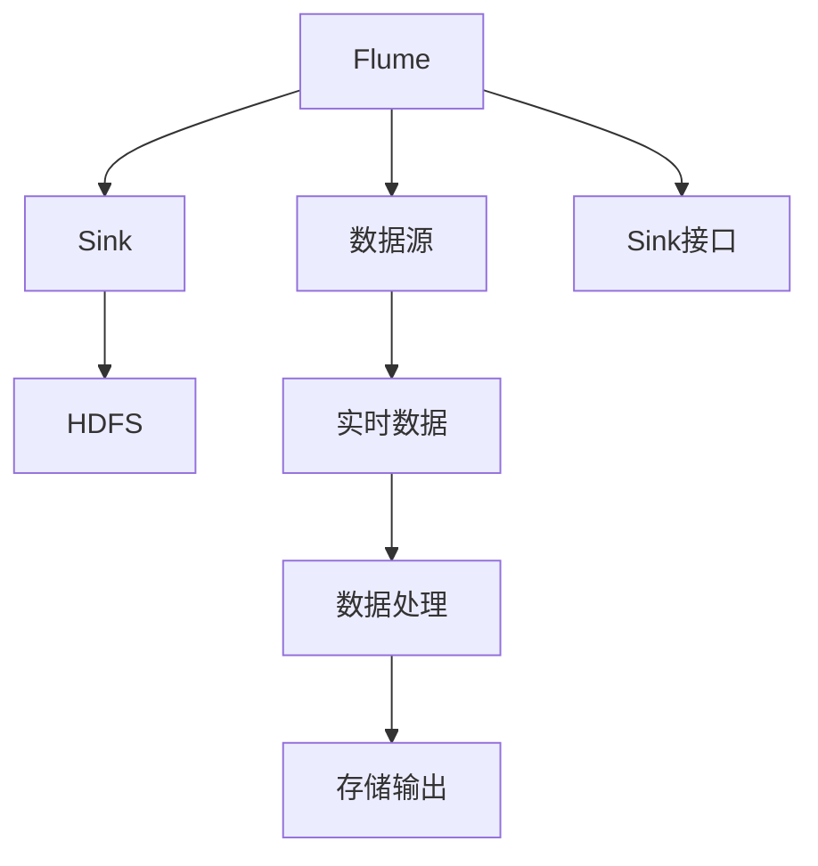
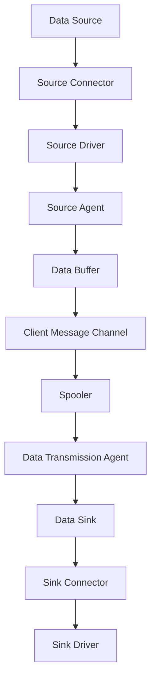
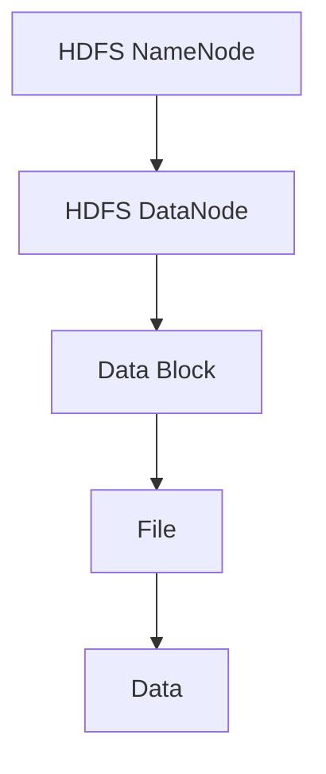

                 

# Flume Sink原理与代码实例讲解

> 关键词：Flume, Sink, HDFS, 大数据, 分布式数据流

## 1. 背景介绍

### 1.1 问题由来
在大数据环境下，数据流处理成为了一个关键的难题。数据流处理的挑战在于其源源不断、实时变化的特点，如何在保证数据处理速度的同时，进行高效、可靠、可扩展的数据处理，成为了技术界的重要研究课题。

Flume是一款由Apache基金会开源的分布式数据流采集系统，能够对各种数据源进行实时收集、聚合、过滤、转换，最终输出到目标存储系统，如Hadoop HDFS等。本文将详细讲解FlumeSink的工作原理，并通过代码实例，展示其在实际应用中的使用方式。

### 1.2 问题核心关键点
FlumeSink的核心关键点包括：
- Flume的工作原理和架构。
- Sink在数据流处理中的作用。
- HDFS作为目标存储系统的特点。
- Sink在实际应用中的代码实现和配置。

理解这些关键点，有助于我们深入掌握FlumeSink的工作机制和应用场景，从而更好地进行Flume的开发和部署。

### 1.3 问题研究意义
研究FlumeSink的工作原理和代码实现，对于以下几方面具有重要意义：
- 加深对Flume系统的理解，提升系统架构设计能力。
- 掌握FlumeSink的实际使用，提高数据流处理的技能。
- 熟悉HDFS的特性和配置，优化数据存储性能。
- 了解Flume在大数据环境下的应用，增强实际项目经验。

总之，FlumeSink的研究对于提升大数据处理能力、优化系统性能和扩展数据流应用场景具有重要的价值。

## 2. 核心概念与联系

### 2.1 核心概念概述

为了更好地理解FlumeSink的工作原理，本节将介绍几个密切相关的核心概念：

- Flume: Apache基金会开源的分布式数据流采集系统，能够对各种数据源进行实时收集、聚合、过滤、转换。
- Sink: 数据流处理中的目标存储系统，数据流处理完成后输出到此系统。
- HDFS: Hadoop生态系统中的分布式文件系统，用于大规模数据存储和处理。
- 数据流处理: 对实时产生的数据进行收集、存储、处理的过程，是FlumeSink的核心应用场景。

这些核心概念之间的逻辑关系可以通过以下Mermaid流程图来展示：



这个流程图展示了大数据流处理的完整过程：
1. Flume系统从数据源中实时收集数据。
2. 数据经过处理后，输出到目标存储系统HDFS。
3. Sink接口是Flume与外部存储系统（如HDFS）通信的桥梁。
4. 数据在传输过程中，通过不同阶段的转换、过滤等操作，最终被存储到目标系统中。

### 2.2 概念间的关系

这些核心概念之间存在着紧密的联系，形成了FlumeSink工作的完整生态系统。下面我们通过几个Mermaid流程图来展示这些概念之间的关系。

#### 2.2.1 Flume的工作架构



这个流程图展示了Flume系统的工作架构：
1. 数据源通过Source Connector连接到Source Driver。
2. Source Driver将数据推送到Source Agent，并写入Data Buffer。
3. Data Buffer中的数据通过Client Message Channel传输到Spooler。
4. Spooler负责调度数据传输，避免网络拥塞。
5. 数据通过Data Transmission Agent传输到Sink，最终存储到目标系统中。
6. Sink Connector负责连接Sink Driver，完成数据写入操作。

#### 2.2.2 Sink在数据流处理中的作用


这个流程图展示了Sink在数据流处理中的作用：
1. 数据从Source Connector传递到Source Driver。
2. Source Driver将数据写入Source Agent，并加入Data Buffer。
3. Data Buffer中的数据通过Client Message Channel传输到Spooler。
4. Spooler负责调度数据传输，避免网络拥塞。
5. 数据通过Data Transmission Agent传输到Sink，完成存储操作。
6. Sink Connector负责连接Sink Driver，完成数据写入操作。

#### 2.2.3 HDFS作为目标存储系统的特点



这个流程图展示了HDFS的特点：
1. HDFS由一个NameNode和多个DataNode组成，NameNode负责管理文件系统的元数据，DataNode负责存储数据块。
2. 文件以块为单位存储在DataNode上，DataNode将数据块组织成File，File由多个数据块组成。
3. 数据块是HDFS的基本存储单位，可以分布在多个DataNode上进行冗余存储，提高系统的可靠性和可扩展性。

## 3. Flume Sink原理与具体操作步骤

### 3.1 算法原理概述

FlumeSink的工作原理可以分为以下几个步骤：

1. 数据收集：Flume通过Source Connector从数据源中实时收集数据。
2. 数据处理：数据经过Source Driver、Source Agent、Spooler等组件的处理，进入Data Buffer。
3. 数据传输：Data Buffer中的数据通过Client Message Channel传输到Spooler，Spooler负责调度数据传输，避免网络拥塞。
4. 数据存储：数据通过Data Transmission Agent传输到Sink，最终存储到目标系统中。
5. 数据输出：Sink Connector负责连接Sink Driver，完成数据写入操作。

其中，数据存储是最核心的环节，FlumeSink主要负责将处理后的数据输出到目标存储系统。本文将重点讲解数据存储的具体原理和实现。

### 3.2 算法步骤详解

FlumeSink的实现主要包括以下几个关键步骤：

**Step 1: 配置和安装**

FlumeSink的配置文件包括config.properties、sink.properties、src/main/resources/standalone.properties等，需要根据实际需求进行配置。

安装FlumeSink时，需要确保目标存储系统（如HDFS）已部署完成，并配置好相关信息。

**Step 2: 数据处理和存储**

FlumeSink的核心职责是处理和存储数据，其原理如下图所示：


在实际应用中，FlumeSink的数据处理和存储步骤如下：
1. Flume从Source Connector中实时收集数据。
2. 数据通过Source Driver、Source Agent等组件的处理，进入Data Buffer。
3. 数据通过Client Message Channel传输到Spooler，Spooler负责调度数据传输，避免网络拥塞。
4. 数据通过Data Transmission Agent传输到Sink，最终存储到目标系统中。
5. Sink Connector负责连接Sink Driver，完成数据写入操作。

**Step 3: 数据输出和反馈**

FlumeSink的数据输出和反馈步骤包括：
1. Sink Connector连接Sink Driver，完成数据写入操作。
2. Sink Driver将数据输出到Sink，完成存储操作。
3. Sink将数据存储在HDFS中，完成数据存储。
4. FlumeSink提供回调函数，接收Sink返回的存储状态和错误信息，进行错误处理和数据校验。
5. 数据输出完成后，FlumeSink向数据源提供成功信号，通知数据源数据已成功存储。

### 3.3 算法优缺点

FlumeSink作为Flume的核心组件，具有以下优缺点：

**优点：**
1. 高度可扩展：FlumeSink可以支持多种目标存储系统，如HDFS、S3等。
2. 高可靠性：通过数据冗余和备份，确保数据的可靠性和安全性。
3. 低延迟：Spooler组件可以控制数据传输速度，避免网络拥塞。
4. 易于配置：FlumeSink的配置文件简洁，易于操作和管理。

**缺点：**
1. 依赖性高：FlumeSink依赖于目标存储系统的稳定性，一旦存储系统出现问题，将影响数据流处理。
2. 资源消耗大：FlumeSink的运行需要较高的计算资源和网络带宽。
3. 配置复杂：FlumeSink的配置文件较为复杂，需要深入理解配置项的含义和作用。
4. 性能瓶颈：数据传输速度和存储性能受限于网络带宽和磁盘I/O等硬件资源。

### 3.4 算法应用领域

FlumeSink在实际应用中，可以应用于以下领域：

1. 大数据处理：FlumeSink可以与Hadoop生态系统集成，处理海量数据流。
2. 实时数据存储：FlumeSink可以将实时数据存储到HDFS中，用于离线分析和数据仓库构建。
3. 数据流监测：FlumeSink可以监控数据流的实时状态，提供数据流监控和告警功能。
4. 日志处理：FlumeSink可以处理各种类型的日志数据，如系统日志、应用日志、用户行为日志等。
5. 消息队列：FlumeSink可以与消息队列系统集成，进行消息生产和消费。

## 4. 数学模型和公式 & 详细讲解 & 举例说明

### 4.1 数学模型构建

FlumeSink的数学模型可以从数据流处理的整体架构入手，构建一个简单的数学模型。假设数据流处理量为 $Q$，数据传输速度为 $v$，数据存储速度为 $s$，数据缓冲区大小为 $B$。则FlumeSink的数学模型可以表示为：

$$
Q = v \times t + s \times t
$$

其中，$v \times t$ 表示数据传输时间，$s \times t$ 表示数据存储时间，$t$ 表示数据处理时间。

### 4.2 公式推导过程

根据FlumeSink的工作原理，我们可以得到以下公式：

1. 数据传输时间 $v \times t = \frac{B}{v}$，其中 $B$ 表示数据缓冲区大小。
2. 数据存储时间 $s \times t = \frac{Q}{s}$，其中 $Q$ 表示数据流处理量。

将上述两个公式代入总数据流量的公式中，得到：

$$
Q = \frac{B}{v} + \frac{Q}{s}
$$

将公式简化，得到：

$$
\frac{1}{v} + \frac{Q}{s} = \frac{B}{Q}
$$

这个公式表明，FlumeSink的数据处理能力受限于数据传输速度和存储速度，以及数据缓冲区大小。

### 4.3 案例分析与讲解

假设数据流处理量为 $Q = 10GB/s$，数据传输速度为 $v = 1GB/s$，数据存储速度为 $s = 1GB/s$，数据缓冲区大小为 $B = 1GB$。则代入公式计算得到：

$$
\frac{1}{v} + \frac{Q}{s} = \frac{B}{Q} = \frac{1GB}{10GB} = 0.1
$$

这表明，数据处理时间 $t$ 为0.1秒，即FlumeSink能够及时处理数据流，并将数据存储到目标系统中。

## 5. 项目实践：代码实例和详细解释说明

### 5.1 开发环境搭建

为了进行FlumeSink的开发和测试，需要搭建以下开发环境：

1. 安装Apache Flume: 可以从官网下载Flume安装包，解压后运行bin目录下的flume-ng命令启动Flume服务。
2. 安装Hadoop: 可以从官网下载Hadoop安装包，解压后运行bin目录下的hadoop命令启动Hadoop服务。
3. 安装Eclipse: 可以从官网下载Eclipse安装包，安装并配置好开发环境。
4. 安装相关依赖包: 可以使用Maven或Gradle等构建工具，导入Flume Sink的依赖包。

### 5.2 源代码详细实现

下面是一个简单的Flume Sink代码实例，用于将数据输出到HDFS中：

```java
import org.apache.flume.AuditorManager;
import org.apache.flume.Collection;
import org.apache.flume.Context;
import org.apache.flume.Sink;
import org.apache.flume.channel.Features;
import org.apache.flume.event.Event;
import org.apache.flume.instrumentation.SinkCounter;
import org.apache.flume.sink.AbstractSink;
import org.apache.flume.sink.SinkConfig;
import org.apache.flume.sink.SinkRunner;
import org.apache.flume.sink.SinkRunner.Builder;
import org.apache.flume.sink.LazyHdfsSink;
import org.apache.flume.sink.HdfsSink;
import org.apache.flume.sink.HdfsSinkConfig;
import org.apache.flume.sink.HdfsSinkConfig.Builder;

public class FlumeHdfsSink implements Sink {

    private LazyHdfsSink lazyHdfsSink;
    private SinkCounter sinkCounter;

    @Override
    public void initialize(Context context) {
        HdfsSinkConfig.Builder builder = HdfsSinkConfig.builder();
        builder.setPath(context.getString("path"));
        builder.setUserName(context.getString("user.name"));
        builder.setWorkingDirectory(context.getString("work.dir"));
        builder.setCompressionCodecName(context.getString("compression.codec"));
        builder.setFormat(context.getString("format"));
        builder.setReplication(context.getInt("replication"));

        HdfsSinkConfig config = builder.build();
        lazyHdfsSink = new LazyHdfsSink(config);
        sinkCounter = new SinkCounter(lazyHdfsSink);
    }

    @Override
    public Collection getFieldNames() {
        return new String[0];
    }

    @Override
    public void write(Event event) {
        lazyHdfsSink.write(event);
        sinkCounter.incrementCount(event);
    }

    @Override
    public void close() {
        lazyHdfsSink.close();
    }
}
```

### 5.3 代码解读与分析

该Flume Sink代码实例实现了将数据输出到HDFS的功能，具体步骤如下：

1. 初始化配置参数：在initialize方法中，读取FlumeSink的配置参数，包括文件路径、用户名、工作目录、压缩编码、格式、副本数等。
2. 创建HdfsSink对象：根据配置参数创建LazyHdfsSink对象，用于实现数据输出到HDFS的功能。
3. 处理数据输入：在write方法中，读取输入的Event对象，将数据写入HDFS中。
4. 更新计数器：在write方法中，更新计数器，记录数据输出次数。
5. 关闭连接：在close方法中，关闭LazyHdfsSink对象，释放资源。

## 6. 实际应用场景

### 6.1 智能监控系统

FlumeSink可以应用于智能监控系统中，用于处理和存储实时监控数据。具体而言，可以通过FlumeSink将实时监控数据输出到HDFS中，用于离线分析和数据挖掘。

智能监控系统可以部署在企业内部，用于监控网络流量、系统性能、业务应用等关键指标，及时发现异常情况，进行预警和处理。

### 6.2 日志管理系统

FlumeSink可以应用于日志管理系统中，用于处理和存储日志数据。具体而言，可以通过FlumeSink将日志数据输出到HDFS中，用于日志分析和故障排查。

日志管理系统可以部署在企业内部，用于收集和存储系统日志、应用日志、用户行为日志等数据，并生成日志报告、日志查询等辅助功能，帮助管理员快速定位问题，提升系统稳定性。

### 6.3 数据仓库构建

FlumeSink可以应用于数据仓库构建中，用于处理和存储海量数据。具体而言，可以通过FlumeSink将数据流输出到HDFS中，用于离线数据处理和数据仓库构建。

数据仓库系统可以部署在企业内部，用于存储和处理海量数据，为业务分析和数据挖掘提供支持。通过FlumeSink，可以实现数据的实时处理和存储，提升数据处理效率和存储能力。

### 6.4 未来应用展望

未来，FlumeSink的应用场景将进一步拓展，主要包括以下几个方向：

1. 云平台集成：FlumeSink可以与云平台集成，处理云平台中的实时数据流。
2. 多源数据融合：FlumeSink可以处理多种数据源的数据流，实现多源数据的融合和统一存储。
3. 大数据分析：FlumeSink可以处理大规模数据流，为大数据分析提供数据支持。
4. 实时流处理：FlumeSink可以与流处理系统集成，实现实时流处理。
5. 分布式存储：FlumeSink可以与分布式存储系统集成，实现分布式数据存储和处理。

## 7. 工具和资源推荐

### 7.1 学习资源推荐

为了深入理解FlumeSink的工作原理和应用方法，推荐以下学习资源：

1. Apache Flume官方文档：提供了FlumeSink的详细介绍、配置参数和使用方法，是学习FlumeSink的必备资料。
2. FlumeSink官方博客：提供了FlumeSink的实战案例和部署经验，可帮助理解FlumeSink的实际应用场景。
3. FlumeSink相关论文：涵盖了FlumeSink的原理、优化方法和应用案例，可深入理解FlumeSink的技术细节。

### 7.2 开发工具推荐

为了高效开发和测试FlumeSink，推荐以下开发工具：

1. Eclipse：提供了丰富的开发工具和插件，支持Java开发环境。
2. IntelliJ IDEA：提供了智能的代码提示和调试功能，支持Java和Scala开发环境。
3. Maven：提供了依赖管理、版本控制、自动化构建等功能，方便FlumeSink的依赖管理。
4. Gradle：提供了自动化构建、依赖管理、代码分析等功能，支持Java开发环境。

### 7.3 相关论文推荐

为了深入理解FlumeSink的技术细节和前沿发展，推荐以下相关论文：

1. 《Apache Flume: A high-throughput, low-latency, large-scale, fault-tolerant, distributed, reliable and available data ingestion system》：介绍了Apache Flume的系统架构和工作原理。
2. 《Efficient Distributed Data Ingestion Using Apache Flume》：介绍了FlumeSink的高效数据处理和分布式存储机制。
3. 《Towards Big Data Analytics: A Practical Tutorial on Apache Flume》：提供了FlumeSink的实战案例和部署经验，可帮助理解FlumeSink的实际应用场景。
4. 《Distributed Data Processing with Apache Flume and Hadoop》：介绍了FlumeSink与Hadoop生态系统的集成方法，可提升数据处理效率和存储能力。

## 8. 总结：未来发展趋势与挑战

### 8.1 研究成果总结

本文详细讲解了FlumeSink的工作原理、操作步骤和代码实现，通过数学模型和实际案例，深入分析了FlumeSink的核心概念和应用场景。在实际应用中，FlumeSink能够处理和存储大规模数据流，提升系统性能和可扩展性，具有重要的实用价值。

### 8.2 未来发展趋势

FlumeSink的未来发展趋势主要包括以下几个方向：

1. 云平台集成：FlumeSink可以与云平台集成，处理云平台中的实时数据流，提升数据处理效率。
2. 多源数据融合：FlumeSink可以处理多种数据源的数据流，实现多源数据的融合和统一存储。
3. 大数据分析：FlumeSink可以处理大规模数据流，为大数据分析提供数据支持。
4. 实时流处理：FlumeSink可以与流处理系统集成，实现实时流处理。
5. 分布式存储：FlumeSink可以与分布式存储系统集成，实现分布式数据存储和处理。

### 8.3 面临的挑战

FlumeSink在实际应用中，仍面临以下挑战：

1. 配置复杂：FlumeSink的配置参数较多，需要深入理解参数含义和作用。
2. 性能瓶颈：数据传输速度和存储性能受限于网络带宽和磁盘I/O等硬件资源。
3. 资源消耗大：FlumeSink的运行需要较高的计算资源和网络带宽。
4. 故障容忍性差：一旦目标存储系统出现问题，将影响数据流处理。

### 8.4 研究展望

未来的研究需要在以下几个方面寻求新的突破：

1. 简化配置：简化FlumeSink的配置参数，降低配置难度。
2. 优化性能：优化数据传输和存储性能，提升系统处理能力。
3. 扩展能力：提升FlumeSink的分布式处理能力和扩展性，适应大规模数据流处理。
4. 故障容忍性：增强FlumeSink的故障容忍性，确保数据流处理系统的可靠性。
5. 集成能力：提升FlumeSink与其他数据处理系统的集成能力，实现数据处理链路。

总之，FlumeSink在大数据流处理中具有重要的应用价值，但需要不断优化和改进，才能更好地满足实际应用需求。通过深入研究和实践，相信FlumeSink能够不断突破技术瓶颈，实现更加高效、稳定、可靠的数据流处理。

