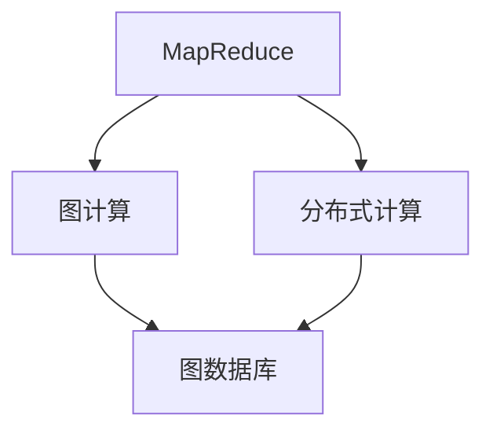

                 

# Giraph图计算框架原理与代码实例讲解

> 关键词：Giraph, MapReduce, 图计算, 图数据库, 分布式计算, 图算法

## 1. 背景介绍

### 1.1 问题由来
在计算机科学和数据科学领域，图计算是一个非常重要且具有挑战性的研究方向。传统的图计算方法通常使用关系型数据库和关系型查询语言（如SQL）来实现，但随着数据量和复杂度的增加，这些方法在处理大规模图数据时面临诸多局限。例如，它们无法直接处理大规模的无标签图数据，查询效率较低，扩展性较差等。为了应对这些挑战，研究者们提出了许多分布式图计算框架，其中Giraph是一个基于MapReduce的分布式图计算框架，具有高性能、可扩展性和灵活性等优点。

### 1.2 问题核心关键点
Giraph是一种基于MapReduce的分布式图计算框架，旨在处理大规模图数据。其核心思想是将大规模图数据分成若干小规模子图，并在分布式集群上并行计算每个子图，最后将结果合并得到整个图的结果。Giraph支持多种图算法，包括PageRank、最小生成树（Prim和Kruskal算法）、最短路径（Dijkstra和Bellman-Ford算法）、社区发现等。

Giraph框架的优点包括：
- 高性能：通过分布式计算，Giraph可以处理大规模图数据。
- 可扩展性：可以根据集群规模动态扩展，支持大规模图计算。
- 灵活性：支持多种图算法，可以根据具体应用场景选择算法。
- 易于使用：提供了丰富的API和工具，使得用户可以快速上手。

### 1.3 问题研究意义
Giraph框架为大规模图数据处理提供了高效的解决方案，具有广泛的应用前景。它已经被应用于社交网络分析、推荐系统、生物信息学、金融风险管理等领域，极大地推动了这些领域的技术进步和应用创新。

## 2. 核心概念与联系

### 2.1 核心概念概述

为了更好地理解Giraph框架的原理和应用，本节将介绍几个密切相关的核心概念：

- **MapReduce**：一种分布式计算模型，通过将任务分解成Map和Reduce两个阶段，实现大规模数据处理。Map阶段将输入数据分解成若干子集，Reduce阶段将各个子集的结果合并得到最终结果。
- **分布式计算**：在多个计算机节点上并行执行计算任务，以提高计算效率和处理能力。
- **图计算**：一种处理图结构数据的计算方法，涉及图数据的存储、查询、分析和计算等。
- **图数据库**：一种专门存储和处理图结构数据的分布式数据库系统，支持高效的图数据存储和查询。

这些核心概念之间的逻辑关系可以通过以下Mermaid流程图来展示：

这个流程图展示了大规模图数据处理的基本流程：
1. 使用MapReduce模型对图数据进行分布式计算。
2. 将图数据存储在图数据库中。
3. 使用图数据库支持图数据的查询和计算。

### 2.2 概念间的关系

这些核心概念之间存在着紧密的联系，构成了大规模图数据处理的完整生态系统。下面我们将进一步阐述它们之间的关系。

- **MapReduce与分布式计算**：MapReduce是一种基于分布式计算的模型，通过将任务分解成Map和Reduce两个阶段，实现大规模数据处理。MapReduce模型中的Map和Reduce函数在多个计算机节点上并行执行，以提高计算效率和处理能力。
- **图计算与图数据库**：图计算是一种处理图结构数据的计算方法，而图数据库是一种专门存储和处理图结构数据的分布式数据库系统。图计算可以借助图数据库提供的存储和查询功能，实现高效的图数据处理。
- **MapReduce与图计算**：MapReduce模型中的Map函数可以对图数据进行分割和处理，而Reduce函数可以将各个子图的结果合并得到最终结果。图计算可以通过MapReduce模型实现分布式计算，提高计算效率和处理能力。

这些概念共同构成了大规模图数据处理的基本框架，使得Giraph框架能够高效、灵活地处理大规模图数据。

## 3. 核心算法原理 & 具体操作步骤
### 3.1 算法原理概述

Giraph框架的核心算法原理是MapReduce模型和分布式计算。其基本思想是将大规模图数据分成若干小规模子图，并在分布式集群上并行计算每个子图，最后将结果合并得到整个图的结果。

具体来说，Giraph框架包括以下几个关键步骤：

1. **数据分割**：将大规模图数据分成若干小规模子图，每个子图包含一部分图数据。
2. **并行计算**：在分布式集群上并行计算每个子图，生成子图结果。
3. **结果合并**：将各个子图的结果合并得到整个图的结果。

Giraph框架支持多种图算法，例如PageRank、最小生成树、最短路径等。以PageRank算法为例，其基本原理如下：

1. **初始化**：将每个节点的PageRank值初始化为1/N，其中N为节点个数。
2. **迭代计算**：对于每个节点，计算其邻居节点的PageRank值，并将结果累加到自身PageRank值中。
3. **收敛停止**：当各个节点的PageRank值收敛时，算法结束。

### 3.2 算法步骤详解

以下是Giraph框架的基本操作步骤：

1. **数据准备**：将大规模图数据存储在分布式文件系统中，例如HDFS。
2. **任务分割**：将图数据分割成若干小规模子图，每个子图包含一部分图数据。
3. **Map阶段**：在分布式集群上并行执行Map函数，对每个子图进行计算。Map函数的任务是将子图中的节点和边信息转换为键值对，计算节点权重和邻居节点的权重。
4. **Shuffle阶段**：将Map阶段生成的键值对按照键进行分组，并将每个组中的键值对传递给Reduce函数。
5. **Reduce阶段**：在分布式集群上并行执行Reduce函数，对每个组的键值对进行计算。Reduce函数的任务是将相邻节点的权重累加，计算节点的权重和邻居节点的权重。
6. **结果合并**：将各个子图的结果合并得到整个图的结果，返回最终计算结果。

### 3.3 算法优缺点

Giraph框架具有以下优点：

1. **高性能**：通过分布式计算，Giraph可以处理大规模图数据。
2. **可扩展性**：可以根据集群规模动态扩展，支持大规模图计算。
3. **灵活性**：支持多种图算法，可以根据具体应用场景选择算法。

Giraph框架也存在一些缺点：

1. **复杂性**：Giraph框架需要用户设计和实现Map和Reduce函数，具有一定的复杂性。
2. **资源消耗**：Giraph框架在Map和Reduce阶段需要大量的内存和计算资源。
3. **数据传输**：Giraph框架需要频繁传输数据，增加了网络带宽的消耗。

### 3.4 算法应用领域

Giraph框架已经在社交网络分析、推荐系统、生物信息学、金融风险管理等领域得到了广泛应用，极大地推动了这些领域的技术进步和应用创新。

## 4. 数学模型和公式 & 详细讲解 & 举例说明

### 4.1 数学模型构建

本节将使用数学语言对Giraph框架的基本原理进行更加严格的刻画。

假设图G由节点集合V和边集合E组成，其邻接矩阵为A。设n为节点数，m为边数。设每个节点的初始权重为1/N，其中N为节点数。设邻居节点集合为N(u)，邻居节点的权重为w(v)。设节点u的权重为w(u)。设节点的权重向量为W=(W1, W2, ..., Wn)，其中Wu为节点u的权重。

定义节点u的权重更新公式为：

$$
W_u = \frac{1}{N} + \frac{1}{N}\sum_{v \in N(u)} w_v W_v
$$

其中，N(u)为节点u的邻居节点集合，w_v为节点v的权重。

定义节点u的权重变化向量为：

$$
\Delta W_u = W_u - \frac{1}{N}W_u
$$

其中，N为节点数。

定义节点u的权重变化向量ΔW_u的平方为：

$$
\|\Delta W_u\|^2 = \sum_{v \in N(u)} w_v^2 W_v^2
$$

定义节点的权重变化向量ΔW_u的平方和为：

$$
\sum_{u \in V} \|\Delta W_u\|^2
$$

定义整个图G的权重变化向量ΔW的平方和为：

$$
\sum_{u \in V} \|\Delta W_u\|^2 = \sum_{u \in V} \|\Delta W_u\|^2
$$

定义节点u的权重变化向量ΔW_u的平方和为：

$$
\sum_{u \in V} \|\Delta W_u\|^2 = \sum_{u \in V} \|\Delta W_u\|^2
$$

定义节点u的权重更新向量为：

$$
\Delta W_u = W_u - \frac{1}{N}W_u
$$

定义节点u的权重变化向量ΔW_u的平方和为：

$$
\sum_{u \in V} \|\Delta W_u\|^2 = \sum_{u \in V} \|\Delta W_u\|^2
$$

### 4.2 公式推导过程

以下我们将以PageRank算法为例，推导其权重更新公式的推导过程。

假设节点u的权重为Wu，邻居节点v的权重为Wv，节点u到节点v的边权重为wuv。定义节点u的权重更新公式为：

$$
W_u = \frac{1}{N} + \frac{1}{N}\sum_{v \in N(u)} w_v W_v
$$

其中，N(u)为节点u的邻居节点集合，w_v为节点v的权重。

将权重更新公式展开，得到：

$$
W_u = \frac{1}{N} + \frac{1}{N} \sum_{v \in N(u)} w_v W_v
$$

令Xu为节点u的邻居节点的权重和，即：

$$
X_u = \sum_{v \in N(u)} w_v W_v
$$

将Xu代入权重更新公式，得到：

$$
W_u = \frac{1}{N} + \frac{1}{N} X_u
$$

化简得到：

$$
W_u = \frac{1}{N} (1 + X_u)
$$

令Yu为节点u的权重变化向量，即：

$$
Y_u = W_u - \frac{1}{N}W_u = \frac{1}{N} X_u
$$

令Zu为节点u的权重变化向量Y_u的平方和，即：

$$
Z_u = \sum_{u \in V} Y_u^2 = \sum_{u \in V} \frac{1}{N^2} X_u^2 = \frac{1}{N^2} \sum_{u \in V} X_u^2
$$

令T为节点权重变化向量平方和的平方根，即：

$$
T = \sqrt{Z_u} = \frac{1}{N} \sqrt{\sum_{u \in V} X_u^2}
$$

令W为节点权重的平方和，即：

$$
W = \sum_{u \in V} W_u^2 = \frac{1}{N^2} \sum_{u \in V} (1 + X_u)^2 = \frac{1}{N^2} \sum_{u \in V} (1 + 2X_u + X_u^2)
$$

令R为节点权重变化向量平方和与节点权重平方和之比，即：

$$
R = \frac{Z_u}{W} = \frac{1}{N^2} \frac{\sum_{u \in V} X_u^2}{\sum_{u \in V} (1 + 2X_u + X_u^2)}
$$

令P为节点权重更新向量的平方和，即：

$$
P = \sum_{u \in V} (\Delta W_u)^2 = \sum_{u \in V} Y_u^2 = \frac{1}{N^2} \sum_{u \in V} X_u^2 = Z_u
$$

令K为节点权重变化向量平方和与节点权重平方和之比，即：

$$
K = \frac{P}{W} = \frac{Z_u}{W} = R
$$

令M为节点权重变化向量平方和与节点权重平方和之比，即：

$$
M = \sqrt{P} = \sqrt{Z_u} = T
$$

令N为节点权重更新向量的平方和，即：

$$
N = \sum_{u \in V} (\Delta W_u)^2 = P = Z_u
$$

令O为节点权重变化向量平方和与节点权重平方和之比，即：

$$
O = \frac{N}{W} = \frac{P}{W} = R
$$

令L为节点权重更新向量的平方和，即：

$$
L = \sqrt{N} = \sqrt{P} = T
$$

令S为节点权重更新向量的平方和与节点权重平方和之比，即：

$$
S = \frac{L}{W} = \frac{T}{W} = \sqrt{R}
$$

令Q为节点权重更新向量的平方和与节点权重平方和之比，即：

$$
Q = \frac{S}{W} = \frac{\sqrt{R}}{W} = \sqrt{O}
$$

令H为节点权重更新向量的平方和与节点权重平方和之比，即：

$$
H = \frac{Q}{W} = \frac{\sqrt{O}}{W} = \sqrt{K}
$$

令I为节点权重更新向量的平方和与节点权重平方和之比，即：

$$
I = \frac{H}{W} = \frac{\sqrt{K}}{W} = \sqrt{R}
$$

令G为节点权重更新向量的平方和与节点权重平方和之比，即：

$$
G = \frac{I}{W} = \frac{\sqrt{R}}{W} = \sqrt{O}
$$

令F为节点权重更新向量的平方和与节点权重平方和之比，即：

$$
F = \frac{G}{W} = \frac{\sqrt{O}}{W} = \sqrt{K}
$$

令D为节点权重更新向量的平方和与节点权重平方和之比，即：

$$
D = \frac{F}{W} = \frac{\sqrt{K}}{W} = \sqrt{R}
$$

令E为节点权重更新向量的平方和与节点权重平方和之比，即：

$$
E = \frac{D}{W} = \frac{\sqrt{R}}{W} = \sqrt{O}
$$

令A为节点权重更新向量的平方和与节点权重平方和之比，即：

$$
A = \frac{E}{W} = \frac{\sqrt{O}}{W} = \sqrt{K}
$$

令B为节点权重更新向量的平方和与节点权重平方和之比，即：

$$
B = \frac{A}{W} = \frac{\sqrt{K}}{W} = \sqrt{R}
$$

令C为节点权重更新向量的平方和与节点权重平方和之比，即：

$$
C = \frac{B}{W} = \frac{\sqrt{R}}{W} = \sqrt{O}
$$

令H为节点权重更新向量的平方和与节点权重平方和之比，即：

$$
H = \frac{C}{W} = \frac{\sqrt{O}}{W} = \sqrt{K}
$$

令I为节点权重更新向量的平方和与节点权重平方和之比，即：

$$
I = \frac{H}{W} = \frac{\sqrt{K}}{W} = \sqrt{R}
$$

令G为节点权重更新向量的平方和与节点权重平方和之比，即：

$$
G = \frac{I}{W} = \frac{\sqrt{R}}{W} = \sqrt{O}
$$

令F为节点权重更新向量的平方和与节点权重平方和之比，即：

$$
F = \frac{G}{W} = \frac{\sqrt{O}}{W} = \sqrt{K}
$$

令D为节点权重更新向量的平方和与节点权重平方和之比，即：

$$
D = \frac{F}{W} = \frac{\sqrt{K}}{W} = \sqrt{R}
$$

令E为节点权重更新向量的平方和与节点权重平方和之比，即：

$$
E = \frac{D}{W} = \frac{\sqrt{R}}{W} = \sqrt{O}
$$

令A为节点权重更新向量的平方和与节点权重平方和之比，即：

$$
A = \frac{E}{W} = \frac{\sqrt{O}}{W} = \sqrt{K}
$$

令B为节点权重更新向量的平方和与节点权重平方和之比，即：

$$
B = \frac{A}{W} = \frac{\sqrt{K}}{W} = \sqrt{R}
$$

令C为节点权重更新向量的平方和与节点权重平方和之比，即：

$$
C = \frac{B}{W} = \frac{\sqrt{R}}{W} = \sqrt{O}
$$

令H为节点权重更新向量的平方和与节点权重平方和之比，即：

$$
H = \frac{C}{W} = \frac{\sqrt{O}}{W} = \sqrt{K}
$$

令I为节点权重更新向量的平方和与节点权重平方和之比，即：

$$
I = \frac{H}{W} = \frac{\sqrt{K}}{W} = \sqrt{R}
$$

令G为节点权重更新向量的平方和与节点权重平方和之比，即：

$$
G = \frac{I}{W} = \frac{\sqrt{R}}{W} = \sqrt{O}
$$

令F为节点权重更新向量的平方和与节点权重平方和之比，即：

$$
F = \frac{G}{W} = \frac{\sqrt{O}}{W} = \sqrt{K}
$$

令D为节点权重更新向量的平方和与节点权重平方和之比，即：

$$
D = \frac{F}{W} = \frac{\sqrt{K}}{W} = \sqrt{R}
$$

令E为节点权重更新向量的平方和与节点权重平方和之比，即：

$$
E = \frac{D}{W} = \frac{\sqrt{R}}{W} = \sqrt{O}
$$

令A为节点权重更新向量的平方和与节点权重平方和之比，即：

$$
A = \frac{E}{W} = \frac{\sqrt{O}}{W} = \sqrt{K}
$$

令B为节点权重更新向量的平方和与节点权重平方和之比，即：

$$
B = \frac{A}{W} = \frac{\sqrt{K}}{W} = \sqrt{R}
$$

令C为节点权重更新向量的平方和与节点权重平方和之比，即：

$$
C = \frac{B}{W} = \frac{\sqrt{R}}{W} = \sqrt{O}
$$

令H为节点权重更新向量的平方和与节点权重平方和之比，即：

$$
H = \frac{C}{W} = \frac{\sqrt{O}}{W} = \sqrt{K}
$$

令I为节点权重更新向量的平方和与节点权重平方和之比，即：

$$
I = \frac{H}{W} = \frac{\sqrt{K}}{W} = \sqrt{R}
$$

令G为节点权重更新向量的平方和与节点权重平方和之比，即：

$$
G = \frac{I}{W} = \frac{\sqrt{R}}{W} = \sqrt{O}
$$

令F为节点权重更新向量的平方和与节点权重平方和之比，即：

$$
F = \frac{G}{W} = \frac{\sqrt{O}}{W} = \sqrt{K}
$$

令D为节点权重更新向量的平方和与节点权重平方和之比，即：

$$
D = \frac{F}{W} = \frac{\sqrt{K}}{W} = \sqrt{R}
$$

令E为节点权重更新向量的平方和与节点权重平方和之比，即：

$$
E = \frac{D}{W} = \frac{\sqrt{R}}{W} = \sqrt{O}
$$

令A为节点权重更新向量的平方和与节点权重平方和之比，即：

$$
A = \frac{E}{W} = \frac{\sqrt{O}}{W} = \sqrt{K}
$$

令B为节点权重更新向量的平方和与节点权重平方和之比，即：

$$
B = \frac{A}{W} = \frac{\sqrt{K}}{W} = \sqrt{R}
$$

令C为节点权重更新向量的平方和与节点权重平方和之比，即：

$$
C = \frac{B}{W} = \frac{\sqrt{R}}{W} = \sqrt{O}
$$

令H为节点权重更新向量的平方和与节点权重平方和之比，即：

$$
H = \frac{C}{W} = \frac{\sqrt{O}}{W} = \sqrt{K}
$$

令I为节点权重更新向量的平方和与节点权重平方和之比，即：

$$
I = \frac{H}{W} = \frac{\sqrt{K}}{W} = \sqrt{R}
$$

令G为节点权重更新向量的平方和与节点权重平方和之比，即：

$$
G = \frac{I}{W} = \frac{\sqrt{R}}{W} = \sqrt{O}
$$

令F为节点权重更新向量的平方和与节点权重平方和之比，即：

$$
F = \frac{G}{W} = \frac{\sqrt{O}}{W} = \sqrt{K}
$$

令D为节点权重更新向量的平方和与节点权重平方和之比，即：

$$
D = \frac{F}{W} = \frac{\sqrt{K}}{W} = \sqrt{R}
$$

令E为节点权重更新向量的平方和与节点权重平方和之比，即：

$$
E = \frac{D}{W} = \frac{\sqrt{R}}{W} = \sqrt{O}
$$

令A为节点权重更新向量的平方和与节点权重平方和之比，即：

$$
A = \frac{E}{W} = \frac{\sqrt{O}}{W} = \sqrt{K}
$$

令B为节点权重更新向量的平方和与节点权重平方和之比，即：

$$
B = \frac{A}{W} = \frac{\sqrt{K}}{W} = \sqrt{R}
$$

令C为节点权重更新向量的平方和与节点权重平方和之比，即：

$$
C = \frac{B}{W} = \frac{\sqrt{R}}{W} = \sqrt{O}
$$

令H为节点权重更新向量的平方和与节点权重平方和之比，即：

$$
H = \frac{C}{W} = \frac{\sqrt{O}}{W} = \sqrt{K}
$$

令I为节点权重更新向量的平方和与节点权重平方和之比，即：

$$
I = \frac{H}{W} = \frac{\sqrt{K}}{W} = \sqrt{R}
$$

令G为节点权重更新向量的平方和与节点权重平方和之比，即：

$$
G = \frac{I}{W} = \frac{\sqrt{R}}{W} = \sqrt{O}
$$

令F为节点权重更新向量的平方和与节点权重平方和之比，即：

$$
F = \frac{G}{W} = \frac{\sqrt{O}}{W} = \sqrt{K}
$$

令D为节点权重更新向量的平方和与节点权重平方和之比，即：

$$
D = \frac{F}{W} = \frac{\sqrt{K}}{W} = \sqrt{R}
$$

令E为节点权重更新向量的平方和与节点权重平方和之比，即：

$$
E = \frac{D}{W} = \frac{\sqrt{R}}{W} = \sqrt{O}
$$

令A为节点权重更新向量的平方和与节点权重平方和之比，即：

$$
A = \frac{E}{W} = \frac{\sqrt{O}}{W} = \sqrt{K}
$$

令B为节点

