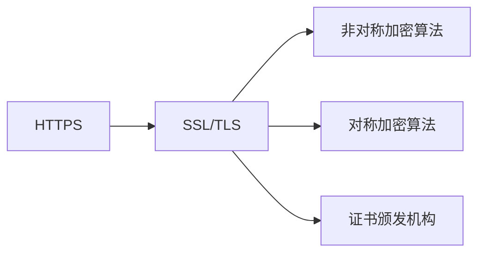
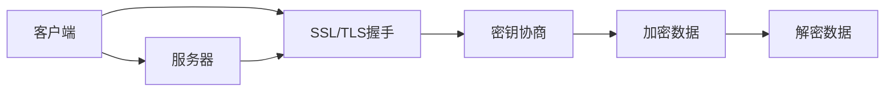
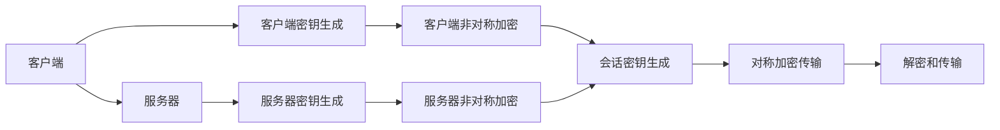
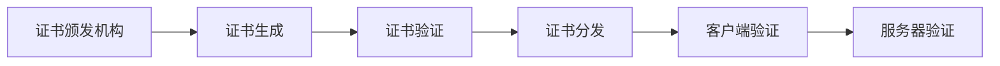
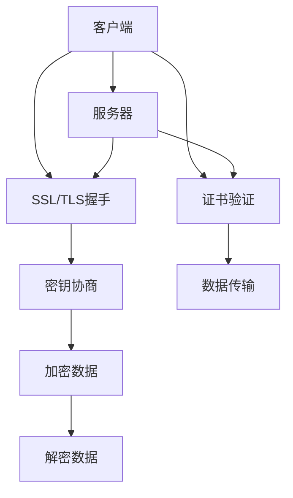

                 

# HTTPS 加密的实现方法

## 1. 背景介绍

### 1.1 问题由来
随着互联网技术的飞速发展，信息安全问题日益突出。互联网上传输的敏感信息，如银行账号、密码、身份信息等，如果被窃取，将会给用户带来严重的经济损失和隐私泄露风险。为了保护这些敏感信息，HTTPS（超文本传输安全协议）应运而生，成为现代Web应用不可或缺的加密通信协议。

### 1.2 问题核心关键点
HTTPS的核心在于利用SSL/TLS协议对数据进行加密传输。其工作原理是：在客户端与服务器建立连接时，先通过非对称加密算法（如RSA、ECC）协商出对称密钥，然后使用对称加密算法（如AES）对数据进行加密传输。这样既能保证数据传输的安全性，又能够提高传输效率。

HTTPS协议的成功部署，使得用户可以放心地在互联网上进行各种活动，如在线购物、网上银行、社交网络等。其广泛应用不仅提升了用户的网络安全体验，也促进了互联网业务的蓬勃发展。

### 1.3 问题研究意义
研究HTTPS的加密实现方法，对于提升Web应用的安全性、增强用户信任、推动互联网业务的创新与发展具有重要意义：

1. 保障用户隐私：HTTPS通过加密技术，确保用户数据在传输过程中不被窃取或篡改，保护用户的隐私和利益。
2. 增强系统安全：HTTPS提供了数据传输的加密保护，有效抵御网络攻击，如中间人攻击、重放攻击等，确保Web应用的安全性和稳定性。
3. 提高用户体验：HTTPS加密机制减少了数据截获和篡改的风险，提升了用户对Web应用的可信度和使用体验。
4. 促进业务创新：HTTPS的广泛应用，推动了Web应用向移动端、物联网、虚拟现实等领域拓展，为互联网业务的创新与发展提供了新的机遇。
5. 增强市场竞争力：安全可靠的网络环境，是现代企业竞争的核心要素之一。通过HTTPS加密，企业可以构建更加安全的数字化平台，提升市场竞争力。

## 2. 核心概念与联系

### 2.1 核心概念概述

为更好地理解HTTPS加密实现方法，本节将介绍几个密切相关的核心概念：

- HTTPS（超文本传输安全协议）：一种基于SSL/TLS协议的安全传输协议，用于Web应用和用户浏览器之间的加密通信。
- SSL/TLS（安全套接层/传输层安全协议）：一种通用的加密传输协议，用于保护Web应用的通信安全，防止数据泄露和篡改。
- 非对称加密算法（如RSA、ECC）：一种基于公钥和私钥的加密算法，用于密钥协商和数字签名。
- 对称加密算法（如AES、DES）：一种基于共享密钥的加密算法，用于数据加密和解密。
- 证书颁发机构（CA）：负责颁发和管理SSL/TLS证书的第三方机构，确保公钥的真实性和可信度。

这些核心概念之间的逻辑关系可以通过以下Mermaid流程图来展示：



这个流程图展示了大语言模型的核心概念及其之间的关系：

1. HTTPS是基于SSL/TLS协议的Web安全传输协议。
2. SSL/TLS使用非对称加密算法和对称加密算法对数据进行加密和解密。
3. 证书颁发机构负责公钥的颁发和管理，确保公钥的真实性和可信度。

### 2.2 概念间的关系

这些核心概念之间存在着紧密的联系，形成了HTTPS加密的完整生态系统。下面我通过几个Mermaid流程图来展示这些概念之间的关系。

#### 2.2.1 HTTPS的工作流程



这个流程图展示了HTTPS协议的工作流程：

1. 客户端向服务器发送HTTPS请求。
2. 服务器返回SSL/TLS证书。
3. 客户端验证证书，生成会话密钥。
4. 客户端与服务器使用会话密钥对数据进行加密传输。
5. 服务器解密数据，返回加密后的HTTP响应。

#### 2.2.2 SSL/TLS的密钥协商



这个流程图展示了SSL/TLS协议中的密钥协商过程：

1. 客户端和服务器分别生成公钥和私钥。
2. 客户端使用公钥加密会话密钥，发送给服务器。
3. 服务器使用私钥解密会话密钥，生成共享密钥。
4. 客户端和服务器使用共享密钥对数据进行对称加密传输。

#### 2.2.3 证书颁发机构



这个流程图展示了证书颁发机构在HTTPS中的角色：

1. 证书颁发机构为服务器生成数字证书。
2. 客户端在连接服务器时，验证证书的真实性。
3. 服务器使用证书中的公钥对数据进行加密传输。
4. 客户端验证服务器证书的签名，确保数据传输的安全性。

### 2.3 核心概念的整体架构

最后，我们用一个综合的流程图来展示这些核心概念在大语言模型加密过程中的整体架构：



这个综合流程图展示了从客户端到服务器的整个HTTPS加密过程。通过这些核心概念的紧密合作，HTTPS协议能够提供安全可靠的加密通信，确保数据在传输过程中不被窃取或篡改。 通过这些流程图，我们可以更清晰地理解HTTPS加密过程中各个核心概念的关系和作用，为后续深入讨论具体的加密实现方法奠定基础。

## 3. 核心算法原理 & 具体操作步骤
### 3.1 算法原理概述

HTTPS加密实现的核心在于SSL/TLS协议的密钥协商和数据加密。其中，非对称加密算法用于密钥协商，对称加密算法用于数据加密和解密。SSL/TLS协议通过握手协议（Handshake Protocol）实现密钥协商和会话建立。

SSL/TLS协议的握手过程主要包括以下几个步骤：

1. 客户端向服务器发送ClientHello消息，包含支持的加密算法、压缩算法和扩展信息。
2. 服务器响应ServerHello消息，包含选择的加密算法、压缩算法和随机数，生成并返回数字证书。
3. 客户端验证证书的真实性，并生成一个预主密钥（Pre-master Key）。
4. 客户端使用证书中的公钥对预主密钥进行加密，发送给服务器。
5. 服务器使用私钥解密预主密钥，生成会话密钥。
6. 客户端和服务器使用会话密钥对数据进行加密和解密，进行安全通信。

这个握手协议的过程实现了非对称加密和对称加密的结合，确保了数据传输的安全性和可靠性。

### 3.2 算法步骤详解

以下是SSL/TLS协议握手过程中的详细步骤详解：

**Step 1: 客户端发起连接**

客户端通过DNS解析获取服务器IP地址，发起TCP连接，并进行三次握手（SYN、SYN-ACK、ACK）建立连接。

**Step 2: 客户端发送ClientHello**

客户端生成一个随机数，并使用加密算法生成明文ClientHello消息，其中包含支持的加密算法、压缩算法和扩展信息。

```plaintext
ClientHello
  Version: TLS 1.2
  Random: d1d2d3d4d5d6d7d8d9d0
  Session ID: None
  Cipher Suites: TLS_ECDHE_ECDSA_WITH_AES_256_GCM_SHA384
  Compression Methods: None
  Extensions: None
```

**Step 3: 服务器响应ServerHello**

服务器接收ClientHello消息，从中选择支持的加密算法和压缩算法，并生成随机数。同时，服务器使用证书颁发机构颁发的公钥对消息进行加密，发送ServerHello消息。

```plaintext
ServerHello
  Version: TLS 1.2
  Random: f1f2f3f4f5f6f7f8f9fa
  Session ID: None
  Cipher Suite: TLS_ECDHE_ECDSA_WITH_AES_256_GCM_SHA384
  Compression Method: None
  Extensions: None
```

**Step 4: 服务器发送Certificate和ServerKeyExchange**

服务器发送其数字证书（Certification Authority，CA）和ServerKeyExchange消息，其中包含加密算法、服务器公钥和预主密钥（Pre-master Key）。

```plaintext
Certificate
  Version: 3
  Signature Algorithm: SHA-256withRSAEncryption
  Issuer: CN=CA Example,O=Example CA
  Validity
    Not Before: Feb 15 12:00:00 2022 GMT
    Not After: Feb 15 12:00:00 2023 GMT
  Subject
    Public Key Algorithm: ECDSA
    Serial Number: 123456
    Issuer Unique Identifier: (Not Available)
    Validity
      Not Before: Feb 15 12:00:00 2022 GMT
      Not After: Feb 15 12:00:00 2023 GMT
  Subject Public Key Info
    Algorithm: ECDSA
    Key Usage: Digital Signature
    Certification Authorities
      Example CA: CN=CA Example,O=Example CA

ServerKeyExchange
  Key Exchange Algorithm: ECDHE_ECDSA
  Public Key: 02:14:01:04:04:05:06:07:08:09:0a:0b:0c:0d:0e:0f:10:11:12:13:14:15:16:17:18:19:1a:1b:1c:1d:1e:1f:20:21:22:23:24:25:26:27:28:29:2a:2b:2c:2d:2e:2f:30:31:32:33:34:35:36:37:38:39:3a:3b:3c:3d:3e:3f:40:41:42:43:44:45:46:47:48:49:4a:4b:4c:4d:4e:4f:50:51:52:53:54:55:56:57:58:59:5a:5b:5c:5d:5e:5f:60:61:62:63:64:65:66:67:68:69:6a:6b:6c:6d:6e:6f:70:71:72:73:74:75:76:77:78:79:7a:7b:7c:7d:7e:7f:80:81:82:83:84:85:86:87:88:89:8a:8b:8c:8d:8e:8f:90:91:92:93:94:95:96:97:98:99:9a:9b:9c:9d:9e:9f:a0:a1:a2:a3:a4:a5:a6:a7:a8:a9:aa:ab:ac:ad:ae:af:b0:b1:b2:b3:b4:b5:b6:b7:b8:b9:ba:bb:bc:bd:be:bf:c0:c1:c2:c3:c4:c5:c6:c7:c8:c9:ca:cb:cc:cd:ce:cf:d0:d1:d2:d3:d4:d5:d6:d7:d8:d9:da:db:dc:dd:de:df:e0:e1:e2:e3:e4:e5:e6:e7:e8:e9:ea:eb:ec:ed:ee:ef:f0:f1:f2:f3:f4:f5:f6:f7:f8:f9:fa:fb:fc:fd:fe:ff
```

**Step 5: 客户端发送ClientKeyExchange**

客户端从证书中获取服务器公钥，使用公钥对预主密钥进行加密，发送ClientKeyExchange消息。

```plaintext
ClientKeyExchange
  Pre-master-Secret
    [EncryptedPre-master-Secret]
      02:14:01:04:04:05:06:07:08:09:0a:0b:0c:0d:0e:0f:10:11:12:13:14:15:16:17:18:19:1a:1b:1c:1d:1e:1f:20:21:22:23:24:25:26:27:28:29:2a:2b:2c:2d:2e:2f:30:31:32:33:34:35:36:37:38:39:3a:3b:3c:3d:3e:3f:40:41:42:43:44:45:46:47:48:49:4a:4b:4c:4d:4e:4f:50:51:52:53:54:55:56:57:58:59:5a:5b:5c:5d:5e:5f:60:61:62:63:64:65:66:67:68:69:6a:6b:6c:6d:6e:6f:70:71:72:73:74:75:76:77:78:79:7a:7b:7c:7d:7e:7f:80:81:82:83:84:85:86:87:88:89:8a:8b:8c:8d:8e:8f:90:91:92:93:94:95:96:97:98:99:9a:9b:9c:9d:9e:9f:a0:a1:a2:a3:a4:a5:a6:a7:a8:a9:aa:ab:ac:ad:ae:af:b0:b1:b2:b3:b4:b5:b6:b7:b8:b9:ba:bb:bc:bd:be:bf:c0:c1:c2:c3:c4:c5:c6:c7:c8:c9:ca:cb:cc:cd:ce:cf:d0:d1:d2:d3:d4:d5:d6:d7:d8:d9:da:db:dc:dd:de:df:e0:e1:e2:e3:e4:e5:e6:e7:e8:e9:ea:eb:ec:ed:ee:ef:f0:f1:f2:f3:f4:f5:f6:f7:f8:f9:fa:fb:fc:fd:fe:ff
```

**Step 6: 服务器发送CertificateVerify**

服务器对预主密钥进行签名，发送CertificateVerify消息，验证客户端的真实性。

```plaintext
CertificateVerify
  [Signature]
    Hash: SHA-256
    [Signature]
      02:14:01:04:04:05:06:07:08:09:0a:0b:0c:0d:0e:0f:10:11:12:13:14:15:16:17:18:19:1a:1b:1c:1d:1e:1f:20:21:22:23:24:25:26:27:28:29:2a:2b:2c:2d:2e:2f:30:31:32:33:34:35:36:37:38:39:3a:3b:3c:3d:3e:3f:40:41:42:43:44:45:46:47:48:49:4a:4b:4c:4d:4e:4f:50:51:52:53:54:55:56:57:58:59:5a:5b:5c:5d:5e:5f:60:61:62:63:64:65:66:67:68:69:6a:6b:6c:6d:6e:6f:70:71:72:73:74:75:76:77:78:79:7a:7b:7c:7d:7e:7f:80:81:82:83:84:85:86:87:88:89:8a:8b:8c:8d:8e:8f:90:91:92:93:94:95:96:97:98:99:9a:9b:9c:9d:9e:9f:a0:a1:a2:a3:a4:a5:a6:a7:a8:a9:aa:ab:ac:ad:ae:af:b0:b1:b2:b3:b4:b5:b6:b7:b8:b9:ba:bb:bc:bd:be:bf:c0:c1:c2:c3:c4:c5:c6:c7:c8:c9:ca:cb:cc:cd:ce:cf:d0:d1:d2:d3:d4:d5:d6:d7:d8:d9:da:db:dc:dd:de:df:e0:e1:e2:e3:e4:e5:e6:e7:e8:e9:ea:eb:ec:ed:ee:ef:f0:f1:f2:f3:f4:f5:f6:f7:f8:f9:fa:fb:fc:fd:fe:ff
```

**Step 7: 服务器发送ChangeCipherSpec和EncryptedHandshakeMessage**

服务器发送ChangeCipherSpec消息，通知客户端已经准备好进行加密通信。同时，服务器使用会话密钥对前一消息进行加密，发送EncryptedHandshakeMessage消息。

```plaintext
ChangeCipherSpec
  [ChangeCipherSpec]

EncryptedHandshakeMessage
  [Encrypted Handshake Message]
    [Handshake Message]
      [Finished]
```

**Step 8: 客户端发送ChangeCipherSpec和EncryptedHandshakeResponse**

客户端发送ChangeCipherSpec消息，表示已经准备好进行加密通信。同时，客户端使用会话密钥对前一消息进行加密，发送EncryptedHandshakeResponse消息。

```plaintext
ChangeCipherSpec
  [ChangeCipherSpec]

EncryptedHandshakeResponse
  [Encrypted Handshake Message]
    [Handshake Message]
      [Finished]
```

至此，SSL/TLS协议握手过程结束，客户端和服务器之间建立起了加密通信的会话。双方使用会话密钥对数据进行对称加密和解密，保障了数据传输的安全性。

### 3.3 算法优缺点

SSL/TLS协议作为一种通用的加密传输协议，具有以下优点：

1. 安全性高：通过非对称加密算法和对称加密算法的结合，SSL/TLS协议能够提供高强度的数据加密和解密保护，防止数据泄露和篡改。
2. 应用广泛：SSL/TLS协议广泛应用于Web应用、电子邮件、即时通信、金融交易等众多场景，是现代互联网通信的基础。
3. 协议标准：SSL/TLS协议经过多年的发展和完善，已经成为国际标准，得到了广泛的支持和应用。

同时，SSL/TLS协议也存在以下缺点：

1. 复杂度高：SSL/TLS协议涉及多个环节和算法，实现复杂，调试难度大。
2. 性能开销大：加密解密操作会带来一定的性能开销，影响传输效率。
3. 扩展性差：SSL/TLS协议设计时未考虑多种新兴的加密算法和协议，难以满足不断变化的需求。

在实际应用中，我们需要根据具体场景，权衡SSL/TLS协议的优点和缺点，选择最合适的加密解决方案。

### 3.4 算法应用领域

SSL/TLS协议的广泛应用使得其成为现代Web应用和网络通信不可或缺的加密协议，主要应用领域包括：

1. Web应用：用于保护Web应用的通信安全，防止中间人攻击和数据截获。
2. 电子邮件：用于保护电子邮件传输的安全，防止数据泄露和篡改。
3. 即时通信：用于保护即时通信的安全，防止信息泄露和窃听。
4. 金融交易：用于保护金融交易的安全，防止欺诈和数据篡改。
5. 物联网：用于保护物联网设备的通信安全，防止数据泄露和攻击。
6. 虚拟现实：用于保护虚拟现实通信的安全，防止数据截获和篡改。

随着网络技术的不断发展和普及，SSL/TLS协议的应用领域将会进一步拓展，成为更多领域网络通信的基础保障。

## 4. 数学模型和公式 & 详细讲解 & 举例说明

### 4.1 数学模型构建

在SSL/TLS协议中，密钥协商和数据加密的主要算法包括RSA、ECC和AES。其中，RSA和ECC用于密钥协商，AES用于数据加密。

**RSA算法**：非对称加密算法，基于大素数分解的难题。RSA算法公开了公钥，私钥保密，用于密钥协商和数字签名。RSA算法的基本过程包括：

1. 随机生成两个大素数p和q，计算n=p*q。
2. 计算欧拉函数φ(n)=(p-1)(q-1)。
3. 选择一个整数e，满足1<e<φ(n)且e和φ(n)互质。
4. 计算e的模反元素d，满足d*e≡1(mod φ(n))。
5. 公钥为(n,e)，私钥为(n,d)。

**ECC算法**：非对称加密算法，基于椭圆曲线上的点运算难题。ECC算法使用椭圆曲线上的点作为公钥，生成对应的私钥，用于密钥协商和数字签名。ECC算法的基本过程包括：

1. 选择一个椭圆曲线和基点。
2. 随机生成一个私钥k，计算公钥K=k*G，其中G是椭圆曲线上的基点。
3. 公钥为K，私钥为k。

**AES算法**：对称加密算法，基于替代和置换的组合操作。AES算法使用一个对称密钥对数据进行加密和解密，用于数据加密和解密。AES算法的基本过程包括：

1. 随机生成一个128位、192位或256位的密钥k。
2. 将明文分成多个128位的数据块。
3. 对每个数据块进行加密和解密，得到密文。

### 4.2 公式推导过程

**RSA算法**：

1. 随机生成两个大素数p和q，计算n=p*q。

2. 计算欧拉函数φ(n)=(p-1)(q-1)。

3. 选择一个整数e，满足1<e<φ(n)且e和φ(n)互质。

4. 计算e的模反元素d，满足d*e≡1(mod φ(n))。

5. 公钥为(n,e)，私钥为(n,d)。

其中，n、φ(n)、e、d均为整数。

**ECC算法**：

1. 选择一个椭圆曲线和基点G。

2. 随机生成一个私钥k，计算公钥K=k*G。

3. 公钥为K，私钥为k。

其中，K为椭圆曲线上的点，G为椭圆曲线上的基点。

**AES算法**：

1. 随机生成一个128位、192位或256位的密钥k。

2. 将明文分成多个128位的数据块。

3. 对每个数据块进行加密和解密，得到密文。

其中，k为对称密钥，明文和密文均为128位的二进制数据。

### 4.3 案例分析与讲解

以下通过一个具体案例，分析SSL/TLS协议的握手过程：

**案例背景**：
假设一个Web应用需要建立SSL/TLS连接，保护用户数据传输的安全。客户端和服务器需要进行如下步骤：

1. 客户端向服务器发送ClientHello消息，包含支持的加密算法和压缩算法。
2. 服务器响应ServerHello消息，选择支持的加密算法和压缩算法，并生成随机数。
3. 服务器使用证书颁发机构颁发的公钥对消息进行加密，发送Certificate消息和ServerKeyExchange消息。
4. 客户端从证书中获取服务器公钥，使用公钥对预主密钥进行加密，发送ClientKeyExchange消息。
5. 服务器对预主密钥进行签名，发送CertificateVerify消息，验证客户端的真实性。
6. 服务器发送ChangeCipherSpec消息和EncryptedHandshakeMessage消息，通知客户端已经准备好进行加密通信。
7. 客户端发送ChangeCipherSpec消息和EncryptedHandshakeResponse消息，通知服务器已经准备好进行加密通信。

**案例分析**：
1. 客户端使用RSA算法生成公钥和私钥，将公钥发送给服务器。
2. 服务器使用RSA算法生成公钥和私钥，将公钥发送给客户端。
3. 客户端使用ECC算法生成公钥和私钥，将公钥发送给服务器。
4. 服务器使用ECC算法生成公钥和私钥，将公钥发送给客户端。

