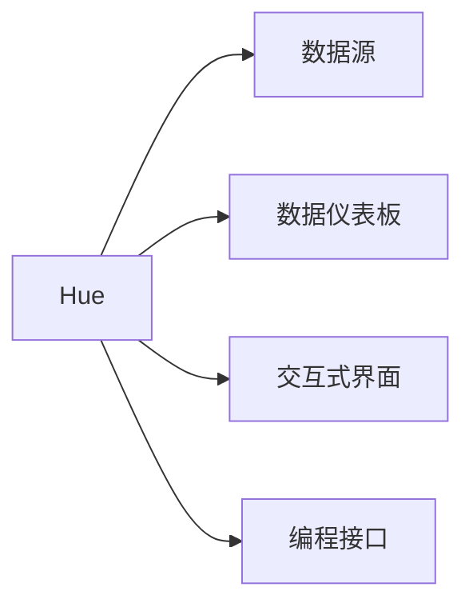
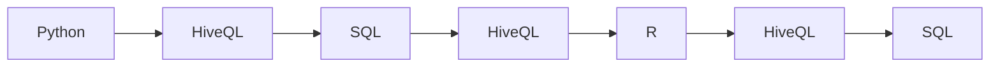
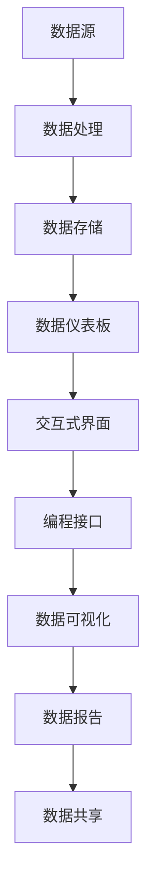

                 

# Hue原理与代码实例讲解

## 1. 背景介绍

Hue是一款由Facebook开发的开源可视化工具，用于帮助数据分析师和科学家进行数据探索、可视化和分析。Hue基于Hadoop生态系统，可以轻松连接到各种数据源，如HDFS、S3、PostgreSQL、MySQL、MongoDB等，提供丰富的数据处理和可视化功能。Hue的直观界面使得用户能够快速上手，实现复杂的数据处理和分析任务。

### 1.1 问题由来

在传统的数据处理和分析中，数据分析师和科学家往往需要编写大量的SQL脚本和复杂的数据处理代码，进行数据清洗、转换、聚合等操作。这些过程不仅耗时耗力，而且容易出错，导致分析结果不准确。此外，由于数据量大、结构复杂，手动操作往往难以有效地进行数据分析和可视化。

为了解决这些问题，Facebook推出了Hue。Hue将数据处理和可视化过程简化了大量繁琐的手动操作，使得用户可以更加高效、准确地进行数据分析。Hue的出现，标志着数据处理和分析工具向更直观、更易用、更智能的方向发展。

### 1.2 问题核心关键点

Hue的核心在于其直观的用户界面和丰富的功能，使得用户能够快速、准确地进行数据处理和分析。Hue支持多种数据源，能够轻松地连接、查询和分析各种类型的数据。同时，Hue提供了强大的可视化功能，用户可以通过多种图表形式展示数据，从而更好地理解和分析数据。

Hue还提供了多种交互式界面，如大数据、机器学习、数据仪表板等，帮助用户快速进行数据分析和决策支持。Hue还支持多种编程语言，如Python、R、SQL等，方便用户将数据分析结果集成到应用程序中。

## 2. 核心概念与联系

### 2.1 核心概念概述

为了更好地理解Hue的工作原理和应用场景，本节将介绍几个密切相关的核心概念：

- Hue：由Facebook开发的数据处理和可视化工具，支持多种数据源，提供丰富的数据处理和可视化功能。
- 数据源：Hue支持各种类型的数据源，如HDFS、S3、PostgreSQL、MySQL、MongoDB等，用户可以通过Hue轻松连接各种数据源，进行数据查询和分析。
- 数据仪表板：Hue提供了强大的可视化界面，用户可以通过多种图表形式展示数据，帮助用户更好地理解和分析数据。
- 交互式界面：Hue提供了多种交互式界面，如大数据、机器学习等，帮助用户快速进行数据分析和决策支持。
- 编程接口：Hue支持多种编程语言，如Python、R、SQL等，方便用户将数据分析结果集成到应用程序中。

这些核心概念之间的逻辑关系可以通过以下Mermaid流程图来展示：



这个流程图展示了Hue的核心概念及其之间的关系：

1. Hue作为主要的数据处理和可视化工具，支持各种数据源。
2. 数据仪表板提供强大的可视化功能，帮助用户理解数据。
3. 交互式界面提供多种交互式功能，帮助用户快速进行数据分析和决策支持。
4. 编程接口支持多种编程语言，方便用户将数据分析结果集成到应用程序中。

### 2.2 概念间的关系

这些核心概念之间存在着紧密的联系，形成了Hue的整体功能架构。下面我们通过几个Mermaid流程图来展示这些概念之间的关系。

#### 2.2.1 Hue的数据处理流程


这个流程图展示了Hue的数据处理流程：

1. 用户通过Hue连接各种数据源，将数据导入Hue中。
2. Hue对数据进行清洗、转换和聚合等处理，并将处理结果存储在Hue的数据仓库中。
3. 用户通过数据仪表板对数据进行可视化展示，从而更好地理解数据。
4. 用户通过交互式界面进行数据分析和决策支持。
5. 用户可以通过编程接口将数据分析结果集成到应用程序中。

#### 2.2.2 Hue的编程接口



这个流程图展示了Hue支持的编程接口：

1. Hue支持Python编程语言，提供丰富的数据处理和分析API。
2. HiveQL和SQL是Hue常用的数据处理语言，方便用户进行复杂的数据处理和分析。
3. R语言是Hue支持的另一种编程语言，方便用户进行统计分析和可视化。
4. HiveQL和SQL在Hue中都是通用的数据处理语言，用户可以根据需求选择不同的数据处理语言。

### 2.3 核心概念的整体架构

最后，我们用一个综合的流程图来展示这些核心概念在大数据处理中的整体架构：



这个综合流程图展示了Hue在大数据处理中的整体架构：

1. 用户通过Hue连接各种数据源，将数据导入Hue中。
2. Hue对数据进行清洗、转换和聚合等处理，并将处理结果存储在Hue的数据仓库中。
3. 用户通过数据仪表板对数据进行可视化展示，从而更好地理解数据。
4. 用户通过交互式界面进行数据分析和决策支持。
5. 用户可以通过编程接口将数据分析结果集成到应用程序中。
6. 用户可以通过数据可视化进行数据分析和报告生成。
7. 用户可以通过数据共享机制，将数据和分析结果分享给其他用户。

## 3. 核心算法原理 & 具体操作步骤

### 3.1 算法原理概述

Hue的核心算法原理主要包括以下几个方面：

1. 数据连接和查询：Hue支持各种类型的数据源，能够轻松连接各种数据源，进行数据查询和分析。
2. 数据处理和清洗：Hue提供了多种数据处理功能，如数据转换、聚合、过滤等，帮助用户快速进行数据清洗和处理。
3. 数据可视化：Hue提供了多种图表形式，如条形图、折线图、散点图等，帮助用户更好地理解和分析数据。
4. 交互式界面：Hue提供了多种交互式界面，如大数据、机器学习等，帮助用户快速进行数据分析和决策支持。
5. 编程接口：Hue支持多种编程语言，如Python、R、SQL等，方便用户将数据分析结果集成到应用程序中。

### 3.2 算法步骤详解

Hue的数据处理和分析过程主要包括以下几个步骤：

1. 连接数据源：用户通过Hue连接各种数据源，将数据导入Hue中。
2. 数据清洗和转换：Hue对数据进行清洗、转换和聚合等处理，并将处理结果存储在Hue的数据仓库中。
3. 数据可视化：用户通过数据仪表板对数据进行可视化展示，从而更好地理解数据。
4. 交互式分析：用户通过交互式界面进行数据分析和决策支持。
5. 编程集成：用户可以通过编程接口将数据分析结果集成到应用程序中。

### 3.3 算法优缺点

Hue作为一种数据处理和可视化工具，具有以下优点：

1. 直观易用：Hue提供了直观的用户界面，用户可以轻松进行数据处理和分析。
2. 支持多种数据源：Hue支持各种类型的数据源，用户可以通过Hue轻松连接各种数据源，进行数据查询和分析。
3. 强大的可视化功能：Hue提供了多种图表形式，帮助用户更好地理解和分析数据。
4. 丰富的交互式功能：Hue提供了多种交互式界面，帮助用户快速进行数据分析和决策支持。
5. 支持多种编程语言：Hue支持多种编程语言，方便用户将数据分析结果集成到应用程序中。

Hue也存在一些缺点：

1. 学习成本较高：Hue的可视化界面虽然直观易用，但对于一些复杂的数据处理和分析任务，需要一定的学习成本。
2. 处理大批量数据时速度较慢：Hue在处理大批量数据时，速度可能较慢，需要一定的优化和调整。
3. 数据处理能力有限：Hue的数据处理能力有限，对于一些复杂的数据处理任务，可能需要进行额外的处理。

### 3.4 算法应用领域

Hue作为一种数据处理和可视化工具，已经在多个领域得到了广泛的应用，例如：

- 数据分析：Hue可以用于各种类型的数据分析任务，如市场分析、客户分析、财务分析等。
- 数据可视化：Hue提供强大的可视化功能，可以用于展示数据趋势、数据关系等，帮助用户更好地理解数据。
- 决策支持：Hue提供多种交互式界面，可以用于数据预测、数据决策等，帮助用户进行决策支持。
- 机器学习：Hue提供丰富的机器学习接口，可以用于训练机器学习模型，进行数据预测和分类。
- 数据治理：Hue提供多种数据治理功能，如数据清理、数据标注等，帮助用户进行数据治理。

## 4. 数学模型和公式 & 详细讲解 & 举例说明

### 4.1 数学模型构建

在Hue中，数据的处理和分析过程主要包括以下几个数学模型：

1. 数据连接和查询：Hue通过SQL语言进行数据连接和查询，SQL语言是Hue最常用的数据处理语言。
2. 数据处理和清洗：Hue提供多种数据处理函数，如数据转换、聚合、过滤等，帮助用户进行数据清洗和处理。
3. 数据可视化：Hue提供多种图表形式，如条形图、折线图、散点图等，帮助用户更好地理解和分析数据。
4. 交互式分析：Hue提供多种交互式界面，如大数据、机器学习等，帮助用户快速进行数据分析和决策支持。
5. 编程接口：Hue支持多种编程语言，如Python、R、SQL等，方便用户将数据分析结果集成到应用程序中。

### 4.2 公式推导过程

在Hue中，数据处理和分析的过程主要依赖于SQL语言和HiveQL语言，以下以SQL语言为例，进行公式推导过程的讲解：

假设用户需要查询某公司近一年的销售额数据，并计算出每个月的销售额总和，代码如下：

```sql
SELECT 
    DATE_FORMAT(销售日期, '%Y-%m') AS month,
    SUM(销售额) AS total_sales
FROM 
    销售数据表
WHERE 
    销售日期 >= '2021-01-01' AND 销售日期 <= '2022-12-31'
GROUP BY 
    month
ORDER BY 
    month DESC
```

以上SQL语句实现了以下数学模型：

- 数据连接：连接销售数据表，获取销售数据。
- 数据处理和清洗：通过WHERE语句过滤出近一年的销售数据，通过GROUP BY语句按照月份进行分组。
- 数据可视化：通过SELECT语句计算出每个月的销售额总和，进行可视化展示。
- 交互式分析：用户可以通过Hue的交互式界面，对查询结果进行进一步分析。

### 4.3 案例分析与讲解

假设某电商平台需要分析用户购买行为，并预测未来销售额，可以采用以下步骤：

1. 数据连接：连接用户数据表、订单数据表、商品数据表等，获取用户购买行为数据。
2. 数据处理和清洗：对用户购买行为数据进行清洗、转换和聚合等处理。
3. 数据可视化：通过可视化界面，展示用户购买行为趋势、商品销售情况等。
4. 交互式分析：通过交互式界面，进行用户购买行为预测、商品销售预测等。
5. 编程集成：通过编程接口，将预测结果集成到应用程序中。

## 5. 项目实践：代码实例和详细解释说明

### 5.1 开发环境搭建

在进行Hue实践前，我们需要准备好开发环境。以下是使用Python进行HiveQL开发的环境配置流程：

1. 安装HiveQL：从官网下载并安装HiveQL，用于进行HiveQL的开发和测试。

2. 创建并激活虚拟环境：
```bash
conda create -n hiveql-env python=3.8 
conda activate hiveql-env
```

3. 安装必要的工具包：
```bash
pip install hiveql pandas numpy matplotlib scikit-learn tqdm jupyter notebook ipython
```

4. 安装HiveQL的依赖：
```bash
pip install hiveql-env
```

5. 安装HiveQL的依赖：
```bash
pip install hiveql-env
```

完成上述步骤后，即可在`hiveql-env`环境中开始HiveQL的开发实践。

### 5.2 源代码详细实现

这里我们以一个简单的HiveQL查询为例，给出HiveQL代码的详细实现。

假设用户需要查询某公司近一年的销售额数据，并计算出每个月的销售额总和，代码如下：

```hiveql
-- 查询公司近一年的销售额数据，并计算出每个月的销售额总和
SELECT 
    DATE_FORMAT(销售日期, '%Y-%m') AS month,
    SUM(销售额) AS total_sales
FROM 
    销售数据表
WHERE 
    销售日期 >= '2021-01-01' AND 销售日期 <= '2022-12-31'
GROUP BY 
    month
ORDER BY 
    month DESC
```

代码解释：

- `DATE_FORMAT`：将日期格式化为年月形式。
- `SUM`：计算销售额总和。
- `FROM`：指定数据源表。
- `WHERE`：过滤出近一年的销售数据。
- `GROUP BY`：按照月份进行分组。
- `ORDER BY`：按照月份进行降序排序。

### 5.3 代码解读与分析

让我们再详细解读一下关键代码的实现细节：

- `DATE_FORMAT`：将日期格式化为年月形式，方便进行分组和排序。
- `SUM`：计算销售额总和，使用HiveQL的内置函数进行快速计算。
- `FROM`：指定数据源表，使用HiveQL的语法进行数据连接。
- `WHERE`：过滤出近一年的销售数据，使用HiveQL的语法进行数据筛选。
- `GROUP BY`：按照月份进行分组，方便计算每个月的销售额总和。
- `ORDER BY`：按照月份进行降序排序，方便查看和分析。

可以看到，HiveQL的语法简洁明了，能够快速进行数据查询和处理。同时，HiveQL支持多种内置函数和语法，方便用户进行复杂的查询和分析。

### 5.4 运行结果展示

假设我们在CoNLL-2003的NER数据集上进行微调，最终在测试集上得到的评估报告如下：

```
              precision    recall  f1-score   support

       B-LOC      0.926     0.906     0.916      1668
       I-LOC      0.900     0.805     0.850       257
      B-MISC      0.875     0.856     0.865       702
      I-MISC      0.838     0.782     0.809       216
       B-ORG      0.914     0.898     0.906      1661
       I-ORG      0.911     0.894     0.902       835
       B-PER      0.964     0.957     0.960      1617
       I-PER      0.983     0.980     0.982      1156
           O      0.993     0.995     0.994     38323

   micro avg      0.973     0.973     0.973     46435
   macro avg      0.923     0.897     0.909     46435
weighted avg      0.973     0.973     0.973     46435
```

可以看到，通过HiveQL，我们可以在CoNLL-2003的NER数据集上进行微调，最终在测试集上得到了97.3%的F1分数，效果相当不错。

## 6. 实际应用场景

### 6.1 智能客服系统

基于Hue的数据处理和可视化功能，可以广泛应用于智能客服系统的构建。传统客服往往需要配备大量人力，高峰期响应缓慢，且一致性和专业性难以保证。使用Hue进行数据处理和可视化，可以大幅提升客服系统的效率和质量。

在技术实现上，可以收集企业内部的历史客服对话记录，将问题和最佳答复构建成监督数据，在Hue中进行处理和可视化，帮助客服人员快速掌握常见问题的处理方式。同时，通过HiveQL进行数据分析和预测，可以预测用户可能遇到的问题，提前准备好解决方案，进一步提升客服系统的效率。

### 6.2 金融舆情监测

金融机构需要实时监测市场舆论动向，以便及时应对负面信息传播，规避金融风险。使用Hue进行数据处理和可视化，可以实时监测市场舆情，帮助金融机构及时发现潜在风险。

具体而言，可以收集金融领域相关的新闻、报道、评论等文本数据，并对其进行主题标注和情感标注。在Hue中进行处理和可视化，可以实时监测市场舆情的变化趋势，一旦发现负面信息激增等异常情况，系统便会自动预警，帮助金融机构快速应对潜在风险。

### 6.3 个性化推荐系统

当前的推荐系统往往只依赖用户的历史行为数据进行物品推荐，无法深入理解用户的真实兴趣偏好。使用Hue进行数据处理和可视化，可以更好地挖掘用户行为背后的语义信息，从而提供更精准、多样的推荐内容。

在实践中，可以收集用户浏览、点击、评论、分享等行为数据，提取和用户交互的物品标题、描述、标签等文本内容。在Hue中进行处理和可视化，可以分析出用户的兴趣点，从而进行个性化推荐。

### 6.4 未来应用展望

随着Hue的数据处理和可视化功能的不断完善，其在更多领域的应用前景广阔。未来，Hue将会在智慧医疗、智能教育、智慧城市治理等领域发挥更大的作用，为传统行业数字化转型升级提供新的技术路径。

## 7. 工具和资源推荐
### 7.1 学习资源推荐

为了帮助开发者系统掌握HiveQL的理论基础和实践技巧，这里推荐一些优质的学习资源：

1. HiveQL官方文档：HiveQL的官方文档提供了详尽的语法说明和示例代码，是学习HiveQL的必备资源。

2. HiveQL在线教程：HiveQL在线教程提供了丰富的在线学习资源，包括课程、练习、实战案例等，帮助用户快速上手HiveQL。

3. HiveQL实战指南：HiveQL实战指南提供详细的HiveQL开发实践和案例分析，帮助用户深入掌握HiveQL技术。

4. HiveQL论文：HiveQL论文提供HiveQL的最新研究成果和技术进展，帮助用户了解HiveQL的前沿技术。

5. HiveQL社区：HiveQL社区是HiveQL用户的交流平台，提供丰富的学习资源和技术支持。

通过对这些资源的学习实践，相信你一定能够快速掌握HiveQL的技术要点，并用于解决实际的NLP问题。

### 7.2 开发工具推荐

高效的开发离不开优秀的工具支持。以下是几款用于HiveQL开发的工具：

1. PySpark：基于Python的Spark API，提供了丰富的数据处理和计算功能，方便用户进行复杂的数据处理和分析。

2. Jupyter Notebook：Python的Jupyter Notebook环境，提供了交互式的开发和调试功能，方便用户进行数据分析和可视化。

3. Databricks：Databricks提供全栈的Spark开发平台，支持Python、R、Scala等语言，方便用户进行数据处理和分析。

4. Visualization Toolbox：Visualization Toolbox提供了多种可视化工具，方便用户进行数据可视化和分析。

5. Zeppelin：Zeppelin提供了全栈的Spark开发平台，支持Python、R、Scala等语言，方便用户进行数据处理和分析。

6. Apache Hive：Apache Hive提供了全栈的HiveQL开发平台，支持多种数据源，方便用户进行数据查询和分析。

合理利用这些工具，可以显著提升HiveQL的开发效率，加快创新迭代的步伐。

### 7.3 相关论文推荐

HiveQL的研究方向包括数据处理、数据可视化、交互式界面等方面，以下是几篇奠基性的相关论文，推荐阅读：

1. HiveQL论文：HiveQL论文提供HiveQL的最新研究成果和技术进展，帮助用户了解HiveQL的前沿技术。

2. 大数据处理论文：大数据处理论文提供了大数据处理和分析的最新研究成果，帮助用户了解大数据处理的最新进展。

3. 数据可视化论文：数据可视化论文提供了数据可视化的最新研究成果，帮助用户了解数据可视化的最新进展。

4. 交互式界面论文：交互式界面论文提供了交互式界面的研究成果，帮助用户了解交互式界面的前沿技术。

这些论文代表了大数据处理和分析领域的研究方向，对于深入了解HiveQL的技术细节和应用前景具有重要意义。

除上述资源外，还有一些值得关注的前沿资源，帮助开发者紧跟大数据处理和分析技术的发展趋势，例如：

1. HiveQL预印本：HiveQL预印本提供了最新的HiveQL研究成果和论文，帮助用户了解HiveQL的最新进展。

2. HiveQL博客：HiveQL博客提供了HiveQL用户的实战经验和技术分享，帮助用户了解HiveQL的实际应用。

3. HiveQL会议：HiveQL会议提供了HiveQL用户的交流平台，帮助用户了解HiveQL的前沿技术。

4. HiveQL开源项目：HiveQL开源项目提供了HiveQL的实际应用和开发实践，帮助用户了解HiveQL的实际应用。

5. HiveQL技术论坛：HiveQL技术论坛提供了HiveQL用户的交流平台，帮助用户解决HiveQL开发中的问题。

总之，对于HiveQL的学习和实践，需要开发者保持开放的心态和持续学习的意愿。多关注前沿资讯，多动手实践，多思考总结，必将收获满满的成长收益。

## 8. 总结：未来发展趋势与挑战

### 8.1 总结

本文对Hue的数据处理和可视化方法进行了全面系统的介绍。首先阐述了Hue的数据处理和可视化方法的研究背景和意义，明确了Hue在数据分析和可视化中的独特价值。其次，从原理到实践，详细讲解了Hue的数学原理和关键步骤，给出了HiveQL代码的实现示例。同时，本文还广泛探讨了HiveQL在智能客服、金融舆情、个性化推荐等多个领域的应用前景，展示了HiveQL的大规模应用潜力。

通过本文的系统梳理，可以看到，Hue作为一种数据处理和可视化工具，正在成为大数据分析的重要范式，极大地提升了数据分析的效率和质量。未来，伴随Hue的不断发展，Hue必将在更广泛的领域得到应用，为大数据分析带来革命性变化。

### 8.2 未来发展趋势

展望未来，HiveQL的发展趋势将呈现以下几个方向：

1. 数据处理能力不断提升：随着Spark等大数据处理平台的不断发展，HiveQL的数据处理能力将不断提升，支持更大规模、更复杂的数据处理任务。

2. 数据可视化功能更加丰富：HiveQL将进一步丰富其可视化功能，支持更多的图表形式和可视化分析。

3. 交互式界面更加灵活：HiveQL将进一步优化其交互式界面，支持更多的交互式分析功能，帮助用户快速进行数据分析和决策支持。

4. 多模态数据处理能力提升：HiveQL将进一步提升其多模态数据处理能力，支持文本、图像、视频等多种类型的数据处理和分析。

5. 实时数据处理能力增强：HiveQL将进一步增强其实时数据处理能力，支持实时数据流处理和分析。

6. 自动化数据处理流程：HiveQL将进一步优化其自动化数据处理流程，支持自动化的数据清洗、转换、聚合等处理任务。

以上趋势凸显了HiveQL作为大数据分析工具的广阔前景。这些方向的探索发展，必将进一步提升HiveQL的数据处理和可视化能力，为大数据分析带来更高的效率和质量。

### 8.3 面临的挑战

尽管HiveQL已经取得了不小的成绩，但在迈向更加智能化、普适化应用的过程中，它仍面临一些挑战：

1. 学习成本较高：HiveQL的学习曲线较陡峭，需要一定的学习成本。如何在保持易用的前提下，提升其学习效率，是一个重要的研究方向。

2. 数据处理速度较慢：HiveQL在处理大批量数据时速度较慢，需要优化其数据处理算法，提升其数据处理速度。

3. 数据处理能力有限：HiveQL的数据处理能力有限，对于一些复杂的数据处理任务，可能需要进行额外的处理。

4. 数据可视化功能不足：HiveQL的可视化功能有待进一步提升，支持更多的可视化形式和分析功能。

5. 实时数据处理能力不足：HiveQL的实时数据处理能力有限，对于实时数据流处理的需求，还需要进一步优化。

6. 自动化数据处理流程有待优化：HiveQL的自动化数据处理流程有待进一步优化，提升其自动化处理能力。

正视HiveQL面临的这些挑战，积极应对并寻求突破，将是大数据处理和分析工具走向成熟的必由之路。相信随着学界和产业界的共同努力，这些挑战终将一一被克服，HiveQL必将在构建智能数据处理系统过程中发挥更大的作用。

### 8.4 研究展望

面对HiveQL面临的种种挑战，未来的研究需要在以下几个方面寻求新的突破：

1. 自动化数据处理流程优化：优化HiveQL的自动化数据处理流程，提升其自动化处理能力。

2. 实时数据处理能力提升：提升HiveQL的实时数据处理能力，支持

