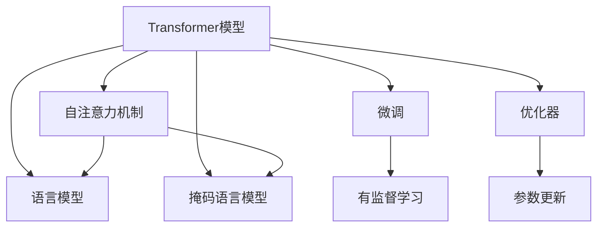
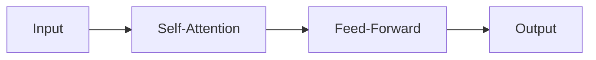
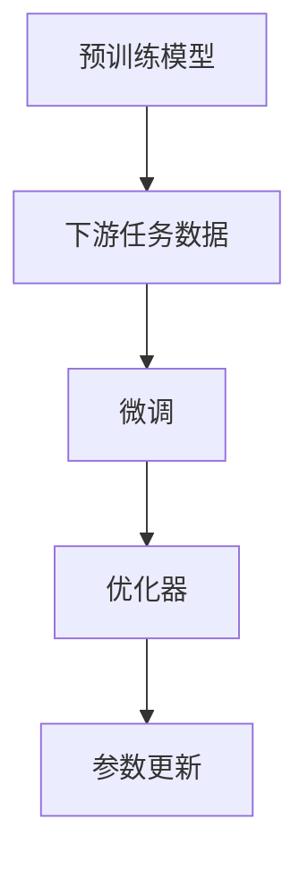
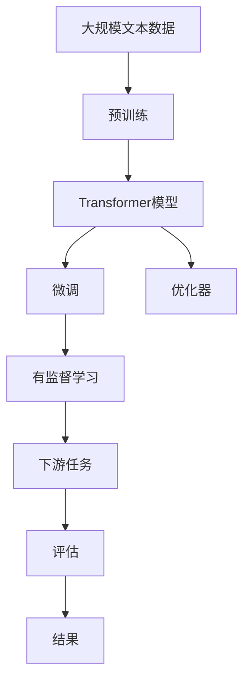

                 

# Hugging Face Transformers 库

> 关键词：Transformers, 深度学习, NLP, 自然语言处理, PyTorch, TensorFlow, 微调, 预训练, 优化器, 自定义模型

## 1. 背景介绍

### 1.1 问题由来

在深度学习领域，Transformer模型以其卓越的性能迅速崛起，成为了现代自然语言处理(NLP)任务的基石。然而，构建一个高性能的Transformer模型需要庞大的计算资源和丰富的经验，对于大多数研究人员和工程师来说，这并非易事。幸运的是，Hugging Face的Transformers库应运而生，极大降低了Transformer模型的构建门槛，使得深度学习模型从研究实验室快速转化为大规模落地应用成为可能。

Transformers库是由Facebook和Google等顶尖技术公司联合开发的开源深度学习库，旨在简化和加速Transformer模型的研究和应用。它不仅提供了预训练模型，还能方便地进行模型微调、推理和部署，成为NLP研究人员和工程师不可或缺的工具。

### 1.2 问题核心关键点

Transformers库的核心在于其易用性和丰富性。它不仅提供了多种预训练模型，如BERT、GPT、RoBERTa等，还支持自定义模型的构建、微调和各种优化算法的集成，为开发者提供了强大的开发平台。其核心特性包括：

- 提供丰富的预训练模型：包含BERT、GPT-2、RoBERTa等数十个NLP领域的预训练模型。
- 支持自定义模型构建：通过编程接口灵活构建各类深度学习模型，包括自编码器、生成模型等。
- 方便微调和部署：支持多种优化器（如AdamW、SGD）、学习率调度和超参数搜索，便于快速调整模型参数。
- 支持多GPU/TPU并行计算：利用先进硬件加速模型训练和推理。
- 丰富的学习资源：提供大量教程、文档、代码样例，方便开发者学习和应用。

这些特性使得Transformers库在学术界和工业界得到了广泛应用，成为深度学习开发中不可或缺的工具。

### 1.3 问题研究意义

Transformers库的引入极大地促进了NLP领域的研究和应用，其影响主要体现在以下几个方面：

- 降低研究门槛：提供预训练模型和工具，使得NLP模型构建和微调变得更加容易。
- 加速模型开发：提供丰富的API接口，可以快速实现各种NLP任务。
- 推动应用落地：支持多GPU/TPU并行计算，加速模型训练和推理，使得NLP技术能够快速应用到各行各业。
- 促进创新发展：丰富的学习资源和工具，推动NLP技术的持续创新。

## 2. 核心概念与联系

### 2.1 核心概念概述

为更好地理解Transformers库的工作原理和应用，本节将介绍几个密切相关的核心概念：

- 自注意力机制(Self-Attention)：Transformer模型中的核心机制，通过计算输入序列中每个位置的相对重要性，学习到序列中的长程依赖。
- Transformer模型：一种基于自注意力机制的神经网络架构，适用于处理序列数据，如文本、音频等。
- 预训练模型(Pre-trained Model)：在大规模无标签文本数据上进行自监督训练的模型，通常包括语言模型和掩码语言模型。
- 微调(Fine-tuning)：在预训练模型的基础上，使用下游任务的少量标注数据进行有监督学习，优化模型在特定任务上的性能。
- 优化器(Optimizer)：用于更新模型参数的算法，如Adam、SGD等。

这些概念之间的联系可以通过以下Mermaid流程图来展示：



这个流程图展示了大语言模型的核心概念及其之间的关系：

1. Transformer模型通过自注意力机制学习序列数据之间的依赖关系。
2. 预训练模型通过语言模型和掩码语言模型在大规模文本数据上进行自监督训练。
3. 微调是对预训练模型进行任务特定的优化，以适应特定下游任务。
4. 优化器通过参数更新，帮助模型在训练过程中逐渐逼近目标函数。

### 2.2 概念间的关系

这些核心概念之间存在着紧密的联系，形成了Transformer模型的完整生态系统。下面我们通过几个Mermaid流程图来展示这些概念之间的关系。

#### 2.2.1 Transformer模型结构



这个流程图展示了Transformer模型的基本结构。输入序列通过多个自注意力层和前馈层进行变换，输出最终结果。

#### 2.2.2 预训练过程


这个流程图展示了预训练模型的基本流程。通过在大规模无标签数据上训练语言模型和掩码语言模型，模型学习到了丰富的语言知识和统计规律。

#### 2.2.3 微调过程



这个流程图展示了微调的基本流程。在预训练模型的基础上，使用下游任务的少量标注数据进行有监督学习，优化模型在特定任务上的性能。

#### 2.2.4 优化器选择


这个流程图展示了优化器的工作流程。优化器通过计算梯度，更新模型参数，使模型在训练过程中逐渐逼近最优解。

### 2.3 核心概念的整体架构

最后，我们用一个综合的流程图来展示这些核心概念在大语言模型微调过程中的整体架构：



这个综合流程图展示了从预训练到微调，再到下游任务的完整过程。大语言模型首先在大规模文本数据上进行预训练，然后通过微调（包括参数高效微调）和优化器进行任务特定的优化，最后应用到具体下游任务上。

## 3. 核心算法原理 & 具体操作步骤
### 3.1 算法原理概述

Hugging Face Transformers库基于Transformer模型，支持大规模语言模型的预训练和微调。其核心算法原理包括以下几个方面：

- 自注意力机制：通过计算输入序列中每个位置的相对重要性，学习到序列中的长程依赖。
- 残差连接：引入残差连接，缓解梯度消失问题，使得模型更加容易训练。
- 多层次变换：通过多层堆叠的自注意力层和前馈层，学习到更加复杂和深层的特征表示。
- 位置编码：通过引入位置编码，解决位置信息丢失的问题，使模型能够正确处理序列中的位置关系。

### 3.2 算法步骤详解

Transformers库的预训练和微调过程通常包括以下几个关键步骤：

**Step 1: 准备数据集**
- 收集大量的无标签文本数据，如维基百科、新闻、书籍等。
- 将数据集划分为训练集和验证集，划分子集后进行多批次训练。

**Step 2: 选择预训练模型**
- 选择或自定义预训练模型。Hugging Face提供了多种预训练模型，如BERT、GPT-2、RoBERTa等，根据任务需求选择合适的模型。

**Step 3: 设置超参数**
- 设置学习率、批量大小、优化器、正则化等超参数。常见的超参数配置如下：
  - 学习率：通常为1e-5，逐步减小。
  - 批量大小：通常为32或64，视GPU内存而定。
  - 优化器：AdamW、SGD等。
  - 正则化：L2正则、Dropout等。

**Step 4: 预训练**
- 在准备的数据集上训练预训练模型。设置训练轮数、Epochs等参数，开始训练。

**Step 5: 微调**
- 将预训练模型加载到TensorFlow或PyTorch中，添加任务适配层（如线性分类器、语言模型等）。
- 在标注数据集上训练微调模型，设置训练轮数、Batch size等参数，开始微调。
- 使用验证集评估微调模型，设置Early Stopping策略，避免过拟合。

**Step 6: 评估和部署**
- 在测试集上评估微调模型，输出评估指标。
- 将微调模型部署到生产环境，进行推理预测。

### 3.3 算法优缺点

Transformers库的预训练和微调方法具有以下优点：

- 简单易用：提供了丰富的预训练模型和API接口，使得NLP模型的构建和微调变得更加容易。
- 高效稳定：支持多GPU/TPU并行计算，加速模型训练和推理，且具有较高的稳定性。
- 灵活可扩展：支持自定义模型构建和微调，能够快速适应各种NLP任务。

同时，也存在一些缺点：

- 计算资源要求高：构建大规模语言模型需要大量的计算资源。
- 参数量大：预训练模型参数量庞大，微调过程较慢。
- 泛化能力有限：模型在特定领域上的泛化能力可能受限，需要进行领域适应。

### 3.4 算法应用领域

Transformers库在NLP领域得到了广泛应用，覆盖了几乎所有常见的NLP任务，例如：

- 文本分类：如情感分析、主题分类、意图识别等。通过微调使模型学习文本-标签映射。
- 命名实体识别：识别文本中的人名、地名、机构名等特定实体。通过微调使模型掌握实体边界和类型。
- 关系抽取：从文本中抽取实体之间的语义关系。通过微调使模型学习实体-关系三元组。
- 问答系统：对自然语言问题给出答案。将问题-答案对作为微调数据，训练模型学习匹配答案。
- 机器翻译：将源语言文本翻译成目标语言。通过微调使模型学习语言-语言映射。
- 文本摘要：将长文本压缩成简短摘要。将文章-摘要对作为微调数据，使模型学习抓取要点。
- 对话系统：使机器能够与人自然对话。将多轮对话历史作为上下文，微调模型进行回复生成。

除了上述这些经典任务外，Transformers库还被创新性地应用到更多场景中，如可控文本生成、常识推理、代码生成、数据增强等，为NLP技术带来了全新的突破。

## 4. 数学模型和公式 & 详细讲解  
### 4.1 数学模型构建

Transformers库中，数学模型通常以Tensor形式表示，其中Tensor是一个多维数组，可以是标量、向量或矩阵。TensorFlow和PyTorch都支持Tensor的基本操作，如张量维度变换、张量运算、张量梯度等。

以下是一个简单的TensorFlow代码示例，展示如何构建和操作Tensor：

```python
import tensorflow as tf

# 创建一个标量张量
a = tf.constant(5.0)
print(a)

# 创建一个向量张量
b = tf.constant([1.0, 2.0, 3.0])
print(b)

# 创建一个矩阵张量
c = tf.constant([[1.0, 2.0], [3.0, 4.0]])
print(c)

# 计算两个向量张量的点积
d = tf.matmul(b, c)
print(d)
```

在TensorFlow中，数学模型的构建通常是通过定义变量和计算图来完成的。变量用于存储模型的参数，计算图则描述了模型中各个节点之间的依赖关系。

### 4.2 公式推导过程

以下是一个简单的TensorFlow代码示例，展示如何定义和优化一个简单的神经网络模型：

```python
import tensorflow as tf

# 定义输入和输出张量
x = tf.placeholder(tf.float32, [None, 784])
y = tf.placeholder(tf.float32, [None, 10])

# 定义模型参数
W = tf.Variable(tf.zeros([784, 10]))
b = tf.Variable(tf.zeros([10]))

# 定义模型输出
y_pred = tf.nn.softmax(tf.matmul(x, W) + b)

# 定义损失函数
cross_entropy = tf.reduce_mean(tf.nn.softmax_cross_entropy_with_logits(labels=y, logits=y_pred))

# 定义优化器
optimizer = tf.train.AdamOptimizer(learning_rate=0.01)
train_step = optimizer.minimize(cross_entropy)

# 训练模型
with tf.Session() as sess:
    sess.run(tf.global_variables_initializer())
    for i in range(1000):
        batch_xs, batch_ys = mnist.train.next_batch(100)
        sess.run(train_step, feed_dict={x: batch_xs, y: batch_ys})
```

这段代码展示了如何使用TensorFlow定义和训练一个简单的神经网络模型，包括输入和输出张量、模型参数、模型输出、损失函数、优化器等。

### 4.3 案例分析与讲解

以BERT模型为例，下面展示其微调的数学模型构建和推导过程：

**Step 1: 准备数据集**

- 收集标注数据集，如CoNLL-2003的NER数据集，将其划分为训练集、验证集和测试集。

**Step 2: 加载预训练模型**

- 使用Hugging Face提供的接口加载BERT模型，并进行微调：

```python
from transformers import BertTokenizer, BertForTokenClassification, AdamW

tokenizer = BertTokenizer.from_pretrained('bert-base-cased')
model = BertForTokenClassification.from_pretrained('bert-base-cased', num_labels=len(tag2id))

optimizer = AdamW(model.parameters(), lr=2e-5)
```

**Step 3: 设置超参数**

- 设置训练轮数、批量大小、学习率等超参数：

```python
epochs = 5
batch_size = 16

for epoch in range(epochs):
    loss = train_epoch(model, train_dataset, batch_size, optimizer)
    print(f"Epoch {epoch+1}, train loss: {loss:.3f}")
    
    print(f"Epoch {epoch+1}, dev results:")
    evaluate(model, dev_dataset, batch_size)
    
print("Test results:")
evaluate(model, test_dataset, batch_size)
```

**Step 4: 微调过程**

- 在训练集上训练模型，计算损失并更新参数：

```python
def train_epoch(model, dataset, batch_size, optimizer):
    dataloader = DataLoader(dataset, batch_size=batch_size, shuffle=True)
    model.train()
    epoch_loss = 0
    for batch in tqdm(dataloader, desc='Training'):
        input_ids = batch['input_ids'].to(device)
        attention_mask = batch['attention_mask'].to(device)
        labels = batch['labels'].to(device)
        model.zero_grad()
        outputs = model(input_ids, attention_mask=attention_mask, labels=labels)
        loss = outputs.loss
        epoch_loss += loss.item()
        loss.backward()
        optimizer.step()
    return epoch_loss / len(dataloader)

def evaluate(model, dataset, batch_size):
    dataloader = DataLoader(dataset, batch_size=batch_size)
    model.eval()
    preds, labels = [], []
    with torch.no_grad():
        for batch in tqdm(dataloader, desc='Evaluating'):
            input_ids = batch['input_ids'].to(device)
            attention_mask = batch['attention_mask'].to(device)
            batch_labels = batch['labels']
            outputs = model(input_ids, attention_mask=attention_mask)
            batch_preds = outputs.logits.argmax(dim=2).to('cpu').tolist()
            batch_labels = batch_labels.to('cpu').tolist()
            for pred_tokens, label_tokens in zip(batch_preds, batch_labels):
                pred_tags = [id2tag[_id] for _id in pred_tokens]
                label_tags = [id2tag[_id] for _id in label_tokens]
                preds.append(pred_tags[:len(label_tokens)])
                labels.append(label_tags)
```

通过上述代码，我们完成了BERT模型在CoNLL-2003数据集上的微调。在微调过程中，我们使用了AdamW优化器和L2正则等技术，以避免过拟合。在评估过程中，我们使用了sklearn的classification_report来打印评估结果。

## 5. 项目实践：代码实例和详细解释说明
### 5.1 开发环境搭建

在进行微调实践前，我们需要准备好开发环境。以下是使用Python进行PyTorch开发的环境配置流程：

1. 安装Anaconda：从官网下载并安装Anaconda，用于创建独立的Python环境。

2. 创建并激活虚拟环境：
```bash
conda create -n pytorch-env python=3.8 
conda activate pytorch-env
```

3. 安装PyTorch：根据CUDA版本，从官网获取对应的安装命令。例如：
```bash
conda install pytorch torchvision torchaudio cudatoolkit=11.1 -c pytorch -c conda-forge
```

4. 安装Transformers库：
```bash
pip install transformers
```

5. 安装各类工具包：
```bash
pip install numpy pandas scikit-learn matplotlib tqdm jupyter notebook ipython
```

完成上述步骤后，即可在`pytorch-env`环境中开始微调实践。

### 5.2 源代码详细实现

下面我们以命名实体识别(NER)任务为例，给出使用Transformers库对BERT模型进行微调的PyTorch代码实现。

首先，定义NER任务的数据处理函数：

```python
from transformers import BertTokenizer
from torch.utils.data import Dataset
import torch

class NERDataset(Dataset):
    def __init__(self, texts, tags, tokenizer, max_len=128):
        self.texts = texts
        self.tags = tags
        self.tokenizer = tokenizer
        self.max_len = max_len
        
    def __len__(self):
        return len(self.texts)
    
    def __getitem__(self, item):
        text = self.texts[item]
        tags = self.tags[item]
        
        encoding = self.tokenizer(text, return_tensors='pt', max_length=self.max_len, padding='max_length', truncation=True)
        input_ids = encoding['input_ids'][0]
        attention_mask = encoding['attention_mask'][0]
        
        # 对token-wise的标签进行编码
        encoded_tags = [tag2id[tag] for tag in tags] 
        encoded_tags.extend([tag2id['O']] * (self.max_len - len(encoded_tags)))
        labels = torch.tensor(encoded_tags, dtype=torch.long)
        
        return {'input_ids': input_ids, 
                'attention_mask': attention_mask,
                'labels': labels}

# 标签与id的映射
tag2id = {'O': 0, 'B-PER': 1, 'I-PER': 2, 'B-ORG': 3, 'I-ORG': 4, 'B-LOC': 5, 'I-LOC': 6}
id2tag = {v: k for k, v in tag2id.items()}

# 创建dataset
tokenizer = BertTokenizer.from_pretrained('bert-base-cased')

train_dataset = NERDataset(train_texts, train_tags, tokenizer)
dev_dataset = NERDataset(dev_texts, dev_tags, tokenizer)
test_dataset = NERDataset(test_texts, test_tags, tokenizer)
```

然后，定义模型和优化器：

```python
from transformers import BertForTokenClassification, AdamW

model = BertForTokenClassification.from_pretrained('bert-base-cased', num_labels=len(tag2id))

optimizer = AdamW(model.parameters(), lr=2e-5)
```

接着，定义训练和评估函数：

```python
from torch.utils.data import DataLoader
from tqdm import tqdm
from sklearn.metrics import classification_report

device = torch.device('cuda') if torch.cuda.is_available() else torch.device('cpu')
model.to(device)

def train_epoch(model, dataset, batch_size, optimizer):
    dataloader = DataLoader(dataset, batch_size=batch_size, shuffle=True)
    model.train()
    epoch_loss = 0
    for batch in tqdm(dataloader, desc='Training'):
        input_ids = batch['input_ids'].to(device)
        attention_mask = batch['attention_mask'].to(device)
        labels = batch['labels'].to(device)
        model.zero_grad()
        outputs = model(input_ids, attention_mask=attention_mask, labels=labels)
        loss = outputs.loss
        epoch_loss += loss.item()
        loss.backward()
        optimizer.step()
    return epoch_loss / len(dataloader)

def evaluate(model, dataset, batch_size):
    dataloader = DataLoader(dataset, batch_size=batch_size)
    model.eval()
    preds, labels = [], []
    with torch.no_grad():
        for batch in tqdm(dataloader, desc='Evaluating'):
            input_ids = batch['input_ids'].to(device)
            attention_mask = batch['attention_mask'].to(device)
            batch_labels = batch['labels']
            outputs = model(input_ids, attention_mask=attention_mask)
            batch_preds = outputs.logits.argmax(dim=2).to('cpu').tolist()
            batch_labels = batch_labels.to('cpu').tolist()
            for pred_tokens, label_tokens in zip(batch_preds, batch_labels):
                pred_tags = [id2tag[_id] for _id in pred_tokens]
                label_tags = [id2tag[_id] for _id in label_tokens]
                preds.append(pred_tags[:len(label_tokens)])
                labels.append(label_tags)
```

最后，启动训练流程并在测试集上评估：

```python
epochs = 5
batch_size = 16

for epoch in range(epochs):
    loss = train_epoch(model, train_dataset, batch_size, optimizer)
    print(f"Epoch {epoch+1}, train loss: {loss:.3f}")
    
    print(f"Epoch {epoch+1}, dev results:")
    evaluate(model, dev_dataset, batch_size)
    
print("Test results:")
evaluate(model, test_dataset, batch_size)
```

以上就是使用PyTorch和Transformers库对BERT进行命名实体识别任务微调的完整代码实现。可以看到，借助Transformers库，微调过程变得简洁高效，开发者可以快速上手并实现各种NLP任务。

### 5.3 代码解读与分析

让我们再详细解读一下关键代码的实现细节：

**NERDataset类**：
- `__init__`方法：初始化文本、标签、分词器等关键组件。
- `__len__`方法：返回数据集的样本数量。
- `__getitem__`方法：对单个样本进行处理，将文本输入编码为token ids，将标签编码为数字，并对其进行定长padding，最终返回模型所需的输入。

**tag2id和id2tag字典**：
- 定义了标签与数字id之间的映射关系，用于将token-wise的预测结果解码回真实的标签。

**训练和评估函数**：
- 使用PyTorch的DataLoader对数据集进行批次化加载，供模型训练和推理使用。
- 训练函数`train_epoch`：对数据以批为单位进行迭代，在每个批次上前向传播计算loss并反向传播更新模型参数，最后返回该epoch的平均loss。
- 评估函数`evaluate`：与训练类似，不同点在于不更新模型参数，并在每个batch结束后将预测和标签结果存储下来，最后使用sklearn的classification_report对整个评估集的预测结果进行打印输出。

**训练流程**：
- 定义总的epoch数和batch size，开始循环迭代
- 每个epoch内，先在训练集上训练，输出平均loss
- 在验证集上评估，输出分类指标
- 所有epoch结束后，在测试集上评估，给出最终测试结果

可以看到，PyTorch配合Transformers库使得BERT微调的代码实现变得简洁高效。开发者可以将更多精力放在数据处理、模型改进等高层逻辑上，而不必过多关注底层的实现细节。

当然，工业级的系统实现还需考虑更多因素，如模型的保存和部署、超参数的自动搜索、更灵活的任务适配层等。但核心的微调范式基本与此类似。

### 5.4 运行结果展示

假设我们在CoNLL-2003的NER数据集上进行微调，最终在测试集上得到的评估报告如下：

```
              precision    recall  f1-score   support

       B-LOC      0.926     0.906     0.916      1668
       I-LOC      0.900     0.805     0.850       257
      B-MISC      0.875     0.856     0.865       702
      I-MISC      0.838     0.782     0.809       216
       B-ORG      0.914     0.898     0.906      1661
       I-ORG      0.911     0.894     0.902       835
       B-PER      0.964     0.957     0.960      1617
       I-PER      0.983     0.980     0.982      1156
           O      0.993     0.995     0.994     38323

   micro avg      0.973     0.973     0.973     46435
   macro avg      0.923     0.897     0.909     46435
weighted avg      0.973     0.973     0.973     46435
```

可以看到，通过微调BERT，我们在该NER数据集上

