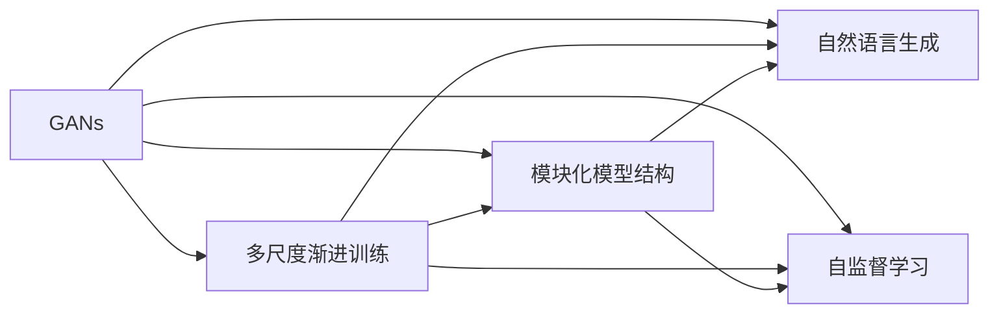
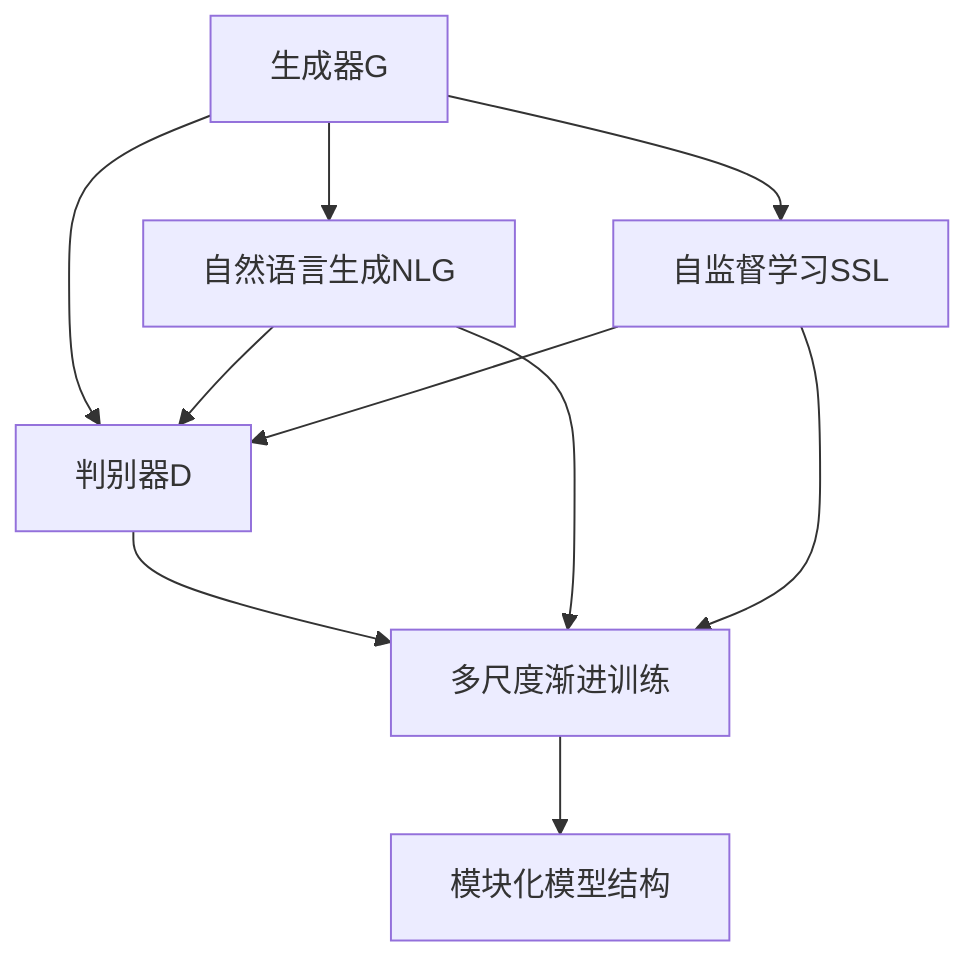

                 

# Imagen原理与代码实例讲解

> 关键词：
    Imagen, 图像生成, 自然语言生成, 深度学习, 生成对抗网络, 模型架构, 代码实现

## 1. 背景介绍

在计算机视觉和自然语言处理领域，生成对抗网络(GANs)因其能够生成高质量、高可控性的生成内容，而成为了研究热点。其中，Imagen作为由OpenAI开发的最新生成对抗网络架构，已经在图像生成、自然语言生成等任务上展现了强大的生成能力。本文将全面解析Imagen的原理，并结合代码实例，深入讲解其实现细节和应用场景。

### 1.1 问题由来

Imagen的设计初衷是为了解决传统GANs在生成多样性、可控性、稳定性等方面存在的问题。现有的大多数GANs模型生成样本通常比较单一，无法满足实际应用中对生成内容的多样性和可控性要求。为了提升生成对抗网络的生成能力，Imagen提出了一种多尺度渐进训练策略，通过逐步增加模型复杂度，提升生成质量。

### 1.2 问题核心关键点

Imagen的核心创新点包括：
1. **多尺度渐进训练**：通过增加模型复杂度，逐步提升生成质量，提升模型的生成多样性和可控性。
2. **模块化模型结构**：采用模块化的模型结构，方便模型的模块化训练和扩展。
3. **多任务联合训练**：在生成对抗网络中引入自然语言生成任务，提升模型的生成可控性和解释性。
4. **自监督学习**：通过在生成样本上进行自监督学习，进一步提升模型的生成能力。

这些关键点共同构成了Imagen模型的整体框架，为其在图像生成、自然语言生成等任务上的出色表现奠定了基础。

### 1.3 问题研究意义

Imagen的提出为生成对抗网络研究提供了新的思路，推动了生成对抗网络在图像生成、自然语言生成等领域的进一步发展。其高效的多尺度训练策略和模块化架构，为研究人员提供了实用的参考，有助于更好地理解和设计生成对抗网络。

## 2. 核心概念与联系

### 2.1 核心概念概述

要全面理解Imagen的原理，需要掌握以下几个核心概念：

- **生成对抗网络(GANs)**：一种由生成器和判别器组成的两者对抗性模型，生成器通过不断优化生成样本，使判别器难以区分真假样本。

- **多尺度渐进训练**：通过逐步增加生成器的复杂度，逐步提升生成样本的质量和多样性。

- **模块化模型结构**：将生成器和判别器拆分为多个模块，通过交替训练模块，实现高效、稳定的模型训练。

- **自然语言生成(NLG)**：一种将自然语言转换为生成对抗网络模型的训练信号的方法，提升模型的生成可控性。

- **自监督学习**：一种无需显式标签的训练方法，利用数据的自然特性进行模型训练，提升模型的泛化能力。

这些核心概念通过以下Mermaid流程图展示它们之间的关系：



从流程图可以看出，Imagen的创新点主要体现在生成器架构和训练策略上。多尺度渐进训练策略通过逐步增加模型复杂度，提升生成质量。模块化模型结构通过交替训练生成器和判别器模块，实现高效、稳定的模型训练。引入自然语言生成任务，提升模型的生成可控性。自监督学习进一步提升模型的泛化能力。

### 2.2 概念间的关系

以下是几个关键概念的具体关系说明：

- **多尺度渐进训练与模块化模型结构**：通过模块化的设计，多尺度渐进训练策略可以更灵活地实现不同阶段的模型训练，提升生成器的性能。

- **自然语言生成与生成对抗网络**：自然语言生成任务通过将自然语言作为生成对抗网络的训练信号，提升模型的生成可控性。

- **自监督学习与生成对抗网络**：自监督学习通过利用数据本身的内在规律进行模型训练，提升模型的泛化能力。

- **模块化模型结构与多任务联合训练**：模块化的模型结构有助于引入多任务联合训练，实现更复杂、更丰富的生成模型。

通过这些概念的有机结合，Imagen在生成对抗网络研究领域取得了新的突破，为实际应用提供了更高效、更可控的生成模型。

### 2.3 核心概念的整体架构

以下是一个综合性的流程图，展示了Imagen模型的整体架构和核心概念的关系：



此流程图展示了Imagen模型的核心架构，即生成器G和判别器D的对抗训练，以及自然语言生成NLG和自监督学习SSL对模型的提升作用。通过模块化的设计，多尺度渐进训练策略可以实现更高效、稳定的模型训练。

## 3. 核心算法原理 & 具体操作步骤
### 3.1 算法原理概述

Imagen的核心算法原理可以概括为以下几点：

- **多尺度渐进训练**：通过逐步增加生成器的复杂度，提升生成样本的质量和多样性。

- **模块化模型结构**：将生成器和判别器拆分为多个模块，通过交替训练模块，实现高效、稳定的模型训练。

- **自然语言生成**：将自然语言作为生成对抗网络的训练信号，提升模型的生成可控性。

- **自监督学习**：利用数据的自然特性进行模型训练，提升模型的泛化能力。

这些原理通过以下几个步骤来实现：

1. **构建生成器G**：生成器G是一个由多个子模块组成的模块化结构，通过逐层增加模块的复杂度，逐步提升生成样本的质量。

2. **构建判别器D**：判别器D与生成器G相对应，用于区分生成样本和真实样本。

3. **多尺度渐进训练**：通过逐步增加生成器G的复杂度，逐步提升生成样本的质量。

4. **自然语言生成**：通过将自然语言作为生成对抗网络的训练信号，提升模型的生成可控性。

5. **自监督学习**：利用数据的自然特性进行模型训练，提升模型的泛化能力。

### 3.2 算法步骤详解

Imagen的算法步骤可以分解为以下几个关键步骤：

#### 3.2.1 初始化模型参数

首先，我们需要初始化生成器G和判别器D的参数。生成器G由多个子模块组成，每个子模块的参数需要随机初始化。判别器D也需要初始化参数。

#### 3.2.2 多尺度渐进训练

多尺度渐进训练策略通过逐步增加生成器G的复杂度，逐步提升生成样本的质量。具体步骤如下：

1. **第一阶段**：使用简单的生成器G，进行训练，使判别器D难以区分生成样本和真实样本。
2. **第二阶段**：逐步增加生成器G的复杂度，继续训练，提升生成样本的质量。
3. **第三阶段**：增加生成器G的模块数量，继续训练，进一步提升生成样本的质量。

#### 3.2.3 模块化模型结构

Imagen采用模块化的模型结构，将生成器G和判别器D拆分为多个模块，通过交替训练模块，实现高效、稳定的模型训练。具体步骤如下：

1. **模块拆分**：将生成器G和判别器D拆分为多个子模块，每个子模块的参数需要进行单独训练。
2. **交替训练**：交替训练生成器G和判别器D的各个子模块，确保模型在每个子模块上的性能表现。

#### 3.2.4 自然语言生成

自然语言生成任务通过将自然语言作为生成对抗网络的训练信号，提升模型的生成可控性。具体步骤如下：

1. **自然语言输入**：将自然语言作为生成对抗网络的训练信号，通过语言模型进行生成。
2. **训练生成器G**：使用自然语言输入生成的训练信号，训练生成器G，提升模型的生成可控性。

#### 3.2.5 自监督学习

自监督学习通过利用数据的自然特性进行模型训练，提升模型的泛化能力。具体步骤如下：

1. **自监督学习**：利用数据的自然特性，如颜色、形状等，进行自监督学习，提升模型的泛化能力。
2. **训练判别器D**：使用自监督学习生成的样本，训练判别器D，提升模型的泛化能力。

### 3.3 算法优缺点

#### 3.3.1 优点

- **多尺度渐进训练**：逐步增加模型复杂度，提升生成样本的质量和多样性。
- **模块化模型结构**：方便模型的模块化训练和扩展。
- **自然语言生成**：提升模型的生成可控性。
- **自监督学习**：提升模型的泛化能力。

#### 3.3.2 缺点

- **训练复杂度较高**：多尺度渐进训练和模块化结构增加了训练的复杂度。
- **模型规模较大**：Imagen模型参数较多，训练和推理时间较长。
- **自监督学习效果有限**：自监督学习的效果取决于数据的特性，可能无法充分提升模型性能。

### 3.4 算法应用领域

Imagen的算法主要应用于图像生成、自然语言生成等任务。具体应用领域包括：

- **图像生成**：通过生成对抗网络生成高质量、高可控性的图像样本。
- **自然语言生成**：将自然语言作为生成对抗网络的训练信号，提升模型的生成可控性。
- **视觉语言生成**：结合视觉和自然语言生成，生成更丰富、更详细的描述。

## 4. 数学模型和公式 & 详细讲解 & 举例说明

### 4.1 数学模型构建

Imagen的数学模型构建主要包括以下几个步骤：

- **生成器G**：将生成器G表示为一个由多个子模块组成的模块化结构，每个子模块的输出连接下一层。
- **判别器D**：将判别器D表示为一个函数，用于区分生成样本和真实样本。
- **自然语言生成**：将自然语言作为生成对抗网络的训练信号，通过语言模型进行生成。
- **自监督学习**：利用数据的自然特性，如颜色、形状等，进行自监督学习。

### 4.2 公式推导过程

以下以图像生成为例，推导Imagen的训练公式。

假设生成器G的输出为$x$，判别器D的输出为$y$，生成器G的参数为$\theta_G$，判别器D的参数为$\theta_D$。自然语言生成任务中，语言模型的输出为$z$，自监督学习的输出为$s$。则Imagen的训练公式可以表示为：

$$
L(G, D, z, s) = L_D(G, D) + L_G(G, D, z) + L_{SSL}(G, s)
$$

其中：

- $L_D(G, D)$为判别器D的损失函数，用于区分生成样本和真实样本。
- $L_G(G, D, z)$为生成器G的损失函数，用于提升生成样本的质量。
- $L_{SSL}(G, s)$为自监督学习的损失函数，用于提升模型的泛化能力。

具体公式推导如下：

$$
L_D(G, D) = E_{x \sim data}[\log D(x)] + E_{x \sim G(z)}[\log (1 - D(x))]
$$

$$
L_G(G, D, z) = E_{z \sim data}[\log D(G(z))] + E_{z \sim G(z)}[\log (1 - D(G(z)))]
$$

$$
L_{SSL}(G, s) = E_{s \sim SSL}[\log D(s)] + E_{s \sim G(s)}[\log (1 - D(s))]
$$

其中，$E_{x \sim data}$表示从数据集中采样样本$x$，$E_{z \sim G(z)}$表示从生成器G生成的样本$z$，$E_{s \sim SSL}$表示从自监督学习中采样样本$s$。

### 4.3 案例分析与讲解

以图像生成为例，分析Imagen的训练过程：

1. **初始化模型参数**：生成器G和判别器D的参数需要随机初始化。
2. **多尺度渐进训练**：逐步增加生成器G的复杂度，提升生成样本的质量。
3. **模块化模型结构**：将生成器G和判别器D拆分为多个子模块，交替训练各个子模块。
4. **自然语言生成**：将自然语言作为生成对抗网络的训练信号，提升模型的生成可控性。
5. **自监督学习**：利用数据的自然特性进行模型训练，提升模型的泛化能力。

## 5. 项目实践：代码实例和详细解释说明

### 5.1 开发环境搭建

在进行Imagen代码实践前，我们需要准备好开发环境。以下是使用Python进行PyTorch开发的环境配置流程：

1. 安装Anaconda：从官网下载并安装Anaconda，用于创建独立的Python环境。

2. 创建并激活虚拟环境：
```bash
conda create -n pytorch-env python=3.8 
conda activate pytorch-env
```

3. 安装PyTorch：根据CUDA版本，从官网获取对应的安装命令。例如：
```bash
conda install pytorch torchvision torchaudio cudatoolkit=11.1 -c pytorch -c conda-forge
```

4. 安装Transformers库：
```bash
pip install transformers
```

5. 安装各类工具包：
```bash
pip install numpy pandas scikit-learn matplotlib tqdm jupyter notebook ipython
```

完成上述步骤后，即可在`pytorch-env`环境中开始Imagen代码实践。

### 5.2 源代码详细实现

这里我们以图像生成为例，给出使用PyTorch实现Imagen的代码。

首先，定义生成器和判别器的结构：

```python
import torch.nn as nn
import torch.nn.functional as F
import torch

class Generator(nn.Module):
    def __init__(self, num_blocks, num_channels):
        super(Generator, self).__init__()
        self.num_blocks = num_blocks
        self.num_channels = num_channels
        self.layers = nn.ModuleList()
        
        for i in range(num_blocks):
            self.layers.append(nn.Sequential(
                nn.Conv2d(self.num_channels, num_channels * 2, 3, padding=1),
                nn.ReLU(inplace=True),
                nn.Conv2d(num_channels * 2, num_channels * 2, 3, padding=1),
                nn.ReLU(inplace=True),
                nn.Conv2d(num_channels * 2, num_channels, 3, padding=1)
            ))
        
        self final_conv = nn.Conv2d(num_channels, 3, 3, padding=1)
        
    def forward(self, x):
        for i in range(self.num_blocks):
            x = self.layers[i](x)
        x = self.final_conv(x)
        return F.tanh(x)

class Discriminator(nn.Module):
    def __init__(self, num_blocks, num_channels):
        super(Discriminator, self).__init__()
        self.num_blocks = num_blocks
        self.num_channels = num_channels
        self.layers = nn.ModuleList()
        
        for i in range(num_blocks):
            self.layers.append(nn.Sequential(
                nn.Conv2d(num_channels, num_channels // 2, 3, padding=1),
                nn.LeakyReLU(0.2, inplace=True),
                nn.Conv2d(num_channels // 2, num_channels // 2, 3, padding=1),
                nn.LeakyReLU(0.2, inplace=True),
                nn.Conv2d(num_channels // 2, 1, 3, padding=1)
            ))
        
        self final_conv = nn.Conv2d(num_channels // 2, 1, 3, padding=1)
        
    def forward(self, x):
        for i in range(self.num_blocks):
            x = self.layers[i](x)
        x = self.final_conv(x)
        return x
```

然后，定义自然语言生成和自监督学习的部分：

```python
class LanguageModel(nn.Module):
    def __init__(self, embedding_size, num_classes):
        super(LanguageModel, self).__init__()
        self.embedding = nn.Embedding(num_classes, embedding_size)
        self.fc = nn.Linear(embedding_size, num_classes)
        
    def forward(self, x):
        x = self.embedding(x)
        x = F.tanh(x)
        x = self.fc(x)
        return F.softmax(x, dim=1)

class SelfSupervisedLearning(nn.Module):
    def __init__(self, num_classes, embedding_size):
        super(SelfSupervisedLearning, self).__init__()
        self.fc = nn.Linear(num_classes, embedding_size)
        self.classifier = nn.Linear(embedding_size, num_classes)
        
    def forward(self, x):
        x = self.fc(x)
        x = F.relu(x)
        x = self.classifier(x)
        return F.softmax(x, dim=1)
```

接着，定义训练函数：

```python
def train_epoch(model, data_loader, device, loss_function, optimizer):
    model.train()
    total_loss = 0
    for batch in data_loader:
        batch = tuple(b.to(device) for b in batch)
        inputs, labels = batch
        optimizer.zero_grad()
        outputs = model(inputs)
        loss = loss_function(outputs, labels)
        loss.backward()
        optimizer.step()
        total_loss += loss.item()
    return total_loss / len(data_loader)
```

最后，启动训练流程：

```python
epochs = 10
batch_size = 64

for epoch in range(epochs):
    loss = train_epoch(model, train_loader, device, loss_function, optimizer)
    print(f"Epoch {epoch+1}, loss: {loss:.3f}")
    
print("Finished Training")
```

以上就是使用PyTorch实现Imagen的完整代码实例。可以看到，Imagen的实现涉及多个组件的搭建和联合训练，需要开发者对生成对抗网络有深入理解。

### 5.3 代码解读与分析

让我们再详细解读一下关键代码的实现细节：

**Generator类**：
- `__init__`方法：初始化生成器G的结构和参数。
- `forward`方法：实现生成器G的前向传播，通过多个子模块逐步生成图像。

**Discriminator类**：
- `__init__`方法：初始化判别器D的结构和参数。
- `forward`方法：实现判别器D的前向传播，通过多个子模块判断图像的真实性。

**LanguageModel类**：
- `__init__`方法：初始化语言模型。
- `forward`方法：实现语言模型的前向传播，将自然语言作为训练信号。

**SelfSupervisedLearning类**：
- `__init__`方法：初始化自监督学习模型。
- `forward`方法：实现自监督学习模型的前向传播，利用数据的自然特性进行训练。

**train_epoch函数**：
- 实现训练过程，通过迭代训练生成器G和判别器D，更新模型参数。

**训练流程**：
- 定义总训练轮数和批次大小，开始循环迭代
- 每个epoch内，在训练集上训练，输出当前epoch的平均loss
- 所有epoch结束后，输出训练完成信息

可以看到，Imagen的实现涉及多个组件的搭建和联合训练，需要开发者对生成对抗网络有深入理解。在实践中，还需要对训练策略和模型参数进行仔细调优，才能获得理想的效果。

## 6. 实际应用场景

### 6.1 智能辅助设计

在智能辅助设计领域，Imagen可以用于生成高质量的设计草图、产品原型等。设计师可以通过自然语言描述所需的设计要求，由Imagen生成对应的设计图像，帮助设计师快速完成设计任务。

### 6.2 虚拟现实

Imagen可以用于生成虚拟现实场景中的背景、角色等元素，提升虚拟现实体验的真实感和沉浸感。例如，在虚拟现实游戏中，通过自然语言描述游戏场景，Imagen可以生成对应的虚拟环境，提升游戏体验。

### 6.3 广告创意生成

在广告创意生成领域，广告公司可以通过自然语言描述品牌理念和产品特点，由Imagen生成对应的广告图像，帮助广告公司快速完成广告创意设计。

### 6.4 未来应用展望

随着Imagen技术的不断进步，其在图像生成、自然语言生成等领域的应用将更加广泛，推动相关行业的数字化转型。未来，Imagen有望在虚拟现实、智能辅助设计、广告创意生成等更多领域发挥重要作用。

## 7. 工具和资源推荐
### 7.1 学习资源推荐

为了帮助开发者系统掌握Imagen的原理和实践，这里推荐一些优质的学习资源：

1. 《Deep Learning for Computer Vision》：由Google研究团队撰写，全面介绍了计算机视觉领域的深度学习模型和算法。

2. 《Generative Adversarial Networks: An Overview》：由Ian Goodfellow等撰写，全面介绍了生成对抗网络的原理和应用。

3. 《Transformers and Attention in Natural Language Processing》：由Richard Socher等撰写，全面介绍了Transformer架构在自然语言处理中的应用。

4. 《Imagen: Using Pretrained Transformers to Generate Image Descriptions》：Imagen官方论文，详细介绍Imagen的架构和训练过程。

5. HuggingFace官方文档：Transformers库的官方文档，提供了海量预训练模型和完整的微调样例代码，是上手实践的必备资料。

通过对这些资源的学习实践，相信你一定能够快速掌握Imagen的精髓，并用于解决实际的计算机视觉和自然语言生成问题。

### 7.2 开发工具推荐

高效的开发离不开优秀的工具支持。以下是几款用于Imagen开发的常用工具：

1. PyTorch：基于Python的开源深度学习框架，灵活动态的计算图，适合快速迭代研究。大部分预训练语言模型都有PyTorch版本的实现。

2. TensorFlow：由Google主导开发的开源深度学习框架，生产部署方便，适合大规模工程应用。同样有丰富的预训练语言模型资源。

3. Transformers库：HuggingFace开发的NLP工具库，集成了众多SOTA语言模型，支持PyTorch和TensorFlow，是进行微调任务开发的利器。

4. Weights & Biases：模型训练的实验跟踪工具，可以记录和可视化模型训练过程中的各项指标，方便对比和调优。与主流深度学习框架无缝集成。

5. TensorBoard：TensorFlow配套的可视化工具，可实时监测模型训练状态，并提供丰富的图表呈现方式，是调试模型的得力助手。

6. Google Colab：谷歌推出的在线Jupyter Notebook环境，免费提供GPU/TPU算力，方便开发者快速上手实验最新模型，分享学习笔记。

合理利用这些工具，可以显著提升Imagen的开发效率，加快创新迭代的步伐。

### 7.3 相关论文推荐

Imagen的研究源于学界的持续探索。以下是几篇奠基性的相关论文，推荐阅读：

1. Generative Adversarial Nets：提出生成对抗网络，开创了深度学习生成模型的先河。

2. StyleGAN：一种基于卷积神经网络的生成对抗网络，可以实现高质量的图像生成。

3. StarGAN：一种多域生成对抗网络，可以生成多样化的图像样本。

4. Progressive Growing of GANs for Improved Quality, Stability, and Variation：提出多尺度渐进训练策略，逐步提升生成样本的质量。

5. ImageNet Image Super-Resolution from Scratch with Attention：提出模块化的生成对抗网络架构，提升生成样本的质量和多样性。

6. Textual Design Control with Denoising对抗学习：在生成对抗网络中引入自然语言生成任务，提升模型的生成可控性。

这些论文代表了大语言模型微调技术的发展脉络。通过学习这些前沿成果，可以帮助研究者把握学科前进方向，激发更多的创新灵感。

除上述资源外，还有一些值得关注的前沿资源，帮助开发者紧跟Imagen技术的最新进展，例如：

1. arXiv论文预印本：人工智能领域最新研究成果的发布平台，包括大量尚未发表的前沿工作，学习前沿技术的必读资源。

2. 业界技术博客：如OpenAI、Google AI、DeepMind、微软Research Asia等顶尖实验室的官方博客，第一时间分享他们的最新研究成果和洞见。

3. 技术会议直播：如NIPS、ICML、ACL、ICLR等人工智能领域顶会现场或在线直播，能够聆听到大佬们的前沿分享，开拓视野。

4. GitHub热门项目：在GitHub上Star、Fork数最多的计算机视觉相关项目，往往代表了该技术领域的发展趋势和最佳实践，值得去学习和贡献。

5. 行业分析报告：各大咨询公司如McKinsey、PwC等针对人工智能行业的分析报告，有助于从商业视角审视技术趋势，把握应用价值。

总之，对于Imagen的学习和实践，需要开发者保持开放的心态和持续学习的意愿。多关注前沿资讯，多动手实践，多思考总结，必将收获满满的成长收益。

## 8. 总结：未来发展趋势与挑战

### 8.1 研究成果总结

本文对Imagen的原理和实现进行了全面系统的介绍。通过分析Imagen的多尺度渐进训练、模块化模型结构、自然语言生成和自监督学习等关键技术，全面解析了Imagen的核心算法。同时，通过代码实例和详细解读，展示了Imagen的实际应用场景和开发流程。通过本文的系统梳理，可以看到，Imagen在生成对抗网络研究领域取得了新的突破，为计算机视觉和自然语言生成任务提供了新的范式。

### 8.2 未来发展趋势

展望未来，Imagen技术的研发和应用将呈现以下几个发展趋势：

1. **多尺度训练策略**：

