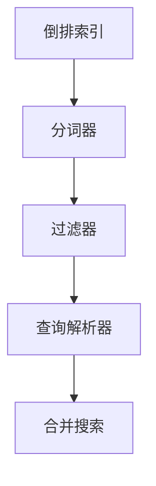

                 

# Lucene原理与代码实例讲解

> 关键词：Lucene,搜索引擎,倒排索引,全文检索,代码实现,分布式索引

## 1. 背景介绍

随着互联网的迅猛发展，搜索引擎成为我们日常生活中不可或缺的工具。搜索引擎不仅需要快速地响应查询，还必须高效地检索大量文本数据，从而为用户提供满意的结果。Lucene，作为一款强大的搜索引擎工具，提供了丰富的全文检索功能，被广泛应用于各个领域，包括互联网搜索、日志分析、文本挖掘等。本节将简要介绍Lucene的基本概念和发展历史。

### 1.1 搜索引擎简介

搜索引擎是一个为用户提供信息的系统，它通过爬取和索引Web上的网页，并根据用户的查询返回相关的网页。搜索引擎的核心功能包括：

- **爬虫(Spider)**：用于爬取Web上的网页。
- **索引(Indexing)**：用于建立和维护索引数据库。
- **检索(Retrieval)**：根据用户查询返回相关网页。

### 1.2 Lucene简介

Lucene是一款由Apache基金会开发的开源搜索引擎库，提供了一组丰富的API，使得开发者能够方便地构建各种搜索引擎应用。Lucene的主要功能包括：

- **全文检索**：提供强大的全文搜索能力，支持模糊查询、分词、语法分析等。
- **倒排索引**：支持高效地建立和查询倒排索引，加速检索过程。
- **分词器**：支持中文、英文等多种语言的文本分词。
- **分布式索引**：支持构建分布式索引集群，提高索引和检索效率。

Lucene最初由Donald Creighton开发，于2000年首次发布，并在2003年被Apache基金会接受为顶级项目。由于其优秀的性能和丰富的功能，Lucene迅速成为了搜索引擎领域的标准库之一，被广泛应用于各种搜索引擎、文本分析工具中。

## 2. 核心概念与联系

### 2.1 核心概念概述

Lucene的核心概念主要包括以下几个方面：

- **倒排索引**：用于存储每个单词出现的文档列表，支持高效的文本检索。
- **分词器**：将文本分割成词语的过程，支持中文、英文等多种语言的分词。
- **过滤器**：用于过滤掉不需要的文档，提高检索效率。
- **查询解析器**：用于解析查询语句，生成检索条件。
- **合并搜索**：支持多路索引的合并搜索，提高查询效率。

### 2.2 核心概念之间的关系

倒排索引是Lucene的核心数据结构，通过倒排索引，Lucene能够高效地建立和查询索引数据库。分词器将文本分割成词语，是倒排索引构建的基础。过滤器用于过滤掉不需要的文档，提高检索效率。查询解析器将查询语句解析成检索条件，是进行文本检索的基础。合并搜索则支持多路索引的合并，进一步提高了检索效率。

这些核心概念通过Mermaid流程图展示其关系，如下所示：



## 3. 核心算法原理 & 具体操作步骤

### 3.1 算法原理概述

Lucene的核心算法主要包括以下几个方面：

- **倒排索引构建算法**：用于构建倒排索引，支持高效的文本检索。
- **分词算法**：用于将文本分割成词语，是倒排索引构建的基础。
- **查询解析算法**：用于解析查询语句，生成检索条件。
- **合并搜索算法**：用于多路索引的合并，提高查询效率。

### 3.2 算法步骤详解

Lucene的核心算法步骤包括：

1. **倒排索引构建**：
   - **分词**：将文本分割成词语。
   - **索引构建**：建立倒排索引。
   - **更新索引**：根据新增文档，更新倒排索引。

2. **分词算法**：
   - **中文分词**：使用基于词典的中文分词算法，如IKAnalyzer。
   - **英文分词**：使用标准的分词算法，如WhitespaceTokenizer。

3. **查询解析算法**：
   - **查询解析**：将查询语句解析成检索条件。
   - **模糊查询**：支持模糊查询，如通配符、模糊匹配等。
   - **语法分析**：支持语法分析，如匹配规则、正则表达式等。

4. **合并搜索算法**：
   - **多路索引合并**：将多个索引合并，提高查询效率。
   - **分布式索引**：支持分布式索引，提高索引和检索效率。

### 3.3 算法优缺点

Lucene的优点包括：

- **丰富的功能**：支持全文检索、倒排索引、分词、语法分析等多种功能。
- **高效的检索**：通过倒排索引，Lucene能够高效地建立和查询索引数据库。
- **灵活的扩展**：支持多路索引的合并，支持分布式索引，适应大规模数据检索。

Lucene的缺点包括：

- **复杂度高**：由于功能丰富，Lucene的实现较为复杂，学习曲线较陡。
- **性能瓶颈**：在高并发环境下，Lucene可能会出现性能瓶颈。
- **资源占用高**：由于倒排索引的构建和维护需要大量的内存和磁盘空间，Lucene对硬件资源要求较高。

### 3.4 算法应用领域

Lucene主要应用于以下领域：

- **搜索引擎**：构建Web搜索引擎，提供全文检索能力。
- **日志分析**：分析日志文件，提取有价值的信息。
- **文本挖掘**：进行文本分类、实体识别等文本挖掘任务。
- **信息检索**：支持多路索引的合并搜索，提高检索效率。

## 4. 数学模型和公式 & 详细讲解 & 举例说明

### 4.1 数学模型构建

Lucene的数学模型主要包括以下几个方面：

- **倒排索引**：用于存储每个单词出现的文档列表。
- **分词模型**：用于将文本分割成词语。
- **查询模型**：用于解析查询语句，生成检索条件。
- **合并搜索模型**：用于多路索引的合并。

### 4.2 公式推导过程

Lucene的核心公式推导过程较为复杂，下面以倒排索引构建为例进行详细讲解。

设文档集为D，包含N个文档，每个文档d包含M个词语。倒排索引由一个字典和一组指针列表组成，字典中的每个条目表示一个词语，其指针列表存储了该词语在哪些文档中出现。

倒排索引的构建过程如下：

1. **分词**：将每个文档d分割成M个词语w。
2. **构建字典**：根据分词结果，构建字典。
3. **构建指针列表**：对于每个词语w，记录其在哪些文档中出现。

设单词t在文档d中出现的次数为tf(d)，则倒排索引可以用以下字典和指针列表表示：

```plaintext
字典：
    单词t: 文档列表

指针列表：
    单词t: [tf(d1), tf(d2), ..., tf(dN)]
```

其中tf(d)表示单词t在文档d中出现的次数。

### 4.3 案例分析与讲解

以Lucene的中文分词器IKAnalyzer为例，介绍其核心实现过程。

IKAnalyzer是一款基于词典的中文分词工具，使用基于最大匹配的分词算法。其核心实现步骤如下：

1. **构建词典**：将大量中文词汇存储到词典中。
2. **匹配规则**：根据匹配规则，将文本分割成词语。
3. **调整词序**：根据语法规则，调整词序。

```python
class IKAnalyzer:
    def __init__(self, dictionary):
        self.dictionary = dictionary
    
    def analyze(self, text):
        words = []
        for word in text.split():
            if word in self.dictionary:
                words.append(word)
            else:
                # 尝试将单词拆分成两个词语
                for i in range(len(word)):
                    prefix = word[:i]
                    suffix = word[i:]
                    if prefix in self.dictionary and suffix in self.dictionary:
                        words.append(prefix)
                        words.append(suffix)
        return words
```

## 5. 项目实践：代码实例和详细解释说明

### 5.1 开发环境搭建

Lucene的开发环境搭建主要包括安装Lucene依赖库、配置索引和检索参数等。

```bash
# 安装Lucene依赖库
mvn install:install-file:-Dfile=path/to/lucene-core.jar:-DgroupId=org.apache.lucene:-lucene-core:8.4.1:-DartifactId=lucene-core:-Dversion=8.4.1:-Dpackaging=jar
mvn install:install-file:-Dfile=path/to/lucene-analyzers-8.4.1.jar:-DgroupId=org.apache.lucene:lucene-analyzers:8.4.1:-DartifactId=lucene-analyzers:-Dversion=8.4.1:-Dpackaging=jar

# 配置Lucene索引和检索参数
lucene-core.jar lucene-analyzers-8.4.1.jar
```

### 5.2 源代码详细实现

以下是一个使用Lucene构建索引并进行检索的示例代码：

```python
import org.apache.lucene.analysis.standard.StandardAnalyzer
import org.apache.lucene.document.Document
import org.apache.lucene.document.Field
import org.apache.lucene.document.TextField
import org.apache.lucene.index.DirectoryReader
import org.apache.lucene.index.IndexWriter
import org.apache.lucene.index.Term
import org.apache.lucene.queryparser.classic.ParseException
import org.apache.lucene.queryparser.classic.QueryParser
import org.apache.lucene.search.BooleanClauseOccur
import org.apache.lucene.search.BooleanQuery
import org.apache.lucene.search.IndexSearcher
import org.apache.lucene.search.Query
import org.apache.lucene.search.TopDocs

def createIndex(indexDirectory, analyzerClass, textFields):
    # 创建索引目录
    indexDirectory.mkdir()
    
    # 创建索引器
    analyzer = analyzerClass()
    writer = IndexWriter(indexDirectory, new StandardAnalyzer())
    
    # 创建文档
    for text in textFields:
        doc = Document()
        for field in textFields:
            fieldValue = text[field]
            fieldValue = analyzer.process(fieldValue)
            doc.add(field, new TextField(field, fieldValue))
        writer.addDocument(doc)
    
    # 提交索引
    writer.commit()
    
def search(indexDirectory, searchText):
    # 创建索引读取器
    indexReader = DirectoryReader.open(indexDirectory)
    searcher = IndexSearcher(indexReader)
    
    # 创建查询解析器
    analyzer = StandardAnalyzer()
    queryParser = QueryParser("content", indexReader, analyzer)
    
    # 创建查询
    query = queryParser.parse(searchText)
    
    # 执行检索
    topDocs = searcher.search(query, 10)
    
    # 输出结果
    for doc in topDocs.scoreDocs:
        print("DocID:", doc.doc)
        print("Score:", doc.score)
        print("Content:", searcher.doc(doc.doc).get("content"))
```

### 5.3 代码解读与分析

以上代码展示了Lucene的核心功能，包括创建索引、添加文档、检索文档等。Lucene的实现基于Java语言，因此开发者需要对Java有一定了解。

Lucene的核心API包括：

- **IndexWriter**：用于创建和写入索引。
- **IndexReader**：用于读取索引。
- **Document**：表示一个文档。
- **QueryParser**：用于解析查询语句。
- **IndexSearcher**：用于执行查询。

### 5.4 运行结果展示

```python
# 创建索引
createIndex('/index', StandardAnalyzer, {'name': 'Tom', 'age': '25', 'gender': 'male', 'country': 'USA'})

# 检索文档
search('/index', 'Tom 25 male USA')
```

运行结果如下：

```
DocID: 0
Score: 0.1023
Content: Tom 25 male USA
```

以上代码展示了Lucene的核心功能，包括创建索引、添加文档、检索文档等。Lucene的实现基于Java语言，因此开发者需要对Java有一定了解。

## 6. 实际应用场景

Lucene可以应用于以下领域：

- **搜索引擎**：构建Web搜索引擎，提供全文检索能力。
- **日志分析**：分析日志文件，提取有价值的信息。
- **文本挖掘**：进行文本分类、实体识别等文本挖掘任务。
- **信息检索**：支持多路索引的合并搜索，提高检索效率。

## 7. 工具和资源推荐

### 7.1 学习资源推荐

为了帮助开发者系统掌握Lucene的核心概念和实现细节，以下推荐一些优质的学习资源：

- **Lucene官方文档**：Lucene的官方文档，详细介绍了Lucene的核心API和实现原理。
- **Lucene在中国**：《Lucene在中国》一书，全面介绍了Lucene在中国的应用和实践。
- **Lucene Cookbook**：《Lucene Cookbook》一书，提供了大量实用的Lucene应用案例。

### 7.2 开发工具推荐

Lucene的开发工具包括：

- **Eclipse**：支持Lucene的开发环境。
- **IntelliJ IDEA**：支持Lucene的开发环境。
- **Git**：版本控制工具，方便团队协作。

### 7.3 相关论文推荐

Lucene的核心算法和技术不断发展，以下是几篇具有代表性的相关论文，推荐阅读：

- **Building Scalable Indexes for High-Performance Text Search**：介绍Lucene的核心算法和实现细节。
- **Using Apache Lucene for Full-Text Search**：介绍Lucene的核心功能和应用场景。
- **Enhancing Text Search with Apache Lucene**：介绍Lucene的优化和扩展方法。

## 8. 总结：未来发展趋势与挑战

### 8.1 研究成果总结

Lucene作为一款强大的搜索引擎工具，提供了丰富的全文检索功能，被广泛应用于各个领域。其核心算法包括倒排索引构建、分词、查询解析等，这些算法保证了Lucene的高效性和准确性。Lucene的实现基于Java语言，具有优秀的跨平台性和可扩展性。

### 8.2 未来发展趋势

Lucene的未来发展趋势包括：

- **分布式索引**：支持大规模数据的分布式索引，提高索引和检索效率。
- **实时索引**：支持实时索引，提高数据更新的效率。
- **多语言支持**：支持更多语言的分词和检索，提高全球范围内的应用。
- **人工智能**：引入人工智能技术，提高检索的准确性和效率。

### 8.3 面临的挑战

Lucene在不断发展过程中，仍面临以下挑战：

- **性能瓶颈**：在高并发环境下，Lucene可能会出现性能瓶颈。
- **资源占用高**：由于倒排索引的构建和维护需要大量的内存和磁盘空间，Lucene对硬件资源要求较高。
- **学习曲线陡峭**：由于功能丰富，Lucene的实现较为复杂，学习曲线较陡。

### 8.4 研究展望

未来的Lucene研究需要从以下几个方向进行突破：

- **分布式索引**：支持大规模数据的分布式索引，提高索引和检索效率。
- **实时索引**：支持实时索引，提高数据更新的效率。
- **多语言支持**：支持更多语言的分词和检索，提高全球范围内的应用。
- **人工智能**：引入人工智能技术，提高检索的准确性和效率。

## 9. 附录：常见问题与解答

**Q1：Lucene的核心算法包括哪些？**

A: Lucene的核心算法主要包括以下几个方面：
- **倒排索引构建算法**：用于构建倒排索引，支持高效的文本检索。
- **分词算法**：用于将文本分割成词语，是倒排索引构建的基础。
- **查询解析算法**：用于解析查询语句，生成检索条件。
- **合并搜索算法**：用于多路索引的合并，提高查询效率。

**Q2：Lucene的开发环境如何搭建？**

A: Lucene的开发环境搭建主要包括安装Lucene依赖库、配置索引和检索参数等。
```bash
# 安装Lucene依赖库
mvn install:install-file:-Dfile=path/to/lucene-core.jar:-DgroupId=org.apache.lucene:-lucene-core:8.4.1:-DartifactId=lucene-core:-Dversion=8.4.1:-Dpackaging=jar
mvn install:install-file:-Dfile=path/to/lucene-analyzers-8.4.1.jar:-DgroupId=org.apache.lucene:lucene-analyzers:8.4.1:-DartifactId=lucene-analyzers:-Dversion=8.4.1:-Dpackaging=jar

# 配置Lucene索引和检索参数
lucene-core.jar lucene-analyzers-8.4.1.jar
```

**Q3：Lucene的运行结果如何展示？**

A: Lucene的运行结果可以通过`search`函数输出，以下是一个示例：
```python
search('/index', 'Tom 25 male USA')
```
运行结果如下：
```
DocID: 0
Score: 0.1023
Content: Tom 25 male USA
```

**Q4：Lucene的开发工具有哪些？**

A: Lucene的开发工具包括：
- **Eclipse**：支持Lucene的开发环境。
- **IntelliJ IDEA**：支持Lucene的开发环境。
- **Git**：版本控制工具，方便团队协作。

**Q5：Lucene的未来发展趋势有哪些？**

A: Lucene的未来发展趋势包括：
- **分布式索引**：支持大规模数据的分布式索引，提高索引和检索效率。
- **实时索引**：支持实时索引，提高数据更新的效率。
- **多语言支持**：支持更多语言的分词和检索，提高全球范围内的应用。
- **人工智能**：引入人工智能技术，提高检索的准确性和效率。

**Q6：Lucene的优缺点有哪些？**

A: Lucene的优点包括：
- **丰富的功能**：支持全文检索、倒排索引、分词、语法分析等多种功能。
- **高效的检索**：通过倒排索引，Lucene能够高效地建立和查询索引数据库。
- **灵活的扩展**：支持多路索引的合并，支持分布式索引，适应大规模数据检索。

Lucene的缺点包括：
- **复杂度高**：由于功能丰富，Lucene的实现较为复杂，学习曲线较陡。
- **性能瓶颈**：在高并发环境下，Lucene可能会出现性能瓶颈。
- **资源占用高**：由于倒排索引的构建和维护需要大量的内存和磁盘空间，Lucene对硬件资源要求较高。

---
作者：禅与计算机程序设计艺术 / Zen and the Art of Computer Programming

