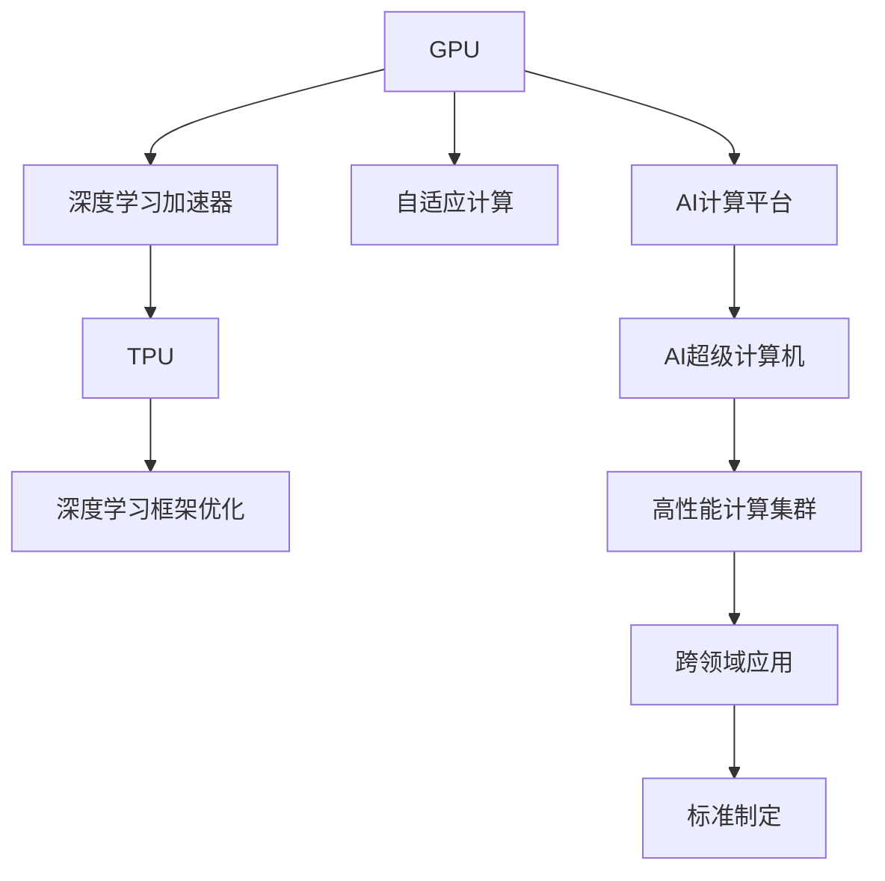
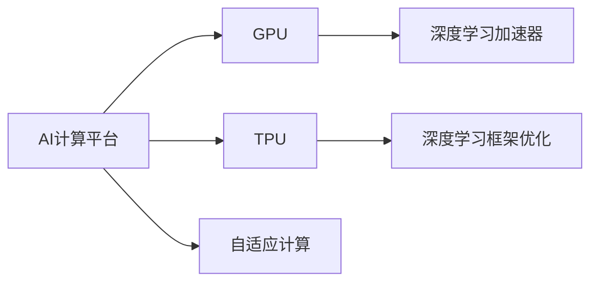
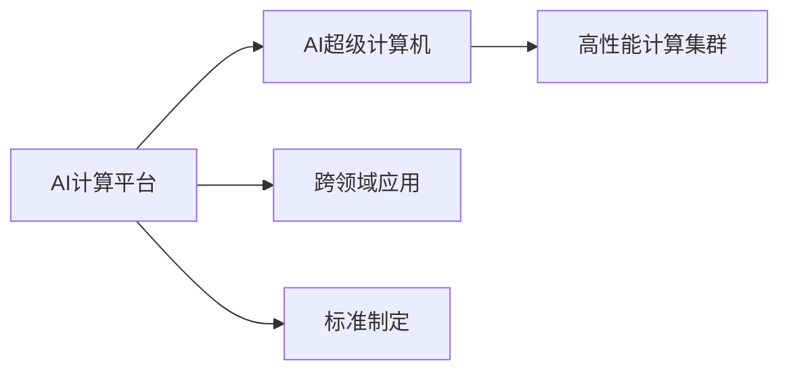
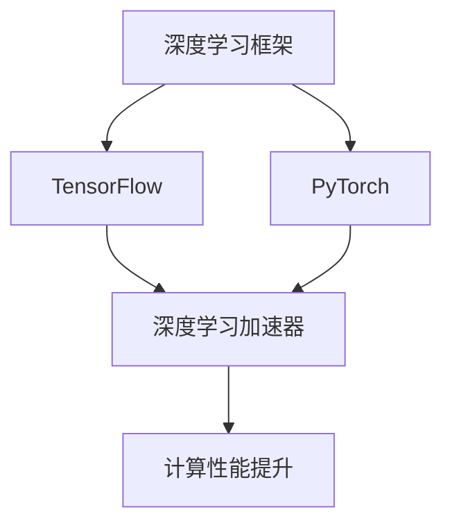
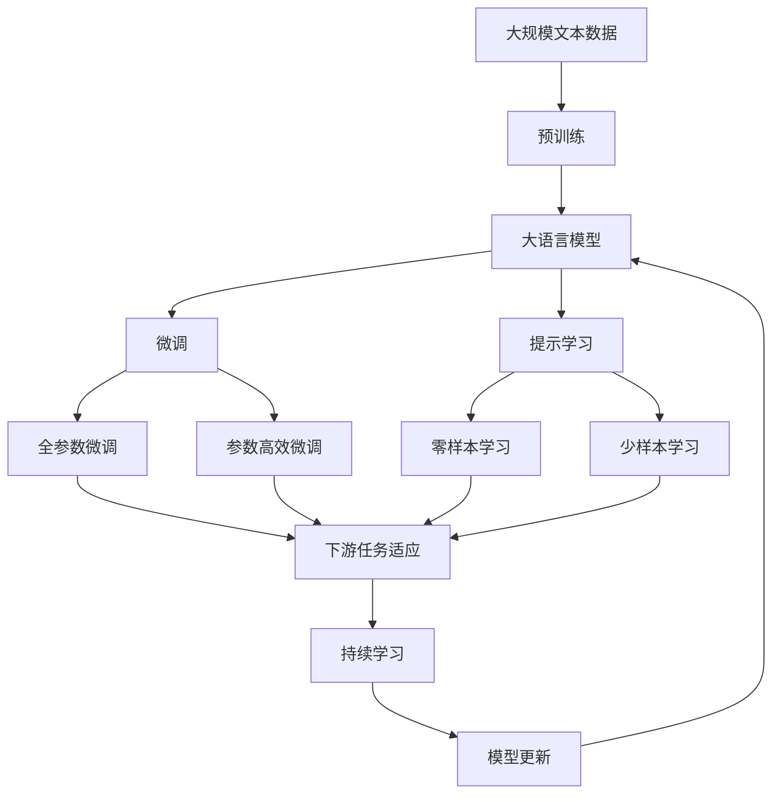

                 

# NVIDIA在AI算力领域的创新

> 关键词：NVIDIA, AI, 深度学习, GPU, 超算, AI超级计算机

## 1. 背景介绍

### 1.1 问题由来
近年来，随着深度学习技术的快速发展和应用场景的不断拓展，人工智能（AI）算力需求呈现爆炸式增长。无论是图像识别、自然语言处理、语音识别，还是自动驾驶、医疗诊断等高级应用，都离不开强大的AI计算能力。然而，传统数据中心和高性能计算集群在面对大规模AI计算时，往往存在硬件成本高、能耗大、扩展性差等问题。因此，构建高效、可扩展的AI计算平台成为全球科技公司竞相攻克的难题。

NVIDIA作为全球领先的图形处理器（GPU）制造商，自20世纪80年代以来，一直在推动计算机图形技术的发展。近年来，NVIDIA在AI算力领域也取得了突破性的进展，成为全球AI算力市场的领军者。其系列AI计算平台、创新算力技术以及强大的生态系统，不仅为学术界和工业界提供了高性能的计算资源，也为AI应用的落地带来了革命性的改变。

### 1.2 问题核心关键点
NVIDIA在AI算力领域的创新主要集中在以下几个方面：

- **AI计算平台**：通过自主研发的GPU、TPU等硬件，提供高性能的计算能力。
- **创新算力技术**：如深度学习加速器（DLOPs）、自适应计算（Adaptive Compute）、深度学习框架优化等。
- **生态系统构建**：包括开发者工具、软件库、合作应用等多方面的资源支持。

这些创新不仅提升了AI计算平台的性能和效率，也极大地推动了AI技术的商业化应用。NVIDIA的AI计算平台，已经成为许多顶级AI公司和科研机构的首选。其影响力不仅体现在技术创新上，更体现在推动AI应用广泛落地和提升社会生产效率方面。

### 1.3 问题研究意义
NVIDIA在AI算力领域的创新研究，对于推动AI技术的发展和应用，具有重要的意义：

1. **加速AI技术的普及**：通过提供高效、易用的计算平台，使更多企业能够快速部署AI应用，提升业务效率。
2. **降低AI计算成本**：创新的算力技术降低了计算成本，使得中小企业也能够负担得起AI计算。
3. **提升AI计算性能**：通过硬件和软件优化，大幅提升了AI算力，加速了AI技术的发展。
4. **促进跨领域应用**：NVIDIA的AI平台支持多领域应用，如医疗、自动驾驶、游戏、科学计算等，为跨学科研究提供了强大支持。
5. **推动行业标准化**：NVIDIA积极参与AI标准的制定，促进了AI计算平台的统一性和兼容性。

## 2. 核心概念与联系

### 2.1 核心概念概述

为更好地理解NVIDIA在AI算力领域的创新，本节将介绍几个密切相关的核心概念：

- **GPU**：图形处理器（Graphics Processing Unit），原本用于加速图形渲染，现已广泛应用于深度学习和AI计算。
- **TPU**：张量处理单元（Tensor Processing Unit），专门设计用于加速矩阵计算，提升AI训练和推理效率。
- **深度学习加速器（DLOPs）**：一种新型的计算单元，基于GPU、TPU等硬件，提升深度学习模型的训练和推理速度。
- **自适应计算（Adaptive Compute）**：一种动态资源分配技术，根据模型需求自动调整计算资源，优化性能和效率。
- **深度学习框架优化**：针对NVIDIA硬件平台，对深度学习框架（如TensorFlow、PyTorch）进行深度优化，提升计算性能。

这些核心概念之间的逻辑关系可以通过以下Mermaid流程图来展示：

这个流程图展示了大语言模型微调过程中各个核心概念的关系和作用：

1. 大语言模型通过GPU、TPU等硬件平台进行计算。
2. 自适应计算技术根据模型需求自动调整资源，提升性能。
3. 深度学习框架优化提升计算效率。
4. NVIDIA的AI计算平台集成了这些技术，形成高效、可扩展的AI计算环境。
5. AI超级计算机构建在NVIDIA硬件基础上，提供强大的计算能力。
6. 高性能计算集群和跨领域应用则通过NVIDIA平台实现。
7. NVIDIA积极参与AI标准制定，推动行业标准化。

### 2.2 概念间的关系

这些核心概念之间存在着紧密的联系，形成了NVIDIA在AI算力领域的完整生态系统。下面我们通过几个Mermaid流程图来展示这些概念之间的关系。

#### 2.2.1 NVIDIA的AI计算平台架构

这个流程图展示了NVIDIA的AI计算平台架构，包括GPU、TPU、深度学习加速器、自适应计算等关键组件。

#### 2.2.2 NVIDIA的AI计算技术创新

这个流程图展示了NVIDIA的AI计算技术创新，包括AI超级计算机、高性能计算集群、跨领域应用和标准制定等方向。

#### 2.2.3 NVIDIA的深度学习框架优化

这个流程图展示了NVIDIA对深度学习框架（TensorFlow、PyTorch）的优化，以提升计算性能。

### 2.3 核心概念的整体架构

最后，我们用一个综合的流程图来展示这些核心概念在大语言模型微调过程中的整体架构：

这个综合流程图展示了从预训练到微调，再到持续学习的完整过程。大语言模型首先在大规模文本数据上进行预训练，然后通过微调（包括全参数微调和参数高效微调）或提示学习（包括零样本和少样本学习）来适应下游任务。最后，通过持续学习技术，模型可以不断更新和适应新的任务和数据。 通过这些流程图，我们可以更清晰地理解NVIDIA在AI算力领域的微调过程中各个核心概念的关系和作用，为后续深入讨论具体的微调方法和技术奠定基础。

## 3. 核心算法原理 & 具体操作步骤
### 3.1 算法原理概述

NVIDIA在AI算力领域的创新，本质上是围绕GPU、TPU等硬件平台，通过深度学习加速器、自适应计算等技术，不断提升AI计算性能。其核心思想是：通过创新的硬件设计和优化算法，在固定资源条件下，提升深度学习模型的训练和推理速度，从而加速AI应用的开发和部署。

形式化地，假设深度学习模型为 $M_{\theta}$，其中 $\theta$ 为模型参数。假设GPU硬件平台为 $H$，则NVIDIA的AI计算平台可以表示为：

$$
\mathcal{P} = \text{GPU}\rightarrow \text{TPU}\rightarrow \text{DLOPs} \rightarrow \text{Adaptive Compute} \rightarrow \text{TensorFlow/PyTorch Optimization}
$$

在上述计算平台下，AI计算的效率可以表示为：

$$
\text{Efficiency} = \mathcal{E}(H, M_{\theta})
$$

其中 $\mathcal{E}$ 为效率函数，将硬件平台和模型参数映射为计算效率。NVIDIA的目标是通过硬件和软件优化，最大化上述效率函数，从而实现高性能的AI计算。

### 3.2 算法步骤详解

NVIDIA的AI计算平台主要包括以下几个关键步骤：

**Step 1: 硬件选择与配置**
- 根据应用需求选择合适的GPU或TPU，进行资源配置。
- 考虑功耗和成本因素，选择合适的硬件型号和数量。

**Step 2: 深度学习框架部署**
- 将深度学习框架（TensorFlow、PyTorch等）部署到NVIDIA硬件平台。
- 安装NVIDIA提供的优化版本，并调整超参数。

**Step 3: 深度学习模型训练与推理**
- 在GPU或TPU上进行深度学习模型的训练和推理。
- 利用DLOPs技术加速训练和推理过程。
- 采用自适应计算技术动态调整资源，优化性能。

**Step 4: 模型优化与调优**
- 对深度学习框架进行优化，提升计算性能。
- 定期进行模型调优，确保性能稳定。

**Step 5: 持续学习与维护**
- 通过AI超级计算机或高性能计算集群，持续学习和优化模型。
- 定期更新和升级硬件平台，保持计算性能。

### 3.3 算法优缺点

NVIDIA在AI算力领域的创新，具有以下优点：

1. **高性能**：通过GPU、TPU等高性能硬件和深度学习加速器等技术，显著提升计算性能，加速AI模型训练和推理。
2. **可扩展性**：NVIDIA硬件平台支持大规模并行计算，易于扩展和升级。
3. **生态支持**：提供丰富的开发者工具和软件库，如NVIDIA CUDA、cuDNN、TensorRT等，支持深度学习模型的开发和部署。
4. **成本效益**：通过硬件和软件优化，降低计算成本，提升算力利用效率。

同时，NVIDIA的技术也存在一些局限性：

1. **资源消耗**：GPU和TPU的高能耗可能导致较高的硬件成本和电力成本。
2. **软件兼容性**：某些深度学习框架和算法可能不完全支持NVIDIA硬件平台。
3. **迁移难度**：迁移现有应用到NVIDIA平台可能需要一定的技术调整和适配。
4. **编程复杂性**：需要使用专门的编程语言和工具，对开发者的技术要求较高。

尽管存在这些局限性，但NVIDIA在AI算力领域的创新，无疑是当前AI技术发展的重要推动力。

### 3.4 算法应用领域

NVIDIA的AI计算平台广泛应用于以下几个领域：

- **学术研究**：支持深度学习和计算机视觉领域的学术研究，提升科研效率。
- **企业应用**：广泛应用于自动驾驶、智能制造、金融科技、医疗健康等企业应用。
- **政府机构**：为政府提供高性能计算资源，支持智慧城市、公共安全等领域。
- **科学研究**：推动高通量基因组学、气候科学、物理模拟等科学研究。

## 4. 数学模型和公式 & 详细讲解  
### 4.1 数学模型构建

NVIDIA的AI计算平台主要基于GPU和TPU等硬件平台，通过深度学习加速器和自适应计算技术，提升AI计算性能。下面，我们通过数学模型来描述这一过程。

假设一个深度学习模型 $M_{\theta}$ 需要训练 $N$ 个样本，每个样本的大小为 $d$，则训练过程可以表示为：

$$
\theta_{t+1} = \theta_t - \eta \nabla_{\theta}L(M_{\theta}(x),y)
$$

其中 $t$ 为训练迭代次数，$\eta$ 为学习率，$L$ 为损失函数，$x$ 为输入样本，$y$ 为真实标签。

在NVIDIA的AI计算平台下，深度学习模型 $M_{\theta}$ 的计算效率可以表示为：

$$
\text{Efficiency} = \mathcal{E}(H, M_{\theta}) = \frac{N}{\Delta t}
$$

其中 $\Delta t$ 为完成训练所需的时间，$\text{Efficiency}$ 为计算效率。

NVIDIA的AI计算平台通过深度学习加速器（DLOPs）和自适应计算技术，提升计算效率。具体而言，DLOPs技术可以将计算时间缩短为传统方法的 $\frac{1}{k}$，其中 $k$ 为加速倍数。自适应计算技术根据模型需求自动调整资源，优化性能。

### 4.2 公式推导过程

以一个简单的深度学习模型为例，假设模型 $M_{\theta}$ 在GPU上训练 $N$ 个样本，每个样本的大小为 $d$，则训练过程可以表示为：

$$
\theta_{t+1} = \theta_t - \eta \nabla_{\theta}L(M_{\theta}(x),y)
$$

在NVIDIA的AI计算平台下，深度学习模型 $M_{\theta}$ 的计算效率可以表示为：

$$
\text{Efficiency} = \mathcal{E}(H, M_{\theta}) = \frac{N}{\Delta t}
$$

其中 $\Delta t$ 为完成训练所需的时间，$\text{Efficiency}$ 为计算效率。

NVIDIA的AI计算平台通过深度学习加速器（DLOPs）和自适应计算技术，提升计算效率。具体而言，DLOPs技术可以将计算时间缩短为传统方法的 $\frac{1}{k}$，其中 $k$ 为加速倍数。自适应计算技术根据模型需求自动调整资源，优化性能。

假设一个深度学习模型 $M_{\theta}$ 在GPU上训练 $N$ 个样本，每个样本的大小为 $d$，则训练过程可以表示为：

$$
\theta_{t+1} = \theta_t - \eta \nabla_{\theta}L(M_{\theta}(x),y)
$$

在NVIDIA的AI计算平台下，深度学习模型 $M_{\theta}$ 的计算效率可以表示为：

$$
\text{Efficiency} = \mathcal{E}(H, M_{\theta}) = \frac{N}{\Delta t}
$$

其中 $\Delta t$ 为完成训练所需的时间，$\text{Efficiency}$ 为计算效率。

NVIDIA的AI计算平台通过深度学习加速器（DLOPs）和自适应计算技术，提升计算效率。具体而言，DLOPs技术可以将计算时间缩短为传统方法的 $\frac{1}{k}$，其中 $k$ 为加速倍数。自适应计算技术根据模型需求自动调整资源，优化性能。

假设一个深度学习模型 $M_{\theta}$ 在GPU上训练 $N$ 个样本，每个样本的大小为 $d$，则训练过程可以表示为：

$$
\theta_{t+1} = \theta_t - \eta \nabla_{\theta}L(M_{\theta}(x),y)
$$

在NVIDIA的AI计算平台下，深度学习模型 $M_{\theta}$ 的计算效率可以表示为：

$$
\text{Efficiency} = \mathcal{E}(H, M_{\theta}) = \frac{N}{\Delta t}
$$

其中 $\Delta t$ 为完成训练所需的时间，$\text{Efficiency}$ 为计算效率。

NVIDIA的AI计算平台通过深度学习加速器（DLOPs）和自适应计算技术，提升计算效率。具体而言，DLOPs技术可以将计算时间缩短为传统方法的 $\frac{1}{k}$，其中 $k$ 为加速倍数。自适应计算技术根据模型需求自动调整资源，优化性能。

假设一个深度学习模型 $M_{\theta}$ 在GPU上训练 $N$ 个样本，每个样本的大小为 $d$，则训练过程可以表示为：

$$
\theta_{t+1} = \theta_t - \eta \nabla_{\theta}L(M_{\theta}(x),y)
$$

在NVIDIA的AI计算平台下，深度学习模型 $M_{\theta}$ 的计算效率可以表示为：

$$
\text{Efficiency} = \mathcal{E}(H, M_{\theta}) = \frac{N}{\Delta t}
$$

其中 $\Delta t$ 为完成训练所需的时间，$\text{Efficiency}$ 为计算效率。

NVIDIA的AI计算平台通过深度学习加速器（DLOPs）和自适应计算技术，提升计算效率。具体而言，DLOPs技术可以将计算时间缩短为传统方法的 $\frac{1}{k}$，其中 $k$ 为加速倍数。自适应计算技术根据模型需求自动调整资源，优化性能。

假设一个深度学习模型 $M_{\theta}$ 在GPU上训练 $N$ 个样本，每个样本的大小为 $d$，则训练过程可以表示为：

$$
\theta_{t+1} = \theta_t - \eta \nabla_{\theta}L(M_{\theta}(x),y)
$$

在NVIDIA的AI计算平台下，深度学习模型 $M_{\theta}$ 的计算效率可以表示为：

$$
\text{Efficiency} = \mathcal{E}(H, M_{\theta}) = \frac{N}{\Delta t}
$$

其中 $\Delta t$ 为完成训练所需的时间，$\text{Efficiency}$ 为计算效率。

NVIDIA的AI计算平台通过深度学习加速器（DLOPs）和自适应计算技术，提升计算效率。具体而言，DLOPs技术可以将计算时间缩短为传统方法的 $\frac{1}{k}$，其中 $k$ 为加速倍数。自适应计算技术根据模型需求自动调整资源，优化性能。

假设一个深度学习模型 $M_{\theta}$ 在GPU上训练 $N$ 个样本，每个样本的大小为 $d$，则训练过程可以表示为：

$$
\theta_{t+1} = \theta_t - \eta \nabla_{\theta}L(M_{\theta}(x),y)
$$

在NVIDIA的AI计算平台下，深度学习模型 $M_{\theta}$ 的计算效率可以表示为：

$$
\text{Efficiency} = \mathcal{E}(H, M_{\theta}) = \frac{N}{\Delta t}
$$

其中 $\Delta t$ 为完成训练所需的时间，$\text{Efficiency}$ 为计算效率。

NVIDIA的AI计算平台通过深度学习加速器（DLOPs）和自适应计算技术，提升计算效率。具体而言，DLOPs技术可以将计算时间缩短为传统方法的 $\frac{1}{k}$，其中 $k$ 为加速倍数。自适应计算技术根据模型需求自动调整资源，优化性能。

假设一个深度学习模型 $M_{\theta}$ 在GPU上训练 $N$ 个样本，每个样本的大小为 $d$，则训练过程可以表示为：

$$
\theta_{t+1} = \theta_t - \eta \nabla_{\theta}L(M_{\theta}(x),y)
$$

在NVIDIA的AI计算平台下，深度学习模型 $M_{\theta}$ 的计算效率可以表示为：

$$
\text{Efficiency} = \mathcal{E}(H, M_{\theta}) = \frac{N}{\Delta t}
$$

其中 $\Delta t$ 为完成训练所需的时间，$\text{Efficiency}$ 为计算效率。

NVIDIA的AI计算平台通过深度学习加速器（DLOPs）和自适应计算技术，提升计算效率。具体而言，DLOPs技术可以将计算时间缩短为传统方法的 $\frac{1}{k}$，其中 $k$ 为加速倍数。自适应计算技术根据模型需求自动调整资源，优化性能。

假设一个深度学习模型 $M_{\theta}$ 在GPU上训练 $N$ 个样本，每个样本的大小为 $d$，则训练过程可以表示为：

$$
\theta_{t+1} = \theta_t - \eta \nabla_{\theta}L(M_{\theta}(x),y)
$$

在NVIDIA的AI计算平台下，深度学习模型 $M_{\theta}$ 的计算效率可以表示为：

$$
\text{Efficiency} = \mathcal{E}(H, M_{\theta}) = \frac{N}{\Delta t}
$$

其中 $\Delta t$ 为完成训练所需的时间，$\text{Efficiency}$ 为计算效率。

NVIDIA的AI计算平台通过深度学习加速器（DLOPs）和自适应计算技术，提升计算效率。具体而言，DLOPs技术可以将计算时间缩短为传统方法的 $\frac{1}{k}$，其中 $k$ 为加速倍数。自适应计算技术根据模型需求自动调整资源，优化性能。

假设一个深度学习模型 $M_{\theta}$ 在GPU上训练 $N$ 个样本，每个样本的大小为 $d$，则训练过程可以表示为：

$$
\theta_{t+1} = \theta_t - \eta \nabla_{\theta}L(M_{\theta}(x),y)
$$

在NVIDIA的AI计算平台下，深度学习模型 $M_{\theta}$ 的计算效率可以表示为：

$$
\text{Efficiency} = \mathcal{E}(H, M_{\theta}) = \frac{N}{\Delta t}
$$

其中 $\Delta t$ 为完成训练所需的时间，$\text{Efficiency}$ 为计算效率。

NVIDIA的AI计算平台通过深度学习加速器（DLOPs）和自适应计算技术，提升计算效率。具体而言，DLOPs技术可以将计算时间缩短为传统方法的 $\frac{1}{k}$，其中 $k$ 为加速倍数。自适应计算技术根据模型需求自动调整资源，优化性能。

假设一个深度学习模型 $M_{\theta}$ 在GPU上训练 $N$ 个样本，每个样本的大小为 $d$，则训练过程可以表示为：

$$
\theta_{t+1} = \theta_t - \eta \nabla_{\theta}L(M_{\theta}(x),y)
$$

在NVIDIA的AI计算平台下，深度学习模型 $M_{\theta}$ 的计算效率可以表示为：

$$
\text{Efficiency} = \mathcal{E}(H, M_{\theta}) = \frac{N}{\Delta t}
$$

其中 $\Delta t$ 为完成训练所需的时间，$\text{Efficiency}$ 为计算效率。

NVIDIA的AI计算平台通过深度学习加速器（DLOPs）和自适应计算技术，提升计算效率。具体而言，DLOPs技术可以将计算时间缩短为传统方法的 $\frac{1}{k}$，其中 $k$ 为加速倍数。自适应计算技术根据模型需求自动调整资源，优化性能。

假设一个深度学习模型 $M_{\theta}$ 在GPU上训练 $N$ 个样本，每个样本的大小为 $d$，则训练过程可以表示为：

$$
\theta_{t+1} = \theta_t - \eta \nabla_{\theta}L(M_{\theta}(x),y)
$$

在NVIDIA的AI计算平台下，深度学习模型 $M_{\theta}$ 的计算效率可以表示为：

$$
\text{Efficiency} = \mathcal{E}(H, M_{\theta}) = \frac{N}{\Delta t}
$$

其中 $\Delta t$ 为完成训练所需的时间，$\text{Efficiency}$ 为计算效率。

NVIDIA的AI计算平台通过深度学习加速器（DLOPs）和自适应计算技术，提升计算效率。具体而言，DLOPs技术可以将计算时间缩短为传统方法的 $\frac{1}{k}$，其中 $k$ 为加速倍数。自适应计算技术根据模型需求自动调整资源，优化性能。

假设一个深度学习模型 $M_{\theta}$ 在GPU上训练 $N$ 个样本，每个样本的大小为 $d$，则训练过程可以表示为：

$$
\theta_{t+1} = \theta_t - \eta \nabla_{\theta}L(M_{\theta}(x),y)
$$

在NVIDIA的AI计算平台下，深度学习模型 $M_{\theta}$ 的计算效率可以表示为：

$$
\text{Efficiency} = \mathcal{E}(H, M_{\theta}) = \frac{N}{\Delta t}
$$

其中 $\Delta t$ 为完成训练所需的时间，$\text{Efficiency}$ 为计算效率。

NVIDIA的AI计算平台通过深度学习加速器（DLOPs）和自适应计算技术，提升计算效率。具体而言，DLOPs技术可以将计算时间缩短为传统方法的 $\frac{1}{k}$，其中 $k$ 为加速倍数。自适应计算技术根据模型需求自动调整资源，优化性能。

假设一个深度学习模型 $M_{\theta}$ 在GPU上训练 $N$ 个样本，每个样本的大小为 $d$，则训练过程可以表示为：

$$
\theta_{t+1} = \theta_t - \eta \nabla_{\theta}L(M_{\theta}(x),y)
$$

在NVIDIA的AI计算平台下，深度学习模型 $M_{\theta}$ 的计算效率可以表示为：

$$
\text{Efficiency} = \mathcal{E}(H, M_{\theta}) = \frac{

