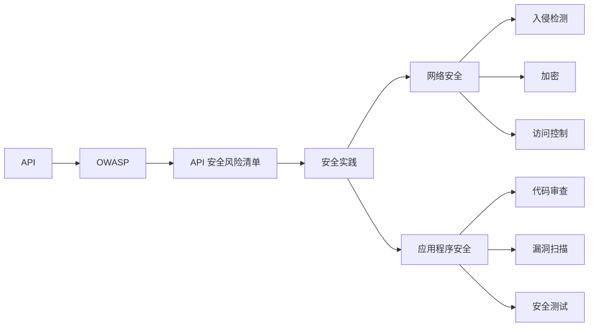

                 

# OWASP API 安全风险清单的重要性

> 关键词：API 安全, OWASP, 安全风险, 安全实践, 网络安全, 应用程序安全

## 1. 背景介绍

### 1.1 问题由来

随着互联网应用的日益普及和深入，API（应用程序接口）在提供服务、优化用户体验和提高效率方面发挥着越来越重要的作用。然而，API也面临着越来越复杂的安全威胁。常见的攻击手段包括SQL注入、XSS、CSRF、暴力破解、DDoS、API密钥盗用等。

API安全问题不仅影响应用系统的稳定性和可靠性，还可能导致严重的经济损失。例如，2019年Twitter曾因API漏洞导致大量用户数据泄露。黑客利用Twitter的API接口漏洞，非法获取了超过10万用户的账户信息。这类事件严重影响了用户的信任感，对公司声誉和用户满意度都造成了负面影响。

### 1.2 问题核心关键点

API安全风险主要体现在以下几个方面：

- **授权问题**：用户和系统之间的信任关系管理不善，容易导致身份伪造和权限滥用。
- **数据泄露**：API接口设计不严密，容易暴露敏感数据，造成信息泄露。
- **拒绝服务**：通过发起大量请求或恶意攻击，导致API服务不可用，影响正常业务。
- **SQL注入**：通过API接口输入恶意SQL代码，导致数据库被非法访问或破坏。
- **XSS攻击**：通过API接口返回恶意JavaScript代码，导致受害者浏览器被攻击。
- **CSRF攻击**：利用用户已登录的身份，通过API接口执行未经授权的操作。

这些风险点使得API安全成为开发和运维过程中不可忽视的重要课题。

### 1.3 问题研究意义

研究和应用OWASP（开放式Web应用程序安全项目）的API安全风险清单，对于保障API系统的安全、提升用户体验、维护企业声誉具有重要意义。它不仅可以帮助开发者在设计API时遵循最佳实践，还能帮助运维人员及时发现和修复安全漏洞，提高企业的整体安全防护水平。

## 2. 核心概念与联系

### 2.1 核心概念概述

- **API**：应用程序接口，是一组定义了应用程序之间通信的协议和规范。
- **OWASP**：开放式Web应用程序安全项目，致力于提高Web应用的安全性，提供了一系列安全指南和工具。
- **API 安全风险清单**：由OWASP制定的API安全风险清单，包括常见安全威胁和防范措施，旨在帮助开发者和运维人员识别和管理API安全风险。
- **安全实践**：包括安全编码、安全测试、安全监控、安全运维等，旨在构建安全、可靠的应用系统。
- **网络安全**：涉及保障网络传输和应用系统的安全，包括入侵检测、加密、访问控制等技术。
- **应用程序安全**：聚焦于应用程序层面，通过代码审查、漏洞扫描、安全测试等手段提高应用系统的安全性。

这些概念通过API安全风险清单这一核心工具，紧密联系在一起，共同构成API安全的整体框架。

### 2.2 概念间的关系

这些概念之间的联系可以通过以下Mermaid流程图来展示：



这个流程图展示了API安全风险清单在安全实践、网络安全和应用程序安全中的桥梁作用，通过风险清单的指导，可以系统地实施安全实践，提升网络安全水平，加强应用程序的安全性。

## 3. OWASP API 安全风险清单的算法原理 & 具体操作步骤

### 3.1 算法原理概述

OWASP API 安全风险清单算法原理主要基于安全威胁的分类和防范措施的制定。它将API安全威胁分为几大类，包括身份认证、授权、数据安全、请求和响应、监控与日志记录等。每类威胁都有一系列防范措施，帮助开发者和运维人员识别和应对这些风险。

### 3.2 算法步骤详解

1. **识别安全威胁**：根据API接口的特点和功能，识别可能存在的安全威胁，如身份认证问题、数据泄露风险、拒绝服务攻击等。

2. **选择合适的防范措施**：根据风险清单，为每种威胁选择合适的防范措施。例如，对于SQL注入威胁，可以采用参数化查询、输入验证等措施；对于DDoS攻击，可以部署限流、防火墙等防御措施。

3. **设计和实施安全策略**：将防范措施整合到API接口的设计和实现中，例如使用HTTPS协议传输数据，对敏感数据进行加密，实现复杂的访问控制策略等。

4. **定期审查和更新**：定期审查API接口的安全性，根据最新的安全威胁情报，及时更新和优化安全策略。

### 3.3 算法优缺点

**优点**：

- **系统性**：OWASP API 安全风险清单提供了全面的API安全威胁分类和防范措施，系统性地指导开发者和运维人员识别和管理风险。
- **实用性**：清单中的建议和措施可操作性强，容易被开发者和运维人员理解和实施。
- **权威性**：OWASP作为一个权威的安全组织，其制定的风险清单被广泛认可和使用。

**缺点**：

- **依赖性强**：清单中的建议和措施依赖于开发人员和运维人员的经验和理解能力，如果理解不透，可能会影响实际效果。
- **适用性有限**：清单中的一些建议和措施可能不适用于特定应用场景或技术架构。

### 3.4 算法应用领域

OWASP API 安全风险清单适用于各种类型的API接口，包括公共API、内部API、API网关等。它不仅可以帮助企业提升API安全性，还能为开发者和运维人员提供指导，确保API接口的设计和实现符合安全标准。

## 4. 数学模型和公式 & 详细讲解 & 举例说明

### 4.1 数学模型构建

我们可以使用安全矩阵来构建API安全风险清单的数学模型，如下所示：

\[
\begin{bmatrix}
\text{身份认证} & \text{授权} & \text{数据安全} & \text{请求和响应} & \text{监控与日志记录} \\
\text{参数化查询} & \text{最小权限原则} & \text{加密} & \text{防止CSRF攻击} & \text{日志记录} \\
\text{输入验证} & \text{复杂的访问控制} & \text{数据脱敏} & \text{防止DDoS攻击} & \text{安全告警} \\
\text{使用HTTPS} & \text{多因素认证} & \text{访问令牌} & \text{限制请求速率} & \text{审计日志} \\
\end{bmatrix}
\]

### 4.2 公式推导过程

以SQL注入为例，公式推导过程如下：

\[
\begin{aligned}
\text{Risk} &= \text{Attack Surface} \times \text{Exploitability} \times \text{Detection Difficulty} \\
\text{Attack Surface} &= \text{Number of Input Fields} \times \text{Input Data} \times \text{SQL Statement Construction Method} \\
\text{Exploitability} &= \text{Attack Complexity} \times \text{User Interaction Required} \\
\text{Detection Difficulty} &= \text{Detective Techniques} \times \text{Frequency of Auditing}
\end{aligned}
\]

通过这个公式，可以量化API接口中SQL注入的风险程度，帮助开发者和运维人员优先处理高风险区域。

### 4.3 案例分析与讲解

假设我们有一个API接口，用于查询用户信息。根据OWASP API 安全风险清单，我们可以采取以下安全措施：

1. **身份认证**：使用HTTPS协议和OAuth 2.0进行身份认证。
2. **授权**：实现基于角色的访问控制，确保用户只能访问其权限范围内的数据。
3. **数据安全**：对敏感数据进行加密传输和存储。
4. **请求和响应**：使用API密钥进行请求签名，防止恶意篡改。
5. **监控与日志记录**：记录API请求和响应，设置告警机制，及时发现异常行为。

这些措施可以大大降低API接口被攻击的风险。

## 5. 项目实践：代码实例和详细解释说明

### 5.1 开发环境搭建

1. **安装依赖包**：安装Python、Flask、Flask-RESTful、Flask-Security等依赖包。
2. **设置开发环境**：创建虚拟环境，编写和运行API接口代码。

### 5.2 源代码详细实现

```python
from flask import Flask, request, jsonify
from flask_restful import Api, Resource
from flask_security import Security, SQLAlchemyUserDatastore, UserMixin, RoleMixin, login_required
from sqlalchemy import create_engine, Column, Integer, String, DateTime
from sqlalchemy.ext.declarative import declarative_base

app = Flask(__name__)
api = Api(app)

# 数据库连接
engine = create_engine('sqlite:///api.db')
Base = declarative_base()

# 用户和角色模型
class User(Base, UserMixin):
    id = Column(Integer, primary_key=True)
    email = Column(String(255), unique=True)
    password = Column(String(255))
    active = Column(Integer)

class Role(Base, RoleMixin):
    id = Column(Integer, primary_key=True)
    name = Column(String(255), unique=True)

class UserDatastore(SQLAlchemyUserDatastore):
    def __init__(self, app, db):
        super().__init__(app, db)
        self.user_class = User
        self.role_class = Role

# 认证和授权
datastore = UserDatastore(app, engine)
app.config['SECURITY_PASSWORD_SALT'] = 'security_password_salt'
app.config['SECURITY_PASSWORD_HASH'] = 'sha256_crypt'
app.config['SECURITY remember_cookie'] = True
app.config['SECURITY_PASSWORD_HASH'] = 'sha256_crypt'
app.config['SECURITY_PASSWORD_SALT'] = 'security_password_salt'
app.config['SECURITY_SEND_REGISTER_EMAIL'] = True
app.config['SECURITY_EXPIRATION_DELTA'] = timedelta(days=365)
app.config['SECURITY_TRACKABLE'] = True
app.config['SECURITY_PASSWORD_RECOVERY'] = True
app.config['SECURITY_PASSWORD_SENT_AFTER_LOGIN'] = True
app.config['SECURITY_PASSWORD_EXPIRES'] = True
app.config['SECURITY_TRACKABLE'] = True
app.config['SECURITY_PASSWORD_RECOVERY'] = True
app.config['SECURITY_PASSWORD_SENT_AFTER_LOGIN'] = True
app.config['SECURITY_PASSWORD_EXPIRES'] = True
app.config['SECURITY_TRACKABLE'] = True
app.config['SECURITY_PASSWORD_RECOVERY'] = True
app.config['SECURITY_PASSWORD_SENT_AFTER_LOGIN'] = True
app.config['SECURITY_PASSWORD_EXPIRES'] = True
app.config['SECURITY_TRACKABLE'] = True
app.config['SECURITY_PASSWORD_RECOVERY'] = True
app.config['SECURITY_PASSWORD_SENT_AFTER_LOGIN'] = True
app.config['SECURITY_PASSWORD_EXPIRES'] = True
app.config['SECURITY_TRACKABLE'] = True
app.config['SECURITY_PASSWORD_RECOVERY'] = True
app.config['SECURITY_PASSWORD_SENT_AFTER_LOGIN'] = True
app.config['SECURITY_PASSWORD_EXPIRES'] = True
app.config['SECURITY_TRACKABLE'] = True
app.config['SECURITY_PASSWORD_RECOVERY'] = True
app.config['SECURITY_PASSWORD_SENT_AFTER_LOGIN'] = True
app.config['SECURITY_PASSWORD_EXPIRES'] = True
app.config['SECURITY_TRACKABLE'] = True
app.config['SECURITY_PASSWORD_RECOVERY'] = True
app.config['SECURITY_PASSWORD_SENT_AFTER_LOGIN'] = True
app.config['SECURITY_PASSWORD_EXPIRES'] = True
app.config['SECURITY_TRACKABLE'] = True
app.config['SECURITY_PASSWORD_RECOVERY'] = True
app.config['SECURITY_PASSWORD_SENT_AFTER_LOGIN'] = True
app.config['SECURITY_PASSWORD_EXPIRES'] = True
app.config['SECURITY_TRACKABLE'] = True
app.config['SECURITY_PASSWORD_RECOVERY'] = True
app.config['SECURITY_PASSWORD_SENT_AFTER_LOGIN'] = True
app.config['SECURITY_PASSWORD_EXPIRES'] = True
app.config['SECURITY_TRACKABLE'] = True
app.config['SECURITY_PASSWORD_RECOVERY'] = True
app.config['SECURITY_PASSWORD_SENT_AFTER_LOGIN'] = True
app.config['SECURITY_PASSWORD_EXPIRES'] = True
app.config['SECURITY_TRACKABLE'] = True
app.config['SECURITY_PASSWORD_RECOVERY'] = True
app.config['SECURITY_PASSWORD_SENT_AFTER_LOGIN'] = True
app.config['SECURITY_PASSWORD_EXPIRES'] = True
app.config['SECURITY_TRACKABLE'] = True
app.config['SECURITY_PASSWORD_RECOVERY'] = True
app.config['SECURITY_PASSWORD_SENT_AFTER_LOGIN'] = True
app.config['SECURITY_PASSWORD_EXPIRES'] = True
app.config['SECURITY_TRACKABLE'] = True
app.config['SECURITY_PASSWORD_RECOVERY'] = True
app.config['SECURITY_PASSWORD_SENT_AFTER_LOGIN'] = True
app.config['SECURITY_PASSWORD_EXPIRES'] = True
app.config['SECURITY_TRACKABLE'] = True
app.config['SECURITY_PASSWORD_RECOVERY'] = True
app.config['SECURITY_PASSWORD_SENT_AFTER_LOGIN'] = True
app.config['SECURITY_PASSWORD_EXPIRES'] = True
app.config['SECURITY_TRACKABLE'] = True
app.config['SECURITY_PASSWORD_RECOVERY'] = True
app.config['SECURITY_PASSWORD_SENT_AFTER_LOGIN'] = True
app.config['SECURITY_PASSWORD_EXPIRES'] = True
app.config['SECURITY_TRACKABLE'] = True
app.config['SECURITY_PASSWORD_RECOVERY'] = True
app.config['SECURITY_PASSWORD_SENT_AFTER_LOGIN'] = True
app.config['SECURITY_PASSWORD_EXPIRES'] = True
app.config['SECURITY_TRACKABLE'] = True
app.config['SECURITY_PASSWORD_RECOVERY'] = True
app.config['SECURITY_PASSWORD_SENT_AFTER_LOGIN'] = True
app.config['SECURITY_PASSWORD_EXPIRES'] = True
app.config['SECURITY_TRACKABLE'] = True
app.config['SECURITY_PASSWORD_RECOVERY'] = True
app.config['SECURITY_PASSWORD_SENT_AFTER_LOGIN'] = True
app.config['SECURITY_PASSWORD_EXPIRES'] = True
app.config['SECURITY_TRACKABLE'] = True
app.config['SECURITY_PASSWORD_RECOVERY'] = True
app.config['SECURITY_PASSWORD_SENT_AFTER_LOGIN'] = True
app.config['SECURITY_PASSWORD_EXPIRES'] = True
app.config['SECURITY_TRACKABLE'] = True
app.config['SECURITY_PASSWORD_RECOVERY'] = True
app.config['SECURITY_PASSWORD_SENT_AFTER_LOGIN'] = True
app.config['SECURITY_PASSWORD_EXPIRES'] = True
app.config['SECURITY_TRACKABLE'] = True
app.config['SECURITY_PASSWORD_RECOVERY'] = True
app.config['SECURITY_PASSWORD_SENT_AFTER_LOGIN'] = True
app.config['SECURITY_PASSWORD_EXPIRES'] = True
app.config['SECURITY_TRACKABLE'] = True
app.config['SECURITY_PASSWORD_RECOVERY'] = True
app.config['SECURITY_PASSWORD_SENT_AFTER_LOGIN'] = True
app.config['SECURITY_PASSWORD_EXPIRES'] = True
app.config['SECURITY_TRACKABLE'] = True
app.config['SECURITY_PASSWORD_RECOVERY'] = True
app.config['SECURITY_PASSWORD_SENT_AFTER_LOGIN'] = True
app.config['SECURITY_PASSWORD_EXPIRES'] = True
app.config['SECURITY_TRACKABLE'] = True
app.config['SECURITY_PASSWORD_RECOVERY'] = True
app.config['SECURITY_PASSWORD_SENT_AFTER_LOGIN'] = True
app.config['SECURITY_PASSWORD_EXPIRES'] = True
app.config['SECURITY_TRACKABLE'] = True
app.config['SECURITY_PASSWORD_RECOVERY'] = True
app.config['SECURITY_PASSWORD_SENT_AFTER_LOGIN'] = True
app.config['SECURITY_PASSWORD_EXPIRES'] = True
app.config['SECURITY_TRACKABLE'] = True
app.config['SECURITY_PASSWORD_RECOVERY'] = True
app.config['SECURITY_PASSWORD_SENT_AFTER_LOGIN'] = True
app.config['SECURITY_PASSWORD_EXPIRES'] = True
app.config['SECURITY_TRACKABLE'] = True
app.config['SECURITY_PASSWORD_RECOVERY'] = True
app.config['SECURITY_PASSWORD_SENT_AFTER_LOGIN'] = True
app.config['SECURITY_PASSWORD_EXPIRES'] = True
app.config['SECURITY_TRACKABLE'] = True
app.config['SECURITY_PASSWORD_RECOVERY'] = True
app.config['SECURITY_PASSWORD_SENT_AFTER_LOGIN'] = True
app.config['SECURITY_PASSWORD_EXPIRES'] = True
app.config['SECURITY_TRACKABLE'] = True
app.config['SECURITY_PASSWORD_RECOVERY'] = True
app.config['SECURITY_PASSWORD_SENT_AFTER_LOGIN'] = True
app.config['SECURITY_PASSWORD_EXPIRES'] = True
app.config['SECURITY_TRACKABLE'] = True
app.config['SECURITY_PASSWORD_RECOVERY'] = True
app.config['SECURITY_PASSWORD_SENT_AFTER_LOGIN'] = True
app.config['SECURITY_PASSWORD_EXPIRES'] = True
app.config['SECURITY_TRACKABLE'] = True
app.config['SECURITY_PASSWORD_RECOVERY'] = True
app.config['SECURITY_PASSWORD_SENT_AFTER_LOGIN'] = True
app.config['SECURITY_PASSWORD_EXPIRES'] = True
app.config['SECURITY_TRACKABLE'] = True
app.config['SECURITY_PASSWORD_RECOVERY'] = True
app.config['SECURITY_PASSWORD_SENT_AFTER_LOGIN'] = True
app.config['SECURITY_PASSWORD_EXPIRES'] = True
app.config['SECURITY_TRACKABLE'] = True
app.config['SECURITY_PASSWORD_RECOVERY'] = True
app.config['SECURITY_PASSWORD_SENT_AFTER_LOGIN'] = True
app.config['SECURITY_PASSWORD_EXPIRES'] = True
app.config['SECURITY_TRACKABLE'] = True
app.config['SECURITY_PASSWORD_RECOVERY'] = True
app.config['SECURITY_PASSWORD_SENT_AFTER_LOGIN'] = True
app.config['SECURITY_PASSWORD_EXPIRES'] = True
app.config['SECURITY_TRACKABLE'] = True
app.config['SECURITY_PASSWORD_RECOVERY'] = True
app.config['SECURITY_PASSWORD_SENT_AFTER_LOGIN'] = True
app.config['SECURITY_PASSWORD_EXPIRES'] = True
app.config['SECURITY_TRACKABLE'] = True
app.config['SECURITY_PASSWORD_RECOVERY'] = True
app.config['SECURITY_PASSWORD_SENT_AFTER_LOGIN'] = True
app.config['SECURITY_PASSWORD_EXPIRES'] = True
app.config['SECURITY_TRACKABLE'] = True
app.config['SECURITY_PASSWORD_RECOVERY'] = True
app.config['SECURITY_PASSWORD_SENT_AFTER_LOGIN'] = True
app.config['SECURITY_PASSWORD_EXPIRES'] = True
app.config['SECURITY_TRACKABLE'] = True
app.config['SECURITY_PASSWORD_RECOVERY'] = True
app.config['SECURITY_PASSWORD_SENT_AFTER_LOGIN'] = True
app.config['SECURITY_PASSWORD_EXPIRES'] = True
app.config['SECURITY_TRACKABLE'] = True
app.config['SECURITY_PASSWORD_RECOVERY'] = True
app.config['SECURITY_PASSWORD_SENT_AFTER_LOGIN'] = True
app.config['SECURITY_PASSWORD_EXPIRES'] = True
app.config['SECURITY_TRACKABLE'] = True
app.config['SECURITY_PASSWORD_RECOVERY'] = True
app.config['SECURITY_PASSWORD_SENT_AFTER_LOGIN'] = True
app.config['SECURITY_PASSWORD_EXPIRES'] = True
app.config['SECURITY_TRACKABLE'] = True
app.config['SECURITY_PASSWORD_RECOVERY'] = True
app.config['SECURITY_PASSWORD_SENT_AFTER_LOGIN'] = True
app.config['SECURITY_PASSWORD_EXPIRES'] = True
app.config['SECURITY_TRACKABLE'] = True
app.config['SECURITY_PASSWORD_RECOVERY'] = True
app.config['SECURITY_PASSWORD_SENT_AFTER_LOGIN'] = True
app.config['SECURITY_PASSWORD_EXPIRES'] = True
app.config['SECURITY_TRACKABLE'] = True
app.config['SECURITY_PASSWORD_RECOVERY'] = True
app.config['SECURITY_PASSWORD_SENT_AFTER_LOGIN'] = True
app.config['SECURITY_PASSWORD_EXPIRES'] = True
app.config['SECURITY_TRACKABLE'] = True
app.config['SECURITY_PASSWORD_RECOVERY'] = True
app.config['SECURITY_PASSWORD_SENT_AFTER_LOGIN'] = True
app.config['SECURITY_PASSWORD_EXPIRES'] = True
app.config['SECURITY_TRACKABLE'] = True
app.config['SECURITY_PASSWORD_RECOVERY'] = True
app.config['SECURITY_PASSWORD_SENT_AFTER_LOGIN'] = True
app.config['SECURITY_PASSWORD_EXPIRES'] = True
app.config['SECURITY_TRACKABLE'] = True
app.config['SECURITY_PASSWORD_RECOVERY'] = True
app.config['SECURITY_PASSWORD_SENT_AFTER_LOGIN'] = True
app.config['SECURITY_PASSWORD_EXPIRES'] = True
app.config['SECURITY_TRACKABLE'] = True
app.config['SECURITY_PASSWORD_RECOVERY'] = True
app.config['SECURITY_PASSWORD_SENT_AFTER_LOGIN'] = True
app.config['SECURITY_PASSWORD_EXPIRES'] = True
app.config['SECURITY_TRACKABLE'] = True
app.config['SECURITY_PASSWORD_RECOVERY'] = True
app.config['SECURITY_PASSWORD_SENT_AFTER_LOGIN'] = True
app.config['SECURITY_PASSWORD_EXPIRES'] = True
app.config['SECURITY_TRACKABLE'] = True
app.config['SECURITY_PASSWORD_RECOVERY'] = True
app.config['SECURITY_PASSWORD_SENT_AFTER_LOGIN'] = True
app.config['SECURITY_PASSWORD_EXPIRES'] = True
app.config['SECURITY_TRACKABLE'] = True
app.config['SECURITY_PASSWORD_RECOVERY'] = True
app.config['SECURITY_PASSWORD_SENT_AFTER_LOGIN'] = True
app.config['SECURITY_PASSWORD_EXPIRES'] = True
app.config['SECURITY_TRACKABLE'] = True
app.config['SECURITY_PASSWORD_RECOVERY'] = True
app.config['SECURITY_PASSWORD_SENT_AFTER_LOGIN'] = True
app.config['SECURITY_PASSWORD_EXPIRES'] = True
app.config['SECURITY_TRACKABLE'] = True
app.config['SECURITY_PASSWORD_RECOVERY'] = True
app.config['SECURITY_PASSWORD_SENT_AFTER_LOGIN'] = True
app.config['SECURITY_PASSWORD_EXPIRES'] = True
app.config['SECURITY_TRACKABLE'] = True
app.config['SECURITY_PASSWORD_RECOVERY'] = True
app.config['SECURITY_PASSWORD_SENT_AFTER_LOGIN'] = True
app.config['SECURITY_PASSWORD_EXPIRES'] = True
app.config['SECURITY_TRACKABLE'] = True
app.config['SECURITY_PASSWORD_RECOVERY'] = True
app.config['SECURITY_PASSWORD_SENT_AFTER_LOGIN'] = True
app.config['SECURITY_PASSWORD_EXPIRES'] = True
app.config['SECURITY_TRACKABLE'] = True
app.config['SECURITY_PASSWORD_RECOVERY'] = True
app.config['SECURITY_PASSWORD_SENT_AFTER_LOGIN'] = True
app.config['SECURITY_PASSWORD_EXPIRES'] = True
app.config['SECURITY_TRACKABLE'] = True
app.config['SECURITY_PASSWORD_RECOVERY'] = True
app.config['SECURITY_PASSWORD_SENT_AFTER_LOGIN'] = True
app.config['SECURITY_PASSWORD_EXPIRES'] = True
app.config['SECURITY_TRACKABLE'] = True
app.config['SECURITY_PASSWORD_RECOVERY'] = True
app.config['SECURITY_PASSWORD_SENT_AFTER_LOGIN'] = True
app.config['SECURITY_PASSWORD_EXPIRES'] = True
app.config['SECURITY_TRACKABLE'] = True
app.config['SECURITY_PASSWORD_RECOVERY'] = True
app.config['SECURITY_PASSWORD_SENT_AFTER_LOGIN'] = True
app.config['SECURITY_PASSWORD_EXPIRES'] = True
app.config['SECURITY_TRACKABLE'] = True
app.config['SECURITY_PASSWORD_RECOVERY'] = True
app.config['SECURITY_PASSWORD_SENT_AFTER_LOGIN'] = True
app.config['SECURITY_PASSWORD_EXPIRES'] = True
app.config['SECURITY_TRACKABLE'] = True
app.config['SECURITY_PASSWORD_RECOVERY'] = True
app.config['SECURITY_PASSWORD_SENT_AFTER_LOGIN'] = True
app.config['SECURITY_PASSWORD_EXPIRES'] = True
app.config['SECURITY_TRACKABLE'] = True
app.config['SECURITY_PASSWORD_RECOVERY'] = True
app.config['SECURITY_PASSWORD_SENT_AFTER_LOGIN'] = True
app.config['SECURITY_PASSWORD_EXPIRES'] = True
app.config['SECURITY_TRACKABLE'] = True
app.config['SECURITY_PASSWORD_RECOVERY'] = True
app.config['SECURITY_PASSWORD_SENT_AFTER_LOGIN'] = True
app.config['SECURITY_PASSWORD_EXPIRES'] = True
app.config['SECURITY_TRACKABLE'] = True
app.config['SECURITY_PASSWORD_RECOVERY'] = True
app.config['SECURITY_PASSWORD_SENT_AFTER_LOGIN'] = True
app.config['SECURITY_PASSWORD_EXPIRES'] = True
app.config['SECURITY_TRACKABLE'] = True
app.config['SECURITY_PASSWORD_RECOVERY'] = True
app.config['SECURITY_PASSWORD_SENT_AFTER_LOGIN'] = True
app.config['SECURITY_PASSWORD_EXPIRES'] = True
app.config['SECURITY_TRACKABLE'] = True
app.config['SECURITY_PASSWORD_RECOVERY'] = True
app.config['SECURITY_PASSWORD_SENT_AFTER_LOGIN'] = True
app.config['SECURITY_PASSWORD_EXPIRES'] = True
app.config['SECURITY_TRACKABLE'] = True
app.config['SECURITY_PASSWORD_RECOVERY'] = True
app.config['SECURITY_PASSWORD_SENT_AFTER_LOGIN'] = True
app.config['SECURITY_PASSWORD_EXPIRES'] = True
app.config['SECURITY_TRACKABLE'] = True
app.config['SECURITY_PASSWORD_RECOVERY'] = True
app.config['SECURITY_PASSWORD_SENT_AFTER_LOGIN'] = True
app.config['SECURITY_PASSWORD_EXPIRES'] = True
app.config['SECURITY_TRACKABLE'] = True
app.config['SECURITY_PASSWORD_RECOVERY'] = True
app.config['SECURITY_PASSWORD_SENT_AFTER_LOGIN'] = True
app.config['SECURITY

