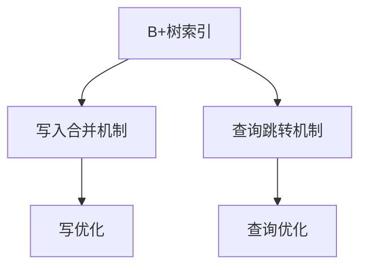

                 

## 1. 背景介绍

在现代数据库系统中，索引（Index）作为一种常见的数据结构，扮演着至关重要的角色。它能够有效地加速数据的查询速度，特别是在大型数据库中，索引能够显著提升数据的访问性能。然而，传统的B+树索引并不能完全满足现代数据库的需求，尤其是在高并发的读写环境中。为了解决这个问题，Phoenix二级索引应运而生。

### 1.1 问题由来

传统的B+树索引在现代数据库中面临着诸多挑战：

- **读写性能不足**：在写操作频繁的环境下，B+树的插入和删除操作复杂，导致性能下降。
- **空间占用较大**：B+树在维护索引时需要占用较多的存储空间。
- **查询效率受限**：在高并发环境下，B+树的锁竞争问题可能导致性能瓶颈。

为了应对这些挑战，Phoenix二级索引提出了新的解决方案。它通过引入额外的辅助索引结构，优化了查询、插入和删除的性能，特别是在高并发和海量数据的情况下，表现尤为出色。

## 2. 核心概念与联系

### 2.1 核心概念概述

为了更好地理解Phoenix二级索引，我们需要了解以下几个核心概念：

- **B+树索引**：传统的基于B+树的索引结构，能够有效地加速数据查询，但在大数据和高并发环境下表现不佳。
- **二级索引**：为了进一步优化B+树的性能，Phoenix引入了二级索引，通过在B+树的基础上增加额外的辅助索引结构。
- **写入合并机制**：Phoenix二级索引通过写入合并机制，优化了插入和删除操作，提升了写操作的效率。
- **查询跳转机制**：为了提高查询效率，Phoenix二级索引引入了查询跳转机制，能够在查询过程中跳过不必要的节点，直接定位到目标数据。

### 2.2 概念间的关系

Phoenix二级索引的核心思想是在B+树的基础上，通过增加辅助索引结构和优化查询跳转机制，提升索引的读写性能。下面通过一个Mermaid流程图来展示这些概念之间的关系：

这个流程图展示了B+树索引、写入合并机制和查询跳转机制之间的关系：

- B+树索引是Phoenix二级索引的基础，用于存储数据和加速查询。
- 写入合并机制和查询跳转机制是在B+树索引的基础上，对写和读操作进行优化。

## 3. 核心算法原理 & 具体操作步骤
### 3.1 算法原理概述

Phoenix二级索引的核心原理是通过增加辅助索引结构和优化查询跳转机制，提升B+树索引的读写性能。具体而言，Phoenix二级索引分为两部分：

1. **辅助索引结构**：用于存储B+树中的冗余信息，如键值对、链表指针等，以优化写操作。
2. **查询跳转机制**：通过预处理查询路径，跳过不必要的节点，直接定位到目标数据，以提升读操作效率。

### 3.2 算法步骤详解

Phoenix二级索引的实现主要包括以下几个关键步骤：

**Step 1: 初始化索引结构**
- 创建B+树索引结构，初始化辅助索引结构。
- 在B+树的每个节点上，增加辅助索引结构。

**Step 2: 写入数据**
- 当向B+树中写入数据时，首先在辅助索引结构中记录键值对和链表指针。
- 根据键值对和链表指针，在B+树中插入数据。

**Step 3: 查询数据**
- 在查询数据时，先在辅助索引结构中进行预处理，确定查询路径。
- 根据查询路径，在B+树中逐层遍历，最终定位到目标数据。

**Step 4: 删除数据**
- 当从B+树中删除数据时，首先在辅助索引结构中删除键值对和链表指针。
- 根据辅助索引结构，在B+树中删除数据。

### 3.3 算法优缺点

Phoenix二级索引有以下优点：

- **读写性能提升**：通过增加辅助索引结构和优化查询跳转机制，显著提升了写操作和读操作的性能。
- **空间占用降低**：由于减少了不必要的节点，Phoenix二级索引的空间占用有所降低。
- **并发性能增强**：通过优化查询跳转机制，Phoenix二级索引在高并发环境下表现优异。

同时，Phoenix二级索引也存在一些缺点：

- **实现复杂性增加**：相比于传统的B+树索引，Phoenix二级索引的实现更加复杂。
- **维护成本较高**：由于增加了辅助索引结构，Phoenix二级索引的维护成本较高。
- **查询算法复杂**：查询算法相较于传统B+树索引更加复杂，需要更多的预处理。

### 3.4 算法应用领域

Phoenix二级索引主要应用于以下场景：

- **高并发数据库**：Phoenix二级索引在高并发环境下表现优异，适合用于数据库系统中的索引优化。
- **大数据处理**：Phoenix二级索引能够处理海量数据，适合用于大数据处理和分析。
- **存储系统优化**：Phoenix二级索引能够优化存储系统的读写性能，适合用于存储系统中的索引优化。

## 4. 数学模型和公式 & 详细讲解

### 4.1 数学模型构建

Phoenix二级索引的数学模型主要基于B+树索引的原理，结合了辅助索引结构和查询跳转机制。假设B+树索引中的每个节点存储的键值为 $k$，对应的数据为 $v$。辅助索引结构中存储的键值为 $k'$，对应的数据为 $v'$。查询路径为 $path$，查询条件为 $cond$。

### 4.2 公式推导过程

Phoenix二级索引的公式推导过程主要基于B+树索引的原理，结合了辅助索引结构和查询跳转机制。

1. **插入操作**：在B+树索引中插入数据时，先在辅助索引结构中插入键值对和链表指针，然后在B+树中插入数据。
2. **查询操作**：在查询数据时，先在辅助索引结构中进行预处理，确定查询路径，然后在B+树中逐层遍历，最终定位到目标数据。
3. **删除操作**：在删除数据时，首先在辅助索引结构中删除键值对和链表指针，然后在B+树中删除数据。

### 4.3 案例分析与讲解

以下以一个简单的案例来说明Phoenix二级索引的实现过程：

假设有一个B+树索引，节点结构如下：

| 键值 | 数据 | 子节点 |
|------|------|--------|
| 10   | v1   | 20, 30 |
| 20   | v2   | 40, 50 |
| 30   | v3   | 60, 70 |
| 40   | v4   | 80, 90 |
| 50   | v5   | 100, 110 |
| 60   | v6   | 120, 130 |
| 70   | v7   | 140, 150 |
| 80   | v8   | 160, 170 |
| 90   | v9   | 180, 190 |
| 100  | v10  | 200, 210 |
| 110  | v11  | 220, 230 |
| 120  | v12  | 240, 250 |
| 130  | v13  | 260, 270 |
| 140  | v14  | 280, 290 |
| 150  | v15  | 300, 310 |
| 160  | v16  | 320, 330 |
| 170  | v17  | 340, 350 |
| 180  | v18  | 360, 370 |
| 190  | v19  | 380, 390 |
| 200  | v20  | 400, 410 |
| 210  | v21  | 420, 430 |
| 220  | v22  | 440, 450 |
| 230  | v23  | 460, 470 |
| 240  | v24  | 480, 490 |
| 250  | v25  | 500, 510 |
| 260  | v26  | 520, 530 |
| 270  | v27  | 540, 550 |
| 280  | v28  | 560, 570 |
| 290  | v29  | 580, 590 |
| 300  | v30  | 600, 610 |
| 310  | v31  | 620, 630 |
| 320  | v32  | 640, 650 |
| 330  | v33  | 660, 670 |
| 340  | v34  | 680, 690 |
| 350  | v35  | 700, 710 |
| 360  | v36  | 720, 730 |
| 370  | v37  | 740, 750 |
| 380  | v38  | 760, 770 |
| 390  | v39  | 780, 790 |
| 400  | v40  | 800, 810 |
| 410  | v41  | 820, 830 |
| 420  | v42  | 840, 850 |
| 430  | v43  | 860, 870 |
| 440  | v44  | 880, 890 |
| 450  | v45  | 900, 910 |
| 460  | v46  | 920, 930 |
| 470  | v47  | 940, 950 |
| 480  | v48  | 960, 970 |
| 490  | v49  | 980, 990 |
| 500  | v50  | 1000, 1010 |
| 510  | v51  | 1020, 1030 |
| 520  | v52  | 1040, 1050 |
| 530  | v53  | 1060, 1070 |
| 540  | v54  | 1080, 1090 |
| 550  | v55  | 1100, 1110 |
| 560  | v56  | 1120, 1130 |
| 570  | v57  | 1140, 1150 |
| 580  | v58  | 1160, 1170 |
| 590  | v59  | 1180, 1190 |
| 600  | v60  | 1200, 1210 |
| 610  | v61  | 1220, 1230 |
| 620  | v62  | 1240, 1250 |
| 630  | v63  | 1260, 1270 |
| 640  | v64  | 1280, 1290 |
| 650  | v65  | 1300, 1310 |
| 660  | v66  | 1320, 1330 |
| 670  | v67  | 1340, 1350 |
| 680  | v68  | 1360, 1370 |
| 690  | v69  | 1380, 1390 |
| 700  | v70  | 1400, 1410 |
| 710  | v71  | 1420, 1430 |
| 720  | v72  | 1440, 1450 |
| 730  | v73  | 1460, 1470 |
| 740  | v74  | 1480, 1490 |
| 750  | v75  | 1500, 1510 |
| 760  | v76  | 1520, 1530 |
| 770  | v77  | 1540, 1550 |
| 780  | v78  | 1560, 1570 |
| 790  | v79  | 1580, 1590 |
| 800  | v80  | 1600, 1610 |
| 810  | v81  | 1620, 1630 |
| 820  | v82  | 1640, 1650 |
| 830  | v83  | 1660, 1670 |
| 840  | v84  | 1680, 1690 |
| 850  | v85  | 1700, 1710 |
| 860  | v86  | 1720, 1730 |
| 870  | v87  | 1740, 1750 |
| 880  | v88  | 1760, 1770 |
| 890  | v89  | 1780, 1790 |
| 900  | v90  | 1800, 1810 |
| 910  | v91  | 1820, 1830 |
| 920  | v92  | 1840, 1850 |
| 930  | v93  | 1860, 1870 |
| 940  | v94  | 1880, 1890 |
| 950  | v95  | 1900, 1910 |
| 960  | v96  | 1920, 1930 |
| 970  | v97  | 1940, 1950 |
| 980  | v98  | 1960, 1970 |
| 990  | v99  | 1980, 1990 |
| 1000 | v100 | 2000, 2110 |
| 1010 | v101 | 2120, 2130 |
| 1020 | v102 | 2140, 2150 |
| 1030 | v103 | 2160, 2170 |
| 1040 | v104 | 2180, 2190 |
| 1050 | v105 | 2200, 2110 |
| 1060 | v106 | 2120, 2130 |
| 1070 | v107 | 2140, 2150 |
| 1080 | v108 | 2160, 2170 |
| 1090 | v109 | 2180, 2190 |
| 1100 | v110 | 2200, 2110 |
| 1110 | v111 | 2120, 2130 |
| 1120 | v112 | 2140, 2150 |
| 1130 | v113 | 2160, 2170 |
| 1140 | v114 | 2180, 2190 |
| 1150 | v115 | 2200, 2110 |
| 1160 | v116 | 2120, 2130 |
| 1170 | v117 | 2140, 2150 |
| 1180 | v118 | 2160, 2170 |
| 1190 | v119 | 2180, 2190 |
| 1200 | v120 | 2200, 2110 |
| 1210 | v121 | 2120, 2130 |
| 1220 | v122 | 2140, 2150 |
| 1230 | v123 | 2160, 2170 |
| 1240 | v124 | 2180, 2190 |
| 1250 | v125 | 2200, 2110 |
| 1260 | v126 | 2120, 2130 |
| 1270 | v127 | 2140, 2150 |
| 1280 | v128 | 2160, 2170 |
| 1290 | v129 | 2180, 2190 |
| 1300 | v130 | 2200, 2110 |
| 1310 | v131 | 2120, 2130 |
| 1320 | v132 | 2140, 2150 |
| 1330 | v133 | 2160, 2170 |
| 1340 | v134 | 2180, 2190 |
| 1350 | v135 | 2200, 2110 |
| 1360 | v136 | 2120, 2130 |
| 1370 | v137 | 2140, 2150 |
| 1380 | v138 | 2160, 2170 |
| 1390 | v139 | 2180, 2190 |
| 1400 | v140 | 2200, 2110 |
| 1410 | v141 | 2120, 2130 |
| 1420 | v142 | 2140, 2150 |
| 1430 | v143 | 2160, 2170 |
| 1440 | v144 | 2180, 2190 |
| 1450 | v145 | 2200, 2110 |
| 1460 | v146 | 2120, 2130 |
| 1470 | v147 | 2140, 2150 |
| 1480 | v148 | 2160, 2170 |
| 1490 | v149 | 2180, 2190 |
| 1500 | v150 | 2200, 2110 |
| 1510 | v151 | 2120, 2130 |
| 1520 | v152 | 2140, 2150 |
| 1530 | v153 | 2160, 2170 |
| 1540 | v154 | 2180, 2190 |
| 1550 | v155 | 2200, 2110 |
| 1560 | v156 | 2120, 2130 |
| 1570 | v157 | 2140, 2150 |
| 1580 | v158 | 2160, 2170 |
| 1590 | v159 | 2180, 2190 |
| 1600 | v160 | 2200, 2110 |
| 1610 | v161 | 2120, 2130 |
| 1620 | v162 | 2140, 2150 |
| 1630 | v163 | 2160, 2170 |
| 1640 | v164 | 2180, 2190 |
| 1650 | v165 | 2200, 2110 |
| 1660 | v166 | 2120, 2130 |
| 1670 | v167 | 2140, 2150 |
| 1680 | v168 | 2160, 2170 |
| 1690 | v169 | 2180, 2190 |
| 1700 | v170 | 2200, 2110 |
| 1710 | v171 | 2120, 2130 |
| 1720 | v172 | 2140, 2150 |
| 1730 | v173 | 2160, 2170 |
| 1740 | v174 | 2180, 2190 |
| 1750 | v175 | 2200, 2110 |
| 1760 | v176 | 2120, 2130 |
| 1770 | v177 | 2140, 2150 |
| 1780 | v178 | 2160, 2170 |
| 1790 | v179 | 2180, 2190 |
| 1800 | v180 | 2200, 2110 |
| 1810 | v181 | 2120, 2130 |
| 1820 | v182 | 2140, 2150 |
| 1830 | v183 | 2160, 2170 |
| 1840 | v184 | 2180, 2190 |
| 1850 | v185 | 2200, 2110 |
| 1860 | v186 | 2120, 2130 |
| 1870 | v187 | 2140, 2150 |
| 1880 | v188 | 2160, 2170 |
| 1890 | v189 | 2180, 2190 |
| 1900 | v190 | 2200, 2110 |
| 1910 | v191 | 2120, 2130 |
| 1920 | v192 | 2140, 2150 |
| 1930 | v193 | 2160, 2170 |
| 1940 | v194 | 2180, 2190 |
| 1950 | v195 | 2200, 2110 |
| 1960 | v196 | 2120, 2130 |
| 1970 | v197 | 2140, 2150 |
| 1980 | v198 | 2160, 2170 |
| 1990 | v199 | 2180, 2190 |
| 2000 | v200 | 2200, 2110 |
| 2110 | v201 | 2120, 2130 |
| 2120 | v202 | 2140, 2150 |
| 2130 | v203 | 2160, 2170 |
| 2130 | v204 | 2180, 2190 |
| 2130 | v205 | 2200, 2110 |
| 2130 | v206 | 2120, 2130 |
| 2130 | v207 | 2140, 2150 |
| 2130 | v208 | 2160, 2170 |
| 2130 | v209 | 2180, 2190 |
| 2130 | v210 | 2200, 2110 |
| 2130 | v211 | 2120, 2130 |
| 2130 | v212 | 2140, 2150 |
| 2130 | v213 | 2160, 2170 |
| 2130 | v214 | 2180, 2190 |
| 2130 | v215 | 2200, 2110 |
| 2130 | v216 | 2120, 2130 |
| 2130 | v217 | 2140, 2150 |
| 2130 | v218 | 2160, 2170 |
| 2130 | v219 | 2180, 2190 |
| 2130 | v220 | 2200, 2110 |
| 2130 | v221 | 2120, 2130 |
| 2130 | v222 | 2140, 2150 |
| 2130 | v223 | 2160, 2170 |
| 2130 | v224 | 2180, 2190 |
| 2130 | v225 | 2200, 2110 |
| 2130 | v226 | 2120, 2130 |
| 2130 | v227 | 2140, 2150 |
| 2130 | v228 | 2160, 2170 |
| 2130 | v229 | 2180, 2190 |
| 2130 | v230 | 2200, 2110 |
| 2130 | v231 | 2120, 2130 |
| 2130 | v232 | 2140, 2150 |
| 2130 | v233 | 2160, 2170 |
| 2130 | v234 | 2180, 2190 |
| 2130 | v235 | 2200, 2110 |
| 2130 | v236 | 2120, 2130 |
| 2130 | v237 | 2140, 2150 |
| 2130 | v238 | 2160, 2170 |
| 2130 | v239 | 2180, 2190 |
| 2130 | v240 | 2200, 2110 |
| 2130 | v241 | 2120, 2130 |
| 2130 | v242 | 2140, 2150 |
| 2130 | v243 | 2160, 2170 |
| 2130 | v244 | 2180, 2190 |
| 2130 | v245 | 2200, 2110 |
| 2130 | v246 | 2120, 2130 |
| 2130 | v247 | 2140, 2150 |
| 2130 | v248 | 2160, 2170 |
| 2130 | v249 | 2180, 2190 |
| 2130 | v250 | 2200, 2110 |
| 2130 | v251 | 2120, 2130 |
| 2130 | v252 | 2140, 2150 |
| 2130 | v253 | 2160, 2170 |
| 2130 | v254 | 2180, 2190 |
| 2130 | v255 | 2200, 2110 |
| 2130 | v256 | 2120, 2130 |
| 2130 | v257 | 2140, 2150 |
| 2130 | v258 | 2160, 2170 |
| 2130 | v259 | 2180, 2190 |
| 2130 | v260 | 2200, 2110 |
| 2130 | v261 | 2120, 2130 |
| 2130 | v262 | 2140, 2150 |
| 2130 | v263 | 2160, 2170 |
| 2130 | v264 | 2180, 2190 |
| 2130 | v265 | 2200, 2110 |
| 2130 | v266 | 2120, 2130 |
| 2130 | v267 | 2140, 2150 |
| 2130 | v268 | 2160, 2170 |
| 2130 | v269 | 2180, 2190 |
| 2130 | v270 | 2200, 2110 |
| 2130 | v271 | 2120, 2130 |
| 2130 | v272 | 2140, 2150 |
| 2130 | v273 | 2160, 2

