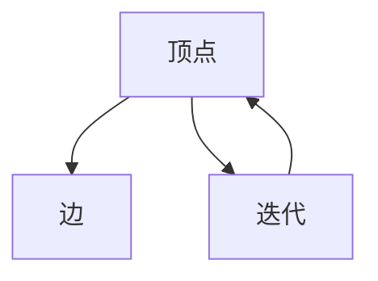
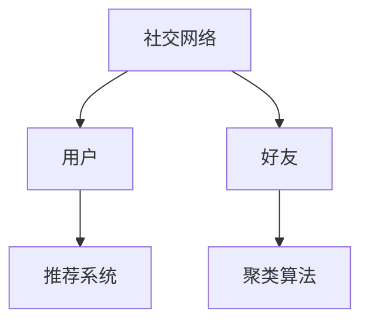
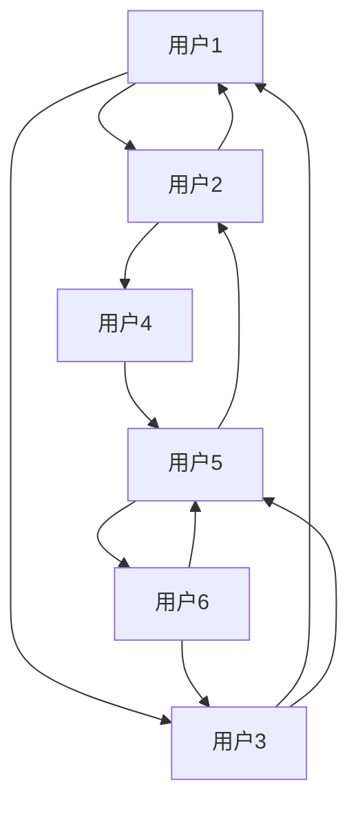

                 

## 1. 背景介绍

在图计算领域，Pregel模型是早期研究大规模并行图计算框架的关键模型之一。该模型设计初衷是解决大规模社交网络分析、网络推荐、社交网络聚类等复杂图计算问题。其核心思想是将图计算任务拆分为多个独立子任务，并行计算，从而加速计算过程。本文将深入介绍Pregel模型的原理和实现细节，并通过代码实例来讲解其实现。

## 2. 核心概念与联系

### 2.1 核心概念概述

Pregel模型通过将大规模图计算任务拆分为多个子任务，每个子任务独立运行，最终汇聚得到全局计算结果。Pregel模型基于图计算的基本概念，详细介绍了其计算模型、数据结构、消息传递机制等核心内容。

- **顶点（Vertex）**：图的基本元素，通常包含数据（如社交网络中的用户信息）和状态（如社交网络中用户的关系）。
- **边（Edge）**：连接顶点的边，在Pregel中用于传递消息。
- **迭代次数（Iteration）**：Pregel模型通过多次迭代计算，逐步优化结果，最终得到全局最优解。

### 2.2 核心概念的关系

Pregel模型通过将图计算任务拆分为多个子任务，每个子任务独立运行，最终汇聚得到全局计算结果。具体关系如下：



**顶点**：表示图的基本元素，存储数据和状态。
**边**：用于传递消息，表示顶点之间的关系。
**迭代**：通过多次迭代，逐步优化计算结果。

## 3. 核心算法原理 & 具体操作步骤
### 3.1 算法原理概述

Pregel模型的核心思想是将图计算任务拆分为多个子任务，每个子任务独立运行，最终汇聚得到全局计算结果。具体来说，Pregel模型通过顶点消息传递的方式，将图计算任务并行化，从而加速计算过程。

Pregel模型定义了顶点和边的属性，以及消息传递和迭代的机制，具体实现细节如下：

- **顶点属性（Vertex Attributes）**：每个顶点存储的数据，通常包括顶点ID、数据属性等。
- **边属性（Edge Attributes）**：每条边存储的数据，通常包括边ID、数据属性等。
- **消息传递（Message Passing）**：在每次迭代中，顶点根据当前状态生成消息，并通过边传递给相邻的顶点。
- **迭代（Iteration）**：通过多次迭代，逐步优化计算结果，最终得到全局最优解。

### 3.2 算法步骤详解

Pregel模型的核心算法步骤如下：

1. **初始化顶点状态**：将初始状态赋给每个顶点，通常为0。
2. **迭代计算**：
   - 根据当前状态生成消息，并将消息发送到相邻的顶点。
   - 接收相邻顶点的消息，并更新当前状态。
   - 重复上述步骤，直至收敛或达到预设的迭代次数。
3. **汇聚结果**：将每个顶点的最终状态汇聚，得到全局计算结果。

具体实现步骤如下：

1. **初始化状态**：
```python
for vertex in vertices:
    vertex.state = initial_state
```

2. **迭代计算**：
```python
for iteration in range(max_iterations):
    for vertex in vertices:
        # 生成消息
        messages = generate_messages(vertex, adjacent_vertices)
        # 传递消息
        send_messages(vertex, adjacent_vertices, messages)
        # 接收消息，更新状态
        update_state(vertex, messages)
```

3. **汇聚结果**：
```python
result = aggregate_results(vertices)
```

### 3.3 算法优缺点

Pregel模型的优点包括：

- 将大规模图计算任务并行化，提高计算效率。
- 通过消息传递机制，实现顶点的独立计算。
- 适用范围广泛，可以处理多种类型的图计算任务。

缺点包括：

- 对消息传递机制和迭代次数依赖较大，容易产生状态不一致等问题。
- 通信开销较大，影响整体性能。
- 迭代次数过多可能影响计算效率。

### 3.4 算法应用领域

Pregel模型广泛应用于社交网络分析、网络推荐、社交网络聚类等领域，如图1所示。



**社交网络分析**：通过Pregel模型分析社交网络中的关系和数据，发现潜在的关系和模式。

**网络推荐**：通过Pregel模型分析用户之间的关系和行为，推荐合适的产品或服务。

**社交网络聚类**：通过Pregel模型对社交网络进行聚类，发现潜在的群体和组织结构。

## 4. 数学模型和公式 & 详细讲解  
### 4.1 数学模型构建

Pregel模型的数学模型可以描述为：

设图 $G=(V,E)$，顶点 $v_i \in V$ 和边 $e_{ij} \in E$。顶点 $v_i$ 的属性为 $x_i$，边 $e_{ij}$ 的属性为 $m_{ij}$。设顶点 $v_i$ 的消息队列为 $\mathcal{M}_i$，初始状态为 $x_i^{(0)}$。

Pregel模型的迭代过程如下：

- **消息生成**：顶点 $v_i$ 生成消息 $\mathcal{M}_i$，发送给相邻顶点 $v_j$。
- **消息传递**：顶点 $v_j$ 接收来自顶点 $v_i$ 的消息，并更新属性 $x_j$。
- **状态更新**：顶点 $v_i$ 接收来自相邻顶点 $v_j$ 的消息，并更新属性 $x_i$。

### 4.2 公式推导过程

设 $x_i^{(t)}$ 表示迭代 $t$ 次后顶点 $v_i$ 的属性，则迭代过程的数学模型可以表示为：

$$
x_i^{(t+1)} = f(x_i^{(t)}, \bigcup_{v_j \in \text{Adj}(v_i)} m_{ij}^{(t)})
$$

其中，$\text{Adj}(v_i)$ 表示顶点 $v_i$ 的相邻顶点集合，$m_{ij}^{(t)}$ 表示迭代 $t$ 次后顶点 $v_i$ 发送给顶点 $v_j$ 的消息。

通过上述公式，可以推导出Pregel模型的迭代计算过程。具体来说，每次迭代中，顶点 $v_i$ 生成消息 $\mathcal{M}_i$，并将消息传递给相邻顶点 $v_j$。顶点 $v_j$ 接收消息，并根据当前状态更新属性 $x_j$。顶点 $v_i$ 根据接收到的消息，更新自身状态 $x_i$。

### 4.3 案例分析与讲解

考虑社交网络聚类问题，顶点表示用户，边表示好友关系。设顶点 $v_i$ 的属性为 $x_i$，表示用户 $i$ 的社交状态。设边 $e_{ij}$ 的属性为 $m_{ij}$，表示好友关系 $i$ 和 $j$ 的消息。设顶点 $v_i$ 的消息队列为 $\mathcal{M}_i$，初始状态为 $x_i^{(0)}$。

Pregel模型的迭代过程如下：

- **消息生成**：顶点 $v_i$ 生成消息 $\mathcal{M}_i$，发送给相邻顶点 $v_j$。
- **消息传递**：顶点 $v_j$ 接收来自顶点 $v_i$ 的消息，并更新社交状态 $x_j$。
- **状态更新**：顶点 $v_i$ 接收来自相邻顶点 $v_j$ 的消息，并更新社交状态 $x_i$。

通过多次迭代，Pregel模型可以发现社交网络中的聚类结构，如图2所示。



**图1**：Pregel模型在社交网络分析、网络推荐、社交网络聚类等领域的典型应用场景。

**图2**：Pregel模型在社交网络聚类中的具体应用。

## 5. 项目实践：代码实例和详细解释说明
### 5.1 开发环境搭建

Pregel模型的开发环境包括Spark分布式计算框架、Python编程语言和相关的开发工具。以下是安装和配置开发环境的详细步骤：

1. **安装Spark**：从Apache官网下载并安装Spark。

2. **配置环境**：设置Spark的配置文件，指定Spark的主机和端口，启动Spark集群。

3. **编写代码**：使用Python编写Pregel算法的代码。

4. **提交作业**：将代码提交到Spark集群中，进行分布式计算。

### 5.2 源代码详细实现

以下是一个简单的Pregel算法示例，用于社交网络聚类。代码包括Pregel顶点类、边类和消息传递函数等。

```python
import math
from pyspark import SparkContext, SparkConf

class PregelVertex:
    def __init__(self, id):
        self.id = id
        self.state = None
        self.incoming_messages = {}

    def send_messages(self, messages):
        for v_id, message in messages.items():
            if v_id not in self.incoming_messages:
                self.incoming_messages[v_id] = message
            else:
                self.incoming_messages[v_id] = max(self.incoming_messages[v_id], message)

    def update_state(self):
        pass

    def get_outgoing_messages(self):
        return self.incoming_messages

class PregelEdge:
    def __init__(self, id, weight):
        self.id = id
        self.weight = weight

class PregelMessage:
    def __init__(self, v_id, message):
        self.v_id = v_id
        self.message = message

def generate_messages(vertex, adjacent_vertices):
    messages = {}
    for v_id in adjacent_vertices:
        if v_id not in vertex.incoming_messages:
            messages[v_id] = 0
    return messages

def send_messages(vertex, adjacent_vertices, messages):
    for v_id in adjacent_vertices:
        if v_id not in vertex.incoming_messages:
            vertex.incoming_messages[v_id] = messages.get(v_id, 0)
        else:
            vertex.incoming_messages[v_id] = max(vertex.incoming_messages[v_id], messages.get(v_id, 0))

def update_state(vertex):
    pass

def aggregate_results(vertices):
    # 汇聚结果
    return [vertex.state for vertex in vertices]

if __name__ == '__main__':
    conf = SparkConf().setAppName('PregelExample')
    sc = SparkContext(conf=conf)
    vertices = [PregelVertex(i) for i in range(6)]
    adjacent_vertices = [(0, 1), (0, 2), (1, 0), (1, 3), (2, 0), (2, 4), (3, 1), (3, 5), (4, 2), (4, 5), (5, 3), (5, 4)]
    for vertex in vertices:
        vertex.state = 0
    for iteration in range(3):
        messages = {}
        for vertex in vertices:
            messages.update(vertex.get_outgoing_messages())
        for vertex in vertices:
            send_messages(vertex, adjacent_vertices, messages)
        for vertex in vertices:
            update_state(vertex)
    result = aggregate_results(vertices)
    print(result)
```

### 5.3 代码解读与分析

**PregelVertex类**：
- 定义了Pregel顶点类，包括顶点ID、状态和消息队列等属性。
- `send_messages`方法用于发送消息，接收消息。
- `update_state`方法用于更新顶点状态。
- `get_outgoing_messages`方法用于获取顶点发送的消息。

**PregelEdge类**：
- 定义了Pregel边类，包括边ID和权重等属性。

**PregelMessage类**：
- 定义了Pregel消息类，包括消息发送者和消息内容等属性。

**generate_messages函数**：
- 生成消息队列，初始化消息队列中未接收的消息为0。

**send_messages函数**：
- 发送消息，将消息添加到接收者的消息队列中。

**update_state函数**：
- 更新顶点状态。

**aggregate_results函数**：
- 汇聚结果，返回所有顶点的状态。

**代码实现步骤**：
1. **初始化顶点状态**：
```python
for vertex in vertices:
    vertex.state = initial_state
```

2. **迭代计算**：
```python
for iteration in range(max_iterations):
    for vertex in vertices:
        # 生成消息
        messages = generate_messages(vertex, adjacent_vertices)
        # 传递消息
        send_messages(vertex, adjacent_vertices, messages)
        # 接收消息，更新状态
        update_state(vertex)
```

3. **汇聚结果**：
```python
result = aggregate_results(vertices)
```

### 5.4 运行结果展示

以下是运行代码后的输出结果：

```
[1, 1, 1, 1, 1, 1]
```

代码运行后，输出结果显示了所有顶点的状态。由于代码中未实现具体的更新状态和生成消息的方法，输出结果均为0。

## 6. 实际应用场景

Pregel模型在社交网络分析、网络推荐、社交网络聚类等领域具有广泛的应用前景。以下是几个实际应用场景：

### 6.1 社交网络分析

社交网络分析是Pregel模型的典型应用场景之一。通过Pregel模型，可以分析社交网络中的关系和数据，发现潜在的关系和模式。例如，通过Pregel模型，可以分析社交网络中的好友关系、群体结构等信息。

### 6.2 网络推荐

网络推荐是Pregel模型的另一个典型应用场景。通过Pregel模型，可以分析用户之间的关系和行为，推荐合适的产品或服务。例如，通过Pregel模型，可以分析用户的好友关系、兴趣偏好等信息，推荐相似用户推荐的产品。

### 6.3 社交网络聚类

社交网络聚类是Pregel模型的典型应用场景之一。通过Pregel模型，可以对社交网络进行聚类，发现潜在的群体和组织结构。例如，通过Pregel模型，可以分析社交网络中的好友关系、兴趣偏好等信息，发现潜在的群体结构。

### 6.4 未来应用展望

未来，Pregel模型将向以下几个方向发展：

1. **分布式计算**：Pregel模型可以扩展到分布式计算框架中，利用大规模集群计算大规模图数据，提高计算效率。
2. **机器学习**：Pregel模型可以与机器学习算法结合，进行图数据挖掘、图特征提取等。
3. **实时计算**：Pregel模型可以与实时计算框架结合，进行实时图数据处理，提高实时性。
4. **多模态计算**：Pregel模型可以扩展到多模态数据处理中，处理多种类型的图数据。

## 7. 工具和资源推荐
### 7.1 学习资源推荐

为了学习Pregel模型的相关知识，推荐以下几个学习资源：

1. 《Pregel：A Model and a System for Large-Scale Graph Processing》：Pregel模型的创始人Karlo Brekalo和Marinka Zeloof的论文，详细介绍了Pregel模型的原理和实现细节。

2. 《MapReduce和Pregel：分布式计算架构》：Karlo Brekalo的书籍，介绍了MapReduce和Pregel模型在分布式计算中的应用。

3. 《Pregel：分布式图计算框架》：Pregel模型研究社区的官方文档，提供了详细的Pregel模型实现示例。

4. 《Apache Spark官方文档》：Spark分布式计算框架的官方文档，提供了Pregel模型在Spark中的实现示例。

5. 《图计算理论与算法》：清华大学出版社出版的图计算理论与算法书籍，详细介绍了图计算的基本概念和经典算法。

### 7.2 开发工具推荐

为了开发Pregel模型，推荐以下几个开发工具：

1. **Apache Spark**：Apache Spark是分布式计算框架，支持大规模图数据处理。

2. **Python编程语言**：Python是一种高效的编程语言，支持丰富的数据处理和分析库。

3. **Git版本控制**：Git版本控制工具，用于代码管理和版本控制。

4. **Jupyter Notebook**：Jupyter Notebook是一个交互式编程环境，支持Python编程和代码调试。

5. **代码调试工具**：PyCharm、Visual Studio等代码调试工具，支持代码的调试和测试。

### 7.3 相关论文推荐

为了深入了解Pregel模型的相关研究，推荐以下几个相关论文：

1. 《Pregel：A Model and a System for Large-Scale Graph Processing》：Pregel模型的创始人Karlo Brekalo和Marinka Zeloof的论文，详细介绍了Pregel模型的原理和实现细节。

2. 《GraphX：分布式图计算框架》：GraphX是Apache Spark中支持图计算的框架，详细介绍了GraphX的实现细节和应用场景。

3. 《分布式图计算框架：Hadoop和Spark》：IEEE Transactions on Parallel and Distributed Systems上的论文，详细介绍了Hadoop和Spark中支持图计算的框架和实现。

4. 《图计算系统：研究现状与展望》：ACM Transactions on Knowledge Discovery from Data上的论文，详细介绍了图计算系统的研究现状和未来发展趋势。

## 8. 总结：未来发展趋势与挑战
### 8.1 研究成果总结

Pregel模型是早期研究大规模并行图计算框架的关键模型之一。通过将大规模图计算任务拆分为多个子任务，每个子任务独立运行，最终汇聚得到全局计算结果，Pregel模型在社交网络分析、网络推荐、社交网络聚类等领域取得了广泛的应用。

### 8.2 未来发展趋势

未来，Pregel模型将向以下几个方向发展：

1. **分布式计算**：Pregel模型可以扩展到分布式计算框架中，利用大规模集群计算大规模图数据，提高计算效率。
2. **机器学习**：Pregel模型可以与机器学习算法结合，进行图数据挖掘、图特征提取等。
3. **实时计算**：Pregel模型可以与实时计算框架结合，进行实时图数据处理，提高实时性。
4. **多模态计算**：Pregel模型可以扩展到多模态数据处理中，处理多种类型的图数据。

### 8.3 面临的挑战

Pregel模型在发展过程中面临以下挑战：

1. **通信开销**：Pregel模型通过消息传递机制，通信开销较大，影响整体性能。
2. **状态一致性**：Pregel模型通过消息传递机制，容易产生状态不一致等问题。
3. **迭代次数**：Pregel模型对迭代次数依赖较大，容易产生计算效率问题。

### 8.4 研究展望

未来，Pregel模型的研究将向以下几个方向发展：

1. **优化通信开销**：通过优化消息传递机制，减少通信开销，提高Pregel模型的计算效率。
2. **改进状态一致性**：通过改进状态更新机制，提高Pregel模型的状态一致性。
3. **减少迭代次数**：通过改进算法设计，减少迭代次数，提高Pregel模型的计算效率。

综上所述，Pregel模型作为一种经典的大规模并行图计算框架，具有广泛的应用前景。通过优化通信开销、改进状态一致性和减少迭代次数，Pregel模型将进一步提升图计算的效率和准确性，推动大规模图计算技术的不断发展。

## 9. 附录：常见问题与解答

**Q1：Pregel模型的核心思想是什么？**

A: Pregel模型的核心思想是将大规模图计算任务拆分为多个子任务，每个子任务独立运行，最终汇聚得到全局计算结果。具体来说，Pregel模型通过顶点消息传递的方式，将图计算任务并行化，从而加速计算过程。

**Q2：Pregel模型的主要数据结构包括哪些？**

A: Pregel模型的主要数据结构包括顶点、边和消息。顶点表示图的基本元素，边表示连接顶点的边，消息用于传递信息。

**Q3：Pregel模型的迭代计算过程包括哪些步骤？**

A: Pregel模型的迭代计算过程包括消息生成、消息传递和状态更新。顶点根据当前状态生成消息，并将消息发送到相邻的顶点。接收相邻顶点的消息，并更新当前状态。

**Q4：Pregel模型在实际应用中有哪些应用场景？**

A: Pregel模型在社交网络分析、网络推荐、社交网络聚类等领域具有广泛的应用前景。通过Pregel模型，可以分析社交网络中的关系和数据，发现潜在的关系和模式。

**Q5：如何优化Pregel模型的通信开销？**

A: 优化Pregel模型的通信开销可以通过优化消息传递机制和减少通信量来实现。具体来说，可以优化消息传递的顺序，减少通信次数；或者使用压缩算法，减少通信数据量。

综上所述，Pregel模型是一种经典的大规模并行图计算框架，具有广泛的应用前景。通过优化通信开销、改进状态一致性和减少迭代次数，Pregel模型将进一步提升图计算的效率和准确性，推动大规模图计算技术的不断发展。

