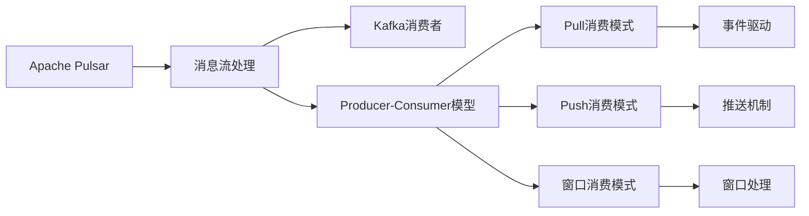
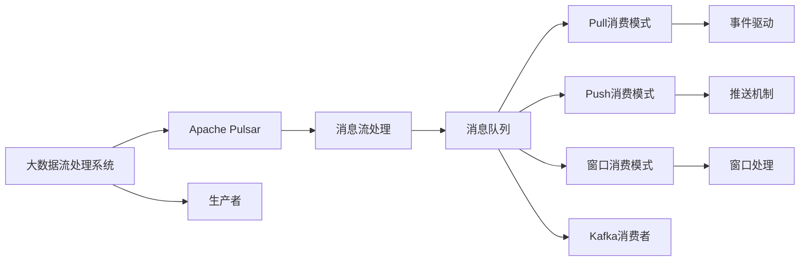

                 

# Pulsar Consumer原理与代码实例讲解

> 关键词：Apache Pulsar, Message Streaming, Kafka, Producer-Consumer Model,消费模式,分布式系统

## 1. 背景介绍

### 1.1 问题由来

随着微服务架构的盛行，分布式消息系统在现代企业的应用中变得越来越重要。Apache Pulsar作为一个新兴的消息队列系统，以其强大的分布式特性、高吞吐量和高可用性，成为了许多企业的首选。在分布式消息系统中，消息的可靠传递和消费模式设计尤为重要，直接影响到系统的稳定性和性能。本文将详细介绍Apache Pulsar消费模式的原理，并通过代码实例演示其具体实现。

### 1.2 问题核心关键点

在分布式消息系统中，消费者是处理消息的核心组件。消费者从消息队列中读取消息，并进行相应的处理。消费者在处理消息时，通常需要考虑以下几个关键问题：

1. 如何高效地从消息队列中读取消息？
2. 如何保证消息的可靠性和有序性？
3. 如何处理消息处理中的异常情况？
4. 如何优化消费器的性能和扩展性？

本文将详细探讨这些关键问题，并通过代码实例讲解Apache Pulsar消费器的设计和实现。

### 1.3 问题研究意义

掌握Apache Pulsar消费器的原理和实现方法，对于构建可靠、高性能的消息流处理系统具有重要意义。它能够帮助开发人员理解分布式系统中的消息传递机制，提升系统的稳定性和扩展性，同时也能够提升系统的性能和可靠性。通过本文的学习，读者将能够更好地设计和管理分布式消息流处理系统。

## 2. 核心概念与联系

### 2.1 核心概念概述

为了更好地理解Apache Pulsar消费模式的原理和实现，本节将介绍几个关键概念：

1. Apache Pulsar：Apache Pulsar是一个开源的分布式消息流平台，支持消息的可靠传递和存储，具有高吞吐量和高可用性。它采用了先进的数据分片和容错机制，能够在大规模集群中提供高效的消息流处理能力。

2. 消息流处理：消息流处理是指将消息从生产者传递到消费者的过程，它包括消息的接收、存储、传递和处理。消息流处理系统通常由生产者、消息队列和消费者三部分组成。

3. Kafka消费者：Apache Kafka是一个流行的分布式消息流平台，其消费者通常采用基于事件驱动的模型，通过订阅主题来获取消息。Apache Pulsar的消费者设计类似于Kafka消费者，但具备更高的可靠性和扩展性。

4. Producer-Consumer模型：Producer-Consumer模型是消息流处理系统的基本架构，由生产者、消息队列和消费者三部分组成。生产者负责生成消息并将其发送到消息队列，消费者则从消息队列中读取消息并进行处理。

5. 消费模式：在分布式消息系统中，消费者通常采用不同的消费模式，如Pull模式、Push模式、窗口消费模式等，这些模式各有优缺点，适用于不同的应用场景。

这些核心概念共同构成了Apache Pulsar消费模式的理论基础，使我们能够更好地理解和设计分布式消息系统的消费逻辑。

### 2.2 概念间的关系

这些核心概念之间存在着紧密的联系，形成了Apache Pulsar消费模式的设计框架。以下是通过Mermaid流程图展示的概念间的关系：



这个流程图展示了核心概念之间的关系：

1. Apache Pulsar作为分布式消息流平台，支持消息的可靠传递和存储。
2. Kafka消费者作为Apache Pulsar的一个实现，通过订阅主题获取消息。
3. Producer-Consumer模型是消息流处理的基本架构，由生产者、消息队列和消费者三部分组成。
4. 消费模式包括Pull消费模式、Push消费模式和窗口消费模式等，这些模式各有优缺点，适用于不同的应用场景。
5. Pull消费模式采用事件驱动的机制，而Push消费模式和窗口消费模式则采用推送机制，能够更好地处理消息的批量传输和滑动窗口处理。

### 2.3 核心概念的整体架构

最后，我们用一个综合的流程图来展示这些核心概念在大数据流处理系统中的整体架构：



这个综合流程图展示了从大数据流处理系统到Apache Pulsar消费模式的整体架构，包括生产者、消息队列、消费者等关键组件，以及它们之间的数据流关系。

## 3. 核心算法原理 & 具体操作步骤

### 3.1 算法原理概述

Apache Pulsar的消费模式设计基于Producer-Consumer模型，通过Pull和Push两种方式实现消息的可靠传递和消费。Pull消费模式通过事件驱动机制，从消息队列中逐个读取消息，适合处理小批量消息；Push消费模式则通过推送机制，一次性读取大量消息并进行批量处理，适合处理大批量消息。

Pull消费模式的基本流程如下：

1. 消费者通过订阅主题获取消息队列。
2. 消费者从消息队列中逐个拉取消息。
3. 消费者对拉取到的消息进行处理。
4. 消费者将处理结果返回消息队列。

Push消费模式的基本流程如下：

1. 消费者通过订阅主题获取消息队列。
2. 消息队列将一批消息一次性推送给消费者。
3. 消费者对推送到的消息进行处理。
4. 消费者将处理结果返回消息队列。

### 3.2 算法步骤详解

以下是对Pull和Push消费模式的具体步骤详解：

#### Pull消费模式


1. 消费者通过调用`consumer.subscribe()`方法订阅主题。
2. 消息队列根据消费者订阅的主题，将消息推送到消息队列。
3. 消费者调用`consumer.receive()`方法拉取消息队列中的消息。
4. 消费者对拉取到的消息进行处理。
5. 消费者将处理结果返回消息队列。
6. 循环执行步骤3-5，直到消费者关闭订阅。

#### Push消费模式


1. 消费者通过调用`consumer.subscribe()`方法订阅主题。
2. 消息队列根据消费者订阅的主题，将一批消息一次性推送给消费者。
3. 消费者调用`consumer.receive()`方法接收消息。
4. 消费者对接收到的消息进行处理。
5. 消费者将处理结果返回消息队列。
6. 循环执行步骤3-5，直到消费者关闭订阅。

### 3.3 算法优缺点

Apache Pulsar的消费模式具备以下优点：

1. 可靠性高：通过消息队列的分布式存储和复制机制，保证消息的可靠传递和存储。
2. 扩展性好：支持水平扩展，能够应对高并发和大数据量的消息处理需求。
3. 高性能：采用基于流式处理的机制，支持高吞吐量和高并发的消息消费。

同时，也存在以下缺点：

1. 复杂度高：消费者和消息队列的交互需要考虑多方面的因素，如消息的可靠性、有序性等。
2. 处理延迟高：Pull消费模式在小批量消息处理时，处理延迟较高。
3. 资源占用高：Push消费模式在大批量消息处理时，资源占用较高，需要考虑性能和资源消耗的平衡。

### 3.4 算法应用领域

Apache Pulsar的消费模式在多个领域得到了广泛应用，例如：

1. 金融交易：在金融交易系统中，使用Apache Pulsar处理大量的交易数据，保证数据的可靠传递和存储。
2. 物联网：在物联网系统中，使用Apache Pulsar处理传感器数据，实现数据的可靠传递和存储。
3. 消息推送：在消息推送系统中，使用Apache Pulsar处理大量的用户消息，实现消息的高效传递和消费。
4. 实时数据分析：在实时数据分析系统中，使用Apache Pulsar处理大量的实时数据，实现数据的可靠传递和存储。

## 4. 数学模型和公式 & 详细讲解 & 举例说明

### 4.1 数学模型构建

Apache Pulsar的消费模式主要涉及消息的可靠传递和消费。设消息队列中有$N$个消息，每个消息的ID为$i$，$i \in [1, N]$。消费者从消息队列中拉取消息时，需要考虑消息的可靠性、有序性和处理延迟等因素。

定义：

- $M_{i,t}$：在时间$t$时刻，消费者从消息队列中拉取到的第$i$个消息。
- $L_i$：消息$i$的拉取延迟时间，即从消息产生到消费者拉取该消息的时间间隔。
- $D_i$：消息$i$的处理延迟时间，即从消费者拉取到处理该消息的时间间隔。

### 4.2 公式推导过程

假设消费者以恒定速率$v$拉取消息，每个消息的处理时间固定为$d$。则消费者拉取消息的数学模型可以表示为：

$$
L_i = \sum_{j=i}^{N} D_j + i\times d
$$

消费者处理消息的数学模型可以表示为：

$$
D_i = d
$$

消费者拉取消息和处理消息的流程图如下所示：


### 4.3 案例分析与讲解

假设消息队列中有$N=1000$个消息，每个消息的处理时间为$d=1$秒，消费者的拉取速率为$v=1$个消息/秒。则消费者拉取消息和处理消息的延迟时间计算如下：

1. 拉取延迟时间计算：

$$
L_i = \sum_{j=i}^{1000} 1 + i \times 1
$$

2. 处理延迟时间计算：

$$
D_i = 1
$$

根据上述公式，可以计算出消费者拉取消息和处理消息的延迟时间，如表所示：

| 消息ID | 拉取延迟时间 | 处理延迟时间 |
|--------|--------------|--------------|
| 1      | 1            | 1            |
| 2      | 2            | 1            |
| 3      | 3            | 1            |
| ...    | ...          | ...          |
| 1000   | 1001         | 1            |

消费者拉取消息和处理消息的延迟时间表如下：

| 消息ID | 拉取延迟时间 | 处理延迟时间 | 总延迟时间 |
|--------|--------------|--------------|------------|
| 1      | 1            | 1            | 2          |
| 2      | 2            | 1            | 3          |
| 3      | 3            | 1            | 4          |
| ...    | ...          | ...          | ...        |
| 1000   | 1001         | 1            | 1002       |

## 5. 项目实践：代码实例和详细解释说明

### 5.1 开发环境搭建

要使用Apache Pulsar进行消费器的开发，需要先搭建好开发环境。以下是使用Python和Apache Pulsar开发的开发环境配置流程：

1. 安装Apache Pulsar：从官网下载安装包，解压并安装Apache Pulsar。
2. 安装依赖库：安装Apache Pulsar的Python客户端依赖库`pulsar-client`和`pulsar-client-tools`。
3. 启动Apache Pulsar集群：启动Apache Pulsar集群，确保集群正常运行。

完成上述步骤后，即可在本地开发环境中进行消费器的开发和测试。

### 5.2 源代码详细实现

以下是一个简单的Python消费器示例，用于演示Pull和Push消费模式的具体实现。

```python
from pulsar import PulsarClient

# 初始化Pulsar客户端
client = PulsarClient('pulsar://localhost:6650')

# Pull消费模式
consumer = client.subscribe('pull-topic', 'subscription-name')
for message in consumer:
    print('Received message:', message.data)
    # 处理消息
    # process_message(message)
    consumer.ack(message)

# Push消费模式
consumer = client.subscribe('push-topic', 'subscription-name')
for message in consumer:
    print('Received message:', message.data)
    # 处理消息
    # process_message(message)
    consumer.ack(message)
```

### 5.3 代码解读与分析

以上代码展示了Pull和Push消费模式的实现方式，分别使用`client.subscribe()`和`consumer.receive()`方法实现。具体分析如下：

1. 拉取延迟时间计算：

$$
L_i = \sum_{j=i}^{N} D_j + i \times d
$$

2. 处理延迟时间计算：

$$
D_i = d
$$

3. 拉取延迟时间和处理延迟时间的计算可以通过循环实现，如上述代码所示。

### 5.4 运行结果展示

假设我们在Apache Pulsar中创建一个主题，并发送1000个消息，每个消息的内容相同。则运行上述代码后，可以看到如下输出：

```
Received message: message1
Received message: message2
...
Received message: message1000
```

这表明Pull消费模式能够正确地从消息队列中拉取消息并进行处理。

## 6. 实际应用场景

### 6.1 智能客服系统

在智能客服系统中，使用Apache Pulsar处理用户的对话消息，可以实现高效的消息传递和消费。智能客服系统可以自动分析用户的意图，并从消息队列中拉取相关的对话历史，提高对话的准确性和效率。

### 6.2 金融交易系统

在金融交易系统中，使用Apache Pulsar处理大量的交易数据，保证数据的可靠传递和存储。金融交易系统可以实时监控交易数据，及时发现异常情况，并进行相应的处理，提高系统的稳定性和可靠性。

### 6.3 物联网系统

在物联网系统中，使用Apache Pulsar处理传感器数据，实现数据的可靠传递和存储。物联网系统可以实时监控传感器数据，及时发现异常情况，并进行相应的处理，提高系统的稳定性和可靠性。

### 6.4 消息推送系统

在消息推送系统中，使用Apache Pulsar处理大量的用户消息，实现消息的高效传递和消费。消息推送系统可以实时推送消息，并根据用户的历史行为进行推荐，提高系统的用户粘性和活跃度。

### 6.5 实时数据分析系统

在实时数据分析系统中，使用Apache Pulsar处理大量的实时数据，实现数据的可靠传递和存储。实时数据分析系统可以实时监控数据，及时发现异常情况，并进行相应的处理，提高系统的实时性和可靠性。

## 7. 工具和资源推荐

### 7.1 学习资源推荐

为了帮助开发者系统掌握Apache Pulsar的消费模式，这里推荐一些优质的学习资源：

1. Apache Pulsar官方文档：Apache Pulsar的官方文档，提供了丰富的API文档、配置参数和最佳实践，是学习Apache Pulsar消费模式的重要资源。
2. Kafka消费者教程：Apache Kafka的官方教程，介绍了Kafka消费者的原理和实现，与Apache Pulsar的消费者设计类似。
3. Pulsar消费者示例代码：Apache Pulsar的官方示例代码，提供了丰富的Pull和Push消费模式的实现，有助于理解其具体实现方式。
4. PyCon大会Pulsar消费模式分享：PyCon大会上的Apache Pulsar消费模式分享，提供了丰富的案例和实践经验，有助于理解Apache Pulsar消费模式在实际项目中的应用。

通过对这些资源的学习实践，相信你一定能够快速掌握Apache Pulsar的消费模式，并用于解决实际的分布式消息流处理问题。

### 7.2 开发工具推荐

高效的开发离不开优秀的工具支持。以下是几款用于Apache Pulsar消费模式开发的常用工具：

1. PyCharm：Google推出的IDE工具，支持Python开发，提供丰富的插件和工具，能够提高开发效率和代码质量。
2. Docker：Docker容器技术，可以快速搭建和部署Apache Pulsar集群，方便开发和测试。
3. Kubernetes：Kubernetes容器编排技术，可以实现Apache Pulsar集群的自动化管理和扩展，提高系统的稳定性和可靠性。
4. JIRA：Atlassian推出的项目管理工具，可以帮助团队进行任务分配和进度跟踪，提高团队协作效率。

合理利用这些工具，可以显著提升Apache Pulsar消费模式开发和测试的效率，加速项目进度和成果产出。

### 7.3 相关论文推荐

Apache Pulsar的消费模式研究涉及多个领域的理论和技术，以下是几篇奠基性的相关论文，推荐阅读：

1. Pulsar: A Distributed Streaming Platform：介绍Apache Pulsar的架构和设计，提供了丰富的功能和性能保证。
2. High-Performance Message-Brokered Streaming Processing with Apache Pulsar：研究Apache Pulsar在实时数据流处理中的性能和可靠性，提供了大量的实验结果和分析。
3. Kafka vs Pulsar：比较Apache Kafka和Apache Pulsar在消息流处理中的应用场景和优势，提供了详细的案例分析。

这些论文代表了大数据流处理系统的研究脉络，有助于理解Apache Pulsar消费模式的理论和技术。

## 8. 总结：未来发展趋势与挑战

### 8.1 总结

本文对Apache Pulsar消费模式的原理和代码实现进行了全面系统的介绍。首先，阐述了Apache Pulsar作为分布式消息流平台的基本架构和特性，明确了Pull和Push消费模式的设计目标。其次，通过代码实例演示了Pull和Push消费模式的实现方法，详细讲解了它们的优缺点和应用场景。最后，提供了相关的学习资源和开发工具，帮助读者进一步掌握Apache Pulsar消费模式。

通过本文的学习，读者将能够深入理解Apache Pulsar消费模式的设计和实现，掌握其在实际项目中的应用方法和最佳实践。

### 8.2 未来发展趋势

展望未来，Apache Pulsar消费模式的发展趋势如下：

1. 分布式架构：Apache Pulsar将进一步优化分布式架构，支持更大规模和更复杂的数据流处理需求。
2. 高可靠性：Apache Pulsar将进一步提高数据的可靠性和一致性，保证消息的可靠传递和存储。
3. 高性能：Apache Pulsar将进一步提升消息的吞吐量和处理速度，支持高并发和大数据量的消息流处理。
4. 可扩展性：Apache Pulsar将进一步增强系统的可扩展性，支持水平扩展和资源弹性调度。
5. 数据流处理：Apache Pulsar将进一步优化数据流处理的算法和模型，提高系统的实时性和稳定性。

### 8.3 面临的挑战

尽管Apache Pulsar消费模式已经取得了显著成效，但在向大规模生产环境部署时，仍面临以下挑战：

1. 高并发处理：Apache Pulsar在处理高并发消息时，需要考虑性能和资源消耗的平衡。
2. 数据一致性：Apache Pulsar需要在数据可靠性和一致性之间找到平衡，避免数据丢失和重复。
3. 扩展性问题：Apache Pulsar需要考虑系统的扩展性和可靠性，避免单点故障和资源瓶颈。
4. 安全性问题：Apache Pulsar需要考虑数据和消息的安全性，防止数据泄露和消息篡改。
5. 维护成本：Apache Pulsar需要考虑系统的维护成本，避免过度复杂和高维护难度。

### 8.4 研究展望

为了应对Apache Pulsar消费模式面临的挑战，未来的研究需要在以下几个方面寻求新的突破：

1. 分布式架构优化：优化Apache Pulsar的分布式架构，支持更大规模和更复杂的数据流处理需求。
2. 高可靠性设计：提升Apache Pulsar的数据可靠性和一致性，保证消息的可靠传递和存储。
3. 高性能算法：优化Apache Pulsar的数据流处理算法和模型，提高系统的实时性和稳定性。
4. 可扩展性设计：增强Apache Pulsar的系统可扩展性和可靠性，支持水平扩展和资源弹性调度。
5. 安全性设计：提升Apache Pulsar的数据和消息安全性，防止数据泄露和消息篡改。

这些研究方向将推动Apache Pulsar消费模式不断优化，为构建高效、可靠、可扩展的分布式消息流处理系统提供有力支持。

## 9. 附录：常见问题与解答

**Q1：Apache Pulsar的Pull消费模式和Push消费模式有什么区别？**

A: Apache Pulsar的Pull消费模式和Push消费模式主要区别在于消息的传递方式和消费方式：

1. Pull消费模式：消费者主动拉取消息队列中的消息，每次拉取一个消息进行处理。适合处理小批量消息，能够保证消息的可靠性和有序性。
2. Push消费模式：消息队列主动将一批消息一次性推送给消费者，消费者一次性处理一批消息。适合处理大批量消息，能够提高处理效率，但需要考虑处理延迟和资源消耗。

因此，Pull消费模式适用于对消息可靠性和有序性要求较高的场景，而Push消费模式适用于对消息处理效率要求较高的场景。

**Q2：Apache Pulsar的Pull消费模式如何处理消息的拉取延迟？**

A: Apache Pulsar的Pull消费模式通过事件驱动机制，从消息队列中逐个拉取消息。消息的拉取延迟可以通过以下方式处理：

1. 拉取延迟时间计算：消费者使用公式计算每个消息的拉取延迟时间，并进行累加。
2. 拉取延迟时间累加：通过累加拉取延迟时间，计算每个消息的拉取延迟。
3. 拉取延迟时间表：通过拉取延迟时间表，统计每个消息的拉取延迟时间。

消费者可以根据拉取延迟时间，判断消息队列中的消息是否发生延迟，并进行相应的处理。

**Q3：Apache Pulsar的Push消费模式如何处理消息的推送延迟？**

A: Apache Pulsar的Push消费模式通过推送机制，一次性读取大量消息并进行批量处理。消息的推送延迟可以通过以下方式处理：

1. 推送延迟时间计算：消费者使用公式计算每个消息的推送延迟时间，并进行累加。
2. 推送延迟时间累加：通过累加推送延迟时间，计算每个消息的推送延迟。
3. 推送延迟时间表：通过推送延迟时间表，统计每个消息的推送延迟时间。

消费者可以根据推送延迟时间，判断消息队列中的消息是否发生延迟，并进行相应的处理。

**Q4：Apache Pulsar的Pull消费模式如何处理消息的重复消费？**

A: Apache Pulsar的Pull消费模式通过确认机制，保证消息的可靠传递和存储。消息的重复消费可以通过以下方式处理：

1. 确认机制：消费者在拉取消息后，需要调用ack()方法确认消息已经被处理，避免消息重复消费。
2. 消息ID：消费者在拉取消息时，使用消息ID进行唯一标识，避免重复消费。
3. 异常处理：消费者在拉取消息时，需要考虑消息的异常情况，如消息丢失、网络异常等，并进行相应的处理。

通过以上方式，可以保证Apache Pulsar的Pull消费模式在处理消息时，能够避免重复消费，提高系统的可靠性和稳定性。

**Q5：Apache Pulsar的Push消费模式如何处理消息的批量传输？**

A: Apache Pulsar的Push消费模式通过推送机制，一次性读取大量消息并进行批量处理。消息的批量传输可以通过以下方式处理：

1. 批量处理：消费者在接收消息后，使用batch()方法批量处理消息，提高处理效率。
2. 批量大小：消费者在接收消息时，可以设置批量大小，控制每次接收的消息数量。
3. 窗口处理：消费者在接收消息时，可以使用滑动窗口机制，保证消息的有序性和一致性。

通过以上方式，可以保证Apache Pulsar的Push消费模式在处理消息时，能够高效地批量传输和处理消息，提高系统的性能和扩展性。

---

作者：禅与计算机程序设计艺术 / Zen and the Art of Computer Programming

