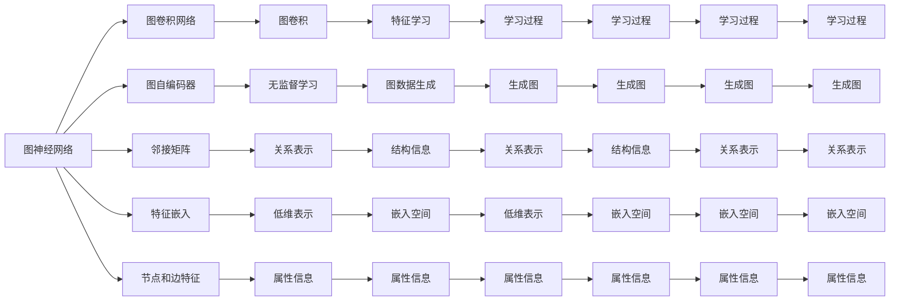
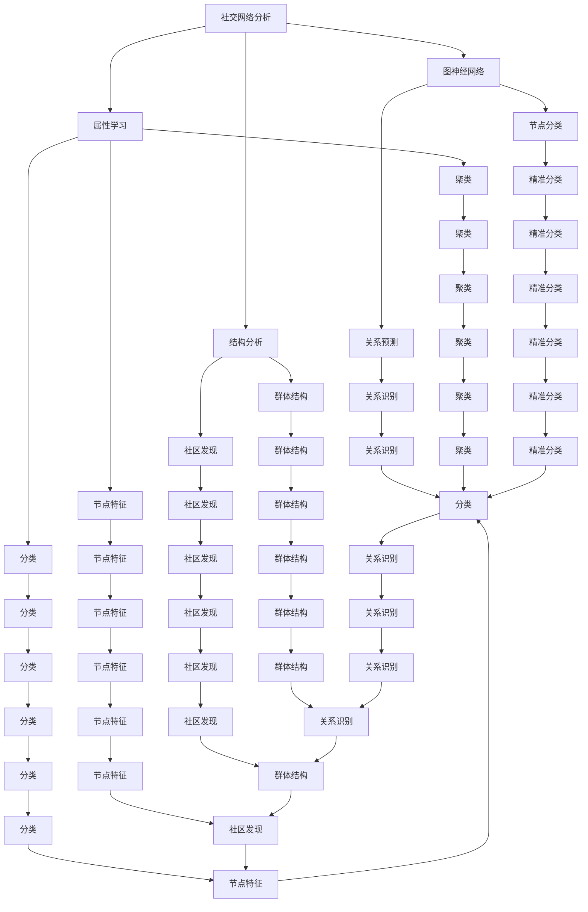
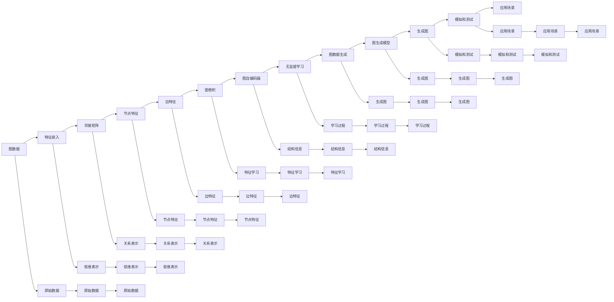

                 

# Python机器学习实战：实战图神经网络(GNN)在社交网络分析中的应用

> 关键词：图神经网络,社交网络分析,图卷积网络(GCN),图自编码器(GAE),邻接矩阵,特征嵌入

## 1. 背景介绍

### 1.1 问题由来
近年来，随着数据科学和人工智能技术的飞速发展，社交网络分析已成为各个领域研究的热点。社交网络数据因其丰富的结构性和异质性，给数据分析带来了新的挑战。传统的统计分析和机器学习算法难以处理这些高维、稀疏的复杂数据结构。基于图的数据建模和分析方法因其能自然地描述节点间复杂关系，成为了处理社交网络数据的有效手段。

图神经网络（Graph Neural Networks，GNNs）正是应运而生的一种新型深度学习模型，它能高效地处理图数据，自动学习节点之间的复杂关系，并提取图结构中的重要信息。图神经网络已经在社交网络分析、推荐系统、生物信息学等多个领域展现出巨大潜力，本文将详细探讨图神经网络在社交网络分析中的应用，并给出实战案例。

### 1.2 问题核心关键点
图神经网络在社交网络分析中的应用，主要体现在以下几个方面：
1. **网络结构分析**：理解社交网络中的群体结构、社区发现、影响力传播等关键问题。
2. **节点属性学习**：基于节点属性和网络结构，学习节点特征，实现精准的分类、聚类、预测等任务。
3. **关系推理**：利用图神经网络在图上的卷积运算，推断节点间的关系，实现关系识别、关系预测等任务。
4. **图生成**：生成新的社交网络，用于模拟、测试和理解社交网络动力学。
5. **图嵌入学习**：将图数据转换为低维向量，用于下游任务如链接预测、节点分类等。

本文聚焦于社交网络分析中的图神经网络，但同时也会兼顾图神经网络的演进和未来研究趋势，以期对社交网络分析实践提供更全面的指导。

### 1.3 问题研究意义
研究图神经网络在社交网络分析中的应用，对于理解社交网络中个体和群体行为，提升社交网络数据挖掘的自动化和智能化水平，具有重要意义：
1. **自动化分析**：利用图神经网络自动分析社交网络结构，提高数据分析的效率和准确性。
2. **智能化决策**：基于图神经网络的学习能力和推理能力，进行精准的关系预测和行为识别。
3. **大规模应用**：图神经网络适用于处理大规模社交网络数据，能够应对复杂的数据分布和规模。
4. **跨领域应用**：图神经网络的研究和应用不仅限于社交网络，还延伸到其他领域如生物网络、交通网络等，具有广泛的应用前景。

## 2. 核心概念与联系

### 2.1 核心概念概述

为更好地理解图神经网络在社交网络分析中的应用，本节将介绍几个关键概念：

- **图神经网络(GNN)**：一种针对图数据的深度神经网络模型，具有自动学习图结构信息的能力。
- **图卷积网络(GCN)**：GNN的一种变体，基于图卷积操作提取节点特征。
- **图自编码器(GAE)**：一种基于无监督学习的图神经网络，用于图数据生成和降维。
- **邻接矩阵**：用于表示节点间关系的矩阵，描述了节点对之间的关系。
- **特征嵌入**：将原始数据转换为低维向量表示，用于图神经网络的输入。
- **节点和边特征**：节点和边的属性信息，用于图神经网络的计算。
- **图生成模型**：如生成对抗网络(GAN)等，用于生成新的图数据。

这些核心概念之间的逻辑关系可以通过以下Mermaid流程图来展示：



这个流程图展示了图神经网络的核心概念及其之间的关系：

1. 图神经网络通过图卷积网络、图自编码器等模块进行结构学习和特征学习。
2. 邻接矩阵表示节点间关系，特征嵌入将原始数据转换为低维表示。
3. 节点和边特征提供额外的属性信息，用于增强模型表现。
4. 图生成模型可用于模拟和测试社交网络动力学，丰富数据样本。
5. 学习过程通过有监督或无监督方式进行，提升模型泛化能力。

这些概念共同构成了图神经网络的完整生态系统，使其能够在各种场景下发挥强大的图结构分析和处理能力。通过理解这些核心概念，我们可以更好地把握图神经网络的工作原理和优化方向。

### 2.2 概念间的关系

这些核心概念之间存在着紧密的联系，形成了图神经网络在社交网络分析中的应用框架。下面我通过几个Mermaid流程图来展示这些概念之间的关系。

#### 2.2.1 图神经网络的应用范式



这个流程图展示了图神经网络在社交网络分析中的应用流程：

1. 社交网络分析通过结构分析和属性学习，得到群结构、社区发现、节点特征等信息。
2. 图神经网络通过节点分类、关系预测等任务，进一步提升模型性能。
3. 应用结果如群体结构分析、社区发现、节点特征提取等，用于更深入的分析和应用。

#### 2.2.2 图神经网络的学习过程



这个流程图展示了图神经网络的学习过程：

1. 图数据通过特征嵌入和邻接矩阵表示，得到低维表示和关系表示。
2. 图卷积网络进行特征学习，获取节点和边特征。
3. 图自编码器进行无监督学习，生成新的图数据。
4. 学习过程通过有监督或无监督方式进行，提升模型泛化能力。
5. 生成图用于模拟和测试，丰富数据样本。
6. 应用场景包括结构分析、属性学习、节点分类等。

### 2.3 核心概念的整体架构

最后，我们用一个综合的流程图来展示这些核心概念在大规模社交网络分析中的整体架构：

```mermaid
graph TB
    A[大规模社交网络数据] --> B[图神经网络]
    B --> C[图卷积网络]
    B --> D[图自编码器]
    B --> E[邻接矩阵]
    B --> F[特征嵌入]
    B --> G[节点和边特征]
    C --> H[图卷积]
    D --> I[无监督学习]
    E --> J[关系表示]
    F --> K[低维表示]
    G --> L[属性信息]
    H --> M[特征学习]
    I --> N[结构信息]
    J --> O[关系表示]
    K --> P[嵌入空间]
    L --> Q[属性信息]
    M --> R[学习过程]
    N --> S[学习过程]
    O --> T[嵌入空间]
    P --> U[低维表示]
    Q --> V[属性信息]
    R --> W[学习过程]
    S --> X[学习过程]
    T --> Y[嵌入空间]
    U --> Z[低维表示]
    V --> AA[属性信息]
    W --> AB[学习过程]
    X --> AC[学习过程]
    Y --> AD[嵌入空间]
    Z --> AE[低维表示]
    AA --> AF[属性信息]
    AB --> AG[学习过程]
    AC --> AH[学习过程]
    AD --> AI[嵌入空间]
    AE --> AJ[低维表示]
    AF --> AK[属性信息]
    AG --> AL[学习过程]
    AH --> AM[学习过程]
    AI --> AN[嵌入空间]
    AJ --> AO[低维表示]
    AK --> AP[属性信息]
    AL --> AQ[学习过程]
    AM --> AR[学习过程]
    AN --> AS[嵌入空间]
    AO --> AT[低维表示]
    AP --> AU[属性信息]
    AQ --> AV[学习过程]
    AR --> AW[学习过程]
    AS --> AX[嵌入空间]
    AT --> AA[低维表示]
    AU --> AB[属性信息]
    AV --> AC[学习过程]
    AW --> AD[低维表示]
    AX --> AE[嵌入空间]
    AY --> AF[属性信息]
    AZ --> AG[学习过程]
    AA --> AH[属性信息]
    AB --> AI[学习过程]
    AC --> AJ[学习过程]
    AD --> AK[嵌入空间]
    AE --> AL[属性信息]
    AF --> AM[学习过程]
    AG --> AN[学习过程]
    AH --> AO[属性信息]
    AI --> AP[学习过程]
    AJ --> AQ[学习过程]
    AK --> AR[嵌入空间]
    AL --> AS[属性信息]
    AM --> AT[学习过程]
    AN --> AU[学习过程]
    AO --> AV[属性信息]
    AP --> AW[属性信息]
    AQ --> AX[学习过程]
    AR --> AY[属性信息]
    AS --> AZ[学习过程]
    AT --> AA[低维表示]
    AU --> AB[属性信息]
    AV --> AC[学习过程]
    AW --> AD[低维表示]
    AX --> AE[嵌入空间]
    AY --> AF[属性信息]
    AZ --> AG[学习过程]
    AA --> AH[属性信息]
    AB --> AI[学习过程]
    AC --> AJ[学习过程]
    AD --> AK[嵌入空间]
    AE --> AL[属性信息]
    AF --> AM[学习过程]
    AG --> AN[学习过程]
    AH --> AO[属性信息]
    AI --> AP[学习过程]
    AJ --> AQ[学习过程]
    AK --> AR[嵌入空间]
    AL --> AS[属性信息]
    AM --> AT[学习过程]
    AN --> AU[学习过程]
    AO --> AV[属性信息]
    AP --> AW[属性信息]
    AQ --> AX[学习过程]
    AR --> AY[属性信息]
    AS --> AZ[学习过程]
    AT --> AA[低维表示]
    AU --> AB[属性信息]
    AV --> AC[学习过程]
    AW --> AD[低维表示]
    AX --> AE[嵌入空间]
    AY --> AF[属性信息]
    AZ --> AG[学习过程]
    AA --> AH[属性信息]
    AB --> AI[学习过程]
    AC --> AJ[学习过程]
    AD --> AK[嵌入空间]
    AE --> AL[属性信息]
    AF --> AM[学习过程]
    AG --> AN[学习过程]
    AH --> AO[属性信息]
    AI --> AP[学习过程]
    AJ --> AQ[学习过程]
    AK --> AR[嵌入空间]
    AL --> AS[属性信息]
    AM --> AT[学习过程]
    AN --> AU[学习过程]
    AO --> AV[属性信息]
    AP --> AW[属性信息]
    AQ --> AX[学习过程]
    AR --> AY[属性信息]
    AS --> AZ[学习过程]
    AT --> AA[低维表示]
    AU --> AB[属性信息]
    AV --> AC[学习过程]
    AW --> AD[低维表示]
    AX --> AE[嵌入空间]
    AY --> AF[属性信息]
    AZ --> AG[学习过程]
    AA --> AH[属性信息]
    AB --> AI[学习过程]
    AC --> AJ[学习过程]
    AD --> AK[嵌入空间]
    AE --> AL[属性信息]
    AF --> AM[学习过程]
    AG --> AN[学习过程]
    AH --> AO[属性信息]
    AI --> AP[学习过程]
    AJ --> AQ[学习过程]
    AK --> AR[嵌入空间]
    AL --> AS[属性信息]
    AM --> AT[学习过程]
    AN --> AU[学习过程]
    AO --> AV[属性信息]
    AP --> AW[属性信息]
    AQ --> AX[学习过程]
    AR --> AY[属性信息]
    AS --> AZ[学习过程]
    AT --> AA[低维表示]
    AU --> AB[属性信息]
    AV --> AC[学习过程]
    AW --> AD[低维表示]
    AX --> AE[嵌入空间]
    AY --> AF[属性信息]
    AZ --> AG[学习过程]
    AA --> AH[属性信息]
    AB --> AI[学习过程]
    AC --> AJ[学习过程]
    AD --> AK[嵌入空间]
    AE --> AL[属性信息]
    AF --> AM[学习过程]
    AG --> AN[学习过程]
    AH --> AO[属性信息]
    AI --> AP[学习过程]
    AJ --> AQ[学习过程]
    AK --> AR[嵌入空间]
    AL --> AS[属性信息]
    AM --> AT[学习过程]
    AN --> AU[学习过程]
    AO --> AV[属性信息]
    AP --> AW[属性信息]
    AQ --> AX[学习过程]
    AR --> AY[属性信息]
    AS --> AZ[学习过程]
    AT --> AA[低维表示]
    AU --> AB[属性信息]
    AV --> AC[学习过程]
    AW --> AD[低维表示]
    AX --> AE[嵌入空间]
    AY --> AF[属性信息]
    AZ --> AG[学习过程]
    AA --> AH[属性信息]
    AB --> AI[学习过程]
    AC --> AJ[学习过程]
    AD --> AK[嵌入空间]
    AE --> AL[属性信息]
    AF --> AM[学习过程]
    AG --> AN[学习过程]
    AH --> AO[属性信息]
    AI --> AP[学习过程]
    AJ --> AQ[学习过程]
    AK --> AR[嵌入空间]
    AL --> AS[属性信息]
    AM --> AT[学习过程]
    AN --> AU[学习过程]
    AO --> AV[属性信息]
    AP --> AW[属性信息]
    AQ --> AX[学习过程]
    AR --> AY[属性信息]
    AS --> AZ[学习过程]
    AT --> AA[低维表示]
    AU --> AB[属性信息]
    AV --> AC[学习过程]
    AW --> AD[低维表示]
    AX --> AE[嵌入空间]
    AY --> AF[属性信息]
    AZ --> AG[学习过程]
    AA --> AH[属性信息]
    AB --> AI[学习过程]
    AC --> AJ[学习过程]
    AD --> AK[嵌入空间]
    AE --> AL[属性信息]
    AF --> AM[学习过程]
    AG --> AN[学习过程]
    AH --> AO[属性信息]
    AI --> AP[学习过程]
    AJ --> AQ[学习过程]
    AK --> AR[嵌入空间]
    AL --> AS[属性信息]
    AM --> AT[学习过程]
    AN --> AU[学习过程]
    AO --> AV[属性信息]
    AP --> AW[属性信息]
    AQ --> AX[学习过程]
    AR --> AY[属性信息]
    AS --> AZ[学习过程]
    AT --> AA[低维表示]
    AU --> AB[属性信息]
    AV --> AC[学习过程]
    AW --> AD[低维表示]
    AX --> AE[嵌入空间]
    AY --> AF[属性信息]
    AZ --> AG[学习过程]
    AA --> AH[属性信息]
    AB --> AI[学习过程]
    AC --> AJ[学习过程]
    AD --> AK[嵌入空间]
    AE --> AL[属性信息]
    AF --> AM[学习过程]
    AG --> AN[学习过程]
    AH --> AO[属性信息]
    AI --> AP[学习过程]
    AJ --> AQ[学习过程]
    AK --> AR[嵌入空间]
    AL --> AS[属性信息]
    AM --> AT[学习过程]
    AN --> AU[学习过程]
    AO --> AV[属性信息]
    AP --> AW[属性信息]
    AQ --> AX[学习过程]
    AR --> AY[属性信息]
    AS --> AZ[学习过程]
    AT --> AA[低维表示]
    AU --> AB[属性信息]
    AV --> AC[学习过程]
    AW --> AD[低维表示]
    AX --> AE[嵌入空间]
    AY --> AF[属性信息]
    AZ --> AG[学习过程]
    AA --> AH[属性信息]
    AB --> AI[学习过程]
    AC --> AJ[学习过程]
    AD --> AK[嵌入空间]
    AE --> AL[属性信息]
    AF --> AM[学习过程]
    AG --> AN[学习过程]
    AH --> AO[属性信息]
    AI --> AP[学习过程]
    AJ --> AQ[学习过程]
    AK --> AR[嵌入空间]
    AL --> AS[属性信息]
    AM --> AT[学习过程]
    AN --> AU[学习过程]
    AO --> AV[属性信息]
    AP --> AW[属性信息]
    AQ --> AX[学习过程]
    AR --> AY[属性信息]
    AS --> AZ[学习过程]
    AT --> AA[低维表示]
    AU --> AB[属性信息]
    AV --> AC[学习过程]
    AW --> AD[低维表示]
    AX --> AE[嵌入空间]
    AY --> AF[属性信息]
    AZ --> AG[学习过程]
    AA --> AH[属性信息]
    AB --> AI[学习过程]
    AC --> AJ[学习过程]
    AD --> AK[嵌入空间]
    AE --> AL[属性信息]
    AF --> AM[学习过程]
    AG --> AN[学习过程]
    AH --> AO[属性信息]
    AI --> AP[学习过程]
    AJ --> AQ[学习过程]
    AK --> AR[嵌入空间]
    AL --> AS[属性信息]
    AM --> AT[学习过程]
    AN --> AU[学习过程]
    AO --> AV[属性信息]
    AP --> AW[属性信息]
    AQ --> AX[学习过程]
    AR --> AY[属性信息]
    AS --> AZ[学习过程]
    AT --> AA[低维表示]
    AU --> AB[属性信息]
    AV --> AC[学习过程]
    AW --> AD[低维表示]
    AX --> AE[嵌入空间]
    AY --> AF[属性信息]
    AZ --> AG[学习过程]
    AA --> AH[属性信息]
    AB --> AI[学习过程]
    AC --> AJ[学习过程]
    AD --> AK[嵌入空间]
    AE --> AL[属性信息]
    AF --> AM[学习过程]
    AG --> AN[学习过程]
    AH --> AO[属性信息]
    AI --> AP[学习过程]
    AJ --> AQ[学习过程]
    AK --> AR[嵌入空间]
    AL --> AS[属性信息]
    AM --> AT[学习过程]
    AN --> AU[学习过程]
    AO --> AV[属性信息]
    AP --> AW[属性信息]
    AQ --> AX[学习过程]
    AR --> AY[属性信息]
    AS --> AZ[学习过程]
    AT --> AA[低维表示]
    AU --> AB[属性信息]
    AV --> AC[学习过程]
    AW --> AD[低维表示]
    AX --> AE[嵌入空间]
    AY --> AF[属性信息]
    AZ --> AG[学习过程]
    AA --> AH[属性信息]
    AB --> AI[学习过程]
    AC --> AJ[学习过程]
    AD --> AK[嵌入空间]
    AE --> AL[属性信息]
    AF --> AM[学习过程]
    AG --> AN[学习过程]
    AH --> AO[属性信息]
    AI --> AP[学习过程]
    AJ --> AQ[学习过程]
    AK --> AR[嵌入空间]
    AL --> AS[属性信息]
    AM --> AT[学习过程]
    AN --> AU[学习过程]
    AO --> AV[属性信息]
    AP --> AW[属性信息]
    AQ --> AX[学习过程]
    AR --> AY[属性信息]
    AS --> AZ[学习过程]
    AT --> AA[低维表示]
    AU --> AB[属性信息]
    AV --> AC[学习过程]
    AW --> AD[低维表示]
    AX --> AE[嵌入空间]
    AY --> AF[属性信息]
    AZ --> AG[学习过程]
    AA --> AH[属性信息]
    AB --> AI[学习过程]
    AC --> AJ[学习过程]
    AD --> AK[嵌入空间]
    AE --> AL[属性信息]
    AF --> AM[学习过程]
    AG --> AN[学习过程]
    AH --> AO[属性信息]
    AI --> AP[学习过程]
    AJ --> AQ[学习过程]
    AK --> AR[嵌入空间]
    AL --> AS[属性信息]
    AM --> AT[学习过程]
    AN --> AU[学习过程]
    AO --> AV[属性信息]
    AP --> AW[属性信息]
    AQ --> AX[学习过程]
    AR --> AY[属性信息]
    AS --> AZ[学习过程]
    AT --> AA[低维表示]
    AU --> AB[属性信息]
    AV --> AC[学习过程]
    AW --> AD[低维表示]
    AX --> AE[嵌入空间]
    AY --> AF[属性信息]
    AZ --> AG[学习过程]
    AA --> AH[属性信息]
    AB --> AI[学习过程]
    AC --> AJ[学习过程]
    AD --> AK[嵌入空间]
    AE --> AL[属性信息]
    AF --> AM[学习过程]
    AG --> AN[学习过程]
    AH --> A

