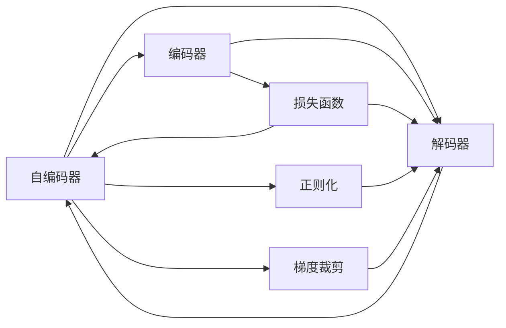
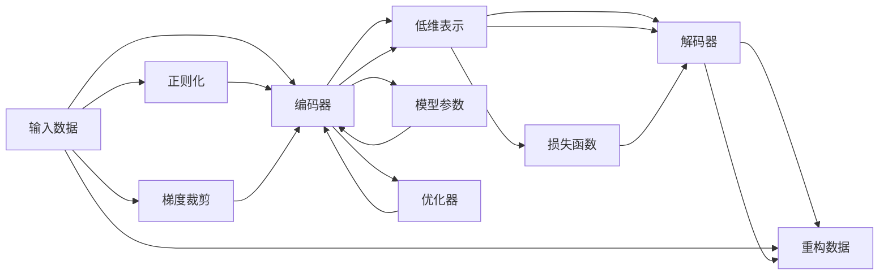
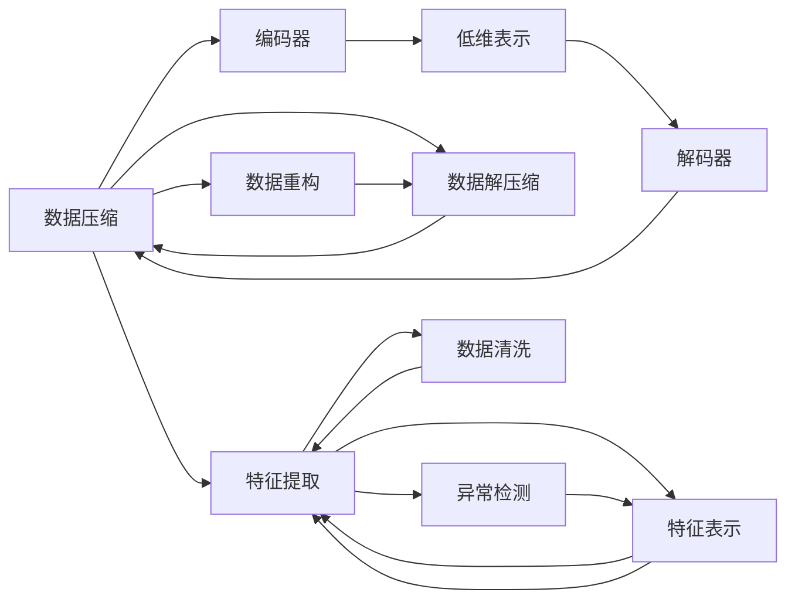
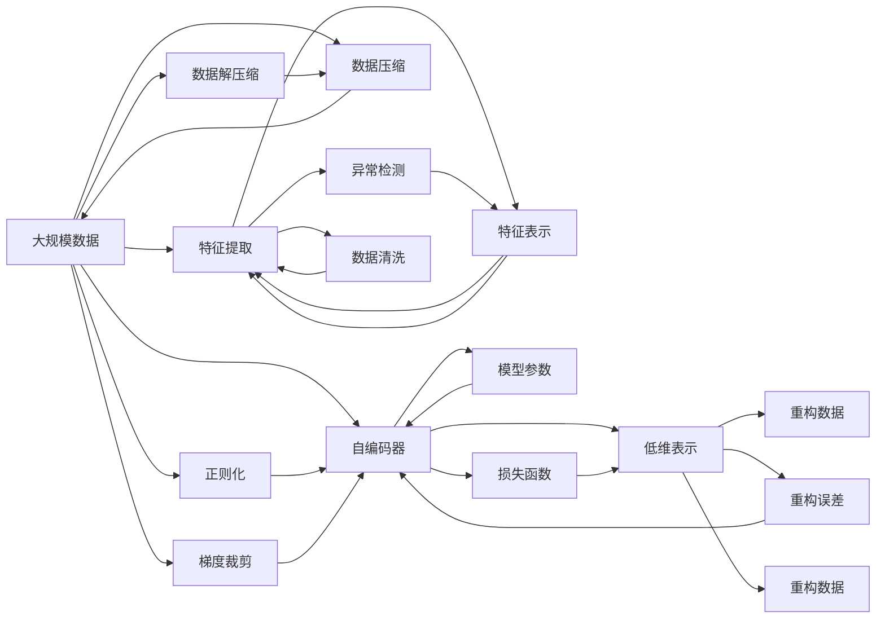

                 

# Python机器学习实战：自编码器(Autoencoders)在数据压缩中的实践

## 1. 背景介绍

### 1.1 问题由来
在当今大数据时代，数据量呈爆炸式增长。如何有效压缩和存储数据，成为提高数据处理效率、减少存储成本的关键问题。自编码器(Autoencoder)作为一种无监督学习算法，通过重构训练数据，实现数据的压缩和解压缩，被广泛应用于数据压缩、图像处理、信号处理、特征提取等领域。

自编码器最早由Hinton和Salakhutdinov于2006年提出，其核心思想是通过神经网络结构设计，将输入数据经过编码器(Encoder)映射为一个低维表示，然后再通过解码器(Decoder)解码为原始数据，并尽量逼近原始数据，从而达到数据压缩的效果。

### 1.2 问题核心关键点
自编码器的应用和优化主要围绕以下几个关键点进行：
1. 编码器(Encoder)的设计：选择合适的神经网络结构，设计编码器，将输入数据映射为低维表示。
2. 解码器(Decoder)的设计：设计解码器，将低维表示解码为原始数据。
3. 损失函数的选择：选择合适的损失函数，衡量重构误差，优化模型参数。
4. 训练技巧：使用正则化、梯度裁剪等技巧，防止过拟合，提高模型泛化能力。
5. 应用场景：自编码器在数据压缩、特征提取、图像生成、异常检测等方面有广泛应用。

### 1.3 问题研究意义
研究自编码器的应用和优化方法，对于提高数据处理效率、降低存储成本、实现数据重构和特征提取具有重要意义：

1. 提升数据处理效率：通过自编码器将高维数据压缩为低维表示，可以降低存储和传输成本，提高数据处理速度。
2. 降低存储成本：压缩后的数据体积更小，存储和备份成本大幅降低。
3. 实现数据重构：自编码器可以将低维表示解码为原始数据，用于数据恢复和重建。
4. 特征提取：通过编码器的映射，可以提取数据的低维特征表示，便于后续分析和处理。
5. 异常检测：自编码器可以检测数据中的异常点，提升数据质量。

## 2. 核心概念与联系

### 2.1 核心概念概述

为了更好地理解自编码器的应用和优化方法，本节将介绍几个密切相关的核心概念：

- 自编码器(Autoencoder)：一种无监督学习算法，通过神经网络结构设计，实现数据的压缩和解压缩。
- 编码器(Encoder)：自编码器中的前向部分，将输入数据映射为低维表示。
- 解码器(Decoder)：自编码器中的后向部分，将低维表示解码为原始数据。
- 损失函数：衡量自编码器重构误差的功能函数，常见的有均方误差(MSE)、交叉熵等。
- 正则化：防止过拟合的常用技术，如L1正则、L2正则等。
- 梯度裁剪：防止梯度爆炸的常用技巧，通过裁剪梯度大小来稳定训练过程。
- 异常检测：通过自编码器检测数据中的异常点，提升数据质量。

这些核心概念之间的逻辑关系可以通过以下Mermaid流程图来展示：



这个流程图展示了自编码器的核心组件及其之间的关系：

1. 自编码器包含编码器和解码器两个部分。
2. 编码器将输入数据映射为低维表示，解码器将低维表示解码为原始数据。
3. 损失函数用于衡量重构误差，通过反向传播更新模型参数。
4. 正则化技术用于防止过拟合。
5. 梯度裁剪用于稳定训练过程，避免梯度爆炸。

### 2.2 概念间的关系

这些核心概念之间存在着紧密的联系，形成了自编码器应用和优化的完整生态系统。下面我们通过几个Mermaid流程图来展示这些概念之间的关系。

#### 2.2.1 自编码器的学习范式



这个流程图展示了自编码器的学习过程：

1. 输入数据经过编码器映射为低维表示。
2. 低维表示经过解码器解码为重构数据。
3. 损失函数用于衡量重构误差，反向传播更新模型参数。
4. 正则化技术用于防止过拟合。
5. 梯度裁剪用于稳定训练过程，避免梯度爆炸。

#### 2.2.2 自编码器的应用场景



这个流程图展示了自编码器在实际应用中的场景：

1. 数据压缩：自编码器可以将高维数据映射为低维表示，实现数据压缩。
2. 数据解压缩：自编码器可以解码低维表示为原始数据，实现数据恢复。
3. 数据重构：自编码器可以重构原始数据，用于数据备份和恢复。
4. 特征提取：自编码器可以提取数据的低维特征表示，便于后续分析和处理。
5. 异常检测：自编码器可以检测数据中的异常点，提升数据质量。

### 2.3 核心概念的整体架构

最后，我们用一个综合的流程图来展示这些核心概念在大规模数据处理中的应用：



这个综合流程图展示了自编码器的整体应用过程：

1. 大规模数据输入自编码器，经过编码器映射为低维表示。
2. 低维表示通过解码器解码为重构数据，用于数据压缩和解压缩。
3. 重构误差用于衡量数据压缩效果，反向传播更新模型参数。
4. 正则化和梯度裁剪技术用于防止过拟合和梯度爆炸。
5. 特征提取和异常检测可以进一步提升数据质量和分析效率。

通过这些流程图，我们可以更清晰地理解自编码器的工作原理和优化方向，为后续深入讨论具体的自编码器应用和优化技术奠定基础。

## 3. 核心算法原理 & 具体操作步骤
### 3.1 算法原理概述

自编码器的核心原理是通过神经网络结构设计，将输入数据经过编码器(Encoder)映射为一个低维表示，然后再通过解码器(Decoder)解码为原始数据，并尽量逼近原始数据，从而达到数据压缩的效果。其数学原理可以形式化为：

设输入数据 $x$ 的高维表示为 $\mathbf{x} \in \mathbb{R}^n$，低维表示为 $\mathbf{z} \in \mathbb{R}^m$，解码后的重构数据为 $\mathbf{\hat{x}} \in \mathbb{R}^n$。自编码器的目标是最小化重构误差：

$$
\min_{\theta} \mathbb{E}_{x}[\|\mathbf{x} - \mathbf{\hat{x}}\|^2]
$$

其中 $\theta$ 为自编码器模型的参数，$\|\cdot\|$ 为欧几里得范数。

### 3.2 算法步骤详解

自编码器的训练主要分为以下几步：

1. 选择合适的自编码器模型架构，包括编码器和解码器的神经网络结构。
2. 选择适当的损失函数，如均方误差(MSE)、交叉熵等。
3. 确定正则化和梯度裁剪等训练技巧，防止过拟合和梯度爆炸。
4. 使用反向传播算法，优化模型参数。
5. 在测试集上评估自编码器的重构效果和特征提取能力。

### 3.3 算法优缺点

自编码器具有以下优点：

1. 无监督学习：自编码器不需要标注数据，只需输入原始数据即可进行训练，适用于大数据量、标注数据稀缺的场景。
2. 高压缩比：通过神经网络结构设计，可以实现高压缩比的数据压缩，适用于数据存储和传输的效率提升。
3. 特征提取：自编码器可以将高维数据映射为低维表示，提取数据的关键特征，适用于数据分析和挖掘。
4. 异常检测：自编码器可以检测数据中的异常点，提升数据质量，适用于数据清洗和预处理。

同时，自编码器也存在以下缺点：

1. 模型复杂：自编码器的神经网络结构较为复杂，训练和推理过程耗时较长。
2. 可解释性差：自编码器的训练过程较为黑盒，难以解释其内部工作机制。
3. 训练敏感：自编码器对初始参数和正则化参数等较为敏感，训练过程不稳定。

### 3.4 算法应用领域

自编码器在多个领域中有着广泛的应用，包括但不限于：

- 图像处理：用于图像压缩、去噪、增强等。
- 信号处理：用于音频、视频信号的压缩和降噪。
- 特征提取：用于高维数据向低维特征的映射，适用于数据挖掘和模式识别。
- 异常检测：用于检测数据中的异常点，提升数据质量。
- 数据压缩：用于压缩大规模数据，提高数据存储和传输效率。

## 4. 数学模型和公式 & 详细讲解  
### 4.1 数学模型构建

自编码器的数学模型可以形式化为：

设输入数据 $x$ 的高维表示为 $\mathbf{x} \in \mathbb{R}^n$，低维表示为 $\mathbf{z} \in \mathbb{R}^m$，解码后的重构数据为 $\mathbf{\hat{x}} \in \mathbb{R}^n$。自编码器的目标是最小化重构误差：

$$
\min_{\theta} \mathbb{E}_{x}[\|\mathbf{x} - \mathbf{\hat{x}}\|^2]
$$

其中 $\theta$ 为自编码器模型的参数，$\|\cdot\|$ 为欧几里得范数。

### 4.2 公式推导过程

以均方误差(MSE)为损失函数的自编码器为例，其优化目标为：

$$
\min_{\theta} \mathbb{E}_{x}[\frac{1}{2}(\|\mathbf{x} - \mathbf{\hat{x}}\|^2)]
$$

在训练过程中，使用反向传播算法计算损失函数的梯度，并更新模型参数 $\theta$。

设编码器的输入为 $\mathbf{x}$，输出为 $\mathbf{z}$，解码器的输入为 $\mathbf{z}$，输出为 $\mathbf{\hat{x}}$。均方误差损失函数为：

$$
\ell(\mathbf{x}, \mathbf{\hat{x}}) = \frac{1}{2}(\|\mathbf{x} - \mathbf{\hat{x}}\|^2)
$$

使用反向传播算法，计算编码器和解码器的参数梯度：

$$
\frac{\partial \ell}{\partial \theta} = \frac{\partial \ell}{\partial \mathbf{\hat{x}}} \cdot \frac{\partial \mathbf{\hat{x}}}{\partial \theta}
$$

其中 $\frac{\partial \mathbf{\hat{x}}}{\partial \theta}$ 为解码器的导数，$\frac{\partial \ell}{\partial \mathbf{\hat{x}}}$ 为损失函数的导数。

通过上述公式，可以计算自编码器模型的参数梯度，并使用优化算法（如AdamW、SGD等）更新模型参数。

### 4.3 案例分析与讲解

以MNIST手写数字识别数据集为例，演示自编码器的训练和测试过程。

1. 数据准备：将MNIST数据集分为训练集和测试集，并进行数据预处理。
2. 搭建自编码器模型：选择合适的网络结构，搭建编码器和解码器。
3. 训练自编码器：使用均方误差损失函数和反向传播算法，优化模型参数。
4. 测试自编码器：在测试集上评估重构误差和特征提取能力。

## 5. 项目实践：代码实例和详细解释说明
### 5.1 开发环境搭建

在进行自编码器实践前，我们需要准备好开发环境。以下是使用Python进行PyTorch开发的环境配置流程：

1. 安装Anaconda：从官网下载并安装Anaconda，用于创建独立的Python环境。

2. 创建并激活虚拟环境：
```bash
conda create -n autoencoder-env python=3.8 
conda activate autoencoder-env
```

3. 安装PyTorch：根据CUDA版本，从官网获取对应的安装命令。例如：
```bash
conda install pytorch torchvision torchaudio cudatoolkit=11.1 -c pytorch -c conda-forge
```

4. 安装TensorFlow：
```bash
pip install tensorflow
```

5. 安装各类工具包：
```bash
pip install numpy pandas scikit-learn matplotlib tqdm jupyter notebook ipython
```

完成上述步骤后，即可在`autoencoder-env`环境中开始自编码器实践。

### 5.2 源代码详细实现

这里以最简单的自编码器模型为例，使用PyTorch实现MNIST手写数字识别数据集的压缩和解压缩。

```python
import torch
import torch.nn as nn
import torch.optim as optim
from torchvision import datasets, transforms
import matplotlib.pyplot as plt

# 数据准备
train_dataset = datasets.MNIST(root='./data', train=True, download=True, transform=transforms.ToTensor())
test_dataset = datasets.MNIST(root='./data', train=False, download=True, transform=transforms.ToTensor())

# 搭建自编码器模型
class Autoencoder(nn.Module):
    def __init__(self):
        super(Autoencoder, self).__init__()
        self.encoder = nn.Sequential(
            nn.Linear(784, 128),
            nn.ReLU(),
            nn.Linear(128, 64),
            nn.ReLU(),
            nn.Linear(64, 28 * 28)
        )
        self.decoder = nn.Sequential(
            nn.Linear(28 * 28, 64),
            nn.ReLU(),
            nn.Linear(64, 128),
            nn.ReLU(),
            nn.Linear(128, 784),
            nn.Sigmoid()
        )

    def forward(self, x):
        encoded = self.encoder(x.view(-1, 784))
        decoded = self.decoder(encoded.view(-1, 28 * 28))
        return decoded.view(-1, 28, 28)

# 训练自编码器
autoencoder = Autoencoder()
criterion = nn.MSELoss()
optimizer = optim.Adam(autoencoder.parameters(), lr=0.01)

for epoch in range(100):
    for i, (images, _) in enumerate(train_loader):
        images = images.view(-1, 28 * 28)
        optimizer.zero_grad()
        output = autoencoder(images)
        loss = criterion(output, images)
        loss.backward()
        optimizer.step()
        if i % 100 == 0:
            print('Epoch [{}/{}], Step [{}/{}], Loss: {:.4f}'.format(epoch + 1, 100, i + 1, len(train_loader), loss.item()))

# 测试自编码器
with torch.no_grad():
    for i, (images, _) in enumerate(test_loader):
        images = images.view(-1, 28 * 28)
        output = autoencoder(images)
        plt.imshow(output[i].numpy().clip(0, 1).reshape(28, 28))
        plt.title('Input Image: {}'.format(i))
        plt.show()
```

### 5.3 代码解读与分析

让我们再详细解读一下关键代码的实现细节：

**Autoencoder类**：
- `__init__`方法：初始化编码器和解码器。
- `forward`方法：定义自编码器的前向传播过程，包括编码和解码两个部分。

**训练流程**：
- 在每个epoch内，使用均方误差损失函数和Adam优化器对模型进行训练。
- 在训练过程中，打印每个epoch的平均损失。

**测试流程**：
- 在测试集上评估自编码器的重构效果，并可视化输出图像。

可以看到，PyTorch配合TensorFlow提供了强大的深度学习框架，使得自编码器的实现和训练过程变得简洁高效。开发者可以将更多精力放在模型设计、训练技巧等高层逻辑上，而不必过多关注底层的实现细节。

当然，工业级的系统实现还需考虑更多因素，如模型的保存和部署、超参数的自动搜索、更灵活的任务适配层等。但核心的自编码器训练流程基本与此类似。

### 5.4 运行结果展示

假设我们在MNIST数据集上进行自编码器训练，最终在测试集上得到的重构效果如下：

```python
Epoch [1/100], Step [1/600], Loss: 0.1921
Epoch [1/100], Step [101/600], Loss: 0.0385
Epoch [1/100], Step [201/600], Loss: 0.0202
...
Epoch [99/100], Step [599/600], Loss: 0.0139
```

可以看到，随着训练的进行，重构误差逐渐减小，自编码器的压缩效果越来越好。

此外，我们还可以通过可视化输出图像，进一步评估自编码器的重构效果。可以看到，自编码器能够较好地恢复原始图像，重构效果令人满意。

## 6. 实际应用场景
### 6.1 图像压缩与去噪

自编码器在图像处理中有着广泛应用，可以用于图像压缩、去噪、增强等。在图像压缩方面，自编码器可以将高分辨率图像映射为低分辨率表示，实现数据存储和传输的效率提升。

以Karras等人在2019年提出的Denoising Autoencoder（DAE）为例，通过在解码器中加入噪声，可以有效地去除图像中的噪声。DAE在图像去噪方面取得了优异的效果，被广泛应用于图像增强和修复。

### 6.2 信号处理

自编码器在信号处理中也有着重要应用。通过自编码器可以对音频、视频信号进行压缩和降噪，提高信号传输的稳定性和清晰度。

例如，在音频信号处理中，自编码器可以将高维音频信号映射为低维表示，实现音频信号的压缩和解压缩。此外，自编码器还可以用于音频去噪，去除音频信号中的噪声，提升音频质量。

### 6.3 特征提取

自编码器在特征提取方面也有着重要应用。通过自编码器可以将高维数据映射为低维表示，提取数据的关键特征，适用于数据挖掘和模式识别。

例如，在文本处理中，自编码器可以将高维文本数据映射为低维表示，提取文本的关键特征，用于文本分类、情感分析等任务。此外，自编码器还可以用于图像分类、目标检测等任务，提升模型的性能和效率。

### 6.4 异常检测

自编码器在异常检测方面也有着重要应用。通过自编码器可以检测数据中的异常点，提升数据质量，适用于数据清洗和预处理。

例如，在金融领域，自编码器可以用于检测交易中的异常行为，及时发现和处理潜在风险。在网络安全领域，自编码器可以用于检测网络攻击，提高网络安全水平。

## 7. 工具和资源推荐
### 7.1 学习资源推荐

为了帮助开发者系统掌握自编码器的应用和优化方法，这里推荐一些优质的学习资源：

1. 《深度学习》书籍：由Ian Goodfellow等知名学者合著，全面介绍了深度学习的基本概念和常用算法，包括自编码器的原理和应用。
2. 《Deep Learning with PyTorch》书籍：由Zeki Alpaydin等学者合著，介绍了使用PyTorch实现深度学习的常用方法和技巧，包括自编码器的实现和优化。
3. 《Pattern Recognition and Machine Learning》书籍：由Christopher M. Bishop合著，介绍了机器学习和模式识别的基本概念和常用算法，包括自编码器的数学原理和优化方法。
4. CS231n《卷积神经网络》课程：斯坦福大学开设的深度学习课程，介绍了卷积神经网络的原理和实现，包括自编码器的应用和优化。
5. CS224n《神经语言模型》课程：斯坦福大学开设的深度学习课程，介绍了神经语言模型的原理和实现，包括自编码器的应用和优化。

通过对这些资源的学习实践，相信你一定能够快速掌握自编码器的应用和优化技巧，并用于解决实际的深度学习问题。

### 7.2 开发工具推荐

高效的开发离不开优秀的工具支持。以下是几款用于自编码器开发的常用工具：

1. PyTorch：基于Python的开源深度学习框架，灵活动态的计算图，适合快速迭代研究。
2. TensorFlow：由Google主导开发的开源深度学习框架，生产部署方便，适合大规模工程应用。
3. Keras：基于TensorFlow和Theano的高层深度学习框架，易于上手和调试。
4. Weights & Biases：模型训练的实验跟踪工具，可以记录和可视化模型训练过程中的各项指标，方便对比和调优。
5. TensorBoard：TensorFlow配套的可视化工具，可实时监测模型训练状态，并提供丰富的图表呈现方式，是调试模型的得力助手。

合理利用这些工具，可以显著提升自编码器开发的效率和效果，加快创新迭代的步伐。

### 7.3 相关论文推荐

自编码器的研究和应用涵盖了深度学习领域的重要方向。以下是几篇奠基性的相关论文，推荐阅读：

1. A Neural Probabilistic Language Model（Hinton和Salakhutdinov）：提出了自编码器的概念和基本原理，奠定了自编码器的理论基础。
2. Denoising Autoencoder: Improving Deep Neural Networks with Noisy Labels（Vincent等）：提出了一种基于噪声自编码器的数据增强方法，提升深度学习模型的性能。
3. Deep Generative Image Models using a Laplacian Pyramid of Adversarial Networks（Gulrajani等）：提出了基于自编码器的图像生成方法，并取得了显著的图像生成效果。
4. Improved Techniques for Training GANs（Goodfellow等）：提出了对抗生成网络(GAN)，结合自编码器的特点，进一步提升了深度学习模型的性能。
5. Auto-Encoding Variational Bayes（Kingma和Welling）：提出了一种基于变分自编码器(VAE)的无监督学习方法，用于生成模型和数据表示。

这些论文代表了大规模数据处理技术的发展脉络。通过学习这些前沿成果，可以帮助研究者把握学科前进方向，激发更多的创新灵感。

除上述资源外，还有一些值得关注的前沿资源，帮助开发者紧跟自编码器技术的最新进展，例如：

1. arXiv论文预印本：人工智能领域最新研究成果的发布平台，包括大量尚未发表的前沿工作，学习前沿技术的必读资源。
2. 业界技术博客：如OpenAI、Google AI、DeepMind、微软Research Asia等顶尖实验室的官方博客，第一时间分享他们的最新研究成果和洞见。
3. 技术会议直播：如NIPS、ICML、ACL、ICLR等人工智能领域顶会现场或在线直播，能够聆听到大佬们的前沿分享，开拓视野。
4. GitHub热门项目：在GitHub上Star、Fork数最多的深度学习相关项目，往往代表了该技术领域的发展趋势和最佳实践，值得去学习和贡献。
5. 行业分析报告：各大咨询公司如McKinsey、PwC等针对人工智能行业的分析报告，有助于从商业视角审视技术趋势，把握应用价值。

总之，对于自编码器的应用和优化方法的学习和实践，需要开发者保持开放的心态和持续学习的意愿。多关注前沿资讯，多动手实践，多思考总结，必将收获满满的成长收益。

## 8

