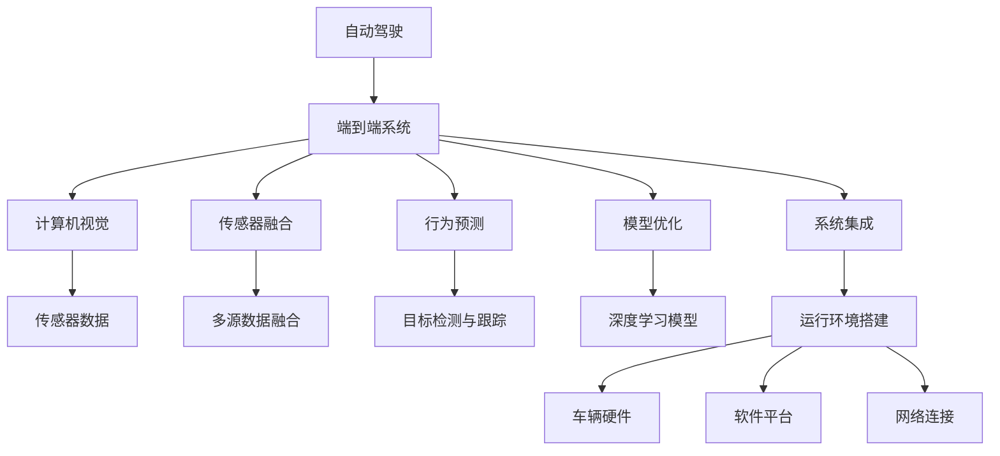
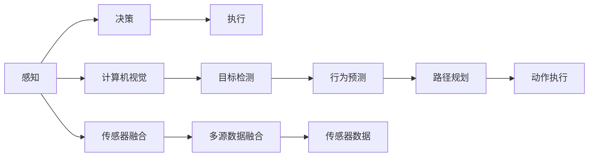
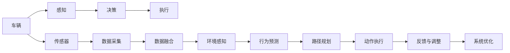
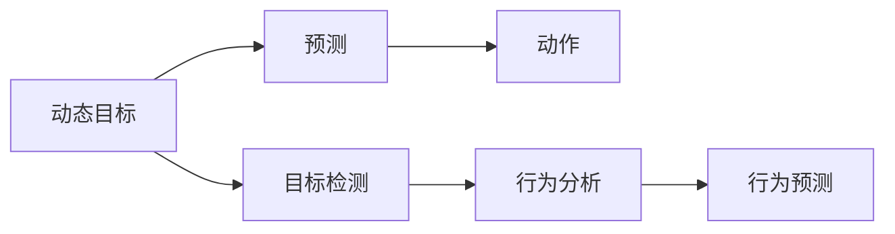
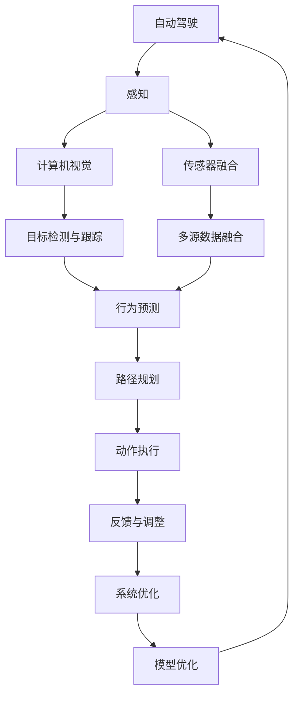

                 

# Python深度学习实践：建立端到端的自动驾驶系统

> 关键词：自动驾驶, 端到端, 深度学习, 计算机视觉, 传感器融合, 行为预测, 模型优化, 运行环境搭建, 系统测试

## 1. 背景介绍

### 1.1 问题由来

随着科技的飞速发展，自动驾驶技术已经不再是科幻小说中的梦想，而是逐步走向现实。自动驾驶技术的实现离不开深度学习技术的支撑，而深度学习的应用则离不开端到端(E2E)的系统架构设计。端到端系统将传感器输入、感知处理、行为预测、决策执行等各环节融为一体，能够更加高效、稳定地进行自动驾驶任务。

本博客将详细介绍如何使用Python深度学习技术，结合计算机视觉、传感器融合、行为预测等技术，建立端到端的自动驾驶系统，并对其应用进行深入探讨。

### 1.2 问题核心关键点

建立端到端的自动驾驶系统，关键在于以下几个方面：

1. 传感器数据融合：将摄像头、雷达、激光雷达等多种传感器采集的数据进行融合，以获得更准确的环境感知。
2. 实时目标检测与跟踪：利用计算机视觉技术，实时检测和跟踪道路上的车辆、行人等动态目标。
3. 行为预测与决策：基于环境感知和行为预测算法，进行路径规划和决策。
4. 模型优化与训练：通过深度学习模型进行训练，优化模型参数，提升预测准确性和鲁棒性。
5. 系统集成与测试：将各模块集成到统一的运行环境，进行全面的测试和验证。

本文将围绕这几个核心关键点，深入讲解如何使用Python深度学习技术构建端到端的自动驾驶系统。

### 1.3 问题研究意义

自动驾驶技术的实现涉及到复杂的计算机视觉、传感器融合、行为预测等技术，深度学习是其中关键的一环。通过端到端系统架构的设计，可以更好地整合各个模块，提高系统的稳定性和可靠性。

端到端自动驾驶系统的研究对于推动自动驾驶技术的产业化进程，具有重要意义：

1. 提升驾驶安全：端到端系统能够更好地处理突发事件，提高自动驾驶的安全性。
2. 缩短开发周期：端到端架构将各模块有机结合，缩短开发和测试周期。
3. 增强用户体验：通过优化模型，提升自动驾驶的准确性和鲁棒性，增强用户的使用体验。
4. 促进产业发展：端到端系统能够更好地适应不同的应用场景，推动自动驾驶技术的商业化应用。
5. 带来技术创新：端到端架构的实现需要结合多种前沿技术，推动深度学习技术的发展。

## 2. 核心概念与联系

### 2.1 核心概念概述

为更好地理解端到端自动驾驶系统的构建，本节将介绍几个密切相关的核心概念：

- 自动驾驶(Autonomous Driving)：一种能够自主控制车辆行驶，无需人工干预的驾驶技术。
- 端到端系统(E2E System)：将车辆感知、决策、执行等各个环节有机结合的系统架构。
- 计算机视觉(Computer Vision)：利用计算机技术，对图像、视频等视觉信息进行理解、处理和分析的技术。
- 传感器融合(Sensor Fusion)：将多种传感器采集的数据进行融合，以获得更全面的环境感知。
- 行为预测(Prediction)：对车辆、行人等动态目标的行为进行预测，以提高路径规划和决策的准确性。
- 模型优化(Model Optimization)：通过深度学习模型对模型参数进行优化，提升模型性能。
- 系统集成(System Integration)：将各个模块集成到统一的运行环境，进行全面测试和验证。
- 运行环境(Run Environment)：包括车辆硬件、软件平台、网络连接等，支持自动驾驶系统的运行。

这些核心概念之间的逻辑关系可以通过以下Mermaid流程图来展示：

这个流程图展示了几大核心概念的联系：

1. 自动驾驶的核心是端到端系统，将感知、决策、执行等环节有机结合。
2. 端到端系统中的感知部分主要依赖计算机视觉技术，通过传感器数据获取环境信息。
3. 感知数据需要经过传感器融合处理，以获得更全面的环境感知。
4. 行为预测部分需要对动态目标进行检测和跟踪，预测其行为。
5. 模型优化部分利用深度学习模型对模型参数进行优化。
6. 系统集成部分将各个模块集成到统一的运行环境中，进行全面测试和验证。
7. 运行环境部分包括车辆硬件、软件平台、网络连接等，是系统运行的基础。

### 2.2 概念间的关系

这些核心概念之间存在着紧密的联系，形成了端到端自动驾驶系统的完整架构。下面我通过几个Mermaid流程图来展示这些概念之间的关系。

#### 2.2.1 自动驾驶学习范式

这个流程图展示了自动驾驶的学习范式，即从感知到决策再到执行的整个流程。

#### 2.2.2 端到端系统架构

这个流程图展示了端到端系统的架构，从数据采集到反馈调整的整个过程。

#### 2.2.3 行为预测模型

这个流程图展示了行为预测的模型结构，从目标检测到行为预测的整个过程。

### 2.3 核心概念的整体架构

最后，我们用一个综合的流程图来展示这些核心概念在端到端自动驾驶系统中的整体架构：

这个综合流程图展示了从感知到路径规划的整个端到端系统流程，其中每个环节都是紧密关联、相互作用的。通过理解这些核心概念，我们可以更好地把握端到端自动驾驶系统的构建方法。

## 3. 核心算法原理 & 具体操作步骤
### 3.1 算法原理概述

端到端的自动驾驶系统构建基于以下几个核心算法：

1. 传感器数据融合：利用卡尔曼滤波、粒子滤波等算法，将来自不同传感器的数据进行融合，以获得更准确的环境感知。
2. 计算机视觉：利用目标检测与跟踪算法，实时检测和跟踪道路上的车辆、行人等动态目标，生成行为预测所需的信息。
3. 行为预测：基于机器学习、深度学习等算法，对动态目标的行为进行预测，生成路径规划所需的信息。
4. 路径规划：利用图搜索、路径规划算法，生成车辆在道路上的最优行驶路径。
5. 动作执行：通过车辆控制算法，实现对车辆的方向、速度等控制。
6. 反馈与调整：利用反馈系统，不断调整感知、决策、执行等环节的参数，提高系统的鲁棒性。
7. 系统优化：通过模型优化算法，提升模型的预测准确性和鲁棒性。

这些核心算法相互配合，共同构成端到端的自动驾驶系统。

### 3.2 算法步骤详解

构建端到端的自动驾驶系统主要包括以下几个关键步骤：

**Step 1: 准备数据集与环境**

- 收集自动驾驶相关的数据集，包括摄像头、雷达、激光雷达等传感器的数据。
- 搭建仿真环境，进行数据预处理和增强，生成训练和测试数据集。
- 准备车辆硬件、软件平台、网络连接等运行环境。

**Step 2: 实现传感器数据融合**

- 利用卡尔曼滤波、粒子滤波等算法，将来自不同传感器的数据进行融合，获得更准确的环境感知。
- 对融合后的数据进行噪声滤除和数据预处理，提升数据质量。

**Step 3: 实现计算机视觉模块**

- 利用目标检测算法，如Faster R-CNN、YOLO等，实时检测道路上的车辆、行人等动态目标。
- 利用目标跟踪算法，如Siam R-CNN、DeepSORT等，对检测到的目标进行跟踪，生成行为预测所需的信息。

**Step 4: 实现行为预测模块**

- 利用深度学习模型，如LSTM、GRU等，对动态目标的行为进行预测，生成路径规划所需的信息。
- 对预测结果进行后处理，如边界框校正、行为分类等，提高预测的准确性。

**Step 5: 实现路径规划模块**

- 利用图搜索算法，如A*、Dijkstra等，生成车辆在道路上的最优行驶路径。
- 对路径进行后处理，如车道线检测、交通标志识别等，确保路径的安全性和合理性。

**Step 6: 实现动作执行模块**

- 利用车辆控制算法，如PID控制、模型预测控制等，实现对车辆的方向、速度等控制。
- 对控制结果进行后处理，如模糊控制、鲁棒控制等，提高系统的稳定性和鲁棒性。

**Step 7: 实现反馈与调整模块**

- 利用反馈系统，不断调整感知、决策、执行等环节的参数，提高系统的鲁棒性。
- 对调整结果进行评估和优化，提升系统的性能。

**Step 8: 实现模型优化与训练**

- 利用深度学习模型，对模型参数进行优化，提升模型的预测准确性和鲁棒性。
- 对优化后的模型进行训练和验证，确保模型的性能和稳定性。

### 3.3 算法优缺点

端到端的自动驾驶系统构建具有以下优点：

1. 高效性：将感知、决策、执行等环节有机结合，减少了系统复杂度，提高了系统的运行效率。
2. 稳定性：通过传感器数据融合和行为预测，提高了系统的鲁棒性和稳定性。
3. 可扩展性：各模块可独立开发和测试，便于后续的扩展和优化。

同时，端到端系统也存在一些缺点：

1. 数据需求高：需要大量标注数据进行训练和验证，数据获取和标注成本较高。
2. 模型复杂度高：系统包含多个模块和算法，模型复杂度高，难以调试和优化。
3. 资源消耗大：需要高性能的硬件设备和丰富的软件资源，系统搭建和维护成本较高。

### 3.4 算法应用领域

端到端的自动驾驶系统构建不仅适用于自动驾驶领域，还可应用于以下多个领域：

1. 智能交通管理：通过实时感知和行为预测，优化交通流量，提高道路通行效率。
2. 无人机控制：通过实时检测和路径规划，实现无人机的智能飞行。
3. 机器人导航：通过实时感知和路径规划，实现机器人在复杂环境中的自主导航。
4. 智慧城市建设：通过实时感知和决策执行，提升城市管理的智能化水平。
5. 虚拟现实游戏：通过实时感知和行为预测，提高游戏场景的真实感和互动性。

以上领域的应用，展示了端到端系统架构的广泛适用性和深远影响。

## 4. 数学模型和公式 & 详细讲解 & 举例说明

### 4.1 数学模型构建

在端到端自动驾驶系统中，我们主要涉及以下几个数学模型：

- 卡尔曼滤波(Kalman Filter)：用于传感器数据融合，获得更准确的环境感知。
- Faster R-CNN目标检测模型：用于计算机视觉模块，实时检测道路上的车辆、行人等动态目标。
- LSTM行为预测模型：用于行为预测模块，对动态目标的行为进行预测，生成路径规划所需的信息。
- A*路径规划算法：用于路径规划模块，生成车辆在道路上的最优行驶路径。
- PID控制算法：用于动作执行模块，实现对车辆的方向、速度等控制。

### 4.2 公式推导过程

#### 4.2.1 卡尔曼滤波模型

卡尔曼滤波是一种递推滤波算法，用于传感器数据融合，获得更准确的环境感知。假设传感器数据存在噪声，卡尔曼滤波模型可以表示为：

$$
\hat{x}_k = F_k \hat{x}_{k-1} + B_k u_k + w_k
$$

$$
\hat{P}_k = F_k \hat{P}_{k-1} F_k^T + Q_k
$$

$$
K_k = \hat{P}_k H_k^T (H_k \hat{P}_k H_k^T + R_k)^{-1}
$$

$$
\hat{x}_{k|k} = \hat{x}_k + K_k (z_k - H_k \hat{x}_k)
$$

$$
\hat{P}_{k|k} = (I - K_k H_k) \hat{P}_k
$$

其中：

- $x_k$：状态变量，如车辆位置、速度等。
- $u_k$：控制变量，如车辆加速度、转向角度等。
- $z_k$：传感器测量值，如激光雷达扫描数据。
- $H_k$：传感器测量矩阵，将传感器测量值映射到状态变量空间。
- $w_k$：过程噪声，表示系统状态变化的不确定性。
- $v_k$：测量噪声，表示传感器测量值的不确定性。
- $F_k$：状态转移矩阵，表示系统状态变化规律。
- $B_k$：控制矩阵，表示控制变量的影响。
- $Q_k$：过程噪声协方差矩阵。
- $R_k$：测量噪声协方差矩阵。
- $\hat{x}_{k|k}$：状态估计值。
- $\hat{P}_{k|k}$：状态估计协方差矩阵。
- $K_k$：卡尔曼增益。

卡尔曼滤波通过递推计算，不断更新状态估计和协方差，实现对传感器数据的融合，提升环境感知准确性。

#### 4.2.2 Faster R-CNN目标检测模型

Faster R-CNN目标检测模型采用两阶段检测框架，主要包括RPN区域候选生成网络和Fast R-CNN分类与回归网络。假设图像大小为$H \times W$，目标类别数为$N$，Faster R-CNN目标检测模型的公式推导如下：

1. RPN区域候选生成网络：

$$
RPN = \{(x_t, y_t, w_t, h_t)\}_{t=1}^T
$$

其中$(x_t, y_t)$表示候选区域的中心坐标，$w_t$表示候选区域的宽度，$h_t$表示候选区域的高度。

2. Fast R-CNN分类与回归网络：

$$
p(y_i|x_t, y_t, w_t, h_t) = \sigma(\sum_{j=1}^{D} f_i(x_t, y_t, w_t, h_t) \phi_j)
$$

$$
r_i(x_t, y_t, w_t, h_t) = \frac{1}{s_i} \left( x_t - c_x + \frac{w_t}{2} \right) + \frac{y_t}{s_i}
$$

其中，$p(y_i|x_t, y_t, w_t, h_t)$表示候选区域$i$被标注为类别$y_i$的概率，$r_i(x_t, y_t, w_t, h_t)$表示候选区域$i$的回归结果，$s_i$表示候选框的大小。

Faster R-CNN目标检测模型通过两阶段检测，生成候选区域，并通过分类与回归网络对候选区域进行分类和位置回归，实现对目标的检测。

#### 4.2.3 LSTM行为预测模型

LSTM行为预测模型是一种递归神经网络，用于对动态目标的行为进行预测，生成路径规划所需的信息。假设目标行为序列为$\{a_t\}_{t=1}^T$，LSTM行为预测模型的公式推导如下：

1. 输入门：

$$
i_t = \sigma(W_i x_t + b_i + U_i h_{t-1})
$$

2. 遗忘门：

$$
f_t = \sigma(W_f x_t + b_f + U_f h_{t-1})
$$

3. 输出门：

$$
o_t = \sigma(W_o x_t + b_o + U_o h_{t-1})
$$

4. 细胞状态更新：

$$
c_t = f_t \odot c_{t-1} + i_t \odot tanh(W_c x_t + b_c + U_c h_{t-1})
$$

5. 预测：

$$
\hat{y}_t = softmax(W_y c_t + b_y)
$$

其中，$i_t$、$f_t$、$o_t$分别表示输入门、遗忘门、输出门的激活值，$c_t$表示细胞状态，$x_t$表示输入序列，$h_{t-1}$表示上一时刻的隐藏状态，$W_i$、$W_f$、$W_o$、$W_c$、$W_y$分别表示对应门的权重矩阵，$b_i$、$b_f$、$b_o$、$b_c$、$b_y$分别表示对应门的偏置项，$U_i$、$U_f$、$U_o$、$U_c$、$U_y$分别表示对应门的循环权重矩阵，$tanh$表示双曲正切函数，$softmax$表示softmax函数。

LSTM行为预测模型通过输入门、遗忘门、输出门等机制，对细胞状态进行更新，并根据更新后的状态进行预测，实现对动态目标的行为预测。

#### 4.2.4 A*路径规划算法

A*路径规划算法是一种启发式搜索算法，用于生成车辆在道路上的最优行驶路径。假设道路网络表示为$G = (V, E, d)$，其中$V$表示节点集合，$E$表示边集合，$d$表示边权重函数，A*路径规划算法的公式推导如下：

1. 初始化：

$$
h^0 = 0
$$

$$
g^0 = 0
$$

$$
f^0 = h^0
$$

2. 迭代搜索：

$$
f^t = h^t + g^t
$$

$$
\operatorname{open} \leftarrow \{v \mid f^t(v) \leq f^t(o)\} \cup (v \mid v \notin \operatorname{closed} \wedge \operatorname{cost}(v) \leq \operatorname{heuristic}(v))
$$

$$
\operatorname{closed} \leftarrow \operatorname{closed} \cup \{v \mid g^t(v) = \operatorname{cost}(v)\}
$$

$$
\operatorname{open} \leftarrow \operatorname{open} \backslash \{v \mid g^t(v) = \operatorname{cost}(v)\}
$$

$$
(v^*, f^t(v^*)) = \operatorname{argmin}_{v \in \operatorname{open}} f^t(v)
$$

$$
g^t(v^*) = \operatorname{cost}(v^*) + h^t(v^*)
$$

$$
f^t(v^*) = h^t(v^*)
$$

$$
\operatorname{closed} \leftarrow \operatorname{closed} \cup \{v^*\}
$$

$$
\operatorname{open} \leftarrow \operatorname{open} \backslash \{v^*\}
$$

其中，$v$表示节点，$f^t(v)$表示节点$v$的启发式函数，$g^t(v)$表示节点$v$的代价函数，$h^t(v)$表示节点$v$的启发式函数，$\operatorname{open}$表示开放集合，$\operatorname{closed}$表示关闭集合，$\operatorname{cost}(v)$表示边权重函数，$\operatorname{heuristic}(v)$表示启发式函数，$v^*$表示最优节点。

A*路径规划算法通过启发式搜索，生成车辆在道路上的最优行驶路径，实现路径规划。

#### 4.2.5 PID控制算法

PID控制算法是一种常用的反馈控制算法，用于实现对车辆的方向、速度等控制。假设车辆的状态变量为$x(t)$，PID控制算法的公式推导如下：

1. 比例控制：

$$
u_p = k_p (e(t) - e(t-1))
$$

2. 积分控制：

$$
u_i = k_i \int_0^t e(\tau) d\tau
$$

3. 微分控制：

$$
u_d = k_d \frac{d e(t)}{d t}
$$

4. 总控制量：

$$
u = u_p + u_i + u_d
$$

其中，$e(t)$表示误差，$k_p$、$k_i$、$k_d$分别表示比例系数、积分系数、微分系数，$u$表示控制量，$u_p$、$u_i$、$u_d$分别表示比例控制量、积分控制量、微分控制量。

PID控制算法通过比例控制、积分控制、微分控制，实现对车辆的控制，提高系统的稳定性。

### 4.3 案例分析与讲解

#### 4.3.1 卡尔曼滤波案例

假设某自动驾驶系统需要实时感知车辆位置和速度，传感器数据存在噪声。通过卡尔曼滤波算法，可以融合多个传感器的数据，提高环境感知的准确性。具体实现过程如下：

1. 初始化：

$$
\hat{x}_0 = x_0
$$

$$
P_0 = Q_0
$$

2. 迭代更新：

$$
\hat{x}_{k|k-1} = F_k \hat{x}_{k-1} + B_k u_k + w_k
$$

$$
\hat{P}_{k|k-1} = F_k \hat{P}_{k-1} F_k^T + Q_k
$$

$$
K_k = \hat{P}_k H_k^T (H_k \hat{P}_k H_k^T + R_k)^{-1}
$$

$$
\hat{x}_{k|k} = \hat{x}_k + K_k (z_k - H_k \hat{x}_k)
$$

$$
\hat{P}_{k|k} = (I - K_k H_k) \hat{P}_k
$$

其中，$\hat{x}_{k|k}$表示状态估计值，$\hat{P}_{k|k}$表示状态估计协方差矩阵，$z_k$表示传感器测量值，$H_k$表示传感器测量矩阵，$w_k$表示过程噪声，$v_k$表示测量噪声，$F_k$表示状态转移矩阵，$B_k$表示控制矩阵，$Q_k$表示过程噪声协方差矩阵，$R_k$表示测量噪声协方 variance matrix, $u_k$表示控制变量。

通过卡尔曼滤波算法，可以实时更新车辆位置和速度的估计值，提高系统环境感知的准确性。

#### 4.3.2 Faster R-CNN目标检测案例

假设某自动驾驶系统需要实时检测道路上的车辆和行人，实现对动态目标的感知。通过Faster R-CNN目标检测模型，可以高效、准确地检测出道路上的目标，并进行行为预测。具体实现过程如下：

1. RPN区域候选生成网络：

假设某自动驾驶系统需要实时检测道路上的车辆和行人，实现对动态目标的感知。通过Faster R-CNN目标检测模型，可以高效、准确地检测出道路上的目标，并进行行为预测。具体实现过程如下：

1. RPN区域候选生成网络：

$$
RPN = \{(x_t, y_t, w_t, h_t)\}_{t=1}^T
$$

其中$(x_t, y_t)$表示候选区域的中心坐标，$w_t$表示候选区域的宽度，$h_t$表示候选区域的高度。

2. Fast R-CNN分类与回归网络：

$$
p(y_i|x_t, y_t, w_t, h_t) = \sigma(\sum_{j=1}^{D} f_i(x_t, y_t, w_t, h_t) \phi_j)
$$

$$
r_i(x_t, y_t, w_t, h_t) = \frac{1}{s_i} \left( x_t - c_x + \frac{w_t}{2} \right) + \frac

