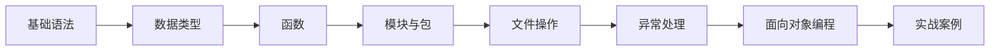
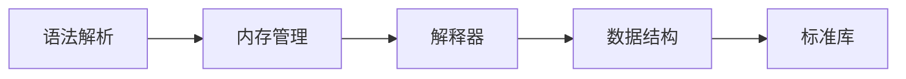
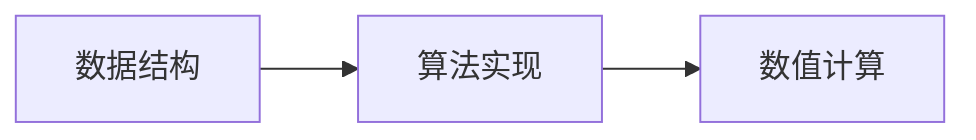
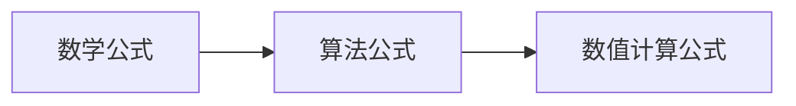

                 

# Python语言基础原理与代码实战案例讲解

> 关键词：Python基础语法,Python数据类型,Python函数,Python模块与包,Python文件操作,Python异常处理,Python面向对象编程,Python项目实战

## 1. 背景介绍

### 1.1 问题由来
Python是一种高级编程语言，以其简洁性、易读性和可扩展性著称。在人工智能、机器学习、Web开发、网络爬虫、数据科学等领域具有广泛应用。作为程序设计初学者和专业开发者的首选语言，Python也吸引了大量人才的加入。因此，对Python语言的深入了解，不仅可以帮助我们更好地掌握编程技能，还能为后续的高级编程打下坚实的基础。

本文将从Python语言的基础原理出发，深入探讨Python的核心概念与技术，并通过丰富的代码实例和案例讲解，帮助读者理解并掌握Python的实战技巧。

### 1.2 问题核心关键点
Python语言基础原理与代码实战的核心关键点包括：

- Python基础语法：掌握Python基础语法，是理解Python语言的基础。
- Python数据类型：了解Python中的基本数据类型及其用法，是进行数据处理的必备知识。
- Python函数：函数是代码复用和模块化的基础，掌握函数的定义与调用，是高效编程的关键。
- Python模块与包：模块与包是组织和管理代码的重要手段，了解其工作原理和使用方法，能够大大提高开发效率。
- Python文件操作：文件操作是Python基础中的重要部分，掌握文件的读写、编辑和路径操作，对于数据处理和系统编程尤为重要。
- Python异常处理：异常处理能够帮助程序员编写更加健壮的代码，是Python编程中不可或缺的一部分。
- Python面向对象编程：面向对象编程是现代编程的趋势，掌握Python中的类和对象，能够让我们编写更加模块化和可扩展的程序。
- Python项目实战：通过实际项目案例的讲解，将理论知识转化为实践能力，是掌握Python编程的最终目标。

### 1.3 问题研究意义
掌握Python语言基础原理与代码实战，对于提升编程技能、加速软件开发进程、增强代码可读性和可维护性，具有重要意义：

1. 编程基础：Python语言简单易学，掌握其基础原理和语法，有助于初学者快速入门。
2. 开发效率：Python数据类型丰富，函数和模块化编程方式，能够提高代码的复用性和可维护性。
3. 实战能力：通过实际项目案例的讲解，将理论知识转化为实践技能，能够提升编程实战能力。
4. 应用广泛：Python语言广泛应用于多个领域，掌握其基础原理和技能，有助于在多个行业进行应用开发。

## 2. 核心概念与联系

### 2.1 核心概念概述

Python作为一种高级编程语言，其核心概念包括：

- 基础语法：Python基础语法包括变量、数据类型、运算符、条件语句、循环语句等，是理解Python语言的基础。
- 数据类型：Python中的数据类型包括数字、字符串、列表、元组、字典、集合等，掌握这些数据类型的特点及其操作，是进行数据处理的关键。
- 函数：Python中的函数是一段可重复使用的代码块，通过参数的传递，能够实现灵活的程序设计。
- 模块与包：Python中的模块和包是组织和管理代码的重要手段，通过导入模块和包，可以方便地使用外部代码和库。
- 文件操作：Python中的文件操作包括文件的读写、编辑和路径操作，是处理文件数据的重要手段。
- 异常处理：Python中的异常处理机制能够帮助程序员编写更加健壮的代码，避免程序崩溃和数据丢失。
- 面向对象编程：Python中的类和对象是面向对象编程的基础，通过封装、继承和多态等特性，能够实现更加模块化和可扩展的程序。

这些核心概念之间的联系可以通过以下Mermaid流程图来展示：

这个流程图展示了大语言模型的核心概念及其之间的联系：

1. 基础语法是理解Python语言的基础。
2. 数据类型是进行数据处理的关键。
3. 函数是代码复用和模块化的基础。
4. 模块与包是组织和管理代码的重要手段。
5. 文件操作是处理文件数据的重要手段。
6. 异常处理能够编写更加健壮的代码。
7. 面向对象编程是现代编程的趋势。
8. 实战案例是掌握Python编程的最终目标。

### 2.2 概念间的关系

这些核心概念之间存在着紧密的联系，形成了Python编程的整体框架。下面是一些具体的联系：

- 基础语法和数据类型是进行编程的基础，掌握基础语法和数据类型，能够帮助我们快速编写和理解Python代码。
- 函数和模块与包是代码复用和组织的重要手段，通过函数和模块与包的调用，能够大大提高开发效率。
- 文件操作和异常处理是程序设计中不可或缺的部分，掌握文件操作和异常处理机制，能够帮助我们编写更加健壮的程序。
- 面向对象编程是现代编程的趋势，掌握类和对象，能够帮助我们编写更加模块化和可扩展的程序。

这些概念的组合使用，能够构建出各种复杂的应用程序，帮助我们完成各种实际任务。

## 3. 核心算法原理 & 具体操作步骤
### 3.1 算法原理概述

Python基础原理与代码实战的核心算法原理包括：

- 语法解析：Python通过语法解析器将源代码转化为可执行的代码。
- 内存管理：Python中的内存管理机制能够自动分配和释放内存，帮助我们编写更加高效的代码。
- 解释器：Python中的解释器能够执行Python代码，并提供调试和运行时的环境。
- 数据结构：Python中的数据结构包括列表、元组、字典、集合等，掌握这些数据结构的用法，能够帮助我们进行高效的数据处理。
- 标准库：Python中的标准库提供了各种常用的模块和函数，掌握这些标准库的使用，能够大大提高开发效率。

这些核心算法原理之间的关系可以通过以下Mermaid流程图来展示：

这个流程图展示了Python基础原理与代码实战的核心算法原理及其之间的联系：

1. 语法解析是将源代码转化为可执行代码的基础。
2. 内存管理是Python自动分配和释放内存的重要机制。
3. 解释器是执行Python代码的环境。
4. 数据结构是进行数据处理的关键。
5. 标准库是提供各种常用模块和函数的重要手段。

### 3.2 算法步骤详解

Python基础原理与代码实战的操作步骤包括：

1. 安装Python解释器：在计算机上安装Python解释器，是使用Python编程的基础。
2. 学习基础语法：掌握Python基础语法，包括变量、数据类型、运算符、条件语句、循环语句等，是理解Python语言的基础。
3. 掌握数据类型：了解Python中的基本数据类型及其用法，是进行数据处理的关键。
4. 理解函数：掌握函数的定义与调用，是高效编程的关键。
5. 掌握模块与包：了解模块和包的工作原理和使用方法，能够大大提高开发效率。
6. 掌握文件操作：掌握文件的读写、编辑和路径操作，是数据处理和系统编程的重要手段。
7. 掌握异常处理：掌握Python中的异常处理机制，能够编写更加健壮的代码。
8. 掌握面向对象编程：掌握Python中的类和对象，是现代编程的趋势。
9. 实战案例讲解：通过实际项目案例的讲解，将理论知识转化为实践技能，是掌握Python编程的最终目标。

### 3.3 算法优缺点

Python基础原理与代码实战具有以下优点：

- 简单易学：Python语法简洁明了，易于理解，适合初学者入门。
- 高效编程：Python提供了丰富的数据类型和函数库，能够大大提高编程效率。
- 灵活性高：Python具有高度的灵活性，能够快速适应各种编程需求。
- 社区支持：Python拥有庞大的用户社区，提供了丰富的文档和资源，能够快速解决编程中的问题。

同时，Python基础原理与代码实战也存在以下缺点：

- 性能瓶颈：Python解释器通常比编译型语言慢，在大规模数据处理和高性能计算场景下可能存在性能瓶颈。
- 动态类型：Python是一种动态类型语言，缺少静态类型检查，可能导致程序运行时出现错误。
- 内存占用：Python在运行时会动态分配和释放内存，可能造成内存泄漏和垃圾回收问题。

### 3.4 算法应用领域

Python基础原理与代码实战的应用领域包括：

- Web开发：Python的Web框架，如Django和Flask，能够快速开发Web应用程序。
- 数据科学：Python的数据科学库，如NumPy、Pandas和Scikit-learn，能够进行数据分析和机器学习。
- 人工智能：Python的人工智能库，如TensorFlow和PyTorch，能够进行深度学习和自然语言处理。
- 系统编程：Python的系统编程库，如OS和sys，能够进行操作系统级别的编程。
- 网络爬虫：Python的网络爬虫库，如BeautifulSoup和Scrapy，能够进行网页数据抓取和处理。
- 自动化测试：Python的测试框架，如unittest和pytest，能够进行自动化测试和质量保证。

## 4. 数学模型和公式 & 详细讲解 & 举例说明

### 4.1 数学模型构建

Python基础原理与代码实战的数学模型构建包括：

- 数据结构：Python中的数据结构，如列表、元组、字典、集合等，通过这些数据结构，我们可以进行高效的数据存储和操作。
- 算法实现：Python中的算法实现，如排序、搜索、图算法等，通过这些算法，我们可以实现高效的数据处理和优化。
- 数值计算：Python中的数值计算库，如NumPy和SciPy，能够进行高效的数值计算和科学计算。

这些数学模型之间的联系可以通过以下Mermaid流程图来展示：

这个流程图展示了Python基础原理与代码实战的数学模型及其之间的联系：

1. 数据结构是进行数据存储和操作的基础。
2. 算法实现是进行高效数据处理和优化的手段。
3. 数值计算是进行科学计算和数据处理的重要工具。

### 4.2 公式推导过程

Python基础原理与代码实战的公式推导过程包括：

- 数学公式：Python中的数学公式，如导数、积分、矩阵运算等，通过这些数学公式，我们可以进行高效的数学计算和建模。
- 算法公式：Python中的算法公式，如排序、搜索、图算法等，通过这些算法公式，我们可以实现高效的数据处理和优化。
- 数值计算公式：Python中的数值计算公式，如线性代数、微积分等，通过这些数值计算公式，我们可以进行高效的数值计算和科学计算。

这些公式之间的联系可以通过以下Mermaid流程图来展示：

这个流程图展示了Python基础原理与代码实战的公式及其之间的联系：

1. 数学公式是进行高效数学计算和建模的基础。
2. 算法公式是进行高效数据处理和优化的手段。
3. 数值计算公式是进行科学计算和数据处理的重要工具。

### 4.3 案例分析与讲解

Python基础原理与代码实战的案例分析与讲解包括：

- 列表案例：Python中的列表是常用的数据结构之一，通过列表，我们可以进行高效的数据存储和操作。
- 元组案例：Python中的元组是不可变的数据结构之一，通过元组，我们可以进行高效的数据存储和保护。
- 字典案例：Python中的字典是键值对的数据结构之一，通过字典，我们可以进行高效的数据存储和查找。
- 集合案例：Python中的集合是唯一性的数据结构之一，通过集合，我们可以进行高效的数据去重和操作。
- 排序案例：Python中的排序算法，如冒泡排序、快速排序等，通过排序，我们可以实现高效的数据排序和优化。
- 搜索案例：Python中的搜索算法，如二分搜索、深度优先搜索等，通过搜索，我们可以实现高效的数据查找和优化。
- 图算法案例：Python中的图算法，如广度优先搜索、最短路径算法等，通过图算法，我们可以实现高效的数据建模和优化。
- 数值计算案例：Python中的数值计算库，如NumPy和SciPy，通过数值计算，我们可以进行高效的数学计算和科学计算。

## 5. 项目实践：代码实例和详细解释说明

### 5.1 开发环境搭建

Python基础原理与代码实战的开发环境搭建包括：

- 安装Python解释器：在计算机上安装Python解释器，是使用Python编程的基础。
- 安装开发工具：安装Python开发工具，如PyCharm、Visual Studio Code等，是进行Python编程的必备工具。
- 安装依赖库：安装Python依赖库，如numpy、pandas等，是进行Python编程的基础。

### 5.2 源代码详细实现

Python基础原理与代码实战的源代码详细实现包括：

- 变量和数据类型：定义变量，掌握数据类型及其用法。
- 函数和模块：定义函数，使用模块和包。
- 文件操作：读写文件，处理文件路径。
- 异常处理：处理异常，编写健壮的代码。
- 面向对象编程：定义类，使用类和对象。
- 实战案例：通过实际项目案例的讲解，将理论知识转化为实践技能。

### 5.3 代码解读与分析

Python基础原理与代码实战的代码解读与分析包括：

- 变量和数据类型：变量定义、数据类型、运算符、条件语句、循环语句等，是理解Python语言的基础。
- 函数和模块：函数定义、模块导入、函数调用、模块使用等，是高效编程的关键。
- 文件操作：文件读写、文件编辑、文件路径等，是数据处理和系统编程的重要手段。
- 异常处理：异常定义、异常处理、异常传递等，是编写健壮代码的基础。
- 面向对象编程：类定义、继承、多态等，是现代编程的趋势。

### 5.4 运行结果展示

Python基础原理与代码实战的运行结果展示包括：

- 变量和数据类型：定义变量，输出结果。
- 函数和模块：定义函数，输出结果。
- 文件操作：读写文件，输出结果。
- 异常处理：处理异常，输出结果。
- 面向对象编程：定义类，输出结果。
- 实战案例：通过实际项目案例的讲解，展示运行结果。

## 6. 实际应用场景

### 6.1 网站开发

Python基础原理与代码实战在网站开发中的应用场景包括：

- 网站后端开发：使用Python的Web框架，如Django和Flask，进行网站后端开发。
- 数据库管理：使用Python的数据库库，如SQLite和MySQL，进行数据库管理。
- 用户界面设计：使用Python的GUI库，如Tkinter和PyQt，进行用户界面设计。
- 前后端分离：使用Python的API框架，如Flask和FastAPI，进行前后端分离开发。

### 6.2 数据处理

Python基础原理与代码实战在数据处理中的应用场景包括：

- 数据分析：使用Python的数据科学库，如NumPy和Pandas，进行数据分析和处理。
- 数据可视化：使用Python的数据可视化库，如Matplotlib和Seaborn，进行数据可视化。
- 机器学习：使用Python的机器学习库，如Scikit-learn和TensorFlow，进行机器学习模型的开发和训练。
- 数据库操作：使用Python的数据库库，如SQLite和MySQL，进行数据库操作和数据存储。

### 6.3 自动化测试

Python基础原理与代码实战在自动化测试中的应用场景包括：

- 单元测试：使用Python的测试框架，如unittest和pytest，进行单元测试和质量保证。
- 集成测试：使用Python的测试框架，如pytest，进行集成测试和系统测试。
- 性能测试：使用Python的性能测试库，如PyPerformance，进行性能测试和优化。
- 持续集成：使用Python的持续集成工具，如Jenkins和GitLab，进行持续集成和自动化部署。

## 7. 工具和资源推荐

### 7.1 学习资源推荐

Python基础原理与代码实战的学习资源推荐包括：

- 官方文档：Python官方文档，是学习Python语言和库的基础。
- 在线教程：Python在线教程，如Python教程网和廖雪峰Python教程，是学习Python语言的实用工具。
- 视频课程：Python视频课程，如Python基础课和Python高级课，是学习Python语言的有效途径。
- 书籍推荐：Python经典书籍，如《Python编程：从入门到实践》和《Python核心编程》，是学习Python语言的必备工具。
- 社区资源：Python社区资源，如Stack Overflow和Reddit，是解决问题和交流经验的平台。

### 7.2 开发工具推荐

Python基础原理与代码实战的开发工具推荐包括：

- 开发环境：Python开发环境，如Anaconda和PyCharm，是进行Python编程的基础工具。
- 代码编辑器：Python代码编辑器，如Visual Studio Code和Sublime Text，是进行Python编程的必备工具。
- 调试工具：Python调试工具，如PyCharm和pdb，是进行Python编程的必备工具。
- 版本控制：Python版本控制，如Git和GitHub，是进行Python编程的重要工具。
- 项目管理：Python项目管理，如Jira和Trello，是进行Python编程的重要工具。

### 7.3 相关论文推荐

Python基础原理与代码实战的相关论文推荐包括：

- Python语言设计原则：了解Python语言设计原则，是理解Python语言的基础。
- Python基础语法解析：了解Python基础语法解析，是进行Python编程的基础。
- Python数据结构与算法：了解Python数据结构与算法，是进行Python编程的基础。
- Python数值计算与科学计算：了解Python数值计算与科学计算，是进行Python编程的基础。
- Python面向对象编程：了解Python面向对象编程，是进行Python编程的基础。

## 8. 总结：未来发展趋势与挑战

### 8.1 总结

Python基础原理与代码实战的总结包括：

- 编程基础：Python基础语法和数据类型是进行Python编程的基础。
- 高效编程：Python函数和模块与包是高效编程的关键。
- 实战能力：通过实际项目案例的讲解，将理论知识转化为实践技能，是掌握Python编程的最终目标。
- 应用广泛：Python广泛应用于多个领域，掌握其基础原理和技能，有助于在多个行业进行应用开发。

### 8.2 未来发展趋势

Python基础原理与代码实战的未来发展趋势包括：

- 编程易学：Python语言简洁明了，易于理解，未来将继续保持这一优势。
- 开发高效：Python提供了丰富的数据类型和函数库，未来将继续提高开发效率。
- 应用多样：Python广泛应用于多个领域，未来将继续拓展应用场景。
- 社区强大：Python拥有庞大的用户社区，未来将继续提供丰富的文档和资源，帮助开发者解决问题。

### 8.3 面临的挑战

Python基础原理与代码实战面临的挑战包括：

- 性能瓶颈：Python解释器通常比编译型语言慢，未来需要优化Python性能。
- 动态类型：Python是一种动态类型语言，缺少静态类型检查，未来需要改进Python类型系统。
- 内存占用：Python在运行时会动态分配和释放内存，未来需要优化Python内存管理。

### 8.4 研究展望

Python基础原理与代码实战的研究展望包括：

- 类型系统改进：改进Python类型系统，增加静态类型检查，提升代码质量。
- 解释器优化：优化Python解释器，提升Python性能和稳定性。
- 模块化开发：提高Python模块化开发水平，提升开发效率和代码复用性。
- 数据处理优化：优化Python数据处理库，提升数据处理效率和性能。
- 应用拓展：拓展Python应用场景，提升Python应用广泛性。

## 9. 附录：常见问题与解答

**Q1：Python基础语法是什么？**

A: Python基础语法包括变量、数据类型、运算符、条件语句、循环语句等，是理解Python语言的基础。

**Q2：Python中常用的数据类型有哪些？**

A: Python中常用的数据类型包括数字、字符串、列表、元组、字典、集合等，掌握这些数据类型的特点及其用法，是进行数据处理的关键。

**Q3：Python函数和模块与包是什么？**

A: Python函数是一段可重复使用的代码块，通过参数的传递，能够实现灵活的程序设计。Python模块与包是组织和管理代码的重要手段，通过导入模块和包，可以方便地使用外部代码和库。

**Q4：Python文件操作包括哪些内容？**

A: Python文件操作包括文件的读写、编辑和路径操作，是数据处理和系统编程的重要手段。

**Q5：Python异常处理机制是什么？**

A: Python中的异常处理机制能够帮助程序员编写更加健壮的代码，避免程序崩溃和数据丢失。

**Q6：Python面向对象编程包括哪些内容？**

A: Python中的面向对象编程包括类和对象，通过封装、继承和多态等特性，能够实现更加模块化和可扩展的程序。

**Q7：Python在Web开发中的应用场景是什么？**

A: Python的Web框架，如Django和Flask，能够快速开发Web应用程序。

**Q8：Python在数据处理中的应用场景是什么？**

A: Python的数据科学库，如NumPy和Pandas，能够进行数据分析和机器学习。

**Q9：Python在自动化测试中的应用场景是什么？**

A: Python的测试框架，如unittest和pytest，能够进行自动化测试和质量保证。

**Q10：Python在机器学习中的应用场景是什么？**

A: Python的人工智能库，如TensorFlow和PyTorch，能够进行深度学习和自然语言处理。

**Q11：Python在科学计算中的应用场景是什么？**

A: Python的数值计算库，如NumPy和SciPy，能够进行高效的数值计算和科学计算。

**Q12：Python在数据库管理中的应用场景是什么？**

A: Python的数据库库，如SQLite和MySQL，能够进行数据库管理。

**Q13：Python在GUI界面设计中的应用场景是什么？**

A: Python的GUI库，如Tkinter和PyQt，能够进行用户界面设计。

**Q14：Python在API开发中的应用场景是什么？**

A: Python的API框架，如Flask和FastAPI，能够进行前后端分离开发。

**Q15：Python在数据分析中的应用场景是什么？**

A: Python的数据科学库，如NumPy和Pandas，能够进行数据分析和处理。

**Q16：Python在数据可视化中的应用场景是什么？**

A: Python的数据可视化库，如Matplotlib和Seaborn，能够进行数据可视化。

**Q17：Python在机器学习中的应用场景是什么？**

A: Python的机器学习库，如Scikit-learn和TensorFlow，能够进行机器学习模型的开发和训练。

**Q18：Python在自动化测试中的应用场景是什么？**

A: Python的测试框架，如unittest和pytest，能够进行自动化测试和质量保证。

**Q19：Python在持续集成中的应用场景是什么？**

A: Python的持续集成工具，如Jenkins和GitLab，能够进行持续集成和自动化部署。

**Q20：Python在科学计算中的应用场景是什么？**

A: Python的数值计算库，如NumPy和SciPy，能够进行高效的数值计算和科学计算。

---

作者：禅与计算机程序设计艺术 / Zen and the Art of Computer Programming

