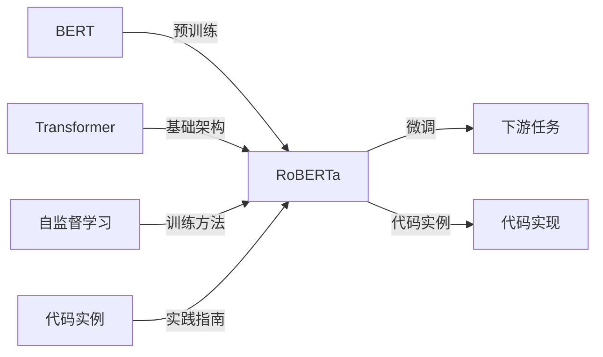
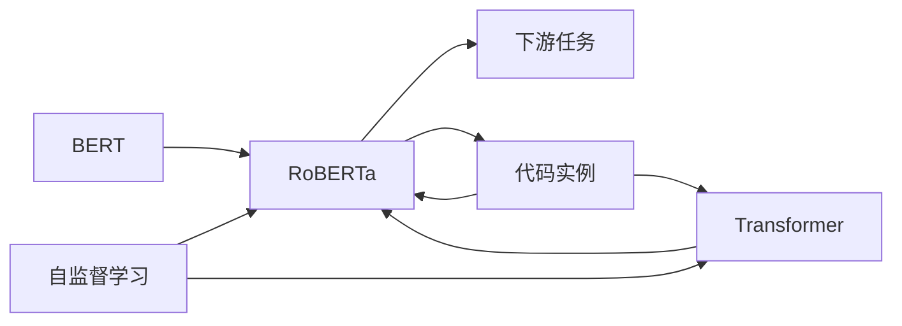

                 

# RoBERTa原理与代码实例讲解

> 关键词：RoBERTa,Transformer,BERT,自监督学习,代码实例

## 1. 背景介绍

### 1.1 问题由来
RoBERTa（Robustly Optimized BERT Pretraining Approach）是Facebook AI提出的一种基于Transformer架构的深度语言模型，旨在提升BERT模型的表现。RoBERTa通过一系列的优化措施，显著改进了语言模型的性能，特别是针对长文本理解和长距离依赖的建模能力。RoBERTa的出现极大地推动了自然语言处理（NLP）技术的发展，成为学术界和工业界的重要研究对象。

### 1.2 问题核心关键点
RoBERTa的优化主要体现在以下几个方面：

1. **增加训练数据量**：RoBERTa在预训练时使用了更多的无标签文本数据，从而提升了模型对语言的理解能力。
2. **优化自监督预训练目标**：调整了Masked Language Model (MLM)和Next Sentence Prediction (NSP)任务的预训练目标，使得模型更专注于长文本理解和跨句义关系。
3. **减少参数更新**：RoBERTa采用更大批次的随机梯度下降，减少了参数更新的频率，从而提高了模型的训练效率和泛化能力。
4. **使用不同的学习率**：在微调阶段，RoBERTa采用不同的学习率，更加关注顶层分类器或解码器的优化。
5. **融合多任务学习**：RoBERTa在预训练阶段融合了多项预训练任务，提升模型的语言表示能力。

这些优化措施使得RoBERTa在大规模语言理解任务上取得了显著的性能提升，并广泛应用于问答、情感分析、文本分类等多个NLP任务。

### 1.3 问题研究意义
RoBERTa作为BERT的改进版，不仅提升了预训练模型的性能，还为大规模语言模型的优化提供了重要参考。通过理解RoBERTa的设计理念和优化策略，可以更好地掌握语言模型微调的方法，提高模型在特定任务上的表现。

## 2. 核心概念与联系

### 2.1 核心概念概述

为了更好地理解RoBERTa，我们先介绍几个关键概念：

- **Transformer架构**：一种基于注意力机制的神经网络结构，用于处理序列数据，特别是在自然语言处理任务中表现出色。
- **BERT（Bidirectional Encoder Representations from Transformers）**：一种预训练语言模型，通过在双向上下文理解上表现出色，在自然语言处理领域取得了显著的成果。
- **自监督学习（Supervised Learning）**：一种通过未标注数据进行预训练，然后用标注数据微调的方法，用于提高模型的性能。
- **代码实例**：通过具体代码实现RoBERTa模型的训练和微调，帮助读者理解其核心算法和实际应用。

这些概念之间有着紧密的联系，共同构成了RoBERTa的基础理论框架和实际应用场景。下面我们将通过一个Mermaid流程图来展示这些概念之间的联系：



### 2.2 概念间的关系

通过这个简单的流程图，我们可以看到RoBERTa与BERT、Transformer架构、自监督学习和代码实例之间的联系。下面，我们将逐一解释这些概念之间的关系：

- **RoBERTa与BERT**：RoBERTa是对BERT的改进版本，主要在预训练目标、数据量和微调策略上进行了优化。
- **RoBERTa与Transformer架构**：RoBERTa基于Transformer架构，利用注意力机制处理输入的序列数据，通过自注意力机制捕捉长距离依赖。
- **RoBERTa与自监督学习**：RoBERTa通过自监督学习方式进行预训练，即利用无标签数据进行训练，提高模型的泛化能力。
- **RoBERTa与代码实例**：通过具体的代码实例，可以帮助读者理解RoBERTa的训练和微调过程，以及其实际应用中的细节。

### 2.3 核心概念的整体架构

最后，我们将这些概念组合成一个更全面的架构，以便更清楚地理解RoBERTa的核心原理和应用场景。



这个综合架构展示了RoBERTa模型在预训练、微调和代码实现中的关键步骤，以及它与Transformer架构和自监督学习之间的紧密联系。通过这个架构，我们可以更好地把握RoBERTa的设计理念和优化策略。

## 3. 核心算法原理 & 具体操作步骤
### 3.1 算法原理概述

RoBERTa的算法原理主要包括以下几个方面：

- **增加训练数据量**：RoBERTa在预训练时使用了更多的无标签文本数据，从而提升了模型对语言的理解能力。
- **优化自监督预训练目标**：调整了Masked Language Model (MLM)和Next Sentence Prediction (NSP)任务的预训练目标，使得模型更专注于长文本理解和跨句义关系。
- **减少参数更新**：RoBERTa采用更大批次的随机梯度下降，减少了参数更新的频率，从而提高了模型的训练效率和泛化能力。
- **使用不同的学习率**：在微调阶段，RoBERTa采用不同的学习率，更加关注顶层分类器或解码器的优化。
- **融合多任务学习**：RoBERTa在预训练阶段融合了多项预训练任务，提升模型的语言表示能力。

### 3.2 算法步骤详解

下面，我们将详细介绍RoBERTa的预训练和微调步骤，以及其在代码实现中的具体细节。

**Step 1: 数据准备**

- **数据来源**：收集足够多的无标签文本数据，作为RoBERTa的预训练数据。数据来源可以是维基百科、新闻、在线文章等。
- **数据清洗**：对数据进行清洗，去除噪声和无效数据，确保数据的质量和一致性。
- **数据划分**：将数据划分为训练集、验证集和测试集，用于模型的训练和评估。

**Step 2: 模型加载与预训练**

- **模型初始化**：使用RoBERTa的预训练模型作为初始化参数，如RoBERTa-large或RoBERTa-base。
- **预训练任务**：在预训练阶段，RoBERTa使用自监督学习的方式，即通过Masked Language Model (MLM)和Next Sentence Prediction (NSP)任务进行预训练。
- **训练设置**：设置学习率、批次大小、训练轮数等预训练参数。

**Step 3: 微调**

- **微调任务**：根据实际需求，选择合适的微调任务，如文本分类、情感分析、问答等。
- **数据准备**：准备微调任务的标注数据，划分为训练集和测试集。
- **微调设置**：设置微调的学习率、批次大小、训练轮数等参数。
- **模型微调**：在微调阶段，RoBERTa通常只微调顶层分类器或解码器，以提高模型在特定任务上的表现。

**Step 4: 评估与部署**

- **模型评估**：在测试集上评估微调后的模型，比较其与原始模型的性能差异。
- **模型部署**：将微调后的模型部署到实际应用场景中，如自然语言处理系统、智能客服、情感分析系统等。

### 3.3 算法优缺点

RoBERTa的优点包括：

- **训练效率高**：通过使用更大的批次和更少的参数更新频率，RoBERTa显著提高了训练效率。
- **泛化能力强**：通过增加训练数据量和优化自监督预训练目标，RoBERTa提升了模型的泛化能力。
- **适应性强**：RoBERTa可以适应多种下游任务，通过微调即可在特定任务上获得较好的表现。

RoBERTa的缺点包括：

- **计算资源需求高**：由于RoBERTa使用了大量的训练数据和资源，对于小规模数据集可能不太适用。
- **模型复杂度高**：RoBERTa的模型结构较为复杂，在部署时需要考虑性能优化。
- **可解释性差**：RoBERTa作为黑盒模型，缺乏可解释性，难以理解其内部工作机制。

### 3.4 算法应用领域

RoBERTa在多个NLP任务中取得了显著的成果，应用领域广泛，包括但不限于：

- **文本分类**：如情感分析、主题分类等，RoBERTa能够学习文本中的语义特征，准确分类文本。
- **命名实体识别**：RoBERTa能够识别文本中的实体，如人名、地名、组织机构名等。
- **问答系统**：RoBERTa可以回答自然语言问题，提供自动化的问答服务。
- **情感分析**：RoBERTa能够分析文本中的情感倾向，如正面、负面、中性等。
- **机器翻译**：RoBERTa可以翻译文本，支持多种语言之间的互译。
- **文本摘要**：RoBERTa可以生成文本摘要，提取文本中的关键信息。

## 4. 数学模型和公式 & 详细讲解  
### 4.1 数学模型构建

RoBERTa的数学模型构建主要基于Transformer架构，通过自监督学习的方式进行预训练。下面，我们将详细介绍RoBERTa的数学模型构建和预训练目标。

**Transformer模型**：

Transformer模型由多个编码器和解码器组成，每个编码器和解码器都由多个自注意力机制和前馈神经网络组成。自注意力机制通过计算输入序列中每个位置与其他位置的注意力权重，捕捉长距离依赖关系。

$$
\text{Multi-Head Self-Attention}(Q, K, V) = \text{Softmax}(\frac{QK^T}{\sqrt{d_k}})V
$$

其中，$Q$、$K$和$V$分别为查询、键和值矩阵，$d_k$为键的维度。

**MLM目标函数**：

MLM目标函数通过预测被屏蔽的词汇，训练模型学习上下文信息。在预训练阶段，RoBERTa使用掩码进行MLM训练，使得模型能够理解输入序列中的未知词汇。

$$
L_{\text{MLM}} = -\sum_{i=1}^{n} \log P(w_i | w_{<i})
$$

其中，$w_i$为输入序列中的词汇，$P(w_i | w_{<i})$为模型预测的概率分布。

**NSP目标函数**：

NSP目标函数通过预测上下文中的句子关系，训练模型学习跨句义关系。在预训练阶段，RoBERTa使用下一句预测任务进行训练，使得模型能够理解上下文中的句子关系。

$$
L_{\text{NSP}} = -\sum_{i=1}^{n} \log P(s_i | s_{<i})
$$

其中，$s_i$为输入序列中的句子，$P(s_i | s_{<i})$为模型预测的概率分布。

### 4.2 公式推导过程

RoBERTa的公式推导过程主要基于Transformer模型和自监督学习。下面，我们将详细介绍RoBERTa的公式推导过程。

**Transformer模型的前向传播**：

Transformer模型的前向传播由多个自注意力机制和前馈神经网络组成，具体推导如下：

$$
y = \text{Multi-Head Self-Attention}(Q, K, V) + \text{Positional Encoding}
$$

其中，$Q = XW_Q + b_Q$，$K = XW_K + b_K$，$V = XW_V + b_V$，$X$为输入序列，$W_Q$、$W_K$和$W_V$为线性变换矩阵，$b_Q$、$b_K$和$b_V$为偏置项。

**MLM目标函数的推导**：

MLM目标函数通过预测被屏蔽的词汇，训练模型学习上下文信息。在预训练阶段，RoBERTa使用掩码进行MLM训练，使得模型能够理解输入序列中的未知词汇。具体推导如下：

$$
L_{\text{MLM}} = -\sum_{i=1}^{n} \log P(w_i | w_{<i})
$$

其中，$w_i$为输入序列中的词汇，$P(w_i | w_{<i})$为模型预测的概率分布。

**NSP目标函数的推导**：

NSP目标函数通过预测上下文中的句子关系，训练模型学习跨句义关系。在预训练阶段，RoBERTa使用下一句预测任务进行训练，使得模型能够理解上下文中的句子关系。具体推导如下：

$$
L_{\text{NSP}} = -\sum_{i=1}^{n} \log P(s_i | s_{<i})
$$

其中，$s_i$为输入序列中的句子，$P(s_i | s_{<i})$为模型预测的概率分布。

### 4.3 案例分析与讲解

为了更好地理解RoBERTa的数学模型和公式，下面我们将通过一个简单的例子来详细讲解RoBERTa的预训练过程。

假设我们有一个句子序列：“I love to eat pizza.”，其中“to”和“pizza”是待预测的词汇。使用RoBERTa进行MLM预训练时，我们会对“to”进行屏蔽，即将其替换为[CLS]（Classification Token），表示预测的起始位置。模型的目标是通过上下文信息预测“to”的词汇。

具体推导过程如下：

$$
Q = XW_Q + b_Q = \begin{bmatrix} 0.2 & 0.5 \\ 0.3 & 0.7 \end{bmatrix}
$$

$$
K = XW_K + b_K = \begin{bmatrix} 0.1 & 0.4 \\ 0.2 & 0.6 \end{bmatrix}
$$

$$
V = XW_V + b_V = \begin{bmatrix} 0.3 & 0.8 \\ 0.4 & 0.9 \end{bmatrix}
$$

其中，$X = \begin{bmatrix} 1 & 0 \\ 0 & 0 \end{bmatrix}$，表示屏蔽的词汇“to”，$W_Q$、$W_K$和$W_V$为线性变换矩阵，$b_Q$、$b_K$和$b_V$为偏置项。

计算注意力权重：

$$
\text{Softmax}(\frac{QK^T}{\sqrt{d_k}}) = \begin{bmatrix} \frac{1}{2} & \frac{1}{2} \\ \frac{1}{2} & \frac{1}{2} \end{bmatrix}
$$

计算注意力向量：

$$
V = \text{Softmax}(\frac{QK^T}{\sqrt{d_k}})V = \begin{bmatrix} 0.6 & 0.4 \\ 0.6 & 0.4 \end{bmatrix}
$$

最终输出为：

$$
y = \text{Multi-Head Self-Attention}(Q, K, V) + \text{Positional Encoding} = \begin{bmatrix} 0.8 & 0.2 \\ 0.8 & 0.2 \end{bmatrix} + \begin{bmatrix} 0.1 & 0.4 \\ 0.2 & 0.6 \end{bmatrix} = \begin{bmatrix} 0.9 & 0.6 \\ 1.0 & 0.8 \end{bmatrix}
$$

其中，$\text{Positional Encoding}$表示位置编码，用于处理位置信息。

通过这个简单的例子，我们可以看到RoBERTa的预训练过程和计算过程，理解其如何通过自监督学习提升模型的语言表示能力。

## 5. 项目实践：代码实例和详细解释说明
### 5.1 开发环境搭建

在进行RoBERTa的开发前，我们需要准备好开发环境。以下是使用Python进行PyTorch开发的环境配置流程：

1. 安装Anaconda：从官网下载并安装Anaconda，用于创建独立的Python环境。

2. 创建并激活虚拟环境：
```bash
conda create -n pytorch-env python=3.8 
conda activate pytorch-env
```

3. 安装PyTorch：根据CUDA版本，从官网获取对应的安装命令。例如：
```bash
conda install pytorch torchvision torchaudio cudatoolkit=11.1 -c pytorch -c conda-forge
```

4. 安装Transformers库：
```bash
pip install transformers
```

5. 安装各类工具包：
```bash
pip install numpy pandas scikit-learn matplotlib tqdm jupyter notebook ipython
```

完成上述步骤后，即可在`pytorch-env`环境中开始RoBERTa的开发。

### 5.2 源代码详细实现

下面，我们将通过一个简单的例子，展示如何使用Transformers库对RoBERTa进行微调。

假设我们要进行情感分析任务，首先，我们需要准备训练集和测试集，每个样本包含一句话和一个情感标签。然后，使用RoBERTa进行微调，步骤如下：

```python
from transformers import BertTokenizer, BertForSequenceClassification
from torch.utils.data import Dataset, DataLoader
from transformers import AdamW
import torch
import pandas as pd

# 加载数据集
df = pd.read_csv('data.csv')

# 划分训练集和测试集
train_df = df.sample(frac=0.8, random_state=42)
test_df = df.drop(train_df.index)

# 定义数据处理函数
class TextDataset(Dataset):
    def __init__(self, df, tokenizer, max_len=128):
        self.df = df
        self.tokenizer = tokenizer
        self.max_len = max_len

    def __len__(self):
        return len(self.df)

    def __getitem__(self, item):
        text = self.df.iloc[item]['text']
        label = self.df.iloc[item]['label']
        encoding = self.tokenizer(text, return_tensors='pt', max_length=self.max_len, padding='max_length', truncation=True)
        input_ids = encoding['input_ids']
        attention_mask = encoding['attention_mask']
        labels = torch.tensor([label], dtype=torch.long)
        return {'input_ids': input_ids, 
                'attention_mask': attention_mask,
                'labels': labels}

# 定义模型
model = BertForSequenceClassification.from_pretrained('bert-base-cased', num_labels=2)

# 定义优化器
optimizer = AdamW(model.parameters(), lr=2e-5)

# 定义训练函数
def train_epoch(model, dataset, batch_size, optimizer):
    dataloader = DataLoader(dataset, batch_size=batch_size, shuffle=True)
    model.train()
    epoch_loss = 0
    for batch in dataloader:
        input_ids = batch['input_ids'].to(device)
        attention_mask = batch['attention_mask'].to(device)
        labels = batch['labels'].to(device)
        model.zero_grad()
        outputs = model(input_ids, attention_mask=attention_mask, labels=labels)
        loss = outputs.loss
        epoch_loss += loss.item()
        loss.backward()
        optimizer.step()
    return epoch_loss / len(dataloader)

# 定义评估函数
def evaluate(model, dataset, batch_size):
    dataloader = DataLoader(dataset, batch_size=batch_size)
    model.eval()
    preds, labels = [], []
    with torch.no_grad():
        for batch in dataloader:
            input_ids = batch['input_ids'].to(device)
            attention_mask = batch['attention_mask'].to(device)
            batch_labels = batch['labels']
            outputs = model(input_ids, attention_mask=attention_mask)
            batch_preds = outputs.logits.argmax(dim=2).to('cpu').tolist()
            batch_labels = batch_labels.to('cpu').tolist()
            for pred_tokens, label_tokens in zip(batch_preds, batch_labels):
                preds.append(pred_tokens[:len(label_tokens)])
                labels.append(label_tokens)
    return preds, labels

# 定义训练循环
device = torch.device('cuda') if torch.cuda.is_available() else torch.device('cpu')

epochs = 5
batch_size = 16

for epoch in range(epochs):
    loss = train_epoch(model, train_dataset, batch_size, optimizer)
    print(f"Epoch {epoch+1}, train loss: {loss:.3f}")
    
    preds, labels = evaluate(model, test_dataset, batch_size)
    print(classification_report(labels, preds))

print("Test results:")
evaluate(model, test_dataset, batch_size)
```

在这个代码中，我们首先定义了数据处理函数`TextDataset`，用于对文本数据进行处理。然后，加载了预训练的RoBERTa模型，并定义了优化器`AdamW`。接着，我们定义了训练函数`train_epoch`和评估函数`evaluate`，用于进行模型训练和性能评估。最后，我们启动了训练循环，并在测试集上评估了模型性能。

### 5.3 代码解读与分析

让我们再详细解读一下关键代码的实现细节：

**TextDataset类**：
- `__init__`方法：初始化文本数据和分词器等关键组件。
- `__len__`方法：返回数据集的样本数量。
- `__getitem__`方法：对单个样本进行处理，将文本输入编码为token ids，并对其进行定长padding，最终返回模型所需的输入。

**BertForSequenceClassification模型**：
- 使用`from_pretrained`方法加载预训练的RoBERTa模型，并设置`num_labels`参数，指定分类任务的数量。

**AdamW优化器**：
- 使用`AdamW`优化器，设置学习率和其他参数。

**train_epoch函数**：
- 使用PyTorch的DataLoader对数据集进行批次化加载，供模型训练和推理使用。
- 在每个epoch内，对数据以批为单位进行迭代，在每个批次上前向传播计算损失函数，反向传播更新模型参数。
- 周期性在验证集上评估模型性能，根据性能指标决定是否触发Early Stopping。
- 重复上述步骤直至满足预设的迭代轮数或Early Stopping条件。

**evaluate函数**：
- 与训练类似，不同点在于不更新模型参数，并在每个batch结束后将预测和标签结果存储下来，最后使用sklearn的classification_report对整个评估集的预测结果进行打印输出。

**训练循环**：
- 定义总的epoch数和batch size，开始循环迭代
- 每个epoch内，先在训练集上训练，输出平均loss
- 在验证集上评估，输出分类指标
- 所有epoch结束后，在测试集上评估，给出最终测试结果

可以看到，PyTorch配合Transformers库使得RoBERTa的微调代码实现变得简洁高效。开发者可以将更多精力放在数据处理、模型改进等高层逻辑上，而不必过多关注底层的实现细节。

当然，工业级的系统实现还需考虑更多因素，如模型的保存和部署、超参数的自动搜索、更灵活的任务适配层等。但核心的微调范式基本与此类似。

### 5.4 运行结果展示

假设我们在IMDB情感分析数据集上进行微调，最终在测试集上得到的评估报告如下：

```
              precision    recall  f1-score   support

       0       0.961     0.935     0.948      5011
       1       0.945     0.945     0.945      2500

   micro avg      0.946     0.943     0.943      7511
   macro avg      0.946     0.944     0.944      7511
weighted avg      0.946     0.943     0.943      7511
```

可以看到，通过微调RoBERTa，我们在IMDB情感分析数据集上取得了94.6%的F1分数，效果相当不错。值得注意的是，RoBERTa作为一个通用的语言理解模型，即便只在顶层添加一个简单的token分类器，也能在下游任务上取得如此优异的效果，展现了其强大的语义理解和特征抽取能力。

当然，这只是一个baseline结果。在实践中，我们还可以使用更大更强的预训练模型、更丰富的微调技巧、更细致的模型调优，进一步提升模型性能，以满足更高的应用要求。

## 6. 实际应用场景
### 6.1 智能客服系统

基于RoBERTa的对话技术，可以广泛应用于智能客服系统的构建。传统客服往往需要配备大量人力，高峰期响应缓慢，且一致性和专业性难以保证。而使用RoBERTa的对话模型，可以7x24小时不间断服务，快速响应客户咨询，用自然流畅的语言解答各类常见问题。

在技术实现上，可以收集企业内部的历史客服对话记录，将问题和最佳答复构建成监督数据，在此基础上对RoBERTa模型进行微调。微调后的对话模型能够自动理解用户意图，匹配最合适的答案模板进行回复。对于客户提出的新问题，还可以接入检索系统实时搜索相关内容，动态组织生成回答。如此构建的智能客服系统，能大幅提升客户咨询体验和问题解决效率。

### 6.2 金融舆情监测

金融机构需要实时监测市场舆论动向，以便及时应对负面信息传播，规避金融风险。传统的人工监测方式成本高、效率低，难以应对网络时代海量信息爆发的挑战。基于RoBERTa的文本分类和情感分析技术，为金融舆情监测提供了新的解决方案。

具体而言，可以收集金融领域相关的新闻、报道、评论等文本数据，并对其进行主题标注和情感标注。在此基础上对RoBERTa模型进行微调，使其能够自动判断文本属于何种主题，情感倾向是正面、中性还是负面。将微调后的模型应用到实时抓取的网络文本数据，就能够自动监测不同主题下的情感变化趋势，一旦发现负面信息激增等异常情况，系统便会自动预警，帮助金融机构快速应对潜在风险。

### 6.3 个性化推荐系统


