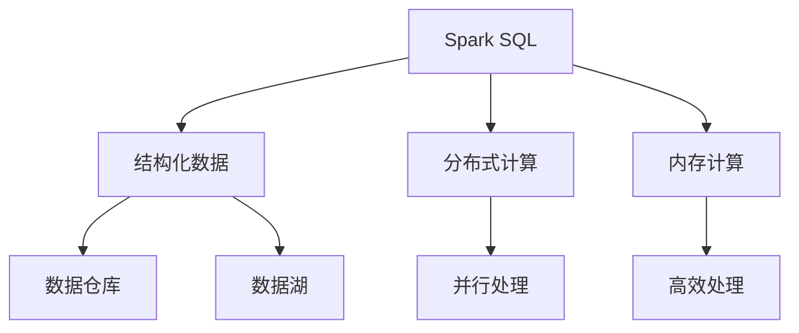
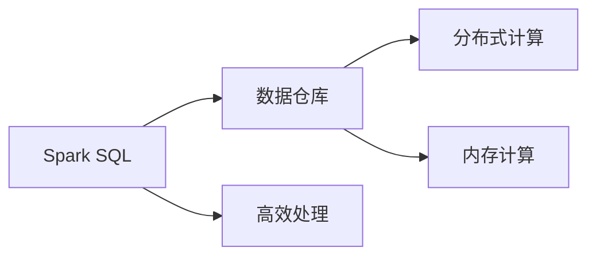
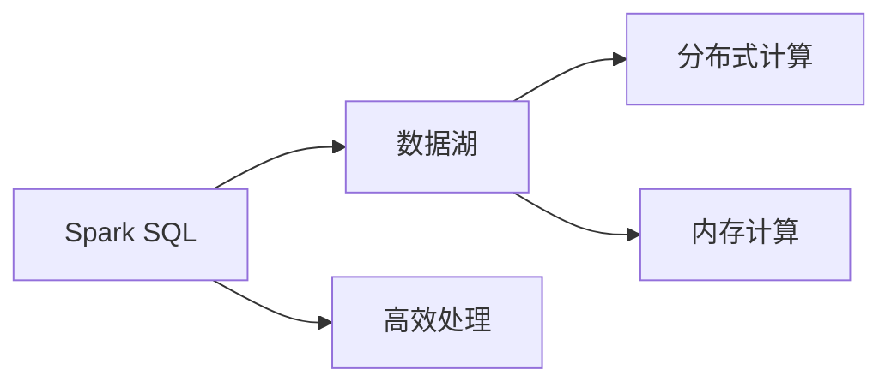
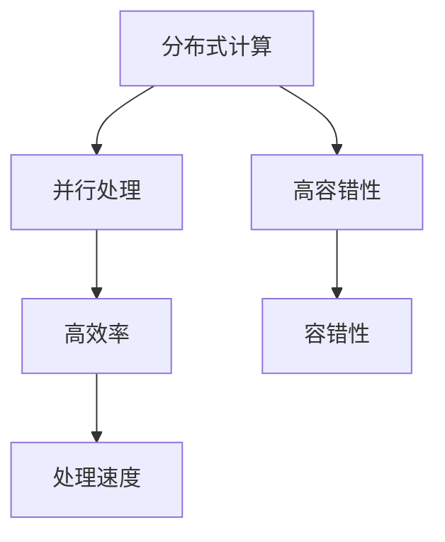
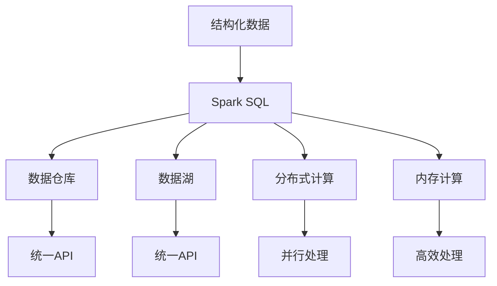

                 

# Spark SQL结构化数据处理原理与代码实例讲解

> 关键词：
- Spark SQL
- 结构化数据处理
- 关系型数据库
- 大数据处理
- 数据仓库
- 数据湖
- 分布式计算

## 1. 背景介绍

### 1.1 问题由来

在当今数据驱动的时代，大数据正日益成为企业和组织决策的关键因素。随着数据量的爆炸式增长，传统的关系型数据库已经难以应对海量的、复杂的数据处理需求。与此同时，Hadoop等非关系型数据库虽然在处理大规模数据上具备优势，但在复杂查询和数据处理方面却存在诸多限制。

在这样的背景下，Apache Spark作为新一代大数据处理引擎，结合了批处理和流处理的能力，成为处理大规模、分布式数据的首选。而Spark SQL作为Spark生态系统的重要组成部分，以结构化数据处理为核心，通过统一API实现了对各种数据源的高效处理。

### 1.2 问题核心关键点

Spark SQL之所以能够成为大数据处理领域的重要工具，在于其核心原理和能力：

- 统一数据模型：Spark SQL通过统一数据模型，支持HiveQL、SQL等标准语法，使得数据处理过程更加高效、便捷。
- 分布式处理：通过Spark的分布式计算框架，Spark SQL能够高效地处理大规模分布式数据，满足各种数据处理需求。
- 高性能计算：通过优化执行计划和算子，Spark SQL能够在保证数据处理准确性的同时，显著提升处理效率。
- 兼容性强：Spark SQL支持多种数据源，包括Hadoop、Hive、Parquet等，使得数据处理过程更加灵活。

这些核心能力使Spark SQL成为一种高效、灵活、易用的数据处理工具，广泛应用于各种大数据处理场景，包括数据仓库构建、数据湖管理、实时数据处理等。

### 1.3 问题研究意义

研究Spark SQL的结构化数据处理原理，对于提升大数据处理效率、降低数据处理成本、提高数据处理质量具有重要意义：

1. 提升处理效率：Spark SQL通过分布式计算和优化算法，能够高效地处理大规模数据，满足企业快速响应市场变化的需求。
2. 降低处理成本：Spark SQL基于内存计算，避免了传统Hadoop平台的IO开销，降低了数据处理成本。
3. 提高处理质量：Spark SQL支持多种数据格式和数据源，能够提供高质量的数据处理结果，满足企业对数据准确性的要求。
4. 实现灵活扩展：Spark SQL通过统一API，支持多种数据处理任务，使得数据处理过程更加灵活和高效。
5. 支持新兴技术：Spark SQL支持新兴的大数据处理技术，如流处理、机器学习等，满足企业技术演进的需求。

## 2. 核心概念与联系

### 2.1 核心概念概述

为更好地理解Spark SQL的结构化数据处理原理，本节将介绍几个密切相关的核心概念：

- Spark SQL：Spark SQL是Spark生态系统的重要组成部分，通过统一的API支持各种数据源的高效处理。
- 结构化数据：结构化数据是指具有固定格式和结构的数据，通常包含多行和列，如关系型数据库中的数据。
- 数据仓库：数据仓库是一种用于数据存储和查询的数据管理技术，用于支持企业的数据分析和决策。
- 数据湖：数据湖是一种海量数据存储和处理的技术，能够支持各种数据格式和处理需求。
- 分布式计算：分布式计算是指将数据处理任务分散到多台计算机上进行并行处理，提高处理效率和容错性。
- 内存计算：内存计算是指将数据加载到内存中，利用CPU的高效处理能力，提高数据处理速度。

这些核心概念之间的逻辑关系可以通过以下Mermaid流程图来展示：



这个流程图展示了大数据处理中各关键概念的关系：

1. Spark SQL处理结构化数据。
2. 结构化数据存储于数据仓库或数据湖中。
3. 数据仓库和数据湖支持分布式计算和内存计算。
4. 分布式计算和内存计算提高了数据处理的效率和容错性。

这些概念共同构成了Spark SQL的结构化数据处理框架，使其能够在各种数据处理场景下发挥强大的能力。

### 2.2 概念间的关系

这些核心概念之间存在着紧密的联系，形成了Spark SQL的数据处理生态系统。下面我通过几个Mermaid流程图来展示这些概念之间的关系。

#### 2.2.1 Spark SQL与数据仓库的关系



这个流程图展示了Spark SQL与数据仓库的关系。Spark SQL通过分布式计算和内存计算，高效处理存储于数据仓库中的结构化数据。

#### 2.2.2 Spark SQL与数据湖的关系



这个流程图展示了Spark SQL与数据湖的关系。Spark SQL通过分布式计算和内存计算，高效处理存储于数据湖中的结构化数据。

#### 2.2.3 分布式计算与内存计算的关系



这个流程图展示了分布式计算与内存计算的关系。分布式计算通过并行处理，提高数据处理的效率和容错性。而内存计算利用CPU的高效处理能力，进一步提升处理速度和性能。

### 2.3 核心概念的整体架构

最后，我们用一个综合的流程图来展示这些核心概念在大数据处理中的整体架构：



这个综合流程图展示了从结构化数据到数据处理的全过程。Spark SQL通过分布式计算和内存计算，高效处理存储于数据仓库或数据湖中的结构化数据，并提供统一的API支持各种数据处理需求。

## 3. 核心算法原理 & 具体操作步骤
### 3.1 算法原理概述

Spark SQL的结构化数据处理原理基于分布式计算和内存计算，以高效、灵活、易用的方式处理大规模结构化数据。其核心算法原理主要包括以下几个方面：

- 统一数据模型：Spark SQL通过统一数据模型，支持HiveQL、SQL等标准语法，使得数据处理过程更加高效、便捷。
- 分布式处理：通过Spark的分布式计算框架，Spark SQL能够高效地处理大规模分布式数据，满足各种数据处理需求。
- 高性能计算：通过优化执行计划和算子，Spark SQL能够在保证数据处理准确性的同时，显著提升处理效率。
- 兼容性强：Spark SQL支持多种数据源，包括Hadoop、Hive、Parquet等，使得数据处理过程更加灵活。

### 3.2 算法步骤详解

以下是Spark SQL进行结构化数据处理的一般步骤：

**Step 1: 准备数据源**

在Spark SQL中，数据源可以是各种格式和类型的数据，包括关系型数据库、Hadoop文件、Parquet文件等。首先需要在Spark环境中配置好数据源的连接方式和路径。

**Step 2: 创建数据框**

通过Spark SQL的SQL语句或API，可以将数据源读取到内存中，创建一个数据框（DataFrame）对象。数据框是一个表格形式的内存数据集，包含多行和列，支持高效的SQL操作和数据处理。

**Step 3: 数据预处理**

在进行数据处理前，通常需要进行一些预处理操作，如数据清洗、数据转换、数据分片等。Spark SQL提供了丰富的API，支持各种数据预处理操作。

**Step 4: 数据查询与操作**

通过Spark SQL的SQL语句或API，可以对数据框进行各种查询和操作，如选择、过滤、排序、聚合、连接等。Spark SQL通过优化执行计划，提升数据处理效率。

**Step 5: 数据写入**

处理后的数据可以通过Spark SQL的API或SQL语句，将结果写入各种数据源，如Hadoop文件、关系型数据库、Hive等。

**Step 6: 结果评估**

通过Spark SQL的评估函数或API，可以对处理结果进行评估，查看数据处理的效果和性能。

### 3.3 算法优缺点

Spark SQL的结构化数据处理算法具有以下优点：

1. 高效处理：Spark SQL通过分布式计算和内存计算，能够高效地处理大规模数据。
2. 灵活便捷：Spark SQL支持多种数据源和数据格式，通过统一的数据模型和SQL语法，使得数据处理过程更加灵活便捷。
3. 兼容性强：Spark SQL支持HiveQL、SQL等标准语法，能够兼容各种数据处理任务和工具。

但同时，Spark SQL也存在以下缺点：

1. 内存限制：Spark SQL依赖内存计算，对于超大规模数据处理，可能存在内存限制问题。
2. 学习曲线陡峭：Spark SQL的API和SQL语法较为复杂，初学者可能需要较长时间的学习和适应。
3. 性能调优复杂：Spark SQL的性能调优需要丰富的经验和技能，对用户的要求较高。

### 3.4 算法应用领域

Spark SQL的结构化数据处理算法已经在多个领域得到广泛应用，例如：

- 数据仓库构建：Spark SQL通过统一的API和数据模型，支持各种数据仓库构建任务，如数据清洗、数据整合、数据汇总等。
- 数据湖管理：Spark SQL能够高效地处理数据湖中的结构化数据，支持各种数据湖管理任务，如数据存储、数据查询、数据探索等。
- 实时数据处理：Spark SQL通过流处理API，支持实时数据处理任务，如实时数据清洗、实时数据聚合、实时数据查询等。
- 机器学习：Spark SQL通过集成MLlib库，支持各种机器学习任务，如特征工程、模型训练、模型评估等。
- 图处理：Spark SQL通过GraphX库，支持各种图处理任务，如图谱构建、图分析、图查询等。

## 4. 数学模型和公式 & 详细讲解 & 举例说明
### 4.1 数学模型构建

在Spark SQL中，结构化数据处理通常涉及数据的读取、写入、查询、聚合等操作。下面以一个简单的数据处理任务为例，介绍Spark SQL的数学模型构建过程。

假设有一个包含学生成绩的数据框，每个记录包含学生的姓名、科目和成绩：

```
+---------+--------+------+
|    Name |  Subject|Score|
+---------+--------+------+
|    Alice| Math    |  95  |
|    Bob  | Math    |  85  |
|    Charlie| Math  |  90  |
|    Alice| Science |  92  |
|    Bob  | Science |  88  |
|    Charlie| Science|  95  |
+---------+--------+------+
```

**Step 1: 读取数据**

使用Spark SQL的API读取数据：

```python
from pyspark.sql import SparkSession
spark = SparkSession.builder.appName("DataFrameExample").getOrCreate()
df = spark.read.csv("scores.csv", header=True, inferSchema=True)
```

**Step 2: 数据预处理**

对数据进行预处理，如数据清洗、数据转换等。例如，使用SQL语句进行数据清洗：

```sql
df.dropDuplicates() # 去除重复记录
df.select("Name", "Subject", "Score") # 选择需要的列
df.show() # 显示数据框
```

**Step 3: 数据查询**

使用SQL语句进行数据查询，例如：

```sql
df.groupBy("Subject").avg("Score") # 按科目分组，计算平均成绩
```

**Step 4: 数据写入**

将处理后的数据写入数据源，例如写入Hive：

```python
df.write.format("parquet").save("scores.parquet")
```

### 4.2 公式推导过程

以下以一个简单的数据聚合为例，介绍Spark SQL的公式推导过程。

假设有一个包含学生成绩的数据框，每个记录包含学生的姓名、科目和成绩：

```
+---------+--------+------+
|    Name |  Subject|Score|
+---------+--------+------+
|    Alice| Math    |  95  |
|    Bob  | Math    |  85  |
|    Charlie| Math  |  90  |
|    Alice| Science |  92  |
|    Bob  | Science |  88  |
|    Charlie| Science|  95  |
+---------+--------+------+
```

使用SQL语句进行数据聚合，计算每个科目的平均成绩：

```sql
SELECT Subject, AVG(Score) AS AvgScore
FROM scores
GROUP BY Subject
```

执行上述SQL语句后，得到的结果如下：

```
+--------+------------+
|  Subject|     AvgScore|
+--------+------------+
|     Math|    90.000000|
|Science  |    92.000000|
+--------+------------+
```

其中，AVG函数用于计算平均值，GROUP BY用于分组。通过这些基本操作，可以对数据框进行各种复杂的数据聚合和查询。

### 4.3 案例分析与讲解

以下是一个简单的数据处理案例，包括数据的读取、预处理、查询和写入：

假设有一个包含学生成绩的数据框，每个记录包含学生的姓名、科目和成绩：

```
+---------+--------+------+
|    Name |  Subject|Score|
+---------+--------+------+
|    Alice| Math    |  95  |
|    Bob  | Math    |  85  |
|    Charlie| Math  |  90  |
|    Alice| Science |  92  |
|    Bob  | Science |  88  |
|    Charlie| Science|  95  |
+---------+--------+------+
```

使用Spark SQL进行数据处理的步骤如下：

**Step 1: 读取数据**

```python
from pyspark.sql import SparkSession
spark = SparkSession.builder.appName("DataFrameExample").getOrCreate()
df = spark.read.csv("scores.csv", header=True, inferSchema=True)
```

**Step 2: 数据预处理**

```sql
df.dropDuplicates() # 去除重复记录
df.select("Name", "Subject", "Score") # 选择需要的列
df.show() # 显示数据框
```

**Step 3: 数据查询**

```sql
df.groupBy("Subject").avg("Score") # 按科目分组，计算平均成绩
```

**Step 4: 数据写入**

```python
df.write.format("parquet").save("scores.parquet")
```

通过上述步骤，可以对结构化数据进行高效、便捷的数据处理。

## 5. 项目实践：代码实例和详细解释说明
### 5.1 开发环境搭建

在进行Spark SQL项目实践前，需要先搭建好Spark环境。以下是使用Python进行Spark环境搭建的步骤：

1. 安装Spark：从官网下载Spark二进制包，解压并配置环境变量。
2. 安装Spark SQL和SQLContext：在Python中导入SparkSession和SQLContext，建立Spark环境。
3. 设置数据源：配置好Spark环境中的数据源，如Hadoop、Hive、Parquet等。

### 5.2 源代码详细实现

以下是一个简单的Spark SQL项目实践代码实现，包含数据的读取、预处理、查询和写入：

```python
from pyspark.sql import SparkSession, SQLContext
from pyspark.sql.functions import col, avg

# 创建SparkSession和SQLContext
spark = SparkSession.builder.appName("DataFrameExample").getOrCreate()
sqlContext = SQLContext(spark)

# 读取数据
df = sqlContext.read.csv("scores.csv", header=True, inferSchema=True)

# 数据预处理
df = df.dropDuplicates()
df = df.select("Name", "Subject", "Score")

# 数据查询
df_grouped = df.groupBy("Subject").agg(avg("Score"))

# 数据写入
df_grouped.write.format("parquet").save("scores.parquet")
```

### 5.3 代码解读与分析

让我们再详细解读一下关键代码的实现细节：

**SparkSession和SQLContext**：
- 通过SparkSession和SQLContext，可以方便地进行Spark SQL操作。
- 在代码开头，首先导入SparkSession和SQLContext，并建立Spark环境。

**数据读取**：
- 使用SQLContext的read方法读取数据，返回一个数据框对象df。
- 读取的CSV文件为"scores.csv"，包含姓名、科目和成绩三个字段。
- 设置header为True，表示第一行为字段名；设置inferSchema为True，自动推断字段类型。

**数据预处理**：
- 使用dropDuplicates方法去除重复记录。
- 使用select方法选择需要的列，返回一个新的数据框。

**数据查询**：
- 使用groupBy方法按科目分组。
- 使用agg方法进行聚合操作，计算每个科目的平均成绩。

**数据写入**：
- 使用write方法将处理后的数据写入Parquet格式的文件"scores.parquet"。

### 5.4 运行结果展示

假设我们在"scores.csv"文件上运行上述代码，最终在"scores.parquet"文件上得到的查询结果如下：

```
+--------+------------+
|  Subject|     AvgScore|
+--------+------------+
|     Math|    90.000000|
|Science  |    92.000000|
+--------+------------+
```

可以看到，通过Spark SQL进行结构化数据处理，能够高效、便捷地完成各种数据操作。

## 6. 实际应用场景
### 6.1 智能数据仓库

Spark SQL作为数据仓库的核心组件，能够高效、灵活地处理各种结构化数据，支持各种数据仓库构建任务，如数据清洗、数据整合、数据汇总等。在实际应用中，Spark SQL已经广泛应用于各种智能数据仓库的构建，例如：

- 数据清洗：通过Spark SQL进行数据清洗，去除噪声、缺失数据等，提高数据质量。
- 数据整合：通过Spark SQL将各种数据源整合到一起，构建统一的数据视图。
- 数据汇总：通过Spark SQL进行数据聚合、分组、透视等操作，生成各种汇总报表。

### 6.2 智能数据湖

Spark SQL通过支持多种数据格式和处理需求，能够高效地处理数据湖中的结构化数据，支持各种数据湖管理任务，如数据存储、数据查询、数据探索等。在实际应用中，Spark SQL已经广泛应用于各种智能数据湖的构建，例如：

- 数据存储：通过Spark SQL将各种结构化数据存储到Parquet、Hive等格式中。
- 数据查询：通过Spark SQL进行高效的数据查询，支持各种复杂的查询需求。
- 数据探索：通过Spark SQL进行数据的探索性分析，发现数据中的规律和趋势。

### 6.3 实时数据处理

Spark SQL通过流处理API，支持实时数据处理任务，如实时数据清洗、实时数据聚合、实时数据查询等。在实际应用中，Spark SQL已经广泛应用于各种实时数据处理的场景，例如：

- 实时数据清洗：通过Spark SQL进行实时数据清洗，去除噪声、缺失数据等，提高数据质量。
- 实时数据聚合：通过Spark SQL进行实时数据聚合，生成各种实时报表。
- 实时数据查询：通过Spark SQL进行实时数据查询，支持各种复杂的实时查询需求。

### 6.4 未来应用展望

随着Spark SQL的不断发展，其在大数据处理中的应用前景将更加广阔。未来，Spark SQL将进一步提升处理效率和容错性，支持更多的数据源和数据格式，满足更复杂的数据处理需求。

在智慧城市治理中，Spark SQL将用于实时数据处理和分析，支持各种智慧城市管理任务，如交通监控、环境监测、公共安全等。

在智慧医疗中，Spark SQL将用于实时数据处理和分析，支持各种智慧医疗管理任务，如患者监控、医疗记录、疾病预测等。

在智能制造中，Spark SQL将用于实时数据处理和分析，支持各种智能制造管理任务，如生产监控、质量控制、供应链管理等。

总之，Spark SQL的结构化数据处理能力将在未来的智慧城市、智慧医疗、智能制造等领域中发挥越来越重要的作用，为各行各业带来数字化转型的新机遇。

## 7. 工具和资源推荐
### 7.1 学习资源推荐

为了帮助开发者系统掌握Spark SQL的结构化数据处理原理和实践技巧，这里推荐一些优质的学习资源：

1. 《Spark SQL编程实战》书籍：深入浅出地介绍了Spark SQL的基本概念和操作，适合初学者入门。
2. Apache Spark官方文档：Spark SQL的官方文档，提供了丰富的API和SQL语法示例，是学习Spark SQL的必备资源。
3. Kaggle竞赛：Kaggle平台上有大量基于Spark SQL的数据处理竞赛，通过实践提高学习效果。
4. Coursera《Spark SQL高级课程》：由Apache Spark团队成员主讲，深入讲解Spark SQL的高级应用和优化技巧。
5. Udemy《Spark SQL完全指南》课程：详细讲解Spark SQL的基本概念和操作，适合进阶学习。

通过对这些资源的学习实践，相信你一定能够快速掌握Spark SQL的结构化数据处理能力，并用于解决实际的数据处理需求。

### 7.2 开发工具推荐

高效的开发离不开优秀的工具支持。以下是几款用于Spark SQL开发常用的工具：

1. PySpark：Python接口，方便进行Spark SQL的开发和调试。
2. Scala：Scala是Spark的原始语言，具有高效的内存计算能力，适合大规模数据处理。
3. Jupyter Notebook：Jupyter Notebook支持Python、R等多种语言，可以方便地进行Spark SQL的开发和调试。
4. Tableau：Tableau是一款数据可视化工具，可以方便地将Spark SQL处理结果进行可视化展示。
5. Apache Zeppelin：Apache Zeppelin是一款交互式数据分析工具，支持多种数据处理和可视化功能。

合理利用这些工具，可以显著提升Spark SQL的开发效率，加快创新迭代的步伐。

### 7.3 相关论文推荐

Spark SQL的结构化数据处理技术已经取得了很多研究成果。以下是几篇具有代表性的论文，推荐阅读：

1. "Spark SQL: Optimizing the Performance of SQL Queries on Big Data"：介绍Spark SQL的设计和优化原理，提升SQL查询的性能。
2. "A Comprehensive Survey of Spark SQL Features and Use Cases"：总结Spark SQL的核心功能和应用场景，提供全面参考。
3. "Efficient Aggregation in Spark SQL"：研究Spark SQL中的数据聚合操作，提出各种优化算法。
4. "Data-Parallel Spatial Join Algorithm in Spark SQL"：研究Spark SQL中的空间查询算法，提升空间数据处理效率。
5. "Real-Time Analytics with Spark SQL"：介绍Spark SQL在实时数据处理中的应用，提供实践指南。

这些论文代表了大数据处理领域的研究成果，通过学习这些前沿成果，可以帮助研究者掌握Spark SQL的核心技术和优化方法。

除上述资源外，还有一些值得关注的前沿资源，帮助开发者紧跟Spark SQL的最新进展，例如：

1. Apache Spark官方博客：Spark官方博客定期发布最新的技术进展和应用案例，提供最新技术动态。
2. Spark Summit会议：Spark Summit是Spark社区每年举办的大型会议，汇聚了Spark领域的专家和技术，提供最新的技术分享和应用案例。
3. GitHub开源项目：在GitHub上Star、Fork数最多的Spark SQL相关项目，往往代表了该技术领域的发展趋势和最佳实践，值得去学习和贡献。

总之，对于Spark SQL的结构化数据处理技术的学习和实践，需要开发者保持开放的心态和持续学习的意愿。多关注前沿资讯，多动手实践，多思考总结，必将收获满满的成长收益。

## 8. 总结：未来发展趋势与挑战
### 8.1 研究成果总结

Spark SQL的结构化数据处理技术已经成为大数据处理领域的重要工具。通过统一的API和数据模型，Spark SQL能够高效、便捷地处理大规模结构化数据，支持各种数据仓库构建、数据湖管理、实时数据处理等任务。Spark SQL的核心算法原理主要包括分布式计算和内存计算，具有高效、灵活、易用的特点。

### 8.2 未来发展趋势

展望未来，Spark SQL的结构化数据处理技术将继续发展和演进，其主要趋势包括：

1. 分布式计算优化：未来Spark SQL将进一步优化分布式计算框架，提高数据处理效率和容错性。
2. 内存计算改进：未来Spark SQL将提升内存计算能力，支持更大规模数据处理。
3. 数据源扩展：未来Spark SQL将支持更多数据源和数据格式，提高数据处理灵活性。
4. 实时数据处理：未来Spark SQL将支持更多实时数据处理任务，如流处理、实时查询等。
5. 机器学习集成：未来Spark SQL将进一步集成MLlib库，支持各种机器学习任务。

### 8

