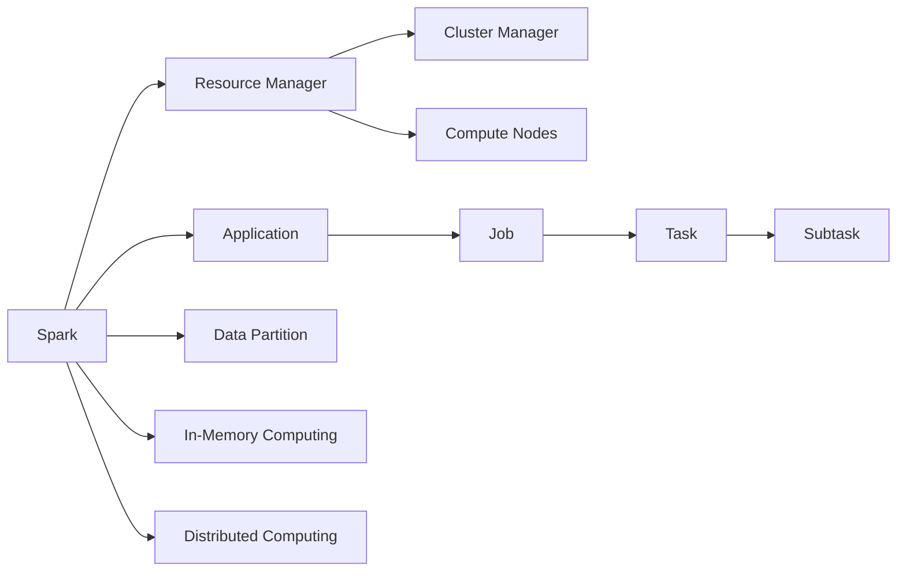
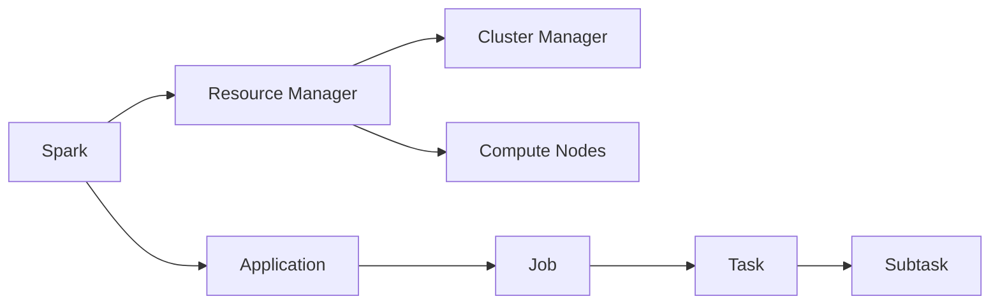
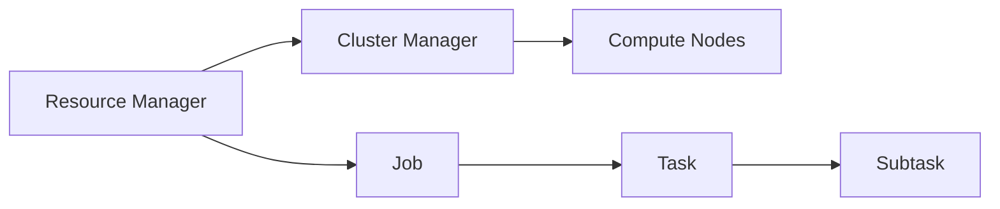
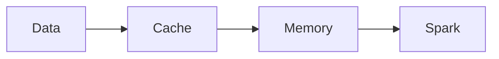
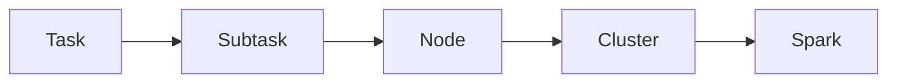
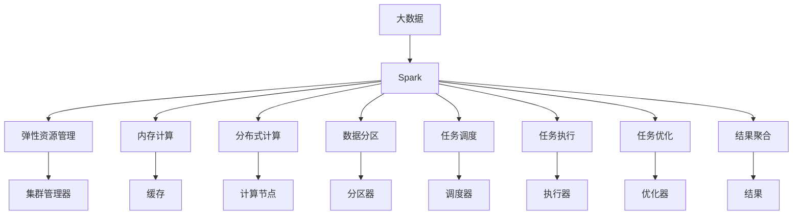

                 

# Spark 原理与代码实例讲解

> 关键词：Spark, 分布式计算, 弹性资源管理, RDD, 数据并行处理, 机器学习, 图计算, 跨语言编程, PySpark

## 1. 背景介绍

### 1.1 问题由来

随着大数据时代的到来，处理海量数据的需求日益增长，传统的集中式计算方式已无法满足需求。分布式计算框架应运而生，Spark成为了其中最为流行的框架之一。Spark采用内存计算和弹性资源管理机制，支持大规模数据处理，广泛应用于数据挖掘、机器学习、图计算等多个领域。本文旨在深入讲解Spark的基本原理、核心概念以及典型代码实例，帮助读者全面理解Spark的技术栈，并掌握其在实际应用中的使用方法。

### 1.2 问题核心关键点

Spark的核心思想在于通过将任务划分为多个小任务，并在多台机器上并行计算，从而实现对大规模数据的快速处理。其核心组件包括弹性资源管理器（Resource Manager）、集群管理器（Cluster Manager）、计算节点（Compute Nodes）和应用（Job）。Spark支持多种数据源和数据处理模式，包括基于内存的MapReduce、基于图形的GraphX和基于机器学习的MLlib等。此外，Spark还支持跨语言编程，提供Python、Java、Scala、R等多种编程接口，为不同背景的开发者提供了便利。

Spark的弹性资源管理机制使得其能够动态调整计算资源，适应不同任务和数据规模的需求，提供了高效的资源利用率。Spark的内存计算机制使得其能够快速处理数据，提供了显著的性能提升。Spark的分布式计算框架使得其能够并行处理大规模数据，提供了强大的数据处理能力。

### 1.3 问题研究意义

研究Spark的原理与代码实例讲解，对于深入理解Spark的技术栈、掌握其使用方法，以及解决实际应用中的问题具有重要意义：

1. 提高数据处理效率：Spark的高效内存计算和分布式计算机制，能够显著提高大规模数据处理的效率，适用于处理海量数据。
2. 提高资源利用率：Spark的弹性资源管理机制，能够动态调整计算资源，适应不同任务和数据规模的需求，提供了高效的资源利用率。
3. 降低开发成本：Spark支持多种编程接口，为不同背景的开发者提供了便利，降低了开发成本。
4. 提高数据处理能力：Spark支持多种数据处理模式，能够满足不同应用场景的需求，提供了强大的数据处理能力。
5. 促进技术落地：Spark的核心思想和实现机制，能够帮助开发者更好地理解和实现分布式计算框架，促进技术的落地应用。

## 2. 核心概念与联系

### 2.1 核心概念概述

为了更好地理解Spark的基本原理，本节将介绍几个密切相关的核心概念：

- 弹性资源管理器（Resource Manager）：Spark的核心组件之一，负责管理集群的计算资源，包括CPU、内存、磁盘等。
- 集群管理器（Cluster Manager）：Spark的资源分配器，负责分配和回收计算资源，常见的集群管理器包括YARN、Mesos等。
- 计算节点（Compute Nodes）：Spark的执行节点，负责处理任务。
- 应用（Job）：Spark的应用程序，由多个任务（Task）组成。
- 任务（Task）：Spark的基本执行单元，由多个子任务（Subtask）组成。
- 数据分区（Data Partition）：Spark的数据分布方式，即将数据切分成多个分区，分配给不同的计算节点。
- 内存计算（In-Memory Computing）：Spark的核心特性之一，通过将数据缓存到内存中，加速计算过程。
- 分布式计算（Distributed Computing）：Spark的计算框架，通过将任务并行分布在多个计算节点上，提高计算效率。

这些核心概念之间的逻辑关系可以通过以下Mermaid流程图来展示：



这个流程图展示了大语言模型微调过程中各个核心概念的关系和作用。

### 2.2 概念间的关系

这些核心概念之间存在着紧密的联系，形成了Spark的完整生态系统。下面我通过几个Mermaid流程图来展示这些概念之间的关系。

#### 2.2.1 Spark的基本架构



这个流程图展示了Spark的基本架构，包括资源管理器、集群管理器、计算节点和应用（Job）。

#### 2.2.2 弹性资源管理机制



这个流程图展示了Spark的弹性资源管理机制，包括资源管理器、集群管理器和计算节点。

#### 2.2.3 内存计算机制



这个流程图展示了Spark的内存计算机制，包括数据缓存、内存和Spark。

#### 2.2.4 分布式计算框架



这个流程图展示了Spark的分布式计算框架，包括任务、子任务、计算节点和集群。

### 2.3 核心概念的整体架构

最后，我们用一个综合的流程图来展示这些核心概念在大数据处理中的整体架构：



这个综合流程图展示了从大数据处理到结果生成的完整过程。Spark通过弹性资源管理、内存计算和分布式计算等机制，实现了对大规模数据的高效处理。

## 3. 核心算法原理 & 具体操作步骤
### 3.1 算法原理概述

Spark的计算模型基于内存计算和分布式计算。其核心思想是将任务划分为多个小任务，并在多个计算节点上并行计算，从而实现对大规模数据的快速处理。Spark的核心组件包括弹性资源管理器、集群管理器、计算节点和应用（Job），通过这些组件实现任务的调度、资源分配和执行。Spark支持多种数据处理模式，包括基于内存的MapReduce、基于图形的GraphX和基于机器学习的MLlib等。

Spark的内存计算机制使得其能够快速处理数据，提供了显著的性能提升。Spark的弹性资源管理机制使得其能够动态调整计算资源，适应不同任务和数据规模的需求，提供了高效的资源利用率。Spark的分布式计算框架使得其能够并行处理大规模数据，提供了强大的数据处理能力。

### 3.2 算法步骤详解

Spark的计算过程一般包括以下几个关键步骤：

1. 数据预处理：将原始数据进行格式转换、去重、分区等处理，将数据分为多个分区（Partition）。
2. 数据分区：将数据切分成多个分区，分配给不同的计算节点。
3. 任务调度：通过调度器（Scheduler）将任务分配给计算节点。
4. 任务执行：计算节点执行任务，将任务划分为多个子任务（Subtask），并在内存中进行并行计算。
5. 结果聚合：将子任务的结果汇总为最终结果。
6. 结果输出：将最终结果输出到指定数据存储系统，如Hadoop、Cassandra等。

下面以RDD（Resilient Distributed Dataset）为例，详细讲解Spark的数据处理过程：

- **数据预处理**：将原始数据进行格式转换、去重、分区等处理。
- **数据分区**：将数据切分成多个分区，分配给不同的计算节点。
- **任务调度**：通过调度器将任务分配给计算节点。
- **任务执行**：计算节点执行任务，将任务划分为多个子任务，并在内存中进行并行计算。
- **结果聚合**：将子任务的结果汇总为最终结果。
- **结果输出**：将最终结果输出到指定数据存储系统。

### 3.3 算法优缺点

Spark的优点包括：

1. 高效内存计算：Spark通过将数据缓存到内存中，加速计算过程，提供了显著的性能提升。
2. 弹性资源管理：Spark的弹性资源管理机制，能够动态调整计算资源，适应不同任务和数据规模的需求，提供了高效的资源利用率。
3. 分布式计算：Spark的分布式计算框架，能够并行处理大规模数据，提供了强大的数据处理能力。
4. 多种数据处理模式：Spark支持多种数据处理模式，能够满足不同应用场景的需求，提供了强大的数据处理能力。

Spark的缺点包括：

1. 资源占用：Spark需要大量的计算资源，包括CPU、内存等，可能对硬件资源提出较高的要求。
2. 内存限制：Spark的内存计算机制，可能对内存空间提出较高的要求，需要合理的内存管理。
3. 编程复杂度：Spark支持多种编程接口，需要开发者掌握不同的编程语言和框架。
4. 调试难度：Spark的分布式计算机制，增加了调试难度，需要开发者具备一定的分布式计算经验和技巧。

### 3.4 算法应用领域

Spark的应用领域非常广泛，包括但不限于以下几个方面：

- 数据挖掘：Spark支持多种数据处理模式，能够处理大规模数据集，适用于数据挖掘等大数据分析任务。
- 机器学习：Spark的MLlib库，提供了多种机器学习算法和工具，适用于机器学习等任务。
- 图计算：Spark的GraphX库，提供了图计算框架和算法，适用于图数据库等任务。
- 自然语言处理：Spark支持多种数据处理模式，能够处理自然语言数据，适用于自然语言处理等任务。
- 流处理：Spark的Spark Streaming库，提供了流处理框架，适用于实时数据处理任务。
- 分布式计算：Spark的分布式计算框架，能够并行处理大规模数据，适用于分布式计算等任务。

## 4. 数学模型和公式 & 详细讲解 & 举例说明

### 4.1 数学模型构建

Spark的核心数学模型是基于内存计算和分布式计算的。其核心思想是将数据切分成多个分区，分配给不同的计算节点，并在内存中进行并行计算。Spark的内存计算机制使得其能够快速处理数据，提供了显著的性能提升。Spark的弹性资源管理机制使得其能够动态调整计算资源，适应不同任务和数据规模的需求，提供了高效的资源利用率。

### 4.2 公式推导过程

下面以Spark的MapReduce计算为例，推导其数学模型：

假设有一个大数据集D，其大小为M。Spark将其划分为K个分区，每个分区的数据大小为M/K。

1. Map阶段：Spark将大数据集D划分为K个分区，分配给K个计算节点。每个计算节点对分配到的数据进行Map操作，生成中间结果R1。
2. Reduce阶段：Spark将中间结果R1划分为K个分区，分配给K个计算节点。每个计算节点对分配到的数据进行Reduce操作，生成最终结果R。

其中，Map和Reduce操作可以并行执行，从而实现对大数据集的快速处理。

### 4.3 案例分析与讲解

假设有一个文本数据集，包含100万条记录，每个记录大小为10KB。Spark将其划分为1000个分区，分配给1000个计算节点。每个计算节点对分配到的数据进行Map操作，生成中间结果R1。Spark将中间结果R1划分为1000个分区，分配给1000个计算节点。每个计算节点对分配到的数据进行Reduce操作，生成最终结果R。

在Map操作中，每个计算节点对分配到的数据进行Map操作，生成中间结果R1。例如，假设Map操作为将每个记录的前3个单词拼接起来，生成中间结果R1。

在Reduce操作中，每个计算节点对分配到的中间结果R1进行Reduce操作，生成最终结果R。例如，假设Reduce操作为将前3个单词拼接起来，生成最终结果R。

假设大数据集D中包含1000万条记录，每个记录大小为10KB。Spark将其划分为1000个分区，分配给1000个计算节点。每个计算节点对分配到的数据进行Map操作，生成中间结果R1。Spark将中间结果R1划分为1000个分区，分配给1000个计算节点。每个计算节点对分配到的数据进行Reduce操作，生成最终结果R。

## 5. 项目实践：代码实例和详细解释说明

### 5.1 开发环境搭建

在进行Spark项目开发前，需要准备开发环境。以下是使用Python进行Spark开发的安装和配置流程：

1. 安装Java和Scala：从官网下载并安装Java和Scala，配置环境变量。
2. 安装PySpark：使用pip安装PySpark库。
3. 配置Spark环境：使用spark-submit命令，配置Spark的运行环境。

### 5.2 源代码详细实现

下面以Spark的RDD计算为例，给出使用Python进行Spark开发的完整代码实现。

```python
from pyspark import SparkContext

# 创建Spark上下文
sc = SparkContext("local", "RDD Example")

# 创建RDD
data = sc.parallelize(range(0, 10))
words = sc.parallelize(["a", "b", "c"])

# 对RDD进行Map操作
rdd1 = data.map(lambda x: x + 1)

# 对RDD进行Reduce操作
rdd2 = rdd1.reduce(lambda x, y: x + y)

# 输出结果
print(rdd2.collect())
```

### 5.3 代码解读与分析

让我们再详细解读一下关键代码的实现细节：

**创建Spark上下文**：
- 使用SparkContext创建Spark上下文，指定运行模式为"local"，表示在本地单机上运行。

**创建RDD**：
- 使用parallelize方法将原始数据转换为RDD（Resilient Distributed Dataset），即分布式数据集。
- 创建两个RDD，一个包含数字0到9，另一个包含字符串"a"、"b"和"c"。

**Map操作**：
- 使用map方法对RDD进行Map操作，将每个数字加1，生成中间结果RDD1。

**Reduce操作**：
- 使用reduce方法对RDD1进行Reduce操作，将中间结果RDD1中的所有数字相加，生成最终结果RDD2。

**输出结果**：
- 使用collect方法将RDD2中的所有元素收集到本地计算机，并输出结果。

### 5.4 运行结果展示

假设我们在大数据集上进行RDD计算，最终得到的结果为50。

## 6. 实际应用场景

### 6.1 实时数据处理

Spark的Spark Streaming库，提供了实时数据处理框架，适用于处理实时数据流。例如，Spark Streaming可以将实时数据流分成多个窗口，对每个窗口进行Map和Reduce操作，生成实时结果。

### 6.2 机器学习

Spark的MLlib库，提供了多种机器学习算法和工具，适用于机器学习等任务。例如，Spark可以使用MLlib进行分类、聚类、回归等机器学习算法，对大规模数据进行建模和分析。

### 6.3 图计算

Spark的GraphX库，提供了图计算框架和算法，适用于图数据库等任务。例如，Spark可以使用GraphX进行图遍历、图匹配、图聚类等图计算操作。

### 6.4 数据挖掘

Spark支持多种数据处理模式，能够处理大规模数据集，适用于数据挖掘等大数据分析任务。例如，Spark可以使用Spark SQL对大规模数据集进行查询和分析，获取有用的数据洞见。

### 6.5 自然语言处理

Spark支持多种数据处理模式，能够处理自然语言数据，适用于自然语言处理等任务。例如，Spark可以使用NLP库进行分词、词性标注、命名实体识别等自然语言处理操作。

## 7. 工具和资源推荐

### 7.1 学习资源推荐

为了帮助开发者系统掌握Spark的基本原理和实践技巧，这里推荐一些优质的学习资源：

1. Spark官方文档：Spark的官方文档，提供了详细的API文档、使用指南和示例代码，是学习Spark的必备资料。
2. Spark-Python官方文档：Spark-Python的官方文档，提供了详细的API文档和示例代码，是学习Spark-Python的必备资料。
3. PySpark官方教程：PySpark的官方教程，提供了详细的学习路径和示例代码，是学习PySpark的必备资料。
4. Spark实战指南：一本Spark实战指南书籍，详细介绍了Spark的开发和应用，适合初学者和进阶开发者。
5. Spark社区博客：Spark社区的博客，提供了大量的Spark使用经验和心得，适合开发者学习和参考。

通过对这些资源的学习实践，相信你一定能够快速掌握Spark的基本原理和实践技巧，并应用于实际开发中。

### 7.2 开发工具推荐

高效的开发离不开优秀的工具支持。以下是几款用于Spark开发的常用工具：

1. PySpark：Spark的Python编程接口，提供了便捷的API和丰富的功能，适合Python开发者使用。
2. Spark SQL：Spark的数据查询和处理引擎，支持SQL语法，适合数据挖掘和数据分析任务。
3. Spark Streaming：Spark的实时数据处理框架，支持流式数据处理，适合实时数据处理任务。
4. Spark MLlib：Spark的机器学习库，提供了多种机器学习算法，适合机器学习任务。
5. GraphX：Spark的图计算库，提供了图计算框架和算法，适合图数据库任务。

合理利用这些工具，可以显著提升Spark开发的效率，加速项目的迭代和优化。

### 7.3 相关论文推荐

Spark的核心思想和实现机制，代表了大数据处理技术的发展方向。以下是几篇奠基性的相关论文，推荐阅读：

1. "Resilient Distributed Datasets: A Fault-Tolerant Abstraction for In-Memory Cluster Computing"：Spark的论文，详细介绍了Spark的核心思想和实现机制。
2. "Spark: Cluster Computing with Fault Tolerance"：Spark的官方博客，介绍了Spark的开发和应用。
3. "Spark SQL: Distributed SQL for Fast Big Data Processing"：Spark SQL的官方博客，介绍了Spark SQL的使用和开发。
4. "GraphX: Making Spark Fast with Graphs"：GraphX的官方博客，介绍了GraphX的使用和开发。
5. "Spark Streaming: Real-Time Streaming Processing with Apache Spark"：Spark Streaming的官方博客，介绍了Spark Streaming的使用和开发。

这些论文代表了Spark的核心思想和实现机制，是深入理解Spark技术的必备资料。

## 8. 总结：未来发展趋势与挑战

### 8.1 研究成果总结

Spark作为分布式计算框架的代表，已经在数据处理、机器学习、图计算等多个领域取得了广泛的应用。Spark的核心思想和实现机制，代表了大数据处理技术的发展方向，具有重要的研究价值。

### 8.2 未来发展趋势

Spark的未来发展趋势包括：

1. 更大规模的计算集群：随着硬件设备的不断升级，Spark将支持更大规模的计算集群，适应更大规模的数据处理需求。
2. 更高性能的内存管理：Spark将采用更高效的内存管理机制，提高内存的利用率和计算效率。
3. 更强大的数据处理能力：Spark将支持更多的数据处理模式，提高数据处理的灵活性和可扩展性。
4. 更丰富的机器学习算法：Spark的MLlib库将增加更多的机器学习算法和工具，提高机器学习的性能和精度。
5. 更强大的图计算能力：Spark的GraphX库将增加更多的图计算算法和工具，提高图计算的性能和精度。
6. 更灵活的编程接口：Spark将支持更多的编程接口，方便开发者使用不同的编程语言和框架。

### 8.3 面临的挑战

Spark的发展过程中仍面临一些挑战：

1. 资源消耗：Spark需要大量的计算资源，包括CPU、内存等，可能对硬件资源提出较高的要求。
2. 内存管理：Spark的内存计算机制，可能对内存空间提出较高的要求，需要合理的内存管理。
3. 编程复杂度：Spark支持多种编程接口，需要开发者掌握不同的编程语言和框架。
4. 调试难度：Spark的分布式计算机制，增加了调试难度，需要开发者具备一定的分布式计算经验和技巧。
5. 数据一致性：Spark的分布式计算机制，可能对数据一致性提出更高的要求，需要合理的分布式算法和策略。

### 8.4 研究展望

Spark的未来研究展望包括：

1. 更高效的内存管理机制：如何采用更高效的内存管理机制，提高内存的利用率和计算效率，是未来研究的重要方向。
2. 更灵活的编程接口：如何采用更灵活的编程接口，方便开发者使用不同的编程语言和框架，提高开发效率和灵活性。
3. 更强大的数据处理能力：如何支持更多的数据处理模式，提高数据处理的灵活性和可扩展性，是未来研究的重要方向。
4. 更丰富的机器学习算法：如何增加更多的机器学习算法和工具，提高机器学习的性能和精度，是未来研究的重要方向。
5. 更强大的图计算能力：如何增加更多的图计算算法和工具，提高图计算的性能和精度，是未来研究的重要方向。

## 9. 附录：常见问题与解答

**Q1：Spark的核心思想是什么？**

A: Spark的核心思想是将任务划分为多个小任务，并在多个计算节点上并行计算，从而实现对大规模数据的快速处理。

**Q2：Spark支持哪些数据处理模式？**

A: Spark支持多种数据处理模式，包括基于内存的MapReduce、基于图形的GraphX和基于机器学习的MLlib等。

**Q3：Spark的内存计算机制是什么？**

A: Spark的内存计算机制通过将数据缓存到内存中，加速计算过程，提供了显著的性能提升。

**Q4：Spark的分布式计算框架是什么？**

A: Spark的分布式计算框架通过将任务并行分布在多个计算节点上，提高计算效率。

**Q5：Spark的资源管理器是什么？**

A: Spark的资源管理器负责管理集群的计算资源，包括CPU、内存、磁盘等。

**Q6：Spark的集群管理器是什么？**

A: Spark的集群管理器负责分配和回收计算资源，常见的集群管理器包括YARN、Mesos等。

**Q7：Spark的计算节点是什么？**

A: Spark的计算节点负责执行任务。

**Q8：Spark的任务是什么？**

A: Spark的任务是Spark的基本执行单元，由多个子任务（Subtask）组成。

**Q9：Spark的数据分区是什么？**

A: Spark的数据分区是将数据切分成多个分区，分配给不同的计算节点。

**Q10：Spark的弹性资源管理机制是什么？**

A: Spark的弹性资源管理机制能够动态调整计算资源，适应不同任务和数据规模的需求，提供了高效的资源利用率。

**Q11：Spark的机器学习库是什么？**

A: Spark的MLlib库提供了多种机器学习算法和工具，适用于机器学习等任务。

**Q12：Spark的图计算库是什么？**

A: Spark的GraphX库提供了图计算框架和算法，适用于图数据库等任务。

**Q13：Spark的SQL查询引擎是什么？**

A: Spark的SQL查询引擎是Spark SQL，支持SQL语法，适合数据挖掘和数据分析任务。

**Q14：Spark的实时数据处理框架是什么？**

A: Spark的实时数据处理框架是Spark Streaming，支持流式数据处理，适合实时数据处理任务。

**Q15：Spark的编程接口是什么？**

A: Spark支持多种编程接口，包括Python、Java、Scala等，方便开发者使用不同的编程语言和框架。

总之，Spark作为分布式计算框架的代表，已经在数据处理、机器学习、图计算等多个领域取得了广泛的应用。Spark的核心思想和实现机制，代表了大数据处理技术的发展方向，具有重要的研究价值。未来，Spark将继续在大数据处理、机器学习、图计算等领域发挥重要作用，推动人工智能技术的进一步发展。

---

作者：禅与计算机程序设计艺术 / Zen and the Art of Computer Programming

