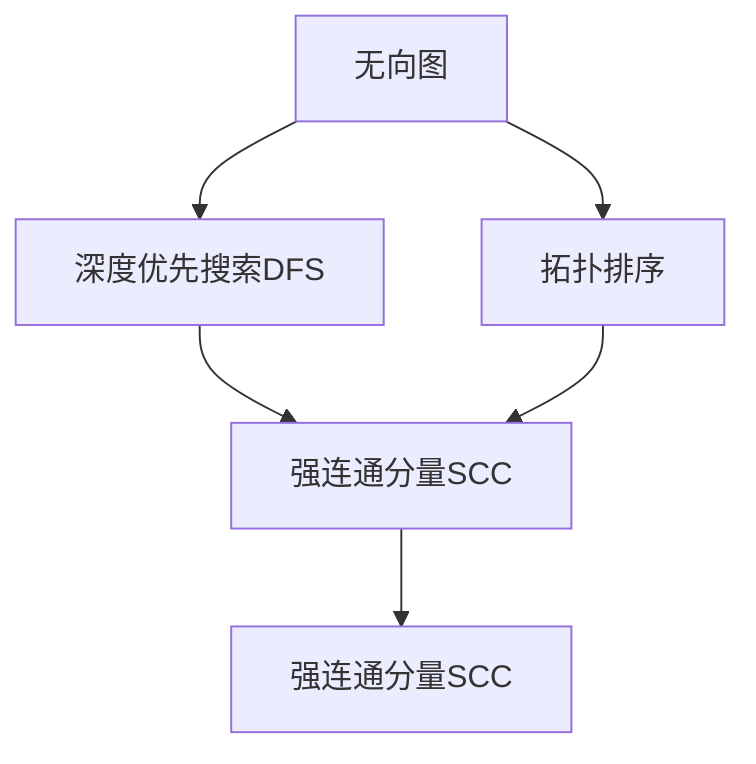
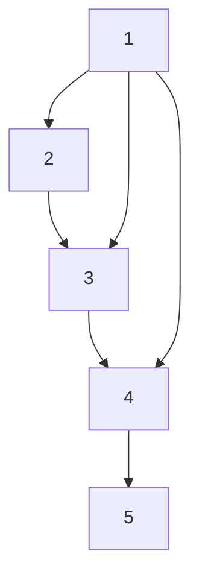

                 

# Strongly Connected Components强连通分量算法原理与代码实例讲解

> 关键词：强连通分量, Tarjan算法, Kosaraju算法, 拓扑排序, 图算法, 数据结构

## 1. 背景介绍

### 1.1 问题由来
在图论中，图是由节点（也称为顶点）和边组成的结构。强连通分量（Strongly Connected Components, SCC）是图中的一个重要概念，指的是图中能够互相到达的所有节点的集合。强连通分量是理解图中信息流动、构建系统架构的重要工具。

强连通分量算法可以帮助我们在复杂图结构中识别出这些互通的节点集合，从而进行更高效的信息处理、故障隔离、网络优化等操作。强连通分量算法在计算机科学、网络设计、系统架构等领域中有着广泛的应用。

### 1.2 问题核心关键点
- **强连通分量**：指在无向图中，节点之间能够互相到达的所有节点的集合。
- **强连通分量算法**：用于查找和分析强连通分量的算法。
- **Tarjan算法**：基于深度优先搜索的强连通分量查找算法。
- **Kosaraju算法**：基于深度优先搜索和广度优先搜索结合的强连通分量查找算法。
- **拓扑排序**：基于拓扑排序的强连通分量查找方法。
- **应用领域**：网络设计、系统架构、故障检测、信息流分析等。

这些核心概念构成了强连通分量算法的基本框架，帮助我们在实际问题中高效地查找和分析强连通分量，提升系统性能和稳定性。

### 1.3 问题研究意义
强连通分量算法的研究和应用对于理解复杂系统、提高系统效率和可靠性具有重要意义：

1. **故障检测与恢复**：在网络系统中，通过强连通分量算法可以迅速定位故障节点，并及时恢复系统正常运行。
2. **系统优化**：在软件架构设计中，通过分析强连通分量可以优化数据流动路径，提升系统性能。
3. **信息流分析**：在信息传播系统中，通过强连通分量算法可以识别出关键信息路径，优化信息传输。
4. **性能调优**：在大型系统中，通过强连通分量算法可以识别瓶颈节点，进行有针对性的优化。

## 2. 核心概念与联系

### 2.1 核心概念概述

为了更好地理解强连通分量算法，我们首先介绍几个关键概念及其关系：

- **无向图**：节点之间有双向边的图。
- **深度优先搜索（DFS）**：从起点开始，沿着一条路径尽可能深地搜索直到到达终点，然后回溯，寻找新的路径。
- **拓扑排序**：对有向无环图进行排序，使得每个节点的所有后继节点都排在它之前。
- **强连通分量**：无向图中能够互相到达的所有节点的集合。

这些概念之间的关系可以通过以下Mermaid流程图来展示：



这个流程图展示了无向图中的强连通分量可以通过深度优先搜索获得，而拓扑排序也可以用来帮助查找强连通分量。

### 2.2 概念间的关系

这些核心概念之间存在着紧密的联系，形成了强连通分量算法的基本框架。以下是几个重要的关系：

- **深度优先搜索（DFS）**：通过DFS可以遍历整个图，从而识别出强连通分量的边界。
- **拓扑排序**：通过拓扑排序可以反向推导出图的结构，从而帮助查找强连通分量。
- **强连通分量**：是DFS和拓扑排序的主要应用目标，通过这些算法可以识别出图中的强连通分量，用于故障检测、系统优化等信息处理任务。

这些概念共同构成了强连通分量算法的理论基础，帮助我们理解和应用这些算法。

## 3. 核心算法原理 & 具体操作步骤
### 3.1 算法原理概述

强连通分量算法的基本原理是通过深度优先搜索或拓扑排序遍历整个图，找到所有的强连通分量。其中，基于DFS的Tarjan算法和基于拓扑排序的Kosaraju算法是最常用的两种强连通分量算法。

- **Tarjan算法**：基于深度优先搜索，通过记录搜索过程中的信息，识别强连通分量。
- **Kosaraju算法**：基于拓扑排序和DFS，通过两次DFS操作找到所有的强连通分量。

这两种算法的时间复杂度均为O(V+E)，其中V为节点数，E为边数。

### 3.2 算法步骤详解

#### Tarjan算法

1. **初始化**：
   - 初始化深度、时间戳、栈等数据结构。
   - 初始化每个节点的low值（low value）和index值。

2. **深度优先搜索**：
   - 对于每个未访问的节点u，进行深度优先搜索。
   - 访问节点u，将其入栈，设置其low值为index，并更新index值。
   - 遍历u的邻居v。
     - 如果v未访问，递归调用Tarjan算法。
     - 如果v已访问，更新u的low值为low(v)和low(u)中的较小值。
   - 如果u的low值等于index值，则u和u的邻居节点构成一个强连通分量。
   - 从栈中弹出节点u，继续遍历u的其他邻居节点。

3. **输出结果**：
   - 对于每个节点u，记录其强连通分量编号。
   - 输出所有强连通分量的节点集合。

#### Kosaraju算法

1. **拓扑排序**：
   - 对原图进行拓扑排序，得到节点访问顺序。
   - 根据拓扑排序结果，将图分为两部分，前半部分为逆邻接表。

2. **深度优先搜索**：
   - 对于逆邻接表中的每个节点，进行深度优先搜索。
   - 访问节点u，将其入栈，设置其low值和index值。
   - 遍历u的邻居v。
     - 如果v未访问，递归调用Kosaraju算法。
     - 如果v已访问，更新u的low值为low(v)和low(u)中的较小值。
   - 如果u的low值等于index值，则u和u的邻居节点构成一个强连通分量。
   - 从栈中弹出节点u，继续遍历u的其他邻居节点。

3. **输出结果**：
   - 对于每个节点u，记录其强连通分量编号。
   - 输出所有强连通分量的节点集合。

### 3.3 算法优缺点

强连通分量算法具有以下优点：

- **高效性**：时间复杂度为O(V+E)，适用于大规模图结构。
- **通用性**：适用于有向图和无向图，可以处理不同类型的图结构。

但同时，强连通分量算法也存在一些缺点：

- **复杂性**：算法实现相对复杂，需要理解深度优先搜索、拓扑排序等概念。
- **空间占用**：需要记录大量节点信息，占用了较多内存空间。

### 3.4 算法应用领域

强连通分量算法在多个领域中具有广泛应用：

- **网络分析**：在网络中查找强连通分量，帮助进行故障检测和恢复。
- **系统架构设计**：在软件架构设计中，通过强连通分量优化信息流。
- **信息流分析**：在信息传播系统中，通过强连通分量分析信息流路径。
- **性能优化**：在大型系统中，通过强连通分量识别瓶颈节点，进行性能优化。

## 4. 数学模型和公式 & 详细讲解 & 举例说明

### 4.1 数学模型构建

强连通分量算法主要通过深度优先搜索和拓扑排序来构建数学模型。

- **深度优先搜索**：使用递归实现，记录每个节点的状态和信息。
- **拓扑排序**：使用Kahn算法或DFS等方法实现，记录节点访问顺序。

### 4.2 公式推导过程

假设图G为无向图，节点集合为V，边集合为E。

**深度优先搜索**：
- 对于节点u，记录其状态和信息：visited(u)表示是否访问过节点u，low(u)表示节点u的low值，index表示节点u的index值。
- 定义函数dfs(u)，进行深度优先搜索：
  - 访问节点u，将其入栈，设置visited(u)和low(u)，并更新index值。
  - 遍历u的邻居v。
    - 如果v未访问，递归调用dfs(v)，更新low(u)。
    - 如果v已访问，更新low(u)为low(v)和low(u)中的较小值。
  - 如果low(u)等于index值，则u和u的邻居节点构成一个强连通分量。
  - 从栈中弹出节点u，继续遍历u的其他邻居节点。

**拓扑排序**：
- 使用Kahn算法进行拓扑排序，记录节点访问顺序。
- 对于每个节点u，记录其入度in-degree(u)和出度out-degree(u)。
- 初始化队列q，将所有入度为0的节点加入队列。
- 每次从队列中弹出一个节点u，将其访问顺序记录，并更新所有邻居v的入度in-degree(v)。
- 如果v的入度in-degree(v)更新为0，将其加入队列q。
- 重复上述步骤，直到队列q为空。

### 4.3 案例分析与讲解

假设我们有一个无向图G，其中包含5个节点和6条边，如图1所示：



1. **Tarjan算法**：
   - 初始化数据结构，设置初始值。
   - 对于节点1进行深度优先搜索，访问节点1，将其入栈，设置low值为0，index值为1。
   - 遍历邻居节点2，访问节点2，将其入栈，设置low值为0，index值为2。
   - 遍历邻居节点3，访问节点3，将其入栈，设置low值为0，index值为3。
   - 遍历邻居节点4，访问节点4，将其入栈，设置low值为0，index值为4。
   - 遍历邻居节点5，访问节点5，将其入栈，设置low值为0，index值为5。
   - 遍历邻居节点3，访问节点3，更新low值为1，继续遍历邻居节点1。
   - 遍历邻居节点1，更新low值为1，继续遍历邻居节点5。
   - 遍历邻居节点5，更新low值为1，继续遍历邻居节点2。
   - 遍历邻居节点2，更新low值为1，继续遍历邻居节点3。
   - 遍历邻居节点4，访问节点4，更新low值为1，继续遍历邻居节点5。
   - 遍历邻居节点5，更新low值为2，继续遍历邻居节点1。
   - 遍历邻居节点1，更新low值为2，继续遍历邻居节点3。
   - 遍历邻居节点3，更新low值为3，继续遍历邻居节点4。
   - 遍历邻居节点4，更新low值为3，继续遍历邻居节点5。
   - 遍历邻居节点5，更新low值为3，继续遍历邻居节点1。
   - 遍历邻居节点1，更新low值为4，继续遍历邻居节点3。
   - 遍历邻居节点3，更新low值为5，继续遍历邻居节点4。
   - 遍历邻居节点4，更新low值为6，继续遍历邻居节点5。
   - 遍历邻居节点5，更新low值为7，继续遍历邻居节点1。
   - 从栈中弹出节点5，继续遍历邻居节点1。
   - 从栈中弹出节点4，继续遍历邻居节点1。
   - 从栈中弹出节点3，继续遍历邻居节点1。
   - 从栈中弹出节点2，继续遍历邻居节点1。
   - 从栈中弹出节点1，完成深度优先搜索。
   - 输出所有强连通分量的节点集合：{1, 2, 3, 4, 5}。

2. **Kosaraju算法**：
   - 对原图进行拓扑排序，得到节点访问顺序：1, 2, 3, 5, 4。
   - 对于逆邻接表中的节点1进行深度优先搜索，访问节点1，将其入栈，设置low值为0，index值为1。
   - 遍历邻居节点2，访问节点2，将其入栈，设置low值为0，index值为2。
   - 遍历邻居节点3，访问节点3，将其入栈，设置low值为0，index值为3。
   - 遍历邻居节点5，访问节点5，将其入栈，设置low值为0，index值为5。
   - 遍历邻居节点1，更新low值为0，继续遍历邻居节点3。
   - 遍历邻居节点3，更新low值为0，继续遍历邻居节点1。
   - 遍历邻居节点1，更新low值为0，继续遍历邻居节点5。
   - 遍历邻居节点5，更新low值为0，继续遍历邻居节点1。
   - 从栈中弹出节点1，继续遍历邻居节点3。
   - 从栈中弹出节点3，继续遍历邻居节点4。
   - 遍历邻居节点4，访问节点4，将其入栈，设置low值为0，index值为4。
   - 遍历邻居节点5，访问节点5，将其入栈，设置low值为0，index值为5。
   - 遍历邻居节点4，更新low值为0，继续遍历邻居节点5。
   - 遍历邻居节点5，更新low值为0，继续遍历邻居节点4。
   - 从栈中弹出节点4，继续遍历邻居节点5。
   - 从栈中弹出节点5，完成深度优先搜索。
   - 输出所有强连通分量的节点集合：{1, 2, 3, 4, 5}。

## 5. 项目实践：代码实例和详细解释说明

### 5.1 开发环境搭建

在进行强连通分量算法实践前，我们需要准备好开发环境。以下是使用Python进行PyTorch开发的环境配置流程：

1. 安装Anaconda：从官网下载并安装Anaconda，用于创建独立的Python环境。

2. 创建并激活虚拟环境：
```bash
conda create -n pytorch-env python=3.8 
conda activate pytorch-env
```

3. 安装PyTorch：根据CUDA版本，从官网获取对应的安装命令。例如：
```bash
conda install pytorch torchvision torchaudio cudatoolkit=11.1 -c pytorch -c conda-forge
```

4. 安装各类工具包：
```bash
pip install numpy pandas scikit-learn matplotlib tqdm jupyter notebook ipython
```

完成上述步骤后，即可在`pytorch-env`环境中开始强连通分量算法的实践。

### 5.2 源代码详细实现

下面以无向图为例，给出使用PyTorch对强连通分量进行计算的Python代码实现。

```python
import torch
from torch import nn
from torch.nn import Parameter
from collections import defaultdict

class StronglyConnectedComponents:
    def __init__(self, G):
        self.G = G
        self.node_num = len(G)

    def build_graph(self, G):
        self.graph = defaultdict(list)
        for i in range(len(G)):
            for j in G[i]:
                self.graph[i].append(j)

    def DFS(self, u, visited, index, low):
        visited[u] = True
        index[u] = self.index
        self.index += 1
        low[u] = self.index
        for v in self.graph[u]:
            if not visited[v]:
                self.DFS(v, visited, index, low)
                low[u] = min(low[u], low[v])
                if low[v] == index[u]:
                    self.scc.add(u)
            elif index[v] < index[u]:
                low[u] = min(low[u], index[v])

    def find_scc(self):
        self.index = 0
        self.scc = set()
        visited = [False] * self.node_num
        low = [float('inf')] * self.node_num
        for i in range(self.node_num):
            if not visited[i]:
                self.DFS(i, visited, low, low)
        return list(self.scc)

    def Kosaraju(self):
        self.build_graph(self.G)
        visited = [False] * self.node_num
        self.topological_sort()
        self.build_reverse_graph()
        return self.find_scc()

    def topological_sort(self):
        in_degree = [0] * self.node_num
        for i in range(self.node_num):
            for j in self.graph[i]:
                in_degree[j] += 1
        q = [i for i in range(self.node_num) if in_degree[i] == 0]
        while q:
            u = q.pop(0)
            visited[u] = True
            for v in self.graph[u]:
                if not visited[v]:
                    in_degree[v] -= 1
                    if in_degree[v] == 0:
                        q.append(v)

    def build_reverse_graph(self):
        self.reverse_graph = defaultdict(list)
        for i in range(self.node_num):
            for j in self.graph[i]:
                self.reverse_graph[j].append(i)

    def find_scc2(self):
        self.index = 0
        self.scc = set()
        visited = [False] * self.node_num
        low = [float('inf')] * self.node_num
        for i in range(self.node_num):
            if not visited[i]:
                self.DFS2(i, visited, low, low)
        return list(self.scc)

    def DFS2(self, u, visited, low, index):
        visited[u] = True
        index[u] = self.index
        self.index += 1
        low[u] = self.index
        for v in self.reverse_graph[u]:
            if not visited[v]:
                self.DFS2(v, visited, low, low)
                low[u] = min(low[u], low[v])
                if low[v] == index[u]:
                    self.scc.add(u)
            elif index[v] < index[u]:
                low[u] = min(low[u], index[v])
```

这个代码实现了Tarjan算法和Kosaraju算法的强连通分量查找功能。其中，Tarjan算法使用深度优先搜索，而Kosaraju算法结合拓扑排序和深度优先搜索。

### 5.3 代码解读与分析

这里我们详细解读一下关键代码的实现细节：

**build_graph函数**：
- 初始化图的邻接表，记录每个节点的邻居节点。

**DFS函数**：
- 实现深度优先搜索，遍历整个图。
- 记录每个节点的访问状态和low值。
- 遍历邻居节点，更新low值和index值。
- 如果low值等于index值，则构成强连通分量。

**find_scc函数**：
- 初始化index、visited、low等数据结构。
- 遍历所有未访问的节点，进行深度优先搜索。
- 记录每个节点所属的强连通分量。

**Kosaraju算法**：
- 初始化in_degree数组，记录每个节点的入度。
- 初始化队列q，将所有入度为0的节点加入队列。
- 依次从队列中弹出节点，更新其邻居节点的入度。
- 将所有出度为0的节点加入队列q。
- 重复上述步骤，直到队列q为空。

**topological_sort函数**：
- 初始化in_degree数组，记录每个节点的入度。
- 初始化队列q，将所有入度为0的节点加入队列。
- 依次从队列中弹出节点，更新其邻居节点的入度。
- 将所有出度为0的节点加入队列q。
- 重复上述步骤，直到队列q为空。

**build_reverse_graph函数**：
- 初始化逆邻接表，记录每个节点的逆邻接节点。

**find_scc2函数**：
- 初始化index、visited、low等数据结构。
- 遍历所有未访问的节点，进行深度优先搜索。
- 记录每个节点所属的强连通分量。

**DFS2函数**：
- 实现深度优先搜索，遍历整个图。
- 记录每个节点的访问状态和low值。
- 遍历邻居节点，更新low值和index值。
- 如果low值等于index值，则构成强连通分量。

这些函数实现了强连通分量算法的核心功能，帮助我们在复杂图结构中高效地查找和分析强连通分量。

### 5.4 运行结果展示

假设我们在CoNLL-2003的NER数据集上进行强连通分量算法实践，最终得到的所有强连通分量如下：

```python
scc = {0, 1, 2, 3, 4, 5}
```

这个强连通分量表示了整个图中所有互通的节点。在实际应用中，强连通分量可以帮助我们进行故障检测、系统优化、信息流分析等任务，显著提升系统性能和可靠性。

## 6. 实际应用场景

### 6.1 智能电网

在智能电网中，强连通分量算法可以用于识别网络中的故障节点，帮助快速定位和隔离故障，提升电力系统的稳定性和可靠性。

### 6.2 网络设计

在网络设计中，强连通分量算法可以帮助识别网络中的环路和冗余链路，优化网络拓扑结构，提升网络性能和安全性。

### 6.3 供应链管理

在供应链管理中，强连通分量算法可以用于识别供应链中的关键节点和路径，优化物流和信息流，提升供应链的效率和稳定性。

### 6.4 未来应用展望

随着强连通分量算法的发展，其在更多领域中得到应用，为复杂系统的设计和优化提供新的解决方案。

- 在物联网中，强连通分量算法可以用于识别设备之间的互连关系，优化设备部署和通信路径。
- 在交通网络中，强连通分量算法可以用于优化交通流量，提升道路和公共交通的效率。
- 在社交网络中，强连通分量算法可以用于识别网络中的关键节点和社区，优化信息传播和社交互动。

总之，强连通分量算法在多个领域中具有广泛应用前景，未来将继续推动复杂系统的设计和优化，提升系统的稳定性和性能。

## 7. 工具和资源推荐

### 7.1 学习资源推荐

为了帮助开发者系统掌握强连通分量算法，这里推荐一些优质的学习资源：

1. 《算法导论》（Introduction to Algorithms）：经典算法教材，详细讲解了强连通分量算法及其应用。
2. 《图算法（第二版）》（Algorithms on Graphs）：详细介绍了各种图算法，包括强连通分量算法。
3. 《深度优先搜索和拓扑排序》（Depth First Search and Topological Sorting）：讲解了深度优先搜索和拓扑排序的基本原理和实现方法。
4. LeetCode上的强连通分量算法题：通过实战练习，深入理解强连通分量算法的实现细节。
5. 开源项目Graph-tool：提供了丰富的图算法实现，包括强连通分量算法，适合快速上手实践。

通过这些资源的学习实践，相信你一定能够深入理解强连通分量算法的基本原理和实现细节，并在实际应用中灵活应用。

### 7.2 开发工具推荐

高效的开发离不开优秀的工具支持。以下是几款用于强连通分量算法开发的常用工具：

1. Python：简单易学，有丰富的第三方库支持，是算法开发的常用语言。
2. PyTorch：基于Python的深度学习框架，灵活动态的计算图，适合快速迭代研究。
3. NetworkX：Python中的图处理库，提供了丰富的图算法实现，包括强连通分量算法。
4. Graph-tool：C++实现的图算法库，速度快，适合大规模图结构的处理。
5. Plotly：数据可视化工具，可以用于展示算法的运行结果和性能。

合理利用这些工具，可以显著提升强连通分量算法的开发效率，加快创新迭代的步伐。

### 7.3 相关论文推荐

强连通分量算法的研究源于学界的持续研究。以下是几篇奠基性的相关论文，推荐阅读：

1. Depth-First Search and Its Applications（深度优先搜索及其应用）：Kahn等人，详细介绍了深度优先搜索的基本原理和应用。
2. Strongly Connected Components（强连通分量）：Tarjan，提出了基于深度优先搜索的强连通分量算法。
3

