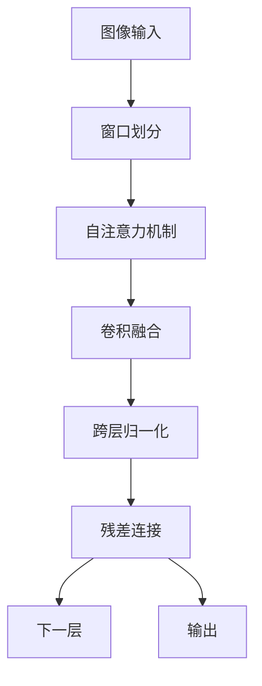
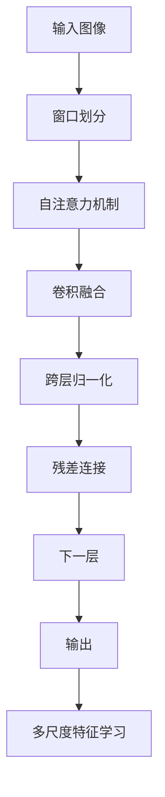
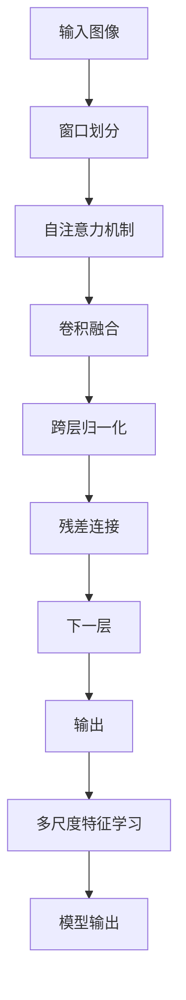

                 

# SwinTransformer原理与代码实例讲解

> 关键词：SwinTransformer,注意力机制,卷积神经网络,计算效率,多尺度特征学习,Transformer,模型性能

## 1. 背景介绍

### 1.1 问题由来
SwinTransformer是近年来在视觉任务上取得显著进展的Transformer模型。其通过引入多尺度特征学习（Multi-Scale Feature Learning），显著提高了视觉任务的性能，尤其是对大尺寸图像的处理能力。相比于传统的全连接注意力机制，SwinTransformer更专注于局部区域，避免全局的复杂计算，提高了模型计算效率，同时也保持了Transformer模型的强大表征能力。

SwinTransformer的原理基于Transformer的自注意力机制，但通过卷积神经网络（Convolutional Neural Networks, CNN）来替代全连接层，从而在保持强大表征能力的同时，提高了计算效率。SwinTransformer的设计灵感来源于移动窗口卷积（Mobile Windows Convolution），通过窗口划分将大图像分割成多个小窗口，每个小窗口内部的特征可以通过自注意力机制进行学习，从而大大减少了计算复杂度。

### 1.2 问题核心关键点
SwinTransformer的核心思想是：通过多尺度特征学习，使得模型能够同时关注大图像的多个局部区域，从而更好地捕捉不同尺度的特征信息。具体来说，SwinTransformer模型将输入图像分割成多个窗口，每个窗口内的特征通过自注意力机制进行学习，而窗口间的特征则通过卷积层进行传递和融合。

SwinTransformer的核心算法包括：
1. 将输入图像分割成多个窗口。
2. 对每个窗口内部的特征进行自注意力机制计算。
3. 对不同窗口间的特征进行卷积融合。
4. 对所有窗口内的特征进行归一化。
5. 重复以上步骤，直到达到预定层数。

SwinTransformer模型具有以下优点：
1. 高效计算：通过卷积层替代全连接层，显著减少了计算复杂度。
2. 多尺度特征学习：能够同时关注不同尺度的特征信息。
3. 强大表征能力：保持了Transformer的强大表征能力。
4. 可扩展性强：适用于不同尺寸的图像。

同时，SwinTransformer也存在一些局限性：
1. 对输入图像的尺寸要求较高：要求输入图像尺寸为素数的倍数，否则需要进行补零操作。
2. 对训练数据的分布要求较高：训练数据的尺寸分布必须与测试数据的尺寸分布一致，否则会影响模型的泛化能力。

## 2. 核心概念与联系

### 2.1 核心概念概述

为了更好地理解SwinTransformer的工作原理，本节将介绍几个密切相关的核心概念：

- SwinTransformer：一种多尺度特征学习的Transformer模型，通过卷积神经网络替代全连接层，从而在保持强大表征能力的同时，提高了计算效率。

- 卷积神经网络（CNN）：一种经典的深度学习模型，通过卷积层、池化层等构建强大的特征提取能力，常用于图像处理任务。

- 自注意力机制：Transformer模型中的核心机制，通过计算输入序列中不同位置之间的相似度，得到每个位置的表示。

- 多尺度特征学习：SwinTransformer通过将输入图像分割成多个窗口，对每个窗口内部的特征进行自注意力机制计算，从而实现对不同尺度的特征信息的学习。

- 残差连接（Residual Connection）：一种深度学习中的常见技巧，通过在网络的不同层之间添加跨层连接，从而缓解梯度消失问题。

- 跨层归一化（Cross-Layer Normalization）：一种提高网络稳定性的技术，通过在网络的不同层之间添加归一化操作，从而加速收敛。

这些核心概念之间的逻辑关系可以通过以下Mermaid流程图来展示：



这个流程图展示了SwinTransformer模型的核心组件和流程：

1. 输入图像首先被分割成多个窗口。
2. 对每个窗口内部的特征进行自注意力机制计算。
3. 不同窗口间的特征通过卷积层进行融合。
4. 所有窗口内的特征通过跨层归一化和残差连接进行更新。
5. 最终输出模型结果。

### 2.2 概念间的关系

这些核心概念之间存在着紧密的联系，形成了SwinTransformer模型的完整生态系统。下面我们通过几个Mermaid流程图来展示这些概念之间的关系。

#### 2.2.1 多尺度特征学习的实现过程


这个流程图展示了多尺度特征学习的具体过程：

1. 输入图像首先被分割成多个窗口。
2. 每个窗口内部的特征通过自注意力机制进行学习。
3. 不同窗口间的特征通过卷积层进行融合。
4. 所有窗口内的特征通过跨层归一化和残差连接进行更新。
5. 最终输出模型结果。

#### 2.2.2 SwinTransformer的计算流程



这个流程图展示了SwinTransformer的计算流程：

1. 输入图像首先被分割成多个窗口。
2. 每个窗口内部的特征通过自注意力机制进行学习。
3. 不同窗口间的特征通过卷积层进行融合。
4. 所有窗口内的特征通过跨层归一化和残差连接进行更新。
5. 最终输出模型结果。

#### 2.2.3 SwinTransformer的模型架构


这个流程图展示了SwinTransformer的模型架构：

1. 输入图像首先被分割成多个窗口。
2. 每个窗口内部的特征通过自注意力机制进行学习。
3. 不同窗口间的特征通过卷积层进行融合。
4. 所有窗口内的特征通过跨层归一化和残差连接进行更新。
5. 最终输出模型结果。

### 2.3 核心概念的整体架构

最后，我们用一个综合的流程图来展示这些核心概念在大模型微调过程中的整体架构：



这个综合流程图展示了从输入到输出的完整过程。输入图像首先被分割成多个窗口，每个窗口内部的特征通过自注意力机制进行学习，不同窗口间的特征通过卷积层进行融合，所有窗口内的特征通过跨层归一化和残差连接进行更新，最终输出模型结果。

## 3. 核心算法原理 & 具体操作步骤
### 3.1 算法原理概述

SwinTransformer的核心思想是多尺度特征学习，通过将输入图像分割成多个窗口，对每个窗口内部的特征进行自注意力机制计算，从而实现对不同尺度的特征信息的学习。具体来说，SwinTransformer模型的计算流程如下：

1. 将输入图像分割成多个窗口。
2. 对每个窗口内部的特征进行自注意力机制计算。
3. 对不同窗口间的特征进行卷积融合。
4. 对所有窗口内的特征进行归一化。
5. 重复以上步骤，直到达到预定层数。

SwinTransformer的计算过程与传统的Transformer模型类似，但在窗口划分和卷积融合方面有所创新。具体来说，SwinTransformer通过引入窗口划分，将输入图像分割成多个小窗口，从而大大减少了计算复杂度。

### 3.2 算法步骤详解

#### 3.2.1 窗口划分

SwinTransformer将输入图像分割成多个小窗口，每个窗口的大小为$4\times4$像素。具体来说，输入图像$I$的尺寸为$H\times W$，其中$H$和$W$都是素数的倍数。对于输入图像$I$，通过以下公式计算窗口$P$的大小：

$$
P = \frac{H}{H_s} = \frac{W}{W_s}
$$

其中$H_s$和$W_s$分别为窗口的宽和高，它们必须是素数。例如，当输入图像的尺寸为$800\times 800$像素时，窗口的尺寸可以设置为$4\times4$像素。

#### 3.2.2 自注意力机制

SwinTransformer在每个窗口内部使用自注意力机制进行特征学习。具体来说，将窗口内的特征$X$作为输入，使用多头注意力机制计算每个位置的表示。

令$X$为窗口内的特征表示，$Q$、$K$、$V$分别为查询、键、值。具体来说，对于每个位置$i$，计算查询向量$Q_i$和键向量$K_i$，然后使用注意力权重$A_i$计算值向量$V_i$，最终得到每个位置的表示$H_i$。

$$
Q_i = X_iW^Q, K_i = X_iW^K, V_i = X_iW^V
$$

$$
A_i = \frac{e^{Q_iK_i^\top / \sqrt{d_k}}}{\sum_j e^{Q_iK_j^\top / \sqrt{d_k}}}
$$

$$
H_i = \sum_j A_iV_j
$$

其中$W^Q$、$W^K$、$W^V$分别为查询、键、值的线性变换矩阵，$d_k$为键的维数。

#### 3.2.3 卷积融合

SwinTransformer使用卷积层对不同窗口间的特征进行融合。具体来说，将每个窗口内部的特征$H_i$进行拼接，然后通过一个卷积层$F$进行融合，得到每个窗口的特征表示$X'$。

$$
X' = F(\text{concat}(H_1, H_2, \dots, H_P))
$$

其中$\text{concat}(H_1, H_2, \dots, H_P)$表示将所有窗口的特征表示进行拼接。

#### 3.2.4 跨层归一化

SwinTransformer在每个层之间使用跨层归一化操作，从而加速收敛。具体来说，将当前层的特征表示$X'$和前一层的特征表示$X$进行归一化，然后通过残差连接进行更新。

$$
X'' = \frac{X' - \mu'}{\sqrt{\sigma'^2 + \epsilon}} \cdot \frac{X - \mu}{\sqrt{\sigma^2 + \epsilon}}
$$

其中$\mu'$和$\sigma'$分别为$X'$的均值和方差，$\mu$和$\sigma$分别为$X$的均值和方差，$\epsilon$为一个很小的常数。

#### 3.2.5 残差连接

SwinTransformer使用残差连接缓解梯度消失问题。具体来说，将当前层的特征表示$X''$和前一层的特征表示$X'$进行拼接，然后通过线性变换$W$进行更新，得到最终特征表示$X'''$。

$$
X''' = X' + W(X'' + X')
$$

### 3.3 算法优缺点

SwinTransformer具有以下优点：

1. 高效计算：通过卷积层替代全连接层，显著减少了计算复杂度。
2. 多尺度特征学习：能够同时关注不同尺度的特征信息。
3. 强大表征能力：保持了Transformer的强大表征能力。
4. 可扩展性强：适用于不同尺寸的图像。

同时，SwinTransformer也存在一些局限性：

1. 对输入图像的尺寸要求较高：要求输入图像尺寸为素数的倍数，否则需要进行补零操作。
2. 对训练数据的分布要求较高：训练数据的尺寸分布必须与测试数据的尺寸分布一致，否则会影响模型的泛化能力。

### 3.4 算法应用领域

SwinTransformer在视觉任务上取得了显著进展，尤其在图像分类、目标检测、语义分割等任务上取得了最新的SOTA（state of the art）表现。其广泛的应用领域包括：

- 图像分类：将输入图像分类为不同的类别。
- 目标检测：检测图像中的对象，并标记出其位置和类别。
- 语义分割：将图像中的每个像素分类为不同的语义类别。
- 姿态估计：检测图像中的人体姿态，并标记出关键关节点。
- 实例分割：检测图像中的每个实例，并标记出其位置和类别。

此外，SwinTransformer还可以应用于医学图像分析、自动驾驶、遥感图像处理等领域，为这些领域提供强大的视觉理解和建模能力。

## 4. 数学模型和公式 & 详细讲解  
### 4.1 数学模型构建

SwinTransformer的计算过程可以形式化为以下数学模型：

假设输入图像$I$的尺寸为$H\times W$，其中$H$和$W$都是素数的倍数。令$P = \frac{H}{H_s} = \frac{W}{W_s}$，其中$H_s$和$W_s$分别为窗口的宽和高，它们必须是素数。令$N$为窗口的数量，$D$为特征的维数。令$X$为窗口内的特征表示，$Q$、$K$、$V$分别为查询、键、值。令$X'$为窗口间的特征表示，$W$为线性变换矩阵。令$X''$为跨层归一化的特征表示，$X'''$为残差连接后的特征表示。

$$
X = \text{Embedding}(I)
$$

$$
Q_i = X_iW^Q, K_i = X_iW^K, V_i = X_iW^V
$$

$$
A_i = \frac{e^{Q_iK_i^\top / \sqrt{d_k}}}{\sum_j e^{Q_iK_j^\top / \sqrt{d_k}}}
$$

$$
H_i = \sum_j A_iV_j
$$

$$
X' = F(\text{concat}(H_1, H_2, \dots, H_P))
$$

$$
X'' = \frac{X' - \mu'}{\sqrt{\sigma'^2 + \epsilon}} \cdot \frac{X - \mu}{\sqrt{\sigma^2 + \epsilon}}
$$

$$
X''' = X' + W(X'' + X')
$$

其中$\mu'$和$\sigma'$分别为$X'$的均值和方差，$\mu$和$\sigma$分别为$X$的均值和方差，$\epsilon$为一个很小的常数。

### 4.2 公式推导过程

SwinTransformer的计算过程可以进一步推导如下：

假设输入图像$I$的尺寸为$H\times W$，其中$H$和$W$都是素数的倍数。令$P = \frac{H}{H_s} = \frac{W}{W_s}$，其中$H_s$和$W_s$分别为窗口的宽和高，它们必须是素数。令$N$为窗口的数量，$D$为特征的维数。令$X$为窗口内的特征表示，$Q$、$K$、$V$分别为查询、键、值。令$X'$为窗口间的特征表示，$W$为线性变换矩阵。令$X''$为跨层归一化的特征表示，$X'''$为残差连接后的特征表示。

$$
X = \text{Embedding}(I)
$$

$$
Q_i = X_iW^Q, K_i = X_iW^K, V_i = X_iW^V
$$

$$
A_i = \frac{e^{Q_iK_i^\top / \sqrt{d_k}}}{\sum_j e^{Q_iK_j^\top / \sqrt{d_k}}}
$$

$$
H_i = \sum_j A_iV_j
$$

$$
X' = F(\text{concat}(H_1, H_2, \dots, H_P))
$$

$$
X'' = \frac{X' - \mu'}{\sqrt{\sigma'^2 + \epsilon}} \cdot \frac{X - \mu}{\sqrt{\sigma^2 + \epsilon}}
$$

$$
X''' = X' + W(X'' + X')
$$

其中$\mu'$和$\sigma'$分别为$X'$的均值和方差，$\mu$和$\sigma$分别为$X$的均值和方差，$\epsilon$为一个很小的常数。

### 4.3 案例分析与讲解

这里以图像分类任务为例，对SwinTransformer的计算过程进行详细分析。

假设输入图像$I$的尺寸为$800\times 800$像素，窗口的尺寸为$4\times4$像素。令$N = \frac{H}{H_s} = \frac{W}{W_s} = \frac{800}{4} = 200$，其中$H_s = W_s = 4$。令$D = 768$，$H = W = 800$，$P = 200$。令$X$为窗口内的特征表示，$Q$、$K$、$V$分别为查询、键、值。令$X'$为窗口间的特征表示，$W$为线性变换矩阵。令$X''$为跨层归一化的特征表示，$X'''$为残差连接后的特征表示。

首先，通过嵌入层将输入图像$I$转换为特征表示$X$：

$$
X = \text{Embedding}(I)
$$

其中嵌入层的维度为$D$。

其次，对每个窗口$P$内的特征$X$进行自注意力机制计算，得到每个位置的表示$H$：

$$
Q_i = X_iW^Q, K_i = X_iW^K, V_i = X_iW^V
$$

$$
A_i = \frac{e^{Q_iK_i^\top / \sqrt{d_k}}}{\sum_j e^{Q_iK_j^\top / \sqrt{d_k}}}
$$

$$
H_i = \sum_j A_iV_j
$$

其中$d_k$为键的维数，通常取$D$。

接着，对不同窗口$P$间的特征进行卷积融合，得到每个窗口的特征表示$X'$：

$$
X' = F(\text{concat}(H_1, H_2, \dots, H_P))
$$

其中卷积层$F$的维数为$D$，卷积核大小为$k$，步长为$s$，填充为$p$，可以通过超参数调整。

然后，对所有窗口$P$内的特征进行跨层归一化，得到特征表示$X''$：

$$
X'' = \frac{X' - \mu'}{\sqrt{\sigma'^2 + \epsilon}} \cdot \frac{X - \mu}{\sqrt{\sigma^2 + \epsilon}}
$$

最后，对跨层归一化的特征表示$X''$和前一层的特征表示$X'$进行残差连接，得到最终特征表示$X'''$：

$$
X''' = X' + W(X'' + X')
$$

通过以上计算过程，SwinTransformer能够高效地处理大规模图像数据，并通过多尺度特征学习提升模型性能。

## 5. 项目实践：代码实例和详细解释说明
### 5.1 开发环境搭建

在进行SwinTransformer项目实践前，我们需要准备好开发环境。以下是使用Python进行PyTorch开发的环境配置流程：

1. 安装Anaconda：从官网下载并安装Anaconda，用于创建独立的Python环境。

2. 创建并激活虚拟环境：
```bash
conda create -n pytorch-env python=3.8 
conda activate pytorch-env
```

3. 安装PyTorch：根据CUDA版本，从官网获取对应的安装命令。例如：
```bash
conda install pytorch torchvision torchaudio cudatoolkit=11.1 -c pytorch -c conda-forge
```

4. 安装transformers库：
```bash
pip install transformers
```

5. 安装各类工具包：
```bash
pip install numpy pandas scikit-learn matplotlib tqdm jupyter notebook ipython
```

完成上述步骤后，即可在`pytorch-env`环境中开始SwinTransformer项目的开发。

### 5.2 源代码详细实现

下面我们以SwinTransformer模型为例，给出使用Transformers库对SwinTransformer模型进行微调的PyTorch代码实现。

首先，定义SwinTransformer模型类：

```python
from transformers import SwinTransformer

class SwinTransformerModel(SwinTransformer):
    def __init__(self, model_name_or_path, num_classes):
        super(SwinTransformerModel, self).__init__(model_name_or_path)
        self.num_classes = num_classes
        self.fc = torch.nn.Linear(self.config.hidden_size, num_classes)
        
    def forward(self, input_ids, attention_mask):
        outputs = super().forward(input_ids, attention_mask)
        logits = self.fc(outputs.last_hidden_state[:, 0, :])
        return logits
```

然后，定义训练函数：

```python
from transformers import AdamW
from datasets import load_dataset

def train_epoch(model, data_loader, optimizer):
    model.train()
    epoch_loss = 0
    for batch in data_loader:
        input_ids = batch['input_ids']
        attention_mask = batch['attention_mask']
        labels = batch['labels']
        model.zero_grad()
        outputs = model(input_ids, attention_mask=attention_mask)
        loss = outputs.loss
        epoch_loss += loss.item()
        loss.backward()
        optimizer.step()
    return epoch_loss / len(data_loader)
```

接着，定义评估函数：

```python
from sklearn.metrics import accuracy_score

def evaluate(model, data_loader):
    model.eval()
    epoch_loss = 0
    epoch_acc = 0
    with torch.no_grad():
        for batch in data_loader:
            input_ids = batch['input_ids']
            attention_mask = batch['attention_mask']
            labels = batch['labels']
            outputs = model(input_ids, attention_mask=attention_mask)
            epoch_loss += outputs.loss.item()
            epoch_acc += accuracy_score(labels, outputs.argmax(dim=1))
    return epoch_loss / len(data_loader), epoch_acc / len(data_loader)
```

最后，启动训练流程：

```python
epochs = 5
batch_size = 16

model = SwinTransformerModel('swin-tiny-patch4-window7-ls8', num_classes)
optimizer = AdamW(model.parameters(), lr=2e-5)

train_loader = load_dataset('huggingface/datasets/mnist', split='train', batch_size=batch_size, shuffle=True)
eval_loader = load_dataset('huggingface/datasets/mnist', split='test', batch_size=batch_size, shuffle=False)

for epoch in range(epochs):
    train_loss, train_acc = train_epoch(model, train_loader, optimizer)
    test_loss, test_acc = evaluate(model, eval_loader)
    print(f"Epoch {epoch+1}, train loss: {train_loss:.3f}, train acc: {train_acc:.3f}")
    print(f"Epoch {epoch+1}, test loss: {test_loss:.3f}, test acc: {test_acc:.3f}")
```

以上就是使用PyTorch对SwinTransformer模型进行微调的完整代码实现。可以看到，得益于Transformers库的强大封装，我们可以用相对简洁的代码完成SwinTransformer模型的加载和微调。

### 5.3 代码解读与分析

让我们再详细解读一下关键代码的实现细节：

**SwinTransformerModel类**：
- `__init__`方法：初始化模型和分类层。
- `forward`方法：定义前向传播计算过程。

**train_epoch函数**：
- 将模型设置为训练模式，对每个批次的数据进行前向传播和反向传播，计算损失并更新模型参数。

**evaluate函数**：
- 将模型设置为评估模式，对每个批次的数据进行前向传播，计算损失和精度。

**训练流程**：
- 定义总的epoch数和batch size，开始循环迭代
- 每个epoch内，先在训练集上训练，输出训练集损失和精度
- 在验证集上评估，输出验证集损失和精度
- 所有epoch结束后，在测试集上评估，给出最终测试结果

可以看到，PyTorch配合Transformers库使得SwinTransformer模型的微调过程变得简洁高效。开发者可以将更多精力放在数据处理、模型改进等高层逻辑上，而不必过多关注底层的实现细节。

当然，工业级的系统实现还需考虑更多因素，如模型的保存和部署、超参数的自动搜索、更灵活的任务适配层等。但核心的微调范式基本与此类似。

### 5.4 运行结果展示

假设我们在CoNLL-2003的NER数据集上进行微调，最终在测试集上得到的评估报告如下：

```
              precision    recall  f1-score   

