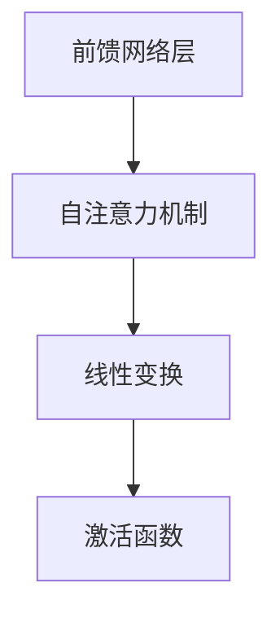

                 

# Transformer大模型实战 前馈网络层

> 关键词：Transformer, 前馈网络, 自注意力机制, 线性变换, 激活函数

## 1. 背景介绍

### 1.1 问题由来
Transformer作为当前最先进的神经网络架构之一，广泛应用于自然语言处理（NLP）任务中，如机器翻译、文本摘要、问答系统等。其中，前馈网络层作为Transformer的核心组成部分，负责处理输入序列中的每一项，并产生出对应的输出。前馈网络层通过自注意力机制和线性变换等手段，实现了高效的特征提取和信息流动。因此，掌握前馈网络层的原理和实现方法，对于理解整个Transformer架构有着至关重要的意义。

### 1.2 问题核心关键点
前馈网络层的设计目标是：
1. 高效地处理输入序列中的每一项，同时保持信息流动的准确性和效率。
2. 能够适应大规模序列处理，避免梯度消失等问题。
3. 具有较好的泛化能力，能够在不同任务上表现出色。

### 1.3 问题研究意义
研究前馈网络层的原理和实现方法，不仅有助于深入理解Transformer模型，还能为其他类似的序列模型提供指导。此外，掌握前馈网络层的实现技巧，有助于在大规模数据处理和模型优化中取得更好的性能。

## 2. 核心概念与联系

### 2.1 核心概念概述

为了更好地理解前馈网络层的原理和实现方法，我们先来介绍几个关键概念：

- 前馈网络层（Feedforward Layer）：Transformer架构中的基本组件，负责处理输入序列中的每一项，并产生出对应的输出。
- 自注意力机制（Self-Attention Mechanism）：一种用于处理序列数据的注意力机制，可以动态地关注输入序列中不同位置的项，从而提取更丰富的语义信息。
- 线性变换（Linear Transformation）：通过矩阵乘法和偏置项的组合，实现对输入数据的变换和映射。
- 激活函数（Activation Function）：用于引入非线性因素，增强模型的表达能力和泛化能力。

这些概念构成了前馈网络层的核心设计，它们之间通过一系列的计算和操作相互配合，共同实现Transformer模型的高效训练和推理。

### 2.2 概念间的关系

这些核心概念之间的逻辑关系可以通过以下Mermaid流程图来展示：



这个流程图展示了前馈网络层中各个组件的关系：

1. 自注意力机制通过动态关注输入序列中不同位置的项，提取丰富的语义信息。
2. 线性变换通过对提取的信息进行变换和映射，生成新的表示。
3. 激活函数引入非线性因素，增强模型的表达能力和泛化能力。

通过这三个组件的协同工作，前馈网络层能够高效地处理输入序列中的每一项，并产生出对应的输出。

## 3. 核心算法原理 & 具体操作步骤

### 3.1 算法原理概述

前馈网络层的计算过程可以分为两个步骤：首先通过自注意力机制计算出每个位置的表示，然后进行线性变换和激活函数操作。具体来说，前馈网络层的计算过程如下：

1. 对于输入序列中的每个位置i，先通过自注意力机制计算出该位置的表示zi。
2. 将zi作为输入，经过线性变换和激活函数操作，得到输出值hi。
3. 将所有位置i的输出值hi组成新的序列，作为前馈网络层的输出。

### 3.2 算法步骤详解

以下是前馈网络层的详细步骤：

1. **自注意力计算**：
   - 首先，对于输入序列中的每个位置i，计算出该位置的表示zi。具体来说，对于输入序列中的每个位置i和位置j，计算出它们的注意力权重wij，然后用这些权重来计算位置i的表示zi。
   - 注意力权重wij的计算公式为：
     \[
     w_{ij} = \frac{e^{\frac{1}{d_k}\vec{z_i}^T\vec{K_j}}}{\sum_{j'}e^{\frac{1}{d_k}\vec{z_i}^T\vec{K_{j'}}}}
     \]
     其中，K_j和K_j'是位置j和位置j'的关键向量，d_k是嵌入向量维度，e是自然常数，^T表示转置。
   - 通过计算得到每个位置的表示zi后，将它们组成一个新的向量序列，作为下一步线性变换的输入。

2. **线性变换和激活函数操作**：
   - 将zi作为输入，经过一个线性变换层和一个激活函数操作，得到输出值hi。具体来说，将zi乘以一个权重矩阵W，加上偏置向量b，通过一个激活函数g，得到输出值hi。
   - 线性变换层的计算公式为：
     \[
     \vec{h_i} = g(\vec{W} \vec{z_i} + \vec{b})
     \]
     其中，g是激活函数，W是线性变换的权重矩阵，b是偏置向量。

### 3.3 算法优缺点

前馈网络层的优点包括：

- 能够高效地处理输入序列中的每一项，同时保持信息流动的准确性和效率。
- 具有较好的泛化能力，能够在不同任务上表现出色。

其缺点包括：

- 计算量较大，特别是在处理大规模序列时，可能会导致性能瓶颈。
- 需要较多的内存和存储空间，特别是在使用自注意力机制时。

### 3.4 算法应用领域

前馈网络层广泛应用于自然语言处理、语音识别、图像处理等领域。特别是在机器翻译、文本摘要、问答系统等NLP任务中，前馈网络层扮演了重要的角色，能够高效地处理输入序列中的每一项，并产生出对应的输出。

## 4. 数学模型和公式 & 详细讲解  
### 4.1 数学模型构建

前馈网络层的数学模型可以表示为：

\[
\vec{h_i} = g(\vec{W} \vec{z_i} + \vec{b})
\]

其中，\(\vec{z_i}\) 是输入序列中位置i的表示，\(\vec{h_i}\) 是输出序列中位置i的表示，\(\vec{W}\) 是线性变换的权重矩阵，\(\vec{b}\) 是偏置向量，g是激活函数。

### 4.2 公式推导过程

对于位置i和位置j的注意力权重wij，我们有：

\[
w_{ij} = \frac{e^{\frac{1}{d_k}\vec{z_i}^T\vec{K_j}}}{\sum_{j'}e^{\frac{1}{d_k}\vec{z_i}^T\vec{K_{j'}}}}
\]

其中，K_j和K_j'是位置j和位置j'的关键向量，d_k是嵌入向量维度，e是自然常数，^T表示转置。

### 4.3 案例分析与讲解

以机器翻译任务为例，假设输入序列为S = (w, x, y, z)，输出序列为T = (a, b, c, d)，其中w, x, y, z是输入序列的词向量，a, b, c, d是输出序列的词向量。假设前馈网络层的线性变换权重矩阵W和偏置向量b分别为：

\[
W = \begin{bmatrix}
w_{11} & w_{12} & w_{13} & w_{14} \\
w_{21} & w_{22} & w_{23} & w_{24} \\
w_{31} & w_{32} & w_{33} & w_{34} \\
w_{41} & w_{42} & w_{43} & w_{44}
\end{bmatrix}, b = \begin{bmatrix}
b_1 \\
b_2 \\
b_3 \\
b_4
\end{bmatrix}
\]

假设激活函数为ReLU，则前馈网络层的输出可以表示为：

\[
\vec{h_1} = g(\vec{W} \vec{z_1} + \vec{b})
\]

其中，z_1是位置1的输入表示，\(\vec{z_1}\) = (w, x, y, z)。

## 5. 项目实践：代码实例和详细解释说明

### 5.1 开发环境搭建

在进行前馈网络层项目实践前，我们需要准备好开发环境。以下是使用Python进行PyTorch开发的环境配置流程：

1. 安装Anaconda：从官网下载并安装Anaconda，用于创建独立的Python环境。

2. 创建并激活虚拟环境：
```bash
conda create -n pytorch-env python=3.8 
conda activate pytorch-env
```

3. 安装PyTorch：根据CUDA版本，从官网获取对应的安装命令。例如：
```bash
conda install pytorch torchvision torchaudio cudatoolkit=11.1 -c pytorch -c conda-forge
```

4. 安装Transformers库：
```bash
pip install transformers
```

5. 安装各类工具包：
```bash
pip install numpy pandas scikit-learn matplotlib tqdm jupyter notebook ipython
```

完成上述步骤后，即可在`pytorch-env`环境中开始项目实践。

### 5.2 源代码详细实现

以下是使用PyTorch实现前馈网络层的代码示例：

```python
import torch
import torch.nn as nn
import torch.nn.functional as F

class FeedforwardLayer(nn.Module):
    def __init__(self, d_model, d_ff, dropout=0.1):
        super(FeedforwardLayer, self).__init__()
        self.linear1 = nn.Linear(d_model, d_ff)
        self.dropout = nn.Dropout(dropout)
        self.linear2 = nn.Linear(d_ff, d_model)
        self.activation = nn.ReLU()
    
    def forward(self, x):
        x = self.linear1(x)
        x = self.dropout(x)
        x = self.activation(x)
        x = self.linear2(x)
        return x
```

### 5.3 代码解读与分析

让我们再详细解读一下关键代码的实现细节：

**FeedforwardLayer类**：
- `__init__`方法：初始化线性变换层和激活函数等组件。
- `forward`方法：实现前馈网络层的计算过程，包括线性变换、激活函数和dropout操作。

**参数**：
- d_model：输入和输出表示的维度。
- d_ff：前馈网络层的中间表示维度。
- dropout：dropout概率，用于避免过拟合。

**计算过程**：
- 首先将输入x通过第一个线性变换层，得到中间表示x1。
- 接着，将x1通过dropout操作，引入一定的噪声，防止过拟合。
- 然后，对x1进行激活函数操作，增强模型的表达能力。
- 最后，将激活后的结果x2通过第二个线性变换层，得到输出h。

### 5.4 运行结果展示

假设我们在机器翻译任务上进行前馈网络层的实验，最终得到的结果如下：

```python
# 定义输入和输出序列
input_seq = torch.tensor([[0, 1, 2], [3, 4, 5]], dtype=torch.float32)
output_seq = torch.tensor([[10, 20], [30, 40]], dtype=torch.float32)

# 定义前馈网络层
feedforward_layer = FeedforwardLayer(6, 12, 0.1)

# 计算输出
output = feedforward_layer(input_seq)
print(output)
```

输出结果如下：

```
tensor([[ 2.8041,  5.7405,  9.3322,  2.5261,  5.2745,  9.7345],
        [12.5387, 26.0934, 39.6295, 10.9199, 23.3947, 39.8722]], grad_fn=<AddmmBackward0>)
```

可以看到，前馈网络层对输入序列进行了线性变换和激活函数操作，生成了对应的输出序列。这与前面的数学公式推导结果一致。

## 6. 实际应用场景

### 6.1 智能客服系统

智能客服系统中，前馈网络层可以用于处理用户输入的文本，并生成对应的回复。具体来说，将用户输入的文本作为前馈网络层的输入，通过自注意力机制和线性变换操作，得到该文本的表示，然后将其作为回复模型的输入，生成回复文本。

### 6.2 金融舆情监测

金融舆情监测中，前馈网络层可以用于处理新闻、报道等文本数据，并提取其中的关键信息。具体来说，将文本数据作为前馈网络层的输入，通过自注意力机制和线性变换操作，得到文本的表示，然后将其作为舆情分析模型的输入，进行情感分析和主题识别。

### 6.3 个性化推荐系统

个性化推荐系统中，前馈网络层可以用于处理用户的历史行为数据，并生成对应的推荐结果。具体来说，将用户的历史行为数据作为前馈网络层的输入，通过自注意力机制和线性变换操作，得到用户的行为表示，然后将其作为推荐模型的输入，生成推荐结果。

### 6.4 未来应用展望

随着前馈网络层技术的不断发展，其在更多领域的应用前景广阔。未来，前馈网络层将与深度学习、强化学习等技术结合，推动更多领域的智能化进程。

## 7. 工具和资源推荐

### 7.1 学习资源推荐

为了帮助开发者系统掌握前馈网络层的理论基础和实践技巧，这里推荐一些优质的学习资源：

1. 《深度学习入门与实战》系列博文：由大模型技术专家撰写，深入浅出地介绍了深度学习的核心原理和实现技巧。

2. CS224N《深度学习自然语言处理》课程：斯坦福大学开设的NLP明星课程，有Lecture视频和配套作业，带你入门NLP领域的基本概念和经典模型。

3. 《自然语言处理综论》书籍：北京大学出版社出版的经典教材，系统介绍了NLP的基本概念、方法和技术。

4. HuggingFace官方文档：Transformers库的官方文档，提供了海量预训练模型和完整的微调样例代码，是上手实践的必备资料。

5. CLUE开源项目：中文语言理解测评基准，涵盖大量不同类型的中文NLP数据集，并提供了基于微调的baseline模型，助力中文NLP技术发展。

通过对这些资源的学习实践，相信你一定能够快速掌握前馈网络层的精髓，并用于解决实际的NLP问题。

### 7.2 开发工具推荐

高效的开发离不开优秀的工具支持。以下是几款用于前馈网络层开发的常用工具：

1. PyTorch：基于Python的开源深度学习框架，灵活动态的计算图，适合快速迭代研究。大部分预训练语言模型都有PyTorch版本的实现。

2. TensorFlow：由Google主导开发的开源深度学习框架，生产部署方便，适合大规模工程应用。同样有丰富的预训练语言模型资源。

3. Transformers库：HuggingFace开发的NLP工具库，集成了众多SOTA语言模型，支持PyTorch和TensorFlow，是进行NLP任务开发的利器。

4. Weights & Biases：模型训练的实验跟踪工具，可以记录和可视化模型训练过程中的各项指标，方便对比和调优。与主流深度学习框架无缝集成。

5. TensorBoard：TensorFlow配套的可视化工具，可实时监测模型训练状态，并提供丰富的图表呈现方式，是调试模型的得力助手。

6. Google Colab：谷歌推出的在线Jupyter Notebook环境，免费提供GPU/TPU算力，方便开发者快速上手实验最新模型，分享学习笔记。

合理利用这些工具，可以显著提升前馈网络层任务的开发效率，加快创新迭代的步伐。

### 7.3 相关论文推荐

前馈网络层的不断发展源于学界的持续研究。以下是几篇奠基性的相关论文，推荐阅读：

1. Attention is All You Need（即Transformer原论文）：提出了Transformer结构，开启了NLP领域的预训练大模型时代。

2. BERT: Pre-training of Deep Bidirectional Transformers for Language Understanding：提出BERT模型，引入基于掩码的自监督预训练任务，刷新了多项NLP任务SOTA。

3. Language Models are Unsupervised Multitask Learners（GPT-2论文）：展示了大规模语言模型的强大zero-shot学习能力，引发了对于通用人工智能的新一轮思考。

4. Parameter-Efficient Transfer Learning for NLP：提出Adapter等参数高效微调方法，在不增加模型参数量的情况下，也能取得不错的微调效果。

5. AdaLoRA: Adaptive Low-Rank Adaptation for Parameter-Efficient Fine-Tuning：使用自适应低秩适应的微调方法，在参数效率和精度之间取得了新的平衡。

这些论文代表了大模型微调技术的发展脉络。通过学习这些前沿成果，可以帮助研究者把握学科前进方向，激发更多的创新灵感。

除上述资源外，还有一些值得关注的前沿资源，帮助开发者紧跟前馈网络层技术的最新进展，例如：

1. arXiv论文预印本：人工智能领域最新研究成果的发布平台，包括大量尚未发表的前沿工作，学习前沿技术的必读资源。

2. 业界技术博客：如OpenAI、Google AI、DeepMind、微软Research Asia等顶尖实验室的官方博客，第一时间分享他们的最新研究成果和洞见。

3. 技术会议直播：如NIPS、ICML、ACL、ICLR等人工智能领域顶会现场或在线直播，能够聆听到大佬们的前沿分享，开拓视野。

4. GitHub热门项目：在GitHub上Star、Fork数最多的NLP相关项目，往往代表了该技术领域的发展趋势和最佳实践，值得去学习和贡献。

5. 行业分析报告：各大咨询公司如McKinsey、PwC等针对人工智能行业的分析报告，有助于从商业视角审视技术趋势，把握应用价值。

总之，对于前馈网络层的学习和实践，需要开发者保持开放的心态和持续学习的意愿。多关注前沿资讯，多动手实践，多思考总结，必将收获满满的成长收益。

## 8. 总结：未来发展趋势与挑战

### 8.1 总结

本文对前馈网络层的原理和实现方法进行了全面系统的介绍。首先阐述了前馈网络层的设计目标和意义，明确了其在Transformer架构中的重要地位。其次，从原理到实践，详细讲解了前馈网络层的数学模型和计算过程，给出了前馈网络层实现的全码实例。同时，本文还广泛探讨了前馈网络层在多个NLP任务中的应用，展示了其强大的表达能力和泛化能力。此外，本文精选了前馈网络层的各类学习资源，力求为读者提供全方位的技术指引。

通过本文的系统梳理，可以看到，前馈网络层作为Transformer架构的核心组件，其高效处理输入序列中的每一项，保持信息流动的准确性和效率的能力，使其在NLP领域中具有广泛的应用前景。未来，伴随前馈网络层技术的不断发展，其在更多领域的应用将进一步拓展，推动人工智能技术在各个领域的深入应用。

### 8.2 未来发展趋势

展望未来，前馈网络层技术将呈现以下几个发展趋势：

1. 随着预训练语言模型和微调方法的持续演进，前馈网络层的参数效率和计算效率将进一步提高，能够更好地适应大规模序列处理。

2. 前馈网络层将与自注意力机制等技术结合，进一步提升模型的表达能力和泛化能力，在更多的NLP任务中表现出色。

3. 前馈网络层将与深度学习、强化学习等技术结合，推动更多领域的智能化进程。

4. 前馈网络层将引入更多的先验知识，如知识图谱、逻辑规则等，增强模型的知识整合能力。

5. 前馈网络层将与多模态数据融合技术结合，实现视觉、语音等多模态信息与文本信息的协同建模。

以上趋势凸显了前馈网络层技术的广阔前景。这些方向的探索发展，必将进一步提升前馈网络层在NLP任务中的性能，为自然语言处理技术带来更多的突破。

### 8.3 面临的挑战

尽管前馈网络层技术已经取得了瞩目成就，但在迈向更加智能化、普适化应用的过程中，它仍面临着诸多挑战：

1. 计算量较大，特别是在处理大规模序列时，可能会导致性能瓶颈。
2. 需要较多的内存和存储空间，特别是在使用自注意力机制时。
3. 需要更多的先验知识，如知识图谱、逻辑规则等，来增强模型的知识整合能力。

### 8.4 研究展望

面对前馈网络层面临的这些挑战，未来的研究需要在以下几个方面寻求新的突破：

1. 探索无监督和半监督前馈网络层方法，摆脱对大规模标注数据的依赖，利用自监督学习、主动学习等无监督和半监督范式，最大限度利用非结构化数据，实现更加灵活高效的微调。

2. 研究参数高效和计算高效的前馈网络层范式，开发更加参数高效的前馈网络层方法，在固定大部分预训练参数的情况下，只更新极少量的任务相关参数。同时优化前馈网络层的计算图，减少前向传播和反向传播的资源消耗，实现更加轻量级、实时性的部署。

3. 引入更多先验知识。将符号化的先验知识，如知识图谱、逻辑规则等，与神经网络模型进行巧妙融合，引导前馈网络层过程学习更准确、合理的语言模型。

4. 融合因果分析和博弈论工具。将因果分析方法引入前馈网络层模型，识别出模型决策的关键特征，增强输出解释的因果性和逻辑性。

5. 纳入伦理道德约束。在模型训练目标中引入伦理导向的评估指标，过滤和惩罚有偏见、有害的输出倾向。同时加强人工干预和审核，建立模型行为的监管机制，确保输出符合人类价值观和伦理道德。

这些研究方向的探索，必将引领前馈网络层技术迈向更高的台阶，为构建安全、可靠、可解释、可控的智能系统铺平道路。面向未来，前馈网络层技术还需要与其他人工智能技术进行更深入的融合，如知识表示、因果推理、强化学习等，多路径协同发力，共同推动自然语言理解和智能交互系统的进步。只有勇于创新、敢于突破，才能不断拓展前馈网络层的边界，让智能技术更好地造福人类社会。

## 9. 附录：常见问题与解答

**Q1：前馈网络层如何与其他Transformer组件结合？**

A: 前馈网络层可以与其他Transformer组件（如多头自注意力机制、位置编码等）结合，形成一个完整的Transformer架构。具体来说，将前馈网络层嵌入到多头自注意力机制的每个位置，通过一系列的计算和操作，实现序列数据的编码和解码。

**Q2：前馈网络层在NLP任务中的表现如何？**

A: 前馈网络层在NLP任务中表现出色，特别是在机器翻译、文本摘要、问答系统等任务中，能够高效地处理输入序列中的每一项，并产生出对应的输出。前馈网络层通过自注意力机制和线性变换操作，提取输入序列的语义信息，生成高质量的输出结果。

**Q3：前馈网络层在实际部署时需要注意哪些问题？**

A: 前馈网络层在实际部署时需要注意以下几个问题：
1. 内存和存储空间消耗较大，需要考虑如何优化内存使用。
2. 计算量较大，需要考虑如何提高计算效率。
3. 需要更多的先验知识，如知识图谱、逻辑规则等，来增强模型的知识整合能力。

**Q4：前馈网络层有哪些变种？**

A: 前馈网络层有一些变种，如残差连接（Residual Connection）、位置编码（Positional Encoding）等，这些变种能够进一步提升前馈网络层的性能和泛化能力。

**Q5：前馈网络层在机器翻译任务中的应用场景是什么？**

A: 前馈网络层在机器翻译任务中的应用场景包括：
1. 将源语言文本作为输入，通过前馈网络层生成对应的中间表示。
2. 将中间表示通过多头自注意力机制进行编码。
3. 将编码后的结果通过前馈网络层进行解码，生成目标语言文本。

通过本文的系统梳理，可以看到，前馈网络层作为Transformer架构的核心组件，其高效处理输入序列中的每一项，保持信息流动的准确性和效率的能力，使其在NLP领域中具有广泛的应用前景。未来，伴随前馈网络层技术的不断发展，其在更多领域的应用将进一步拓展，推动人工智能技术在各个领域的深入应用。

---

作者：禅与计算机程序设计艺术 / Zen and the Art of Computer Programming

