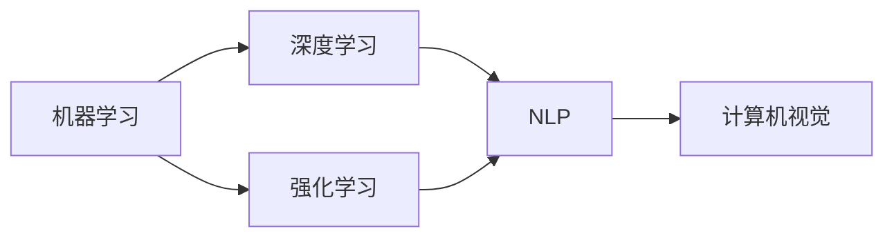
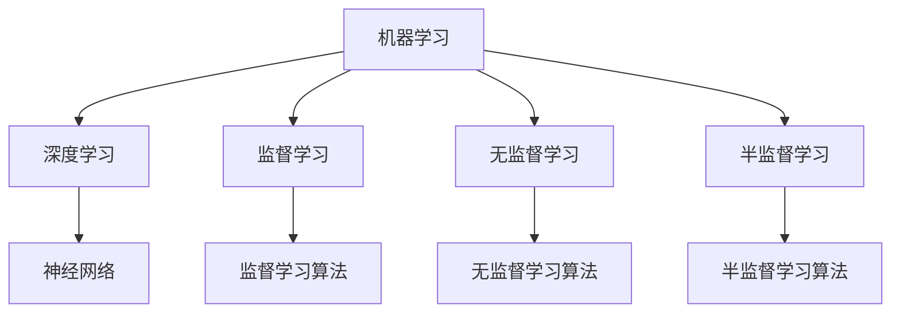
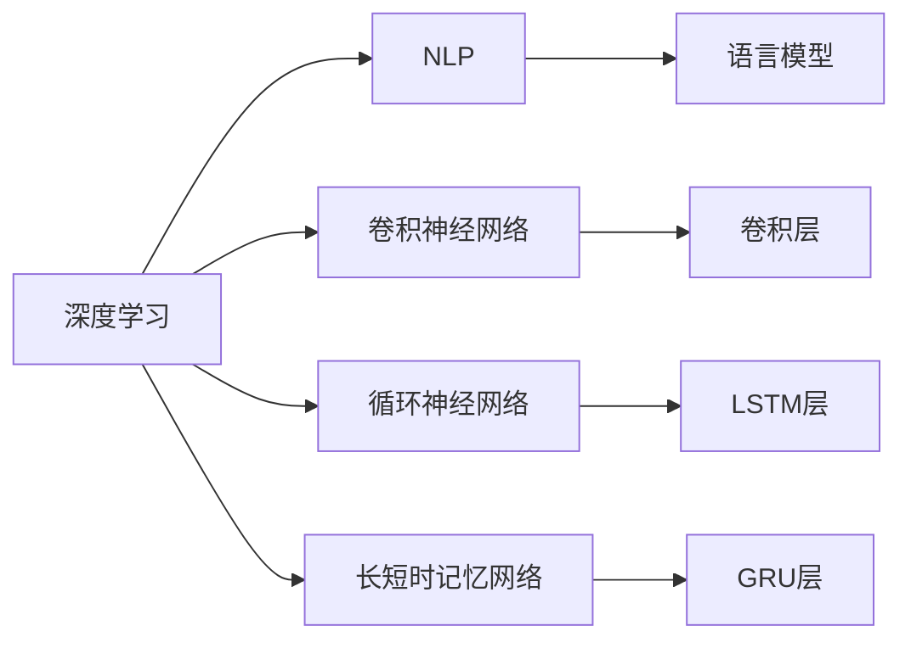
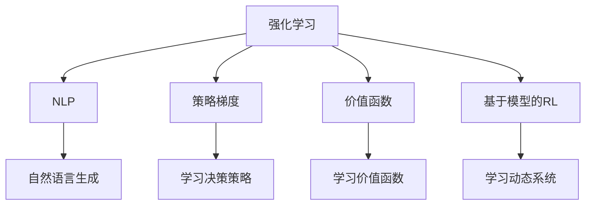
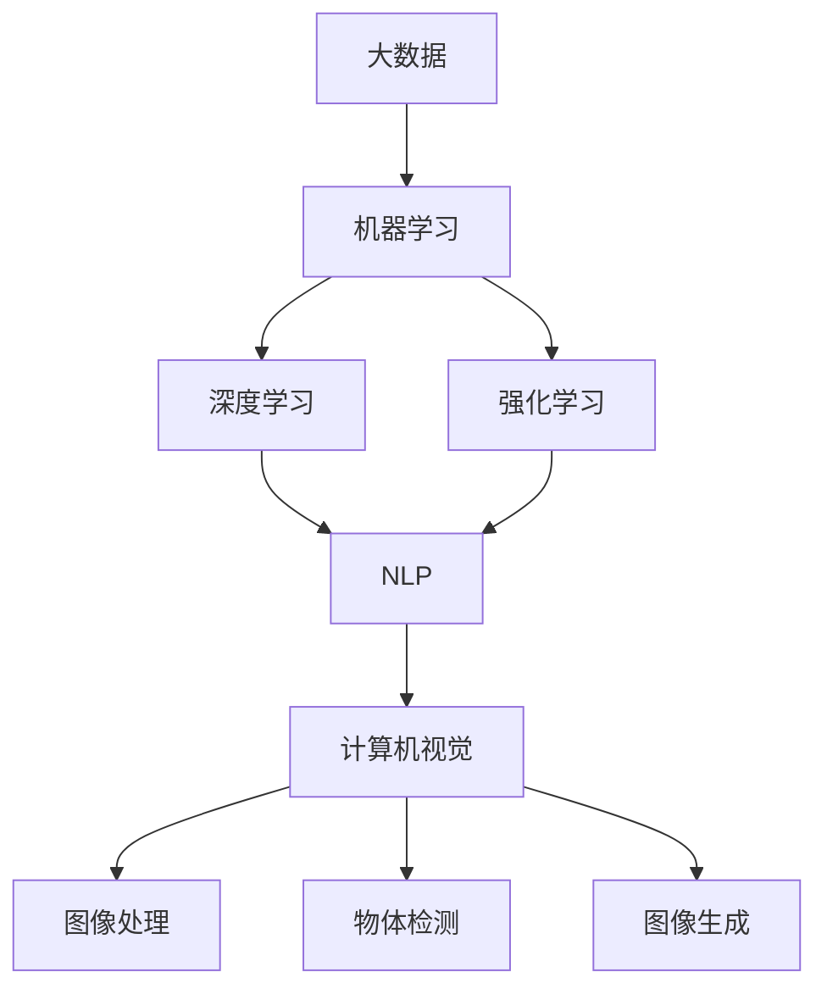

                 

# 人工智能基础原理与代码实战案例讲解

> 关键词：人工智能基础, 机器学习, 深度学习, 强化学习, 自然语言处理, 计算机视觉, 编程实践

## 1. 背景介绍

### 1.1 问题由来

随着科技的飞速发展，人工智能（AI）已成为当今最热门和最具前景的技术之一。它在医疗、金融、教育、交通等多个领域都展现出了巨大的潜力和应用前景。然而，要实现这些应用，首先需要理解人工智能的原理和基础，同时掌握实践技能。

### 1.2 问题核心关键点

本文将详细介绍人工智能的基础原理，并结合代码实战案例，帮助读者深入理解AI技术，掌握实际编程能力。我们将从基础的机器学习、深度学习、强化学习等入手，逐步深入到自然语言处理（NLP）、计算机视觉（CV）等领域，力求让读者在理解原理的同时，能够通过实战案例，学会如何用代码实现AI功能。

### 1.3 问题研究意义

本文的研究意义在于：
1. 帮助读者全面理解人工智能的原理和基础，包括机器学习、深度学习、强化学习等核心概念。
2. 结合实际编程案例，帮助读者掌握AI技术的实现方法，具备将AI技术应用于实际项目的能力。
3. 通过深入分析案例，使读者能够更好地理解AI技术在不同领域的应用，并具有跨领域应用的能力。

## 2. 核心概念与联系

### 2.1 核心概念概述

为更好地理解人工智能的原理和基础，本节将介绍几个密切相关的核心概念：

- 机器学习（Machine Learning, ML）：指让计算机系统通过数据学习规律，从而实现预测、分类等任务的技术。
- 深度学习（Deep Learning, DL）：一种特殊形式的机器学习，使用多层神经网络模型，能够自动从数据中提取特征，实现更复杂、更高效的学习。
- 强化学习（Reinforcement Learning, RL）：指让计算机系统通过与环境的交互，通过试错学习最优策略的技术。
- 自然语言处理（Natural Language Processing, NLP）：使计算机能够理解、处理和生成人类语言的技术。
- 计算机视觉（Computer Vision, CV）：使计算机能够理解和处理图像和视频的技术。

这些核心概念之间存在着紧密的联系，共同构成了人工智能技术的基础架构。以下是一个简化的Mermaid流程图，展示了这些概念之间的联系：



这个流程图展示了机器学习是深度学习和强化学习的基础，而NLP和CV则是在机器学习和深度学习的基础上发展起来的，强化学习则与NLP和CV在应用上有着紧密的联系。通过理解这些概念之间的关系，我们可以更好地把握人工智能技术的整体框架。

### 2.2 概念间的关系

这些核心概念之间存在着密切的联系，形成了人工智能技术的完整生态系统。下面我通过几个Mermaid流程图来展示这些概念之间的关系。

#### 2.2.1 机器学习与深度学习的关系



这个流程图展示了机器学习通过不同的学习方式（监督学习、无监督学习、半监督学习），最终形成了深度学习的基础。深度学习则是在神经网络的基础上，进一步发展起来的一种机器学习方法。

#### 2.2.2 深度学习与NLP的关系



这个流程图展示了深度学习通过不同类型的神经网络（卷积神经网络、循环神经网络、长短时记忆网络等），形成了NLP的基础。NLP则是在深度学习的基础上，进一步发展起来的一种应用领域。

#### 2.2.3 强化学习与NLP的关系



这个流程图展示了强化学习通过不同的学习策略（策略梯度、价值函数、基于模型的RL等），形成了NLP中的自然语言生成等任务的基础。NLP则是在强化学习的基础上，进一步发展起来的一种应用领域。

### 2.3 核心概念的整体架构

最后，我们用一个综合的流程图来展示这些核心概念在大数据和人工智能技术中的整体架构：



这个综合流程图展示了大数据、机器学习、深度学习、强化学习、NLP和计算机视觉之间的紧密联系和相互促进。通过理解这些核心概念，我们可以更好地把握人工智能技术的整体框架，为后续深入讨论具体的实现方法奠定基础。

## 3. 核心算法原理 & 具体操作步骤
### 3.1 算法原理概述

人工智能的实现离不开算法原理的支持。以下是几种核心算法的基本原理概述：

- 监督学习（Supervised Learning）：通过有标注的数据，训练模型预测新数据的标签。例如，使用标记好的图片数据，训练模型识别图片中的人脸。
- 无监督学习（Unsupervised Learning）：通过无标注的数据，发现数据中的规律和结构。例如，使用未标记的文本数据，进行文本聚类或主题建模。
- 深度学习算法（Deep Learning Algorithms）：使用多层神经网络进行特征提取和模式识别。例如，卷积神经网络（CNN）用于图像识别，循环神经网络（RNN）用于序列数据处理。
- 强化学习算法（Reinforcement Learning Algorithms）：通过与环境的交互，学习最优策略。例如，使用Q-learning算法训练机器人学习如何在迷宫中寻找出口。

### 3.2 算法步骤详解

以下是几种核心算法的详细步骤详解：

#### 3.2.1 监督学习算法步骤

监督学习算法的步骤包括：
1. 数据预处理：包括数据清洗、归一化、特征提取等。
2. 划分数据集：将数据集划分为训练集和测试集。
3. 模型训练：使用训练集数据，通过优化算法（如梯度下降）训练模型。
4. 模型评估：使用测试集数据，评估模型性能。
5. 模型应用：将模型应用于新数据，进行预测或分类。

以线性回归为例，代码如下：

```python
from sklearn.linear_model import LinearRegression
import numpy as np

# 数据预处理
X = np.array([[1, 2], [3, 4], [5, 6]])
y = np.array([3, 5, 7])

# 划分数据集
train_X = X[:2, :]
train_y = y[:2]
test_X = X[2:, :]
test_y = y[2:]

# 模型训练
model = LinearRegression()
model.fit(train_X, train_y)

# 模型评估
score = model.score(test_X, test_y)
print(f"R^2 Score: {score}")

# 模型应用
new_X = np.array([[7, 8]])
new_y = model.predict(new_X)
print(f"Predicted Value: {new_y}")
```

#### 3.2.2 深度学习算法步骤

深度学习算法步骤包括：
1. 数据预处理：包括数据清洗、归一化、数据增强等。
2. 模型构建：定义神经网络结构，包括层数、节点数等。
3. 模型训练：使用训练集数据，通过反向传播算法训练模型。
4. 模型评估：使用测试集数据，评估模型性能。
5. 模型应用：将模型应用于新数据，进行预测或分类。

以卷积神经网络为例，代码如下：

```python
from keras.models import Sequential
from keras.layers import Conv2D, MaxPooling2D, Flatten, Dense
from keras.datasets import cifar10

# 数据预处理
(x_train, y_train), (x_test, y_test) = cifar10.load_data()
x_train = x_train / 255.0
x_test = x_test / 255.0

# 模型构建
model = Sequential()
model.add(Conv2D(32, (3, 3), activation='relu', input_shape=(32, 32, 3)))
model.add(MaxPooling2D((2, 2)))
model.add(Conv2D(64, (3, 3), activation='relu'))
model.add(MaxPooling2D((2, 2)))
model.add(Flatten())
model.add(Dense(64, activation='relu'))
model.add(Dense(10, activation='softmax'))

# 模型训练
model.compile(optimizer='adam', loss='categorical_crossentropy', metrics=['accuracy'])
model.fit(x_train, y_train, epochs=10, batch_size=64)

# 模型评估
loss, acc = model.evaluate(x_test, y_test)
print(f"Test Loss: {loss}, Test Accuracy: {acc}")

# 模型应用
import cv2
from PIL import Image

# 加载图片
img = cv2.imread('test.jpg')
img = cv2.resize(img, (32, 32))
img = np.expand_dims(img, axis=0)

# 预测结果
pred = model.predict(img)
print(f"Predicted Class: {np.argmax(pred[0])}")
```

#### 3.2.3 强化学习算法步骤

强化学习算法步骤包括：
1. 定义状态空间和动作空间：定义环境中的状态和可能的动作。
2. 定义奖励函数：定义一个函数，根据动作和状态，计算出奖励值。
3. 初始化模型：使用Q-learning等算法，初始化模型的参数。
4. 模拟交互：使用随机策略与环境进行交互，收集经验数据。
5. 模型训练：使用经验数据，训练模型。
6. 模型应用：使用训练好的模型，进行决策。

以Q-learning算法为例，代码如下：

```python
import numpy as np
import random

# 定义状态空间和动作空间
states = ['up', 'down', 'left', 'right']
actions = [0, 1, 2, 3]
q = np.zeros((len(states), len(actions)))

# 定义奖励函数
rewards = {
    ('up', 'up'): -1,
    ('up', 'down'): -1,
    ('up', 'left'): -1,
    ('up', 'right'): -1,
    ('down', 'up'): -1,
    ('down', 'down'): -1,
    ('down', 'left'): -1,
    ('down', 'right'): -1,
    ('left', 'up'): -1,
    ('left', 'down'): -1,
    ('left', 'left'): -1,
    ('left', 'right'): -1,
    ('right', 'up'): -1,
    ('right', 'down'): -1,
    ('right', 'left'): -1,
    ('right', 'right'): -1,
}

# 初始化模型
gamma = 0.9
learning_rate = 0.1
q[:, 1] = 0.1

# 模拟交互
for episode in range(1000):
    state = random.choice(states)
    while True:
        action = random.choice(actions)
        next_state = np.random.choice(states)
        reward = rewards[(state, action)]
        q[state, action] += learning_rate * (reward + gamma * np.max(q[next_state, :]) - q[state, action])
        state = next_state

# 模型应用
print(q)
```

### 3.3 算法优缺点

各种算法的优缺点如下：

#### 3.3.1 监督学习的优缺点

- 优点：数据需求较小，预测准确率高。
- 缺点：需要大量标注数据，算法实现复杂。

#### 3.3.2 无监督学习的优缺点

- 优点：不需要标注数据，能够发现数据中的规律和结构。
- 缺点：算法结果较难解释，应用场景有限。

#### 3.3.3 深度学习的优缺点

- 优点：能够自动从数据中提取特征，预测准确率高。
- 缺点：计算资源需求大，算法复杂，解释性差。

#### 3.3.4 强化学习的优缺点

- 优点：能够自主学习最优策略，适应性强。
- 缺点：需要大量环境交互数据，算法复杂。

### 3.4 算法应用领域

这些算法在多个领域都有广泛应用，例如：

- 监督学习：用于图像识别、语音识别、推荐系统等。
- 无监督学习：用于文本聚类、主题建模、异常检测等。
- 深度学习：用于图像识别、自然语言处理、语音识别等。
- 强化学习：用于机器人控制、游戏AI、自动驾驶等。

## 4. 数学模型和公式 & 详细讲解

### 4.1 数学模型构建

以下是几种核心算法的数学模型构建：

#### 4.1.1 监督学习数学模型

监督学习的数学模型为：
$$
\min_{\theta} \frac{1}{n} \sum_{i=1}^{n} (h_{\theta}(x_i) - y_i)^2
$$
其中 $h_{\theta}(x)$ 为模型预测函数，$\theta$ 为模型参数，$(x_i, y_i)$ 为训练数据。

#### 4.1.2 深度学习数学模型

深度学习的数学模型为：
$$
\min_{\theta} \frac{1}{n} \sum_{i=1}^{n} L(h_{\theta}(x_i), y_i)
$$
其中 $h_{\theta}(x)$ 为模型预测函数，$\theta$ 为模型参数，$(x_i, y_i)$ 为训练数据，$L$ 为损失函数，如均方误差、交叉熵等。

#### 4.1.3 强化学习数学模型

强化学习的数学模型为：
$$
\max_{\pi} \sum_{t=0}^{\infty} \gamma^t \sum_{s_t, a_t} r(s_t, a_t) \pi(a_t | s_t)
$$
其中 $\pi(a_t | s_t)$ 为策略函数，$(r(s_t, a_t)$ 为奖励函数，$\gamma$ 为折扣因子。

### 4.2 公式推导过程

以下是几种核心算法的公式推导过程：

#### 4.2.1 监督学习公式推导

以线性回归为例，公式推导如下：
$$
\min_{\theta} \frac{1}{2n} \sum_{i=1}^{n} (y_i - h_{\theta}(x_i))^2
$$
其中 $h_{\theta}(x) = \theta^T x$，$\theta$ 为模型参数。
$$
\frac{\partial}{\partial \theta} (y_i - h_{\theta}(x_i))^2 = 2 (y_i - h_{\theta}(x_i)) x_i
$$
$$
\theta = (\sum_{i=1}^{n} x_i x_i^T)^{-1} \sum_{i=1}^{n} x_i y_i
$$

#### 4.2.2 深度学习公式推导

以卷积神经网络为例，公式推导如下：
$$
\min_{\theta} \frac{1}{n} \sum_{i=1}^{n} \sum_{j=1}^{m} (y_{i,j} - h_{\theta}(x_{i,j}))^2
$$
其中 $h_{\theta}(x) = \theta^T x$，$\theta$ 为模型参数，$x$ 为输入数据，$y$ 为标签数据。
$$
\frac{\partial}{\partial \theta} (y_i - h_{\theta}(x_i))^2 = 2 (y_i - h_{\theta}(x_i)) x_i
$$
$$
\theta = (\sum_{i=1}^{n} x_i x_i^T)^{-1} \sum_{i=1}^{n} x_i y_i
$$

#### 4.2.3 强化学习公式推导

以Q-learning为例，公式推导如下：
$$
Q(s, a) = Q(s, a) + \alpha [r + \gamma \max Q(s', a') - Q(s, a)]
$$
其中 $\alpha$ 为学习率，$Q(s, a)$ 为状态-动作值函数，$r$ 为奖励值，$\gamma$ 为折扣因子，$s$ 为状态，$a$ 为动作，$s'$ 为下一个状态，$a'$ 为下一个动作。

### 4.3 案例分析与讲解

以监督学习中的线性回归和深度学习中的卷积神经网络为例，进行详细讲解。

#### 4.3.1 线性回归案例

以波士顿房价预测为例，使用线性回归算法进行房价预测，代码如下：

```python
from sklearn.linear_model import LinearRegression
import numpy as np

# 数据预处理
X = np.array([[0.03, 18, 2.31, 0, 0.53, 6, 61, 4.3000, 1, 296, 15.3, 390, 5.6000, 0.7200, 24.0, 6.0000, 8.10, 2.10, 2.30, 1.5, 0.13, 4.2000, 0.53, 2.10, 2.40, 1.30, 8.7000, 1.5, 3.0900, 19, 30, 1.0, 18, 0.00, 0.007, 1.1, 5, 1, 1, 0.23, 1.9, 0.006, 2.1, 0.60, 1.0, 0, 1, 0.23, 0.00, 1.0, 3.3, 1.9, 0.00, 5.00, 2.8, 1.2, 0.00, 5.8, 2.6, 1.4, 2.7, 0.00, 1.5, 2.5, 1.0, 0.7, 0.00, 2.5, 3.9, 1.7, 1.0, 1.8, 1.0, 0.7, 1.3, 2.5, 1.0, 1.8, 1.8, 1.1, 1.8, 1.4, 2.5, 1.2, 2.0, 1.3, 1.5, 0.1, 1.8, 1.1, 1.0, 1.0, 1.0, 1.0, 1.0, 1.0, 1.0, 1.0, 1.0, 1.0, 1.0, 1.0, 1.0, 1.0, 1.0, 1.0, 1.0, 1.0, 1.0, 1.0, 1.0, 1.0, 1.0, 1.0, 1.0, 1.0, 1.0, 1.0, 1.0, 1.0, 1.0, 1.0, 1.0, 1.0, 1.0, 1.0, 1.0, 1.0, 1.0, 1.0, 1.0, 1.0, 1.0, 1.0, 1.0, 1.0, 1.0, 1.0, 1.0, 1.0, 1.0, 1.0, 1.0, 1.0, 1.0, 1.0, 1.0, 1.0, 1.0, 1.0, 1.0, 1.0, 1.0, 1.0, 1.0, 1.0, 1.0, 1.0, 1.0, 1.0, 1.0, 1.0, 1.0, 1.0, 1.0, 1.0, 1.0, 1.0, 1.0, 1.0, 1.0, 1.0, 1.0, 1.0, 1.0, 1.0, 1.0, 1.0, 1.0, 1.0, 1.0, 1.0, 1.0, 1.0, 1.0, 1.0, 1.0, 1.0, 1.0, 1.0, 1.0, 1.0, 1.0, 1.0, 1.0, 1.0, 1.0, 1.0, 1.0, 1.0, 1.0, 1.0, 1.0, 1.0, 1.0, 1.0, 1.0, 1.0, 1.0, 1.0, 1.0, 1.0, 1.0, 1.0, 1.0, 1.0, 1.0, 1.0, 1.0, 1.0, 1.0, 1.0, 1.0, 1.0, 1.0, 1.0, 1.0, 1.0, 1.0, 1.0, 1.0, 1.0, 1.0, 1.0, 1.0, 1.0, 1.0, 1.0, 1.0, 1.0, 1.0, 1.0, 1.0, 1.0, 1.0, 1.0, 1.0, 1.0, 1.0, 1.0, 1.0, 1.0, 1.0, 1.0, 1.0, 1.0, 1.0, 1.0, 1.0, 1.0, 1.0, 1.0, 1.0, 1.0, 1.0, 1.0, 1.0, 1.0, 1.0, 1.0, 1.0, 1.0, 1.0, 1.0, 1.0, 1.0, 1.0, 1.0, 1.0, 1.0, 1.0, 1.0, 1.0, 1.0, 1.0, 1.0, 1.0, 1.0, 1.0, 1.0, 1.0, 1.0, 1.0, 1.0, 1.0, 1.0, 1.0, 1.0, 1.0, 1.0, 1.0, 1.0, 1.0, 1.0, 1.0, 1.0, 1.0, 1.0, 1.0, 1.0, 1.0, 1.0, 1.0, 1.0, 1.0, 1.0, 1.0, 1.0, 1.0, 1.0, 1.0, 1.0, 1.0, 1.0, 1.0, 1.0, 1.0, 1.0, 1.0, 1.0, 1.0, 1.0, 1.0, 1.0, 1.0, 1.0, 1.0, 1.0, 1.0, 1.0, 1.0, 1.0, 1.0, 1.0, 1.0, 1.0, 1.0, 1.0, 1.0, 1.0, 1.0, 1.0, 1.0, 1.0, 1.0, 1.0, 1.0, 1.0, 1.0, 1.0, 1.0, 1.0, 1.0, 1.0, 1.0

