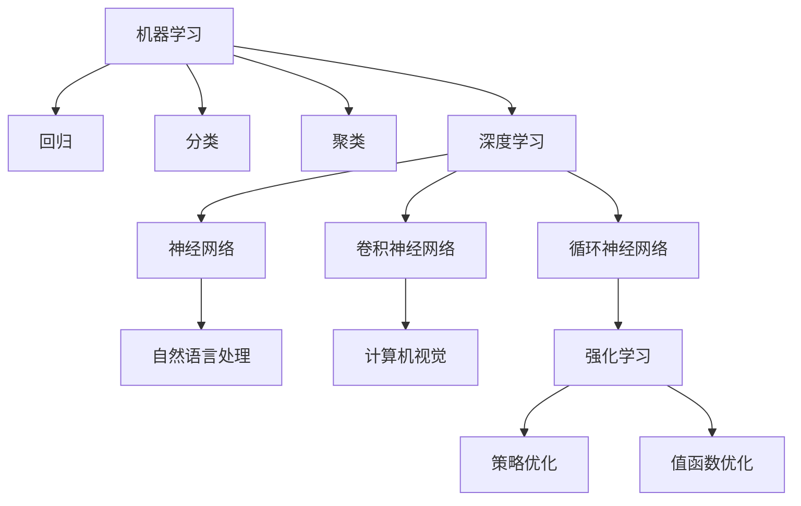
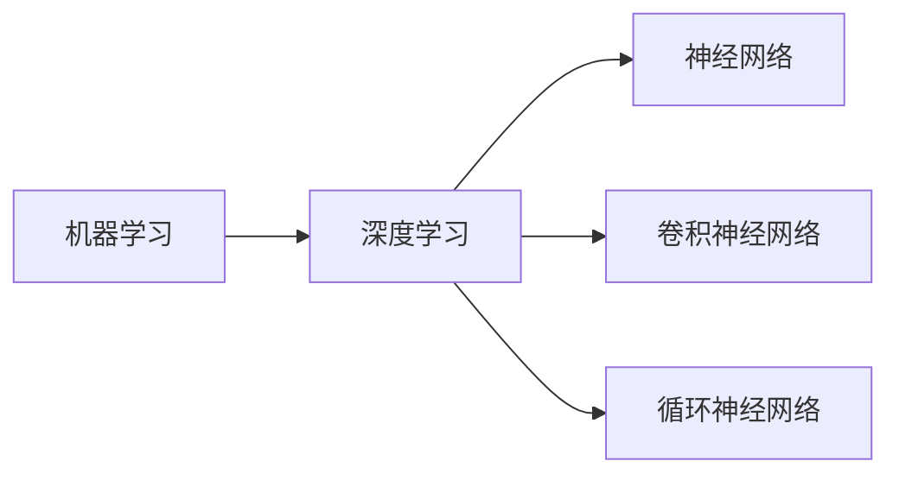
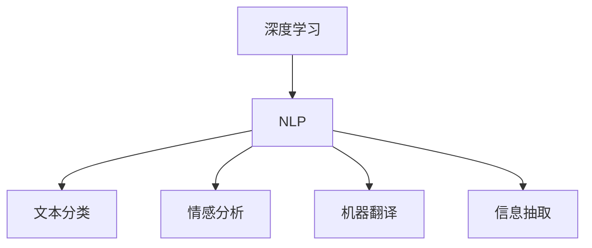
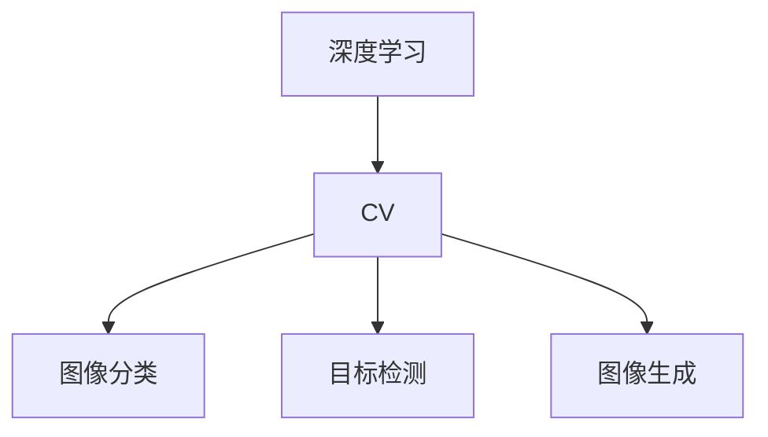
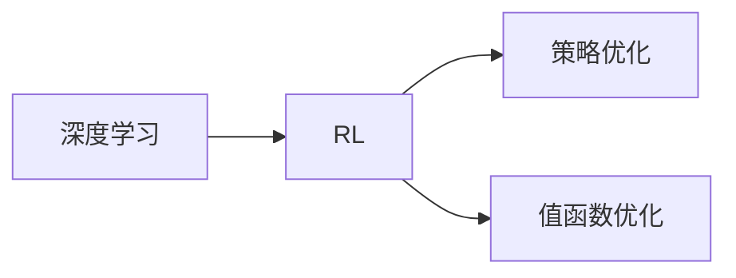
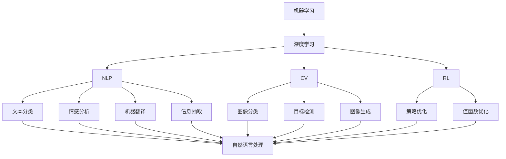

                 

# 人工智能导论原理与代码实战案例讲解

> 关键词：人工智能,导论,原理,代码实战,深度学习,机器学习,自然语言处理(NLP),计算机视觉(CV),强化学习(RL),数据挖掘,案例讲解

## 1. 背景介绍

### 1.1 问题由来
人工智能（Artificial Intelligence, AI）已经成为引领技术发展的热门领域，涵盖机器学习、深度学习、自然语言处理（NLP）、计算机视觉（CV）、强化学习（RL）等多个分支。理解这些核心技术及其应用，对于人工智能领域的研究者和实践者至关重要。本文将通过导论的形式，深入浅出地阐述人工智能的核心概念、原理和实现方法，并通过实际案例讲解，帮助读者更好地掌握人工智能技术。

### 1.2 问题核心关键点
本文将重点介绍以下几个核心概念：

- 机器学习（Machine Learning, ML）：通过数据驱动的算法，使计算机系统能够从经验中学习和改进。
- 深度学习（Deep Learning, DL）：一种特殊的机器学习方法，通过多层次神经网络模型进行复杂模式识别和预测。
- 自然语言处理（NLP）：研究计算机如何理解和生成人类语言。
- 计算机视觉（CV）：研究计算机如何从图像和视频中提取有价值的信息。
- 强化学习（RL）：通过智能体与环境的交互，学习最优决策策略。

这些概念构成了人工智能领域的基础框架，理解和掌握它们，对于解决实际问题具有重要意义。

### 1.3 问题研究意义
深入理解人工智能的原理与实践，能够帮助研究人员和开发者更好地设计、实现和优化AI系统，加速AI技术的产业化进程。通过掌握核心算法和技术，可以构建高效、稳定、可扩展的AI应用，为各行各业带来智能化升级。此外，深入研究人工智能的技术原理和应用案例，有助于提升公众对AI技术的理解和接受度，促进AI技术的社会应用。

## 2. 核心概念与联系

### 2.1 核心概念概述

为更好地理解人工智能的核心概念，本节将介绍几个关键概念：

- **机器学习**：通过数据驱动的算法，使计算机系统能够从经验中学习和改进。常见的算法包括回归、分类、聚类等。
- **深度学习**：一种特殊的机器学习方法，通过多层次神经网络模型进行复杂模式识别和预测。深度学习的核心是多层神经网络的组合。
- **自然语言处理**：研究计算机如何理解和生成人类语言。NLP技术包括文本分类、信息抽取、机器翻译、情感分析等。
- **计算机视觉**：研究计算机如何从图像和视频中提取有价值的信息。CV技术包括图像分类、目标检测、图像生成等。
- **强化学习**：通过智能体与环境的交互，学习最优决策策略。常见的应用包括游戏AI、机器人控制、推荐系统等。

这些核心概念之间的逻辑关系可以通过以下Mermaid流程图来展示：

这个流程图展示了大语言模型的核心概念及其之间的关系：

1. 机器学习是所有AI技术的基础，包括深度学习、NLP、CV、RL等。
2. 深度学习是机器学习的一种高级形式，通过多层次神经网络模型进行复杂模式的识别和预测。
3. NLP、CV、RL等技术，均基于深度学习技术构建。
4. NLP、CV、RL等技术各具特色，分别用于处理语言、图像、智能决策等问题。
5. 深度学习、NLP、CV、RL等技术相互交织，共同推动AI技术的发展。

### 2.2 概念间的关系

这些核心概念之间存在着紧密的联系，形成了AI技术的应用生态系统。下面我通过几个Mermaid流程图来展示这些概念之间的关系。

#### 2.2.1 机器学习与深度学习的关系

这个流程图展示了机器学习与深度学习的关系。深度学习是机器学习的一种高级形式，通过多层次神经网络模型进行复杂模式的识别和预测。

#### 2.2.2 深度学习与自然语言处理的关系

这个流程图展示了深度学习与自然语言处理的关系。深度学习技术广泛应用于文本分类、情感分析、机器翻译、信息抽取等NLP任务中。

#### 2.2.3 计算机视觉与深度学习的关系

这个流程图展示了计算机视觉与深度学习的关系。深度学习技术广泛应用于图像分类、目标检测、图像生成等CV任务中。

#### 2.2.4 强化学习与深度学习的关系

这个流程图展示了强化学习与深度学习的关系。深度学习技术在策略优化、值函数优化等强化学习任务中得到广泛应用。

### 2.3 核心概念的整体架构

最后，我们用一个综合的流程图来展示这些核心概念在大语言模型微调过程中的整体架构：

这个综合流程图展示了从机器学习到深度学习，再到NLP、CV、RL等技术的整体架构。

## 3. 核心算法原理 & 具体操作步骤
### 3.1 算法原理概述

人工智能的核心算法包括机器学习、深度学习、自然语言处理、计算机视觉和强化学习。下面将对每一种核心算法进行原理概述。

#### 3.1.1 机器学习原理

机器学习是通过数据驱动的算法，使计算机系统能够从经验中学习和改进。常见的机器学习算法包括回归、分类、聚类等。回归模型通过学习输入与输出之间的关系，预测连续的数值型输出。分类模型通过学习输入与输出的关系，将输入数据分类到不同的类别中。聚类模型通过学习输入数据的内在结构，将输入数据分成不同的群组。

#### 3.1.2 深度学习原理

深度学习是一种特殊的机器学习方法，通过多层次神经网络模型进行复杂模式识别和预测。深度学习模型的核心是多层次神经网络的组合。每一层神经网络都通过权重和偏置的调整，学习输入数据的特征表示。随着层数的增加，深度学习模型能够捕捉更加抽象和复杂的特征，从而提高预测精度。

#### 3.1.3 自然语言处理原理

自然语言处理研究计算机如何理解和生成人类语言。NLP技术包括文本分类、信息抽取、机器翻译、情感分析等。文本分类通过学习文本的特征，将文本分类到不同的类别中。信息抽取通过学习文本的结构，抽取文本中的关键信息。机器翻译通过学习源语言和目标语言之间的关系，实现文本的自动翻译。情感分析通过学习文本的情感特征，判断文本的情感倾向。

#### 3.1.4 计算机视觉原理

计算机视觉研究计算机如何从图像和视频中提取有价值的信息。CV技术包括图像分类、目标检测、图像生成等。图像分类通过学习图像的特征，将图像分类到不同的类别中。目标检测通过学习图像的结构，检测图像中的目标物体。图像生成通过学习图像的特征，生成新的图像。

#### 3.1.5 强化学习原理

强化学习通过智能体与环境的交互，学习最优决策策略。常见的强化学习算法包括Q-learning、策略优化、值函数优化等。Q-learning通过学习状态-动作-奖励之间的关系，学习最优的动作策略。策略优化通过学习策略函数的参数，学习最优的策略函数。值函数优化通过学习状态-奖励之间的关系，学习最优的价值函数。

### 3.2 算法步骤详解

#### 3.2.1 机器学习算法步骤

1. **数据预处理**：对原始数据进行清洗、归一化、特征提取等预处理操作，以便于模型学习。
2. **模型选择**：选择适合的机器学习模型，如回归模型、分类模型、聚类模型等。
3. **模型训练**：使用训练数据训练模型，调整模型参数以最小化损失函数。
4. **模型评估**：使用测试数据评估模型的性能，判断模型是否满足要求。
5. **模型应用**：将训练好的模型应用于实际问题中，进行预测或分类。

#### 3.2.2 深度学习算法步骤

1. **数据预处理**：对原始数据进行清洗、归一化、特征提取等预处理操作。
2. **模型构建**：构建深度学习模型，包括选择网络结构、确定损失函数等。
3. **模型训练**：使用训练数据训练模型，调整模型参数以最小化损失函数。
4. **模型评估**：使用测试数据评估模型的性能，判断模型是否满足要求。
5. **模型应用**：将训练好的模型应用于实际问题中，进行预测或分类。

#### 3.2.3 自然语言处理算法步骤

1. **数据预处理**：对原始文本进行清洗、分词、标记化等预处理操作。
2. **模型选择**：选择适合的NLP模型，如文本分类模型、信息抽取模型、机器翻译模型等。
3. **模型训练**：使用训练数据训练模型，调整模型参数以最小化损失函数。
4. **模型评估**：使用测试数据评估模型的性能，判断模型是否满足要求。
5. **模型应用**：将训练好的模型应用于实际问题中，进行文本分类、信息抽取、机器翻译等任务。

#### 3.2.4 计算机视觉算法步骤

1. **数据预处理**：对原始图像进行清洗、归一化、特征提取等预处理操作。
2. **模型选择**：选择适合的CV模型，如图像分类模型、目标检测模型、图像生成模型等。
3. **模型训练**：使用训练数据训练模型，调整模型参数以最小化损失函数。
4. **模型评估**：使用测试数据评估模型的性能，判断模型是否满足要求。
5. **模型应用**：将训练好的模型应用于实际问题中，进行图像分类、目标检测、图像生成等任务。

#### 3.2.5 强化学习算法步骤

1. **环境设定**：设定智能体与环境交互的环境，包括状态、动作、奖励等。
2. **策略选择**：选择适合的强化学习策略，如策略优化、值函数优化等。
3. **模型训练**：使用训练数据训练模型，调整策略函数的参数以最大化累积奖励。
4. **模型评估**：使用测试数据评估模型的性能，判断模型是否满足要求。
5. **模型应用**：将训练好的模型应用于实际问题中，进行智能决策。

### 3.3 算法优缺点

#### 3.3.1 机器学习算法优缺点

**优点**：
- 适用于处理结构化数据，能够自动学习数据的内在规律。
- 模型简单易懂，易于理解和实现。
- 具有较高的预测精度和稳定性。

**缺点**：
- 需要大量标注数据，数据获取成本较高。
- 模型复杂度较低，难以处理复杂模式。
- 需要手动选择特征，可能遗漏重要特征。

#### 3.3.2 深度学习算法优缺点

**优点**：
- 适用于处理非结构化数据，能够自动学习数据的内在规律。
- 模型复杂度高，能够处理复杂模式。
- 具有较高的预测精度和稳定性。

**缺点**：
- 需要大量标注数据，数据获取成本较高。
- 模型复杂度高，训练和推理成本较高。
- 容易出现过拟合现象，需要复杂的正则化方法。

#### 3.3.3 自然语言处理算法优缺点

**优点**：
- 适用于处理文本数据，能够自动学习文本的内在规律。
- 模型复杂度高，能够处理复杂文本任务。
- 具有较高的预测精度和稳定性。

**缺点**：
- 需要大量标注数据，数据获取成本较高。
- 模型复杂度高，训练和推理成本较高。
- 容易出现过拟合现象，需要复杂的正则化方法。

#### 3.3.4 计算机视觉算法优缺点

**优点**：
- 适用于处理图像和视频数据，能够自动学习图像的内在规律。
- 模型复杂度高，能够处理复杂图像任务。
- 具有较高的预测精度和稳定性。

**缺点**：
- 需要大量标注数据，数据获取成本较高。
- 模型复杂度高，训练和推理成本较高。
- 容易出现过拟合现象，需要复杂的正则化方法。

#### 3.3.5 强化学习算法优缺点

**优点**：
- 适用于处理智能决策问题，能够自动学习最优决策策略。
- 模型复杂度高，能够处理复杂决策任务。
- 具有较高的决策精度和稳定性。

**缺点**：
- 需要大量标注数据，数据获取成本较高。
- 模型复杂度高，训练和推理成本较高。
- 容易出现过拟合现象，需要复杂的正则化方法。

### 3.4 算法应用领域

#### 3.4.1 机器学习应用领域

机器学习广泛应用于金融、医疗、电商、推荐系统等领域。例如，金融领域可以使用机器学习模型进行信用评估、风险预测等；医疗领域可以使用机器学习模型进行疾病诊断、治疗方案推荐等；电商领域可以使用机器学习模型进行商品推荐、价格预测等；推荐系统可以使用机器学习模型进行个性化推荐等。

#### 3.4.2 深度学习应用领域

深度学习广泛应用于语音识别、图像处理、自然语言处理等领域。例如，语音识别领域可以使用深度学习模型进行语音转文字、说话人识别等；图像处理领域可以使用深度学习模型进行图像分类、目标检测等；自然语言处理领域可以使用深度学习模型进行文本分类、信息抽取、机器翻译等。

#### 3.4.3 自然语言处理应用领域

自然语言处理广泛应用于文本分类、信息抽取、机器翻译、情感分析等领域。例如，文本分类领域可以使用自然语言处理模型进行情感分析、主题分类等；信息抽取领域可以使用自然语言处理模型进行实体识别、关系抽取等；机器翻译领域可以使用自然语言处理模型进行语言翻译、问答系统等；情感分析领域可以使用自然语言处理模型进行情感识别、用户反馈分析等。

#### 3.4.4 计算机视觉应用领域

计算机视觉广泛应用于图像分类、目标检测、图像生成等领域。例如，图像分类领域可以使用计算机视觉模型进行图像识别、物体检测等；目标检测领域可以使用计算机视觉模型进行行为分析、异常检测等；图像生成领域可以使用计算机视觉模型进行图像修复、生成图片等。

#### 3.4.5 强化学习应用领域

强化学习广泛应用于游戏AI、机器人控制、推荐系统等领域。例如，游戏AI领域可以使用强化学习模型进行游戏智能决策、路径规划等；机器人控制领域可以使用强化学习模型进行动作控制、路径规划等；推荐系统可以使用强化学习模型进行个性化推荐、广告投放等。

## 4. 数学模型和公式 & 详细讲解 & 举例说明

### 4.1 数学模型构建

为了更好地理解人工智能的核心算法，我们将通过数学模型和公式来详细讲解其工作原理。

#### 4.1.1 回归模型

回归模型通过学习输入与输出之间的关系，预测连续的数值型输出。常见的回归模型包括线性回归、多项式回归、岭回归等。

线性回归模型表示为：
$$
y = \theta_0 + \theta_1x_1 + \theta_2x_2 + \ldots + \theta_nx_n + \epsilon
$$
其中，$y$ 为输出变量，$x_1, x_2, \ldots, x_n$ 为输入变量，$\theta_0, \theta_1, \ldots, \theta_n$ 为模型参数，$\epsilon$ 为随机噪声。

#### 4.1.2 分类模型

分类模型通过学习输入与输出的关系，将输入数据分类到不同的类别中。常见的分类模型包括逻辑回归、支持向量机、决策树等。

逻辑回归模型表示为：
$$
P(y=1|x) = \frac{1}{1 + e^{-\theta_0 - \theta_1x_1 - \theta_2x_2 - \ldots - \theta_nx_n}}
$$
其中，$P(y=1|x)$ 为输入 $x$ 属于类别 1 的概率，$\theta_0, \theta_1, \ldots, \theta_n$ 为模型参数。

#### 4.1.3 聚类模型

聚类模型通过学习输入数据的内在结构，将输入数据分成不同的群组。常见的聚类模型包括K-means、层次聚类等。

K-means模型表示为：
$$
\min_{\mu_k} \sum_{x \in X} ||x - \mu_k||^2
$$
其中，$X$ 为输入数据集，$\mu_k$ 为聚类中心，$||.||$ 为欧式距离。

#### 4.1.4 神经网络模型

神经网络模型通过多层次神经网络的组合，进行复杂模式识别和预测。常见的神经网络模型包括全连接神经网络、卷积神经网络、循环神经网络等。

全连接神经网络表示为：
$$
y = f(Wx + b)
$$
其中，$x$ 为输入数据，$W$ 为权重矩阵，$b$ 为偏置向量，$f(.)$ 为激活函数。

卷积神经网络表示为：
$$
y = f(Wx + b)
$$
其中，$x$ 为输入数据，$W$ 为卷积核矩阵，$b$ 为偏置向量，$f(.)$ 为激活函数。

循环神经网络表示为：
$$
y = f(Wx + b)
$$
其中，$x$ 为输入数据，$W$ 为权重矩阵，$b$ 为偏置向量，$f(.)$ 为激活函数。

#### 4.1.5 强化学习模型

强化学习模型通过智能体与环境的交互，学习最优决策策略。常见的强化学习模型包括Q-learning、策略优化、值函数优化等。

Q-learning模型表示为：
$$
Q(s, a) = r + \gamma \max_{a'} Q(s', a')
$$
其中，$s$ 为状态，$a$ 为动作，$r$ 为奖励，$\gamma$ 为折扣因子，$s'$ 为下一状态，$a'$ 为下一动作。

策略优化模型表示为：
$$
\max_{\pi} \sum_{t=1}^{T} \mathbb{E}[r_t + \gamma \max_{a'} Q(s', a')]
$$
其中，$\pi$ 为策略函数，$T$ 为时间步，$r_t$ 为时间步 $t$ 的奖励，$s'$ 为下一状态，$a'$ 为下一动作。

值函数优化模型表示为：
$$
\max_{V} \sum_{t=1}^{T} \mathbb{E}[r_t + \gamma V(s') - V(s)]
$$
其中，$V$ 为值函数，$T$ 为时间步，$r_t$ 为时间步 $t$ 的奖励，$s'$ 为下一状态，$s$ 为当前状态。

### 4.2 公式推导过程

#### 4.2.1 回归模型推导

线性回归模型的最小二乘估计公式为：
$$
\theta = (X^TX)^{-1}X^Ty
$$
其中，$X$ 为输入数据矩阵，$y$ 为输出向量。

#### 4.2.2 分类模型推导

逻辑回归模型的最大似然估计公式为：
$$
\hat{y} = \frac{1}{1 + e^{-\theta_0 - \theta_1x_1 - \theta_2x_2 - \ldots - \theta_nx_n}}
$$
其中，$x_1, x_2, \ldots, x_n$ 为输入变量，$\theta_0, \theta_1, \ldots, \theta_n$ 为模型参数。

#### 4.2.3 聚类模型推导

K-means模型的聚类中心更新公式为：
$$
\mu_k = \frac{1}{N_k} \sum_{x_i \in X_k} x_i
$$
其中，$X_k$ 为第 $k$ 类聚类中心，$N_k$ 为第 $k$ 类数据点数量，$x_i$ 为数据点。

#### 4.2.4 神经网络模型推导

全连接神经网络的梯度下降公式为：
$$
\theta_{j} = \theta_{j} - \alpha \frac{\partial J}{\partial \theta_{j}}
$$
其中，$\theta_{j}$ 为第 $j$ 层的权重矩阵，$\alpha$ 为学习率，$J$ 为损失函数。

卷积神经网络的梯度下降公式为：
$$
\theta_{j} = \theta_{j} - \alpha \frac{\partial J}{\partial \theta_{j}}
$$
其中，$\theta_{j}$ 为第 $j$ 层的权重矩阵，$\alpha$ 为学习率，$J$ 为损失函数。

循环神经网络的梯度下降公式为：
$$
\theta_{j} = \theta_{j} - \alpha \frac{\partial J}{\partial \theta_{j}}
$$
其中，$\theta_{j}$ 为第 $j$ 层的权重矩阵，$\alpha$ 为学习率，$J$ 为损失函数。

#### 4.2.5 强化学习模型推导

Q-learning模型的更新公式为：
$$
Q(s, a) \leftarrow Q(s, a) + \alpha(r + \gamma \max_{a'} Q(s', a') - Q(s, a))
$$
其中，$s$ 为状态，$a$ 为动作，$r$ 为奖励，$\gamma$ 为折扣因子，$s'$ 为下一状态，$a'$ 为下一动作。

策略优化模型的更新公式为：
$$
\pi(a|s) \leftarrow \frac{\pi(a|s)}{\sum_{a'} \pi(a'|s)}
$$
其中，$\pi(a|s)$ 为动作 $a$ 在状态 $s$ 下的概率，$\sum_{a'} \pi(a'|s)$ 为状态 $s$ 下所有动作的概率和。

值函数优化模型的更新公式为：
$$
V(s) \leftarrow V(s) + \alpha(r + \gamma V(s') - V(s))
$$
其中，$V(s)$ 为状态 $s$ 下的值函数，$r$ 为状态 $s$ 的奖励，$s'$ 为下一状态。

### 4.3 案例分析与讲解

#### 4.3.1 机器学习案例

例如，在金融领域，可以使用机器学习模型进行信用评估。首先，收集历史用户的信用记录、行为数据等，构建输入特征。然后，构建线性回归模型，使用训练数据训练模型，调整模型参数以最小化损失函数。最后，使用测试数据评估模型性能，判断模型是否满足要求。最终，将训练好的模型应用于实际问题中，进行信用评估。

#### 4.3.2 深度学习案例

例如，在图像分类领域，可以使用深度学习模型进行图像识别。首先，收集图像数据集，构建输入特征。然后，构建卷积神经网络模型，使用训练数据训练模型，调整模型参数以最小化损失函数。最后，使用测试数据评估模型性能，判断模型是否满足要求。最终，将训练好的模型应用于实际问题中，进行图像分类。

#### 4.3.3 自然语言处理案例

例如，在情感分析领域，可以使用自然语言处理模型进行情感识别。首先，收集文本数据集，构建输入特征。然后，构建文本分类模型，使用训练数据训练模型，调整模型参数以最小化损失函数。最后，使用测试数据评估模型性能，判断模型是否满足要求。最终，将训练好的模型应用于实际问题中，进行情感识别。

#### 4.3.4 计算机视觉案例

例如，在目标检测领域，可以使用计算机视觉模型进行行为分析。首先，收集视频数据集，构建输入特征。然后，构建目标检测模型，使用训练数据训练模型，调整模型参数以最小化损失函数。最后，使用测试数据评估模型性能，判断模型是否满足要求。最终，将训练好的模型应用于实际问题中，进行行为分析。

#### 4.3.5 强化学习案例

例如，在游戏AI领域

