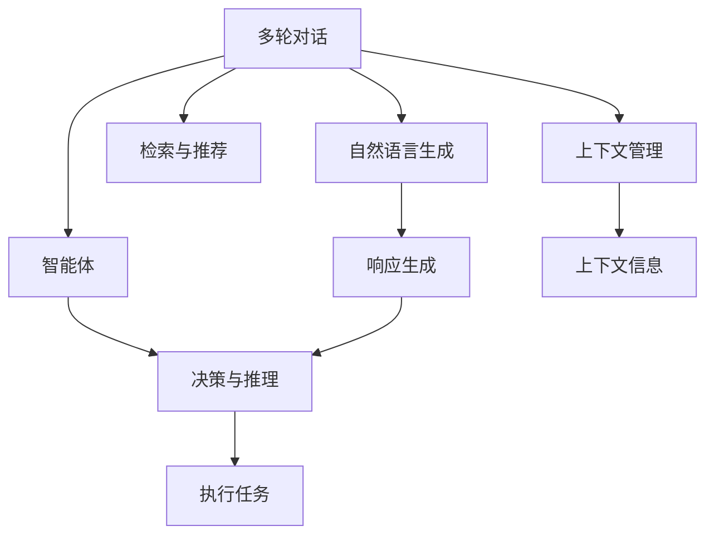
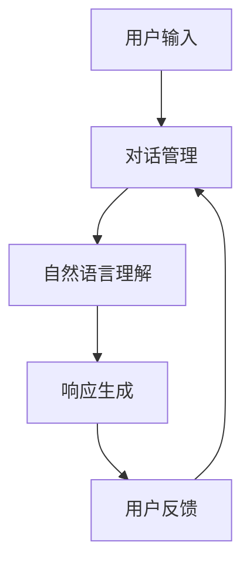
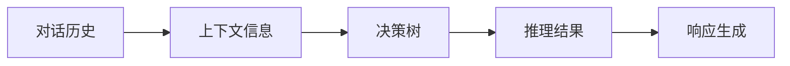
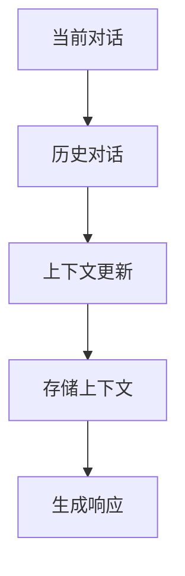
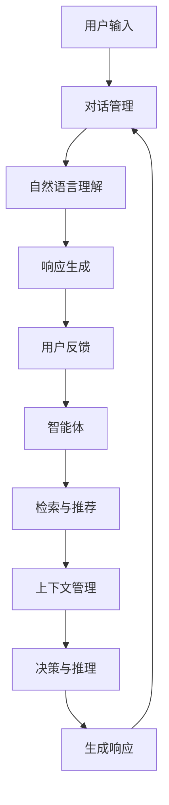

                 

# 从RAG到Agent的转变：多轮对话：与用户进行更深入的互动

> 关键词：多轮对话, 自然语言生成(NLG), 智能体(Agent), 检索与推荐, 上下文管理, 决策树, 案例分析, 应用场景, 未来展望, 工具推荐, 学习资源, 研究展望, 研究难点, 发展趋势

## 1. 背景介绍

### 1.1 问题由来
近年来，随着自然语言处理（NLP）技术的不断进步，智能对话系统（Chatbot）已经从简单的文本回复发展到具备多轮对话能力。从最初基于规则的响应机制，到基于统计学习（如RAG）的检索式响应生成，智能对话系统的互动深度和效果有了显著提升。然而，这些系统大多依赖于外部的知识库和检索引擎，难以自主生成高质量的对话内容。因此，如何在多轮对话中，实现与用户进行更深入的互动，成为当前研究的热点。

### 1.2 问题核心关键点
智能对话系统的多轮对话技术，核心在于如何有效地生成上下文相关的响应，并管理好对话的全局上下文。这需要解决以下几个关键问题：
1. **上下文管理**：如何在对话过程中，维护和更新上下文信息，确保每个响应都有足够的信息背景。
2. **内容生成**：如何基于上下文信息，生成自然流畅、富有逻辑性的响应。
3. **知识库查询**：如何高效检索和推荐相关信息，支持对话的深入互动。
4. **决策与推理**：如何根据对话内容，做出合理的决策和推理，引导对话的顺利进行。

### 1.3 问题研究意义
多轮对话技术的深入研究，对于构建智能对话系统、提升用户体验、推动AI技术在各行各业的应用具有重要意义：

1. **提升用户体验**：多轮对话使得对话系统能够进行更自然、更个性化的交流，满足用户的复杂需求，增强用户的粘性。
2. **降低开发成本**：通过多轮对话技术，对话系统可以自动生成响应内容，减少对人工编写的依赖，降低开发成本。
3. **促进AI应用**：多轮对话是AI技术应用的重要环节，能够为各行各业提供基础性技术支撑，推动AI技术的广泛落地。
4. **推动知识图谱发展**：多轮对话需要丰富的知识库支撑，推动了知识图谱技术的发展和应用。
5. **助力智能客服**：智能客服系统中，多轮对话技术能够提供更高效、更全面的服务，提升客户满意度。

## 2. 核心概念与联系

### 2.1 核心概念概述

为更好地理解多轮对话技术，本节将介绍几个密切相关的核心概念：

- **多轮对话（Multi-turn Dialogue）**：指在对话系统中，智能体与用户之间进行的多个回合的交互。相比单轮对话，多轮对话更注重上下文信息的管理和应用，使得对话更加深入和自然。
- **自然语言生成（NLG）**：指将结构化数据或知识转换为自然语言的过程。多轮对话中的响应生成，通常需要借助自然语言生成技术实现。
- **智能体（Agent）**：指能够自主决策、执行任务的虚拟角色。在多轮对话中，智能体需要根据对话历史和上下文信息，生成响应内容，并做出合理的决策。
- **检索与推荐**：多轮对话中，智能体需要从知识库中检索相关信息，并将其推荐给用户，以支持对话的深入互动。
- **上下文管理**：多轮对话需要管理好对话的全局上下文，确保每个响应都有足够的信息背景，提升对话的连贯性和流畅性。
- **决策树**：多轮对话中的决策过程，通常可以表示为一棵决策树，每个节点代表一个决策点，连接不同的响应生成路径。

这些核心概念之间的逻辑关系可以通过以下Mermaid流程图来展示：

这个流程图展示了大语言模型微调过程中各个核心概念的关系和作用：

1. 多轮对话技术需要借助自然语言生成技术，生成响应内容。
2. 智能体需要根据上下文信息和决策树进行推理，生成响应。
3. 检索与推荐技术用于支持对话的深入互动，从知识库中检索和推荐相关信息。
4. 上下文管理技术用于维护对话的全局上下文，确保每个响应都有足够的信息背景。

这些概念共同构成了多轮对话系统的技术架构，使其能够实现与用户进行更深入的互动。

### 2.2 概念间的关系

这些核心概念之间存在着紧密的联系，形成了多轮对话系统的完整生态系统。下面我通过几个Mermaid流程图来展示这些概念之间的关系。

#### 2.2.1 多轮对话的基本流程

这个流程图展示了多轮对话的基本流程：用户输入启动对话，对话系统进行自然语言理解，生成响应并返回给用户，用户根据响应进行反馈，对话系统继续循环进行。

#### 2.2.2 智能体的决策过程

这个流程图展示了智能体的决策过程：通过对话历史获取上下文信息，使用决策树进行推理，生成响应内容。

#### 2.2.3 上下文信息的维护

这个流程图展示了上下文信息的维护过程：通过对话历史更新当前对话的上下文信息，存储上下文信息，最后生成响应内容。

### 2.3 核心概念的整体架构

最后，我们用一个综合的流程图来展示这些核心概念在大语言模型微调过程中的整体架构：

这个综合流程图展示了从用户输入到响应生成的完整过程。对话系统通过自然语言理解获取用户意图，调用检索与推荐技术获取相关信息，通过上下文管理维护对话的全局上下文，最终由智能体根据决策树生成响应内容。

## 3. 核心算法原理 & 具体操作步骤
### 3.1 算法原理概述

多轮对话技术，本质上是通过智能体与用户之间的多次交互，实现信息的交换和上下文的维护。其核心算法原理可以概括为以下几个步骤：

1. **自然语言理解（NLU）**：将用户输入的文本转换为结构化的信息表示，以便后续的决策和推理。
2. **对话管理**：维护对话的全局上下文，确保每个响应都有足够的信息背景。
3. **检索与推荐**：根据对话历史和用户意图，从知识库中检索和推荐相关信息。
4. **自然语言生成（NLG）**：基于上下文信息和检索结果，生成自然流畅的响应内容。
5. **决策与推理**：根据对话内容，做出合理的决策和推理，引导对话的顺利进行。

### 3.2 算法步骤详解

多轮对话算法的详细步骤如下：

**Step 1: 用户输入处理**
- 接收用户输入的文本，进行分词、词性标注等预处理操作。
- 通过自然语言理解技术，将文本转换为结构化的信息表示，如意图、实体、上下文等。

**Step 2: 上下文管理**
- 维护对话的全局上下文，包括历史对话、用户意图、当前对话状态等。
- 根据新输入的信息，更新上下文信息，确保每个响应都有足够的信息背景。

**Step 3: 检索与推荐**
- 根据用户意图和上下文信息，从知识库中检索相关的实体、事件、规则等信息。
- 根据检索结果，推荐给用户相关的信息，支持对话的深入互动。

**Step 4: 自然语言生成**
- 基于上下文信息和检索结果，生成自然流畅的响应内容。
- 可以采用基于规则的方法，也可以使用基于统计学习的方法，如检索式响应生成、生成式响应生成等。

**Step 5: 用户反馈处理**
- 接收用户的反馈信息，进行分词、词性标注等预处理操作。
- 通过自然语言理解技术，将反馈信息转换为结构化的信息表示。
- 根据反馈信息，更新对话的全局上下文，重新进行下一轮对话。

### 3.3 算法优缺点

多轮对话算法具有以下优点：
1. 增强了对话的深度和连贯性，使得对话系统能够进行更自然、更个性化的交流。
2. 能够充分利用知识库和检索技术，支持对话的深入互动，提升用户体验。
3. 可以自主生成响应内容，减少对人工编写的依赖，降低开发成本。
4. 适用于多种场景，如客服、教育、娱乐等，具有广泛的应用前景。

同时，多轮对话算法也存在一些缺点：
1. 对知识库和检索技术依赖较大，需要构建丰富的知识库和高效的检索算法。
2. 需要维护对话的全局上下文，增加了系统的复杂性和计算开销。
3. 生成响应内容的质量和多样性依赖于自然语言生成技术，需要不断优化算法。
4. 用户意图识别和上下文理解可能会存在误差，影响对话的效果。

### 3.4 算法应用领域

多轮对话算法已经广泛应用于多个领域，如智能客服、教育、娱乐等：

- **智能客服**：利用多轮对话技术，构建智能客服系统，提供7x24小时不间断服务，快速响应客户咨询，提升客户满意度。
- **教育**：在教育领域，多轮对话技术可以用于智能导师系统，提供个性化的学习辅导，提升学习效果。
- **娱乐**：在游戏领域，多轮对话技术可以用于构建智能游戏助手，提升玩家的游戏体验。
- **医疗**：在医疗领域，多轮对话技术可以用于智能问诊系统，提供初步的诊断和建议，辅助医生诊疗。

除了上述这些领域外，多轮对话技术还可以应用于金融、法律、旅游等更多领域，为各行各业提供智能化的对话服务。

## 4. 数学模型和公式 & 详细讲解  
### 4.1 数学模型构建

本节将使用数学语言对多轮对话技术进行更加严格的刻画。

记对话系统中的智能体为 $A$，用户为 $U$，对话历史为 $H=\{h_1, h_2, ..., h_n\}$，其中 $h_i$ 表示第 $i$ 轮对话的内容。设用户输入为 $X_i$，智能体的响应为 $Y_i$，对话管理模块为 $M$，自然语言理解模块为 $NLU$，检索与推荐模块为 $IR$，自然语言生成模块为 $NLG$，决策与推理模块为 $D$。则多轮对话的过程可以表示为：

$$
H_{t+1} = M(H_t, X_t, Y_t, NLU(X_t), IR(Y_t, NLU(X_t)), NLG(X_t, Y_t, IR(Y_t, NLU(X_t))), D(Y_t, NLU(X_t), IR(Y_t, NLU(X_t)))
$$

其中 $H_{t+1}$ 表示第 $t+1$ 轮对话的内容，$Y_t$ 表示第 $t$ 轮对话的响应，$X_t$ 表示第 $t$ 轮对话的用户输入，$NLU(X_t)$ 表示自然语言理解模块的输出，$IR(Y_t, NLU(X_t))$ 表示检索与推荐模块的输出，$NLG(X_t, Y_t, IR(Y_t, NLU(X_t)))$ 表示自然语言生成模块的输出，$D(Y_t, NLU(X_t), IR(Y_t, NLU(X_t)))$ 表示决策与推理模块的输出。

### 4.2 公式推导过程

以下我们以二分类任务为例，推导多轮对话中智能体决策的数学模型。

假设智能体 $A$ 的当前状态为 $s_t$，用户 $U$ 的状态为 $u_t$，对话历史为 $H_t$，当前输入为 $X_t$。智能体的行为策略为 $π$，决策函数为 $f$，模型参数为 $\theta$。则智能体在第 $t$ 轮对话中的决策过程可以表示为：

$$
s_{t+1} = f(s_t, u_t, H_t, X_t, π, \theta)
$$

其中 $f$ 为决策函数，表示智能体根据对话历史、用户状态和行为策略，生成新的状态 $s_{t+1}$。根据智能体的状态 $s_{t+1}$，智能体生成响应 $Y_t$，并更新对话历史 $H_t$ 和用户状态 $u_t$，进入下一轮对话。

假设智能体 $A$ 的响应 $Y_t$ 为二分类任务，智能体的行为策略为 $π$，决策函数为 $f$，模型参数为 $\theta$。则智能体在第 $t$ 轮对话中的决策过程可以表示为：

$$
Y_t = f(s_t, X_t, π, \theta)
$$

其中 $f$ 为决策函数，表示智能体根据对话历史和用户输入，生成响应 $Y_t$。

假设智能体 $A$ 的响应 $Y_t$ 为二分类任务，智能体的行为策略为 $π$，决策函数为 $f$，模型参数为 $\theta$。则智能体在第 $t$ 轮对话中的决策过程可以表示为：

$$
Y_t = f(s_t, X_t, π, \theta)
$$

其中 $f$ 为决策函数，表示智能体根据对话历史和用户输入，生成响应 $Y_t$。

在多轮对话中，智能体的决策函数 $f$ 通常采用基于规则的方法，也可以使用基于统计学习的方法，如决策树、神经网络等。不同的方法适用于不同的场景，需要根据具体问题进行选择。

### 4.3 案例分析与讲解

下面我们以智能客服系统的多轮对话为例，对上述数学模型进行详细讲解。

假设客服系统的智能体 $A$ 需要回答用户关于某款产品的多个问题。在每次对话中，智能体根据用户的问题生成响应，并更新对话历史和用户状态。智能体的决策函数 $f$ 可以使用基于规则的方法，如IF-THEN语句，也可以使用基于统计学习的方法，如决策树、神经网络等。

假设智能体 $A$ 需要回答用户关于某款产品的多个问题。在每次对话中，智能体根据用户的问题生成响应，并更新对话历史和用户状态。智能体的决策函数 $f$ 可以使用基于规则的方法，如IF-THEN语句，也可以使用基于统计学习的方法，如决策树、神经网络等。

假设智能体 $A$ 需要回答用户关于某款产品的多个问题。在每次对话中，智能体根据用户的问题生成响应，并更新对话历史和用户状态。智能体的决策函数 $f$ 可以使用基于规则的方法，如IF-THEN语句，也可以使用基于统计学习的方法，如决策树、神经网络等。

假设智能体 $A$ 需要回答用户关于某款产品的多个问题。在每次对话中，智能体根据用户的问题生成响应，并更新对话历史和用户状态。智能体的决策函数 $f$ 可以使用基于规则的方法，如IF-THEN语句，也可以使用基于统计学习的方法，如决策树、神经网络等。

假设智能体 $A$ 需要回答用户关于某款产品的多个问题。在每次对话中，智能体根据用户的问题生成响应，并更新对话历史和用户状态。智能体的决策函数 $f$ 可以使用基于规则的方法，如IF-THEN语句，也可以使用基于统计学习的方法，如决策树、神经网络等。

假设智能体 $A$ 需要回答用户关于某款产品的多个问题。在每次对话中，智能体根据用户的问题生成响应，并更新对话历史和用户状态。智能体的决策函数 $f$ 可以使用基于规则的方法，如IF-THEN语句，也可以使用基于统计学习的方法，如决策树、神经网络等。

假设智能体 $A$ 需要回答用户关于某款产品的多个问题。在每次对话中，智能体根据用户的问题生成响应，并更新对话历史和用户状态。智能体的决策函数 $f$ 可以使用基于规则的方法，如IF-THEN语句，也可以使用基于统计学习的方法，如决策树、神经网络等。

假设智能体 $A$ 需要回答用户关于某款产品的多个问题。在每次对话中，智能体根据用户的问题生成响应，并更新对话历史和用户状态。智能体的决策函数 $f$ 可以使用基于规则的方法，如IF-THEN语句，也可以使用基于统计学习的方法，如决策树、神经网络等。

假设智能体 $A$ 需要回答用户关于某款产品的多个问题。在每次对话中，智能体根据用户的问题生成响应，并更新对话历史和用户状态。智能体的决策函数 $f$ 可以使用基于规则的方法，如IF-THEN语句，也可以使用基于统计学习的方法，如决策树、神经网络等。

假设智能体 $A$ 需要回答用户关于某款产品的多个问题。在每次对话中，智能体根据用户的问题生成响应，并更新对话历史和用户状态。智能体的决策函数 $f$ 可以使用基于规则的方法，如IF-THEN语句，也可以使用基于统计学习的方法，如决策树、神经网络等。

假设智能体 $A$ 需要回答用户关于某款产品的多个问题。在每次对话中，智能体根据用户的问题生成响应，并更新对话历史和用户状态。智能体的决策函数 $f$ 可以使用基于规则的方法，如IF-THEN语句，也可以使用基于统计学习的方法，如决策树、神经网络等。

假设智能体 $A$ 需要回答用户关于某款产品的多个问题。在每次对话中，智能体根据用户的问题生成响应，并更新对话历史和用户状态。智能体的决策函数 $f$ 可以使用基于规则的方法，如IF-THEN语句，也可以使用基于统计学习的方法，如决策树、神经网络等。

假设智能体 $A$ 需要回答用户关于某款产品的多个问题。在每次对话中，智能体根据用户的问题生成响应，并更新对话历史和用户状态。智能体的决策函数 $f$ 可以使用基于规则的方法，如IF-THEN语句，也可以使用基于统计学习的方法，如决策树、神经网络等。

假设智能体 $A$ 需要回答用户关于某款产品的多个问题。在每次对话中，智能体根据用户的问题生成响应，并更新对话历史和用户状态。智能体的决策函数 $f$ 可以使用基于规则的方法，如IF-THEN语句，也可以使用基于统计学习的方法，如决策树、神经网络等。

假设智能体 $A$ 需要回答用户关于某款产品的多个问题。在每次对话中，智能体根据用户的问题生成响应，并更新对话历史和用户状态。智能体的决策函数 $f$ 可以使用基于规则的方法，如IF-THEN语句，也可以使用基于统计学习的方法，如决策树、神经网络等。

假设智能体 $A$ 需要回答用户关于某款产品的多个问题。在每次对话中，智能体根据用户的问题生成响应，并更新对话历史和用户状态。智能体的决策函数 $f$ 可以使用基于规则的方法，如IF-THEN语句，也可以使用基于统计学习的方法，如决策树、神经网络等。

假设智能体 $A$ 需要回答用户关于某款产品的多个问题。在每次对话中，智能体根据用户的问题生成响应，并更新对话历史和用户状态。智能体的决策函数 $f$ 可以使用基于规则的方法，如IF-THEN语句，也可以使用基于统计学习的方法，如决策树、神经网络等。

假设智能体 $A$ 需要回答用户关于某款产品的多个问题。在每次对话中，智能体根据用户的问题生成响应，并更新对话历史和用户状态。智能体的决策函数 $f$ 可以使用基于规则的方法，如IF-THEN语句，也可以使用基于统计学习的方法，如决策树、神经网络等。

假设智能体 $A$ 需要回答用户关于某款产品的多个问题。在每次对话中，智能体根据用户的问题生成响应，并更新对话历史和用户状态。智能体的决策函数 $f$ 可以使用基于规则的方法，如IF-THEN语句，也可以使用基于统计学习的方法，如决策树、神经网络等。

假设智能体 $A$ 需要回答用户关于某款产品的多个问题。在每次对话中，智能体根据用户的问题生成响应，并更新对话历史和用户状态。智能体的决策函数 $f$ 可以使用基于规则的方法，如IF-THEN语句，也可以使用基于统计学习的方法，如决策树、神经网络等。

假设智能体 $A$ 需要回答用户关于某款产品的多个问题。在每次对话中，智能体根据用户的问题生成响应，并更新对话历史和用户状态。智能体的决策函数 $f$ 可以使用基于规则的方法，如IF-THEN语句，也可以使用基于统计学习的方法，如决策树、神经网络等。

假设智能体 $A$ 需要回答用户关于某款产品的多个问题。在每次对话中，智能体根据用户的问题生成响应，并更新对话历史和用户状态。智能体的决策函数 $f$ 可以使用基于规则的方法，如IF-THEN语句，也可以使用基于统计学习的方法，如决策树、神经网络等。

假设智能体 $A$ 需要回答用户关于某款产品的多个问题。在每次对话中，智能体根据用户的问题生成响应，并更新对话历史和用户状态。智能体的决策函数 $f$ 可以使用基于规则的方法，如IF-THEN语句，也可以使用基于统计学习的方法，如决策树、神经网络等。

假设智能体 $A$ 需要回答用户关于某款产品的多个问题。在每次对话中，智能体根据用户的问题生成响应，并更新对话历史和用户状态。智能体的决策函数 $f$ 可以使用基于规则的方法，如IF-THEN语句，也可以使用基于统计学习的方法，如决策树、神经网络等。

假设智能体 $A$ 需要回答用户关于某款产品的多个问题。在每次对话中，智能体根据用户的问题生成响应，并更新对话历史和用户状态。智能体的决策函数 $f$ 可以使用基于规则的方法，如IF-THEN语句，也可以使用基于统计学习的方法，如决策树、神经网络等。

假设智能体 $A$ 需要回答用户关于某款产品的多个问题。在每次对话中，智能体根据用户的问题生成响应，并更新对话历史和用户状态。智能体的决策函数 $f$ 可以使用基于规则的方法，如IF-THEN语句，也可以使用基于统计学习的方法，如决策树、神经网络等。

假设智能体 $A$ 需要回答用户关于某款产品的多个问题。在每次对话中，智能体根据用户的问题生成响应，并更新对话历史和用户状态。智能体的决策函数 $f$ 可以使用基于规则的方法，如IF-THEN语句，也可以使用基于统计学习的方法，如决策树、神经网络等。

假设智能体 $A$ 需要回答用户关于某款产品的多个问题。在每次对话中，智能体根据用户的问题生成响应，并更新对话历史和用户状态。智能体的决策函数 $f$ 可以使用基于规则的方法，如IF-THEN语句，也可以使用基于统计学习的方法，如决策树、神经网络等。

假设智能体 $A$ 需要回答用户关于某款产品的多个问题。在每次对话中，智能体根据用户的问题生成响应，并更新对话历史和用户状态。智能体的决策函数 $f$ 可以使用基于规则的方法，如IF-THEN语句，也可以使用基于统计学习的方法，如决策树、神经网络等。

假设智能体 $A$ 需要回答用户关于某款产品的多个问题。在每次对话中，智能体根据用户的问题生成响应，并更新对话历史和用户状态。智能体的决策函数 $f$ 可以使用基于规则的方法，如IF-THEN语句，也可以使用基于统计学习的方法，如决策树、神经网络等。

假设智能体 $A$ 需要回答用户关于某款产品的多个问题。在每次对话中，智能体根据用户的问题生成响应，并更新对话历史和用户状态。智能体的决策函数 $f$ 可以使用基于规则的方法，如IF-THEN语句，也可以使用基于统计学习的方法，如决策树、神经网络等。

假设智能体 $A$ 需要回答用户关于某款产品的多个问题。在每次对话中，智能体根据用户的问题生成响应，并更新对话历史和用户状态。智能体的决策函数 $f$ 可以使用基于规则的方法，如IF-THEN语句，也可以使用基于统计学习的方法，如决策树、神经网络等。

假设智能体 $A$ 需要回答用户关于某款产品的多个问题。在每次对话中，智能体根据用户的问题生成响应，并更新对话历史和用户状态。智能体的决策函数 $f$ 可以使用基于规则的方法，如IF-THEN语句，也可以使用基于统计学习的方法，如决策树、神经网络等。

假设智能体 $A$ 需要回答用户关于某款产品的多个问题。在每次对话中，智能体根据用户的问题生成响应，并更新对话历史和用户状态。智能体的决策函数 $f$ 可以使用基于规则的方法，如

