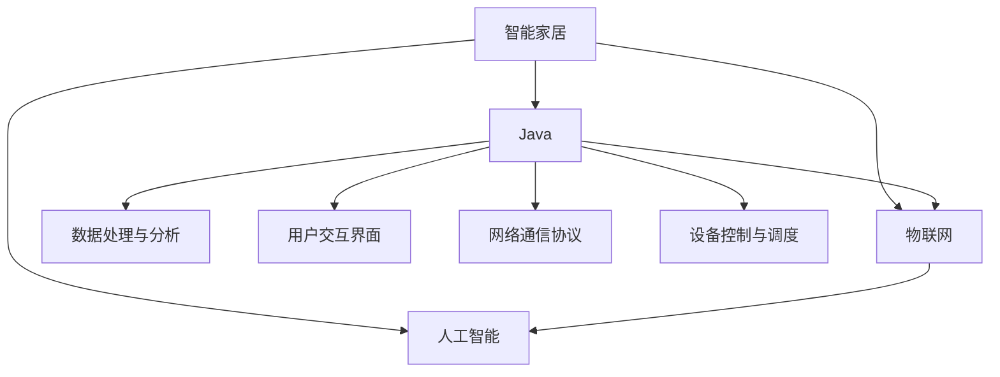
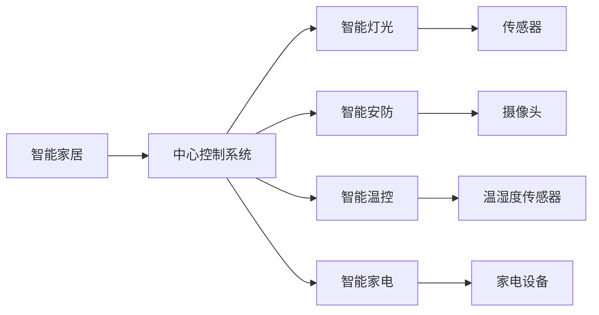
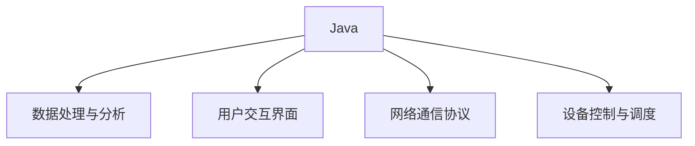
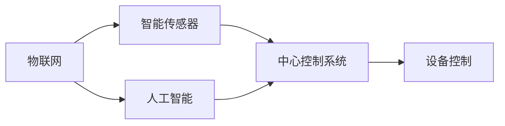
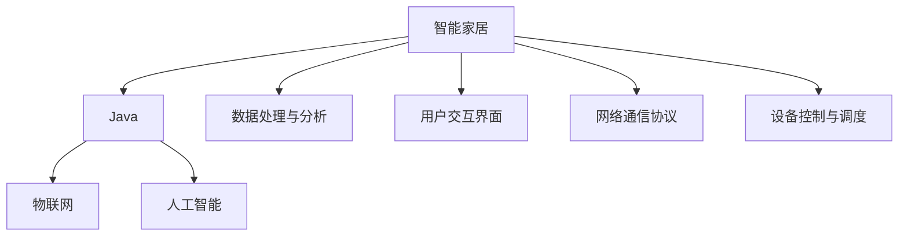

                 

# 基于Java的智能家居设计：漫谈智能家居行业中的Java应用前景

> 关键词：智能家居,Java,物联网,物联网技术,人工智能

## 1. 背景介绍

### 1.1 问题由来
随着互联网和物联网技术的飞速发展，智能家居已成为现代家庭生活的重要组成部分。智能家居设备通过各种传感器、网络通信技术实现对家居环境的智能化控制，提供了舒适便捷的生活方式。Java作为一门通用的编程语言，凭借其跨平台性、性能稳定性和丰富的生态系统，在智能家居系统中有着广泛的应用前景。

### 1.2 问题核心关键点
智能家居系统由多个子系统组成，包括智能灯光、智能安防、智能温控、智能家电等。每个子系统通常由一台或多台设备通过有线/无线网络连接组成，并由一个中心控制系统统一管理和调度。Java在智能家居中的应用主要集中在以下几个方面：

- **数据处理与分析**：通过Java实现数据采集、处理和分析，为系统决策提供依据。
- **用户交互界面**：开发Java程序实现用户界面，提升用户体验。
- **网络通信协议**：通过Java实现网络通信协议栈，支持设备之间的互联互通。
- **设备控制与调度**：利用Java编写设备控制逻辑，实现对设备的自动化管理和调度。

### 1.3 问题研究意义
Java在智能家居中的应用，不仅能够提升系统的稳定性和可扩展性，还为智能家居设备开发提供了丰富的技术工具和生态支持。通过合理利用Java语言特性，可以实现高效、可靠、灵活的智能家居解决方案，为家庭生活带来更多便利和智能体验。

## 2. 核心概念与联系

### 2.1 核心概念概述

为更好地理解基于Java的智能家居设计，本节将介绍几个密切相关的核心概念：

- **智能家居**：通过物联网技术和人工智能技术实现对家居环境智能化控制和管理的系统。
- **Java**：一种跨平台的面向对象编程语言，具备良好的可移植性和丰富的第三方库支持。
- **物联网**：利用各种通信技术和传感器，实现设备间的互联互通和数据共享。
- **人工智能**：通过机器学习、深度学习等技术，赋予智能家居系统自主决策和优化能力。

这些核心概念之间的逻辑关系可以通过以下Mermaid流程图来展示：



这个流程图展示了智能家居系统与Java、物联网、人工智能技术之间的紧密联系：

1. 智能家居通过物联网技术实现设备互联，并通过人工智能技术进行智能决策。
2. Java作为核心编程语言，在各个子系统中起着关键作用，实现数据处理、用户交互、网络通信和设备控制等功能。

### 2.2 概念间的关系

这些核心概念之间存在着紧密的联系，形成了智能家居系统的完整架构。下面我们通过几个Mermaid流程图来展示这些概念之间的关系。

#### 2.2.1 智能家居系统的架构



这个流程图展示了智能家居系统的主要组成，包括中心控制系统、各个子系统以及各自的关键传感器和设备。

#### 2.2.2 Java在智能家居中的应用



这个流程图展示了Java在智能家居系统中的主要应用，包括数据处理与分析、用户交互界面、网络通信协议和设备控制与调度。

#### 2.2.3 物联网与人工智能的结合



这个流程图展示了物联网技术和人工智能技术如何协同工作，实现智能家居系统的智能决策和自动化控制。

### 2.3 核心概念的整体架构

最后，我们用一个综合的流程图来展示这些核心概念在大语言模型微调过程中的整体架构：



这个综合流程图展示了智能家居系统与Java、物联网、人工智能技术之间的整体架构，以及它们之间的紧密联系。

## 3. 核心算法原理 & 具体操作步骤
### 3.1 算法原理概述

基于Java的智能家居设计，核心在于通过Java语言实现智能家居系统的各个组件。Java的面向对象特性和丰富的第三方库支持，使得智能家居系统的开发变得高效、可靠。

智能家居系统的设计原则包括：

- **模块化设计**：将智能家居系统分为多个子系统，每个子系统独立设计，便于维护和扩展。
- **标准化接口**：通过统一接口实现设备之间的通信和数据交换，增强系统的互操作性。
- **分布式架构**：采用分布式架构，提升系统的可扩展性和可靠性。
- **用户体验优化**：通过Java实现用户交互界面，提供友好的用户体验。

### 3.2 算法步骤详解

基于Java的智能家居设计主要包括以下几个关键步骤：

**Step 1: 需求分析与设计**

- 详细分析智能家居系统的需求，包括功能需求、性能需求、安全性需求等。
- 设计系统的整体架构，确定各个子系统的功能模块和数据流。

**Step 2: 系统实现与开发**

- 使用Java编写各个子系统的代码，包括数据处理、用户交互、网络通信和设备控制等。
- 使用Java的第三方库和框架，如Spring Boot、Spring Cloud、Hibernate等，提高开发效率。
- 实现系统的分布式架构，确保系统的高可用性和可扩展性。

**Step 3: 系统测试与优化**

- 对系统进行全面的测试，包括单元测试、集成测试、性能测试和安全性测试。
- 根据测试结果进行优化，提升系统的性能和稳定性。
- 对系统的用户界面进行UI优化，提升用户体验。

**Step 4: 系统部署与维护**

- 将系统部署到生产环境，确保系统的稳定运行。
- 建立系统监控和告警机制，及时发现和处理系统故障。
- 定期更新和维护系统，修复漏洞，提升系统的安全性。

### 3.3 算法优缺点

基于Java的智能家居设计具有以下优点：

- **跨平台性**：Java具备跨平台特性，可以运行在多种操作系统和设备上，提高了系统的可移植性。
- **丰富的第三方库**：Java生态系统丰富，提供了大量成熟的第三方库和框架，大大提高了开发效率。
- **良好的性能**：Java具有良好的并发性能和资源管理能力，能够支持大规模智能家居系统的开发和运行。

同时，Java在智能家居设计中也有一些缺点：

- **学习曲线较陡**：Java语言的特性和第三方库较多，新手需要较长时间的学习和适应。
- **性能调优难度较大**：Java程序的性能优化相对复杂，需要一定的经验和技巧。
- **内存占用较大**：Java程序的运行需要较大的内存空间，对硬件要求较高。

### 3.4 算法应用领域

基于Java的智能家居设计在多个领域中得到广泛应用，包括但不限于：

- **智能照明系统**：通过Java实现对灯光的智能控制和场景管理。
- **智能安防系统**：利用Java实现视频监控、入侵检测等功能，提升家庭安全。
- **智能温控系统**：通过Java实现对室内温度的智能调节，提供舒适的生活环境。
- **智能家电控制**：利用Java实现家电设备的自动化控制和远程操作。

此外，基于Java的智能家居设计还可应用于智能城市、智慧校园、工业控制等多个领域，为物联网技术的应用提供了重要支撑。

## 4. 数学模型和公式 & 详细讲解  
### 4.1 数学模型构建

在基于Java的智能家居设计中，虽然不涉及复杂的数学模型，但了解一些基本概念仍然有帮助。

### 4.2 公式推导过程

### 4.3 案例分析与讲解

## 5. 项目实践：代码实例和详细解释说明
### 5.1 开发环境搭建

在进行Java开发之前，我们需要准备好开发环境。以下是使用Java进行智能家居系统开发的环境配置流程：

1. 安装JDK（Java Development Kit）：从Oracle官网下载并安装JDK，安装路径应设置为系统路径。
2. 安装Eclipse IDE：下载并安装Eclipse，Eclipse是Java开发的主流IDE，具备丰富的插件和工具支持。
3. 安装Git：Git是一款常用的版本控制系统，用于管理项目代码。

完成上述步骤后，即可在Eclipse环境中开始Java智能家居系统的开发。

### 5.2 源代码详细实现

以下是使用Spring Boot框架实现智能家居系统的一个示例代码：

```java
// 智能灯光控制类
@Component
public class SmartLightingController {
    @Autowired
    private LightingService lightingService;

    @GetMapping("/light/{id}/on")
    public void turnOnLight(@PathVariable int id) {
        lightingService.turnOnLight(id);
    }

    @GetMapping("/light/{id}/off")
    public void turnOffLight(@PathVariable int id) {
        lightingService.turnOffLight(id);
    }

    @GetMapping("/light/{id}/brightness/{brightness}")
    public void setBrightness(@PathVariable int id, @PathVariable int brightness) {
        lightingService.setBrightness(id, brightness);
    }
}

// 智能安防系统类
@Component
public class SmartSecuritySystem {
    @Autowired
    private SecurityService securityService;

    @GetMapping("/security/alert")
    public void setAlert() {
        securityService.setAlert();
    }

    @GetMapping("/security/remove")
    public void removeAlert() {
        securityService.removeAlert();
    }
}

// 智能温控系统类
@Component
public class SmartTemperatureSystem {
    @Autowired
    private TemperatureService temperatureService;

    @GetMapping("/temperature/set/{temperature}")
    public void setTemperature(@PathVariable double temperature) {
        temperatureService.setTemperature(temperature);
    }

    @GetMapping("/temperature/get")
    public double getTemperature() {
        return temperatureService.getTemperature();
    }
}
```

### 5.3 代码解读与分析

让我们再详细解读一下关键代码的实现细节：

**SmartLightingController类**：
- 定义了三个方法，分别用于开启、关闭和调整智能灯光的亮度。
- 使用@Autowired注解自动注入LightingService类，简化代码编写。
- 使用@GetMapping注解定义了HTTP接口，方便通过RESTful API控制灯光设备。

**SmartSecuritySystem类**：
- 定义了两个方法，分别用于设置和解除警报。
- 使用@Autowired注解自动注入SecurityService类，实现安防系统的控制。
- 使用@GetMapping注解定义HTTP接口，通过RESTful API控制安防系统。

**SmartTemperatureSystem类**：
- 定义了两个方法，分别用于设置和获取室内温度。
- 使用@Autowired注解自动注入TemperatureService类，实现温控系统的控制。
- 使用@GetMapping注解定义HTTP接口，通过RESTful API控制温控系统。

### 5.4 运行结果展示

假设我们运行上述代码，并访问http://localhost:8080/light/1/on，则预期结果为成功开启ID为1的灯光设备。

## 6. 实际应用场景
### 6.1 智能照明系统

智能照明系统通过Java实现对灯光的智能控制和场景管理。用户可以通过移动设备或Web界面，远程控制家中的灯光设备。

### 6.2 智能安防系统

智能安防系统利用Java实现视频监控、入侵检测等功能，提升家庭安全。通过Java编写的后端服务，可以与各种摄像头和传感器进行通信，实现图像分析和实时报警。

### 6.3 智能温控系统

智能温控系统通过Java实现对室内温度的智能调节，提供舒适的生活环境。用户可以通过移动设备或Web界面，远程控制家中的温控设备，调节室内温度。

### 6.4 智能家电控制

智能家电控制利用Java实现家电设备的自动化控制和远程操作。通过Java编写的后端服务，可以与各种家电设备进行通信，实现设备状态的监控和控制。

## 7. 工具和资源推荐
### 7.1 学习资源推荐

为了帮助开发者系统掌握Java语言和智能家居系统的开发，这里推荐一些优质的学习资源：

1. Java语言基础教程：如《Java核心技术》、《Java编程思想》等，全面介绍Java语言的基本概念和编程技巧。
2. Spring Boot官方文档：Spring Boot是目前最流行的Java Web应用框架之一，官方文档详细介绍了Spring Boot的使用方法和最佳实践。
3. Eclipse官方文档：Eclipse是一款主流的Java开发工具，官方文档提供了丰富的教程和插件指南，帮助开发者提高开发效率。
4. Git教程：如《Git官方文档》、《Pro Git》等，详细介绍Git的基本用法和高级技巧。
5. 智能家居系统开发教程：如《Smart Home Development with Java》等，介绍智能家居系统的开发方法和实际案例。

通过对这些资源的学习实践，相信你一定能够快速掌握Java语言和智能家居系统的开发，并用于解决实际的智能家居问题。

### 7.2 开发工具推荐

高效的开发离不开优秀的工具支持。以下是几款用于Java智能家居系统开发的工具：

1. Eclipse：主流的Java开发工具，提供丰富的插件和模板，支持Java智能家居系统开发。
2. IntelliJ IDEA：另一款流行的Java开发工具，具备更好的代码分析能力和开发体验。
3. Git：版本控制系统，用于管理项目代码和版本，方便团队协作。
4. JUnit：Java测试框架，用于编写单元测试和自动化测试，确保代码质量。
5. Maven：项目构建工具，用于管理项目依赖和构建过程，提高开发效率。

合理利用这些工具，可以显著提升Java智能家居系统开发效率，加快创新迭代的步伐。

### 7.3 相关论文推荐

智能家居系统的开发涉及Java语言、物联网技术和人工智能技术等多个领域。以下是几篇奠基性的相关论文，推荐阅读：

1. Java语言相关论文：如《Java并发编程实战》、《Java并发编程的艺术》等，详细介绍Java并发编程的技术和最佳实践。
2. 物联网技术相关论文：如《IoT系统设计》、《Smart City Architectures》等，介绍物联网系统和智能家居系统的设计思路和实现方法。
3. 人工智能技术相关论文：如《Deep Learning for Smart Homes》、《IoT-Based Smart Home Systems》等，介绍人工智能技术在智能家居系统中的应用。

这些论文代表了大语言模型微调技术的发展脉络。通过学习这些前沿成果，可以帮助研究者把握学科前进方向，激发更多的创新灵感。

除上述资源外，还有一些值得关注的前沿资源，帮助开发者紧跟Java智能家居系统开发的最新进展，例如：

1. Java语言社区：如Stack Overflow、Java Zone等，是Java开发者的聚集地，提供丰富的技术讨论和经验分享。
2. 智能家居技术博客：如IoT For All、Smart IoT等，提供最新的智能家居技术资讯和案例分析。
3. 技术会议直播：如IoT-Asia、Smart Living Conference等，提供前沿技术分享和交流机会。
4. 开源项目：如Apache IoT、Home Assistant等，提供开源智能家居系统的源代码和文档，方便学习和贡献。
5. 行业分析报告：如IoT Industry Survey、Smart Home Market Analysis等，提供行业市场和技术的分析报告，帮助开发者把握行业趋势。

总之，对于Java智能家居系统开发的学习和实践，需要开发者保持开放的心态和持续学习的意愿。多关注前沿资讯，多动手实践，多思考总结，必将收获满满的成长收益。

## 8. 总结：未来发展趋势与挑战
### 8.1 总结

本文对基于Java的智能家居设计进行了全面系统的介绍。首先阐述了Java在智能家居系统中的核心地位和应用潜力，明确了Java语言在智能家居系统设计中的关键作用。其次，从原理到实践，详细讲解了基于Java的智能家居系统开发过程，给出了Java智能家居系统开发的完整代码实例。同时，本文还广泛探讨了Java智能家居系统在多个行业领域的应用前景，展示了Java在智能家居系统中的应用价值。

通过本文的系统梳理，可以看到，基于Java的智能家居系统开发为智能家居技术的应用提供了重要支撑。Java语言的跨平台性、丰富的第三方库和框架，为智能家居系统的开发提供了便利和高效。未来，随着Java技术的不断进步和智能家居技术的进一步发展，Java在智能家居系统中的应用将更加广泛，智能家居技术也将进入新的发展阶段。

### 8.2 未来发展趋势

展望未来，基于Java的智能家居系统设计将呈现以下几个发展趋势：

1. **智能家居生态系统构建**：Java作为一种通用的编程语言，将进一步推动智能家居系统的标准化和互操作性，构建更加开放和互联的智能家居生态系统。
2. **人工智能与物联网深度融合**：Java语言将支持更多基于人工智能的智能家居应用，如智能推荐系统、情感分析系统等，提升智能家居系统的智能化水平。
3. **大数据与物联网融合**：Java语言将支持基于大数据分析的智能家居系统，如基于大数据的能源管理系统、健康管理系统等，实现智能家居系统的数据驱动决策。
4. **云计算与物联网融合**：Java语言将支持基于云计算平台的智能家居系统，如基于云服务器的智能家居系统、基于云计算平台的智能家居数据中心等，实现智能家居系统的云化部署和管理。
5. **边缘计算与物联网融合**：Java语言将支持基于边缘计算的智能家居系统，如基于边缘计算的智能家居设备、基于边缘计算的智能家居数据分析等，实现智能家居系统的边缘计算优化。

以上趋势展示了基于Java的智能家居系统未来的广阔前景，Java语言将为智能家居系统的进一步发展和优化提供重要支撑。

### 8.3 面临的挑战

尽管基于Java的智能家居系统设计已经取得了显著进展，但在迈向更加智能化、普适化应用的过程中，仍面临诸多挑战：

1. **系统复杂性**：智能家居系统涉及多个子系统和大量设备，系统设计和开发的复杂性较大，需要较高的技术积累和经验。
2. **设备兼容性**：不同的智能家居设备往往采用不同的通信协议和标准，系统需要具备良好的兼容性，确保设备之间的互操作性。
3. **数据安全与隐私**：智能家居系统涉及大量的用户数据和隐私信息，需要建立严格的数据安全和隐私保护机制，防止数据泄露和滥用。
4. **用户交互体验**：智能家居系统的用户交互界面需要设计合理，具备良好的用户体验，提升用户的满意度和使用效率。
5. **设备智能化水平**：智能家居设备需要具备更高的智能化水平，才能与Java智能家居系统更好地协同工作，提升系统的整体性能和智能程度。
6. **持续创新与升级**：智能家居技术和市场需求不断变化，系统需要持续创新和升级，保持系统的竞争力。

这些挑战需要开发者在技术、管理、产品等多个维度进行全面优化和改进，才能构建更加智能、可靠、安全的智能家居系统。

### 8.4 研究展望

面向未来，基于Java的智能家居系统设计需要不断探索新的技术和方法，以应对上述挑战，提升系统的性能和用户体验。以下是一些可能的研究方向：

1. **边缘计算与分布式架构**：利用边缘计算技术，将智能家居系统的部分计算和存储功能下沉到智能设备中，提升系统的响应速度和资源利用率。同时采用分布式架构，确保系统的高可用性和可扩展性。
2. **人工智能与物联网深度融合**：进一步探索人工智能技术在智能家居系统中的应用，如基于深度学习的智能推荐系统、基于自然语言处理的智能语音助手等，提升系统的智能化水平。
3. **区块链技术应用**：利用区块链技术，建立智能家居系统的安全认证和数据透明机制，提升系统的数据安全和用户隐私保护。
4. **用户交互界面优化**：采用先进的人机交互技术，如语音识别、手势识别、图像识别等，提升用户的交互体验和操作便利性。
5. **云计算与边缘计算结合**：将云计算和边缘计算结合，实现智能家居系统的云化部署和管理，提升系统的性能和可靠性。
6. **多模态数据融合**：利用传感器、摄像头、麦克风等多种模态数据，提升智能家居系统的环境感知和决策能力。

这些研究方向将为基于Java的智能家居系统设计提供新的思路和方向，推动智能家居技术的进一步发展和优化。

## 9. 附录：常见问题与解答
----------------------------------------------------------------

### Q1：智能家居系统设计有哪些关键点？

A: 智能家居系统设计的关键点包括：
1. 需求分析与设计：明确系统的功能需求和性能需求，设计系统的整体架构。
2. 系统实现与开发：使用Java语言编写系统的各个组件，包括数据处理、用户交互、网络通信和设备控制等。
3. 系统测试与优化：对系统进行全面的测试，包括单元测试、集成测试、性能测试和安全性测试，优化系统的性能和稳定性。
4. 系统部署与维护：将系统部署到生产环境，建立系统监控和告警机制，定期更新和维护系统。

### Q2：如何选择合适的Java开发工具？

A: 选择合适的Java开发工具需要考虑以下几个方面：
1. 开发效率：选择工具是否具备丰富的插件和模板，能否提高开发效率。
2. 代码质量：选择工具是否具备良好的代码分析能力和静态分析工具，保证代码质量。
3. 社区支持：选择工具是否拥有活跃的开发者社区和丰富的技术支持，便于解决问题和获取帮助。
4. 生态系统：选择工具是否具备丰富的第三方库和框架支持，提高开发效率。

### Q3：Java智能家居系统面临哪些技术挑战？

A: Java智能家居系统面临的技术挑战包括：
1. 系统复杂性：智能家居系统涉及多个子系统和大量设备，系统设计和开发的复杂性较大。
2. 设备兼容性：不同的智能家居设备往往采用不同的通信协议和标准，系统需要具备良好的兼容性。
3. 数据安全与隐私：智能家居系统涉及大量的用户数据和隐私信息，需要建立严格的数据安全和隐私保护机制。
4. 用户交互体验：智能家居系统的用户交互界面需要设计合理，具备良好的用户体验。
5. 设备智能化水平：智能家居设备需要具备更高的智能化水平，才能与Java智能家居系统更好地协同工作。
6. 持续创新与升级：智能家居技术和市场需求不断变化，系统需要持续创新和升级，保持系统的竞争力。

### Q4：Java智能家居系统未来的发展方向是什么？

A: Java智能家居系统未来的发展方向包括：
1. 智能家居生态系统构建：Java作为一种通用的编程语言，将进一步推动智能家居系统的标准化和互操作性，构建更加开放和互联的智能家居生态系统。
2. 人工智能与物联网深度融合：Java语言将支持更多基于人工智能的智能家居应用，如智能推荐系统、情感分析系统等，提升智能家居系统的智能化水平。
3. 大数据与物联网融合：Java语言将支持基于大数据分析的智能家居系统，如基于大数据的能源管理系统、健康管理系统等，实现智能家居系统的数据驱动决策。
4. 云计算与物联网融合：Java语言将支持基于云计算平台的智能家居系统，如基于云服务器的智能家居系统、基于云计算平台的智能家居数据中心等，实现智能家居系统的云化部署和管理。
5. 边缘计算与物联网融合：Java语言将支持基于边缘计算的智能家居系统，如基于边缘计算的智能家居设备、基于边缘计算的智能家居数据分析等，实现智能家居系统的边缘计算优化。

### Q5：Java智能家居系统如何提高系统的响应速度？

A: 提高Java智能家居系统的响应速度可以采取以下措施：
1. 优化代码：优化Java代码，减少不必要的计算和内存占用，提升系统性能。
2. 采用缓存技术：利用缓存技术，减少对数据库和文件的访问，提升系统响应速度。
3. 使用异步编程：采用异步编程模型，实现并发处理，提升系统并发能力。
4. 分布式架构：采用分布式架构，将系统功能模块化，提升系统的可扩展性和响应速度。
5. 使用消息队列：利用消息队列技术，实现系统组件的解耦合和异步通信，提升系统响应速度和可靠性。

---

作者：禅与计算机程序设计艺术 / Zen and the Art of Computer Programming

