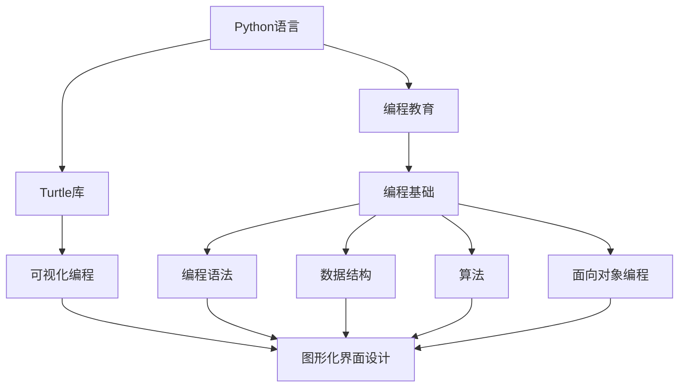
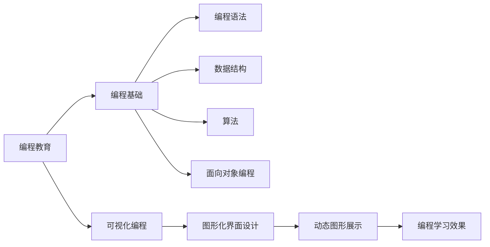
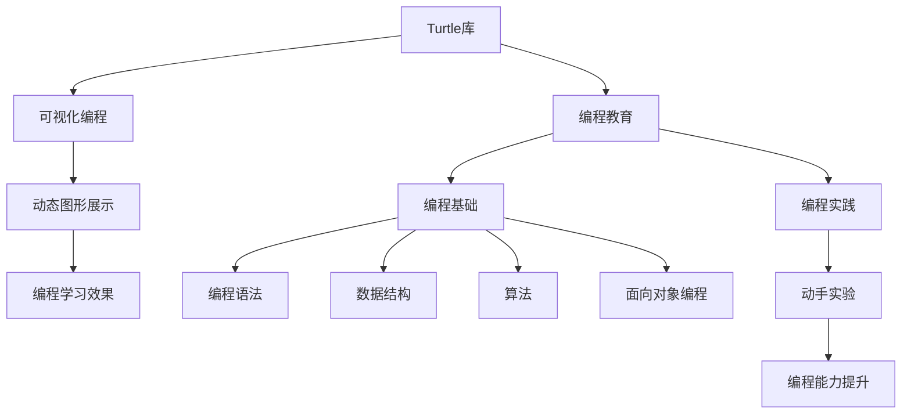
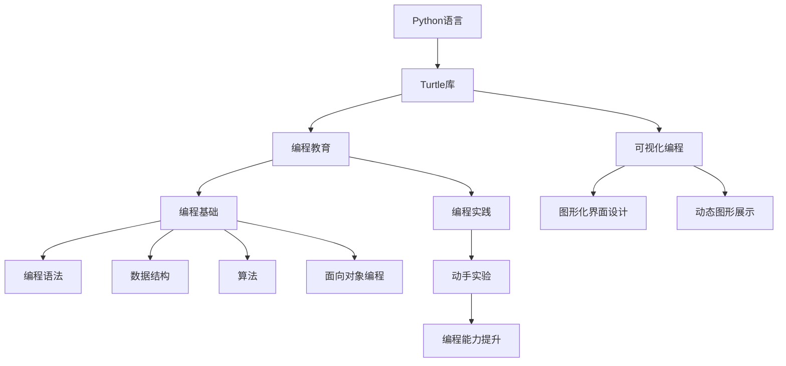

                 

# 基于Python-Turtle库的扩展助学小程序可视化实现

> 关键词：可视化, 编程教育, 计算机科学, 编程基础, Python, Turtle

## 1. 背景介绍

### 1.1 问题由来
随着信息技术的迅速发展，计算机编程技能成为21世纪人才必备的核心能力之一。然而，编程教育在中国还处于起步阶段，基础教育阶段编程课程普及率较低，学生对编程的兴趣和能力亟待提升。为此，各国教育机构和科技公司纷纷推出编程教育项目，试图通过游戏化、可视化等手段激发学生对编程的兴趣，逐步培养其编程思维和能力。

### 1.2 问题核心关键点
本文聚焦于通过Python语言和Turtle库实现编程教育的可视化辅助工具。Turtle库是Python标准库之一，能够以图形化界面的形式展示程序执行结果，适合初学者入门编程。通过Turtle库，可以将抽象的编程逻辑直观展示为动态图形，帮助学生更好地理解编程语法和逻辑结构，激发学习兴趣，提升编程能力。

### 1.3 问题研究意义
开发基于Turtle库的扩展助学小程序，对于推动编程教育的普及和深化，培养学生的编程思维和动手能力，具有重要意义：

1. 降低编程学习门槛。Turtle库的可视化展示，使得编程过程不再抽象，降低了学生学习编程的难度和心理负担。
2. 强化动手实践。编程与图形化展示相结合，学生能够通过实际操作更好地理解和掌握编程概念。
3. 提升学习兴趣。动态的图形展示和趣味性的编程任务，可以激发学生的学习热情，提高学习效率。
4. 促进自主学习。可视化编程工具提供灵活的编程环境，便于学生自主探索和实验，提升编程综合能力。
5. 扩展教育资源。通过在线平台分享和传播，该工具可以惠及更多学生和教育机构，推动编程教育的普及。

## 2. 核心概念与联系

### 2.1 核心概念概述

为更好地理解基于Turtle库的编程教育工具，本节将介绍几个密切相关的核心概念：

- Python语言：一种高级、面向对象、解释型动态数据类型语言，以其简洁、易读、易学的特点，成为编程教育的首选语言。
- Turtle库：Python标准库之一，用于图形化编程，能够动态绘制图形和动画，适合初学者入门。
- 编程教育：通过编程活动学习计算机科学的基本知识和技能，培养逻辑思维、问题解决和创新能力。
- 可视化编程：将编程逻辑转换为图形界面，通过动态图形展示程序执行结果，增强编程学习的直观性。
- 图形化界面设计：通过图形界面，将编程指令转换为可视化的操作，简化编程过程，提高学习效率。
- 编程基础：包括编程语法、数据结构、算法、面向对象编程等，是计算机科学教育的基础。

这些核心概念之间的逻辑关系可以通过以下Mermaid流程图来展示：



这个流程图展示了几组关键概念之间的关系：

1. Python语言通过Turtle库实现可视化编程，降低编程学习难度。
2. 编程教育以Python语言为基础，涵盖编程基础和图形化界面设计等核心内容。
3. 可视化编程是编程教育的重要手段，通过动态图形展示增强学习直观性。
4. 图形化界面设计通过将编程指令转换为可视化操作，进一步简化编程过程。

### 2.2 概念间的关系

这些核心概念之间存在着紧密的联系，形成了基于Turtle库的编程教育工具的整体框架。下面我们通过几个Mermaid流程图来展示这些概念之间的关系。

#### 2.2.1 编程教育与可视化编程的关系



这个流程图展示了编程教育与可视化编程之间的关系：

1. 编程教育涵盖编程基础，包括编程语法、数据结构、算法和面向对象编程等内容。
2. 可视化编程以图形化界面和动态图形展示为核心，增强编程学习的直观性和趣味性。
3. 图形化界面设计将编程指令转换为可视化的操作，简化编程过程，提高学习效率。

#### 2.2.2 Turtle库在编程教育中的应用



这个流程图展示了Turtle库在编程教育中的应用：

1. Turtle库通过图形化编程，降低编程学习门槛，增强学习的直观性。
2. 可视化编程将编程逻辑转换为动态图形展示，帮助学生更好地理解和掌握编程概念。
3. 图形化界面设计进一步简化编程过程，提高学生动手实践能力。
4. 编程实践和动手实验，通过Turtle库实现的动态图形展示，强化学生对编程语法的理解。

### 2.3 核心概念的整体架构

最后，我们用一个综合的流程图来展示这些核心概念在大语言模型微调过程中的整体架构：



这个综合流程图展示了编程教育和Turtle库的整体应用框架：

1. Python语言作为编程教育的教学语言，通过Turtle库实现可视化编程。
2. 可视化编程通过动态图形展示增强学习直观性，学生能够更好地理解编程概念。
3. 图形化界面设计通过将编程指令转换为可视化的操作，进一步简化编程过程。
4. 编程实践和动手实验，通过Turtle库实现的动态图形展示，强化学生对编程语法的理解。

## 3. 核心算法原理 & 具体操作步骤
### 3.1 算法原理概述

基于Python-Turtle库的扩展助学小程序，本质上是一种通过图形化编程辅助编程教育的方法。其核心思想是：通过Python语言和Turtle库，将抽象的编程逻辑转换为可视化的图形和动画，增强编程学习的直观性和趣味性，帮助学生更好地理解和掌握编程概念。

具体来说，该小程序实现了以下关键功能：

1. 编写编程任务：提供一系列的编程任务，涵盖Python基础语法、数据结构、算法和面向对象编程等内容。
2. 可视化展示代码：通过Turtle库绘制动态图形，展示程序的执行过程和结果，增强学习的直观性。
3. 反馈和评估：提供代码执行的即时反馈和评估，帮助学生及时纠正错误，提升编程能力。
4. 互动和交互：通过图形化界面，实现编程任务的互动和交互，激发学生的学习兴趣，增强自主学习能力。

### 3.2 算法步骤详解

基于Python-Turtle库的扩展助学小程序的实现过程主要包括以下几个关键步骤：

**Step 1: 设计编程任务**

- 定义编程任务：设计一系列编程任务，涵盖Python基础语法、数据结构、算法和面向对象编程等内容。
- 编写任务描述：详细描述每个任务的具体要求和实现步骤。
- 设置输出格式：定义程序的输出格式和要求，如打印结果、图形化展示等。

**Step 2: 实现可视化展示**

- 安装Turtle库：在Python环境中安装Turtle库。
- 绘制动态图形：根据编程任务的输出格式，使用Turtle库绘制相应的动态图形。
- 实现动画效果：通过动画函数，将程序的执行过程和结果动态展示。

**Step 3: 实现即时反馈**

- 编写代码解析函数：解析编程任务对应的代码，并返回执行结果。
- 实现即时反馈：在代码执行过程中，实时显示程序的执行状态和结果，提供即时反馈。
- 提供错误提示：在代码执行错误时，显示错误提示信息，帮助学生查找和纠正错误。

**Step 4: 实现互动和交互**

- 创建图形化界面：使用Python的GUI库（如Tkinter）创建图形化界面。
- 添加任务选择：在界面中添加编程任务的选择功能，方便学生选择和执行任务。
- 实现任务提交和显示：当学生提交代码后，界面显示程序执行结果和动态图形，提供实时反馈。
- 支持调试和回退：在执行过程中提供调试功能，支持代码回退和重新执行，帮助学生纠正错误。

**Step 5: 集成测试和优化**

- 编写测试用例：编写一系列测试用例，确保编程任务的正确执行和展示效果。
- 集成优化：对小程序进行集成测试和优化，提升用户体验和系统性能。
- 提供用户文档：编写用户文档，详细介绍编程任务和使用方法，方便学生使用。

### 3.3 算法优缺点

基于Python-Turtle库的扩展助学小程序具有以下优点：

1. 直观性：通过Turtle库的可视化展示，使得编程过程更加直观，降低了学习门槛。
2. 趣味性：动态图形和动画效果增加了编程学习的趣味性，吸引学生主动学习。
3. 互动性：图形化界面和即时反馈功能增强了学生与系统的互动，提高了学习效率。
4. 自主性：学生可以自主选择和执行编程任务，强化了自主学习的能力。
5. 可扩展性：该小程序可以根据教育需求不断扩展和优化，支持更多编程任务和展示效果。

同时，该小程序也存在以下缺点：

1. 依赖环境：需要安装Python和Turtle库，对于初学者来说有一定门槛。
2. 可扩展性：虽然支持多任务扩展，但扩展过程需要较多时间和精力。
3. 适用性：对于复杂的编程任务，可视化展示可能无法完全覆盖，部分细节仍需理解。

### 3.4 算法应用领域

基于Python-Turtle库的扩展助学小程序不仅适用于编程教育领域，还适用于以下多个领域：

1. 基础教育：用于K12阶段的学生编程教育，培养学生的编程思维和逻辑能力。
2. 职业教育：用于在职人员的编程培训，提高其编程技能和工作效率。
3. 自我提升：用于编程爱好者和技术人员的学习和提升，强化其编程能力和创造力。
4. 教学辅助：用于教师在教学中展示编程任务和演示编程过程，增强教学效果。
5. 软件开发：用于软件开发的入门学习和实践，培养开发人员的编程思维和动手能力。

## 4. 数学模型和公式 & 详细讲解 & 举例说明

### 4.1 数学模型构建

本节将使用数学语言对基于Python-Turtle库的扩展助学小程序进行更加严格的刻画。

假设编程任务为 $T$，输入为 $x$，输出为 $y$。则编程任务可以表示为一个映射函数 $f: x \rightarrow y$。

编程任务的可视化展示过程可以表示为：

- 编写代码：将任务映射函数 $f$ 转换为Python代码 $C$。
- 代码执行：通过Turtle库执行Python代码 $C$，得到动态图形 $G$。

数学模型可以表示为：

$$
\begin{aligned}
G &= T(x) \\
&= f(x) \\
&= C(x)
\end{aligned}
$$

其中 $C(x)$ 表示将任务映射函数 $f(x)$ 转换为Python代码的过程，$T(x)$ 表示将任务映射函数 $f(x)$ 转换为动态图形的过程。

### 4.2 公式推导过程

以下我们以绘制矩形为例，推导Turtle库绘制动态图形的过程。

假设要绘制边长为 $a$ 和 $b$ 的矩形，Python代码如下：

```python
import turtle

def draw_rectangle(a, b):
    turtle.forward(a)
    turtle.left(90)
    turtle.forward(b)
    turtle.left(90)
    turtle.forward(a)
    turtle.left(90)
    turtle.forward(b)
    turtle.left(90)
```

代码执行后，Turtle库绘制的动态图形如下所示：

```
  ┌────────────────────────────────────────────────────────────────────────────────────────────────────────────────────────────────────────────────────────────────────────────────────────────────────────────────────────────────────────────────────────────────────────────────────────────────────────────────────────────────────────────────────────────────────────────────────────────────────────────────────────────────────────────────────────────────────────────────────────────────────────────────────────────────────────────────────────────────────────────────────────────────────────────────────────────────────────────────────────────────────────────────────────────────────────────────────────────────────────────────────────────────────────────────────────────────────────────────────────────────────────────────────────────────────────────────────────────────────────────────────────────────────────────────────────────────────────────────────────────────────────────────────────────────────────────────────────────────────────────────────────────────────────────────────────────────────────────────────────────────────────────────────────────────────────────────────────────────────────────────────────────────────────────────────────────────────────────────────────────────────────────────────────────────────────────────────────────────────────────────────────────────────────────────────────────────────────────────────────────────────────────────────────────────────────────────────────────────────────────────────────────────────────────────────────────────────────────────────────────────────────────────────────────────────────────────────────────────────────────────────────────────────────────────────────────────────────────────────────────────────────────────────────────────────────────────────────────────────────────────────────────────────────────────────────────────────────────────────────────────────────────────────────────────────────────────────────────────────────────────────────────────────────────────────────────────────────────────────────────────────────────────────────────────────────────────────────────────────────────────────────────────────────────────────────────────────────────────────────────────────────────────────────────────────────────────────────────────────────────────────────────────────────────────────────────────────────────────────────────────────────────────────────────────────────────────────────────────────────────────────────────────────────────────────────────────────────────────────────────────────────────────────────────────────────────────────────────────────────────────────────────────────────────────────────────────────────────────────────────────────────────────────────────────────────────────────────────────────────────────────────────────────────────────────────────────────────────────────────────────────────

