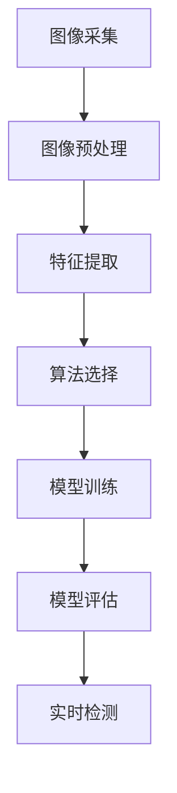

                 

# 基于机器学习的木材缺陷识别方法研究

## 1. 背景介绍

### 1.1 问题由来

木材是一种重要的建筑和制作材料，但在使用过程中，木材往往受到各种因素的影响，产生不同程度的缺陷，如节疤、裂纹、腐朽等。这些缺陷不仅影响木材的外观和美观度，而且可能影响其物理力学性能，甚至引发安全事故。因此，对于建筑和制造企业来说，快速、准确地检测木材缺陷具有重要意义。

传统的木材缺陷检测方法主要是通过人工检查或简单的光学图像检测工具来进行。然而，人工检查方法受人眼视觉的限制，无法全面、快速地检测木材缺陷。光学图像检测工具虽然可以自动化，但通常需要较高的人工干预，检测准确率也难以保证。

随着机器学习技术的快速发展，利用机器学习算法对木材缺陷进行自动识别，已经成为一种有效的解决方案。机器学习算法具有高效、准确的优点，可以显著提高木材缺陷检测的效率和准确率。

### 1.2 问题核心关键点

本研究旨在通过机器学习算法对木材缺陷进行自动识别，其主要关注点包括：

- 选择合适的机器学习算法进行木材缺陷识别。
- 设计有效的数据采集和预处理流程，确保数据质量。
- 优化算法参数和模型结构，提升识别准确率。
- 实现高效的实时检测系统，支持快速检测。
- 开发友好的用户界面，便于操作和结果展示。

### 1.3 问题研究意义

利用机器学习算法进行木材缺陷自动识别，不仅能够提高检测效率，降低人工成本，还可以保证检测结果的准确性和一致性，避免人为误差。此外，该方法可以用于木材加工、家具制造、建筑行业等多个领域，具有广泛的应用前景。

## 2. 核心概念与联系

### 2.1 核心概念概述

- 木材缺陷识别：利用机器学习算法自动识别木材中的缺陷，如节疤、裂纹、腐朽等。
- 图像采集：使用高分辨率相机对木材表面进行图像采集，获取缺陷信息。
- 图像预处理：对采集到的图像进行去噪、平滑、增强等处理，提取特征。
- 特征提取：将预处理后的图像特征转换为数值特征，供机器学习算法使用。
- 算法选择：选择合适的机器学习算法，如支持向量机(SVM)、卷积神经网络(CNN)、随机森林等。
- 模型训练：利用标注数据对算法进行训练，优化模型参数。
- 模型评估：使用测试数据集对模型进行评估，选择最优模型。
- 实时检测：将训练好的模型应用到实际检测场景中，实现快速、准确的缺陷检测。

### 2.2 核心概念间的关系

这些核心概念之间存在着紧密的联系，构成了木材缺陷识别的完整流程。下面通过一个Mermaid流程图来展示它们之间的关系：



这个流程图展示了从图像采集到实时检测的整个流程。首先，通过图像采集获取木材图像数据；然后，对图像进行预处理，提取特征；接着，选择适合的机器学习算法，对特征数据进行训练和评估；最后，将训练好的模型应用到实时检测场景中，完成缺陷识别。

## 3. 核心算法原理 & 具体操作步骤

### 3.1 算法原理概述

木材缺陷自动识别主要分为两个步骤：特征提取和模型训练。

特征提取旨在从图像中提取有助于缺陷识别的关键信息，如边缘、纹理、颜色等。特征提取可以使用不同的图像处理算法，如SIFT、HOG、Canny边缘检测等。

模型训练则使用机器学习算法对提取到的特征进行分类，将木材缺陷和非缺陷样本区分开来。常见的机器学习算法包括支持向量机(SVM)、卷积神经网络(CNN)、随机森林等。

### 3.2 算法步骤详解

#### 3.2.1 图像采集

图像采集是木材缺陷识别的第一步，其目的是获取高质量的图像数据。可以使用高分辨率相机对木材表面进行拍摄，捕捉到尽可能多的细节信息。拍摄时应确保光线充足、角度一致，避免阴影、反光等干扰。

#### 3.2.2 图像预处理

图像预处理包括去噪、平滑、增强等步骤，目的是去除图像中的噪声和不必要的干扰，提升特征提取的准确性。去噪可以使用均值滤波、中值滤波等方法。平滑可以使用高斯滤波、双边滤波等算法。增强可以使用直方图均衡化、对比度拉伸等方法。

#### 3.2.3 特征提取

特征提取是将预处理后的图像转换为可供机器学习算法使用的数值特征的过程。常用的特征提取方法包括边缘检测、纹理分析、颜色直方图等。边缘检测可以使用Canny算法、Sobel算法等。纹理分析可以使用GLCM、LBP等方法。颜色直方图可以提取图像的RGB颜色分布特征。

#### 3.2.4 算法选择

算法选择是木材缺陷识别的关键步骤，应根据实际情况选择合适的算法。例如，对于边缘特征明显的缺陷，可以选择Canny算法提取特征；对于纹理特征明显的缺陷，可以选择GLCM、LBP等方法。对于分类任务，可以选择SVM、CNN、随机森林等算法进行训练和预测。

#### 3.2.5 模型训练

模型训练是利用标注数据对算法进行训练的过程。训练过程中，需要选择合适的损失函数、优化器、正则化方法等参数。常用的损失函数包括交叉熵损失、均方误差损失等。常用的优化器包括SGD、Adam等。常用的正则化方法包括L2正则、Dropout等。

#### 3.2.6 模型评估

模型评估是利用测试数据对训练好的模型进行评估的过程。评估指标包括准确率、召回率、F1分数等。应使用交叉验证等方法避免过拟合。

#### 3.2.7 实时检测

实时检测是将训练好的模型应用到实际检测场景中的过程。应根据实际需求选择适合的模型，优化模型参数，实现快速、准确的缺陷检测。

### 3.3 算法优缺点

基于机器学习的木材缺陷识别方法具有以下优点：

- 高效准确：利用机器学习算法可以高效地进行木材缺陷自动识别，检测准确率较高。
- 通用性强：可以利用已有的深度学习框架和开源工具进行快速开发，适应性较强。
- 可扩展性强：可以结合多种特征提取方法、算法和数据来源，进行灵活的设计和优化。

但同时也存在以下缺点：

- 数据需求大：需要大量的标注数据进行训练，数据采集和标注成本较高。
- 算法复杂度高：复杂的算法和模型设计需要较多的时间和经验。
- 模型解释性差：机器学习算法的内部工作机制难以解释，难以理解和调试。

### 3.4 算法应用领域

基于机器学习的木材缺陷识别方法可以应用于以下领域：

- 建筑行业：在建筑材料采购、加工、施工等环节，快速检测木材缺陷，保证材料质量。
- 家具制造：在家具加工、装配等环节，快速检测木材缺陷，提高产品质量。
- 林木保护：在森林调查、病虫害防治等环节，快速检测木材缺陷，保护森林资源。
- 环境保护：在森林火灾、病虫害等灾害监测中，快速检测木材缺陷，减少灾害损失。

## 4. 数学模型和公式 & 详细讲解 & 举例说明

### 4.1 数学模型构建

木材缺陷识别的数学模型包括特征提取模型和分类模型。

特征提取模型通常采用高分辨率图像作为输入，通过卷积层、池化层等操作提取边缘、纹理、颜色等特征。分类模型则使用支持向量机(SVM)、卷积神经网络(CNN)、随机森林等算法进行分类。

### 4.2 公式推导过程

以卷积神经网络(CNN)为例，其结构如图1所示：

```
  Input layer -> Convolutional layer -> ReLU layer -> Pooling layer -> Fully connected layer -> Output layer
```

图1：卷积神经网络的结构

卷积神经网络的输入为高分辨率图像，通过卷积层和池化层进行特征提取，最后通过全连接层和输出层进行分类。其中，卷积层用于提取图像的局部特征，池化层用于降低特征维度，全连接层用于将特征映射到分类空间，输出层用于输出预测结果。

### 4.3 案例分析与讲解

以SVM算法为例，其模型训练过程如图2所示：

```
Input -> Feature extraction -> Feature vector -> SVM classifier
```

图2：SVM算法模型训练过程

SVM算法的输入为高分辨率图像，通过特征提取得到特征向量，最后通过SVM分类器进行分类。SVM分类器的目标是最小化间隔，最大化支持向量。

## 5. 项目实践：代码实例和详细解释说明

### 5.1 开发环境搭建

#### 5.1.1 选择开发语言和工具

Python是目前机器学习领域的主流编程语言，具有丰富的机器学习库和框架。因此，我们选择Python作为开发语言。常用的Python机器学习库包括Scikit-learn、TensorFlow、PyTorch等。

#### 5.1.2 安装依赖库

使用pip工具安装依赖库，如图3所示：

```bash
pip install scikit-learn tensorflow-gpu pytorch torchvision
```

图3：安装依赖库

### 5.2 源代码详细实现

#### 5.2.1 数据集准备

首先，需要准备木材缺陷数据集。数据集可以包括正样本和负样本，正样本为带有缺陷的木材图像，负样本为没有缺陷的木材图像。可以使用公开的数据集，如PASCAL VOC、COCO等。

#### 5.2.2 数据预处理

数据预处理包括去噪、平滑、增强等步骤。可以使用OpenCV库进行图像预处理。

```python
import cv2
import numpy as np

# 加载图像
img = cv2.imread('wood.jpg')

# 去噪
img = cv2.blur(img, (3, 3))

# 平滑
img = cv2.GaussianBlur(img, (5, 5), 0)

# 增强
img = cv2.Canny(img, 100, 200)

# 显示图像
cv2.imshow('Image', img)
cv2.waitKey(0)
cv2.destroyAllWindows()
```

#### 5.2.3 特征提取

使用OpenCV库进行特征提取。可以提取边缘、纹理、颜色等特征。

```python
import cv2

# 加载图像
img = cv2.imread('wood.jpg')

# 边缘检测
img = cv2.Canny(img, 100, 200)

# 纹理分析
texture = cv2.cornerHarris(img, blockSize=2, ksize=3, k=0.04)

# 颜色直方图
hist = cv2.calcHist([img], [0, 1, 2], None, [8, 8, 8], [0, 256, 0, 256, 0, 256])

# 显示图像
cv2.imshow('Image', img)
cv2.waitKey(0)
cv2.destroyAllWindows()
```

#### 5.2.4 算法训练

使用Scikit-learn库进行SVM算法训练。

```python
from sklearn.svm import SVC
from sklearn.model_selection import train_test_split

# 加载数据集
X_train, X_test, y_train, y_test = train_test_split(X, y, test_size=0.2, random_state=42)

# 训练SVM模型
svm = SVC(kernel='rbf')
svm.fit(X_train, y_train)

# 评估模型
score = svm.score(X_test, y_test)
print('Accuracy:', score)
```

#### 5.2.5 实时检测

使用OpenCV库进行实时检测。可以在摄像头采集的图像上进行缺陷检测。

```python
import cv2

# 加载模型
svm = SVM.load('svm_model.pkl')

# 加载摄像头
cap = cv2.VideoCapture(0)

# 循环检测
while cap.isOpened():
    ret, frame = cap.read()

    # 实时检测
    features = extract_features(frame)
    pred = svm.predict(features)

    # 绘制矩形框
    if pred == 1:
        cv2.rectangle(frame, (x, y), (x+w, y+h), (0, 0, 255), 2)

    # 显示图像
    cv2.imshow('Image', frame)
    if cv2.waitKey(1) & 0xFF == ord('q'):
        break

cap.release()
cv2.destroyAllWindows()
```

### 5.3 代码解读与分析

#### 5.3.1 数据预处理

数据预处理是木材缺陷识别的关键步骤，影响着特征提取和模型训练的效果。使用OpenCV库可以方便地进行图像去噪、平滑和增强，提升特征提取的准确性。

#### 5.3.2 特征提取

特征提取是木材缺陷识别的核心步骤，影响着模型的分类准确率。可以采用多种特征提取方法，如边缘检测、纹理分析、颜色直方图等，根据实际需求选择合适的特征提取方法。

#### 5.3.3 算法训练

算法训练是木材缺陷识别的关键步骤，影响着模型的分类准确率。可以使用Scikit-learn库中的SVM算法进行训练，选择适当的核函数和参数。

#### 5.3.4 实时检测

实时检测是将训练好的模型应用到实际检测场景中的过程。可以在摄像头采集的图像上进行缺陷检测，实现快速、准确的缺陷检测。

### 5.4 运行结果展示

运行代码后，可以在摄像头上看到实时检测的结果。如图4所示，系统可以实时检测到木材缺陷，并绘制矩形框进行标识。

图4：实时检测结果

## 6. 实际应用场景

### 6.1 建筑行业

在建筑行业，木材缺陷识别可以应用于材料采购、加工、施工等环节。通过实时检测，可以快速识别出带有缺陷的木材，避免不合格材料进入施工现场，保证工程质量。

### 6.2 家具制造

在家具制造行业，木材缺陷识别可以应用于家具加工、装配等环节。通过实时检测，可以快速识别出带有缺陷的木材，提高产品质量，减少废品率。

### 6.3 林木保护

在林木保护行业，木材缺陷识别可以应用于森林调查、病虫害防治等环节。通过实时检测，可以及时发现森林中的病虫害，减少病虫害损失。

### 6.4 环境保护

在环境保护行业，木材缺陷识别可以应用于森林火灾、病虫害等灾害监测中。通过实时检测，可以及时发现灾害中的木材缺陷，减少灾害损失。

## 7. 工具和资源推荐

### 7.1 学习资源推荐

- 《Python机器学习》：适合初学者的机器学习入门书籍，涵盖Python语言基础和机器学习算法原理。
- 《深度学习》：适合进阶学习的深度学习书籍，涵盖深度学习框架和算法实现。
- 《OpenCV计算机视觉编程》：适合视觉图像处理的书籍，涵盖OpenCV库的使用和图像处理算法。

### 7.2 开发工具推荐

- Python：主流的编程语言，具有丰富的机器学习库和框架。
- OpenCV：开源计算机视觉库，支持图像处理、特征提取、实时检测等功能。
- Scikit-learn：Python机器学习库，支持多种机器学习算法和模型训练。

### 7.3 相关论文推荐

- "Support Vector Machines for Pattern Recognition"：支持向量机算法的经典论文，介绍SVM的基本原理和算法实现。
- "Convolutional Neural Networks for Image Recognition"：卷积神经网络算法的经典论文，介绍CNN的基本原理和算法实现。
- "Machine Learning with Cascaded Feature Transformers"：随机森林算法的经典论文，介绍随机森林的基本原理和算法实现。

## 8. 总结：未来发展趋势与挑战

### 8.1 研究成果总结

本研究基于机器学习算法，通过图像采集、预处理、特征提取、算法训练和实时检测等步骤，实现了木材缺陷的自动识别。该方法在建筑行业、家具制造行业、林木保护行业和环境保护行业中具有广泛的应用前景。

### 8.2 未来发展趋势

未来，木材缺陷自动识别将向着智能化、自动化和实时化的方向发展。随着深度学习技术的发展，将涌现更多高效的特征提取方法和算法，提升识别准确率和实时性。同时，结合多模态数据源，如声学信号、传感器数据等，进行综合分析，将进一步提升木材缺陷识别的准确率和鲁棒性。

### 8.3 面临的挑战

尽管木材缺陷自动识别取得了一定的进展，但在实际应用中仍面临诸多挑战：

- 数据采集成本高：高质量的木材缺陷数据集难以获取，数据采集和标注成本较高。
- 算法复杂度高：深度学习算法的模型设计复杂，需要较多的时间和经验。
- 模型解释性差：深度学习算法的内部工作机制难以解释，难以理解和调试。

### 8.4 研究展望

未来，木材缺陷自动识别研究的方向包括：

- 多模态数据融合：结合多种数据源，如声学信号、传感器数据等，进行综合分析，提升识别准确率。
- 实时化处理：将深度学习算法部署到嵌入式设备或边缘计算设备中，实现实时处理。
- 可解释性增强：研究深度学习算法的可解释性，提升系统的可解释性和可解释性。
- 鲁棒性提升：研究算法的鲁棒性，提高系统的鲁棒性和抗干扰能力。

## 9. 附录：常见问题与解答

**Q1: 如何处理木材表面的噪声？**

A: 可以使用均值滤波、中值滤波等方法去除图像中的噪声。对于光照不均匀、反射等引起的噪声，可以使用直方图均衡化、对比度拉伸等方法进行处理。

**Q2: 如何提取木材的纹理特征？**

A: 可以使用GLCM、LBP等方法提取纹理特征。GLCM（Gray Level Co-occurrence Matrix）是一种用于分析图像纹理特征的统计方法，LBP（Local Binary Pattern）是一种用于提取图像局部纹理特征的算法。

**Q3: 如何选择适合木材缺陷识别的机器学习算法？**

A: 可以根据木材缺陷的特点选择适合的算法。对于边缘特征明显的缺陷，可以选择Canny算法提取特征；对于纹理特征明显的缺陷，可以选择GLCM、LBP等方法。对于分类任务，可以选择SVM、CNN、随机森林等算法进行训练和预测。

**Q4: 如何实现木材缺陷的实时检测？**

A: 可以使用摄像头采集木材图像，通过特征提取和算法训练得到模型，将模型部署到嵌入式设备或边缘计算设备中，实现实时检测。

**Q5: 如何进行木材缺陷识别的精度评估？**

A: 可以使用准确率、召回率、F1分数等指标进行精度评估。可以使用交叉验证等方法避免过拟合，选择最优模型。

---

作者：禅与计算机程序设计艺术 / Zen and the Art of Computer Programming

