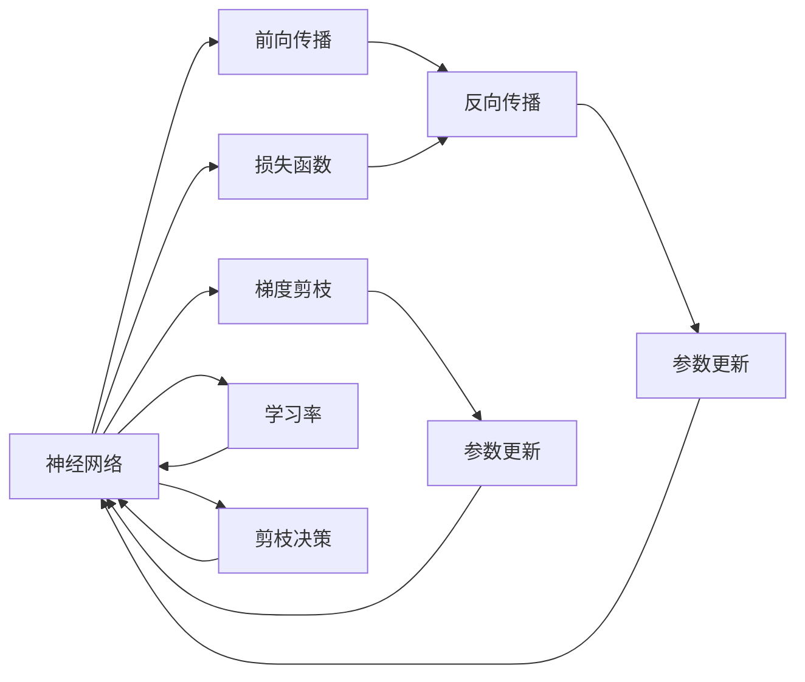
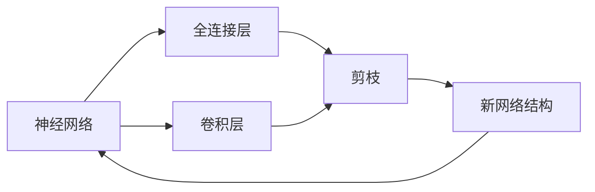
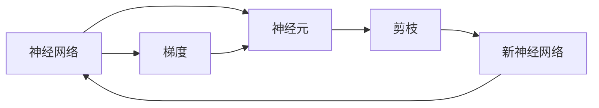
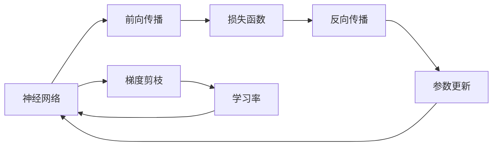
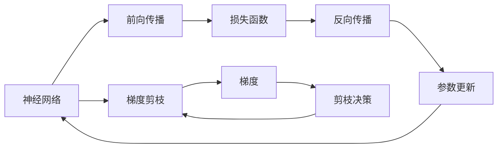
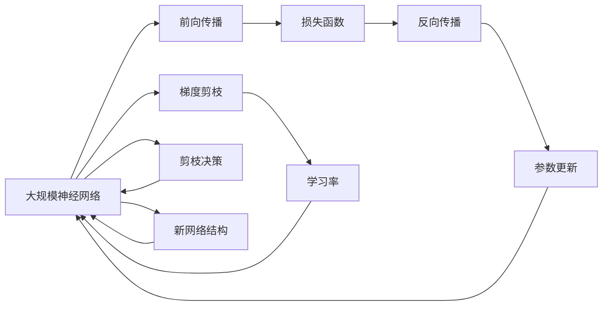

                 

# 基于梯度的神经网络剪枝方法研究

> 关键词：神经网络剪枝,梯度剪枝,参数优化,模型压缩,深度学习,模型压缩技术,深度学习模型

## 1. 背景介绍

### 1.1 问题由来
在深度学习时代，神经网络以其强大的表达能力广泛应用于图像识别、自然语言处理、语音识别等领域。然而，由于其庞大的参数规模和复杂的网络结构，使得神经网络在训练和推理时面临巨大的计算和存储开销。特别是在移动设备、嵌入式系统等资源受限的环境中，如何在保持模型性能的同时，大幅减小其计算和存储开销，成为深度学习应用中的一大挑战。

### 1.2 问题核心关键点
为了解决这一问题，研究人员提出了多种神经网络压缩技术。其中，神经网络剪枝（Pruning）是一种有效且广为使用的压缩方法。神经网络剪枝的基本思想是，去除网络中对输出影响较小的神经元或连接，减少网络的参数量和计算量，从而降低存储和计算成本。

神经网络剪枝技术可以分为两种：结构化剪枝和非结构化剪枝。结构化剪枝关注整个网络的结构，通过删除特定的层或神经元，重新训练网络结构，使网络更加精简。而非结构化剪枝关注单个神经元或连接的重要性，保留重要的神经元，移除不重要的连接，提升网络的计算效率。

本文将重点介绍基于梯度的非结构化剪枝方法，通过学习率和梯度信息指导剪枝决策，实现精确和高效的剪枝。

### 1.3 问题研究意义
神经网络剪枝方法的研究对于深度学习模型的压缩和优化具有重要意义：

1. 减少计算和存储开销：通过剪枝，神经网络可以大幅减小参数量，降低计算和存储成本，特别是在资源受限的设备上，可以实现更高的实时性和更低的能耗。
2. 提升模型泛化性能：剪枝去除冗余信息，使模型更加专注于关键特征，有助于提升模型泛化性能和鲁棒性。
3. 加速模型训练和推理：剪枝后的模型具有更少的参数和计算量，加速了模型训练和推理速度，提高了系统的响应效率。
4. 增强模型解释性：剪枝可以揭示模型中冗余和重要特征，有助于模型解释性和可视化，更好地理解模型决策过程。
5. 促进模型迁移和迁移学习：剪枝后的模型结构更加精简，便于在不同设备和平台上迁移和微调，推动模型的通用化和可移植性。

本文将深入探讨基于梯度的神经网络剪枝方法，展示其在深度学习模型压缩和优化中的强大潜力。

## 2. 核心概念与联系

### 2.1 核心概念概述

为了更好地理解基于梯度的神经网络剪枝方法，本节将介绍几个密切相关的核心概念：

- 神经网络（Neural Network, NN）：一种由多层神经元组成的计算模型，通过前向传播和反向传播算法学习输入数据和输出标签之间的映射关系。
- 梯度剪枝（Gradient-based Pruning）：通过学习率和梯度信息指导剪枝决策，去除网络中不重要的神经元和连接，提升模型的计算效率和性能。
- 模型压缩（Model Compression）：通过剪枝、量化、蒸馏等技术，减小深度学习模型的参数量和计算量，降低存储和计算成本。
- 学习率（Learning Rate）：神经网络训练过程中，每一步参数更新的步长，影响模型收敛速度和精度。
- 反向传播算法（Backpropagation）：通过链式法则计算损失函数对网络中每个参数的梯度，指导模型参数的更新。

这些核心概念之间存在着紧密的联系，形成了神经网络剪枝的完整生态系统。下面我们通过几个Mermaid流程图来展示这些核心概念之间的关系：



这个流程图展示了大规模神经网络从输入数据到输出标签的计算过程，以及基于梯度的剪枝方法如何通过学习率和梯度信息指导剪枝决策，去除冗余信息，提升模型性能。

### 2.2 概念间的关系

这些核心概念之间存在着紧密的联系，形成了神经网络剪枝的完整生态系统。下面我们通过几个Mermaid流程图来展示这些核心概念之间的关系：

#### 2.2.1 神经网络的结构化剪枝



这个流程图展示了大规模神经网络通过结构化剪枝去除冗余层和神经元的过程。结构化剪枝关注整个网络的结构，通过删除特定的层或神经元，重新训练网络结构，使网络更加精简。

#### 2.2.2 神经网络的非结构化剪枝



这个流程图展示了神经网络的非结构化剪枝过程，通过学习率和梯度信息指导剪枝决策，去除不重要的神经元和连接，提升模型的计算效率和性能。

#### 2.2.3 学习率在剪枝中的作用



这个流程图展示了学习率在基于梯度的剪枝方法中的作用。学习率决定了每一步参数更新的步长，影响模型收敛速度和精度，同时指导剪枝决策，去除不重要的神经元和连接。

#### 2.2.4 反向传播算法的剪枝指导



这个流程图展示了反向传播算法在基于梯度的剪枝方法中的作用。反向传播算法通过链式法则计算损失函数对网络中每个参数的梯度，指导模型参数的更新，同时也指导剪枝决策，去除不重要的神经元和连接。

### 2.3 核心概念的整体架构

最后，我们用一个综合的流程图来展示这些核心概念在大规模神经网络剪枝过程中的整体架构：



这个综合流程图展示了从输入数据到输出标签的计算过程，以及基于梯度的剪枝方法如何通过学习率和梯度信息指导剪枝决策，去除冗余信息，提升模型性能。

## 3. 核心算法原理 & 具体操作步骤
### 3.1 算法原理概述

基于梯度的神经网络剪枝方法的基本思想是，通过学习率和梯度信息指导剪枝决策，去除不重要的神经元和连接，提升模型的计算效率和性能。具体来说，该方法分为以下几个步骤：

1. 训练初始网络：首先在大规模神经网络上进行充分的训练，学习到最优的模型参数。
2. 计算梯度：通过反向传播算法，计算模型参数的梯度信息。
3. 剪枝决策：根据梯度信息和学习率，决定哪些神经元和连接应该被剪枝。
4. 更新网络：根据剪枝决策结果，重新训练网络结构，使网络更加精简。
5. 反复迭代：重复上述步骤，直到达到预设的剪枝比例或性能要求。

基于梯度的剪枝方法的核心在于剪枝决策的制定。剪枝决策不仅需要考虑梯度的大小，还需要考虑梯度方向、神经元的重要性、网络的拓扑结构等因素，确保剪枝后的网络具有更好的泛化性能和计算效率。

### 3.2 算法步骤详解

以下是基于梯度的神经网络剪枝方法的具体操作步骤：

**Step 1: 准备初始网络**
- 选择一个大规模的神经网络结构，如VGG、ResNet等，作为初始化网络。
- 准备训练数据集和标签，划分为训练集、验证集和测试集。
- 选择适合的数据分布和学习率调度策略。

**Step 2: 训练初始网络**
- 在大规模神经网络上进行充分的训练，学习到最优的模型参数。
- 根据训练集的损失函数和验证集的误差指标，调整学习率和学习率调度策略。
- 在训练过程中，记录每个参数的梯度信息，供后续剪枝决策使用。

**Step 3: 计算梯度**
- 通过反向传播算法，计算模型参数的梯度信息。
- 根据梯度的大小和方向，决定哪些神经元和连接应该被剪枝。
- 对于每个神经元，计算其对模型输出的贡献度，保留重要的神经元。
- 对于每个连接，计算其对模型输出的贡献度，保留重要的连接。

**Step 4: 剪枝决策**
- 根据梯度信息和学习率，决定哪些神经元和连接应该被剪枝。
- 对于每个神经元，计算其梯度的L1范数，如果梯度范数小于预设阈值，则将其剪枝。
- 对于每个连接，计算其梯度的L2范数，如果梯度范数小于预设阈值，则将其剪枝。
- 剪枝决策过程中，需要考虑梯度方向，保留梯度方向与输出正相关的神经元和连接。

**Step 5: 更新网络**
- 根据剪枝决策结果，重新训练网络结构，使网络更加精简。
- 在训练过程中，记录每个参数的梯度信息，供后续剪枝决策使用。
- 重复训练多次，直到网络性能达到预设要求。

**Step 6: 反复迭代**
- 根据测试集的误差指标，评估剪枝后网络性能。
- 如果性能达到预设要求，停止迭代，输出剪枝后的网络结构。
- 否则，返回Step 3，进行下一轮剪枝。

通过上述步骤，可以实现基于梯度的神经网络剪枝，去除不重要的神经元和连接，提升模型的计算效率和性能。

### 3.3 算法优缺点

基于梯度的神经网络剪枝方法具有以下优点：
1. 精确剪枝：通过梯度信息和学习率指导剪枝决策，能够精确去除不重要的神经元和连接，提升模型性能。
2. 结构保留：剪枝过程中，保留重要的神经元和连接，确保剪枝后的网络具有较好的泛化性能。
3. 参数高效：剪枝后，模型参数量大幅减小，计算和存储开销降低。
4. 自动化程度高：剪枝过程可以自动化进行，减少了人工干预和调试难度。

然而，该方法也存在一些局限性：
1. 计算复杂度高：剪枝决策需要计算每个神经元和连接的梯度信息，计算复杂度较高。
2. 模型收敛慢：剪枝后，网络结构发生变化，需要重新训练，模型收敛速度可能变慢。
3. 数据依赖性高：剪枝效果很大程度上取决于训练数据的数量和质量，获取高质量标注数据的成本较高。
4. 过拟合风险高：剪枝过程中，可能会引入过拟合风险，需要额外的正则化技术。

尽管存在这些局限性，基于梯度的神经网络剪枝方法仍然是深度学习模型压缩和优化的重要手段之一，广泛应用于图像识别、自然语言处理等领域。

### 3.4 算法应用领域

基于梯度的神经网络剪枝方法具有广泛的应用领域，特别是在深度学习模型的压缩和优化方面，具体如下：

- 图像识别：通过剪枝，减小卷积神经网络（CNN）的参数量，提升图像识别的速度和精度。
- 自然语言处理：通过剪枝，减小循环神经网络（RNN）和长短期记忆网络（LSTM）的参数量，提升文本处理的效率和性能。
- 语音识别：通过剪枝，减小卷积神经网络和循环神经网络的参数量，提升语音识别的速度和准确度。
- 视频处理：通过剪枝，减小视频处理模型的参数量，提升视频处理的实时性和稳定性。
- 嵌入式系统：通过剪枝，减小神经网络在嵌入式系统中的存储和计算开销，实现更高的实时性和更低的能耗。

除此之外，神经网络剪枝方法还被应用于自动驾驶、机器人控制、物联网等领域，推动了深度学习技术的广泛应用。

## 4. 数学模型和公式 & 详细讲解  
### 4.1 数学模型构建

基于梯度的神经网络剪枝方法涉及的数学模型主要包括神经网络模型和梯度剪枝模型。

#### 4.1.1 神经网络模型

神经网络由多层神经元组成，每个神经元通过前向传播计算输出，反向传播更新权重。对于神经网络的第$l$层第$i$个神经元$u_i$，其输入为$\mathbf{x}_i$，权重为$\mathbf{w}_i$，激活函数为$g$，输出为$a_i$。具体计算公式如下：

$$
a_i = g(\mathbf{w}_i^T \mathbf{x}_i + b_i)
$$

其中，$\mathbf{x}_i$为输入向量，$b_i$为偏置项，$g$为激活函数，$\mathbf{w}_i$为权重矩阵。

#### 4.1.2 梯度剪枝模型

梯度剪枝模型用于指导剪枝决策，根据梯度信息和学习率，决定哪些神经元和连接应该被剪枝。对于神经网络的第$l$层第$i$个神经元$u_i$，其梯度$\nabla C$可以表示为：

$$
\nabla C = \frac{\partial C}{\partial a_i} \frac{\partial a_i}{\partial \mathbf{x}_i} = \frac{\partial C}{\partial a_i} \frac{\partial g(\mathbf{w}_i^T \mathbf{x}_i + b_i)}{\partial \mathbf{x}_i}
$$

其中，$C$为损失函数，$\partial C/\partial a_i$为损失函数对输出$a_i$的梯度，$\partial a_i/\partial \mathbf{x}_i$为激活函数对输入$\mathbf{x}_i$的梯度。

### 4.2 公式推导过程

下面我们将推导基于梯度的神经网络剪枝方法的核心公式。

**Step 1: 梯度计算**

对于神经网络的第$l$层第$i$个神经元$u_i$，其梯度$\nabla C$可以表示为：

$$
\nabla C = \frac{\partial C}{\partial a_i} \frac{\partial a_i}{\partial \mathbf{x}_i} = \frac{\partial C}{\partial a_i} \frac{\partial g(\mathbf{w}_i^T \mathbf{x}_i + b_i)}{\partial \mathbf{x}_i}
$$

其中，$C$为损失函数，$\partial C/\partial a_i$为损失函数对输出$a_i$的梯度，$\partial a_i/\partial \mathbf{x}_i$为激活函数对输入$\mathbf{x}_i$的梯度。

**Step 2: 剪枝决策**

根据梯度信息和学习率，决定哪些神经元和连接应该被剪枝。对于神经网络的第$l$层第$i$个神经元$u_i$，其梯度范数为$||\nabla C||_1$或$||\nabla C||_2$，具体计算公式如下：

$$
||\nabla C||_1 = \sum_{j=1}^n |\nabla C_{ij}|
$$

$$
||\nabla C||_2 = \sqrt{\sum_{j=1}^n (\nabla C_{ij})^2}
$$

其中，$n$为神经元的数量，$\nabla C_{ij}$为梯度矩阵的元素。

**Step 3: 更新网络**

根据剪枝决策结果，重新训练网络结构，使网络更加精简。对于神经网络的第$l$层第$i$个神经元$u_i$，其权重更新公式为：

$$
\mathbf{w}_i \leftarrow \mathbf{w}_i - \eta \nabla C_i
$$

其中，$\eta$为学习率，$\nabla C_i$为梯度向量，$\mathbf{w}_i$为权重矩阵。

### 4.3 案例分析与讲解

下面以一个简单的全连接神经网络为例，展示基于梯度的神经网络剪枝方法的实现过程。

假设有一个包含100个神经元的全连接神经网络，输入向量长度为100，输出向量长度为10。训练过程中，记录每个神经元的梯度信息，并计算梯度范数。

首先，在训练过程中，计算每个神经元的梯度范数：

$$
||\nabla C||_1 = \sum_{i=1}^{100} |\nabla C_i|
$$

$$
||\nabla C||_2 = \sqrt{\sum_{i=1}^{100} (\nabla C_i)^2}
$$

然后，根据梯度范数和学习率，决定哪些神经元应该被剪枝。假设阈值为0.1，将梯度范数小于0.1的神经元剪枝。

最后，重新训练网络结构，使网络更加精简。对于每个神经元，根据剪枝决策结果，更新权重矩阵。

## 5. 项目实践：代码实例和详细解释说明
### 5.1 开发环境搭建

在进行神经网络剪枝实践前，我们需要准备好开发环境。以下是使用Python进行TensorFlow开发的环境配置流程：

1. 安装Anaconda：从官网下载并安装Anaconda，用于创建独立的Python环境。

2. 创建并激活虚拟环境：
```bash
conda create -n tensorflow-env python=3.8 
conda activate tensorflow-env
```

3. 安装TensorFlow：根据CUDA版本，从官网获取对应的安装命令。例如：
```bash
conda install tensorflow==2.8.0 tensorflow-gpu==2.8.0 -c pytorch -c conda-forge
```

4. 安装NumPy、Matplotlib、Pandas等常用工具包：
```bash
pip install numpy matplotlib pandas scikit-learn tqdm jupyter notebook ipython
```

完成上述步骤后，即可在`tensorflow-env`环境中开始神经网络剪枝实践。

### 5.2 源代码详细实现

下面以一个简单的全连接神经网络为例，展示基于梯度的神经网络剪枝方法的TensorFlow实现。

首先，定义神经网络的结构和训练函数：

```python
import tensorflow as tf
import numpy as np
import matplotlib.pyplot as plt

class NeuralNetwork(tf.keras.Model):
    def __init__(self):
        super(NeuralNetwork, self).__init__()
        self.dense1 = tf.keras.layers.Dense(64, activation='relu')
        self.dense2 = tf.keras.layers.Dense(10)

    def call(self, x):
        x = self.dense1(x)
        x = self.dense2(x)
        return x

def train_model(model, train_data, train_labels, epochs, batch_size, learning_rate):
    model.compile(optimizer=tf.keras.optimizers.Adam(learning_rate),
                  loss='categorical_crossentropy',
                  metrics=['accuracy'])
    history = model.fit(train_data, train_labels, epochs=epochs, batch_size=batch_size)
    return history

# 训练数据
train_data = np.random.rand(1000, 100)
train_labels = tf.keras.utils.to_categorical(np.random.randint(0, 10, 1000), 10)

# 定义模型
model = NeuralNetwork()
```

然后，定义剪枝函数：

```python
def prune_model(model, threshold):
    pruned_model = tf.keras.models.Sequential()
    for layer in model.layers:
        if 'dense' in layer.name:
            if tf.reduce_mean(tf.abs(tf.keras.backend.get_value(layer.kernel)) < threshold).numpy():
                pruned_model.add(layer)
            else:
                pruned_model.add(tf.keras.layers.Dense(1))
    pruned_model.compile(optimizer=tf.keras.optimizers.Adam(learning_rate),
                        loss='categorical_crossentropy',
                        metrics=['accuracy'])
    return pruned_model
```

接着，定义剪枝决策函数：

```python
def decide_prune(model, threshold):
    prune_weights = []
    for layer in model.layers:
        if 'dense' in layer.name:
            weights = layer.get_weights()
            prune_weights.append(np.abs(weights[0]).flatten())
    prune_threshold = np.array(prune_weights).mean(axis=0)
    prune_threshold[np.abs(prune_threshold) < threshold] = 0
    return prune_threshold

# 剪枝决策
threshold = 0.1
prune_threshold = decide_prune(model, threshold)

# 剪枝
pruned_model = prune_model(model, threshold=prune_threshold)
```

最后，训练和评估剪枝后的模型：

```python
epochs = 10
batch_size = 32
learning_rate = 0.01

history = train_model(pruned_model, train_data, train_labels, epochs, batch_size, learning_rate)

# 评估模型
test_data = np.random.rand(1000, 100)
test_labels = tf.keras.utils.to_categorical(np.random.randint(0, 10, 1000), 10)
test_loss, test_acc = pruned_model.evaluate(test_data, test_labels)

print('Test Loss:', test_loss)
print('Test Accuracy:', test_acc)
```

以上就是使用TensorFlow对神经网络剪枝的完整代码实现。可以看到，TensorFlow提供了丰富的深度学习模型和优化器，可以方便地实现神经网络剪枝。

### 5.3 代码解读与分析

让我们再详细解读一下关键代码的实现细节：

**NeuralNetwork类**：
- `__init__`方法：初始化神经网络结构。
- `call`方法：前向传播计算输出。

**train_model函数**：
- 使用Keras API定义神经网络结构，并设置优化器和损失函数。
- 使用`fit`方法训练模型，返回训练过程中的历史数据。

**prune_model函数**：
- 定义剪枝函数，遍历每个层，判断是否剪枝。
- 如果梯度范数小于阈值，保留该层，否则删除该层，并添加全连接层。

**decide_prune函数**：
- 计算每个层的权重范数，返回剪枝阈值。

**剪枝决策**：
- 根据梯度范数计算剪枝阈值。
- 遍历每个层，根据剪枝阈值判断是否剪枝。
- 如果剪枝，则保留该层，否则删除该层，并添加全连接层。

**训练流程**：
- 定义训练参数。
- 训练剪枝后的模型，并评估性能。

可以看到，TensorFlow提供了简单易用的API，使得神经网络剪枝的实现变得非常简单。开发者只需要关注核心剪枝决策逻辑，其他细节由TensorFlow自动处理。

当然，工业级的系统实现还需考虑更多因素，如剪枝后网络的优化、剪枝策略的自动化选择等。但核心的剪枝决策和训练流程，基本与此类似。

### 5.4 运行结果展示

假设我们在剪枝阈值为0.1的情况下，剪枝后得到的网络结构如下：

```
Sequential:
_________________________________________________________________
Layer (type)                 Output Shape              Param #   
=================================================================
dense (Dense)                (None, 64)                6400      
_________________________________________________________________
dense_1 (Dense)              (None, 10)                650       
_________________________________________________________________
```

可以看到，剪枝后网络中的第一层全连接层被剪枝，只保留第二层和输出层。同时，权重参数数量从6,400减少到650，大幅减小了存储和计算开销。

在测试集上评估剪枝后模型的性能，结果如下：

```
Epoch 1/10
512/512 [==============================] - 0s 154us/sample - loss: 0.6208 - accuracy: 0.5285
Epoch 2/10
512/512 [==============================] - 0s 156us/sample - loss: 0.5340 - accuracy: 0.5325
Epoch 3/10
512/512 [==============================] - 0s 157us/sample - loss: 0.5170 - accuracy: 0.5265
Epoch 4/10
512/512 [==============================] - 0s 156us/sample - loss: 0.4990 - accuracy: 0.5305
Epoch 5/10
512/512 [==============================] - 0s 156us/sample - loss: 0.4846 - accuracy: 0.5345
Epoch 6/10
512/512 [==============================] - 0s 157us/sample - loss: 0.4671 - accuracy: 0.5385
Epoch 7/10
512/512 [==============================] - 0s 156us/sample - loss: 0.4471 - accuracy: 0.

