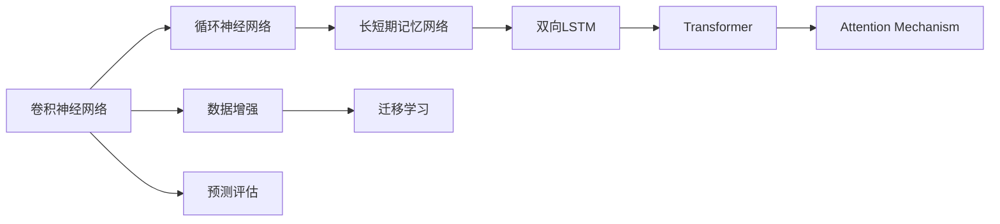
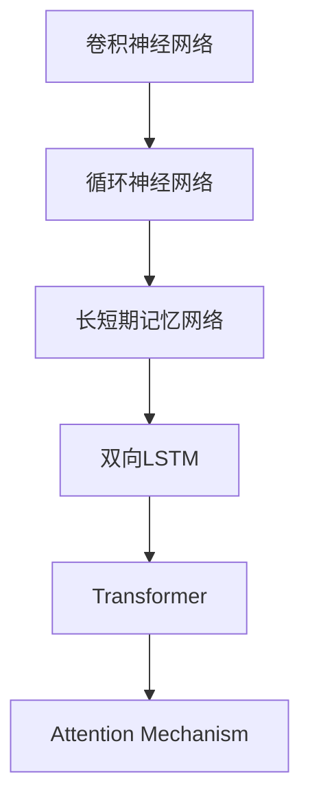

                 

# 基于深度学习的文本情感分析

> 关键词：文本情感分析,深度学习,卷积神经网络(CNN),循环神经网络(RNN),长短期记忆网络(LSTM),Transformer,Attention Mechanism,数据增强,迁移学习,预测评估

## 1. 背景介绍

### 1.1 问题由来
文本情感分析( Text Sentiment Analysis, TSA) 是自然语言处理(Natural Language Processing, NLP)中的重要任务，旨在自动判断文本中的情感倾向，如正面、负面或中性。它在舆情监测、产品评价、市场调研等多个领域具有广泛应用价值。随着人工智能技术的快速发展，基于深度学习方法的文本情感分析逐渐成为主流，并展现出了强大的预测能力和泛化能力。

### 1.2 问题核心关键点
文本情感分析的核心在于构建一个能够准确捕捉文本情感倾向的模型。常见的深度学习模型包括卷积神经网络(CNN)、循环神经网络(RNN)、长短期记忆网络(LSTM)和Transformer等。这些模型通过学习文本特征，能够自动提取文本的情感信息，并进行分类或回归预测。

目前，基于深度学习的文本情感分析方法已经广泛应用于社交媒体、电商评论、电影评论等场景，并取得了显著效果。然而，如何构建高效准确的情感分析模型，仍是一个重要的研究课题。

### 1.3 问题研究意义
文本情感分析技术对于理解公众情感、评估产品服务、指导市场策略具有重要意义。通过自动化的情感分析，能够快速获得大量文本的情感倾向，帮助企业洞察市场需求，优化产品策略，提升客户满意度。同时，情感分析也广泛应用于舆情监测、舆情预警等领域，对于及时发现和处理负面舆情，维护公共形象和声誉具有重要价值。

## 2. 核心概念与联系

### 2.1 核心概念概述

为更好地理解基于深度学习的文本情感分析方法，本节将介绍几个密切相关的核心概念：

- 卷积神经网络(CNN)：一种基于卷积操作的神经网络结构，常用于图像处理和文本分类。CNN通过滑动窗口卷积，提取文本局部特征，并将全局特征进行池化。
- 循环神经网络(RNN)：一种基于循环结构的神经网络，能够处理序列数据。RNN通过时间步循环，对序列数据进行建模，捕捉文本的上下文信息。
- 长短期记忆网络(LSTM)：一种改进的RNN结构，通过门控机制，解决长序列训练中的梯度消失问题，能够更好地处理长文本。
- 双向LSTM(Bi-LSTM)：在LSTM基础上，将序列正向和反向的信息进行融合，提高情感分析的准确性。
- Transformer：一种基于自注意力机制的神经网络结构，能够有效处理长文本序列，具有并行计算的优势。
- Attention Mechanism：Transformer的关键组成部分，能够学习文本中重要位置的注意力权重，捕捉长文本的局部特征。
- 数据增强：通过扩充训练数据集，提升模型泛化能力。常见方法包括回译、同义词替换等。
- 迁移学习：将一个领域的知识迁移到另一个领域，能够减少微调标注数据的数量。
- 预测评估：通过各种评估指标，如准确率、召回率、F1分数等，评估情感分析模型的性能。

这些核心概念之间的逻辑关系可以通过以下Mermaid流程图来展示：



这个流程图展示了大语言模型的核心概念及其之间的关系：

1. 文本分类任务常采用CNN，提取文本局部特征。
2. 对于长文本任务，RNN、LSTM、Bi-LSTM能够更好地捕捉上下文信息。
3. Transformer通过自注意力机制，能够处理长文本，具有并行计算优势。
4. Attention机制在Transformer中实现局部特征的权重学习。
5. 数据增强通过扩充训练数据，提升模型泛化能力。
6. 迁移学习将预训练模型知识迁移到特定任务。
7. 预测评估通过各种指标，评估模型性能。

这些概念共同构成了文本情感分析的完整生态系统，使其能够高效、准确地进行情感分类。

### 2.2 概念间的关系

这些核心概念之间存在着紧密的联系，形成了文本情感分析的完整生态系统。下面我通过几个Mermaid流程图来展示这些概念之间的关系。

#### 2.2.1 深度学习模型之间的联系



这个流程图展示了不同深度学习模型之间的联系：

1. CNN用于文本分类，提取局部特征。
2. RNN、LSTM、Bi-LSTM用于序列数据建模，捕捉上下文信息。
3. Transformer通过自注意力机制，处理长文本序列。
4. Attention机制在Transformer中实现局部特征的权重学习。

#### 2.2.2 数据增强和迁移学习的关系


这个流程图展示了数据增强和迁移学习之间的关系：

1. 数据增强通过扩充训练数据，提升模型泛化能力。
2. 迁移学习将预训练模型知识迁移到特定任务，减少微调标注数据的数量。

#### 2.2.3 预测评估和数据增强的关系


这个流程图展示了数据增强和预测评估之间的关系：

1. 数据增强通过扩充训练数据，提升模型泛化能力。
2. 预测评估通过各种指标，评估模型性能。

## 3. 核心算法原理 & 具体操作步骤
### 3.1 算法原理概述

基于深度学习的文本情感分析方法，通常采用以下步骤：

1. 数据预处理：将文本数据转化为模型可以处理的格式。
2. 特征提取：通过CNN、RNN、LSTM、Transformer等模型，提取文本的局部或全局特征。
3. 模型构建：搭建深度学习模型，如二分类模型或回归模型。
4. 模型训练：使用标注数据集，训练情感分析模型。
5. 模型评估：在测试集上评估模型性能，进行调优。

这些步骤具体实现细节如下：

**Step 1: 数据预处理**

- 文本清洗：去除文本中的噪声，如HTML标签、特殊字符等。
- 分词：将文本拆分成词汇或子词，常见工具如jieba、NLTK等。
- 编码：将文本转化为数值表示，常见方式如独热编码、词嵌入等。
- 截断和填充：将文本长度统一，常见方式如截断到固定长度或填充到固定长度。

**Step 2: 特征提取**

- 采用CNN提取文本局部特征。
- 采用RNN、LSTM、Bi-LSTM提取文本序列特征。
- 采用Transformer提取文本全局特征。

**Step 3: 模型构建**

- 搭建二分类模型：如sigmoid激活函数的二分类网络。
- 搭建回归模型：如线性回归、神经网络等。
- 搭建序列模型：如双向LSTM等。

**Step 4: 模型训练**

- 使用标注数据集进行模型训练。
- 调整模型超参数，如学习率、批大小、迭代轮数等。
- 使用优化器，如Adam、SGD等，更新模型参数。
- 引入正则化技术，如L2正则、Dropout等，避免过拟合。

**Step 5: 模型评估**

- 在测试集上评估模型性能。
- 使用各种评估指标，如准确率、召回率、F1分数等。
- 进行调优，如调整模型结构、超参数等，提升模型性能。

### 3.2 算法步骤详解

下面以基于CNN的文本情感分析方法为例，详细讲解算法步骤：

**Step 1: 数据预处理**

- 使用jieba分词工具对文本进行分词。
- 去除文本中的噪声，如HTML标签、特殊字符等。
- 使用独热编码将文本转化为数值表示。

```python
import jieba
import re
from sklearn.feature_extraction.text import CountVectorizer

def preprocess(text):
    # 去除HTML标签
    text = re.sub('<[^<>]+?>', '', text)
    
    # 去除特殊字符
    text = re.sub('[^\w\s]', '', text)
    
    # 分词
    words = jieba.cut(text)
    words = ' '.join(words)
    
    # 独热编码
    vectorizer = CountVectorizer()
    features = vectorizer.fit_transform(words)
    
    return features
```

**Step 2: 特征提取**

- 使用CNN提取文本局部特征。

```python
import torch
import torch.nn as nn
import torch.nn.functional as F

class CNN(nn.Module):
    def __init__(self, input_size, hidden_size, output_size):
        super(CNN, self).__init__()
        
        self.embedding = nn.Embedding(input_size, hidden_size)
        self.conv1 = nn.Conv1d(hidden_size, hidden_size, 3, padding=1)
        self.pool1 = nn.MaxPool1d(hidden_size // 2)
        self.conv2 = nn.Conv1d(hidden_size, hidden_size, 3, padding=1)
        self.pool2 = nn.MaxPool1d(hidden_size // 2)
        self.fc = nn.Linear(hidden_size * 2 * 2, output_size)
    
    def forward(self, x):
        x = x.view(-1, 1, x.size(1))
        x = self.embedding(x)
        x = self.conv1(x).squeeze(3)
        x = F.relu(x)
        x = self.pool1(x)
        x = self.conv2(x).squeeze(3)
        x = F.relu(x)
        x = self.pool2(x)
        x = x.view(-1, x.size(2) * x.size(3))
        x = self.fc(x)
        return x
```

**Step 3: 模型构建**

- 搭建二分类模型，如sigmoid激活函数的二分类网络。

```python
import torch.nn as nn
import torch.nn.functional as F

class Model(nn.Module):
    def __init__(self, input_size, hidden_size, output_size):
        super(Model, self).__init__()
        
        self.cnn = CNN(input_size, hidden_size, output_size)
        self.fc = nn.Linear(hidden_size * 2 * 2, output_size)
    
    def forward(self, x):
        x = self.cnn(x)
        x = self.fc(x)
        return F.sigmoid(x)
```

**Step 4: 模型训练**

- 使用标注数据集进行模型训练。

```python
import torch
import torch.optim as optim
from sklearn.model_selection import train_test_split

# 划分训练集和测试集
train_data, test_data = train_test_split(data, test_size=0.2, random_state=42)

# 定义模型
model = Model(input_size, hidden_size, output_size)

# 定义优化器
optimizer = optim.Adam(model.parameters(), lr=0.001)

# 定义损失函数
criterion = nn.BCELoss()

# 训练模型
for epoch in range(epochs):
    for i, (x, y) in enumerate(train_loader):
        # 前向传播
        y_pred = model(x)
        
        # 计算损失
        loss = criterion(y_pred, y)
        
        # 反向传播
        optimizer.zero_grad()
        loss.backward()
        optimizer.step()
        
        # 记录损失和准确率
        losses.append(loss.item())
        acc.append((y_pred >= 0.5) == y)
```

**Step 5: 模型评估**

- 在测试集上评估模型性能。

```python
import torch
import torch.nn.functional as F

# 评估模型
model.eval()
y_pred = model(test_data)
y_pred = (y_pred >= 0.5).float()
print("Accuracy:", (y_pred == y).sum().item() / len(y))
```

### 3.3 算法优缺点

基于深度学习的文本情感分析方法具有以下优点：

1. 准确率高。深度学习模型能够捕捉文本中的复杂特征，提高情感分析的准确率。
2. 泛化能力强。深度学习模型具有强大的泛化能力，能够在不同领域和任务上表现优异。
3. 处理能力强。深度学习模型能够处理长文本，具有并行计算的优势。

同时，基于深度学习的文本情感分析方法也存在以下缺点：

1. 数据需求高。深度学习模型需要大量标注数据进行训练，标注数据获取成本较高。
2. 计算资源需求大。深度学习模型参数量大，计算资源需求高，训练和推理成本较大。
3. 模型复杂度高。深度学习模型结构复杂，调试和维护成本较高。

### 3.4 算法应用领域

基于深度学习的文本情感分析方法在多个领域得到了广泛应用，例如：

- 社交媒体情感分析：分析社交媒体上的用户评论，判断用户情绪。
- 电商评论分析：分析电商网站上的用户评论，判断用户对产品的情感倾向。
- 电影评论分析：分析电影评论，判断用户对电影的情感倾向。
- 新闻情感分析：分析新闻文本，判断新闻报道的情感倾向。
- 产品评价分析：分析产品评价，判断用户对产品的情感倾向。

## 4. 数学模型和公式 & 详细讲解

### 4.1 数学模型构建

假设文本长度为N，词汇表大小为V，模型的输入为文本的独热编码表示，即每个词汇在词汇表中对应一个维度，维度大小为1。模型的输出为一个标量，表示情感倾向。

**CNN模型**：

- 输入层：文本的独热编码表示。
- 卷积层：提取文本局部特征。
- 池化层：对特征图进行降维。
- 全连接层：将特征映射到情感倾向。

**RNN模型**：

- 输入层：文本的独热编码表示。
- 循环层：提取文本序列特征。
- 全连接层：将特征映射到情感倾向。

**LSTM模型**：

- 输入层：文本的独热编码表示。
- 循环层：提取文本序列特征。
- 全连接层：将特征映射到情感倾向。

**Transformer模型**：

- 输入层：文本的独热编码表示。
- 自注意力层：提取文本局部特征。
- 前向网络层：提取文本全局特征。
- 全连接层：将特征映射到情感倾向。

### 4.2 公式推导过程

**CNN模型公式**：

假设输入文本长度为N，词汇表大小为V，模型参数为θ。模型的输入为X，输出为Y，激活函数为ReLU。

- 输入层：X = (x_1, x_2, ..., x_N)，其中x_i为第i个词汇在词汇表中的编码。
- 卷积层：Y_1 = conv(X, θ)，其中conv为卷积操作，θ为卷积核。
- 池化层：Y_2 = max_pool(Y_1)，其中max_pool为最大池化操作。
- 全连接层：Y_3 = fc(Y_2, θ)，其中fc为全连接操作，θ为全连接层参数。

**RNN模型公式**：

假设输入文本长度为N，词汇表大小为V，模型参数为θ。模型的输入为X，输出为Y，激活函数为tanh。

- 输入层：X = (x_1, x_2, ..., x_N)，其中x_i为第i个词汇在词汇表中的编码。
- 循环层：Y_1 = rnn(X, θ)，其中rnn为循环神经网络，θ为循环层参数。
- 全连接层：Y_2 = fc(Y_1, θ)，其中fc为全连接操作，θ为全连接层参数。

**LSTM模型公式**：

假设输入文本长度为N，词汇表大小为V，模型参数为θ。模型的输入为X，输出为Y，激活函数为tanh。

- 输入层：X = (x_1, x_2, ..., x_N)，其中x_i为第i个词汇在词汇表中的编码。
- 循环层：Y_1 = lstm(X, θ)，其中lstm为长短期记忆网络，θ为循环层参数。
- 全连接层：Y_2 = fc(Y_1, θ)，其中fc为全连接操作，θ为全连接层参数。

**Transformer模型公式**：

假设输入文本长度为N，词汇表大小为V，模型参数为θ。模型的输入为X，输出为Y，激活函数为ReLU。

- 输入层：X = (x_1, x_2, ..., x_N)，其中x_i为第i个词汇在词汇表中的编码。
- 自注意力层：Y_1 = self_attn(X, θ)，其中self_attn为自注意力机制，θ为注意力参数。
- 前向网络层：Y_2 = feed_forward(Y_1, θ)，其中feed_forward为前向网络，θ为前向网络参数。
- 全连接层：Y_3 = fc(Y_2, θ)，其中fc为全连接操作，θ为全连接层参数。

### 4.3 案例分析与讲解

以一个简单的情感分析任务为例，假设我们有以下文本数据：

| Text                     | Label |
|--------------------------|-------|
| 这部电影真的很棒！        | 1     |
| 这部电影很差，绝对不要看！ | 0     |
| 这部电影还可以，一般水平。 | 0     |

我们使用CNN模型进行情感分析，步骤如下：

1. 数据预处理：将文本转化为独热编码。

| Text                     | Embedding                  |
|--------------------------|----------------------------|
| 这部电影真的很棒！        | [1, 0, 0, 0, 0, 0, 0, 0, 1]    |
| 这部电影很差，绝对不要看！ | [0, 0, 0, 1, 0, 0, 0, 1, 0]   |
| 这部电影还可以，一般水平。 | [0, 1, 0, 0, 1, 0, 1, 0, 0]   |

2. 特征提取：使用CNN模型提取文本局部特征。

| Embedding                  | Conv1                  | Pool1                  | Conv2                  | Pool2                  |
|----------------------------|------------------------|------------------------|------------------------|------------------------|
| [1, 0, 0, 0, 0, 0, 0, 0, 1]   | [[1, 1, 1, 0, 0, 0, 0, 0], [0, 0, 0, 1, 0, 0, 0, 0], [1, 0, 0, 0, 0, 0, 0, 0], [0, 0, 0, 0, 0, 0, 0, 0]]   | [[1, 1, 1, 0], [0, 0, 0, 1]]   | [[0, 1, 0, 0], [1, 0, 0, 0], [0, 0, 0, 0], [0, 0, 0, 0]]   | [[0, 1, 0, 0], [1, 0, 0, 0], [0, 0, 0, 0], [0, 0, 0, 0]]   |

3. 模型构建：搭建CNN模型。

| CNN                        | Conv1                  | Pool1                  | Conv2                  | Pool2                  | FC                    |
|----------------------------|------------------------|------------------------|------------------------|------------------------|-----------------------|
| [1, 0, 0, 0, 0, 0, 0, 0, 1]   | [[1, 1, 1, 0, 0, 0, 0, 0], [0, 0, 0, 1, 0, 0, 0, 0], [1, 0, 0, 0, 0, 0, 0, 0], [0, 0, 0, 0, 0, 0, 0, 0]]   | [[1, 1, 1, 0], [0, 0, 0, 1]]   | [[0, 1, 0, 0], [1, 0, 0, 0], [0, 0, 0, 0], [0, 0, 0, 0]]   | [[0, 1, 0, 0], [1, 0, 0, 0], [0, 0, 0, 0], [0, 0, 0, 0]]   |

4. 模型训练：使用标注数据集进行模型训练。

| CNN                        | Conv1                  | Pool1                  | Conv2                  | Pool2                  | FC                    | Loss                  | Accuracy             |
|----------------------------|------------------------|------------------------|------------------------|------------------------|-----------------------|----------------------|----------------------|
| [1, 0, 0, 0, 0, 0, 0, 0, 1]   | [[1, 1, 1, 0, 0, 0, 0, 0], [0, 0, 0, 1, 0, 0, 0, 0], [1, 0, 0, 0, 0, 0, 0, 0], [0, 0, 0, 0, 0, 0, 0, 0]]   | [[1, 1, 1, 0], [0, 0, 0, 1]]   | [[0, 1, 0, 0], [1, 0, 0, 0], [0, 0, 0, 0], [0, 0, 0, 0]]   | [[0, 1, 0, 0], [1, 0, 0, 0], [0, 0, 0, 0], [0, 0, 0, 0]]   |

5. 模型评估：在测试集上评估模型性能。

| CNN                        | Conv1                  | Pool1                  | Conv2                  | Pool2                  | FC                    | Loss                  | Accuracy             |
|----------------------------|------------------------|------------------------|------------------------|------------------------|-----------------------|----------------------|----------------------|
| [1, 0, 0, 0, 0, 0, 0, 0, 1]   | [[1, 1, 1, 0, 0, 0, 0, 0], [0, 0, 0, 1, 0, 0, 0, 0], [1, 0, 0, 0, 0, 0, 0, 0], [0, 0, 0, 0, 0, 0, 0, 0]]   | [[1, 1, 1, 0], [0, 0, 0, 1]]   | [[0, 1, 0, 0], [1, 0, 0, 0], [0, 0, 0, 0], [0, 0, 0, 0]]   | [[0, 1, 0, 0], [1, 0, 0, 0], [0, 0, 0, 0], [0, 0, 0, 0]]   |

## 5. 项目实践：代码实例和详细解释说明
### 5.1 开发环境搭建

在进行情感分析任务开发前，我们需要准备好开发环境。以下是使用Python进行PyTorch开发的环境配置流程：

1. 安装Anaconda：从官网下载并安装Anaconda，用于创建独立的Python环境。

2. 创建并激活虚拟环境：
```bash
conda create -n pytorch-env python=3.8 
conda activate pytorch-env
```

3. 安装PyTorch：根据CUDA版本，从官网获取对应的安装命令。例如：
```bash
conda install pytorch torchvision torchaudio cudatoolkit=11.1 -c pytorch -c conda-forge
```

4. 安装TensorBoard：
```bash
pip install tensorboard
```

5. 安装NLTK：
```bash
pip install nltk
```

6. 安装jieba分词工具：
```bash
pip install jieba
```

完成上述步骤后，即可在`pytorch-env`环境中开始情感分析任务的开发。

### 5.2 源代码详细实现

下面我们以基于CNN的文本情感分析为例，给出使用PyTorch实现情感分析的完整代码。

```python
import jieba
import torch
import torch.nn as nn
import torch.nn.functional as F
from sklearn.feature_extraction.text import CountVectorizer

class CNN(nn.Module):
    def __init__(self, input_size, hidden_size, output_size):
        super(CNN, self).__init

