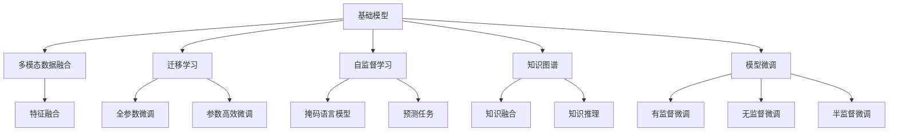
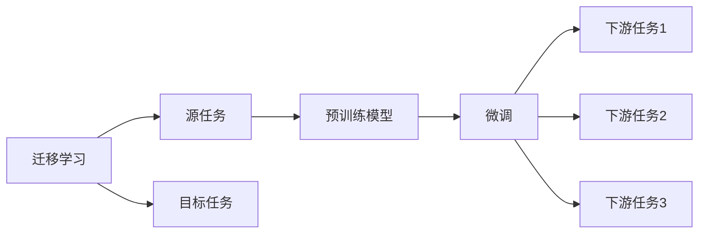
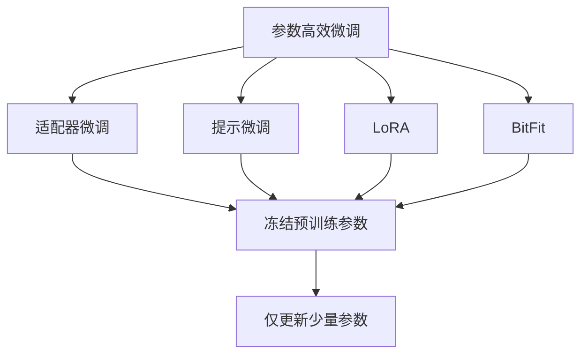
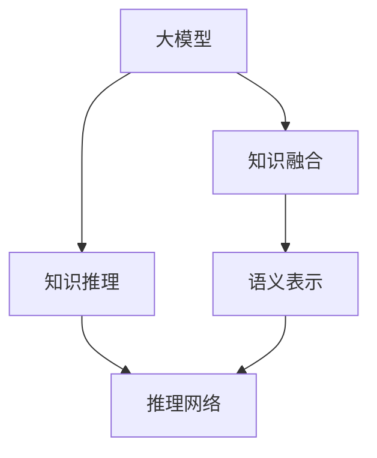
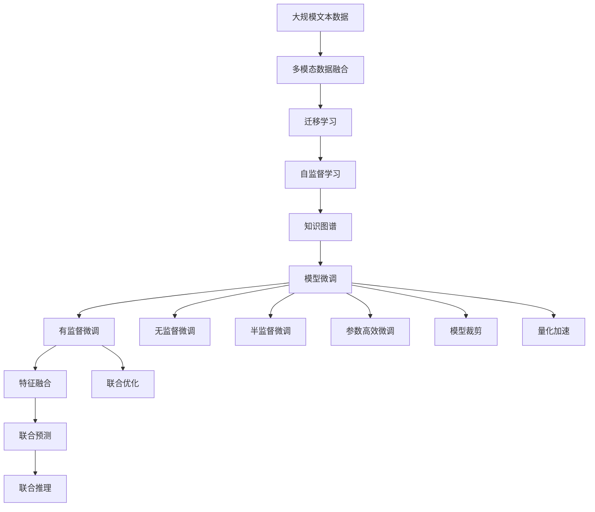

                 

# 基础模型的潜在下游应用

> 关键词：基础模型,下游任务,多模态数据,迁移学习,自监督学习,知识图谱,模型微调

## 1. 背景介绍

### 1.1 问题由来
随着深度学习技术的快速发展，大模型已经成为了AI领域的重要基石。从简单的线性回归模型到复杂的深度神经网络，模型的训练数据量、结构复杂度和表现能力都得到了显著提升。然而，大模型并非无所不能，它们仍然面临着诸多挑战和限制。

首先，基础模型的训练往往需要大量标注数据和计算资源，训练成本高昂。其次，模型的泛化能力和迁移能力不足，难以适应不同的任务和数据分布。此外，模型的可解释性和鲁棒性也存在问题，导致其在实际应用中受到限制。

为了解决这些问题，研究者们开始探索大模型的潜在下游应用。这些应用不仅能够充分利用大模型的强大能力，还能够在资源有限的情况下实现最优的效果。本文将详细介绍这些潜在的下游应用，包括多模态数据融合、迁移学习、自监督学习、知识图谱等方向，为读者提供全面的技术指引。

### 1.2 问题核心关键点
本文聚焦于基础模型的下游应用，旨在探讨如何在大模型的基础上，针对特定任务进行优化，实现更好的性能。这些下游应用包括但不限于：

- 多模态数据融合：将多种数据类型（如文本、图像、音频等）进行联合建模，提高模型对复杂场景的理解能力。
- 迁移学习：通过在预训练模型上进行微调，使其能够快速适应新任务，降低标注数据需求。
- 自监督学习：利用未标注数据进行预训练，学习通用知识，然后微调成特定任务。
- 知识图谱：构建基于图结构的语义知识网络，增强模型的知识抽取和推理能力。

这些下游应用不仅能够提升基础模型的表现，还能拓展其应用范围，为不同领域的AI应用提供支撑。

### 1.3 问题研究意义
探索基础模型的下游应用，对于AI技术的发展和落地具有重要意义：

- 降低开发成本：利用大模型的预训练能力，可以大幅降低标注数据和计算资源的投入，提高模型的开发效率。
- 提升模型性能：通过有针对性地微调和优化，可以显著提升模型在特定任务上的表现。
- 拓展应用范围：多种下游应用方向能够拓展大模型的应用场景，推动AI技术在更多领域的应用。
- 加速技术创新：下游应用的研究能够促进大模型技术的不断进步，催生新的研究方向和算法。
- 赋能产业升级：基础模型的下游应用为传统行业数字化转型提供了新的技术路径，推动产业的智能化升级。

## 2. 核心概念与联系

### 2.1 核心概念概述

为更好地理解基础模型的下游应用，本节将介绍几个密切相关的核心概念：

- 基础模型：以自回归(如LSTM、GRU)或自编码(如卷积神经网络)模型为代表的通用深度学习模型。通过在大规模无标签文本语料上进行预训练，学习通用的语言知识，具备强大的语言理解和生成能力。

- 多模态数据融合：将不同类型的数据（如文本、图像、音频等）进行联合建模，提高模型对复杂场景的理解能力。常见的方法包括数据对齐、特征融合、联合优化等。

- 迁移学习：通过在预训练模型上进行微调，使其能够快速适应新任务，降低标注数据需求。常见的方法包括全参数微调、参数高效微调、适配器微调等。

- 自监督学习：利用未标注数据进行预训练，学习通用知识，然后微调成特定任务。常见的方法包括掩码语言模型、预测任务、生成任务等。

- 知识图谱：构建基于图结构的语义知识网络，增强模型的知识抽取和推理能力。常见的方法包括知识融合、知识推理、图神经网络等。

- 模型微调：在大模型的基础上，通过有监督学习优化模型在特定任务上的性能。常见的方法包括有监督微调、无监督微调、半监督微调等。

这些核心概念之间的逻辑关系可以通过以下Mermaid流程图来展示：

这个流程图展示了大模型在多模态数据融合、迁移学习、自监督学习、知识图谱等不同方向的应用，以及相应的微调方法。通过理解这些核心概念，我们可以更好地把握大模型的应用框架，为后续深入讨论具体的下游应用提供基础。

### 2.2 概念间的关系

这些核心概念之间存在着紧密的联系，形成了大模型的应用生态系统。下面我们通过几个Mermaid流程图来展示这些概念之间的关系。

#### 2.2.1 基础模型的学习范式

这个流程图展示了大模型的四种学习范式：多模态数据融合、迁移学习、自监督学习、知识图谱等，以及相应的微调方法。通过理解这些概念的相互作用，可以更全面地把握大模型的应用前景。

#### 2.2.2 迁移学习与微调的关系

这个流程图展示了迁移学习的基本原理，以及它与微调的关系。迁移学习涉及源任务和目标任务，预训练模型在源任务上学习，然后通过微调适应各种下游任务（目标任务）。

#### 2.2.3 参数高效微调方法

这个流程图展示了几种常见的参数高效微调方法，包括适配器微调、提示微调、LoRA和BitFit。这些方法的共同特点是冻结大部分预训练参数，只更新少量参数，从而提高微调效率。

#### 2.2.4 知识图谱在大模型中的应用

这个流程图展示了知识图谱在大模型中的应用。知识图谱提供了一种结构化的语义知识表示方法，大模型可以通过融合和推理这些知识，增强自身的语义理解和推理能力。

### 2.3 核心概念的整体架构

最后，我们用一个综合的流程图来展示这些核心概念在大模型下游应用的整体架构：

这个综合流程图展示了从预训练到微调，再到知识融合和推理的完整过程。大模型首先在大规模文本数据上进行预训练，然后通过多模态数据融合、迁移学习、自监督学习、知识图谱等技术进行优化，最后通过模型微调实现特定任务的表现。

通过这些流程图，我们可以更清晰地理解大模型的应用过程及其各个环节的关系和作用，为后续深入讨论具体的下游应用提供基础。

## 3. 核心算法原理 & 具体操作步骤
### 3.1 算法原理概述

基础模型的下游应用主要聚焦于如何在大模型的基础上，针对特定任务进行优化，实现更好的性能。这些应用方向通常包括多模态数据融合、迁移学习、自监督学习、知识图谱等，其核心算法原理如下：

#### 3.1.1 多模态数据融合

多模态数据融合的目标是充分利用不同类型的数据（如文本、图像、音频等），提升模型对复杂场景的理解能力。其核心算法包括数据对齐、特征融合、联合优化等。

1. **数据对齐**：不同类型的数据具有不同的格式和结构，需要通过对齐技术将它们转换为统一的表示形式。例如，将文本转换为词嵌入，将图像转换为卷积特征等。

2. **特征融合**：将不同类型的数据的特征进行融合，生成一个综合的特征表示。常见的方法包括拼接、加权平均、融合网络等。

3. **联合优化**：在融合后的特征上，利用深度学习模型进行联合优化，生成最终的输出结果。常见的方法包括联合训练、联合预测、联合推理等。

#### 3.1.2 迁移学习

迁移学习的目标是通过在预训练模型上进行微调，使其能够快速适应新任务，降低标注数据需求。其核心算法包括全参数微调、参数高效微调、适配器微调等。

1. **全参数微调**：在预训练模型的基础上，添加任务特定的输出层和损失函数，然后利用标注数据进行有监督的微调。这种方法通常需要较大的标注数据量。

2. **参数高效微调**：只更新少量任务相关的参数，固定大部分预训练参数。这种方法可以在保持预训练能力的前提下，减少微调所需的时间和数据量。

3. **适配器微调**：通过添加可微调的适配器层，只微调该层中的参数，其他层保持不变。这种方法可以在特定任务上取得较好的性能，同时减少模型微调的时间和数据量。

#### 3.1.3 自监督学习

自监督学习的目标是通过利用未标注数据进行预训练，学习通用知识，然后微调成特定任务。其核心算法包括掩码语言模型、预测任务、生成任务等。

1. **掩码语言模型**：通过在输入文本中随机掩码部分词，让模型预测被掩码的词，学习词语的上下文关系。

2. **预测任务**：通过给模型提供部分标注信息，让其预测剩余的信息。例如，在文本分类任务中，模型需要根据部分文本预测整个文本的分类。

3. **生成任务**：通过让模型生成文本、图像等输出，学习数据的分布特性。例如，在文本生成任务中，模型需要生成给定上下文条件下的文本。

#### 3.1.4 知识图谱

知识图谱的目标是构建基于图结构的语义知识网络，增强模型的知识抽取和推理能力。其核心算法包括知识融合、知识推理、图神经网络等。

1. **知识融合**：将知识图谱中的结构化知识与文本数据进行融合，生成一个综合的知识表示。

2. **知识推理**：在融合后的知识表示上，利用图神经网络等模型进行推理，生成推理结果。

3. **图神经网络**：利用图结构对知识图谱进行建模，学习节点之间的关系，生成推理结果。

### 3.2 算法步骤详解

#### 3.2.1 多模态数据融合

1. **数据对齐**：
   - 将文本转换为词嵌入：利用BERT、GPT等模型对文本进行编码，生成词嵌入表示。
   - 将图像转换为卷积特征：利用CNN等模型对图像进行编码，生成卷积特征表示。
   - 将音频转换为声学特征：利用MFCC等技术对音频进行编码，生成声学特征表示。

2. **特征融合**：
   - 拼接：将不同类型的数据的特征进行拼接，生成一个综合的特征表示。例如，将文本和图像的特征拼接在一起。
   - 加权平均：对不同类型的数据的特征进行加权平均，生成一个综合的特征表示。例如，对文本和图像的特征进行加权平均。
   - 融合网络：使用特殊的融合网络，将不同类型的数据的特征进行融合，生成一个综合的特征表示。例如，使用Transformer模型对文本和图像的特征进行融合。

3. **联合优化**：
   - 联合训练：在融合后的特征上，利用深度学习模型进行联合训练，生成最终的输出结果。例如，在融合后的特征上训练一个BERT模型。
   - 联合预测：在融合后的特征上，利用深度学习模型进行联合预测，生成最终的输出结果。例如，在融合后的特征上预测文本分类。
   - 联合推理：在融合后的特征上，利用图神经网络等模型进行推理，生成推理结果。例如，在融合后的知识表示上进行推理，生成推理结果。

#### 3.2.2 迁移学习

1. **全参数微调**：
   - 添加任务特定的输出层和损失函数：在预训练模型的基础上，添加任务特定的输出层和损失函数，例如在文本分类任务中，添加线性分类器和交叉熵损失函数。
   - 利用标注数据进行有监督的微调：在预训练模型的基础上，利用标注数据进行有监督的微调，更新模型参数，优化任务性能。

2. **参数高效微调**：
   - 添加可微调的适配器层：在预训练模型的顶层添加可微调的适配器层，例如在BERT模型中，添加一个线性层进行分类。
   - 固定大部分预训练参数：在微调过程中，固定大部分预训练参数，只更新适配器层的参数，例如在BERT模型中，只微调线性层和softmax层的参数。
   - 利用小型标注数据进行微调：在微调过程中，利用小型标注数据进行微调，例如在文本分类任务中，利用几百个样本进行微调。

3. **适配器微调**：
   - 添加适配器层：在预训练模型的顶层添加适配器层，例如在BERT模型中，添加一个可微调的线性层。
   - 利用小型标注数据进行微调：在适配器层中，利用小型标注数据进行微调，例如在文本分类任务中，利用几百个样本进行微调。
   - 利用预训练权重进行初始化：在适配器层中，利用预训练权重进行初始化，例如在BERT模型中，利用BERT的预训练权重进行初始化。

#### 3.2.3 自监督学习

1. **掩码语言模型**：
   - 随机掩码部分词：在输入文本中随机掩码部分词，例如在BERT模型中，随机掩码20%的词。
   - 让模型预测被掩码的词：在掩码的词位上，让模型预测被掩码的词，例如在BERT模型中，让模型预测掩码的词。

2. **预测任务**：
   - 提供部分标注信息：给模型提供部分标注信息，例如在文本分类任务中，提供一部分文本和对应的分类标签。
   - 让模型预测剩余的信息：在提供的标注信息的基础上，让模型预测剩余的信息，例如在文本分类任务中，预测未标注文本的分类标签。

3. **生成任务**：
   - 提供上下文条件：给模型提供上下文条件，例如在文本生成任务中，提供一部分文本作为上下文。
   - 让模型生成输出：在提供的上下文条件下，让模型生成输出，例如在文本生成任务中，生成给定上下文条件下的文本。

#### 3.2.4 知识图谱

1. **知识融合**：
   - 将知识图谱中的结构化知识与文本数据进行融合：例如，将知识图谱中的节点和边与文本中的实体和关系进行融合。
   - 生成一个综合的知识表示：例如，生成一个综合的知识图谱表示，其中包含文本数据和知识图谱的融合信息。

2. **知识推理**：
   - 利用图神经网络等模型进行推理：例如，在融合后的知识图谱表示上，利用图神经网络进行推理，生成推理结果。
   - 生成推理结果：例如，在知识图谱上推理出新的关系和节点，例如推理出新的实体关系或节点。

### 3.3 算法优缺点

基础模型的下游应用主要聚焦于如何在大模型的基础上，针对特定任务进行优化，实现更好的性能。这些应用方向的优缺点如下：

#### 3.3.1 多模态数据融合

**优点**：
- 充分利用不同类型的数据，提高模型对复杂场景的理解能力。
- 可以提高模型的泛化能力和鲁棒性。

**缺点**：
- 数据对齐和特征融合的过程较为复杂，需要大量的预处理工作。
- 联合优化的过程较为耗时，需要较长的训练时间。

#### 3.3.2 迁移学习

**优点**：
- 可以充分利用预训练模型的强大能力，提高模型的泛化能力和鲁棒性。
- 可以显著降低标注数据需求，降低模型开发成本。

**缺点**：
- 微调过程可能会破坏预训练的权重，导致过拟合。
- 微调过程可能会引入偏见和有害信息，影响模型的公平性和安全性。

#### 3.3.3 自监督学习

**优点**：
- 可以利用未标注数据进行预训练，降低标注数据需求。
- 可以提高模型的泛化能力和鲁棒性。

**缺点**：
- 预训练过程较为耗时，需要较长的训练时间。
- 自监督学习的效果可能不如有监督学习。

#### 3.3.4 知识图谱

**优点**：
- 可以利用结构化的语义知识，提高模型的知识抽取和推理能力。
- 可以提高模型的泛化能力和鲁棒性。

**缺点**：
- 知识图谱的构建和融合过程较为复杂，需要大量的预处理工作。
- 知识图谱的推理过程较为耗时，需要较长的推理时间。

### 3.4 算法应用领域

基础模型的下游应用方向广泛，涵盖了多个领域，包括但不限于：

- 文本分类：例如，利用BERT模型进行新闻分类、情感分析等。
- 文本生成：例如，利用GPT模型进行机器翻译、文本摘要等。
- 图像分类：例如，利用ResNet模型进行图像分类、目标检测等。
- 语音识别：例如，利用Wav2Vec模型进行语音转文本等。
- 推荐系统：例如，利用矩阵分解模型进行个性化推荐。
- 知识图谱：例如，利用图神经网络进行知识推理、关系抽取等。
- 自然语言处理：例如，利用Transformer模型进行语言建模、问答系统等。

这些应用方向不仅拓展了大模型的应用范围，还推动了AI技术在各个领域的发展。

## 4. 数学模型和公式 & 详细讲解 & 举例说明

### 4.1 数学模型构建

#### 4.1.1 多模态数据融合

多模态数据融合的数学模型可以通过以下公式进行表示：

$$
\mathbf{X} = \begin{bmatrix}
\mathbf{X}^T_{text} \\
\mathbf{X}^T_{image} \\
\mathbf{X}^T_{audio}
\end{bmatrix}
$$

其中，$\mathbf{X}_{text}$、$\mathbf{X}_{image}$、$\mathbf{X}_{audio}$分别为文本、图像、音频的特征表示矩阵。

联合优化的数学模型可以通过以下公式进行表示：

$$
\mathcal{L}(\theta) = \mathcal{L}_{text}(\theta_{text}) + \mathcal{L}_{image}(\theta_{image}) + \mathcal{L}_{audio}(\theta_{audio})
$$

其中，$\mathcal{L}_{text}$、$\mathcal{L}_{image}$、$\mathcal{L}_{audio}$分别为文本、图像、音频的损失函数。

#### 4.1.2 迁移学习

全参数微调的数学模型可以通过以下公式进行表示：

$$
\theta^* = \mathop{\arg\min}_{\theta} \mathcal{L}(M_{\theta},D)
$$

其中，$\theta$为模型参数，$M_{\theta}$为预训练模型，$D$为标注数据集。

参数高效微调的数学模型可以通过以下公式进行表示：

$$
\theta^* = \mathop{\arg\min}_{\theta} \mathcal{L}(M_{\theta},D)
$$

其中，$\theta$为模型参数，$M_{\theta}$为预训练模型，$D$为标注数据集，$D_{freeze}$为冻结的预训练参数。

适配器微调的数学模型可以通过以下公式进行表示：

$$
\theta^* = \mathop{\arg\min}_{\theta} \mathcal{L}(M_{\theta},D)
$$

其中，$\theta$为模型参数，$M_{\theta}$为预训练模型，$D$为标注数据集，$D_{freeze}$为冻结的预训练参数。

#### 4.1.3 自监督学习

掩码语言模型的数学模型可以通过以下公式进行表示：

$$
\mathcal{L} = -\frac{1}{N} \sum_{i=1}^N \sum_{j=1}^M \mathbf{y}_i^j \log \mathbf{\hat{y}}_i^j
$$

其中，$\mathbf{y}_i^j$为掩码的标签，$\mathbf{\hat{y}}_i^j$为模型预测的掩码标签。

预测任务的数学模型可以通过以下公式进行表示：

$$
\mathcal{L} = -\frac{1}{N} \sum_{i=1}^N \sum_{j=1}^M \mathbf{y}_i^j \log \mathbf{\hat{y}}_i^j
$$

其中，$\mathbf{y}_i^j$为预测的标签，$\mathbf{\hat{y}}_i^j$为模型预测的标签。

生成任务的数学模型可以通过以下公式进行表示：

$$
\mathcal{L} = -\frac{1}{N} \sum_{i=1}^N \log P(\mathbf{y}_i | \mathbf{x}_i, \mathbf{z})
$$

其中，$\mathbf{y}_i$为生成的文本、图像等输出，$\mathbf{x}_i$为上下文条件，$\mathbf{z}$为模型参数。

#### 4.1.4 知识图谱

知识图谱的数学模型可以通过以下公式进行表示：

$$
\mathcal{L} = \sum_{(i,j,k)} \log \frac{P(r_{i,j,k})}{\sum_{r \neq r_{i,j,k}} P(r)}
$$

其中，$(i,j,k)$为三元组中的节点和关系，$P(r_{i,j,k})$为关系$r_{i,j,k}$的概率。

知识推理的数学模型可以通过以下公式进行表示：

$$
\mathcal{L} = -\frac{1}{N} \sum_{i=1}^N \log P(\mathbf{y}_i | \mathbf{x}_i, \mathbf{z})
$$

其中，$\mathbf{y}_i$为推理结果，$\mathbf{x}_i$为上下文条件，$\mathbf{z}$为模型参数。

### 4.2 公式推导过程

#### 4.2.1 多模态数据融合

多模态数据融合的公式推导如下：

$$
\mathbf{X} = \begin{bmatrix}
\mathbf{X}^T_{text} \\
\mathbf{X}^T_{image} \\
\mathbf{X}^T_{audio}
\end{bmatrix}
$$

其中，$\mathbf{X}_{text}$、$\mathbf{X}_{image}$、$\mathbf{X}_{audio}$分别为文本、图像、音频的特征表示矩阵。

联合优化的公式推导如下：

$$
\mathcal{L}(\theta) = \mathcal{L}_{text}(\theta_{text}) + \mathcal{L}_{image}(\theta_{image}) + \mathcal{L}_{audio}(\theta_{audio})
$$

其中，$\mathcal{L}_{text}$、$\mathcal{L}_{image}$、$\mathcal{L}_{audio}$分别为文本、图像、音频的损失函数。

#### 4.2.2 迁移学习

全参数微调的公式推导如下：

$$
\theta^* = \mathop{\arg\min}_{\theta} \mathcal{L}(M_{\theta},D)
$$

其中，$\theta$为模型参数，$M_{\theta}$为预训练模型，$D$为标注数据集。

参数高效微

